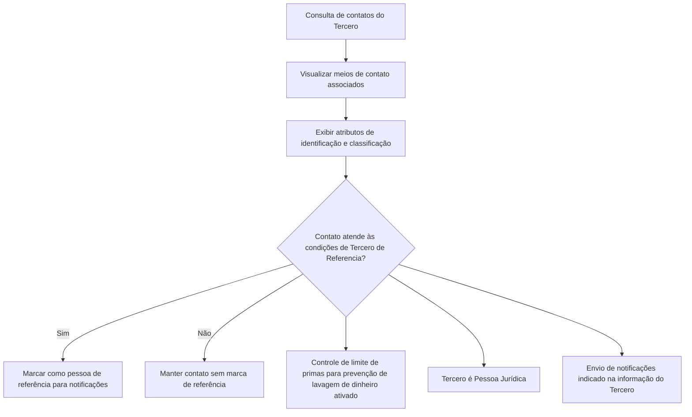

# Consulta de Contatos do Tercero — Especificação Funcional de Atributos e Regras

## 1. Metadados do Documento
- **Arquivo de Origem:** Não identificado
- **Tipo de Documento:** Manual Operacional / Especificação Funcional
- **Domínio / Sistema:** Consulta de contatos do Tercero
- **Público-Alvo:** Desenvolvedores, analistas funcionais, operação e negócio
- **Data/Versão Identificada:** Não identificada

---

## 2. Resumo Executivo & Contexto de Negócio

O documento descreve a funcionalidade de consulta dos contatos associados a um **Tercero**, com o objetivo explícito de visualizar os contatos existentes no sistema na data da consulta. A ação habilitada indicada é exclusivamente **CONSULTAR**.

A especificação define os atributos apresentados para cada meio de contato, incluindo uso, sequência, tipo, valor, identificação da pessoa de contato, cargo, departamento, país, relação e observações. Quando não houver especificação expressa dos campos, a visualização pode apresentar indistintamente informações de Pessoas Físicas e Pessoas Jurídicas.

O documento também estabelece regras para a classificação operacional dos meios de contato. Um meio pode ser marcado como padrão, prioritário, validado ou inabilitado, além de possuir uma data a partir da qual se torna plenamente operativo.

Há uma regra específica para identificar um contato como **Tercero de Referencia**, destinado ao recebimento de notificações. Essa marca depende simultaneamente da ativação do controle de limite de primas para prevenção de lavagem de dinheiro, da natureza jurídica do Tercero e da configuração de envio de notificações.

---

## 3. Arquitetura, Componentes & Tecnologias Envolvidas

O documento não descreve arquitetura de software, tecnologias, endpoints, microsserviços, bases de dados, integrações, ambientes ou contratos técnicos. O conteúdo concentra-se na visualização funcional de dados de contato de um Tercero.

**Componentes funcionais identificados:**

| Componente / Conceito | Função documentada |
| :--- | :--- |
| Consulta de contatos | Visualiza os contatos do Tercero na data de consulta. |
| Tercero | Entidade à qual os meios de contato e pessoas de contato estão associados. |
| Medio de Contacto | Informação de contato vinculada ao Tercero, com uso, tipo, valor e indicadores operacionais. |
| Pessoa de Contato | Pessoa identificada como meio de contato do Tercero. |
| Catálogo de Cargos | Relação de valores possíveis para identificação do posto/cargo do contato. |
| Catálogo de Departamentos de Empresas | Relação de valores possíveis para departamento ou seção do contato. |
| Catálogo de Países | Relação de valores possíveis para o primeiro nível da estrutura geográfica associada ao meio de contato. |
| Configuração da Companhia | Configuração que pode ativar o controle de limite de primas para prevenção de lavagem de dinheiro. |



> **Nota de Análise:** o documento não detalha telas, métodos HTTP, contratos JSON, persistência dos dados, perfis de acesso, APIs, tecnologias ou fluxos de integração.

---

## 4. Regras de Negócio, Especificações Funcionais & Processos

### Objetivo funcional
- Visualizar os contatos do Tercero existentes no sistema na data da consulta.
- A ação habilitada no conteúdo é **CONSULTAR**.

### Escopo de visualização
- Os atributos devem ser visualizados da esquerda para a direita e de cima para baixo.
- Caso os campos não sejam especificados ou indicados expressamente, podem ser exibidas indistintamente informações de Pessoas Físicas e Pessoas Jurídicas.

### Regras para Tercero de Referencia
Um contato é considerado **Tercero de Referencia**, isto é, a pessoa para a qual devem ser enviadas as notificações correspondentes, somente quando todas as condições abaixo forem atendidas:

1. O Controle no Límite de Primas para Prevenção de Lavagem de Dinheiro está ativado na Configuração da Companhia.
2. O Tercero em captura é uma Pessoa Jurídica.
3. A informação do Tercero indica que notificações devem ser enviadas.

### Regras para Medio de Contacto por Defecto
- Aplica-se aos Terceros que possuem mais de um meio de contato associado.
- Indica qual meio de contato deve ser considerado como padrão nos processos operacionais e/ou aplicações da entidade.
- Somente um meio de contato pode estar identificado e marcado como padrão para cada uso dos meios de contato atribuídos.

### Regras para Medio de Contacto Prioritario
- Aplica-se aos Terceros que possuem mais de um meio de contato associado.
- Indica o meio de contato que deve ser considerado preferencialmente nos processos operacionais da entidade.
- Somente um meio de contato pode ser identificado como prioritário considerando o total de meios de contato do Tercero.

### Regras de qualidade, vigência e disponibilidade
- **Medio de Contacto Validado:** informa se o meio de contato foi efetivamente validado pela entidade seguradora para classificar a qualidade da informação registrada.
- **Inhabilitación:** informa se o meio de contato associado ao Tercero deixou de estar vigente e, por isso, deve ser considerado nos processos internos da entidade.
- **Fecha de Validez:** mostra a data a partir da qual o meio de contato está, ou estará, plenamente operativo.
- **Observaciones:** apresenta, em texto plano, informações que ampliam ou detalham o meio de contato no seu processo de alta.

---

## 5. Tabelas de Parâmetros, Ambientes e Estruturas de Dados

| Item / Parâmetro | Descrição / Função | Tipo / Valores / Formato | Ambiente / Observações |
| :--- | :--- | :--- | :--- |
| Uso del Medio de Contacto | Contém o valor do uso do meio de contato do Tercero. | Valor de uso não detalhado. | Associado ao meio de contato do Tercero. |
| Secuencia del Medio de Contacto | Mostra o número de sequência do meio de contato do Tercero. | Valor atribuído automaticamente pelo sistema durante a captura. | Não é detalhado o formato numérico. |
| Tipo del Medio de Contacto | Exibe a tipologia do meio de contato do Tercero. | Tipologia não detalhada. | Depende dos tipos definidos pelo sistema. |
| Clave/valor del Medio de Contacto | Contém o valor real do tipo de meio de contato. | Valor conforme o tipo de meio definido. | Não são fornecidos exemplos de valores. |
| Nombre del Medio de Contacto | Contém o nome ou os nomes da pessoa que atua como meio de contato. | Texto. | Aplicável à pessoa de contato. |
| Primer y Segundo Apellido del Contacto | Mostra o sobrenome ou os sobrenomes da pessoa que atua como meio de contato. | Texto. | Aplicável à pessoa de contato. |
| Tipo Documento | Apresenta o tipo de documento utilizado para identificar a pessoa física ou jurídica como contato. | Tipo de documento não detalhado. | Pode se aplicar a Pessoa Física ou Pessoa Jurídica. |
| Clave del Documento | Contém a chave do documento que identifica a pessoa de contato. | Chave de identificação não detalhada. | Vinculada ao documento do contato. |
| Tipo de Cargo en la Empresa | Mostra, quando aplicável, a classificação do cargo da pessoa na empresa associada à pessoa de contato. | Valor de classificação não detalhado. | Exibido “em seu caso”, conforme aplicabilidade. |
| Cargo/Actividad del Contacto | Exibe o código do posto que identifica o contato do Tercero. | Código pertencente ao catálogo de cargos do sistema. | Baseado na relação de valores possíveis do catálogo de cargos. |
| Departamento del Contacto | Mostra o código do departamento ou seção que identifica o contato do Tercero. | Código pertencente ao catálogo de departamentos de empresas. | Baseado na relação de valores possíveis do catálogo do sistema. |
| Clave del País | Mostra, quando aplicável, o código do primeiro nível da estrutura geográfica: países. | Código de país. | Associado ao meio de contato e ao catálogo de países do sistema. |
| Relación | Texto livre usado na captura da informação do Tercero para detalhar ou ampliar a informação do departamento ou a relação do contato com o Tercero. | Texto livre. | Pode complementar departamento ou vínculo do contato. |
| Tercero de Referencia | Determina que o contato é a pessoa de referência para recebimento de notificações. | Marca / indicador. | Depende das três condições documentadas para prevenção de lavagem de dinheiro, Pessoa Jurídica e envio de notificações. |
| Medio de Contacto por Defecto | Indica o meio de contato a considerar como padrão nos processos operacionais e/ou aplicações da entidade. | Marca / indicador. | Apenas um por uso de meio de contato atribuído. |
| Medio de Contacto Prioritario | Indica o meio de contato a considerar preferencialmente nos processos operacionais da entidade. | Marca / indicador. | Apenas um para o total de meios de contato do Tercero. |
| Medio de Contacto Validado | Indica se o meio de contato foi efetivamente validado pela entidade seguradora. | Indicador de validação. | Usado para classificar a qualidade da informação capturada. |
| Inhabilitación | Estabelece se o meio de contato deixou de estar em vigor. | Indicador de inabilitação. | Deve ser considerado nos processos internos da entidade. |
| Fecha de Validez | Visualiza a data a partir da qual o meio de contato está ou estará plenamente operativo. | Data. | Não é informado o formato da data. |
| Observaciones | Exibe observações usadas para ampliar ou detalhar a informação do meio de contato no processo de alta. | Texto plano. | Não é detalhado limite de tamanho ou estrutura do texto. |

> **Nota de Análise:** o documento não apresenta URLs, servidores, ambientes, rotas de log, variáveis de configuração, tipos técnicos de dados, obrigatoriedade de campos ou valores permitidos dos catálogos.

---

## 6. Bateria de Perguntas & Respostas para RAG (FAQ Sintético)

### P1: Qual é o objetivo da funcionalidade de consulta de contatos do Tercero?
**R:** A funcionalidade tem como objetivo visualizar os contatos do Tercero registrados no sistema na data em que a consulta é realizada. A ação habilitada indicada pelo documento é CONSULTAR.

### P2: A consulta de contatos diferencia informações de Pessoas Físicas e Pessoas Jurídicas?
**R:** Quando os campos não forem especificados ou indicados expressamente, a consulta pode visualizar indistintamente informações de Pessoas Físicas e Pessoas Jurídicas.

### P3: Como é definido o número de sequência de um meio de contato?
**R:** A Secuencia del Medio de Contacto apresenta o número de sequência do meio de contato do Tercero. Esse valor é atribuído automaticamente pelo sistema durante o processo de captura.

### P4: O que representa o campo Clave/valor del Medio de Contacto?
**R:** O campo Clave/valor del Medio de Contacto contém o valor real do tipo de meio de contato, de acordo com o tipo de meio definido no sistema.

### P5: De onde vêm os valores de Cargo/Actividad del Contacto?
**R:** O campo Cargo/Actividad del Contacto apresenta o código do posto que identifica o contato do Tercero. Os valores possíveis são definidos no catálogo de cargos do sistema.

### P6: Como é determinado o Departamento del Contacto?
**R:** O Departamento del Contacto mostra o código do departamento ou seção associado ao contato do Tercero. Os possíveis valores dependem do catálogo de departamentos de empresas do sistema.

### P7: Quais condições devem ser cumpridas para um contato ser marcado como Tercero de Referencia?
**R:** O contato é marcado como Tercero de Referencia quando o controle de limite de primas para prevenção de lavagem de dinheiro está ativado na configuração da companhia, o Tercero é uma Pessoa Jurídica e existe indicação de que notificações devem ser enviadas ao Tercero.

### P8: O que significa Medio de Contacto por Defecto?
**R:** Medio de Contacto por Defecto é o meio que deve ser utilizado como padrão pelos processos operacionais e/ou aplicações da entidade quando o Tercero possui mais de um meio de contato. Só pode existir um meio padrão para cada uso de meio de contato atribuído.

### P9: Quantos meios de contato prioritários um Tercero pode possuir?
**R:** O Tercero pode possuir somente um Medio de Contacto Prioritario para o total de seus meios de contato. Esse meio deve ser considerado preferencialmente nos processos operacionais da entidade.

### P10: O que informa o campo Medio de Contacto Validado?
**R:** Medio de Contacto Validado informa se o meio de contato foi efetivamente validado pela entidade seguradora. A validação é usada para classificar a qualidade das informações capturadas no sistema.

### P11: Qual é o efeito da Inhabilitación de um meio de contato?
**R:** A Inhabilitación indica que o meio de contato associado ao Tercero deixou de estar vigente. Essa condição deve ser considerada pelos processos internos da entidade.

### P12: O que representa a Fecha de Validez de um meio de contato?
**R:** A Fecha de Validez mostra a data a partir da qual o meio de contato está plenamente operativo ou passará a estar plenamente operativo.

### P13: Para que serve o campo Relación?
**R:** Relación é um campo de texto livre utilizado na captura da informação do Tercero para detalhar ou ampliar as informações relativas ao departamento do contato ou ao vínculo existente entre o contato e o Tercero.

### P14: O documento descreve APIs, métodos HTTP ou contratos JSON para consultar contatos?
**R:** Não. O documento descreve atributos funcionais e regras de classificação dos meios de contato, mas não detalha APIs, métodos HTTP, contratos JSON, tecnologias, endpoints ou integrações técnicas.

---

## 7. Glossário de Termos, Siglas & Conceitos-Chave

- **Tercero:** entidade cujos contatos e meios de contato são consultados no sistema.
- **Pessoa Física:** categoria de pessoa mencionada como possível origem das informações visualizadas.
- **Pessoa Jurídica:** categoria de Tercero que participa da regra para definição de Tercero de Referencia.
- **Medio de Contacto:** meio de contato associado ao Tercero, identificado por uso, sequência, tipo, valor e indicadores operacionais.
- **Tercero de Referencia:** contato identificado como pessoa de referência para recebimento de notificações, condicionado às regras documentadas.
- **Medio de Contacto por Defecto:** meio de contato padrão para processos operacionais e/ou aplicações da entidade.
- **Medio de Contacto Prioritario:** meio de contato a ser considerado preferencialmente nos processos operacionais da entidade.
- **Medio de Contacto Validado:** meio de contato efetivamente validado pela entidade seguradora para qualificação da informação.
- **Inhabilitación:** condição que indica que o meio de contato deixou de estar vigente.
- **Fecha de Validez:** data a partir da qual o meio de contato se encontra ou se encontrará plenamente operativo.
- **Control en el Límite de Primas para la Prevención del Lavado de Dinero:** controle configurável da companhia, citado como condição para designar um Tercero de Referencia.
- **Catálogo de Cargos:** catálogo do sistema que contém valores possíveis para o posto ou cargo do contato.
- **Catálogo de Departamentos de Empresas:** catálogo do sistema que contém valores possíveis para departamento ou seção do contato.
- **Catálogo de Países:** catálogo do sistema com valores possíveis para países, primeiro nível da estrutura geográfica.

---

## 8. Notas Críticas, Riscos & Limitações

- O documento não identifica o arquivo de origem, versão, data, autor, sistema proprietário ou ambiente de execução.
- O documento não define tecnologias, componentes técnicos, integrações, serviços, bancos de dados, APIs, métodos HTTP, contratos JSON ou mecanismos de autenticação.
- Não são fornecidos os valores permitidos para uso, tipo de meio de contato, tipo de documento, cargo, departamento ou país.
- Não são detalhados formatos técnicos para data, código, chave de documento ou campos textuais.
- A expressão “de izquierda a derecha y de arriba hacia abajo” sugere uma ordem de apresentação visual, porém não fornece uma matriz completa de layout ou tela.
- A regra de Tercero de Referencia depende de configurações e dados externos à consulta: configuração da companhia, natureza jurídica do Tercero e indicação de envio de notificações.
- Não há detalhamento sobre o comportamento de meios inabilitados, não validados, futuros ou sem data de validade nos processos operacionais.
- Não é informado se as marcações padrão, prioritária, validada e inabilitada podem coexistir no mesmo meio de contato.

---

## 9. Conteúdo Bruto Estruturado (Referência Fiel)

```text
--- [PÁGINA 1 DE 4] ---

CONSULTAR los Contactos del Tercero
Objetivo
Visualizar los contactos del Tercero en el sistema a la fecha de consulta.
Acciones habilitadas
 CONSULTAR ( )
Contactos
De izquierda a derecha y de arriba hacia abajo, los siguientes atributos determinan la secuencia de
visualización de la Información.
Si no se especifica o indica expresamente los campos visualizarán indistintamente información de las
Personas Físicas y de las Personas Jurídicas.
 / 
 RS
Inicio Soluciones APIs Documentación Zeus
ES


--- [PÁGINA 2 DE 4] ---

Uso del Medio de Contacto
Este atributo contiene el valor del Uso del medio de Contacto del Tercero.
Secuencia del Medio de Contacto
Este dato muestra el Número de Secuencia del Medio de Contacto del Tercero siendo un valor que el
Sistema asignó automáticamente en el proceso de captura.
Tipo del Medio de Contacto
Este atributo visualiza la tipología del medio de contacto del Tercero.
Clave/valor del Medio de Contacto
Este Atributo contiene el valor real del Tipo del Medio de Contacto (de acuerdo con el tipo de medio
definido)
Nombre del Medio de Contacto
Este campo contiene el Nombre o los Nombres de la Persona que actúa como Medio de Contacto.
Primer y Segundo Apellido del Contacto
Este dato muestra el Apellido o los Apellidos de la Persona que actúa como Medio de Contacto.
Tipo Documento
Este campo observa el tipo de documento con el que se identificó a la persona física o jurídica como
contacto.
Clave del Documento
Este otro dato contiene la clave del documento que identifica a la Persona del Contacto.
Tipo de Cargo en la Empresa
Este dato en su caso mostrará el valor de la clasificación del cargo de las Persona en la Empresa,
asociado a la Persona de Contacto.
Cargo/Actividad del Contacto
Este campo visualiza el código del Puesto con el que se identifica el contacto del Tercero de acuerdo
con la relación de posibles valores existentes en el catálogo de Cargos del Sistema.
Departamento del Contacto


--- [PÁGINA 3 DE 4] ---

Este Campo muestra el código del departamento o sección con el que se identificó el contacto del
Tercero, de acuerdo con la relación de posibles valores existentes en el catálogo de Departamentos
de Empresas del Sistema.
Clave del País
Este Campo, en su caso, muestra el código del primer nivel de la estructura Geográfica (países)
asociado al Medio de Contacto del Tercero y de acuerdo con la relación de posibles valores
existentes en el catálogo de Países existente en el Sistema.
Relación
Esta cualidad se utilizó en la captura de la información del Tercero como texto libre para detallar o
ampliar la información relativa al Departamento del Contacto o la relación del Contacto con el
Tercero.
Tercero de Referencia
Esta marca determina que el Contacto es la Persona de Referencia (a la que se deben enviar las
notificaciones correspondientes) en el caso que se cumplan:
El Control en el Límite de Primas para la Prevención del Lavado de Dinero esté activado en la
Configuración de la Compañía.
El Tercero que se esté capturando sea una Persona Jurídica y además se haya indicado en la
Información del Tercero que se le han de enviar notificaciones.
Medio de Contacto por Defecto
Este campo, en aquellos Terceros que tienen más de un medio de Contacto asociado, indicará cual
de ellos es el que se debe considerar por defecto en los Procesos Operativos y/o Aplicaciones de la
Entidad.
Solamente puede haber uno identificado y marcado como tal por cada Uso de los Medios de
Contacto asignados.
Medio de Contacto Prioritario
Este Campo, en aquellos Terceros que tienen más de un medio de Contacto asociado, va a indicar
cual de ellos es el que se ha de considerar preferentemente en los Procesos Operativos de la
Entidad.
Solamente puede haber uno identificado como tal para el total de Medios de Contacto del Tercero
Medio de Contacto Validado


--- [PÁGINA 4 DE 4] ---

Este Dato indica si el Medio de Contacto ha sido efectivamente validado por parte de la entidad
aseguradora a efectos de clasificar la calidad de la información capturada en el Sistema.
Inhabilitación
Este campo establece si el Medio de Contacto asociado al Tercero ha dejado de estar en vigor y por
ello debería ser considerado en los procesos internos de la entidad.
Fecha de Validez
Esta propiedad visualiza la fecha a partir de la cual el Medio de Contacto está o va a estar
plenamente operativo.
Observaciones
Se visualizan las observaciones, como texto plano, que permitieron ampliar o detallar la información
del Medio de Contacto del Tercero en su proceso de alta.
```
