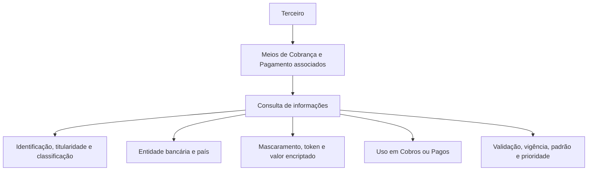

# Consulta de Meios de Cobrança e Pagamento Associados a Terceiros

## 1. Metadados do Documento
- **Arquivo de Origem:** Não identificado no conteúdo fornecido
- **Tipo de Documento:** Manual Operacional
- **Domínio / Sistema:** Gestão de Terceiros, Meios de Cobrança e Pagamento, Operativa de Tesouraria
- **Público-Alvo:** Operação, Negócio, Analistas Funcionais e Desenvolvedores
- **Data/Versão Identificada:** Não identificada

---

## 2. Resumo Executivo & Contexto de Negócio

O documento descreve a funcionalidade de consulta dos Meios de Cobrança e Pagamento associados a um Terceiro. O objetivo declarado é permitir a visualização de informações relacionadas a contas, cartões e outros meios vinculados ao Terceiro.

A ação habilitada pela funcionalidade é exclusivamente **CONSULTAR**. O conteúdo não descreve operações de criação, alteração, exclusão, validação ou inabilitação executadas pela tela ou funcionalidade apresentada.

A consulta disponibiliza atributos de identificação, classificação, entidade bancária, país, titularidade, tokenização, mascaramento, criptografia, moeda, vencimento, sequência, uso operacional, validação, prioridade, padrão, inabilitação e data de validade.

O documento também estabelece regras de unicidade relevantes para a operação corporativa: somente um Meio de Cobrança/Pagamento pode estar marcado como padrão entre todos os meios associados a um Terceiro; adicionalmente, somente um meio pode estar marcado como prioritário para cada Tipo de Meio de Cobrança/Pagamento.

---

## 3. Arquitetura, Componentes & Tecnologias Envolvidas

O conteúdo fornecido não identifica tecnologias, microsserviços, APIs, URLs, bancos de dados, ambientes, protocolos, contratos JSON, métodos HTTP ou componentes de infraestrutura.

Os elementos funcionais identificados são:

| Componente / Conceito | Papel descrito |
| :--- | :--- |
| Terceiro | Entidade à qual os Meios de Cobrança e Pagamento estão associados. |
| Meio de Cobrança/Pagamento | Meio utilizado para Cobros ou Pagos, como cartão ou conta corrente. |
| Entidade Bancária | Entidade à qual pertence o Meio de Cobrança/Pagamento. |
| Catálogo de Entidades Bancárias | Catálogo do sistema que contém possíveis valores de Entidades Bancárias. |
| Catálogo Mestre de Países | Catálogo do sistema que contém possíveis valores de países. |
| Entidade Seguradora | Entidade responsável pela validação do Meio de Cobrança/Pagamento para fins de qualidade de dados. |
| Operativa de Tesouraria | Contexto no qual o Tipo de Uso do Movimento determina o uso sem restrição do meio. |
| Processos Operativos da Entidade | Processos que usam os indicadores de meio padrão e meio prioritário. |



> **Nota de Análise:** O diagrama representa somente a relação funcional explicitamente descrita. O documento não detalha a arquitetura técnica, os serviços responsáveis pela consulta ou o fluxo de integração entre sistemas.

---

## 4. Regras de Negócio, Especificações Funcionais & Processos

### Objetivo funcional

A funcionalidade permite visualizar os Meios de Cobrança e Pagamento associados a um Terceiro, incluindo exemplos como contas e cartões.

### Ação habilitada

A única ação explicitamente habilitada é:

- **CONSULTAR**

### Ordem de visualização

O documento informa que, da esquerda para a direita e de cima para baixo, os atributos determinam a sequência de visualização da informação. Não é apresentada uma especificação visual adicional para a tela.

### Regras sobre valor do Meio de Cobrança/Pagamento

- O campo **Valor do Meio Cobro/Pago** identifica o valor real do meio.
- Para um cartão, o valor real corresponde ao número do cartão.
- Para uma conta corrente, o valor real corresponde ao número da conta.
- O campo **Valor Enmascarado** exibe o valor conforme o tipo de mascaramento contemplado para o meio.
- O campo **Valor Encriptado do Meio Cobro/Pago** exibe, de maneira criptografada, o valor do meio.

### Regras sobre associação bancária e geográfica

- A **Entidade Bancária** corresponde ao código da entidade bancária à qual pertence o Meio de Cobrança/Pagamento do Terceiro.
- Os valores possíveis da Entidade Bancária são relacionados ao catálogo de Entidades Bancárias do sistema.
- A **Chave do País** corresponde ao código do primeiro nível da estrutura geográfica, isto é, países.
- A Chave do País identifica a localização da Entidade Bancária associada ao Meio de Cobrança/Pagamento.
- Os valores possíveis para a Chave do País estão no catálogo mestre de Países do sistema.

### Regras de utilização operacional

- O campo **Tipo de Movimento** identifica se o Meio de Cobrança/Pagamento é utilizado para realizar Cobros ou Pagos.
- O campo **Tipo Uso do Movimento** indica o uso para o qual o Meio de Cobrança/Pagamento pode ser empregado sem restrição, de acordo com a gestão e o controle da Operativa de Tesouraria da Entidade.
- O campo **Moeda** apresenta o código da moeda do Meio de Cobrança/Pagamento.

### Regras de sequência e vencimento

- O campo **Secuencia/Orden** apresenta o número de sequência do Meio de Cobrança/Pagamento associado ao Terceiro.
- A sequência é atribuída automaticamente pelo sistema no momento da alta.
- O campo **Mes Vencimiento** contém o mês de vencimento do Meio de Cobrança/Pagamento.
- O campo **Año Vencimiento** apresenta o ano de vencimento do Meio de Cobrança/Pagamento.

### Regras de validação e qualidade de dados

- O campo **Medio Cobro/Pago Validado** indica se o Meio de Cobrança/Pagamento foi validado ou não.
- A validação é realizada pela entidade seguradora para fins de qualidade de dados.

### Regra de Meio de Cobrança/Pagamento por Defeito

- O campo **Medio Cobro/Pago por Defecto** indica, para Terceiros com mais de um meio associado, qual meio aparecerá por padrão nos Processos Operativos da Entidade.
- Somente pode existir **um** Meio de Cobrança/Pagamento identificado e marcado como padrão entre todos os Meios de Cobrança/Pagamento do Terceiro.

### Regra de inabilitação

- A propriedade **Inhabilitación** determina se o Meio de Cobrança/Pagamento associado ao Terceiro deixou de estar vigente.
- Um Meio de Cobrança/Pagamento inabilitado não deve ser considerado em nenhuma operativa da entidade seguradora que utilize os meios de Cobrança/Pagamento dos Terceiros.

### Regra de Meio de Cobrança/Pagamento prioritário

- O campo **Medio Cobro/Pago Prioritario** indica, para Terceiros com mais de um meio associado, qual meio deve ser considerado preferencialmente nos Processos Operativos da Entidade.
- Somente pode existir **um** Meio de Cobrança/Pagamento marcado como prioritário para cada Tipo de Meio de Cobrança/Pagamento.

### Regra de vigência

- A **Fecha de Validez** informa a data a partir da qual o Meio de Cobrança/Pagamento esteve, está ou estará operacional no sistema para todos os efeitos.

---

## 5. Tabelas de Parâmetros, Ambientes e Estruturas de Dados

| Item / Parâmetro | Descrição / Função | Tipo / Valores / Formato | Ambiente / Observações |
| :--- | :--- | :--- | :--- |
| Meio Cobro/Pago | Exibe o Meio de Cobrança/Pagamento. | Não especificado. | Associado ao Terceiro. |
| Classe do Meio de Cobrança/Pagamento | Exibe o valor da subdivisão dos Meios de Cobrança/Pagamento do Terceiro. | Não especificado. | Classificação do meio. |
| Tipo de Entidade Comercializadora | Exibe o código do Tipo de Entidade Comercializadora do meio associado. | Código. | Associado ao Meio de Cobrança/Pagamento do Terceiro. |
| Entidade Bancária | Exibe o código da entidade bancária à qual pertence o meio. | Código. | Valores relacionados ao catálogo de Entidades Bancárias do Sistema. |
| Chave do País | Contém o código do primeiro nível da estrutura geográfica onde foi identificada a localização da Entidade Bancária. | Código de país. | Valores relacionados ao catálogo mestre de Países do Sistema. |
| Titular | Identifica a pessoa titular do Meio de Cobrança/Pagamento. | Não especificado. | — |
| Valor Enmascarado | Exibe o valor conforme o tipo de mascaramento contemplado. | Valor mascarado. | — |
| Tipo de Token | Contém o código do tipo de token associado ao meio. | Código. | — |
| Token Meio Cobro/Pago | Exibe o código do token associado ao meio conforme o Tipo de Token. | Código. | — |
| Valor do Meio Cobro/Pago | Identifica o valor real do meio, como número de cartão ou número de conta corrente. | Não especificado. | Pode conter informação sensível. |
| Valor Encriptado do Meio Cobro/Pago | Exibe de maneira criptografada o valor do Meio de Cobrança/Pagamento. | Valor criptografado. | Pode conter informação sensível protegida. |
| Tipo de Movimento | Identifica se o meio é usado para Cobros ou Pagos. | Cobros ou Pagos. | — |
| Tipo Uso do Movimento | Exibe o uso para o qual o meio pode ser empregado sem restrição. | Não especificado. | Relacionado à Gestão e Controle da Operativa de Tesouraria. |
| Moeda | Exibe o código da moeda do meio. | Código de moeda. | — |
| Secuencia/Orden | Exibe o número de sequência do meio associado ao Terceiro. | Número de sequência. | Atribuído automaticamente pelo Sistema na alta. |
| Mes Vencimiento | Contém o mês de vencimento do meio. | Mês. | — |
| Año Vencimiento | Exibe o ano de vencimento do meio. | Ano. | — |
| Medio Cobro/Pago Validado | Informa se o meio foi validado para qualidade de dados. | Indicador de validado ou não validado. | Validação efetuada pela entidade seguradora. |
| Medio Cobro/Pago por Defecto | Indica o meio exibido por padrão nos Processos Operativos da Entidade. | Indicador. | Somente um meio padrão por Terceiro. |
| Inhabilitación | Indica se o meio deixou de estar vigente. | Indicador. | Meio inabilitado não deve ser utilizado nas operativas da entidade seguradora. |
| Medio Cobro/Pago Prioritario | Indica o meio preferencial nos Processos Operativos da Entidade. | Indicador. | Somente um meio prioritário por Tipo de Meio de Cobrança/Pagamento. |
| Fecha de Validez | Informa a data a partir da qual o meio esteve, está ou estará operacional. | Data. | Vigência operacional do meio no sistema. |

> **Nota de Análise:** O documento não informa tipos técnicos de dados, obrigatoriedade, tamanhos de campos, formatos de data, domínio completo de valores, endpoints, tabelas físicas ou regras de criptografia/tokenização.

---

## 6. Bateria de Perguntas & Respostas para RAG (FAQ Sintético)

### P1: Qual é o objetivo da funcionalidade de consulta de Meios de Cobrança e Pagamento?
**R:** O objetivo é visualizar as informações dos Meios de Cobrança e Pagamento associados a um Terceiro, incluindo contas, cartões e outros meios vinculados.

### P2: Quais ações estão habilitadas para os Meios de Cobrança e Pagamento no documento?
**R:** O documento informa exclusivamente a ação **CONSULTAR**. Não há descrição de ações de inclusão, alteração, exclusão ou inabilitação executadas pela funcionalidade.

### P3: O que representa o campo Valor do Meio de Cobrança/Pagamento?
**R:** O campo identifica o valor real do Meio de Cobrança/Pagamento. Para uma Tarjeta, corresponde ao número do cartão; para uma Cuenta Corriente, corresponde ao número da conta.

### P4: Qual é a diferença entre Valor Enmascarado e Valor Encriptado do Meio de Cobrança/Pagamento?
**R:** O Valor Enmascarado é exibido conforme o tipo de mascaramento previsto para o meio. O Valor Encriptado é apresentado de forma criptografada. O documento não detalha os algoritmos de criptografia nem os padrões de mascaramento utilizados.

### P5: Como é preenchida a Entidade Bancária de um Meio de Cobrança/Pagamento?
**R:** A Entidade Bancária mostra o código da entidade bancária à qual pertence o Meio de Cobrança/Pagamento do Terceiro. Os possíveis valores são relacionados ao catálogo de Entidades Bancárias do Sistema.

### P6: Qual é a origem dos valores permitidos para a Chave do País?
**R:** A Chave do País contém o código do primeiro nível da estrutura geográfica, países, que identifica a localização da Entidade Bancária. Os possíveis valores estão relacionados ao catálogo mestre de Países existente no Sistema.

### P7: Como o sistema distingue Meios de Cobrança/Pagamento usados para Cobros e Pagos?
**R:** O campo Tipo de Movimento identifica se o Meio de Cobrança/Pagamento é utilizado para realizar Cobros ou Pagos.

### P8: Como é atribuído o campo Secuencia/Orden?
**R:** Secuencia/Orden mostra o número de sequência do Meio de Cobrança/Pagamento associado ao Terceiro. O documento estabelece que esse valor é atribuído automaticamente pelo Sistema no momento da alta.

### P9: Quantos Meios de Cobrança/Pagamento podem estar marcados como padrão para um Terceiro?
**R:** Somente um Meio de Cobrança/Pagamento pode estar identificado e marcado como padrão entre todos os Meios de Cobrança/Pagamento associados ao mesmo Terceiro.

### P10: Quantos Meios de Cobrança/Pagamento prioritários podem existir?
**R:** Somente um Meio de Cobrança/Pagamento pode estar marcado como prioritário para cada Tipo de Meio de Cobrança/Pagamento.

### P11: O que ocorre quando um Meio de Cobrança/Pagamento está inabilitado?
**R:** A inabilitação indica que o meio deixou de estar vigente. Portanto, o meio não deve ser considerado em nenhuma operativa da entidade seguradora que utilize Meios de Cobrança/Pagamento dos Terceiros.

### P12: O que indica a Data de Validade do Meio de Cobrança/Pagamento?
**R:** A Fecha de Validez informa ao Sistema a data a partir da qual o Meio de Cobrança/Pagamento esteve, está ou estará operacional para todos os efeitos.

### P13: Para que serve o indicador Medio Cobro/Pago Validado?
**R:** O indicador mostra se o Meio de Cobrança/Pagamento foi validado ou não pela entidade seguradora para efeitos de qualidade de dados.

---

## 7. Glossário de Termos, Siglas & Conceitos-Chave

- **Terceiro:** Entidade à qual os Meios de Cobrança e Pagamento estão associados.
- **Meio de Cobrança/Pagamento:** Meio utilizado para Cobros ou Pagos; o documento cita cartões e contas como exemplos.
- **Cobros:** Operações de cobrança, conforme a classificação de Tipo de Movimento.
- **Pagos:** Operações de pagamento, conforme a classificação de Tipo de Movimento.
- **Entidade Bancária:** Entidade à qual pertence o Meio de Cobrança/Pagamento.
- **Entidade Comercializadora:** Entidade cujo tipo é identificado por código no Meio de Cobrança/Pagamento.
- **Token:** Código associado ao Meio de Cobrança/Pagamento de acordo com o Tipo de Token.
- **Mascaramento:** Forma de visualização do valor do meio conforme o tipo de mascaramento contemplado.
- **Valor Encriptado:** Representação criptografada do valor do Meio de Cobrança/Pagamento.
- **Operativa de Tesouraria:** Contexto de gestão e controle que define o uso sem restrição do meio.
- **Meio por Defeito:** Meio exibido por padrão nos Processos Operativos da Entidade.
- **Meio Prioritário:** Meio considerado preferencialmente nos Processos Operativos da Entidade.
- **Inabilitação:** Estado que indica que o meio deixou de estar em vigor.
- **Fecha de Validez:** Data a partir da qual o meio esteve, está ou estará operacional no sistema.

---

## 8. Notas Críticas, Riscos & Limitações

- O documento descreve uma funcionalidade de consulta, mas não apresenta detalhes técnicos de implementação, APIs, serviços, banco de dados, autenticação ou autorização.
- O documento não informa formatos de campos, tipos de dados, tamanhos máximos, regras de obrigatoriedade ou valores permitidos para os atributos.
- O documento cita catálogos de Entidades Bancárias e Países, porém não apresenta a estrutura, os códigos ou os responsáveis pela manutenção desses catálogos.
- Os campos de valor real, valor mascarado, valor criptografado e token podem envolver dados sensíveis; entretanto, o documento não especifica controles de acesso, estratégia de criptografia ou critérios de mascaramento.
- A unicidade do Meio por Defeito é definida por Terceiro, enquanto a unicidade do Meio Prioritário é definida por Tipo de Meio de Cobrança/Pagamento.
- A inabilitação impede o uso do meio nas operativas da entidade seguradora, mas o documento não detalha o processo que determina, registra ou reverte a inabilitação.
- Não há detalhamento sobre tratamento de meios vencidos, relação entre vencimento e inabilitação, ou validações realizadas antes do uso operacional.

---

## 9. Conteúdo Bruto Estruturado (Referência Fiel)

```text
--- [PÁGINA 1 DE 4] ---

CONSULTAR los Medios de Cobro y Pago del
Tercero
Objetivo
Visualizar la información de los Medios de Cobro y Pago (Cuentas, Tarjetas, ...) asociados al
Tercero.
Acciones habilitadas
 CONSULTAR ( )
Medios de Cobro y Pago
De izquierda a derecha y de arriba hacia abajo, los siguientes atributos determinan la secuencia de
visualización de la Información.
 / 
 RS
Inicio Soluciones APIs Documentación Zeus
ES


--- [PÁGINA 2 DE 4] ---

Medio Cobro/Pago
Este dato muestra el Medio de Cobro/Pago.
Clase del Medio de Cobro/Pago
Este dato muestra el valor de la Subdivisión de los Medios de Cobro/Pago del Tercero.
Tipo de Entidad Comercializadora
Este Campo visualiza el código del Tipo de Entidad Comercializadora del Medio de Cobro/Pago
asociado al Medio de Cobro/Pago del Tercero.
Entidad Bancaria
Este dato visualiza el código de la Entidad Bancaria a la que pertenece el Medio de Cobro/Pago del
Tercero, de acuerdo con la relación de posibles valores existentes en el catálogo de Entidades
Bancarias del Sistema.
Clave del País
Este dato contiene el código del primer nivel de la estructura Geográfica (países) en el que se
identificó la ubicación de la Entidad Bancaria del Medio de Cobro y Pago asociado al Tercero, de
acuerdo con la relación de posibles valores existentes en el catálogo maestro de Países existente en
el Sistema.
Titular
Este atributo identifica la persona Titular del Medio de Cobro/Pago.
Valor Enmascarado
Este campo visualiza el Valor del Medio de Cobro/Pago de acuerdo con el tipo de enmascaramiento
contemplado para el Medio de Cobro/Pago.
Tipo de Token
Este campo contiene el código del tipo de token del Medio de Cobro y Pago asociado al Tercero.
Token Medio Cobro Cobro/Pago
Este dato muestra el código del Token del Medio de Cobro y Pago asociado al Tercero de acuerdo
con el tipo de Token que tenga asociado.
Valor del Medio Cobro/Pago


--- [PÁGINA 3 DE 4] ---

Este dato identifica el Valor 'Real' del Medio de Cobro/Pago, es decir, si el Medio de Cobro/Pago es
una Tarjeta el número de la tarjeta, si es una Cuenta Corriente el número de la cuenta, etcétera.
Valor Encriptado del Medio Cobro/Pago
Este Atributo muestra de manera encriptada el valor del Medio de Cobro/Pago.
Tipo de Movimiento
Este campo identifica si el Medio de Cobro/Pago se utiliza para realizar Cobros o Pagos.
Tipo Uso del Movimiento
De acuerdo con la Gestión y Control en la Operativa de Tesorería de la Entidad, este dato muestra el
uso en el que el Medio de Cobro/Pago podrá ser empleado sin restricción.
Moneda
Este campo visualiza el código de la Moneda del Medio de Cobro/Pago.
Secuencia/Orden
Este dato muestra el número de secuencia del Medio de Cobro/Pago asociado al Tercero. Es un
valor que se asignó automáticamente por parte del Sistema en el alta.
Mes Vencimiento
Este campo contiene el Mes de Vencimiento del Medio de Cobro/Pago del Tercero.
Año Vencimiento
Este otro campo muestra el Año de Vencimiento del Medio de Cobro/Pago del Tercero.
Medio Cobro/Pago Validado
Este dato muestra e indica si el Medio de Cobro/Pago ha sido o no validado, a efectos de calidad del
dato, por la entidad aseguradora.
Medio Cobro/Pago por Defecto
Este Campo, en aquellos Terceros que tienen más de un medio de Cobro/Pago asociado, indicará
cual de ellos es el que aparecerá por defecto en los Procesos Operativos de la Entidad.
Solamente puede haber uno identificado y marcado como tal entre todos los Medios de
Cobro/Pago del Tercero.


--- [PÁGINA 4 DE 4] ---

Inhabilitación
Esta propiedad establece si el Medio de Cobro/Pago asociado al Tercero ha dejado de estar en vigor
y por tanto no debe ser considerado en ninguno de las operativas de la entidad aseguradora que
utilicen los medios de Cobro/Pago de los Terceros.
Medio Cobro/Pago Prioritario
Este Campo, en aquellos Terceros que tienen más de un medio de Cobro/Pago asociado, indicará
cual de ellos es el que se ha de considerar preferentemente en los Procesos Operativos de la
Entidad.
Solamente puede haber uno identificado y marcado como tal por cada Tipo de Medio de
Cobro/Pago.
Fecha de Validez
Esta propiedad le indica al sistema la fecha a partir de la cual el Medio de Cobro/Pago estuvo, está o
estará a todos los efectos operativo en el sistema.
```
