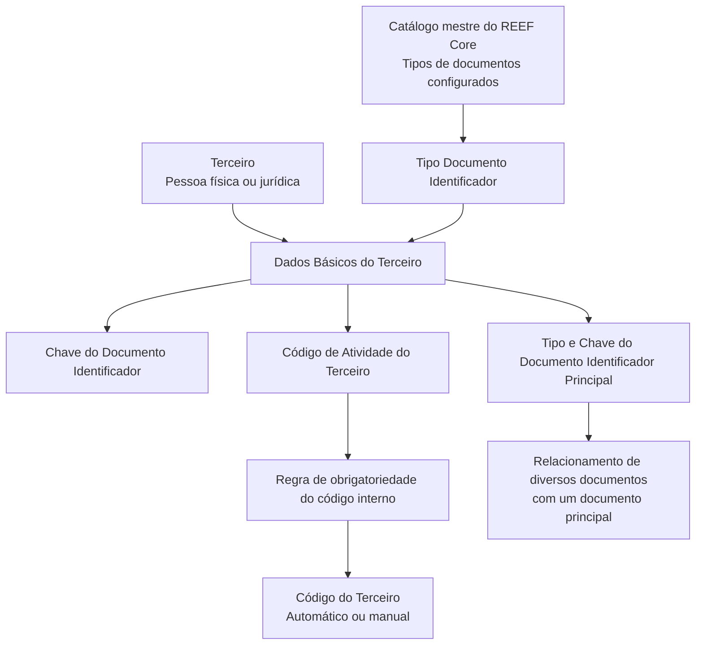

# Consulta de Dados Básicos de Terceiros no REEF Core

## 1. Metadados do Documento
- **Arquivo de Origem:** Não identificado
- **Tipo de Documento:** Manual Operacional
- **Domínio / Sistema:** REEF Core / Dados Básicos de Terceiros
- **Público-Alvo:** Operação, Negócio e usuários do sistema
- **Data/Versão Identificada:** Não identificada

---

## 2. Resumo Executivo & Contexto de Negócio

O documento descreve a funcionalidade **“Consultar Datos Básicos del Tercero”**, cujo objetivo é visualizar no sistema os dados identificadores de uma pessoa física ou jurídica classificada como Terceiro.

A ação habilitada para a funcionalidade é exclusivamente **CONSULTAR**. O conteúdo apresentado detalha atributos exibidos no painel ou colapsador de Dados Básicos, incluindo documentos identificadores, atividade, código interno e relacionamento entre documentos básicos e documentos principais.

A identificação do Terceiro depende de tipos de documentos previamente configurados no catálogo mestre do **REEF Core**. O sistema pode atribuir automaticamente ou permitir a atribuição manual de um código interno ao Terceiro, conforme regras associadas à atividade do Terceiro.

O documento também estabelece que múltiplos documentos de Terceiros podem ser relacionados a um documento principal, por meio da combinação entre tipo e chave do documento identificador principal.

---

## 3. Arquitetura, Componentes & Tecnologias Envolvidas

| Componente / Conceito | Papel identificado no documento |
| :--- | :--- |
| REEF Core | Sistema no qual ocorre a consulta dos Dados Básicos do Terceiro. |
| Dados Básicos | Painel ou seção que apresenta os atributos identificadores do Terceiro. |
| Catálogo mestre de REEF Core | Repositório de configuração prévia dos tipos de documentos identificadores. |
| Terceiro | Pessoa física ou jurídica identificada e consultada no sistema. |
| Atividade do Terceiro | Elemento que pode determinar a obrigatoriedade de atribuição de código interno. |
| Documento identificador principal | Documento usado como referência para relacionar diversos documentos de Terceiros. |



**Nota de Análise:** O documento não apresenta detalhes sobre métodos HTTP, contratos JSON, banco de dados, URLs, ambientes, autenticação, tecnologias de implementação ou integrações externas.

---

## 4. Regras de Negócio, Especificações Funcionais & Processos

### Objetivo funcional
A funcionalidade permite **visualizar os dados identificadores do Terceiro no sistema**.

### Ação habilitada
- A ação explicitamente habilitada é **CONSULTAR**.
- O documento não descreve ações de criação, edição, exclusão ou aprovação de Dados Básicos do Terceiro.

### Sequência de visualização
Os atributos de Dados Básicos devem ser visualizados conforme a sequência indicada no documento:
- Da esquerda para a direita.
- De cima para baixo.

### Tipo Documento Identificador
- O atributo apresenta o tipo de documento utilizado para identificar uma pessoa física ou jurídica.
- Os tipos disponíveis dependem da relação de tipos de documentos previamente configurados no catálogo mestre de REEF Core.

### Chave do Documento Identificador
- O atributo apresenta a chave do Terceiro.
- O documento não especifica formato, tamanho, unicidade ou algoritmo de validação da chave.

### Código de Atividade do Terceiro
- A propriedade informa o código associado à atividade do Terceiro.
- O documento não detalha o catálogo de atividades, formato do código ou regras de manutenção desse atributo.

### Código do Terceiro
O Código do Terceiro é o código interno do sistema e pode ser atribuído em duas modalidades:
1. **Automaticamente pelo sistema**, quando:
   - A atividade do Terceiro exige um código interno; e
   - A configuração determina que esse código seja atribuído pelo sistema.
2. **Manualmente**, quando:
   - A atividade do Terceiro determina a obrigatoriedade de atribuir um código ao Terceiro.

### Documento Identificador Principal
- O **Tipo Documento Identificador Principal** apresenta o tipo de documento principal relacionado ao tipo e à chave do documento do Terceiro.
- A **Chave do Documento Identificador Principal** apresenta a chave do documento principal usada para relacionar o tipo e a chave do documento do Terceiro.
- Essa estrutura permite conectar diversos documentos a um documento principal.

---

## 5. Tabelas de Parâmetros, Ambientes e Estruturas de Dados

| Item / Parâmetro | Descrição / Função | Tipo / Valores / Formato | Ambiente / Observações |
| :--- | :--- | :--- | :--- |
| Ação habilitada | Permite visualizar dados identificadores do Terceiro. | CONSULTAR | Não há outras ações documentadas. |
| Tipo Documento Identificador | Exibe o tipo de documento que identifica a pessoa física ou jurídica. | Tipos configurados no catálogo mestre de REEF Core | Requer configuração prévia no catálogo mestre. |
| Chave do Documento Identificador | Exibe a chave do Terceiro. | Não especificado | O documento não informa formato ou regras de validação. |
| Código de Atividade do Terceiro | Indica o código da atividade do Terceiro. | Não especificado | O catálogo ou formato de atividades não é detalhado. |
| Código do Terceiro | Código interno do sistema associado ao Terceiro. | Atribuição automática ou manual | A obrigatoriedade depende da atividade do Terceiro. |
| Tipo Documento Identificador Principal | Exibe o tipo do documento principal relacionado ao documento do Terceiro. | Não especificado | Permite relacionar vários documentos a um documento básico. |
| Chave do Documento Identificador Principal | Exibe a chave do documento principal associado ao documento do Terceiro. | Não especificado | Permite conectar diversos documentos a um documento principal. |
| Ordem de visualização | Define como os atributos devem ser apresentados. | Da esquerda para a direita; de cima para baixo | Aplicável à seção de Dados Básicos. |

---

## 6. Bateria de Perguntas & Respostas para RAG (FAQ Sintético)

### P1: Qual é o objetivo da funcionalidade “Consultar Dados Básicos do Terceiro”?
**R:** A funcionalidade tem como objetivo visualizar no sistema os dados identificadores do Terceiro, incluindo documentos identificadores, atividade, código interno e referências a documento identificador principal.

### P2: Qual ação está habilitada na consulta de Dados Básicos do Terceiro?
**R:** A única ação explicitamente habilitada pelo documento é **CONSULTAR**. O conteúdo não documenta ações de inclusão, alteração, exclusão ou aprovação.

### P3: Como o sistema determina os tipos de documento identificador disponíveis para um Terceiro?
**R:** O Tipo Documento Identificador é apresentado de acordo com a relação de tipos de documentos previamente configurados no catálogo mestre de REEF Core.

### P4: O que representa a Chave do Documento Identificador?
**R:** A Chave do Documento Identificador é o atributo que apresenta a chave do Terceiro. O documento não informa o formato, o tamanho ou regras de validação dessa chave.

### P5: O que é o Código de Atividade do Terceiro?
**R:** O Código de Atividade do Terceiro é a propriedade que indica o código da atividade associada ao Terceiro. O documento não detalha os valores possíveis nem o catálogo de atividades.

### P6: Quando o Código do Terceiro é atribuído automaticamente pelo sistema?
**R:** O Código do Terceiro é atribuído automaticamente quando a atividade do Terceiro exige um código interno e a configuração estabelece que esse código deve ser atribuído pelo sistema.

### P7: Quando o Código do Terceiro pode ser atribuído manualmente?
**R:** O Código do Terceiro pode ser atribuído manualmente quando a atividade do Terceiro determina que é obrigatório atribuir um código ao Terceiro.

### P8: Qual é a função do Tipo Documento Identificador Principal?
**R:** O Tipo Documento Identificador Principal exibe o tipo do documento principal ao qual o tipo e a chave do documento do Terceiro estão relacionados. Essa referência permite relacionar vários documentos a um documento básico.

### P9: Para que serve a Chave do Documento Identificador Principal?
**R:** A Chave do Documento Identificador Principal apresenta a chave do documento principal usada para relacionar o tipo e a chave do documento do Terceiro, permitindo conectar diversos documentos a um documento principal.

### P10: Qual é a sequência de apresentação dos atributos de Dados Básicos?
**R:** Os atributos devem ser visualizados da esquerda para a direita e de cima para baixo, conforme a sequência indicada no documento.

---

## 7. Glossário de Termos, Siglas & Conceitos-Chave

- **REEF Core:** Sistema citado como responsável pelo catálogo mestre no qual os tipos de documentos identificadores são previamente configurados.
- **Terceiro:** Pessoa física ou jurídica cujos dados identificadores são visualizados no sistema.
- **Dados Básicos:** Seção ou painel que apresenta atributos identificadores do Terceiro.
- **Tipo Documento Identificador:** Tipo de documento utilizado para identificar o Terceiro.
- **Chave do Documento Identificador:** Chave apresentada para o Terceiro.
- **Código de Atividade do Terceiro:** Código que representa a atividade associada ao Terceiro.
- **Código do Terceiro:** Código interno do sistema atribuído automática ou manualmente, conforme a atividade e a configuração aplicável.
- **Documento Identificador Principal:** Documento de referência utilizado para relacionar diversos documentos de Terceiros a um documento principal.
- **Catálogo mestre:** Local de configuração prévia dos tipos de documentos identificadores no REEF Core.

---

## 8. Notas Críticas, Riscos & Limitações

- O documento descreve somente a consulta de Dados Básicos e explicita apenas a ação **CONSULTAR**.
- Não há detalhamento sobre telas, rotas, APIs, métodos HTTP, contratos JSON, persistência de dados, autenticação ou autorização.
- Não são informados formatos, obrigatoriedades, tamanhos, máscaras ou validações para chaves de documentos e códigos.
- A atribuição do Código do Terceiro depende de configurações relacionadas à atividade do Terceiro, mas o documento não especifica onde ou como essas configurações são mantidas.
- O documento cita o catálogo mestre de REEF Core, porém não descreve o processo de cadastro, alteração, governança ou publicação dos tipos de documentos.
- Não são identificadas versão, data, autor, ambiente ou nome do arquivo de origem.

---

## 9. Conteúdo Bruto Estruturado (Referência Fiel)

```text
--- [PÁGINA 1 DE 2] ---

CONSULTAR Datos Básicos del Tercero
Objetivo
Visualizar los datos identificadores del Tercero en el sistema.
Acciones habilitadas
 CONSULTAR ( )
Datos Básicos
De izquierda a derecha y de arriba hacia abajo, los siguientes atributos determinan la secuencia de
visualización de la Información.
Tipo Documento Identificador
Este Atributo del colapsador muestra el tipo de documento con el que se identifica a la persona física
o jurídica de acuerdo con la relación de tipos de documentos que hayan sido configurados en el
catálogo maestro de Reef.core previamente.
 / 
 RS
Inicio Soluciones APIs Documentación Zeus
ES


--- [PÁGINA 2 DE 2] ---

Clave del Documento Identificador
Este Atributo de la pantalla muestra la clave del Tercero.
Código de Actividad del Tercero
Esta propiedad indicará el código de la Actividad del Tercero.
Código del Tercero
Este dato será el código interno del sistema que se asignó al Tercero automáticamente en el
supuesto que se hubiera configurado que la actividad del tercero obligara a tener un código interno y
este fuera asignado por el Sistema, o manualmente caso que la actividad del Tercero determinara la
obligatoriedad de asignar un código al Tercero.
Tipo Documento Identificador Principal
Este dato visualiza el tipo de documento principal con el que se relaciona el tipo y la clave del
documento del Tercero pudiendo de esta manera relacionar varios documentos con uno básico.
Clave del Documento Identificador Principal
Este campo del panel de datos básicos mostrará la clave del documento principal con el que se va a
relacionar el tipo y la clave del documento del Tercero pudiendo de esta manera conectar diversos
documentos con un documento principal.
```
