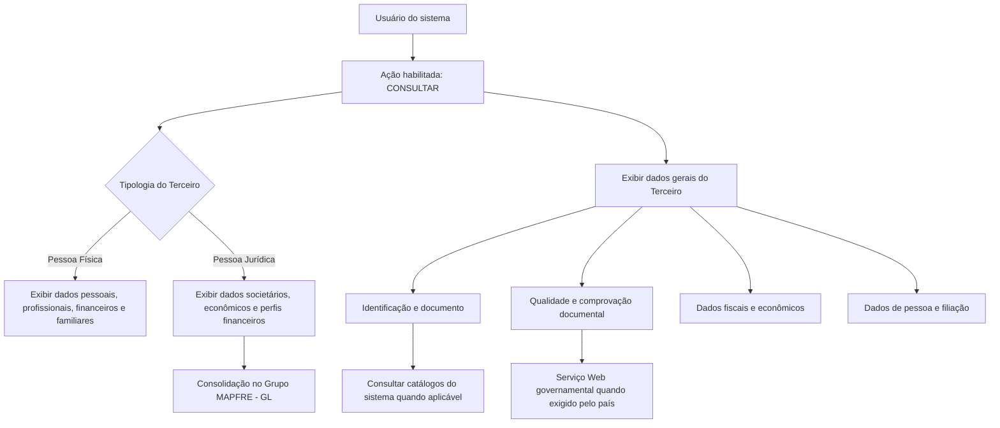

# Consulta de Dados de Pessoa Física/Jurídica de Terceiro no Reef.core

## 1. Metadados do Documento
- **Arquivo de Origem:** `Não identificado — conteúdo bruto fornecido na solicitação`
- **Tipo de Documento:** Manual Operacional / Especificação Funcional
- **Domínio / Sistema:** Reef.core; gestão e consulta de dados de Terceiros; Grupo MAPFRE
- **Público-Alvo:** Analistas funcionais, operação, desenvolvedores e arquitetos
- **Data/Versão Identificada:** Não identificada

---

## 2. Resumo Executivo & Contexto de Negócio

O documento descreve a funcionalidade de **consulta dos dados complementares de um Terceiro** no sistema, aplicável tanto a **Pessoa Física** quanto a **Pessoa Jurídica**. A ação habilitada explicitamente é `CONSULTAR`, com o objetivo de visualizar informações cadastrais, identificadoras, fiscais, econômicas, profissionais, financeiras e de filiação do Terceiro.

A estrutura funcional diferencia os dados conforme a tipologia final atribuída ao Terceiro no momento do seu cadastro: Pessoa Física ou Pessoa Jurídica. Alguns atributos podem ser exibidos indistintamente para ambas as tipologias quando não houver configuração ou indicação expressa de campos específicos; outros campos possuem aplicabilidade condicionada à natureza física ou jurídica do Terceiro.

O conteúdo estabelece que o identificador único do Terceiro, quando exigido pela configuração dos parâmetros da companhia, é atribuído automaticamente por uma lógica de negócio local. Esse identificador suporta rastreabilidade, integração e cruzamento de dados entre sistemas, mas não substitui o código interno do Terceiro utilizado pelo Reef.core.

O documento também abrange controles de qualidade documental, incluindo dados de emissão, expiração, país emissor, resultado de validação por serviço governamental, marca de verificação, data de comprovação e observações do processo de validação. Além disso, contempla dados econômicos, tributários, ocupacionais, de residência, nacionalidade, composição familiar e obrigações fiscais em outros países.

**Nota de Análise:** o documento detalha atributos funcionais disponíveis para consulta, mas não apresenta contratos de API, métodos HTTP, estruturas JSON, persistência de dados, URLs de ambientes, rotas de log, tecnologias de infraestrutura ou permissões técnicas de acesso.

---

## 3. Arquitetura, Componentes & Tecnologias Envolvidas

### Componentes e conceitos identificados

| Componente / Conceito | Papel identificado no documento |
| :--- | :--- |
| Sistema de consulta de Terceiros | Permite visualizar dados complementares de Pessoas Físicas e Pessoas Jurídicas. |
| Reef.core | Sistema referido como origem de catálogos mestres e como detentor do código interno do Terceiro. |
| Terceiro | Entidade consultada; pode ser classificada como Pessoa Física ou Pessoa Jurídica. |
| Catálogo de Países | Fonte de valores possíveis para país emissor, nascimento ou constituição. |
| Catálogo de Estados | Fonte de valores possíveis para estado de nascimento ou constituição. |
| Catálogo de Províncias | Fonte de valores possíveis para província de nascimento ou constituição. |
| Catálogo de Localidades | Fonte de valores possíveis para localidade de nascimento ou constituição. |
| Catálogo Mestre de Atividades Econômicas | Fonte de valores para tipo de atividade econômica. |
| Catálogo Mestre de Idiomas | Fonte de valores para idioma preferencial de comunicação. |
| Catálogo Mestre de Profissões do Reef.core | Fonte de valores para profissão. |
| Catálogo Mestre de Ocupações do Reef.core | Fonte de valores para ocupação. |
| Catálogo de Moedas | Fonte de valores para moeda dos ingressos mensais estimados. |
| Catálogo Mestre do Sistema | Fonte de valores para perfis financeiros e código de tipo societário. |
| Serviço Web governamental | Serviço utilizado em determinados países para retornar letra ou código verificador do documento identificador. |
| Grupo MAPFRE - GL | Referência para consolidação societária de Terceiros. |

### Fluxo funcional de consulta



**Nota de Análise:** o diagrama representa exclusivamente relações funcionais explicitadas ou diretamente inferíveis da organização do conteúdo. O documento não descreve arquitetura de implantação, camadas de software, microsserviços, bancos de dados ou protocolos de integração.

---

## 4. Regras de Negócio, Especificações Funcionais & Processos

### 4.1 Objetivo e ação habilitada

1. O objetivo da funcionalidade é **visualizar dados complementares do Terceiro** no sistema.
2. A ação habilitada identificada no documento é `CONSULTAR`.
3. A visualização abrange dados de Pessoa Física e de Pessoa Jurídica.
4. Quando os campos não forem especificados ou indicados expressamente, a informação pode ser visualizada indistintamente nos registros de Pessoa Física e Pessoa Jurídica.
5. A ordem de visualização é determinada pelos atributos apresentados “da esquerda para a direita e de cima para baixo”.

### 4.2 Tipologia do Terceiro

1. A marca de verificação de tipologia aplica-se às atividades configuradas para associação tanto a Pessoas Físicas quanto a entidades jurídicas.
2. Essa marca indica a tipologia que foi efetivamente atribuída ao Terceiro durante a sua inclusão:
   - Pessoa Física;
   - Pessoa Jurídica.

### 4.3 Identificação única e código interno

1. O atributo **ID único do Terceiro** é preenchido quando a configuração dos parâmetros da companhia exigir identificação unívoca de Terceiros em todas as aplicações que gerenciam essas informações.
2. O identificador é atribuído automaticamente ao Terceiro pela execução de uma lógica de negócio local.
3. O objetivo do identificador único é permitir:
   - rastreabilidade;
   - integração;
   - cruzamento de dados entre sistemas.
4. O identificador único **não substitui**, em nenhuma circunstância, o atributo que identifica o código interno do Terceiro utilizado pelo Reef.core.

### 4.4 Controle e comprovação do documento identificador

1. A **Data de Emissão** representa a data de emissão do documento do Terceiro.
2. A **Data de Caducidade** representa a data de expiração do documento do Terceiro.
3. O **País Emissor** exibe o código do país emissor do documento identificador, conforme o catálogo de países existente no sistema.
4. O **Verificador do Documento Identificador** exibe o resultado de uma chamada a serviço fornecido pelo governo em países onde seja necessária a validação documental externa.
5. O serviço governamental pode devolver uma letra ou um código verificador.
6. A **Marca de Comprobación** determina se o documento do Terceiro foi revisado e verificado em relação à qualidade dos dados no sistema.
7. A **Fecha de Comprobación** é exibida quando o estado da marca indicar que o documento foi revisado e comprovado.
8. As **Observaciones** são exibidas quando o documento tiver sido revisado e validado; elas registram texto explicativo ou observações sobre o método empregado na comprovação.

### 4.5 Dados fiscais, econômicos e societários

1. A **Categoria do Terceiro** contém o código de categoria associado ao Terceiro, conforme o catálogo do sistema.
2. O **Régimen Fiscal** contém o código de regime fiscal do Terceiro, conforme o catálogo mestre do Reef.core.
3. O campo **Por Cuenta Propia** identifica o Terceiro como trabalhador por conta própria, desde que o Terceiro seja Pessoa Física.
4. O campo **Alias del Tercero** apresenta apelido ou sobrenome do Terceiro, independentemente de ser Pessoa Física ou Pessoa Jurídica.
5. O campo **Sociedad para Consolidación en Grupo MAPFRE - GL** apresenta o código societário para consolidação do Terceiro Jurídico em processos do Grupo MAPFRE; o texto informa aplicabilidade para Pessoas Físicas e Jurídicas.
6. A **Actividad Económica** contém uma classificação das atividades econômicas de Terceiros Jurídicos configurada pela entidade seguradora.
7. O **Tipo de Actividad Económica** representa o código do tipo de atividade econômica do Terceiro, conforme valores configurados no catálogo mestre de Atividades Econômicas.
8. O **Folio Registral** aplica-se a Pessoa Jurídica e representa o número que identifica e diferencia o Terceiro de outros Terceiros com documentos semelhantes.
9. A **Fecha de Constitución** identifica a data de constituição da Pessoa Jurídica como sociedade.
10. O **Perfil Financiero Act. Principal** aplica-se a Pessoa Jurídica e apresenta o código do perfil financeiro relativo à atividade econômica principal.
11. O **Perfil Financiero Act. Secundarias** aplica-se a Pessoa Jurídica e apresenta o código de perfil financeiro para atividades econômicas secundárias.
12. O **Código Tipo Sociedad** aplica-se a Pessoa Jurídica e contém o tipo de código societário segundo o catálogo mestre existente no sistema.
13. Caso o campo **Obligaciones Fiscales en otros Países** esteja ativado, é habilitado o botão que permite consultar os países nos quais o Terceiro possui obrigações fiscais.

### 4.6 Dados de pessoa e filiação

1. O subbloco **Persona** tem como objetivo visualizar dados de filiação do Segurado conforme a tipologia do Terceiro.
2. O **Tratamiento** apresenta o tratamento de respeito anterior ao nome do Terceiro, reservado por cortesia ou respeito a determinadas pessoas de elevado nível social.
3. O **Pospuesto** contém o código posposto ao nome próprio do Terceiro para indicar alguma condição.
4. O campo **Nombre** contém:
   - o nome do Terceiro, quando Pessoa Física;
   - a razão social, quando Pessoa Jurídica.
5. O **Segundo Nombre** aplica-se a Pessoa Física e contém o segundo nome e nomes subsequentes.
6. O **Primer Apellido** aplica-se a Pessoa Física e contém o primeiro sobrenome.
7. O **Segundo Apellido** aplica-se a Pessoa Física e contém o segundo sobrenome.
8. O **Apellido de Casado/a** aplica-se a Pessoa Física e contém o sobrenome de casado/a quando o costume for adotado no país.
9. O **Estado Civil** aplica-se a Pessoa Física e contém o código do estado civil.
10. O campo **Nombre y Apellidos del Cónyuge** aplica-se a Pessoa Física quando o estado civil for compatível com o preenchimento do atributo.
11. A **Fecha de Nacimiento** aplica-se a Pessoa Física e informa a data de nascimento.
12. A **Fecha de Fallecimiento** aplica-se a Pessoa Física e informa a data de falecimento.
13. A **Fecha de Inicio de Residencia** aplica-se a Pessoa Física e informa a data de início de residência.
14. A **Nacionalidad** aplica-se a Pessoa Física e informa a nacionalidade.
15. O **Tipo de Nacionalidad** aplica-se a Pessoa Física e contém o código de tipo de nacionalidade, definido localmente pela entidade seguradora para uso em processos internos.
16. O **País de Nacimiento/Constitución** contém o código do país de nascimento da Pessoa Física ou de constituição da Pessoa Jurídica.
17. O **Estado de Nacimiento/Constitución** contém o código do estado de nascimento da Pessoa Física ou de constituição da Pessoa Jurídica.
18. A **Provincia de Nacimiento/Constitución** contém o código da província de nascimento da Pessoa Física ou de constituição da Pessoa Jurídica.
19. A **Localidad de Nacimiento/Constitución** contém o código da localidade de nascimento da Pessoa Física ou de constituição da Pessoa Jurídica.
20. O **Idioma** contém a preferência de idioma para comunicações entre a entidade seguradora e o Terceiro.
21. O **Género** aplica-se a Pessoa Física e informa o gênero do Terceiro.

### 4.7 Dados profissionais, financeiros e familiares de Pessoa Física

1. O **Porcentaje Discapacidad** aplica-se a Pessoa Física e apresenta o percentual de deficiência segundo tabelas de baremos e graus de incapacidade do país.
2. A **Profesión** aplica-se a Pessoa Física e contém o código da profissão conforme o catálogo mestre de profissões do Reef.core.
3. A **Ocupación** aplica-se a Pessoa Física e contém o código de ocupação conforme o catálogo mestre de ocupações do Reef.core.
4. O **Nombre de la Empresa** aplica-se a Pessoa Física e informa o nome da empresa na qual o Terceiro trabalha.
5. O **Tipo de Empresa** aplica-se a Pessoa Física e informa o tipo da empresa onde o Terceiro trabalha, conforme tipologias definidas.
6. O **Tipo de Empleo** aplica-se a Pessoa Física e permite identificar se o Terceiro é assalariado ou autônomo.
7. A definição fornecida para **Autónomo** descreve Pessoas Físicas que exercem de forma habitual, pessoal, direta, por conta própria e fora do âmbito de direção e organização de outra pessoa uma atividade econômica ou profissional com finalidade lucrativa, tenham ou não empregados.
8. Os **Ingresos Mensuales Estimados** aplicam-se a Pessoa Física e representam o valor dos ingressos mensais do Terceiro.
9. A **Moneda** aplica-se a Pessoa Física e apresenta o código da moeda utilizada para expressar os ingressos mensais estimados, conforme o catálogo de moedas do sistema.
10. O **Nivel de Estudios** aplica-se a Pessoa Física e determina o código do nível de estudos do Terceiro.
11. A **Titulación** aplica-se a Pessoa Física e apresenta o código da titulação.
12. O **Número de Hijos** aplica-se a Pessoa Física e apresenta o número de descendentes do Terceiro.

---

## 5. Tabelas de Parâmetros, Ambientes e Estruturas de Dados

### 5.1 Ações e controles gerais

| Item / Parâmetro | Descrição / Função | Tipo / Valores / Formato | Ambiente / Observações |
| :--- | :--- | :--- | :--- |
| Ação habilitada | Permite visualizar os dados complementares do Terceiro. | `CONSULTAR` | O documento não informa permissões, perfis ou matriz de acesso. |
| Tipologia do Terceiro | Indica a tipologia atribuída ao Terceiro no cadastro. | Pessoa Física; Pessoa Jurídica | Aplicável em atividades configuradas para ambas as tipologias. |
| ID único do Terceiro | Identificador automático para rastreabilidade, integração e cruzamento de dados. | Código de identificador único | Dependente de configuração de parâmetros da companhia; não substitui o código interno do Reef.core. |
| Código interno do Terceiro | Identificador de uso interno no Reef.core. | Não especificado | Não é substituído pelo ID único do Terceiro. |
| Persona Políticamente Expuesta | Permite efetuar consulta no painel de informação correspondente quando ativada. | Marca / estado de ativação | O documento não detalha o painel nem critérios de ativação. |

### 5.2 Documento identificador e qualidade de dados

| Item / Parâmetro | Descrição / Função | Tipo / Valores / Formato | Ambiente / Observações |
| :--- | :--- | :--- | :--- |
| Fecha de Emisión | Data de emissão do documento do Terceiro. | Data | Não é informado formato de data. |
| Fecha de Caducidad | Data de expiração do documento do Terceiro. | Data | Não é informado formato de data. |
| País Emisor | Código do país emissor do documento identificador. | Código de país | Valores provenientes do catálogo de Países do sistema. |
| Verificador del Documento Identificador | Resultado da validação documental externa. | Letra ou código verificador | Aplicável em países que demandam chamada a serviço governamental. |
| Marca de Comprobación | Determina se o documento foi revisado e verificado. | Marca / estado | Relacionada à qualidade dos dados do Terceiro. |
| Fecha de Comprobación | Data da revisão e comprovação do documento. | Data | Exibida quando a marca de comprovação indicar documento revisado e comprovado. |
| Observaciones | Texto explicativo sobre o método utilizado na comprovação documental. | Texto | Exibido quando o documento foi revisado e validado. |

### 5.3 Dados fiscais, econômicos e societários

| Item / Parâmetro | Descrição / Função | Tipo / Valores / Formato | Ambiente / Observações |
| :--- | :--- | :--- | :--- |
| Categoría del Tercero | Código de categoria associado ao Terceiro. | Código | Conforme catálogo do sistema. |
| Régimen Fiscal | Código do regime fiscal do Terceiro. | Código | Conforme catálogo mestre do Reef.core. |
| Por Cuenta Propia | Identifica o Terceiro como trabalhador por conta própria. | Indicador | Aplicável a Pessoa Física. |
| Alias del Tercero | Apelido ou sobrenome do Terceiro. | Texto | Aplicável a Pessoa Física e Pessoa Jurídica. |
| Sociedad para Consolidación en Grupo MAPFRE - GL | Código societário para consolidação em processos do Grupo MAPFRE. | Código societário | O texto menciona Terceiro Jurídico e aplicabilidade para Pessoas Físicas e Jurídicas. |
| Actividad Económica | Classificação das atividades econômicas do Terceiro Jurídico. | Classificação | Configurada pela entidade seguradora. |
| Tipo de Actividad Económica | Código do tipo de atividade econômica. | Código | Conforme catálogo mestre de Atividades Econômicas. |
| Folio Registral | Número identificador da Pessoa Jurídica perante documentos semelhantes. | Número | Aplicável a Pessoa Jurídica. |
| Fecha de Constitución | Data de constituição da sociedade. | Data | Aplicável a Pessoa Jurídica. |
| Perfil Financiero Act. Principal | Código de perfil financeiro da atividade econômica principal. | Código | Aplicável a Pessoa Jurídica; valores do catálogo mestre do sistema. |
| Perfil Financiero Act. Secundarias | Código de perfil financeiro das atividades econômicas secundárias. | Código | Aplicável a Pessoa Jurídica; valores do catálogo mestre do sistema. |
| Código Tipo Sociedad | Tipo de código societário do Terceiro. | Código | Aplicável a Pessoa Jurídica; valores do catálogo mestre. |
| Obligaciones Fiscales en otros Países | Habilita consulta de países com obrigações fiscais do Terceiro. | Indicador / botão | Quando ativado, habilita botão de consulta correspondente. |

### 5.4 Dados de pessoa, identificação e filiação

| Item / Parâmetro | Descrição / Função | Tipo / Valores / Formato | Ambiente / Observações |
| :--- | :--- | :--- | :--- |
| Tratamiento | Tratamento de respeito anterior ao nome do Terceiro. | Código ou valor de tratamento | Associado a pessoas de elevado nível social. |
| Pospuesto | Código posposto ao nome próprio para indicar uma condição. | Código | O documento não detalha valores possíveis. |
| Nombre | Nome de Pessoa Física ou razão social de Pessoa Jurídica. | Texto | Aplicável conforme tipologia. |
| Segundo Nombre | Segundo nome e nomes subsequentes. | Texto | Aplicável a Pessoa Física. |
| Primer Apellido | Primeiro sobrenome. | Texto | Aplicável a Pessoa Física. |
| Segundo Apellido | Segundo sobrenome. | Texto | Aplicável a Pessoa Física. |
| Apellido de Casado/a | Sobrenome de casado/a. | Texto | Aplicável a Pessoa Física em países onde o costume é utilizado. |
| Estado Civil | Código do estado civil. | Código | Aplicável a Pessoa Física. |
| Nombre y Apellidos del Cónyuge | Nome e sobrenomes do cônjuge. | Texto | Aplicável a Pessoa Física quando compatível com estado civil. |
| Fecha de Nacimiento | Data de nascimento. | Data | Aplicável a Pessoa Física. |
| Fecha de Fallecimiento | Data de falecimento. | Data | Aplicável a Pessoa Física. |
| Fecha de Inicio de Residencia | Data de início de residência. | Data | Aplicável a Pessoa Física. |
| Nacionalidad | Nacionalidade do Terceiro. | Não especificado | Aplicável a Pessoa Física. |
| Tipo de Nacionalidad | Código do tipo de nacionalidade. | Código | Aplicável a Pessoa Física; codificação local da entidade seguradora. |
| País de Nacimiento/Constitución | País de nascimento ou constituição. | Código de país | Conforme catálogo de países do sistema. |
| Estado de Nacimiento/Constitución | Estado de nascimento ou constituição. | Código de estado | Conforme catálogo de estados do sistema. |
| Provincia de Nacimiento/Constitución | Província de nascimento ou constituição. | Código de província | Conforme catálogo de províncias do sistema. |
| Localidad de Nacimiento/Constitución | Localidade de nascimento ou constituição. | Código de localidade | Conforme catálogo de localidades do sistema. |
| Idioma | Preferência de idioma nas comunicações com o Terceiro. | Código | Conforme catálogo mestre de idiomas do sistema. |
| Género | Gênero do Terceiro. | Não especificado | Aplicável a Pessoa Física. |

### 5.5 Dados profissionais, financeiros, educacionais e familiares

| Item / Parâmetro | Descrição / Função | Tipo / Valores / Formato | Ambiente / Observações |
| :--- | :--- | :--- | :--- |
| Porcentaje Discapacidad | Percentual de deficiência do Terceiro. | Percentual | Aplicável a Pessoa Física; conforme baremos e graus de incapacidade do país. |
| Profesión | Código de profissão associado ao Terceiro. | Código | Aplicável a Pessoa Física; catálogo mestre de Profissões do Reef.core. |
| Ocupación | Código de ocupação associado ao Terceiro. | Código | Aplicável a Pessoa Física; catálogo mestre de Ocupações do Reef.core. |
| Nombre de la Empresa | Nome da empresa em que o Terceiro trabalha. | Texto | Aplicável a Pessoa Física. |
| Tipo de Empresa | Tipo da empresa em que o Terceiro trabalha. | Tipo / classificação | Aplicável a Pessoa Física; conforme tipologias definidas. |
| Tipo de Empleo | Classifica o vínculo como assalariado ou autônomo. | Assalariado; Autónomo | Aplicável a Pessoa Física. |
| Ingresos Mensuales Estimados | Valor estimado de ingressos mensais. | Valor monetário | Aplicável a Pessoa Física. |
| Moneda | Código da moeda dos ingressos mensais estimados. | Código de moeda | Aplicável a Pessoa Física; catálogo de moedas do sistema. |
| Nivel de Estudios | Código do nível de estudos do Terceiro. | Código | Aplicável a Pessoa Física. |
| Titulación | Código da titulação do Terceiro. | Código | Aplicável a Pessoa Física. |
| Número de Hijos | Número de descendentes do Terceiro. | Número | Aplicável a Pessoa Física. |

### 5.6 Ambientes, URLs, logs e infraestrutura

| Item / Parâmetro | Descrição / Função | Tipo / Valores / Formato | Ambiente / Observações |
| :--- | :--- | :--- | :--- |
| Ambientes | Não detalhados. | Não identificado | O documento não apresenta DEV, QA, UAT, PROD ou equivalentes. |
| URLs | Não detalhadas. | Não identificado | Não há URLs, domínios ou endpoints técnicos. |
| Rotas de log | Não detalhadas. | Não identificado | Não há caminhos, arquivos ou ferramentas de log. |
| Portas e protocolos | Não detalhados. | Não identificado | Não há portas, protocolos ou mecanismos técnicos de integração. |

---

## 6. Bateria de Perguntas & Respostas para RAG (FAQ Sintético)

### P1: Qual é o objetivo da ação `CONSULTAR` para dados de Terceiro?
**R:** A ação `CONSULTAR` tem o objetivo de visualizar os dados complementares de um Terceiro no sistema. A consulta contempla informações aplicáveis a Pessoa Física e Pessoa Jurídica, incluindo dados de identificação, documento, qualidade cadastral, tributação, atividade econômica, filiação, profissão, renda e composição familiar.

### P2: O ID único do Terceiro substitui o código interno utilizado no Reef.core?
**R:** Não. O documento determina expressamente que o ID único do Terceiro não substitui, em nenhuma circunstância, o atributo que identifica o código interno do Terceiro utilizado no Reef.core. O ID único é utilizado para rastreabilidade, integração e cruzamento de dados entre sistemas quando a companhia configura a necessidade de identificação unívoca.

### P3: Quando o ID único do Terceiro é atribuído?
**R:** O ID único é atribuído automaticamente por meio de uma lógica de negócio local quando os parâmetros da companhia determinarem a necessidade de identificar univocamente os Terceiros em todas as aplicações que administram suas informações.

### P4: Como o sistema trata a validação de documentos em países que exigem consulta governamental?
**R:** Para países em que o documento do Terceiro exige chamada a um serviço fornecido pelo governo, o campo **Verificador del Documento Identificador** apresenta o resultado da chamada. Esse resultado pode ser uma letra ou um código verificador.

### P5: Em que condição a data de comprovação do documento é exibida?
**R:** A **Fecha de Comprobación** é exibida quando o estado da **Marca de Comprobación** indicar que o documento do Terceiro foi revisado e comprovado. A marca determina se o documento foi ou não revisado e verificado em relação à qualidade dos dados no sistema.

### P6: Quais informações sobre Pessoa Jurídica estão disponíveis na consulta?
**R:** Para Pessoa Jurídica, o documento descreve, entre outros, atividade econômica, tipo de atividade econômica, folio registral, data de constituição, país/estado/província/localidade de constituição, perfis financeiros de atividade principal e secundárias, código de tipo societário e obrigações fiscais em outros países.

### P7: O que representa o campo `Nombre` para cada tipologia de Terceiro?
**R:** Para Pessoa Física, o campo `Nombre` contém o nome do Terceiro. Para Pessoa Jurídica, o mesmo campo contém a razão social do Terceiro.

### P8: Quais campos profissionais são aplicáveis a Pessoas Físicas?
**R:** Para Pessoas Físicas, a consulta pode apresentar profissão, ocupação, nome da empresa, tipo de empresa, tipo de emprego, ingressos mensais estimados e moeda. Profissão e ocupação são códigos associados aos respectivos catálogos mestres do Reef.core.

### P9: Como o documento define um Terceiro autônomo no campo `Tipo de Empleo`?
**R:** O documento define autônomos como Pessoas Físicas que realizam habitual, pessoal e diretamente, por conta própria e fora da direção e organização de outra pessoa, uma atividade econômica ou profissional lucrativa, independentemente de ocuparem ou não trabalhadores por conta alheia.

### P10: Quando o botão para obrigações fiscais em outros países fica disponível?
**R:** O botão correspondente fica habilitado quando o campo **Obligaciones Fiscales en otros Países** está ativado. O botão permite consultar as informações dos países nos quais o Terceiro possui obrigações fiscais.

### P11: Quais atributos de localização de nascimento ou constituição são consultados?
**R:** O sistema apresenta códigos de país, estado, província e localidade. Para Pessoa Física, esses atributos referem-se ao local de nascimento; para Pessoa Jurídica, referem-se ao local de constituição. Os valores são associados aos catálogos correspondentes existentes no sistema.

### P12: O que são as observações associadas à comprovação do documento?
**R:** As observações são um texto esclarecedor sobre o método usado para validar o documento do Terceiro. Elas são exibidas quando o documento foi revisado e validado.

---

## 7. Glossário de Termos, Siglas & Conceitos-Chave

- **Reef.core:** Sistema mencionado como fonte de catálogos mestres e como sistema que utiliza o código interno do Terceiro.
- **Terceiro:** Entidade cadastrada e consultada no sistema, classificada como Pessoa Física ou Pessoa Jurídica.
- **Pessoa Física:** Tipologia aplicável a indivíduos; habilita atributos pessoais, profissionais, familiares, educacionais e financeiros específicos.
- **Pessoa Jurídica:** Tipologia aplicável a entidades constituídas; habilita atributos societários, econômicos e financeiros específicos.
- **ID único do Terceiro:** Identificador atribuído automaticamente por lógica local para rastreabilidade, integração e cruzamento de dados.
- **Marca de Comprobación:** Indicador que define se o documento do Terceiro foi revisado e verificado.
- **Verificador del Documento Identificador:** Letra ou código devolvido por um serviço governamental para validação documental em países aplicáveis.
- **Folio Registral:** Número que identifica e diferencia uma Pessoa Jurídica de outros Terceiros com documentos semelhantes.
- **Régimen Fiscal:** Código de regime fiscal do Terceiro segundo o catálogo mestre do Reef.core.
- **Actividad Económica:** Classificação de atividades econômicas de Terceiros Jurídicos configurada pela entidade seguradora.
- **Perfil Financiero Act. Principal:** Código do perfil financeiro da atividade econômica principal de uma Pessoa Jurídica.
- **Perfil Financiero Act. Secundarias:** Código do perfil financeiro das atividades econômicas secundárias de uma Pessoa Jurídica.
- **Grupo MAPFRE - GL:** Referência ao grupo cujos processos de consolidação utilizam o código societário informado para o Terceiro.
- **Autónomo:** Pessoa Física que exerce atividade econômica ou profissional habitual, pessoal, direta, por conta própria e com finalidade lucrativa, fora da organização de outra pessoa.
- **Catálogo mestre:** Repositório de valores possíveis utilizado pelo sistema para classificar campos codificados.

---

## 8. Notas Críticas, Riscos & Limitações

1. O documento descreve a funcionalidade de consulta, mas não detalha operações de criação, alteração, exclusão ou aprovação de dados de Terceiros.
2. Não há especificação de APIs, endpoints, métodos HTTP, contratos JSON, modelos de persistência ou integrações técnicas além da referência funcional a um serviço governamental.
3. Não há definição de ambientes, URLs, domínios, servidores, portas, credenciais, perfis de acesso, SLAs ou rotas de logs.
4. O documento referencia vários catálogos mestres, mas não apresenta seus valores, estruturas, responsáveis, mecanismos de manutenção ou regras de sincronização.
5. A atribuição do ID único depende da configuração de parâmetros da companhia e de uma lógica de negócio local, porém essa lógica não é detalhada.
6. A validação documental externa depende de países nos quais seja necessária chamada a serviço governamental; o documento não identifica os países, o serviço, critérios de acionamento, contrato de integração ou tratamento de falhas.
7. O campo de consolidação no Grupo MAPFRE - GL menciona código societário do Terceiro Jurídico e, simultaneamente, aplicabilidade para Pessoas Físicas e Jurídicas. O documento não esclarece essa abrangência funcional.
8. Não são informados formatos para datas, moedas, identificadores, percentuais, códigos de catálogo ou regras de obrigatoriedade dos campos.
9. Não são especificados requisitos de proteção de dados, retenção, mascaramento, auditoria, consentimento ou controles de privacidade para os dados pessoais consultados.

---

## 9. Conteúdo Bruto Estruturado (Referência Fiel)

```text
--- [PÁGINA 1 DE 8] ---

CONSULTAR Datos Persona Física/Jurídica del
Tercero
Objetivo
Visualizar los datos complementarios del Tercero en el sistema.
Acciones habilitadas
 CONSULTAR ( )
Datos Persona Persona Física/Jurídica
De izquierda a derecha y de arriba hacia abajo, los siguientes atributos determinan el orden de la
visualización de la información.
Si no se especifica o indica expresamente los Campos se visualizarán indistintamente tanto en el
registro de información de las Personas Físicas como para las Personas Jurídicas.
 / 
 RS
Inicio Soluciones APIs Documentación Zeus
ES


--- [PÁGINA 2 DE 8] ---

Persona Física o Persona Jurídica
Esta marca de verificación, en aquellas actividades en las que se haya configurado la posibilidad de
estar asociada tanto para personas físicas como para entidades jurídicas, indica la tipología del
Tercero finalmente asignada en el alta del Tercero.
ID único del Tercero
Siempre y cuando se haya definido en la configuración de los parámetros de la compañía la
necesidad de identificar unívocamente a los Terceros en todas las aplicaciones que gestionen su
información, este atributo contendrá el código del Identificador único que se asignará
automáticamente al Tercero mediante la ejecución de una lógica de negocio local, permitiendo de
esta manera la trazabilidad, integración y cruce de datos entre los sistemas.
Este atributo NO SUSTITUYE en ningún caso la funcionalidad soportada por el atributo que
identifica el código del tercero que es de uso interno en Reef.core.
Persona Políticamente Expuesta
Si esta marca estuviera activada se podrá efectuar la consulta en el panel de información
correspondiente.
Fecha de Emisión
Esta propiedad plasma la Fecha de Emisión del Documento del Tercero.
Fecha de Caducidad
Esta propiedad muestra la Fecha de Caducidad del Documento del Tercero.
País Emisor
Este Campo visualiza el código del país emisor del documento identificador del Tercero de acuerdo
con la relación de posibles valores existentes en el catálogo de Países existente en el Sistema.
Verificador del Documento Identificador
Puesto que existen países en los que con el documento del Tercero han de realizar una llamada a un
Servicio provisto por el gobierno, Servicio Web que devolverá una letra o un código verificador, este
código mostrará el resultado de dicha llamada.
Marca de Comprobación
Este dato determinará si documento del Tercero ha sido o no revisado y verificado, todo ello en
relación con la calidad de los datos del Tercero en el sistema.


--- [PÁGINA 3 DE 8] ---

Fecha de Comprobación
En el supuesto que el estado de la marca de comprobación implicara que el documento del Tercero
hubiera sido revisado y comprobado, este campo mostrará la fecha en la que esta acción se realizó.
Observaciones
En el supuesto que el documento del Tercero hubiera sido revisado y validado este campo muestra el
texto aclaratorio u observaciones sobre el método que se empleó para su comprobación.
Categoría del Tercero
Este atributo contiene el código de la categoría asignada al Tercero de acuerdo con la relación de
posibles valores existentes en el catálogo del Sistema.
Régimen Fiscal
Este dato contiene el código del régimen fiscal del Tercero de acuerdo con la relación de posibles
valores existentes en el catálogo maestro de Reef.core.
Por Cuenta Propia
Este dato identifica al Tercero como Trabajador por cuenta propia siempre y cuando el Tercero sea
persona física.
Persona Legal
Visualizar los datos de ámbito económico del Tercero en el sistema.
Alias del Tercero
Este dato visualiza el apodo o sobrenombre del Tercero independientemente si este es persona física
o jurídica.
Sociedad para Consolidación en Grupo MAPFRE - GL
Este campo permite muestra el código societario del tercero jurídico para su consolidación en los
procesos del Grupo MAPFRE tanto para personas físicas como jurídicas.
Actividad Económica


--- [PÁGINA 4 DE 8] ---

Este atributo contiene una clasificación de las actividades económicas en los Terceros Jurídicos
configurada por la entidad aseguradora.
Tipo de Actividad Económica
Este Campo representa el código del tipo de la actividad económica del Tercero de acuerdo con los
posibles valores configurados en el catálogo maestro de Actividades Económicas.
Folio Registral
Si el Tercero es persona Jurídica este campo representa el número que lo identifica y diferencia del
resto de terceros con documentos similares (esta numeración individual recibe el nombre de Folio o
Folio Registral).
Fecha de Constitución
Puesto que las personas jurídicas nacen como consecuencia de un acto jurídico (acto de
constitución) este dato identifica la fecha en la que el Tercero Jurídico fue constituido como sociedad.
Persona
El objetivo de este sub bloque de datos es Visualizar los datos de filiación del Asegurado de acuerdo
con la tipología del Tercero: Persona Física o bien Persona Jurídica.
Tratamiento
Este Atributo muestra el Tratamiento de respeto que se antepone al nombre del Tercero y que por
cortesía o por respeto está reservado a determinadas personas de elevado rango social.
Pospuesto
Este Dato contiene el código del pospuesto al Nombre Propio del Tercero para indicar alguna
condición de este.
Nombre


--- [PÁGINA 5 DE 8] ---

Este Atributo contiene el nombre del Tercero en caso que el Tercero sea una Persona Física o la
Razón Social en el supuesto que sea una Persona Jurídica.
Segundo Nombre
Siempre y cuando el Tercero sea una Persona Física, este dato contendrá el segundo y sucesivos
nombres del Tercero.
Primer Apellido
Siempre y cuando el Tercero sea una Persona Física, este dato contendrá el primer Apellido del
Tercero.
Segundo Apellido
Siempre y cuando el Tercero sea una Persona Física, este dato contendrá el segundo Apellido del
Tercero.
Apellido de Casado/a
Siempre y cuando el Tercero sea una Persona Física, este dato contendrá el Apellido de casado/a
del Tercero (en aquellos países en los que esta costumbre relacionada con los nombres de soltero en
el matrimonio sea de uso extendido).
Estado Civil
Siempre y cuando el Tercero sea una Persona Física, este dato contendrá el código del estado civil
del Tercero.
Nombre y Apellidos del Cónyuge
Siempre y cuando el Tercero sea una Persona Física y su estado civil sea coherente con el posible
valor de este campo, este dato contendrá el Nombre y los Apellidos del cónyuge del Tercero.
Fecha de Nacimiento
Siempre y cuando el Tercero sea una Persona Física, este dato indicará la Fecha de nacimiento del
Tercero.
Fecha de Fallecimiento
Siempre y cuando el Tercero sea una Persona Física este campo indicará la Fecha de fallecimiento
del Tercero.
Fecha de Inicio de Residencia


--- [PÁGINA 6 DE 8] ---

Siempre y cuando el Tercero sea una Persona Física este dato indicará la Fecha de inicio de
Residencia del Tercero.
Nacionalidad
Siempre y cuando el Tercero sea una Persona Física, este dato indicará la nacionalidad del Tercero.
Tipo de Nacionalidad
Siempre y cuando el Tercero sea una Persona Física este campo contendrá el código de tipo de
nacionalidad del Tercero de acuerdo con la codificación efectuada localmente por parte de la entidad
aseguradora para su posterior uso en los procesos internos de la entidad.
País de Nacimiento/Constitución
Este Campo contiene el código del país en el que nació la Persona o se haya constituido el Tercero
Jurídico, de acuerdo con la relación de posibles valores del catálogo de países existente en el
Sistema.
Estado de Nacimiento/Constitución
Este Campo contiene el código del estado en el que nació la Persona o se haya constituido el
Tercero Jurídico, de acuerdo con la relación de posibles valores del catálogo de estados existente en
el Sistema.
Provincia de Nacimiento/Constitución
Este Campo contiene el código de la provincia en la que nació la Persona o se haya constituido el
Tercero Jurídico, de acuerdo con la relación de posibles valores del catálogo de provincias existente
en el Sistema.
Localidad de Nacimiento/Constitución
Este Campo contiene el código de la localidad en la que nació la Persona o se haya constituido el
Tercero Jurídico, de acuerdo con la relación de posibles valores del catálogo de localidades existente
en el Sistema.
Idioma
Este Campo contiene la preferencia del idioma en las comunicaciones de la entidad aseguradora con
el Tercero, de acuerdo con la relación de posibles valores existentes en el catálogo maestro de
Idiomas del Sistema.
Género
Siempre y cuando el Tercero sea una Persona Física este campo indicará el género del Tercero.


--- [PÁGINA 7 DE 8] ---

Porcentaje Discapacidad
Siempre y cuando el Tercero sea una Persona Física este dato visualizará el porcentaje de
Discapacidad del Tercero de acuerdo con las tablas de baremos y grados de minusvalías del país.
Profesión
Siempre y cuando el Tercero sea una Persona Física este Campo muestra el código de la profesión
asociada al Tercero de acuerdo con la relación de posibles valores existentes en el catálogo maestro
de Profesiones de Reef.core.
Ocupación
Siempre y cuando el Tercero sea una Persona Física este Campo contiene el código de la
ocupación asociada al Tercero de acuerdo con la relación de posibles valores existentes en el
catálogo maestro de Ocupaciones de Reef.core.
Nombre de la Empresa
Siempre y cuando el Tercero registrado sea una Persona Física este dato indicará el nombre de la
Empresa en la que el Tercero esté ocupado.
Tipo de Empresa
Siempre y cuando el Tercero registrado sea una Persona Física este dato mostrará el tipo de
empresa en la que el Tercero está ocupado de acuerdo con una de las tipologías definidas.
Tipo de Empleo
Siempre y cuando el Tercero sea Persona Física este dato visualiza el tipo de empleo del Tercero y
distinguir si es un Asalariado o un Autónomo (Personas físicas que realizan de forma habitual,
personal, directa, por cuenta propia y fuera del ámbito de dirección y organización de otra persona,
una actividad económica o profesional a título lucrativo, den o no ocupación a trabajadores por
cuenta ajena)
Ingresos Mensuales Estimados
Siempre y cuando el Tercero sea una Persona Física este Campo representa el importe de los
Ingresos Mensuales del Tercero.
Moneda
Siempre y cuando el Tercero sea una Persona Física este dato muestra el código de la Moneda en
la que se han expresado los Ingresos Mensuales Estimados del Tercero de acuerdo con la relación
de posibles valores existentes en el catálogo de monedas del Sistema.


--- [PÁGINA 8 DE 8] ---

Nivel de Estudios
Siempre y cuando el Tercero sea una Persona Física este campo determina el código del nivel de
estudios del Tercero.
Titulación
Siempre y cuando el Tercero sea una Persona Física este campo muestra el código de la titulación
del Tercero.
Perfil Financiero Act. Principal
Siempre y cuando el Tercero sea una Persona Jurídica este dato observa el código del perfil
financiero del Tercero de su actividad económica principal de acuerdo con la relación de posibles
valores existentes en el catálogo maestro del Sistema.
Perfil Financiero Act. Secundarias
Siempre y cuando el Tercero sea una Persona Jurídica este dato contendrá el código del perfil
financiero del Tercero para sus actividades económicas secundarias de acuerdo con la relación de
posibles valores existentes en el catálogo maestro del Sistema.
Código Tipo Sociedad
Siempre y cuando el Tercero sea una Persona Jurídica este Dato contendrá el tipo de código
societario del Tercero de acuerdo con la relación de posibles valores existentes en el catálogo
maestro existente en el Sistema.
Obligaciones Fiscales en otros Países
Si este campo estuviera activado, se habilitará el botón correspondiente que permitirá consultar la
información de aquellos países en los que el Tercero tuviera Obligaciones Fiscales.
Número de Hijos ( )
Siempre y cuando el Tercero sea una Persona Física este atributo visualiza el número de vástagos
del Tercero.
```
