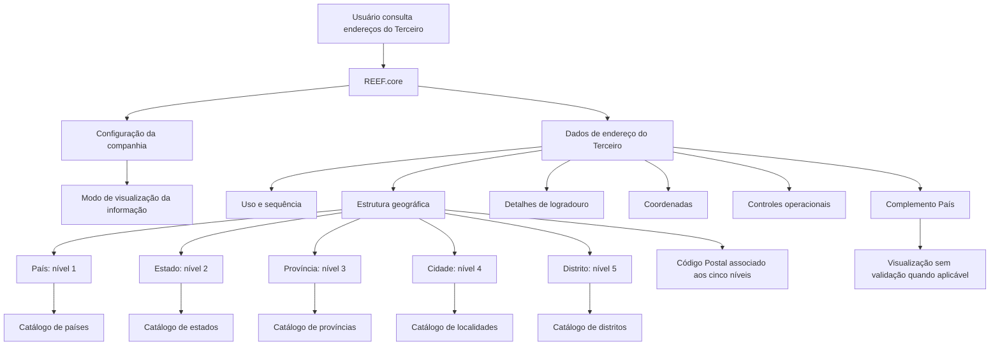

# Consulta de Endereços de Terceiros no REEF.core

## 1. Metadados do Documento
- **Arquivo de Origem:** Não identificado
- **Tipo de Documento:** Manual Operacional
- **Domínio / Sistema:** REEF.core — cadastro e consulta de endereços de terceiros
- **Público-Alvo:** Usuários operacionais, analistas funcionais, desenvolvedores e equipes de dados
- **Data/Versão Identificada:** Não identificada

---

## 2. Resumo Executivo & Contexto de Negócio

O documento descreve a funcionalidade de consulta e visualização dos endereços associados a um Terceiro no sistema REEF.core, considerando a data de consulta. A ação explicitamente habilitada é **CONSULTAR**; o material não descreve operações de inclusão, alteração ou exclusão.

A apresentação dos dados de endereço depende de um parâmetro na configuração das companhias. Esse parâmetro define o modo de visualização da informação. O documento informa que existem duas pautas possíveis de apresentação, mas detalha somente a primeira: leitura da esquerda para a direita e de cima para baixo.

A estrutura do endereço é composta por atributos de identificação, uso, localização geográfica, detalhes de logradouro, coordenadas, controles de qualidade, status de disponibilidade e vigência. A hierarquia geográfica possui cinco níveis: país, estado, província, cidade e distrito, vinculados aos respectivos catálogos do sistema.

O processo contempla situações em que o endereço não pertence ao país da entidade seguradora. Nessa condição, o campo **Complemento País** permite visualizar informações territoriais sem realizar validação contra os catálogos da estrutura territorial. O documento também estabelece controles operacionais relevantes, como endereço padrão único, marca de verificação, inabilitação, domicílio fiscal e data de validade.

---

## 3. Arquitetura, Componentes & Tecnologias Envolvidas

| Componente / Conceito | Papel descrito |
| :--- | :--- |
| REEF.core | Sistema que consulta, captura, atribui sequência automaticamente e visualiza endereços de Terceiros. |
| Terceiro | Entidade que possui um ou mais endereços associados. |
| Configuração das companhias | Possui parâmetro que indica ao sistema o modo de visualização das informações. |
| Catálogo de países | Fonte de valores possíveis para o primeiro nível geográfico. |
| Catálogo de estados | Fonte de valores possíveis para o segundo nível geográfico. |
| Catálogo de províncias | Fonte de valores possíveis para o terceiro nível geográfico. |
| Catálogo de localidades | Fonte de valores possíveis para o quarto nível geográfico, cidade. |
| Catálogo de distritos | Fonte de valores possíveis para o quinto nível geográfico. |
| Classificação de tipos corporativa | Referência para o Tipo de Domicílio ou Tipo de Vía associado ao endereço. |
| Callejero e usos locais | Referência para detalhamento da Direção, incluindo elementos locais como cerrada, urbanização, bloco, escada e apartamento. |



**Nota de Análise:** O documento não especifica arquitetura técnica de infraestrutura, APIs, métodos HTTP, contratos JSON, banco de dados, integrações, autenticação, ambientes ou tecnologias de implementação além do REEF.core e dos catálogos funcionais mencionados.

---

## 4. Regras de Negócio, Especificações Funcionais & Processos

### 4.1 Objetivo funcional
- A funcionalidade permite visualizar as Direções do Terceiro existentes no sistema na data da consulta.
- A ação habilitada no material é **CONSULTAR**.

### 4.2 Regras de visualização
- A visualização dos dados pode seguir uma de duas pautas.
- O modo de visualização depende de um parâmetro presente na configuração das companhias.
- A primeira pauta detalhada organiza as informações da esquerda para a direita e de cima para baixo.
- Caso os campos não sejam especificados ou indicados expressamente, os campos podem ser utilizados indistintamente para a visualização de informações de Pessoas Físicas e Pessoas Jurídicas.
- O documento não detalha a segunda pauta de visualização.

### 4.3 Estrutura geográfica
- **País** representa o primeiro nível da estrutura geográfica.
- **Estado** representa o segundo nível da estrutura geográfica.
- **Província** representa o terceiro nível da estrutura geográfica.
- **Cidade** representa o quarto nível da estrutura geográfica.
- **Distrito** representa o quinto nível da estrutura geográfica.
- Cada nível geográfico deve utilizar a relação de valores possíveis disponível no catálogo correspondente do sistema.
- O **Código Postal** identifica o código postal associado aos cinco níveis da estrutura geográfica onde está localizado o endereço.

### 4.4 Dados detalhados do endereço
- **Uso da Direção** informa o uso associado à Direção do Terceiro.
- **Sequência/Ordem** corresponde ao número de sequência na captura dos endereços do Terceiro; o valor é atribuído e exibido automaticamente pelo REEF.core.
- **Tipo de Domicílio** informa o Tipo de Vía associado ao endereço, conforme a classificação de tipos corporativa.
- **Direção** contém o detalhamento do endereço conforme o Callejero e os usos locais, podendo incluir indicação de cerrada, urbanização, bloco, escada e apartamento.
- **Número** contém o número da Direção do Terceiro.
- **Complemento Direção** apresenta informações complementares da Direção.
- **Complemento País** permite visualizar, sem qualquer validação, dados territoriais que possam não existir nos catálogos quando o endereço capturado não for do país da entidade seguradora.
- **Latitude** contém os graus, minutos e segundos que identificam a latitude.
- **Longitude** contém os graus, minutos e segundos que identificam a longitude.

### 4.5 Regras operacionais e controles
- Um Terceiro com mais de uma Direção associada pode possuir uma **Direção por Defeito**.
- Somente uma Direção por Defeito pode ser identificada como tal para cada Terceiro.
- A **Marca de Comprovação** indica se a Direção foi revisada e verificada em relação à qualidade dos dados no sistema.
- A **Inabilitação** informa ao sistema que a Direção associada ao Terceiro está inabilitada.
- Uma Direção inabilitada não deve ser empregada, contemplada nem utilizada nos processos operacionais da entidade.
- O **Domicílio Fiscal** identifica, entre múltiplas Direções associadas ao Terceiro, qual é a Direção Fiscal.
- A **Data de Validade** determina a partir de qual data a Direção está plenamente operativa para ser utilizada nos processos da companhia.
- **Observações**, quando preenchidas, exibem texto descritivo complementar informado no processo de alta do endereço.

---

## 5. Tabelas de Parâmetros, Ambientes e Estruturas de Dados

| Item / Parâmetro | Descrição / Função | Tipo / Valores / Formato | Ambiente / Observações |
| :--- | :--- | :--- | :--- |
| Ação habilitada | Consulta das Direções do Terceiro. | CONSULTAR | Não há outras ações descritas. |
| Parâmetro de configuração das companhias | Indica ao sistema o modo de visualização das informações. | Não especificado | O documento menciona duas pautas de visualização, mas detalha uma. |
| Uso da Direção | Uso associado à Direção do Terceiro. | Não especificado | — |
| Sequência/Ordem | Número de sequência na captura das Direções do Terceiro. | Valor atribuído automaticamente | Atribuído e mostrado automaticamente pelo REEF.core. |
| País | Código do primeiro nível da estrutura geográfica. | Código de catálogo | Baseado no catálogo de países do sistema. |
| Estado | Código do segundo nível da estrutura geográfica. | Código de catálogo | Baseado no catálogo de estados do sistema. |
| Província | Código do terceiro nível da estrutura geográfica. | Código de catálogo | Baseado no catálogo de províncias do sistema. |
| Cidade | Código do quarto nível da estrutura geográfica. | Código de catálogo | Baseado no catálogo de localidades do sistema. |
| Distrito | Código do quinto nível da estrutura geográfica. | Código de catálogo | Baseado no catálogo de distritos do sistema. |
| Código Postal | Chave que identifica o código postal associado à estrutura geográfica. | Não especificado | Associado aos cinco níveis geográficos. |
| Tipo de Domicílio | Tipo de Vía associado à Direção do Terceiro. | Classificação de tipos corporativa | — |
| Direção | Detalhamento do endereço conforme Callejero e usos locais. | Texto | Pode incluir cerrada, urbanização, bloco, escada e apartamento. |
| Número | Número da Direção do Terceiro. | Não especificado | — |
| Complemento Direção | Informação complementar da Direção. | Não especificado | — |
| Complemento País | Informação territorial adicional para endereços fora do país da entidade seguradora. | Texto sem validação | Permite visualização sem validação contra catálogos territoriais. |
| Latitude | Informação de latitude da Direção. | Graus, minutos e segundos | — |
| Longitude | Informação de longitude da Direção. | Graus, minutos e segundos | — |
| Direção por Defeito | Identifica a Direção padrão de um Terceiro. | Indicador | Só pode haver uma Direção por Defeito por Terceiro. |
| Marca de Comprovação | Indica revisão e verificação da Direção. | Indicador | Relacionada à qualidade dos dados no sistema. |
| Inabilitação | Indica que a Direção não deve ser utilizada operacionalmente. | Indicador | A Direção não deve ser empregada, contemplada ou utilizada. |
| Domicílio Fiscal | Identifica a Direção Fiscal do Terceiro. | Indicador | Aplicável quando o Terceiro possui mais de uma Direção. |
| Data de Validade | Define quando a Direção passa a estar plenamente operativa. | Data | Aplicável aos processos da companhia. |
| Observações | Texto complementar informado no processo de alta. | Texto descritivo | Exibido quando houver informação. |

---

## 6. Bateria de Perguntas & Respostas para RAG (FAQ Sintético)

### P1: Qual é o objetivo da funcionalidade de consulta de Direções no REEF.core?
**R:** A funcionalidade permite visualizar as Direções associadas a um Terceiro no sistema REEF.core na data em que a consulta é realizada. O documento indica que a ação habilitada é CONSULTAR.

### P2: Quais ações sobre Direções de Terceiros são explicitamente habilitadas pelo documento?
**R:** O documento explicita somente a ação **CONSULTAR**. Não há detalhamento sobre inclusão, alteração, exclusão ou outras operações sobre Direções.

### P3: Como o REEF.core determina a forma de visualização das informações de endereço?
**R:** O modo de visualização depende de um parâmetro na configuração das companhias. O documento informa que existem duas pautas de visualização e detalha a primeira como uma sequência da esquerda para a direita e de cima para baixo.

### P4: Quais são os níveis da estrutura geográfica de uma Direção do Terceiro?
**R:** A estrutura geográfica possui cinco níveis: País como primeiro nível, Estado como segundo, Província como terceiro, Cidade como quarto e Distrito como quinto nível. Cada nível utiliza os valores possíveis presentes no catálogo correspondente do sistema.

### P5: Como o Código Postal se relaciona com a estrutura geográfica do endereço?
**R:** O Código Postal é uma propriedade que contém a chave identificadora do código postal associado aos cinco níveis da estrutura geográfica em que a Direção do Terceiro está localizada.

### P6: Quem atribui o valor de Sequência/Ordem das Direções de um Terceiro?
**R:** O REEF.core atribui e mostra automaticamente o Número de Sequência na captura das Direções do Terceiro.

### P7: O que acontece quando o endereço está fora do país da entidade seguradora?
**R:** Quando a Direção capturada não é do país da entidade seguradora e os catálogos territoriais não possuem as informações correspondentes, o campo Complemento País permite visualizar os dados da Direção sem realizar qualquer validação.

### P8: Quantas Direções por Defeito um Terceiro pode possuir?
**R:** Um Terceiro que possui mais de uma Direção associada pode ter uma Direção por Defeito, mas somente uma Direção pode ser identificada como Direção por Defeito.

### P9: Qual é o efeito da Inabilitação de uma Direção?
**R:** A Inabilitação informa ao sistema que a Direção associada ao Terceiro está inabilitada. Portanto, a Direção não deve ser empregada, contemplada nem utilizada nos processos operacionais da entidade.

### P10: O que indica a Marca de Comprovação de uma Direção?
**R:** A Marca de Comprovação indica se a Direção do Terceiro foi revisada e verificada, em relação à qualidade dos dados existentes no sistema.

### P11: O que representa a Data de Validade de uma Direção?
**R:** A Data de Validade informa a partir de qual data a Direção do Terceiro está plenamente operativa e pode ser utilizada nos processos da companhia.

### P12: Como são registradas latitude e longitude no endereço do Terceiro?
**R:** A Latitude deve conter os graus, minutos e segundos que identificam a latitude da Direção. A Longitude deve conter os graus, minutos e segundos que identificam a longitude da Direção.

---

## 7. Glossário de Termos, Siglas & Conceitos-Chave

- **REEF.core:** Sistema mencionado como responsável por atribuir e exibir automaticamente a sequência de captura das Direções do Terceiro.
- **Terceiro:** Entidade que possui uma ou mais Direções associadas no sistema.
- **Direção:** Endereço associado a um Terceiro.
- **Direção por Defeito:** Direção padrão do Terceiro; somente uma pode ser marcada dessa forma.
- **Domicílio Fiscal:** Direção identificada como fiscal entre as múltiplas Direções de um Terceiro.
- **Callejero:** Referência utilizada para o detalhamento da Direção, em conjunto com os usos locais.
- **Tipo de Domicílio / Tipo de Vía:** Classificação corporativa aplicada ao tipo de via associado à Direção.
- **Complemento País:** Campo que permite mostrar dados territoriais sem validação em situações de endereços fora do país da entidade seguradora.
- **Marca de Comprovação:** Indicador de que uma Direção foi revisada e verificada quanto à qualidade dos dados.
- **Inabilitação:** Indicador de que uma Direção não deve ser utilizada nos processos operacionais.
- **Data de Validade:** Data a partir da qual a Direção está plenamente operativa.

---

## 8. Notas Críticas, Riscos & Limitações

- O documento declara existirem duas pautas de visualização, mas detalha somente a primeira; a segunda pauta não pode ser reconstruída com base no conteúdo fornecido.
- Não são informados nomes, formato, domínio de valores ou regras de obrigatoriedade para diversos campos, incluindo Uso da Direção, Número, Complemento Direção, Observações e indicadores operacionais.
- Não são detalhadas regras de validação entre os níveis da estrutura geográfica, além da referência aos respectivos catálogos.
- O campo Complemento País admite visualização sem validação em determinados casos, o que representa uma condição relevante para qualidade, padronização e consistência cadastral.
- O documento não especifica fluxos técnicos de integração, contratos de API, persistência, controles de acesso, auditoria, tratamento de erros ou ambientes.
- A Inabilitação impede o uso operacional da Direção, porém o documento não descreve como processos existentes detectam ou tratam uma Direção inabilitada.
- A Data de Validade define o início da operacionalidade da Direção, mas não é descrita uma data final de vigência.

---

## 9. Conteúdo Bruto Estruturado (Referência Fiel)

```text
--- [PÁGINA 1 DE 4] ---

CONSULTAR las Direcciones del Tercero
Objetivo
Visualizar las Direcciones del Tercero en el sistema a la fecha de consulta.
Acciones habilitadas
 CONSULTAR ( )
Direcciones
La visualización de los Datos puede seguir una de las dos siguientes pautas ...
 / 
 RS
Inicio Soluciones APIs Documentación Zeus
ES


--- [PÁGINA 2 DE 4] ---

... De acuerdo con la configuración del parámetro de la configuración de las compañías que le indica
al Sistema el modo de visualización de la información.
Atendiendo a la primera de las dos secuencias, de izquierda a derecha y de arriba hacia abajo, los
siguientes campos determinan la secuencia de visualización de la Información.
Si no se especifica o indica expresamente los campos se emplearán indistintamente en la
visualización de la información de las Personas Físicas y de las Personas Jurídicas.
Uso de la Dirección
Este dato contendrá el uso que tiene asociado la Dirección del Tercero.
Secuencia/Orden
Este dato contiene el Número de Secuencia en la Captura de las Direcciones del Tercero. Es un valor
que se asigna y muestra en Reef.core automáticamente.
País
Este Campo contiene el código del primer nivel de la estructura Geográfica en la que se encuentra
ubicada la Dirección del Tercero de acuerdo con la relación de posibles valores existentes en el
catálogo de países existente en el Sistema.
Estado


--- [PÁGINA 3 DE 4] ---

Este Campo contiene el código del segundo nivel de la estructura Geográfica en la que se encuentra
ubicada la Dirección del Tercero de acuerdo con la relación de posibles valores existentes en el
catálogo de estados existente en el Sistema.
Provincia
Este Campo contiene el código del tercer nivel de la estructura Geográfica en la que se encuentra
ubicada la Dirección del Tercero de acuerdo con la relación de posibles valores existentes en el
catálogo de provincias existente en el Sistema.
Ciudad
Este Campo contiene el código del cuarto nivel de la estructura Geográfica en la que se encuentra
ubicada la Dirección del Tercero de acuerdo con la relación de posibles valores existentes en el
catálogo de localidades existente en el Sistema.
Distrito
Este Campo contiene el código del quinto nivel de la estructura Geográfica en la que se encuentra
ubicada la Dirección del Tercero de acuerdo con la relación de posibles valores existentes en el
catálogo de distritos existente en el Sistema.
Código Postal
Esta Propiedad contiene la clave que identifica el Código Postal asociado a los cinco niveles de la
estructura geográfica en la que está ubicada la Dirección del Tercero.
Tipo de Domicilio
Este dato contendrá el Tipo de Vía que se va a asociar a la Dirección del Tercero de acuerdo con la
clasificación de tipos corporativa.
Dirección
Este Campo contiene la dirección detallada de acuerdo con el Callejero y los usos locales (Indicación
o no de la Cerrada, Urbanización, Bloque, Escalera, Apartamento,...)
Número
Este Atributo contiene el número de la Dirección del Tercero.
Complemento Dirección
Este Campo muestra la información complementaria de la Dirección del Tercero.
Complemento País


--- [PÁGINA 4 DE 4] ---

Si la dirección que se está capturando en el sistema no es del país de la entidad aseguradora es
posible que no se tenga en los catálogos de la estructura territorial la información correspondiente,
por lo cual este campo permite visualizar 'sin realizar validación alguna' los datos de la dirección.
Latitud
Este dato de la dirección del Tercero contiene la información correspondiente a los grados, minutos y
segundos que identifiquen su latitud.
Longitud
Este campo de la Dirección del Tercero debe contener la información correspondiente a los grados,
minutos y segundos que identifican su longitud.
Dirección por Defecto
Este Campo, en aquellos Terceros que tienen más de una dirección asociada, indicará cual de ellas
es la Dirección por Defecto del Tercero. Solamente puede haber una Dirección por Defecto
identificada como tal.
Marca de Comprobación
Este campo indica si la Dirección del Tercero ha sido o no revisada y verificada, todo ello en relación
con la calidad de los datos en el sistema.
Inhabilitación
Esta propiedad le indica al Sistema que la Dirección asociada al Tercero está inhabilitada, por lo que
no debería ser empleada, contemplada o utilizada en los procesos operativos de la entidad.
Domicilio Fiscal
Este Campo, en aquellos Terceros que tienen más de una dirección asociada, mostrará cual de ellas
es la Dirección Fiscal del Tercero.
Fecha de Validez
Esta propiedad indicará la Fecha de Validez de la Dirección del Tercero, es decir, a partir de qué
fecha está plenamente operativa para ser empleada en los procesos de la compañía.
Observaciones
Este Campo si tiene información, visualizará el texto descriptivo con la información complementaria
sobre la Dirección del Tercero indicada en el proceso de alta.
```
