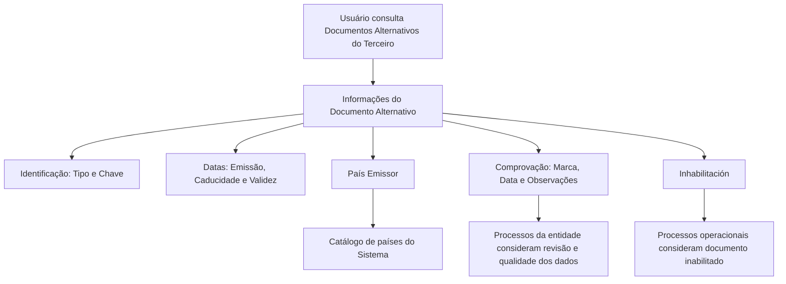

# Consulta de Documentos Alternativos do Terceiro

## 1. Metadados do Documento
- **Arquivo de Origem:** Não identificado
- **Tipo de Documento:** Especificação Funcional
- **Domínio / Sistema:** Gestão de Terceiros — Documentos Alternativos
- **Público-Alvo:** Não identificado
- **Data/Versão Identificada:** Não identificada

---

## 2. Resumo Executivo & Contexto de Negócio

O documento descreve a funcionalidade **“Consultar los Documentos Alternativos del Tercero”**, cujo objetivo é visualizar os documentos alternativos utilizados para identificar um Terceiro. A ação explicitamente habilitada é **CONSULTAR**, sem indicação de inclusão, alteração ou exclusão de registros.

A especificação define atributos de visualização aplicáveis à informação de documentos alternativos. Quando os campos não forem especificados ou indicados expressamente, a visualização deve ocorrer indistintamente para **Personas Físicas** e **Personas Jurídicas**.

Os atributos documentados abrangem identificação do documento, chaves associadas, datas de emissão, caducidade e validade, país emissor, situação de comprovação, observações e inabilitação. Esses dados permitem que processos operacionais da entidade considerem a qualidade, revisão, validade e disponibilidade operacional do documento alternativo.

O documento também indica que o país emissor deve ser apresentado conforme o catálogo de países do Sistema. A marca de comprovação e sua data associada registram a revisão e verificação do documento, enquanto a inabilitação identifica documentos que não devem ser utilizados em processos operacionais que demandem essa consideração.

---

## 3. Arquitetura, Componentes & Tecnologias Envolvidas

O conteúdo não descreve arquitetura de software, microsserviços, APIs, tecnologias, bancos de dados, integrações, URLs, ambientes ou contratos técnicos. Os únicos elementos funcionais identificados são a funcionalidade de consulta, o Terceiro, o Documento Alternativo e o catálogo de países do Sistema.



> **Nota de Análise:** O documento não detalha a implementação técnica da consulta, os métodos HTTP, contratos JSON, persistência de dados, controle de acesso ou mecanismos de integração.

---

## 4. Regras de Negócio, Especificações Funcionais & Processos

### Objetivo funcional
- A funcionalidade permite visualizar os **Documentos Alternativos do Terceiro**.
- A ação habilitada apresentada no documento é **CONSULTAR**.

### Regras de apresentação
- Os atributos determinam a sequência de visualização da informação da esquerda para a direita e de cima para baixo.
- Quando os campos não forem especificados ou expressamente indicados, os campos devem ser apresentados indistintamente para Pessoas Físicas e Pessoas Jurídicas.

### Regras sobre identificação e vigência
- O atributo **Tipo Documento Alternativo** apresenta o documento alternativo com o qual o Terceiro é identificado.
- A **Clave del Documento Alternativo** contém a chave do documento alternativo do Terceiro.
- A **Fecha de Emisión** apresenta a data de emissão do documento alternativo.
- A **Fecha de Caducidad**, quando conhecida, indica a data de expiração do documento alternativo.
- A **Fecha de Validez** informa ao Sistema a data a partir da qual o Documento Alternativo do Terceiro está ou estará plenamente operativo.

### Regras sobre país emissor
- O atributo **País Emisor** apresenta o código do país emissor do documento alternativo.
- O código do país emissor deve seguir a relação de valores existentes no catálogo de países do Sistema.

### Regras sobre comprovação e qualidade de dados
- A **Marca de Comprobación** indica se o documento alternativo foi ou não revisado e verificado.
- A marca de comprovação deve ser considerada nos processos da entidade relacionados à qualidade dos dados no Sistema.
- Quando o estado da marca de comprovação indicar que o documento foi revisado e comprovado, a **Fecha de Comprobación** deve conter a data em que essa ação foi realizada.
- Quando o documento alternativo tiver sido revisado e validado, o atributo **Observaciones** deve apresentar o texto aclaratório ou as observações sobre a comprovação.

### Regras sobre inabilitação
- O atributo **Inhabilitación** indica que o documento alternativo do Terceiro está inabilitado.
- A condição de inabilitação deve ser empregada, considerada ou utilizada pelos processos operacionais da entidade que demandarem essa informação.

---

## 5. Tabelas de Parâmetros, Ambientes e Estruturas de Dados

| Item / Parâmetro | Descrição / Função | Tipo / Valores / Formato | Ambiente / Observações |
| :--- | :--- | :--- | :--- |
| Ação habilitada | Permite consultar os Documentos Alternativos do Terceiro. | `CONSULTAR` | Não há ações de inclusão, alteração ou exclusão documentadas. |
| Tipo Documento Alternativo | Apresenta o documento alternativo utilizado para identificar o Terceiro. | Não especificado | Aplicável à identificação do Terceiro. |
| Clave del Documento Alternativo | Contém a chave do documento alternativo do Terceiro. | Não especificado | O documento utiliza o termo “Clave”. |
| Fecha de Emisión | Apresenta a data de emissão do documento alternativo. | Data; formato não especificado | Não há regra adicional de obrigatoriedade. |
| Fecha de Caducidad | Indica a data de caducidade do documento alternativo, quando conhecida. | Data; formato não especificado | Campo condicional: “si conocido”. |
| País Emisor | Apresenta o código do país emissor do documento alternativo. | Código de país | Deve respeitar o catálogo de países do Sistema. |
| Marca de Comprobación | Indica se o documento alternativo foi revisado e verificado. | Estado não especificado | Deve ser considerada nos processos da entidade relacionados à qualidade de dados. |
| Fecha de Comprobación | Registra a data da revisão e comprovação do documento. | Data; formato não especificado | Preenchimento aplicável quando a marca indicar documento revisado e comprovado. |
| Observaciones | Exibe texto aclaratório ou observações sobre a comprovação. | Texto | Aplicável quando o documento tiver sido revisado e validado. |
| Fecha de Validez | Indica a data a partir da qual o documento está ou estará plenamente operativo. | Data; formato não especificado | Relacionada à vigência operacional do documento. |
| Inhabilitación | Indica que o documento alternativo do Terceiro está inabilitado. | Estado não especificado | Deve ser considerada pelos processos operacionais que demandarem essa condição. |
| Pessoas Físicas | Categoria de Terceiro abrangida pela visualização, quando os campos não forem expressamente diferenciados. | Categoria de pessoa | Aplicação indistinta conforme regra de apresentação. |
| Pessoas Jurídicas | Categoria de Terceiro abrangida pela visualização, quando os campos não forem expressamente diferenciados. | Categoria de pessoa | Aplicação indistinta conforme regra de apresentação. |

---

## 6. Bateria de Perguntas & Respostas para RAG (FAQ Sintético)

### P1: Qual é o objetivo da funcionalidade de Documentos Alternativos do Terceiro?
**R:** O objetivo é visualizar os Documentos Alternativos do Terceiro. O documento apresenta a funcionalidade como “Consultar los Documentos Alternativos del Tercero”.

### P2: Qual ação está habilitada para os Documentos Alternativos do Terceiro?
**R:** A ação habilitada é **CONSULTAR**. O conteúdo não documenta ações de criação, alteração, exclusão ou validação manual.

### P3: A consulta de Documentos Alternativos é aplicável a Pessoas Físicas e Pessoas Jurídicas?
**R:** Sim. Quando os campos não forem especificados ou expressamente indicados, os atributos devem ser visualizados indistintamente para Pessoas Físicas e Pessoas Jurídicas.

### P4: O que representa o Tipo Documento Alternativo?
**R:** O Tipo Documento Alternativo mostra o documento alternativo com o qual o Terceiro é identificado.

### P5: Como o país emissor do documento alternativo deve ser apresentado?
**R:** O País Emissor deve apresentar o código do país emissor do documento alternativo do Terceiro, conforme a relação de valores existente no catálogo de países do Sistema.

### P6: Quando a Fecha de Caducidad deve ser informada?
**R:** A Fecha de Caducidad deve indicar a data de caducidade do documento alternativo quando essa data for conhecida. O formato da data não é especificado.

### P7: Qual é a finalidade da Marca de Comprobación?
**R:** A Marca de Comprobación permite considerar, nos processos da entidade, se o documento alternativo foi revisado e verificado, em relação à qualidade dos dados no Sistema.

### P8: Quando a Fecha de Comprobación deve conter uma data?
**R:** A Fecha de Comprobación deve conter a data em que a revisão e a comprovação foram realizadas quando o estado da Marca de Comprobación indicar que o documento alternativo foi revisado e comprovado.

### P9: Quando o campo Observaciones é utilizado?
**R:** Observaciones é utilizado quando o documento alternativo tiver sido revisado e validado. O campo apresenta o texto aclaratório ou as observações relacionadas ao fato da comprovação.

### P10: O que significa a Fecha de Validez de um Documento Alternativo?
**R:** A Fecha de Validez informa ao Sistema a data a partir da qual o Documento Alternativo do Terceiro está ou estará plenamente operativo.

### P11: Como a Inhabilitación deve ser tratada pelos processos operacionais?
**R:** A Inhabilitación indica que o documento alternativo do Terceiro está inabilitado. Essa condição deve ser empregada, considerada ou utilizada nos processos operacionais da entidade que demandarem essa informação.

### P12: O documento define APIs, microsserviços ou tecnologias para a consulta?
**R:** Não. O documento apresenta requisitos funcionais e atributos de visualização, mas não detalha APIs, microsserviços, tecnologias, métodos HTTP, contratos JSON, URLs ou ambientes técnicos.

---

## 7. Glossário de Termos, Siglas & Conceitos-Chave

- **Terceiro:** Entidade identificada por meio de um Documento Alternativo, podendo corresponder a Pessoa Física ou Pessoa Jurídica conforme a regra de apresentação.
- **Documento Alternativo:** Documento utilizado para identificar o Terceiro.
- **Tipo Documento Alternativo:** Atributo que apresenta o documento alternativo pelo qual o Terceiro é identificado.
- **Clave del Documento Alternativo:** Chave associada ao documento alternativo do Terceiro.
- **Fecha de Emisión:** Data de emissão do documento alternativo.
- **Fecha de Caducidad:** Data de caducidade do documento alternativo, quando conhecida.
- **País Emisor:** Código do país que emitiu o documento alternativo, conforme o catálogo de países do Sistema.
- **Marca de Comprobación:** Indicador de que o documento alternativo foi ou não revisado e verificado.
- **Fecha de Comprobación:** Data em que a revisão e a comprovação do documento foram realizadas.
- **Observaciones:** Texto aclaratório ou observações relativas à comprovação do documento.
- **Fecha de Validez:** Data a partir da qual o documento está ou estará plenamente operativo.
- **Inhabilitación:** Condição que indica que o documento alternativo está inabilitado.
- **Sistema:** Referência ao sistema que possui catálogo de países e utiliza informações de documentos alternativos nos processos da entidade.

---

## 8. Notas Críticas, Riscos & Limitações

- O documento não identifica o nome do sistema, arquivo de origem, versão, data, equipe responsável ou público-alvo.
- O documento não especifica formatos de data, obrigatoriedade, tamanho de campos, valores permitidos, códigos de retorno, mensagens de erro ou regras de persistência.
- Não há detalhamento sobre o significado dos possíveis estados da Marca de Comprobación ou da Inhabilitación.
- Não há definição de critérios para determinar quando a Fecha de Caducidad é “conhecida”.
- Não há especificação sobre como os processos operacionais devem bloquear, alertar ou tratar documentos inabilitados.
- O documento cita o catálogo de países do Sistema, mas não fornece os valores do catálogo.
- Não há detalhamento de arquitetura, autenticação, autorização, auditoria, APIs, integrações ou ambientes.
- **Nota de Análise:** O conteúdo descreve uma ação de consulta e atributos funcionais, porém não detalha o comportamento de interface, regras de ordenação específicas por campo ou contratos técnicos de implementação.

---

## 9. Conteúdo Bruto Estruturado (Referência Fiel)

```text
--- [PÁGINA 1 DE 3] ---

CONSULTAR los Documentos Alternativos del
Tercero
Objetivo
Visualizar los Documentos Alternativos del Tercero.
Acciones habilitadas
 CONSULTAR ( )
Documentos Alternativos
De izquierda a derecha y de arriba hacia abajo, los siguientes atributos determinan la secuencia de
visualización de la Información.
Si no se especifica o indica expresamente los Campos se visualizarán indistintamente tanto en las
Personas Físicas como para las Personas Jurídicas.
Tipo Documento Alternativo
 /
 RS
Inicio Soluciones APIs Documentación Zeus
ES


--- [PÁGINA 2 DE 3] ---

Este Atributo del muestra el documento alternativo con el que se identifica al Tercero de acuerdo.
Clave del Documento Alternativo
Este date del bloque de información contiene la clave del documento alternativo del Tercero.
Fecha de Emisión
Esta propiedad muestra la fecha de emisión del documento alternativo del Tercero.
Fecha de Caducidad
Este campo, si conocido, indica la fecha de caducidad del documento alternativo del Tercero.
País Emisor
Este dato visualiza el código del país emisor del documento alternativo del Tercero de acuerdo con la
relación de posibles valores existentes en el catálogo de países del Sistema.
Marca de Comprobación
Esta propiedad permite considerar en los procesos de la entidad si el documento alternativo ha sido o
no revisado y verificado, todo ello en relación con la calidad de los datos en el sistema.
Fecha de Comprobación
En el supuesto que el estado de la marca de comprobación implique que el documento alternativo sí
haya sido revisado y comprobado, este campo contiene la fecha en la que esta acción se habrá
realizado.
Observaciones
Caso que el documento alternativo haya sido revisado y validado, este Dato visualiza el texto
aclaratorio u observaciones sobre el propio hecho de la comprobación.
Fecha de Validez
Esta propiedad le indica al sistema la fecha a partir de la cual el Documento Alternativo del Tercero
está o estará plenamente operativo.
Inhabilitación
El cotejo de este campo muestra e indica que el documento alternativo del Tercero está inhabilitado,
por lo que este supuesto debería ser empleado, considerado o utilizado en los procesos operativos
de la entidad que así lo demandaran.


--- [PÁGINA 3 DE 3] ---

[Página em branco ou apenas elementos visuais/imagem]
```
