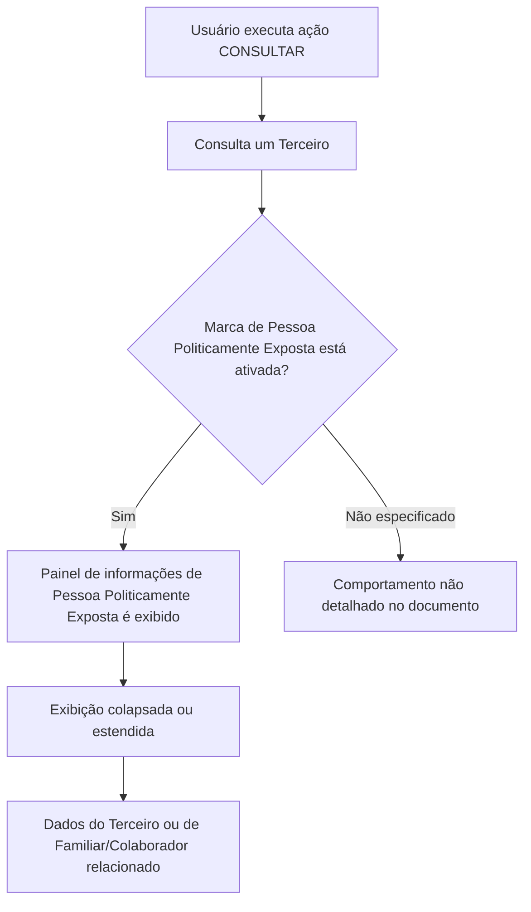

# Consulta de Persona Políticamente Expuesta (PEP)

## 1. Metadados do Documento
- **Arquivo de Origem:** Não identificado
- **Tipo de Documento:** Manual Operacional
- **Domínio / Sistema:** Consulta de Terceiro como Persona Políticamente Expuesta
- **Público-Alvo:** Operação, Negócio e usuários do sistema
- **Data/Versão Identificada:** Não identificada

---

## 2. Resumo Executivo & Contexto de Negócio

O documento descreve a funcionalidade de consulta de dados de um Terceiro classificado como **Persona Políticamente Expuesta**, incluindo situações em que o Terceiro possui relação com um Familiar ou Colaborador que detenha essa condição.

A ação habilitada apresentada é **CONSULTAR**. A visualização do painel de informação depende da ativação, no sistema, da marca que identifica que o Terceiro é uma Pessoa Politicamente Exposta ou possui uma Pessoa Politicamente Exposta associada.

Quando a marca estiver ativada, o sistema apresenta o painel de informações de Pessoa Politicamente Exposta. Esse painel pode ser exibido de forma colapsada ou estendida. A sequência de apresentação dos atributos deve ser interpretada da esquerda para a direita e de cima para baixo.

A informação exibida permite identificar datas de alta e baixa, vínculo familiar ou de colaboração, cargo ou relação, tipo e chave do documento identificador da pessoa relacionada, além de uma indicação de inabilitação para processos internos de controle.

---

## 3. Arquitetura, Componentes & Tecnologias Envolvidas

Os componentes funcionais explicitamente citados são:

| Componente / Elemento | Função descrita |
| :--- | :--- |
| Terceiro | Entidade consultada no sistema. |
| Marca de identificação | Indica que o Terceiro é Pessoa Politicamente Exposta ou possui pessoa associada com essa condição. |
| Painel de informações de Pessoa Politicamente Exposta | Exibe as informações relacionadas à condição do Terceiro ou de Familiar/Colaborador relacionado. |
| Familiar ou Colaborador | Pessoa relacionada ao Terceiro que pode possuir a condição de Pessoa Politicamente Exposta. |
| Catálogo de Cargos | Fonte dos possíveis valores para o campo de cargo ou relação. |
| Processos de controle internos | Processos nos quais uma pessoa inabilitada não deve ser considerada. |



**Nota de Análise:** O documento não detalha tecnologias, endpoints, contratos JSON, serviços, bancos de dados, autenticação ou regras de autorização além da ação habilitada de consulta.

---

## 4. Regras de Negócio, Especificações Funcionais & Processos

1. A funcionalidade possui a ação habilitada **CONSULTAR**.
2. O objetivo da consulta é visualizar dados de um Terceiro como Pessoa Politicamente Exposta ou sua relação com Familiar ou Colaborador que possua essa condição.
3. O painel de informações de Pessoa Politicamente Exposta é apresentado somente quando estiver ativada a marca de identificação correspondente no sistema.
4. A marca pode identificar:
   - que o próprio Terceiro é Pessoa Politicamente Exposta; ou
   - que o Terceiro possui associada uma Pessoa Politicamente Exposta.
5. O painel pode ser visualizado de forma:
   - colapsada; ou
   - estendida.
6. A ordem de visualização dos atributos segue a sequência descrita da esquerda para a direita e de cima para baixo.
7. A data de alta registra a alta do Terceiro ou do Familiar/Colaborador como Pessoa Politicamente Exposta.
8. A data de baixa registra o momento em que o Terceiro ou a Pessoa Politicamente Exposta relacionada deixou essa condição.
9. O atributo **Familiar / Colaborador** identifica a natureza do vínculo da Pessoa Politicamente Exposta relacionada com o Terceiro.
10. O campo **Cargo ou Relação com a Pessoa Politicamente Exposta** apresenta o cargo ou relação do Terceiro ou da pessoa relacionada, conforme os valores disponíveis no catálogo de cargos do sistema.
11. O tipo e a chave do documento identificador referem-se ao Familiar ou Colaborador relacionado ao Terceiro.
12. A propriedade **Inhabilitación** indica que o Terceiro ou a Pessoa Politicamente Exposta relacionada está inabilitada e, consequentemente, não deve ser considerada nos processos internos de controle da entidade.

---

## 5. Tabelas de Parâmetros, Ambientes e Estruturas de Dados

| Item / Parâmetro | Descrição / Função | Tipo / Valores / Formato | Ambiente / Observações |
| :--- | :--- | :--- | :--- |
| Ação habilitada | Permite consultar informações de Pessoa Politicamente Exposta. | `CONSULTAR` | O documento não detalha permissões adicionais. |
| Marca de identificação | Determina a apresentação do painel de informações. | Ativada / não detalhado | Deve identificar o Terceiro como PEP ou possuir PEP associada. |
| Painel de informação | Exibe os dados de Pessoa Politicamente Exposta. | Colapsado ou estendido | Aparece quando a marca de identificação está ativada. |
| Fecha de Alta como Persona Políticamente Expuesta | Exibe a data de alta do Terceiro ou do Familiar/Colaborador como PEP. | Data | O formato da data não é informado. |
| Fecha de Baja como Persona Políticamente Expuesta | Exibe a data em que o Terceiro ou a PEP relacionada deixou a condição. | Data | O formato da data não é informado. |
| Familiar / Colaborador | Identifica se a PEP relacionada é Familiar ou Colaborador do Terceiro. | Familiar / Colaborador | Refere-se à pessoa relacionada. |
| Cargo o Relación con la Persona Políticamente Expuesta | Exibe o cargo ou relação do Terceiro ou da PEP relacionada. | Valores do catálogo de cargos | O conteúdo do catálogo não é detalhado. |
| Tipo Documento Identificador de la Persona Políticamente Expuesta Relacionada | Exibe o tipo de documento do Familiar ou Colaborador relacionado. | Tipo de documento | Valores possíveis não informados. |
| Clave del Documento Identificador de la Persona Políticamente Relacionada | Contém a chave do documento identificador do Familiar ou Colaborador relacionado. | Chave de documento | Formato não informado. |
| Inhabilitación | Indica inabilitação do Terceiro ou da PEP relacionada. | Propriedade indicativa | A pessoa inabilitada não deve ser considerada nos processos internos de controle. |

---

## 6. Bateria de Perguntas & Respostas para RAG (FAQ Sintético)

### P1: Qual é o objetivo da funcionalidade de consulta de Pessoa Politicamente Exposta?
**R:** O objetivo é visualizar os dados de um Terceiro classificado como Pessoa Politicamente Exposta ou verificar a relação do Terceiro com um Familiar ou Colaborador que possua essa condição.

### P2: Qual ação está habilitada no processo apresentado?
**R:** A única ação habilitada explicitamente no documento é **CONSULTAR**.

### P3: Em que condição o painel de informações de Pessoa Politicamente Exposta é exibido?
**R:** O painel é exibido quando estiver ativada no sistema a marca que identifica que o Terceiro é Pessoa Politicamente Exposta ou que possui associada uma pessoa com essa condição.

### P4: Como o painel de informações de Pessoa Politicamente Exposta pode ser apresentado?
**R:** O painel pode aparecer de maneira colapsada ou de maneira estendida. O documento não detalha critérios para escolher automaticamente uma dessas visualizações.

### P5: O que representa a data de alta como Pessoa Politicamente Exposta?
**R:** A data de alta mostra a data em que o Terceiro ou o Familiar/Colaborador relacionado foi registrado como Pessoa Politicamente Exposta.

### P6: O que representa a data de baixa como Pessoa Politicamente Exposta?
**R:** A data de baixa mostra a data em que o Terceiro ou a Pessoa Politicamente Exposta relacionada deixou de possuir a condição de Pessoa Politicamente Exposta.

### P7: Como o sistema identifica a natureza da relação da Pessoa Politicamente Exposta relacionada com o Terceiro?
**R:** O atributo **Familiar / Colaborador** identifica se a Pessoa Politicamente Exposta relacionada é Familiar ou Colaborador do Terceiro.

### P8: De onde provêm os valores de cargo ou relação exibidos para uma Pessoa Politicamente Exposta?
**R:** O campo de cargo ou relação utiliza os possíveis valores existentes no catálogo de cargos do sistema. O documento não apresenta os valores desse catálogo.

### P9: A que pessoa se referem o tipo e a chave do documento identificador?
**R:** O tipo e a chave do documento identificador referem-se ao Familiar ou Colaborador relacionado com o Terceiro.

### P10: Qual é o efeito da propriedade Inhabilitación?
**R:** A propriedade Inhabilitación indica que o Terceiro ou a Pessoa Politicamente Exposta relacionada está inabilitada e, por isso, não deve ser considerada nos processos de controle internos existentes na entidade.

---

## 7. Glossário de Termos, Siglas & Conceitos-Chave

- **Persona Políticamente Expuesta:** Condição atribuída ao Terceiro ou a uma pessoa relacionada, conforme apresentada pelo documento.
- **Terceiro:** Entidade consultada pelo sistema.
- **Familiar / Colaborador:** Pessoa relacionada ao Terceiro que pode possuir a condição de Pessoa Politicamente Exposta.
- **Marca de identificação:** Indicador ativado no sistema que habilita a apresentação do painel de informações de Pessoa Politicamente Exposta.
- **Inhabilitación:** Propriedade que indica que o Terceiro ou a Pessoa Politicamente Exposta relacionada não deve ser considerada nos processos internos de controle.
- **Catálogo de Cargos:** Catálogo do sistema que contém os possíveis valores de cargo ou relação.

---

## 8. Notas Críticas, Riscos & Limitações

- O documento não identifica o nome do sistema, versão, ambiente, arquivo de origem ou data de publicação.
- Não há detalhamento de tecnologias, integrações, APIs, métodos HTTP, contratos de dados ou persistência.
- Não são especificados os critérios técnicos para ativação da marca de identificação de Pessoa Politicamente Exposta.
- O documento não detalha o comportamento do sistema quando a marca não está ativada.
- Os valores disponíveis no catálogo de cargos não são apresentados.
- Não há especificação de formato para datas, tipo de documento ou chave de documento.
- Não são detalhados os processos internos de controle impactados pela propriedade Inhabilitación.

---

## 9. Conteúdo Bruto Estruturado (Referência Fiel)

```text
--- [PÁGINA 1 DE 2] ---

CONSULTAR Persona Políticamente Expuesta
Objetivo
Visualizar los datos del Tercero como Persona Políticamente Expuesta o su relación con algún
Familiar o estrecho Colaborador que tenga dicha condición.
Acciones habilitadas
 CONSULTAR ( )
Datos Persona Políticamente Expuesta
Siempre y cuando se haya activado la marca que identifica en el sistema que el Tercero es o tiene
asociada una persona políticamente expuesta aparecerá el panel de información correspondiente de
manera colapsada...
... o de manera extendida
 /
 RS
Inicio Soluciones APIs Documentación Zeus
ES


--- [PÁGINA 2 DE 2] ---

De izquierda a derecha y de arriba hacia abajo, los siguientes atributos determinan la secuencia de
visualización de la Información.
Fecha de Alta como Persona Políticamente Expuesta
Este Dato visualiza la fecha de Alta del Tercero o del Familiar o Colaborador del Tercero como
Persona Políticamente Expuesta.
Fecha de Baja como Persona Políticamente Expuesta
Este Dato muestra la fecha en la que el Tercero o la Persona Políticamente Expuesta Relacionada
causó baja como Persona Políticamente Expuesta.
Familiar / Colaborador
Este Atributo identifica si la Persona Políticamente Expuesta Relacionada es un Familiar o un
Colaborador del Tercero.
Cargo o Relación con la Persona Políticamente Expuesta
Este Campo muestra la relación o el Cargo del Tercero o de la Persona Políticamente Expuesta
relacionada, de acuerdo con los posibles valores del catálogo de Cargos existente en el Sistema.
Tipo Documento Identificador de la Persona Políticamente Expuesta
Relacionada
Este campo observa el tipo de documento del Familiar o Colaborador Relacionado con el Tercero.
Clave del Documento Identificador de la Persona Políticamente Relacionada
Este dato contiene la clave del documento Identificador del Familiar o Colaborador Relacionado con
el Tercero.
Inhabilitación
Esta propiedad indica que o bien el Tercero o la Personas Políticamente Expuesta Relacionada con
el Tercero está inhabilitada y por ende no debiera considerarse en los procesos de control internos
existentes en la entidad.
```
