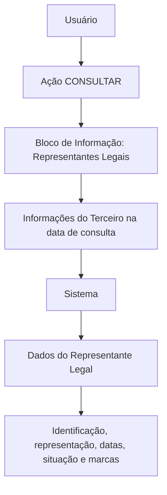

# Consulta de Representantes Legais de Terceiros — Especificação Funcional de Visualização

## 1. Metadados do Documento
- **Arquivo de Origem:** Não identificado no conteúdo fornecido
- **Tipo de Documento:** Especificação Técnica / Manual Funcional
- **Domínio / Sistema:** Consulta de informações de Terceiros e Representantes Legais
- **Público-Alvo:** Desenvolvedores, analistas funcionais, operação e negócio
- **Data/Versão Identificada:** Não identificada

---

## 2. Resumo Executivo & Contexto de Negócio

O documento descreve um bloco de informação destinado à consulta e visualização dos Representantes Legais de um Terceiro na data de consulta das informações desse Terceiro. A ação explicitamente habilitada no bloco é **CONSULTAR**.

A visualização dos dados segue uma sequência determinada pelos atributos apresentados da esquerda para a direita e de cima para baixo. Quando os campos não forem expressamente diferenciados, devem ser usados indistintamente para mostrar informações de Pessoas Físicas e Pessoas Jurídicas.

A especificação define atributos de identificação, representação, vigência, situação e indicadores de risco do Representante Legal. Entre os dados previstos estão documento, nome completo, tipo ou classe de representação legal, datas de alta, baixa e validade, além de marcas relacionadas a Pessoa Politicamente Exposta, Pessoa Investigada, inabilitação e realização de atividades ilícitas.

O cadastro do nome completo do Representante Legal depende de registro prévio no Sistema e de identificação com o código de atividade **45**. O documento não detalha o significado do código de atividade 45, os critérios de preenchimento dos indicadores, os métodos de integração, contratos JSON, persistência de dados ou controles de autorização.

---

## 3. Arquitetura, Componentes & Tecnologias Envolvidas

Os componentes e elementos explicitamente citados são:

- **Terceiro:** entidade cuja informação é consultada.
- **Representante Legal:** pessoa associada ao Terceiro e exibida no bloco de informação.
- **Sistema:** origem dos tipos de documentos existentes e do cadastro prévio do nome completo do Representante Legal.
- **Bloco de Informação:** área funcional usada para visualizar Representantes Legais.
- **Ação CONSULTAR:** ação habilitada para consulta dos dados.
- **Pessoa Física e Pessoa Jurídica:** categorias para as quais os campos podem ser empregados indistintamente quando não houver indicação específica.



**Nota de Análise:** o conteúdo não descreve microsserviços, APIs, métodos HTTP, contratos de integração, banco de dados, servidores, ambientes, autenticação ou tecnologias de implementação.

---

## 4. Regras de Negócio, Especificações Funcionais & Processos

1. O propósito do bloco de informação é visualizar o(s) Representante(s) Legal(is) do Terceiro na data em que a informação do Terceiro for consultada.
2. A ação habilitada no bloco é **CONSULTAR**.
3. A sequência de visualização dos atributos é definida da esquerda para a direita e de cima para baixo.
4. Quando os campos não forem especificados ou indicados expressamente, os mesmos campos devem ser empregados indistintamente para exibir informações de Pessoas Físicas e Pessoas Jurídicas.
5. O atributo **Tipo Documento Representante Legal** apresenta o tipo de documento utilizado para identificar o Representante Legal, conforme os tipos de documentos existentes no Sistema.
6. O atributo **Clave del Documento** contém a chave do documento do Representante Legal do Terceiro.
7. O campo **Nombre Completo** exibe o nome completo do Representante Legal do Terceiro.
8. Para exibição do **Nombre Completo**, o Representante Legal deve estar previamente registrado no Sistema e identificado com o código de atividade **45**.
9. O atributo **Tipo/Clase de Representación Legal** contém a classe ou tipologia de representação legal associada à pessoa.
10. A classe ou tipologia de representação legal deve obedecer à codificação efetuada localmente pela entidade seguradora.
11. O atributo **Fecha Inicio** exibe a data de alta da pessoa como Representante Legal.
12. O atributo **Fecha Fin** exibe a data de baixa em que a pessoa deixa de exercer a função de Representante Legal do Terceiro.
13. O atributo **Fecha de Validez** mostra a data a partir da qual a pessoa passa ou passará a vigorar como Representante Legal do Terceiro.
14. O atributo **Marca Persona Políticamente Expuesta** identifica se o Representante Legal é uma Pessoa Politicamente Exposta.
15. O atributo **Inhabilitación** indica se o status do Representante Legal permanece vigente ou se o Representante Legal está inabilitado para exercer essa função.
16. O atributo **Marca Persona Investigada** identifica se o Representante Legal é uma Pessoa Investigada.
17. O atributo **Marca Realización Actividades Ilícitas** determina se o Representante Legal realizou algum tipo de atividade ilícita.
18. Quando a marca de realização de atividades ilícitas estiver ativa, o atributo **Descripción de Actividades** deve exibir o texto explicativo registrado para essas atividades.

---

## 5. Tabelas de Parâmetros, Ambientes e Estruturas de Dados

| Item / Parâmetro | Descrição / Função | Tipo / Valores / Formato | Ambiente / Observações |
| :--- | :--- | :--- | :--- |
| CONSULTAR | Ação habilitada para consultar Representantes Legais. | Ação funcional. | Não há detalhamento de permissões ou mecanismo de execução. |
| Representantes Legales | Bloco de informação para visualização dos Representantes Legais do Terceiro. | Bloco funcional de consulta. | A consulta considera a data de consulta da informação do Terceiro. |
| Tipo Documento Representante Legal | Tipo de documento que identifica o Representante Legal. | Tipo de documento existente no Sistema. | O documento não enumera os tipos aceitos. |
| Clave del Documento | Chave do documento do Representante Legal do Terceiro. | Não especificado. | Não há regra de formato ou validação. |
| Nombre Completo | Nome completo do Representante Legal do Terceiro. | Texto. | Requer registro prévio no Sistema e identificação com código de atividade 45. |
| Código de atividade 45 | Código associado ao Representante Legal previamente registrado no Sistema. | Código numérico mencionado como `45`. | O significado e as regras de atribuição não são detalhados. |
| Tipo/Clase de Representación Legal | Classe ou tipologia de representação legal associada à pessoa. | Codificação local. | A codificação é efetuada localmente pela entidade seguradora. |
| Fecha Inicio | Data de alta da pessoa como Representante Legal. | Data. | Formato não informado. |
| Fecha Fin | Data de baixa em que a pessoa deixa de atuar como Representante Legal do Terceiro. | Data. | Formato não informado. |
| Fecha de Validez | Data a partir da qual a pessoa entra ou entrará em vigor como Representante Legal do Terceiro. | Data. | Pode representar vigência atual ou futura. |
| Marca Persona Políticamente Expuesta | Indicador de que o Representante Legal é Pessoa Politicamente Exposta. | Marca/indicador. | Valores possíveis não informados. |
| Inhabilitación | Situação de vigência ou inabilitação do Representante Legal. | Status/indicador. | Não são definidos códigos ou valores possíveis. |
| Marca Persona Investigada | Indicador de que o Representante Legal é Pessoa Investigada. | Marca/indicador. | Valores possíveis não informados. |
| Marca Realización Actividades Ilícitas | Indicador de realização de algum tipo de atividade ilícita pelo Representante Legal. | Marca/indicador. | Quando ativa, habilita a exibição de Descripción de Actividades. |
| Descripción de Actividades | Texto explicativo sobre atividades ilícitas registradas. | Texto. | Exibido quando a marca de realização de atividades ilícitas estiver ativa. |
| Pessoas Físicas e Pessoas Jurídicas | Categorias de pessoas cujas informações podem ser apresentadas nos campos. | Categoria de pessoa. | Campos não especificados expressamente podem ser utilizados indistintamente para ambas. |

---

## 6. Bateria de Perguntas & Respostas para RAG (FAQ Sintético)

### P1: Qual é o objetivo do bloco de informação de Representantes Legais?
**R:** O bloco de informação tem como objetivo visualizar o(s) Representante(s) Legal(is) do Terceiro na data em que as informações desse Terceiro são consultadas.

### P2: Qual ação está habilitada no bloco de Representantes Legais?
**R:** A ação explicitamente habilitada no bloco de informação é **CONSULTAR**.

### P3: Como é definida a ordem de apresentação dos atributos na tela de Representantes Legais?
**R:** A sequência de visualização é determinada pelos atributos apresentados da esquerda para a direita e de cima para baixo.

### P4: Os mesmos campos podem ser usados para Pessoas Físicas e Pessoas Jurídicas?
**R:** Sim. Quando os campos não forem especificados ou indicados expressamente, eles podem ser empregados indistintamente para apresentar informações tanto de Pessoas Físicas quanto de Pessoas Jurídicas.

### P5: O que é apresentado no campo Tipo Documento Representante Legal?
**R:** O campo apresenta o tipo de documento usado para identificar o Representante Legal, de acordo com os tipos de documentos existentes no Sistema. O documento não lista quais tipos de documento são aceitos.

### P6: Qual pré-requisito existe para que o nome completo do Representante Legal seja exibido?
**R:** O Representante Legal deve estar previamente registrado no Sistema e identificado com o código de atividade 45. O documento não explica o significado do código de atividade 45.

### P7: Como a classe de representação legal é determinada?
**R:** A classe ou tipologia de representação legal é associada à pessoa conforme a codificação efetuada localmente pela entidade seguradora.

### P8: Qual é a diferença entre Fecha Inicio, Fecha Fin e Fecha de Validez?
**R:** **Fecha Inicio** mostra a data de alta da pessoa como Representante Legal. **Fecha Fin** mostra a data de baixa em que a pessoa deixa de exercer essa função. **Fecha de Validez** mostra a data a partir da qual a pessoa entra ou entrará em vigor como Representante Legal do Terceiro.

### P9: Quando a Descripción de Actividades deve ser exibida?
**R:** A Descripción de Actividades deve ser exibida quando a marca de realização de atividades ilícitas estiver ativa. O campo apresenta o texto explicativo que foi registrado sobre essas atividades.

### P10: O que informa o atributo Inhabilitación?
**R:** Inhabilitación estabelece se o status do Representante Legal continua vigente ou se o Representante Legal está inabilitado para exercer a função.

### P11: Quais indicadores de risco ou situação do Representante Legal são descritos?
**R:** O documento descreve as marcas de Pessoa Politicamente Exposta, Pessoa Investigada e Realização de Atividades Ilícitas, além do atributo Inhabilitación para indicar vigência ou inabilitação.

---

## 7. Glossário de Termos, Siglas & Conceitos-Chave

- **Terceiro:** entidade cuja informação é consultada e à qual o Representante Legal está associado.
- **Representante Legal:** pessoa identificada como representante do Terceiro e visualizada no bloco de informação.
- **Pessoa Física:** categoria de pessoa mencionada como possível destinatária dos campos de informação.
- **Pessoa Jurídica:** categoria de pessoa mencionada como possível destinatária dos campos de informação.
- **Pessoa Politicamente Exposta:** classificação indicada pela marca `Marca Persona Políticamente Expuesta`; o documento não fornece definição adicional.
- **Pessoa Investigada:** classificação indicada pela marca `Marca Persona Investigada`; o documento não fornece definição adicional.
- **Inhabilitación:** atributo que informa se o status do Representante Legal está vigente ou se existe inabilitação para exercer a representação.
- **Fecha Inicio:** data de alta da pessoa como Representante Legal.
- **Fecha Fin:** data de baixa em que a pessoa deixa de atuar como Representante Legal.
- **Fecha de Validez:** data a partir da qual a representação entra ou entrará em vigor.
- **Código de atividade 45:** código exigido para a identificação do Representante Legal previamente registrado no Sistema; sem detalhamento adicional no documento.
- **RS:** termo exibido na navegação do conteúdo original, sem expansão ou definição fornecida.
- **Zeus:** termo exibido na navegação do conteúdo original, sem definição funcional fornecida.

---

## 8. Notas Críticas, Riscos & Limitações

- O documento não identifica o arquivo original, autoria, versão, data, ambiente ou sistema específico.
- Não há definição de métodos HTTP, APIs, contratos JSON, serviços, microsserviços, banco de dados, URLs, portas, logs ou mecanismos de autenticação.
- Não foram informados os tipos de documentos existentes no Sistema, embora o atributo de tipo de documento dependa dessa lista.
- O significado, ciclo de vida e critérios de atribuição do código de atividade 45 não são detalhados.
- Não são especificados valores aceitos, obrigatoriedade, formato ou regras de validação para chaves de documento, datas e marcas.
- A codificação local da classe ou tipologia de representação legal é dependente da entidade seguradora e não está documentada.
- Não há detalhamento sobre a semântica operacional, origem dos dados ou tratamento dos indicadores de Pessoa Politicamente Exposta, Pessoa Investigada e atividades ilícitas.
- **Nota de Análise:** o documento lista atributos de risco e situação do Representante Legal, porém não detalha critérios de classificação, responsáveis pelo cadastro, auditoria, retenção ou atualização dessas informações.

---

## 9. Conteúdo Bruto Estruturado (Referência Fiel)

```text
--- [PÁGINA 1 DE 3] ---

CONSULTAR los Representantes Legales del
Tercero
El propósito de este Bloque de Información es Visualizar al/los Representantes Legales del Tercero
a la fecha de consulta de su información.
Acciones habilitadas
 CONSULTAR ( )
Representantes Legales
De izquierda a derecha y de arriba hacia abajo, los siguientes atributos determinan la secuencia de
visualización de la Información.
Si no se especifica o indica expresamente los Campos se emplearán indistintamente tanto para
mostrar información de las Personas Físicas como de las Personas Jurídicas.
Tipo Documento Representante Legal
 /
 RS
Inicio Soluciones APIs Documentación Zeus
ES


--- [PÁGINA 2 DE 3] ---

Este Atributo del colapsador contiene el Tipo de Documento con el que se identifica al Representante
Legal de acuerdo con los tipos de documentos existentes en el sistema.
Clave del Documento
Este Atributo contiene la clave del documento del Representante Legal del Tercero.
Nombre Completo
Este Campo mostrará el nombre completo del Representante Legal del Tercero que tendrá que estar
previamente registrado en el Sistema e identificado con el código de actividad 45.
Tipo/Clase de Representación Legal
Este dato contendrá la Clase o Tipología de Representación Legal que se va a asociar a la persona,
de acuerdo con la codificación efectuada localmente por parte de la entidad aseguradora.
Fecha Inicio
Este dato visualiza la Fecha de ALTA de la persona como Representante Legal.
Fecha Fin
Este Atributo muestra la Fecha de BAJA en la que la persona deja de fungir como Representante
Legal del Tercero.
Fecha de Validez
Esta propiedad muestra la Fecha a partir de la cual entra o entrará en vigor la persona como
Representante Legal del Tercero.
Marca Persona Políticamente Expuesta
Este campo identifica al Representante Legal como Persona Políticamente Expuesta.
Inhabilitación
Esta propiedad establece si el status del Representante Legal sigue en vigor o bien está inhabilitado
para ejercer como tal.
Marca Persona Investigada
Este Campo identifica al Representante Legal como Persona Investigada.
Marca Realización Actividades Ilícitas


--- [PÁGINA 3 DE 3] ---

Este Atributo determina que el Representante Legal es Persona que ha efectuado cualquier tipo de
actividades ilícitas.
Descripción de Actividades
En el caso que la marca de realización de actividades ilícitas esté activa, este atributo visualiza el
texto aclaratorio sobre dichas actividades que se registró en su momento.
```
