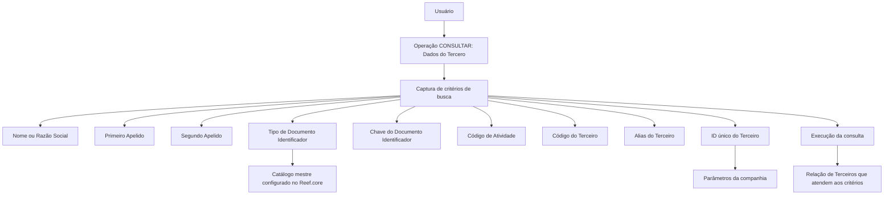

# Consulta de Terceiros por Dados do Terceiro no Reef.core

## 1. Metadados do Documento
- **Arquivo de Origem:** Não identificado no conteúdo fornecido
- **Tipo de Documento:** Manual Operacional
- **Domínio / Sistema:** Reef.core — consulta de Terceiros
- **Público-Alvo:** Operação, negócio e usuários do sistema
- **Data/Versão Identificada:** Não identificada

---

## 2. Resumo Executivo & Contexto de Negócio

O documento descreve a operação **CONSULTAR — Dados do Tercero**, destinada a pesquisar Terceiros cadastrados no sistema por meio dos critérios de busca mais usuais. A combinação lógica desses critérios permite executar consultas e obter a relação de Terceiros que atende às condições informadas.

A funcionalidade contempla consultas para **Personas Físicas** e **Personas Jurídicas**, salvo quando um critério for expressamente aplicável apenas a uma dessas classificações. O atributo **Nombre**, por exemplo, representa o nome da pessoa física ou a razão social da pessoa jurídica; os atributos de sobrenome são aplicáveis apenas a pessoas físicas.

A pesquisa aceita valores parciais ou completos para qualquer critério e não diferencia letras maiúsculas de minúsculas. A disponibilidade ou obrigatoriedade dos campos pode variar conforme o código de atividade atribuído ao Terceiro.

O documento afirma que não há limitações relativas ao papel do usuário nem às possíveis restrições de informação do usuário que realiza a consulta. Entretanto, não detalha regras de autenticação, perfis, contratos técnicos, métodos HTTP, persistência de dados ou critérios de combinação entre múltiplos campos.

---

## 3. Arquitetura, Componentes & Tecnologias Envolvidas

Os componentes e conceitos explicitamente citados são:

- **Reef.core:** sistema que suporta o cadastro e a consulta de Terceiros.
- **Catálogo mestre do Reef.core:** catálogo previamente configurado que contém os tipos de documentos identificadores.
- **Parâmetros da companhia:** configuração que pode exigir identificação unívoca dos Terceiros em todas as aplicações que gerenciam suas informações.
- **Dados do Tercero:** operação funcional de consulta.
- **Persona Física:** classificação de Terceiro para a qual nome e sobrenomes podem ser pesquisados.
- **Persona Jurídica:** classificação de Terceiro para a qual a razão social pode ser pesquisada.
- **Código de atividade do Terceiro:** atributo que pode influenciar habilitação e obrigatoriedade de campos.



**Nota de Análise:** o documento apresenta uma visão funcional da operação de consulta. O conteúdo não detalha a arquitetura de infraestrutura, integrações, APIs, banco de dados, protocolos, URLs, ambientes, logs ou tecnologias de implementação.

---

## 4. Regras de Negócio, Especificações Funcionais & Processos

### Operação de consulta

A operação **CONSULTAR — Datos del Tercero** permite capturar critérios de busca para localizar Terceiros no sistema. O resultado esperado é uma relação de Terceiros que cumprem os critérios informados.

### Premissas gerais

1. Quando não houver indicação expressa em contrário, os critérios de busca são utilizados indistintamente para consultas de **Personas Físicas** e **Personas Jurídicas**.
2. As buscas podem ser realizadas utilizando parte ou a totalidade do valor de qualquer critério.
3. As buscas não diferenciam critérios digitados em maiúsculas ou minúsculas.
4. A obrigatoriedade e/ou a habilitação dos campos de registro de dados em blocos ou estruturas de informação pode variar conforme o código de atividade do Terceiro.
5. Não existem limitações no papel nem nas possíveis restrições sobre informações que o usuário que executa a consulta possa possuir.
6. A sequência de preenchimento dos critérios segue a leitura da esquerda para a direita e de cima para baixo.

### Critérios de busca

#### Nome

O atributo **Nombre** contém:

- O nome simples ou composto do Terceiro, quando o Terceiro for uma Persona Física.
- A razão social, quando o Terceiro for uma Persona Jurídica.

#### Primeiro Apelido

O atributo **Primer Apellido** realiza busca pelo primeiro sobrenome do Terceiro, desde que o Terceiro seja uma Persona Física.

#### Segundo Apelido

O atributo **Segundo Apellido** explora o catálogo de acordo com o segundo sobrenome do Terceiro, desde que o Terceiro seja uma Persona Física.

#### Tipo de Documento Identificador

O critério **Tipo Documento Identificador** contém:

1. O tipo de documento usado para identificar a pessoa física ou jurídica, conforme a relação de tipos de documentos previamente configurados no catálogo mestre do Reef.core.
2. O tipo de documento alternativo do Terceiro.

#### Chave do Documento Identificador

O campo **Clave del Documento Identificador** contém a chave do Terceiro.

#### Código de Atividade do Terceiro

O critério **Código de Actividad del Tercero** permite pesquisar de acordo com o código de atividade informado para o Terceiro.

#### Código do Terceiro

O critério **Código del Tercero** permite pesquisar pelo código interno do sistema, atribuído automática ou manualmente ao Terceiro no momento de sua criação.

#### Alias do Terceiro

O critério **Alias del Tercero** permite informar o apelido ou sobrenome informal de um Terceiro, seja pessoa física ou jurídica.

#### ID único do Terceiro

O campo **ID único del Tercero** contém o código identificador único do Terceiro quando os parâmetros da companhia tiverem definido a necessidade de identificar univocamente os Terceiros em todas as aplicações que gerenciam suas informações.

O atributo **ID único do Terceiro não substitui**, em nenhuma circunstância, a funcionalidade do atributo **código do Terceiro**, pois o código do Terceiro é uma propriedade própria e exclusiva do Reef.core.

---

## 5. Tabelas de Parâmetros, Ambientes e Estruturas de Dados

| Item / Parâmetro | Descrição / Função | Tipo / Valores / Formato | Ambiente / Observações |
| :--- | :--- | :--- | :--- |
| Operação CONSULTAR | Consulta os dados de Terceiros por critérios de busca. | Ação habilitada. | Produz relação de Terceiros que atendem aos critérios. |
| Nome | Pesquisa pelo nome simples ou composto de pessoa física, ou razão social de pessoa jurídica. | Texto; pesquisa por parte ou totalidade do valor. | Aplicável a Personas Físicas e Personas Jurídicas. |
| Primeiro Apelido | Pesquisa pelo primeiro sobrenome do Terceiro. | Texto; pesquisa por parte ou totalidade do valor. | Aplicável quando o Terceiro for Persona Física. |
| Segundo Apelido | Explora o catálogo conforme o segundo sobrenome do Terceiro. | Texto; pesquisa por parte ou totalidade do valor. | Aplicável quando o Terceiro for Persona Física. |
| Tipo de Documento Identificador | Define o tipo de documento utilizado para identificar pessoa física ou jurídica; também contempla o tipo de documento alternativo do Terceiro. | Tipos configurados no catálogo mestre do Reef.core. | Requer configuração prévia no catálogo mestre. |
| Chave do Documento Identificador | Contém a chave do Terceiro. | Não detalhado. | O documento não define formato, tamanho ou validação. |
| Código de Atividade do Terceiro | Permite buscar pelo código de atividade informado. | Código de atividade. | Pode influenciar a habilitação e/ou obrigatoriedade de campos. |
| Código do Terceiro | Pesquisa pelo código interno do sistema atribuído na criação do Terceiro. | Código interno. | Atribuição automática ou manual; propriedade própria e exclusiva do Reef.core. |
| Alias do Terceiro | Permite pesquisar pelo apelido ou sobrenome informal do Terceiro. | Texto. | Aplicável a Terceiro físico ou jurídico. |
| ID único do Terceiro | Contém o identificador único do Terceiro. | Código identificador único. | Disponível quando configurado nos parâmetros da companhia; não substitui o código do Terceiro. |
| Diferenciação de maiúsculas/minúsculas | Define o comportamento da comparação de critérios textuais. | Não sensível a maiúsculas/minúsculas. | Aplicável às buscas. |
| Valor parcial ou completo | Define a abrangência do valor fornecido em um critério. | Parte ou totalidade do valor. | Aplicável a qualquer critério. |
| Papel e restrições do usuário | Define se o usuário possui limitação para executar a consulta. | Sem limitações informadas. | Não existem limitações no rol ou possíveis restrições de informação do usuário consultante. |
| Ambientes, URLs e logs | Informações de infraestrutura e operação. | Não identificado. | O documento não apresenta ambientes, rotas, URLs, variáveis ou caminhos de log. |

---

## 6. Bateria de Perguntas & Respostas para RAG (FAQ Sintético)

### P1: Qual é o objetivo da operação CONSULTAR — Dados do Tercero no Reef.core?
**R:** A operação CONSULTAR — Dados do Tercero permite capturar critérios de busca usuais para localizar Terceiros no sistema. A combinação lógica dos critérios possibilita executar a consulta e obter a relação de Terceiros que cumpre as condições informadas.

### P2: A consulta de Terceiros aceita pesquisa por apenas uma parte do valor informado?
**R:** Sim. As buscas de Terceiros podem ser realizadas usando parte ou a totalidade do valor de qualquer critério de pesquisa.

### P3: A pesquisa diferencia letras maiúsculas e minúsculas?
**R:** Não. As buscas são realizadas sem considerar se os critérios foram informados em maiúsculas ou minúsculas.

### P4: Como o campo Nome funciona para pessoa física e pessoa jurídica?
**R:** Para Persona Física, o atributo Nombre contém o nome simples ou composto do Terceiro. Para Persona Jurídica, o mesmo atributo contém a razão social.

### P5: Os campos Primeiro Apelido e Segundo Apelido podem ser usados para pessoas jurídicas?
**R:** Não. O documento estabelece que Primeiro Apelido e Segundo Apelido são critérios aplicáveis quando o Terceiro for uma Persona Física. O Primeiro Apelido busca pelo primeiro sobrenome, e o Segundo Apelido explora o catálogo conforme o segundo sobrenome.

### P6: De onde vêm os tipos disponíveis no Tipo de Documento Identificador?
**R:** O Tipo de Documento Identificador utiliza a relação de tipos de documentos previamente configurados no catálogo mestre do Reef.core. O critério também contempla o Tipo de Documento Alternativo do Terceiro.

### P7: O que representa o Código do Terceiro?
**R:** O Código do Terceiro é o código interno do sistema atribuído ao Terceiro automática ou manualmente no momento de sua criação. Esse código é uma propriedade própria e exclusiva do Reef.core.

### P8: O ID único do Terceiro substitui o Código do Terceiro?
**R:** Não. O documento declara expressamente que o ID único do Terceiro não substitui, em nenhum caso, a funcionalidade do atributo Código do Terceiro do Reef.core.

### P9: Quando o campo ID único do Terceiro é utilizado?
**R:** O campo ID único do Terceiro é utilizado quando os parâmetros da companhia definem a necessidade de identificar univocamente os Terceiros em todas as aplicações que gerenciam suas informações.

### P10: O Código de Atividade do Terceiro influencia a tela de consulta?
**R:** Sim. O Código de Atividade do Terceiro pode ser usado como critério de pesquisa. Além disso, a obrigatoriedade e/ou habilitação dos campos nos blocos ou estruturas de informação pode variar conforme esse código de atividade.

### P11: Existem restrições relacionadas ao perfil ou papel do usuário que faz a consulta?
**R:** Não. O documento informa que não existem limitações no papel nem nas possíveis restrições sobre informações que o usuário que efetua a consulta possa ter.

### P12: Quais são os critérios de busca apresentados para consultar um Terceiro?
**R:** Os critérios apresentados são: Nome, Primeiro Apelido, Segundo Apelido, Tipo de Documento Identificador, Chave do Documento Identificador, Código de Atividade do Terceiro, Código do Terceiro, Alias do Terceiro e ID único do Terceiro.

---

## 7. Glossário de Termos, Siglas & Conceitos-Chave

- **Reef.core:** sistema citado como proprietário do código do Terceiro e como repositório do catálogo mestre configurado para tipos de documentos.
- **Terceiro / Tercero:** entidade consultada no sistema; pode ser uma Persona Física ou Persona Jurídica.
- **Persona Física:** Terceiro individual, para o qual podem ser usados nome, primeiro apelido e segundo apelido.
- **Persona Jurídica:** Terceiro organizacional, para o qual o campo Nome representa a razão social.
- **Razão Social:** nome corporativo de uma Persona Jurídica.
- **Catálogo mestre:** catálogo previamente configurado no Reef.core que contém a relação de tipos de documentos identificadores.
- **Tipo de Documento Identificador:** tipo de documento utilizado para identificar uma pessoa física ou jurídica.
- **Tipo de Documento Alternativo:** tipo de documento alternativo associado ao Terceiro.
- **Chave do Documento Identificador:** campo que contém a chave do Terceiro.
- **Código de Atividade do Terceiro:** código que pode ser usado na pesquisa e pode influenciar habilitação ou obrigatoriedade de campos.
- **Código do Terceiro:** código interno do sistema, atribuído automática ou manualmente na criação do Terceiro; propriedade exclusiva do Reef.core.
- **Alias do Terceiro:** apelido ou sobrenome informal de um Terceiro físico ou jurídico.
- **ID único do Terceiro:** código destinado à identificação unívoca de Terceiros entre aplicações, quando essa necessidade estiver configurada nos parâmetros da companhia.
- **Parâmetros da companhia:** configuração que pode determinar a necessidade de identificação unívoca dos Terceiros em aplicações que gerenciam suas informações.

---

## 8. Notas Críticas, Riscos & Limitações

- **Nota de Análise:** o documento não detalha como os múltiplos critérios de pesquisa são combinados logicamente, apesar de afirmar que suas combinações possibilitam a consulta.
- **Nota de Análise:** não são informados formatos, tamanhos, obrigatoriedade específica ou validações para Nome, Chave do Documento Identificador, Código de Atividade, Código do Terceiro, Alias e ID único.
- **Nota de Análise:** não são apresentados contratos de API, métodos HTTP, estruturas JSON, banco de dados, integrações, URLs, ambientes, portas, logs ou mecanismos de auditoria.
- **Risco de interpretação:** embora seja afirmado que não existem limitações por papel ou restrições de informação do usuário, o documento não detalha o modelo de segurança, autenticação ou autorização que suporta essa afirmação.
- **Dependência de configuração:** os tipos de documentos dependem de configuração prévia no catálogo mestre do Reef.core.
- **Dependência de configuração:** a disponibilidade do ID único do Terceiro depende dos parâmetros definidos pela companhia.
- **Dependência de classificação:** os campos Primeiro Apelido e Segundo Apelido dependem de o Terceiro ser classificado como Persona Física.
- **Restrição funcional explícita:** o ID único do Terceiro não substitui o Código do Terceiro, que é exclusivo do Reef.core.

---

## 9. Conteúdo Bruto Estruturado (Referência Fiel)

```text
--- [PÁGINA 1 DE 3] ---

OPERACIÓN CONSULTAR Tercero por datos
del Tercero
¿En que consiste?
En la captura de los criterios de búsqueda más usuales de los Terceros cuyas combinaciones lógicas
posibilitan ejecutar la consulta en el sistema dando como resultado la relación de Terceros que
cumplen con estos criterios.
Premisas
Si no se especifica o indica expresamente, los criterios de búsqueda se emplearán
indistintamente tanto para consultas sobre Personas Físicas como para las Personas
Jurídicas.
Las búsquedas de los Terceros se pueden realizar por parte o todo el valor de cualquiera de
los criterios.
Las búsquedas se realizan sin importar que los criterios estén en Mayúsculas o Minúsculas.
La obligatoriedad y/o la habilitación de los campos en el registro de los datos de cada uno de
los bloques o estructuras de información puede variar de acuerdo con el código de actividad
del Tercero.
No existen limitaciones en el rol y en las posibles restricciones sobre la información que pudiera
tener del Usuario que efectúa la consulta.
 / 
 RS
Inicio Soluciones APIs Documentación Zeus
ES


--- [PÁGINA 2 DE 3] ---

Acciones habilitadas
 CONSULTAR ( )
Datos del Tercero
De izquierda a derecha y de arriba hacia abajo, los siguientes Campos marcan la secuencia de
captura de los criterios de búsqueda.
Nombre
Este Atributo contiene el nombre (simple o compuesto) del Tercero en caso que el Tercero sea una
Persona Física o la Razón Social en el supuesto que sea una Persona Jurídica.
Primer Apellido
Siempre y cuando el Tercero sea una Persona Física, este dato realizará la búsqueda por el primer
Apellido del Tercero.
Segundo Apellido
Siempre y cuando el Tercero sea una Persona Física, este dato explorará el catálogo de acuerdo
con el segundo Apellido del Tercero.
Tipo Documento Identificador ( )
Este criterio de búsqueda contiene:
El tipo de documento con el que se va a identificar a la persona física o jurídica de acuerdo con
la relación de tipos de documentos que hayan sido configurados en el catálogo maestro de
Reef.core previamente,
El Tipo de Documento Alternativo del Tercero.
Clave del Documento Identificador
Este campo de la pantalla contendrá la clave del Tercero.
Código de Actividad del Tercero ( )
Este criterio permite realizar la búsqueda de acuerdo con el código de la Actividad del Tercero
ingresado.


--- [PÁGINA 3 DE 3] ---

Código del Tercero
Este dato permite realizar las búsquedas de los Terceros con el código interno del sistema que se
asignó al Tercero automática o manualmente en el momento de su creación.
Alias del Tercero
Este dato permite capturar el apodo o sobrenombre del Tercero, físico o jurídico, como criterio de
búsqueda.
ID único del Tercero
Siempre y cuando se haya definido en la configuración de los parámetros de la compañía la
necesidad de identificar unívocamente a los Terceros en todas las aplicaciones que gestionen su
información, este campo contendrá el código del Identificador único del Tercero.
Este atributo NO SUSTITUYE en ningún caso la funcionalidad soportada por el atributo del código
del tercero que es una propiedad propia y exclusiva de Reef.core.
```
