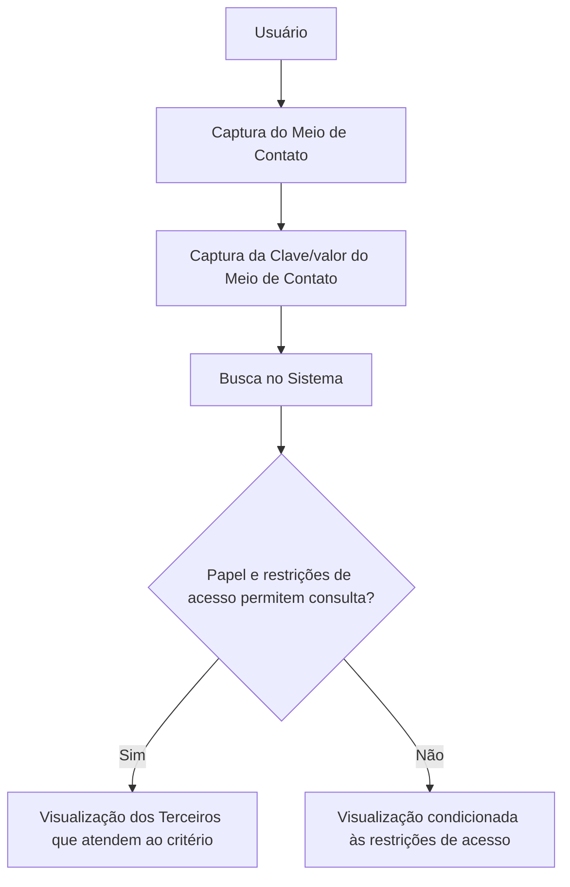

# Operação Consultar Terceiro por Meio de Contato do Terceiro

## 1. Metadados do Documento
- **Arquivo de Origem:** Não identificado no conteúdo fornecido
- **Tipo de Documento:** Procedimento
- **Domínio / Sistema:** Consulta de Terceiros / Zeus
- **Público-Alvo:** Usuários com permissão de consulta
- **Data/Versão Identificada:** Não identificada

---

## 2. Resumo Executivo & Contexto de Negócio

O documento descreve a operação **“Consultar Terceiro por Meio de Contato do Terceiro”**. A operação permite pesquisar e visualizar Terceiros no sistema a partir da captura de um tipo de meio de contato e, quando aplicável, do valor correspondente a esse meio de contato.

A visualização dos Terceiros encontrados depende do papel do usuário e das restrições de acesso à informação aplicáveis ao usuário que executa a consulta. O documento não detalha quais papéis existem nem quais restrições são avaliadas.

A ação habilitada para a operação é **CONSULTAR**. Os critérios de busca são preenchidos em uma sequência definida pelos campos apresentados da esquerda para a direita.

O conteúdo menciona a interface ou contexto “Inicio Soluciones APIs Documentación Zeus ES”, mas não detalha a tecnologia, URL, métodos de integração, contratos de API ou estrutura de retorno da consulta.

---

## 3. Arquitetura, Componentes & Tecnologias Envolvidas

| Componente / Conceito | Função descrita |
| :--- | :--- |
| Sistema | Realiza a busca e a visualização de Terceiros que atendem aos critérios de pesquisa. |
| Usuário | Efetua a consulta e está sujeito a papel e restrições de acesso à informação. |
| Terceiro | Entidade pesquisada pela operação. |
| Meio de Contato | Critério de busca que representa um dos possíveis meios de contato do Terceiro. |
| Clave/valor do Meio de Contato | Atributo que contém o valor real do meio de contato conforme o tipo de meio definido. |
| Zeus | Termo exibido no conteúdo fornecido; a relação técnica ou funcional com a operação não é detalhada. |



**Nota de Análise:** O documento não especifica componentes técnicos, banco de dados, APIs, protocolos, métodos HTTP, ambientes, URLs ou contratos JSON.

---

## 4. Regras de Negócio, Especificações Funcionais & Processos

1. A operação consiste na captura do tipo e/ou do meio de contato do Terceiro.
2. O tipo e/ou meio de contato é usado para realizar uma busca no sistema.
3. A busca visa visualizar os Terceiros que cumprem o critério informado.
4. A visualização está condicionada ao papel do usuário que realiza a consulta.
5. A visualização também está condicionada às restrições de acesso à informação que possam ser aplicáveis ao usuário.
6. A ação habilitada é **CONSULTAR**.
7. Os campos de dados do Terceiro definem, da esquerda para a direita, a sequência de captura dos critérios de busca.
8. O campo **Meio de Contato** contém um dos possíveis valores dos meios de contato do Terceiro pelo qual se deseja realizar a pesquisa.
9. O atributo **Clave/valor do Meio de Contato** contém o valor real do meio de contato, de acordo com o tipo de meio definido.

### Fluxo funcional identificado

1. O usuário inicia a operação de consulta.
2. O usuário informa o critério **Meio de Contato**.
3. O usuário informa a **Clave/valor do Meio de Contato**, conforme o tipo de meio definido.
4. O usuário executa a ação **CONSULTAR**.
5. O sistema realiza a busca por Terceiros que atendam ao critério.
6. O sistema considera o papel e as restrições de acesso à informação do usuário.
7. O sistema apresenta os Terceiros cuja visualização seja permitida.

---

## 5. Tabelas de Parâmetros, Ambientes e Estruturas de Dados

| Item / Parâmetro | Descrição / Função | Tipo / Valores / Formato | Ambiente / Observações |
| :--- | :--- | :--- | :--- |
| Ação habilitada | Executa a operação de pesquisa de Terceiros. | `CONSULTAR` | O documento apresenta somente esta ação. |
| Meio de Contato | Critério de busca utilizado para pesquisar um Terceiro. | Um dos possíveis valores de meios de contato do Terceiro. | O documento não enumera os valores possíveis. |
| Clave/valor do Meio de Contato | Contém o valor real do meio de contato de acordo com o tipo de meio definido. | Não especificado. | O exemplo citado no conteúdo fornecido está incompleto. |
| Papel do usuário | Condiciona a permissão para visualizar Terceiros localizados. | Não especificado. | O documento não lista papéis. |
| Restrições de acesso à informação | Condicionam a possibilidade de visualização do resultado. | Não especificado. | O documento não descreve regras ou critérios de restrição. |
| Sequência de captura | Define a ordem de preenchimento dos critérios de busca. | Da esquerda para a direita. | Associada aos campos de dados do Terceiro. |
| Zeus | Termo presente na navegação exibida. | Não especificado. | Não há detalhamento funcional ou técnico. |

---

## 6. Bateria de Perguntas & Respostas para RAG (FAQ Sintético)

### P1: Em que consiste a operação Consultar Terceiro por Meio de Contato do Terceiro?
**R:** A operação consiste em capturar o tipo e/ou o meio de contato do Terceiro para realizar uma busca no sistema e visualizar os Terceiros que atendem ao critério informado, desde que o papel e as restrições de acesso à informação do usuário permitam essa visualização.

### P2: Qual ação está habilitada na operação de consulta de Terceiro por meio de contato?
**R:** A ação habilitada explicitamente no documento é **CONSULTAR**.

### P3: Qual é a finalidade do campo Meio de Contato?
**R:** O campo **Meio de Contato** é um critério de busca. Ele contém um dos possíveis valores dos meios de contato do Terceiro pelo qual se deseja realizar a pesquisa.

### P4: O que representa a Clave/valor do Meio de Contato?
**R:** A **Clave/valor do Meio de Contato** representa o valor real do meio de contato, conforme o tipo de meio que foi definido para a pesquisa.

### P5: A consulta sempre permite visualizar todos os Terceiros encontrados?
**R:** Não. A visualização depende do papel do usuário que realiza a consulta e das restrições de acesso à informação que possam ser aplicáveis a esse usuário.

### P6: Em qual ordem os critérios de busca devem ser capturados?
**R:** O documento informa que os campos de dados do Terceiro determinam a sequência de captura dos critérios de busca da esquerda para a direita.

### P7: O documento especifica quais meios de contato podem ser usados na pesquisa?
**R:** Não. O documento afirma que o campo Meio de Contato contém um dos possíveis valores dos meios de contato do Terceiro, mas não apresenta a lista desses valores.

### P8: O documento descreve APIs, métodos HTTP ou contratos de integração para a consulta?
**R:** Não. O conteúdo fornecido não detalha APIs, métodos HTTP, URLs, contratos JSON, tecnologias de integração ou formatos de resposta.

### P9: O documento define quais papéis de usuário podem consultar Terceiros?
**R:** Não. O documento apenas informa que o papel do usuário influencia a possibilidade de visualização dos Terceiros encontrados, sem listar os papéis existentes.

### P10: Há um exemplo completo para o campo Clave/valor do Meio de Contato?
**R:** Não. O documento introduz “Ejemplo:”, porém o conteúdo fornecido termina sem apresentar o exemplo correspondente.

---

## 7. Glossário de Termos, Siglas & Conceitos-Chave

- **Terceiro:** Entidade consultada no sistema por meio de critérios relacionados a contato.
- **Meio de Contato:** Critério de busca que representa um possível meio de contato associado ao Terceiro.
- **Clave/valor do Meio de Contato:** Atributo que contém o valor real do meio de contato conforme o tipo definido.
- **CONSULTAR:** Ação habilitada para executar a pesquisa.
- **Papel do usuário:** Elemento de autorização que pode condicionar a visualização dos resultados da consulta.
- **Restrições de acesso à informação:** Limitações de acesso que podem impedir ou condicionar a visualização dos Terceiros.
- **Zeus:** Termo exibido no conteúdo de navegação; não possui definição adicional no material fornecido.

---

## 8. Notas Críticas, Riscos & Limitações

- O conteúdo fornecido não identifica o nome do arquivo de origem, data, versão ou autor do documento.
- O documento não apresenta uma lista dos tipos ou valores válidos para **Meio de Contato**.
- O documento não detalha os papéis de usuário nem as regras de restrição de acesso à informação.
- O exemplo associado à **Clave/valor do Meio de Contato** está incompleto no conteúdo disponível.
- Não há detalhamento de APIs, serviços, banco de dados, URLs, ambientes, autenticação, mensagens de erro ou contratos de integração.
- **Nota de Análise:** O termo “Zeus” é apresentado, mas o documento não descreve sua função no processo de consulta.

---

## 9. Conteúdo Bruto Estruturado (Referência Fiel)

````text
--- [PÁGINA 1 DE 2] ---

OPERACIÓN CONSULTAR Tercero por Medio
de Contacto del Tercero
¿En que consiste?
En la captura del tipo y/ó el medio de contacto del Tercero para realizar la búsqueda en el sistema y
visualizar los Terceros que cumplen con este criterio (siempre y cuando el rol y las restricciones de
acceso a la información que pudiera tener el Usuario que efectúa la consulta lo permitan).
Acciones habilitadas
 CONSULTAR ( )
Datos del Tercero
De izquierda a derecha los siguientes campos determinan la secuencia de captura de los criterios de
búsqueda.
Medio de Contacto
Este criterio de búsqueda contiene uno de los posibles valores de los Medios de Contacto del Tercero
por el cual se desea realizar la pesquisa.
 / 
 RS
Inicio Soluciones APIs Documentación Zeus
ES


--- [PÁGINA 2 DE 2] ---

Clave/valor del Medio de Contacto
Este Atributo contiene el valor real del Medio de Contacto de acuerdo con el tipo de medio definido.
Ejemplo:
```
