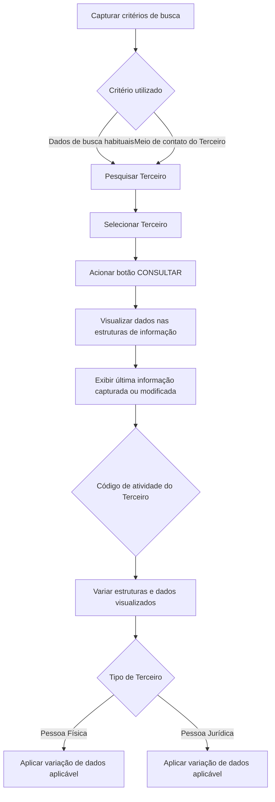

# Consulta de Terceiro por Situação em Vigor — Operação de Visualização de Dados

## 1. Metadados do Documento
- **Arquivo de Origem:** `Não identificado`
- **Tipo de Documento:** `Manual Operacional`
- **Domínio / Sistema:** `Consulta de Terceiros / Situação em Vigor`
- **Público-Alvo:** `Usuários operacionais e analistas de negócio`
- **Data/Versão Identificada:** `Não identificada`

---

## 2. Resumo Executivo & Contexto de Negócio

O documento descreve a operação de consulta de informações de um Terceiro por sua situação em vigor. A consulta é iniciada após a captura dos critérios de busca, que podem corresponder aos dados de busca mais habituais ou ao meio de contato do Terceiro.

Após a seleção do Terceiro e o acionamento do botão correspondente, a operação exibe as informações registradas nas diferentes estruturas de dados. Os dados visualizados correspondem à última data em que foram capturados ou modificados em cada estrutura de informação.

A consulta disponibiliza blocos de informações cadastrais, identificatórias, fiscais, de contato, bancárias e de representação. A composição das estruturas e dos dados visualizados pode variar conforme o código de atividade do Terceiro.

A visualização também pode variar conforme o Tipo de Terceiro, especificamente quando o Terceiro for uma Pessoa Física ou uma Pessoa Jurídica. O documento informa que não há limitação para visualizar dados associada ao papel do Usuário que realiza a consulta.

---

## 3. Arquitetura, Componentes & Tecnologias Envolvidas

O documento não detalha arquitetura de software, integrações, APIs, microsserviços, tecnologias, ambientes, métodos HTTP, contratos JSON ou persistência de dados. O conteúdo apresenta exclusivamente um fluxo operacional de consulta e visualização de informações de Terceiros.

O fluxo operacional identificado é:



**Nota de Análise:** o documento não identifica o nome da aplicação, URLs, ambientes, tecnologias, componentes técnicos ou contratos de integração responsáveis pela operação de consulta.

---

## 4. Regras de Negócio, Especificações Funcionais & Processos

### Processo de consulta de Terceiro por Situação em Vigor

1. O Usuário captura os critérios necessários para realizar a busca de um Terceiro.
2. Os critérios de busca podem utilizar:
   - Dados de busca mais habituais.
   - Meio de contato do Terceiro.
3. O Usuário seleciona o Terceiro cuja informação pretende consultar.
4. O Usuário aciona o botão correspondente à consulta.
5. O sistema visualiza os dados do Terceiro nas diferentes estruturas de informação.
6. Em cada estrutura de informação, são apresentados os dados correspondentes à última data em que foram capturados ou modificados.
7. As estruturas de informação e os dados apresentados podem variar conforme o código de atividade do Terceiro.
8. Os dados apresentados em cada bloco ou estrutura também podem variar quando o Tipo de Terceiro for:
   - Pessoa Física.
   - Pessoa Jurídica.
9. Não existe limitação para visualizar dados associada ao papel do Usuário que efetua a consulta.

### Ação habilitada

A operação identifica a ação habilitada como:

- `CONSULTAR`

### Estruturas de informação apresentadas

A operação pode apresentar informações nas seguintes estruturas:

- Dados Básicos.
- Dados de Identificação do Terceiro.
- Obrigações Fiscais.
- Pessoa Politicamente Exposta.
- Contactos.
- Direções.
- Documentos Alternativos.
- Representantes Legais.
- Accionistas.
- Dados Bancários.
- Meios de Cobro e Pago.

**Nota de Análise:** o documento relaciona as estruturas de informação, mas não detalha os campos exibidos, as regras de obrigatoriedade, os critérios de ordenação, os filtros disponíveis ou as regras de atualização para cada estrutura.

---

## 5. Tabelas de Parâmetros, Ambientes e Estruturas de Dados

| Item / Parâmetro | Descrição / Função | Tipo / Valores / Formato | Ambiente / Observações |
| :--- | :--- | :--- | :--- |
| Critérios de busca | Critérios capturados pelo Usuário para localizar um Terceiro. | Dados de busca habituais ou meio de contato do Terceiro. | O documento não detalha os campos de pesquisa. |
| Terceiro selecionado | Entidade sobre a qual a consulta será realizada. | Terceiro. | Deve ser selecionado antes da consulta. |
| Ação CONSULTAR | Ação habilitada para consultar os dados do Terceiro. | `CONSULTAR`. | O documento não informa permissões adicionais para a ação. |
| Última data de captura ou modificação | Referência temporal dos dados exibidos em cada estrutura. | Data não especificada. | São visualizados os dados da última captura ou modificação em cada estrutura. |
| Código de atividade do Terceiro | Fator que pode alterar as estruturas e os dados visualizados. | Código de atividade. | Valores e regras de mapeamento não detalhados. |
| Tipo de Terceiro | Classificação que pode alterar os dados exibidos nos blocos de informação. | Pessoa Física ou Pessoa Jurídica. | O documento não detalha as diferenças por tipo. |
| Papel do Usuário | Papel associado ao Usuário que realiza a consulta. | Não especificado. | Não existe limitação de visualização de dados associada ao papel do Usuário. |
| Dados Básicos | Estrutura de informação disponível na consulta. | Não detalhado. | Campos não identificados. |
| Dados de Identificação do Terceiro | Estrutura para dados de identificação. | Não detalhado. | Campos não identificados. |
| Obrigações Fiscais | Estrutura para informações fiscais. | Não detalhado. | Campos não identificados. |
| Pessoa Politicamente Exposta | Estrutura para informação de Pessoa Politicamente Exposta. | Não detalhado. | Critérios de classificação não identificados. |
| Contactos | Estrutura para meios de contato do Terceiro. | Não detalhado. | Pode ser utilizada como critério de busca. |
| Direções | Estrutura para endereços ou direções do Terceiro. | Não detalhado. | Campos não identificados. |
| Documentos Alternativos | Estrutura para documentos alternativos. | Não detalhado. | Tipos documentais não identificados. |
| Representantes Legais | Estrutura para representantes legais. | Não detalhado. | Aplicabilidade por Tipo de Terceiro não detalhada. |
| Accionistas | Estrutura para acionistas. | Não detalhado. | Aplicabilidade por Tipo de Terceiro não detalhada. |
| Dados Bancários | Estrutura para dados bancários. | Não detalhado. | Campos e mascaramento de dados não identificados. |
| Meios de Cobro e Pago | Estrutura para meios de cobrança e pagamento. | Não detalhado. | Regras funcionais não identificadas. |

---

## 6. Bateria de Perguntas & Respostas para RAG (FAQ Sintético)

### P1: Em que consiste a operação de consultar um Terceiro por Situação em Vigor?
**R:** A operação permite consultar informações de um Terceiro após a captura de critérios de busca, a seleção do Terceiro e o acionamento do botão correspondente. A consulta apresenta dados nas diferentes estruturas de informação conforme a última data em que os dados foram capturados ou modificados.

### P2: Quais critérios podem ser utilizados para buscar um Terceiro?
**R:** O documento informa que a busca pode ser realizada pelos dados de busca mais habituais ou pelo meio de contato do Terceiro. Os campos específicos disponíveis para pesquisa não são detalhados.

### P3: Qual ação deve ser acionada para visualizar as informações do Terceiro?
**R:** A ação habilitada identificada no documento é `CONSULTAR`. Após a seleção do Terceiro, o acionamento do botão correspondente permite visualizar suas informações.

### P4: Qual versão dos dados é exibida na consulta de Terceiro?
**R:** Em cada estrutura de informação, são exibidos os dados correspondentes à última data em que foram capturados ou modificados naquela estrutura.

### P5: Quais fatores podem alterar os dados exibidos para um Terceiro?
**R:** Os dados e as estruturas de informação visualizadas podem variar de acordo com o código de atividade do Terceiro. Além disso, os dados mostrados nos blocos de informação podem variar conforme o Tipo de Terceiro seja Pessoa Física ou Pessoa Jurídica.

### P6: O papel do Usuário restringe a visualização dos dados do Terceiro?
**R:** Não. O documento declara expressamente que não existe limitação para visualizar os dados associada ao papel que o Usuário que efetua a consulta possa possuir.

### P7: Quais estruturas de informação podem ser consultadas para um Terceiro?
**R:** O documento menciona Dados Básicos, Dados de Identificação do Terceiro, Obrigações Fiscais, Pessoa Politicamente Exposta, Contactos, Direções, Documentos Alternativos, Representantes Legais, Accionistas, Dados Bancários e Meios de Cobro e Pago.

### P8: O documento detalha quais campos compõem a estrutura Dados Básicos?
**R:** Não. O documento somente lista Dados Básicos como uma estrutura disponível na consulta. Não são apresentados os campos, formatos, validações ou regras específicas dessa estrutura.

### P9: O documento define diferenças específicas entre Pessoa Física e Pessoa Jurídica?
**R:** Não. O documento informa que os dados visualizados nos blocos ou estruturas podem variar conforme o Tipo de Terceiro seja Pessoa Física ou Pessoa Jurídica, mas não especifica quais dados são exclusivos, obrigatórios ou opcionais para cada tipo.

### P10: O documento apresenta métodos de API, URLs, ambientes ou contratos de integração?
**R:** Não. O documento não apresenta métodos HTTP, URLs, servidores, ambientes, APIs, contratos JSON, tecnologias ou integrações técnicas associadas à consulta.

---

## 7. Glossário de Termos, Siglas & Conceitos-Chave

- **Terceiro:** entidade cujas informações são pesquisadas, selecionadas e visualizadas na operação de consulta.
- **Situação em Vigor:** contexto da operação de consulta descrita no documento; não há definição adicional apresentada.
- **Código de atividade do Terceiro:** atributo que pode influenciar as estruturas de informação e os dados apresentados na consulta.
- **Tipo de Terceiro:** classificação do Terceiro como Pessoa Física ou Pessoa Jurídica, capaz de alterar os dados exibidos nos blocos de informação.
- **Pessoa Física:** Tipo de Terceiro mencionado como fator de variação das informações apresentadas.
- **Pessoa Jurídica:** Tipo de Terceiro mencionado como fator de variação das informações apresentadas.
- **Pessoa Politicamente Exposta:** estrutura de informação disponível na consulta; o documento não apresenta definição, critérios ou regras de classificação.
- **Representantes Legales:** estrutura destinada a representantes legais do Terceiro.
- **Accionistas:** estrutura destinada a acionistas do Terceiro.
- **Medios de Cobro y Pago:** estrutura destinada a meios de cobrança e pagamento do Terceiro.
- **CONSULTAR:** ação habilitada para visualizar os dados do Terceiro.

---

## 8. Notas Críticas, Riscos & Limitações

- O documento não identifica o arquivo de origem, data, versão, autor, sistema, ambiente ou URL da operação.
- O documento não detalha campos de busca, campos exibidos, formatos, validações, obrigatoriedades ou mensagens de erro.
- Não há especificação de APIs, serviços, integrações, tecnologias, banco de dados, mecanismos de autenticação ou controles técnicos de autorização.
- Embora o documento declare que não existe limitação de visualização baseada no papel do Usuário, não detalha controles alternativos de segurança, confidencialidade ou proteção de dados.
- O documento informa que o código de atividade e o Tipo de Terceiro alteram as informações apresentadas, mas não fornece a matriz de regras que determina essas variações.
- Não são apresentados critérios para definir Pessoa Física, Pessoa Jurídica ou Pessoa Politicamente Exposta.
- Não há detalhamento adicional sobre os conteúdos das estruturas Dados Bancários, Obrigações Fiscais, Documentos Alternativos, Representantes Legais, Accionistas e Meios de Cobro e Pago.

---

## 9. Conteúdo Bruto Estruturado (Referência Fiel)

```text
--- [PÁGINA 1 DE 2] ---

OPERACIÓN CONSULTAR Tercero por
Situación en Vigor
¿En que consiste?
Una vez capturados los criterios para realizar la búsqueda, sean estos por los datos de búsqueda
más habituales o por el medio de contacto del Tercero y haber seleccionado el Tercero del cual se
pretende consultar su información...
... tras pulsar el botón correspondiente, se visualizarán sus datos en las distintas estructuras de
información de acuerdo a la última fecha en los que estos hayan sido capturados o modificados en
ellas.
Proceso
Datos
Básicos
Datos
Identificación
Obligaciones
Fiscales
Persona
Políticamente
Expuesta
Contactos Direcciones Documentos
Alternativos
Representantes
Legales Accionistas Datos
Bancarios
Premisas
Las estructuras de información y los datos que se visualizan en cada una de ellas pueden variar
de acuerdo con el código de actividad del Tercero.
 /
 CF
Home Solutions APIs Documentation Zeus
EN


--- [PÁGINA 2 DE 2] ---

Además, los datos que se visualizan en cada uno de los bloques o estructuras de información
también pueden variar si el Tipo de Tercero es una Persona Física o una Persona Jurídica.
No existe limitación alguna para visualizar los datos asociado al rol que pudiera tener del
Usuario que efectúa la consulta.
Acciones habilitadas
 CONSULTAR ( )
Datos del Tercero
 Datos Básicos ( )
 Datos Identificación del Tercero ( )
 Persona Políticamente Expuesta ( )
 Contactos ( )
 Direcciones ( )
 Documentos Alternativos ( )
 Representantes Legales ( )
 Accionistas ( )
 Medios de Cobro y Pago ( )
```
