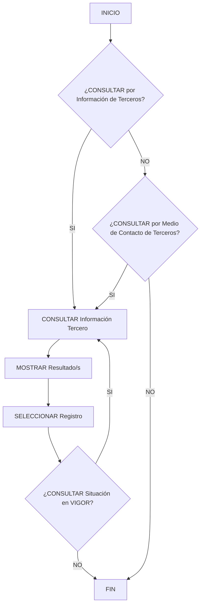

# Operação “Consultar Tercero” — Documentação Funcional Zeus

## 1. Metadados do Documento
- **Arquivo de Origem:** Não identificado
- **Tipo de Documento:** Especificação Funcional
- **Domínio / Sistema:** Zeus — Home Solutions APIs Documentation
- **Público-Alvo:** Desenvolvedores, Analistas Funcionais e Operação
- **Data/Versão Identificada:** Não identificada

---

## 2. Resumo Executivo & Contexto de Negócio

O documento descreve a operação **“Consultar Tercero”** no contexto da documentação de APIs Home Solutions do sistema **Zeus**. A operação tem como finalidade consultar informações de terceiros considerando sua última situação registrada.

O conceito de “terceiro” abrange explicitamente **Personas Físicas** e **Personas Jurídicas**. O material não fornece definição adicional desses conceitos, nem detalha entidades, campos retornados, contratos de API, métodos HTTP ou formatos de payload.

O processo funcional apresenta critérios de busca por informações do terceiro ou por meio de contato. Após a consulta, o fluxo prevê a apresentação de resultados e a seleção de um registro.

Também existe uma condição relacionada à consulta da situação **“en vigor”**. O documento apresenta essa condição no fluxo, porém não especifica o significado operacional de “em vigor”, os valores possíveis de situação, nem como a condição altera os dados retornados.

---

## 3. Arquitetura, Componentes & Tecnologias Envolvidas

Os elementos explicitamente identificados são:

| Componente / Elemento | Papel identificado |
| :--- | :--- |
| Zeus | Sistema ou contexto documental no qual a operação é apresentada. |
| Home Solutions APIs Documentation | Área de documentação indicada no cabeçalho do conteúdo. |
| Operação “Consultar Tercero” | Operação funcional para consultar informações de terceiros. |
| Tercero | Entidade consultada; pode corresponder a pessoa física ou pessoa jurídica. |
| Informação do Tercero | Critério ou dado utilizado na consulta. |
| Medio de Contacto | Critério alternativo para consulta de terceiros. |
| Situación en Vigor | Condição apresentada no processo de consulta. |
| Resultado/s | Resultado exibido após a consulta. |
| Registro | Item selecionável entre os resultados apresentados. |

O conteúdo não descreve microsserviços, banco de dados, protocolos, endpoints, autenticação, tecnologias de implementação, ambientes ou integrações externas.



> **Nota de Análise:** O fluxograma original contém múltiplas decisões “SI/NO”, mas não detalha integralmente os caminhos associados a cada resultado negativo. O diagrama representa apenas as relações explicitamente identificáveis no conteúdo bruto.

---

## 4. Regras de Negócio, Especificações Funcionais & Processos

### Objetivo funcional

A operação **Consultar Tercero** permite realizar a consulta da informação de terceiros em sua **última situação**.

### Escopo de terceiros

A operação aplica-se aos seguintes tipos de terceiros:

1. **Personas Físicas**.
2. **Personas Jurídicas**.

O documento não define atributos, identificadores, regras de elegibilidade ou diferenças de comportamento entre pessoas físicas e pessoas jurídicas.

### Critérios de busca apresentados

O formulário ou processo de consulta apresenta os seguintes critérios:

1. Consultar por **Dados do Tercero**.
2. Consultar por **Medio de Contacto del Tercero**.
3. Consultar **Situación en Vigor**.

### Fluxo funcional identificado

1. O processo inicia na etapa **INICIO**.
2. O usuário ou processo avalia a consulta por **Información de Terceros**.
3. Alternativamente, o usuário ou processo avalia a consulta por **Medio de Contacto de Terceros**.
4. A consulta de informação do terceiro é executada.
5. O sistema apresenta um ou mais resultados.
6. Um registro é selecionado.
7. O processo avalia a consulta da situação **en VIGOR**.
8. O processo é encerrado em **FIN**.

### Restrições de fidelidade documental

- O documento não informa quais campos constituem os “Dados do Tercero”.
- O documento não especifica quais meios de contato podem ser utilizados na busca.
- O documento não informa se os critérios de busca são mutuamente exclusivos ou combináveis.
- O documento não define o comportamento quando não há resultados.
- O documento não detalha as consequências funcionais de consultar ou não consultar a situação em vigor.
- O documento não apresenta contratos JSON, métodos HTTP, códigos de resposta, rotas de API ou validações de entrada.

---

## 5. Tabelas de Parâmetros, Ambientes e Estruturas de Dados

| Item / Parâmetro | Descrição / Função | Tipo / Valores / Formato | Ambiente / Observações |
| :--- | :--- | :--- | :--- |
| Consultar por Datos del Tercero | Critério de busca por dados do terceiro. | Opção de consulta; formato não informado. | Exibido em “Criterios de Búsqueda”. |
| Consultar por Medio de Contacto del Tercero | Critério de busca por meio de contato do terceiro. | Opção de consulta; formato não informado. | Exibido em “Criterios de Búsqueda”. |
| Consultar Situación en Vigor | Critério relacionado à situação em vigor. | Opção de consulta; valores não informados. | Exibido em “Criterios de Búsqueda” e no fluxo. |
| Información de Terceros | Informação utilizada ou retornada na consulta de terceiros. | Estrutura não informada. | Associada à pergunta “¿CONSULTAR por Información de Terceros?”. |
| Medio de Contacto de Terceros | Meio de contato utilizado como critério de consulta. | Estrutura não informada. | Associado à pergunta “¿CONSULTAR por Medio de Contacto de Terceros?”. |
| Resultado/s | Conjunto de resultados exibidos após a consulta. | Um ou mais resultados; formato não informado. | O processo prevê “MOSTRAR Resultado/s”. |
| Registro | Item selecionado entre os resultados apresentados. | Registro; estrutura não informada. | O processo prevê “SELECCIONAR Registro”. |
| Persona Física | Tipo de terceiro abrangido pela operação. | Classificação de terceiro. | Mencionado na descrição da operação. |
| Persona Jurídica | Tipo de terceiro abrangido pela operação. | Classificação de terceiro. | Mencionado na descrição da operação. |
| Zeus | Sistema ou domínio documental citado. | Nome de sistema. | Presente no cabeçalho extraído. |
| Home Solutions APIs Documentation | Contexto de documentação apresentado. | Nome de área documental. | Presente no cabeçalho extraído. |

---

## 6. Bateria de Perguntas & Respostas para RAG (FAQ Sintético)

### P1: Qual é o objetivo da operação “Consultar Tercero”?
**R:** A operação “Consultar Tercero” permite consultar informações de terceiros considerando sua última situação. O documento indica que os terceiros podem ser pessoas físicas ou pessoas jurídicas.

### P2: Quais tipos de terceiros podem ser consultados na operação “Consultar Tercero”?
**R:** A operação contempla terceiros classificados como **Personas Físicas** e **Personas Jurídicas**. O conteúdo não descreve regras distintas para cada tipo.

### P3: Quais critérios de busca são apresentados para consultar um terceiro?
**R:** O documento apresenta três critérios: consulta por **Dados do Tercero**, consulta por **Medio de Contacto del Tercero** e consulta de **Situación en Vigor**.

### P4: É possível consultar um terceiro por meio de contato?
**R:** Sim. O fluxograma e a seção “Criterios de Búsqueda” apresentam a opção de consulta por **Medio de Contacto del Tercero**.

### P5: O que ocorre após a execução da consulta de informação do terceiro?
**R:** Após a consulta, o processo prevê a ação **“MOSTRAR Resultado/s”**, seguida da ação **“SELECCIONAR Registro”**.

### P6: O documento informa quais dados devem ser preenchidos na consulta por dados do terceiro?
**R:** Não. O documento apenas apresenta a opção “¿Consultar por Datos del Tercero?”, sem listar campos, formatos, identificadores ou regras de validação.

### P7: O que significa “Situación en Vigor” na operação?
**R:** “Situación en Vigor” é uma condição de consulta exibida no fluxo e nos critérios de busca. O documento não define seu significado operacional, seus valores possíveis ou como ela modifica o resultado retornado.

### P8: A operação “Consultar Tercero” informa endpoints ou métodos HTTP?
**R:** Não. O conteúdo não apresenta URLs, endpoints, métodos HTTP, contratos JSON, parâmetros técnicos de API ou códigos de resposta.

### P9: O que acontece se a consulta não retornar resultados?
**R:** O documento não especifica o comportamento para ausência de resultados. Ele apenas indica a etapa “MOSTRAR Resultado/s”, sem detalhar mensagens, exceções ou tratamentos alternativos.

### P10: Os critérios de consulta por dados do terceiro e por meio de contato podem ser usados simultaneamente?
**R:** O documento apresenta ambos como critérios de busca, mas não informa se são mutuamente exclusivos, opcionais ou combináveis na mesma consulta.

---

## 7. Glossário de Termos, Siglas & Conceitos-Chave

- **Zeus:** Nome do sistema ou contexto documental mencionado no cabeçalho.
- **Home Solutions APIs Documentation:** Área de documentação indicada no conteúdo extraído.
- **Tercero:** Entidade consultada pela operação; o documento informa que pode ser uma pessoa física ou jurídica.
- **Persona Física:** Tipo de terceiro mencionado como abrangido pela operação.
- **Persona Jurídica:** Tipo de terceiro mencionado como abrangido pela operação.
- **Medio de Contacto:** Meio de contato utilizado como possível critério para consultar um terceiro.
- **Situación en Vigor:** Condição de consulta apresentada no fluxo; não definida adicionalmente pelo documento.
- **Resultado/s:** Resultado ou conjunto de resultados exibido após a consulta.
- **Registro:** Item selecionado entre os resultados apresentados.

---

## 8. Notas Críticas, Riscos & Limitações

- O arquivo de origem, a data, a versão e a autoria do documento não foram identificados no conteúdo fornecido.
- Não há detalhamento técnico da API: endpoints, métodos HTTP, autenticação, cabeçalhos, payloads, schemas, códigos de erro e SLAs não são descritos.
- Não há especificação dos campos que compõem os dados de pessoa física, pessoa jurídica ou meio de contato.
- A semântica de **“Situación en Vigor”** não é explicada.
- O fluxograma contém decisões “SI/NO”, mas não detalha todos os caminhos negativos.
- Não são apresentados critérios de ordenação, paginação, filtros adicionais, permissões ou regras de privacidade para acesso a dados de terceiros.
- Não há informações sobre ambientes, servidores, logs, monitoramento, persistência ou dependências técnicas.

---

## 9. Conteúdo Bruto Estruturado (Referência Fiel)

```text
--- [PÁGINA 1 DE 2] ---

/
CF
Home Solutions APIs Documentation Zeus
EN


--- [PÁGINA 2 DE 2] ---

OPERACIÓN CONSULTAR Tercero
¿En que consiste?
Esta operación permite realizar la consulta de la información de los Terceros a su última situación
sean estos Personas Físicas o Personas Jurídicas.
Proceso
SI
NO
SI
NO
SI
NO
INICIO ¿CONSULTAR por
**Información** de Terceros?
¿CONSULTAR por
**Medio de Contacto** de Terceros?
MOSTRAR Resultado/s SELECCIONAR
Registro
¿CONSULTAR
Situación en **VIGOR**?
CONSULTAR Información
Tercero
FIN
Criterios de Búsqueda
 ¿Consultar por Datos del Tercero? ( )
 ¿Consultar por Medio de Contacto del Tercero?( )
Consultar Tercero
 ¿Consultar Situación en Vigor? ( )
```
