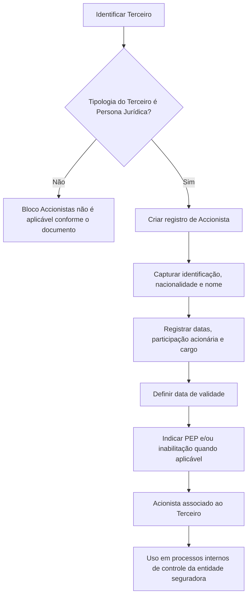

# Cadastro de Acionistas de Terceiro — Especificação Funcional de Identificação Acionária

## 1. Metadados do Documento
- **Arquivo de Origem:** `Não identificado`
- **Tipo de Documento:** Manual Operacional
- **Domínio / Sistema:** Cadastro de Terceiros e identificação de acionistas
- **Público-Alvo:** Analistas funcionais, operação, negócio e equipes de conformidade
- **Data/Versão Identificada:** Não identificada

---

## 2. Resumo Executivo & Contexto de Negócio

O documento descreve o bloco de informação **“Accionistas”**, destinado ao cadastro e à manutenção de acionistas associados a um **Tercero**. Uma ação é apresentada como um título emitido por uma Sociedade Anônima ou Sociedade em Comandita por Ações, representando uma fração igual do capital social.

O bloco é aplicável quando a tipologia do Terceiro corresponde a uma **Persona Jurídica**. Nesse cenário, o sistema permite identificar os acionistas da entidade jurídica cadastrada.

A identificação acionária suporta a entidade seguradora no cumprimento de normas de prevenção à lavagem de ativos monetários. O cadastro permite que a entidade seguradora trate, gerencie e controle internamente informações relacionadas à composição acionária.

O processo permite criar um novo acionista e registrar atributos de identificação, nacionalidade, participação acionária, cargo, datas de vigência e condições de situação cadastral. O documento declara explicitamente que é possível registrar um acionista já marcado como inabilitado no mesmo processo.

---

## 3. Arquitetura, Componentes & Tecnologias Envolvidas

O documento não descreve arquitetura de software, integrações, APIs, contratos HTTP, bancos de dados, ambientes, URLs ou tecnologias de implementação. Os únicos elementos funcionais identificados são:

- **Tercero:** entidade à qual os acionistas são associados.
- **Accionistas:** bloco de informação para identificação de acionistas.
- **Sistema:** repositório funcional que contém tipos documentais previamente configurados e um catálogo de cargos.
- **Entidade seguradora:** organização que utiliza as informações acionárias em processos internos de controle e prevenção à lavagem de ativos monetários.
- **Catálogo de cargos:** fonte dos valores possíveis para o atributo `Cargo`.



> *Nota de Análise: O documento menciona “Inicio”, “Soluciones”, “APIs”, “Documentación” e “Zeus” no conteúdo extraído, mas não explica suas funções nem estabelece relação técnica com o cadastro de acionistas.*

---

## 4. Regras de Negócio, Especificações Funcionais & Processos

### Aplicabilidade do bloco Accionistas

1. O bloco de informação `Accionistas` tem o propósito de identificar os acionistas de um Terceiro.
2. O cadastro de acionistas aplica-se quando a tipologia do Terceiro corresponde a uma `Persona Jurídica`.
3. A identificação acionária permite à entidade seguradora gerenciar e controlar internamente aspectos relacionados à prevenção de lavagem de ativos monetários.
4. A ação disponível no documento é `CREAR`, isto é, criar um novo acionista.

### Sequência de captura de informações

O documento informa que os atributos devem seguir uma sequência de captura da esquerda para a direita e de cima para baixo. A extração não apresenta um diagrama visual completo que determine a ordem exata entre todos os campos; os atributos documentados são:

1. Tipo Documento Accionista.
2. Clave del Documento Accionista.
3. Nacionalidad del Accionista.
4. Nombre.
5. Apellidos.
6. Fecha de Alta.
7. Fecha de Baja.
8. Porcentaje Accionarial.
9. Cargo.
10. Fecha de Validez.
11. Marca Persona Políticamente Expuesta.
12. Inhabilitación.

### Regras por atributo

- O `Tipo Documento Accionista` deve corresponder a um tipo documental previamente configurado no sistema.
- O `Clave del Documento Accionista` registra a chave do documento do acionista.
- O atributo `Nacionalidad del Accionista` registra o país de nacionalidade do acionista.
- O atributo `Nombre` registra o nome do acionista.
- Os campos `Apellidos` permitem registrar sobrenomes ou a razão social do acionista.
- A `Fecha de Alta` identifica a data em que o acionista passa a ter direitos acionários sobre o Terceiro.
- A `Fecha de Baja` identifica a data em que o acionista deixa de possuir direitos acionários em relação ao Terceiro associado.
- O `Porcentaje Accionarial` identifica o percentual de participação do acionista em relação ao número de ações emitidas pelo Terceiro.
- O atributo `Cargo` deve utilizar os valores possíveis definidos no catálogo de cargos existente no sistema.
- A `Fecha de Validez` define a data a partir da qual o acionista do Terceiro estará plenamente operacional no sistema. O uso correto dessa data permite manter o histórico das alterações realizadas nas informações do acionista.
- A `Marca Persona Políticamente Expuesta` permite identificar o acionista como Pessoa Politicamente Exposta, viabilizando o controle desse fato pela entidade seguradora em seus processos internos.
- A propriedade `Inhabilitación` estabelece que o acionista está inabilitado no sistema.
- É permitido criar um novo acionista já marcado como inabilitado no mesmo processo de registro.

---

## 5. Tabelas de Parâmetros, Ambientes e Estruturas de Dados

| Item / Parâmetro | Descrição / Função | Tipo / Valores / Formato | Ambiente / Observações |
| :--- | :--- | :--- | :--- |
| Acción | Ação disponível no bloco de acionistas. | `CREAR` | Permite registrar um novo acionista. |
| Tercero | Entidade à qual o acionista é associado. | Não especificado | O bloco aplica-se quando o Terceiro é uma Persona Jurídica. |
| Tipo Documento Accionista | Tipo de documento usado para identificar o acionista pessoa física ou jurídica. | Tipos documentais configurados previamente no sistema | O documento não enumera os tipos permitidos. |
| Clave del Documento Accionista | Chave do documento do acionista. | Não especificado | Campo do painel. |
| Nacionalidad del Accionista | País de nacionalidade do acionista. | País | Campo do painel. |
| Nombre | Nome do acionista. | Texto | Atributo do colapsador. |
| Apellidos | Sobrenomes ou razão social do acionista. | Texto | Dois campos do colapsador; podem capturar sobrenomes ou razão social. |
| Fecha de Alta | Data em que o acionista adquire direitos acionários sobre o Terceiro. | Data | Relacionada aos direitos acionários. |
| Fecha de Baja | Data em que o acionista deixa de possuir direitos acionários sobre o Terceiro. | Data | Relacionada ao Terceiro associado. |
| Porcentaje Accionarial | Percentual acionário do acionista. | Percentual | Referente ao número de ações emitidas pelo Terceiro. |
| Cargo | Cargo acionário exercido pelo acionista. | Valores definidos no catálogo de cargos | O documento não lista o catálogo nem seus valores. |
| Fecha de Validez | Data a partir da qual o acionista estará plenamente operacional no sistema. | Data | Permite manter histórico das alterações de informação. |
| Marca Persona Políticamente Expuesta | Indicador de que o acionista é Pessoa Politicamente Exposta. | Marca/indicador | Usado para gestão e controle interno da entidade seguradora. |
| Inhabilitación | Estado que define o acionista como inabilitado no sistema. | Propriedade/marca | Pode ser selecionada durante o registro de um novo acionista. |
| Catálogo de cargos | Origem dos valores possíveis de cargo acionário. | Catálogo existente no sistema | Não detalhado no documento. |
| Tipos documentais configurados | Origem das opções para identificação documental do acionista. | Configuração prévia do sistema | Não detalhados no documento. |

---

## 6. Bateria de Perguntas & Respostas para RAG (FAQ Sintético)

### P1: Quando o bloco de informações Accionistas deve ser utilizado?
**R:** O bloco `Accionistas` deve ser utilizado quando a tipologia do Terceiro corresponde a uma `Persona Jurídica`. Seu propósito é identificar os acionistas associados a essa entidade.

### P2: Qual é o objetivo de identificar os acionistas de um Terceiro?
**R:** A identificação dos acionistas permite à entidade seguradora cumprir normas de prevenção de lavagem de ativos monetários e gerenciar internamente esse aspecto em seus processos de controle.

### P3: Qual ação o documento disponibiliza para o cadastro de acionistas?
**R:** O documento apresenta a ação `CREAR`, destinada ao registro de um novo acionista associado ao Terceiro.

### P4: Como o tipo de documento do acionista é definido?
**R:** O atributo `Tipo Documento Accionista` deve conter o tipo de documento usado para identificar o acionista, seja pessoa física ou jurídica, de acordo com os tipos documentais previamente configurados no sistema.

### P5: O que deve ser informado no campo Porcentaje Accionarial?
**R:** O campo `Porcentaje Accionarial` deve identificar o percentual de participação acionária do acionista em relação ao número de ações emitidas pelo Terceiro.

### P6: Qual é a diferença entre Fecha de Alta e Fecha de Baja?
**R:** A `Fecha de Alta` identifica a data em que o acionista passa a ter direitos acionários sobre o Terceiro. A `Fecha de Baja` identifica a data em que o acionista deixa de ter esses direitos em relação ao Terceiro associado.

### P7: Para que serve a Fecha de Validez do acionista?
**R:** A `Fecha de Validez` informa ao sistema a data a partir da qual o acionista do Terceiro estará plenamente operacional. Seu uso correto permite manter um histórico das mudanças realizadas nas informações do acionista.

### P8: Como o Cargo do acionista é selecionado?
**R:** O atributo `Cargo` identifica o cargo acionário exercido pelo acionista e deve utilizar os valores definidos no catálogo de cargos existente no sistema. O documento não detalha os cargos disponíveis.

### P9: É possível identificar um acionista como Pessoa Politicamente Exposta?
**R:** Sim. O atributo `Marca Persona Políticamente Expuesta` permite identificar o acionista como Pessoa Politicamente Exposta, possibilitando que a entidade seguradora gerencie e controle internamente essa condição.

### P10: Um novo acionista pode ser cadastrado como inabilitado?
**R:** Sim. O documento estabelece expressamente que é possível registrar um novo acionista e marcá-lo como `Inhabilitado` no mesmo processo.

### P11: Os campos Apellidos são usados somente para sobrenomes?
**R:** Não. Os dois campos `Apellidos` permitem capturar os sobrenomes ou a razão social do acionista.

### P12: O documento especifica APIs, métodos HTTP ou contratos JSON para o cadastro de acionistas?
**R:** Não. Embora a extração contenha o termo “APIs” na navegação visual, o documento não detalha APIs, métodos HTTP, URLs, contratos JSON, integrações ou tecnologias de implementação para o cadastro de acionistas.

---

## 7. Glossário de Termos, Siglas & Conceitos-Chave

- **Accionista:** Pessoa física ou jurídica identificada como detentora de participação acionária associada a um Terceiro.
- **Accionistas:** Bloco de informação destinado ao cadastro e à identificação dos acionistas de um Terceiro.
- **Acción:** Título emitido por uma Sociedade Anônima ou Sociedade em Comandita por Ações que representa uma fração igual do capital social.
- **Cargo:** Cargo acionário exercido pelo acionista, definido a partir do catálogo de cargos existente no sistema.
- **Fecha de Alta:** Data em que o acionista passa a ter direitos acionários sobre o Terceiro.
- **Fecha de Baja:** Data em que o acionista deixa de possuir direitos acionários sobre o Terceiro associado.
- **Fecha de Validez:** Data a partir da qual o acionista estará plenamente operacional no sistema.
- **Inhabilitación:** Propriedade que indica que o acionista está inabilitado no sistema.
- **PEP / Persona Políticamente Expuesta:** Condição de Pessoa Politicamente Exposta identificável por meio de uma marca no cadastro do acionista.
- **Persona Jurídica:** Tipologia de Terceiro para a qual o bloco `Accionistas` é aplicável.
- **Porcentaje Accionarial:** Percentual de participação do acionista em relação ao número de ações emitidas pelo Terceiro.
- **Razón Social:** Denominação social que pode ser registrada nos campos `Apellidos`.
- **Tercero:** Entidade associada aos acionistas no sistema.

---

## 8. Notas Críticas, Riscos & Limitações

- O documento não informa o nome do arquivo de origem, versão, data de publicação, autor ou responsável funcional.
- O documento não especifica se os campos são obrigatórios, opcionais, condicionais ou possuem regras de validação de formato.
- O documento não lista os tipos documentais previamente configurados no sistema.
- O documento não apresenta o catálogo de cargos nem os valores permitidos para `Cargo`.
- O documento não define escalas, limites, precisão decimal ou validações para `Porcentaje Accionarial`.
- O documento não detalha regras de consistência temporal entre `Fecha de Alta`, `Fecha de Baja` e `Fecha de Validez`.
- O documento não explica o impacto operacional da `Inhabilitación`, além de estabelecer que o acionista ficará inabilitado no sistema.
- O documento não descreve APIs, URLs, ambientes, integrações, logs, persistência de dados ou controles de acesso.
- A extração contém o termo final `Consejo:` sem conteúdo complementar.
- *Nota de Análise: O documento descreve os atributos do cadastro, porém não detalha fluxos de aprovação, auditoria, exclusão, atualização ou consulta de acionistas.*

---

## 9. Conteúdo Bruto Estruturado (Referência Fiel)

```text
--- [PÁGINA 1 DE 3] ---

CREAR Accionistas del Tercero
Objetivo
Sucintamente, una acción es un título emitido por una Sociedad Anónima o Sociedad comanditaria
por acciones que representa el valor de una de las fracciones iguales en que se divide su capital
social.
Siempre y cuando la tipología del Tercero corresponda a una Persona Jurídica, el propósito de este
Bloque de Información es Identificar a sus Accionistas lo que habilita a la entidad aseguradora en
el cumplimiento de la normativa de prevención de lavado de activos monetarios ya que la
identificación accionarial permitirá gestionar y controlar en sus procesos internos dicho supuesto.
Posibles Acciones
 CREAR ( )
Accionistas
De izquierda a derecha y de arriba hacia abajo, los siguientes atributos marcan la secuencia de
captura de la información.
 /
 RS
Inicio Soluciones APIs Documentación Zeus
ES


--- [PÁGINA 2 DE 3] ---

Tipo Documento Accionista (  )
Este Atributo del colapsador contiene el tipo de documento con el que se va a identificar a la persona
física o jurídica identificada como accionista de acuerdo con los tipos de documentos que hayan sido
configurados previamente en el sistema.
Clave del Documento Accionista ( )
Este Atributo del panel contiene la clave del documento del Accionista.
Nacionalidad del Accionista (  )
Este Atributo del panel contiene el país de nacionalidad del Accionista.
Nombre ( )
Este Atributo del colapsador contendrá el nombre del Accionista.
Apellidos ( )
Estos dos campos del colapsador permiten capturar o bien los Apellidos o bien la Razón Social del
accionista.
Fecha de Alta ( )
Este Campo identifica la fecha en la que el Accionista tiene los derechos accionariales del Tercero.
Fecha de Baja ( )
Este Campo identifica la fecha en la que el Accionista causa baja en relación con los derechos
accionariales del Tercero al que está asociado.
Porcentaje Accionarial ( )
Este Campo identifica el Porcentaje accionarial del Accionista en relación al número de acciones
emitidas por el Tercero.
Cargo ( )
Este Campo identifica el Cargo Accionarial que sustenta el Accionista de acuerdo con los posibles
valores en los cargos definidos en el catálogo de cargos existente en el Sistema.
Fecha de Validez ( )
Esta propiedad le indica al sistema la fecha a partir de la cual el Accionista del Tercero estará
plenamente operativo en el sistema por lo que su correcto uso permite tener un histórico de los
cambios efectuados con su información.


--- [PÁGINA 3 DE 3] ---

Marca Persona Políticamente Expuesta ( )
Este Atributo permite identificar al Accionista como Persona Políticamente Expuesta, marca que
permitiría a la entidad aseguradora gestionar y controlar en sus procesos internos este hecho.
Inhabilitación ( )
Esta propiedad establece que el Accionista está inhabilitado en el sistema.
Es posible Registrar un nuevo accionista y marcarlo a su vez como Inhabilitado en el mismo
proceso.
Consejo:
```
