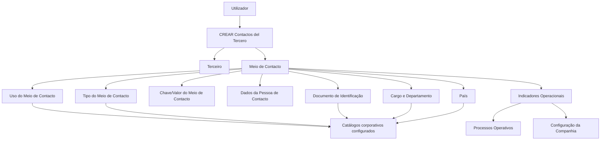

# Criação de Contactos do Terceiro — Especificação Funcional de Meios de Contacto

## 1. Metadados do Documento
- **Arquivo de Origem:** Não identificado
- **Tipo de Documento:** Especificação Técnica
- **Domínio / Sistema:** Gestão de Terceiros / Contactos
- **Público-Alvo:** Desenvolvedores, Analistas Funcionais, Operação e Negócio
- **Data/Versão Identificada:** Não identificada

---

## 2. Resumo Executivo & Contexto de Negócio

O documento descreve a funcionalidade **“CREAR Contactos del Tercero”**, cuja finalidade é permitir que utilizadores registrem um ou vários meios de contacto associados a um Terceiro. A especificação aplica-se ao processo de captura de informação de contacto, incluindo dados pessoais do contacto, identificação documental, cargo, departamento, localização geográfica e indicadores operacionais.

Os atributos descritos podem ser utilizados no registo de contactos de **Pessoas Físicas** e **Pessoas Jurídicas**, salvo quando o documento indicar explicitamente uma regra diferente. A solução utiliza valores provenientes de classificações e catálogos corporativos previamente configurados, tais como tipos de contacto, usos de contacto, documentos, cargos, departamentos e países.

A especificação estabelece validações funcionais relevantes para a qualidade e priorização das informações. O valor de um meio de contacto deve respeitar o tipo associado; por exemplo, um contacto do tipo correio eletrónico deve possuir formato de e-mail, enquanto um contacto do tipo telefone deve respeitar a estrutura telefónica aplicável aos planos nacionais de numeração dos países.

O documento também define regras de unicidade para os meios de contacto marcados como padrão ou prioritários. Um Terceiro pode possuir múltiplos contactos, mas apenas um meio pode ser definido como prioritário para o conjunto total de contactos, e apenas um meio pode ser definido como padrão para cada tipo de meio de contacto.

---

## 3. Arquitetura, Componentes & Tecnologias Envolvidas

O conteúdo apresenta uma especificação funcional de uma tela ou processo de registo de contactos de Terceiros. Não são detalhados microsserviços, APIs, tecnologias de implementação, bases de dados, ambientes, URLs, protocolos ou contratos JSON.

Os componentes funcionais identificados são:

- **Utilizador:** responsável por capturar os dados do contacto.
- **Funcionalidade CREAR Contactos:** processo de criação de um ou vários meios de contacto para um Terceiro.
- **Terceiro:** entidade à qual os contactos são associados.
- **Meio de Contacto:** informação de contacto, como correio eletrónico ou telefone.
- **Catálogos corporativos:** fontes de valores permitidos para uso, tipo de meio de contacto, documentos, cargos, departamentos e países.
- **Configuração da Companhia:** origem da condição relativa ao controlo do limite de prémios para prevenção de lavagem de dinheiro.
- **Processos Operativos:** consumidores dos indicadores de contacto padrão, prioritário, validado, inabilitado e da data de validade.



> **Nota de Análise:** O documento não detalha tecnologia, persistência, integração, APIs, métodos HTTP, contratos de dados, autenticação ou arquitetura física da solução.

---

## 4. Regras de Negócio, Especificações Funcionais & Processos

### Processo funcional de criação

1. O utilizador pode registar um ou vários meios de contacto para um Terceiro.
2. Os atributos são apresentados numa sequência de captura definida da esquerda para a direita e de cima para baixo.
3. Quando o documento não indicar restrição expressa para um campo, os campos podem ser usados indistintamente para Pessoas Físicas e Pessoas Jurídicas.
4. A sequência do meio de contacto é atribuída automaticamente pelo sistema durante o processo de captura.
5. Os valores de uso, tipo de meio de contacto, documento, cargo, departamento e país devem respeitar os valores previamente configurados nos respetivos catálogos do sistema.

### Regras para dados do meio de contacto

- O **Uso do Meio de Contacto** deve conter um valor pertencente à classificação corporativa de usos de contactos de Terceiros.
- O **Tipo do Meio de Contacto** deve conter um valor pertencente à classificação corporativa dos tipos de meios de contacto.
- A **Chave/Valor do Meio de Contacto** deve representar o valor real compatível com o tipo de meio de contacto selecionado.
- Para o tipo **Correio eletrónico**, o valor deve ter formato e conteúdo de e-mail, como `xxxxxx@zzzzzz.zzz`.
- Para o tipo **Telefone**, o valor deve ter formato e conteúdo correspondentes a um telefone, como `< +99 99 9999 9999>`, segundo as regras dos planos nacionais de numeração telefónica dos países.
- A **Data de Validade** indica a data a partir da qual o meio de contacto está plenamente operacional e permite manter histórico das alterações efetuadas nas informações de contacto do Terceiro.
- O indicador de **Inabilitação** estabelece que o meio de contacto deixou de estar em vigor e, nesse caso, deve ser considerado pelos processos internos da entidade.

### Regras para contacto padrão

- O campo **Meio de Contacto por Defeito** é utilizado quando um Terceiro possui mais de um meio de contacto.
- O meio marcado como padrão deve ser considerado nos processos e procedimentos operativos que necessitem distinguir um contacto por defeito.
- Pode existir apenas **um** meio de contacto marcado como padrão para cada **Tipo de Meio de Contacto** atribuído ao Terceiro.

### Regras para contacto prioritário

- O campo **Meio de Contacto Prioritário** é utilizado quando um Terceiro possui mais de um meio de contacto.
- O contacto prioritário deve ser usado preferencialmente pelos processos operativos que necessitem de um meio de contacto preferencial.
- Pode existir apenas **um** meio de contacto prioritário para o total de meios de contacto do Terceiro, independentemente do uso e do tipo associados.

### Regras para Terceiro de Referência

A marca **Terceiro de Referência** indica que o contacto é a pessoa de referência para o envio de notificações quando todas as condições seguintes forem cumpridas:

1. O controlo no limite de prémios para prevenção de lavagem de dinheiro está ativado na Configuração da Companhia.
2. O Terceiro em captura é uma Pessoa Jurídica.
3. Nas informações do Terceiro foi indicado que devem ser enviadas notificações.
4. O Terceiro possui código de atividade `1`, correspondente a um Assegurado.

### Regras de qualidade e contexto do contacto

- **Meio de Contacto Validado** indica se o meio de contacto foi efetivamente validado pela entidade seguradora para classificar a qualidade da informação capturada.
- O campo **Relação** é texto livre destinado a detalhar ou ampliar a informação relativa ao departamento do contacto ou à relação do contacto com o Terceiro.
- O campo **Observações** permite capturar texto plano para ampliar ou detalhar a informação do meio de contacto.
- O tipo de documento utilizado para identificar a pessoa física ou jurídica como contacto deve estar entre os tipos de documento previamente configurados no sistema.

---

## 5. Tabelas de Parâmetros, Ambientes e Estruturas de Dados

| Item / Parâmetro | Descrição / Função | Tipo / Valores / Formato | Ambiente / Observações |
| :--- | :--- | :--- | :--- |
| Uso do Meio de Contacto | Classifica corporativamente o uso do contacto do Terceiro. | Um dos usos corporativos de contactos. | Valor proveniente de classificação corporativa. |
| Sequência do Meio de Contacto | Identifica a ordem de captura dos meios de contacto do Terceiro. | Número de sequência. | Atribuído automaticamente pelo sistema. |
| Tipo do Meio de Contacto | Classifica o tipo de meio de contacto associado ao Terceiro. | Um dos tipos corporativos de meios de contacto. | Valor proveniente de classificação corporativa. |
| Chave/Valor do Meio de Contacto | Armazena o valor real do meio de contacto conforme o tipo definido. | E-mail, telefone ou valor compatível com o tipo selecionado. | E-mail: `xxxxxx@zzzzzz.zzz`; telefone: `< +99 99 9999 9999>`, segundo planos nacionais de numeração. |
| Nome do Meio de Contacto | Regista o nome ou nomes da pessoa que atua como meio de contacto. | Texto. | Aplicável à pessoa de contacto. |
| Primeiro e Segundo Apelido do Contacto | Regista o apelido ou apelidos da pessoa que atua como contacto. | Texto. | Aplicável à pessoa de contacto. |
| Tipo Documento | Define o tipo de documento usado para identificar a pessoa física ou jurídica como contacto. | Tipo documental configurado no sistema. | O documento menciona que o campo pertence a um colapsador. |
| Chave do Documento | Regista a chave do documento que identifica a pessoa de contacto. | Chave documental. | O documento menciona que o atributo pertence a um painel. |
| Tipo de Cargo na Empresa | Classifica o cargo das pessoas nas empresas associado à pessoa de contacto. | Valor da classificação de cargos. | Não há detalhamento adicional sobre valores permitidos. |
| Cargo/Atividade do Contacto | Identifica o contacto por meio do código do posto ou cargo. | Código de posto. | Deve existir no catálogo de cargos do sistema. |
| Departamento do Contacto | Identifica o contacto por meio do código do departamento ou secção. | Código de departamento ou secção. | Deve existir no catálogo de departamentos de empresas do sistema. |
| Chave do País | Identifica o país associado ao meio de contacto do Terceiro. | Código de país. | Primeiro nível da estrutura geográfica; depende do catálogo de países configurado pela entidade seguradora. |
| Relação | Amplia informações sobre o departamento do contacto ou a relação entre contacto e Terceiro. | Texto livre. | Sem estrutura ou limite especificado. |
| Terceiro de Referência | Marca o contacto como pessoa de referência para envio de notificações. | Marca ou indicador. | Exige todas as condições de prevenção de lavagem de dinheiro, Pessoa Jurídica, notificações e atividade `1`/Assegurado. |
| Meio de Contacto por Defeito | Define o contacto padrão para processos que exijam essa distinção. | Marca ou indicador. | Apenas um por Tipo de Meio de Contacto atribuído ao Terceiro. |
| Meio de Contacto Prioritário | Define o contacto preferencial para processos operativos. | Marca ou indicador. | Apenas um para todos os meios de contacto do Terceiro. |
| Meio de Contacto Validado | Indica se a entidade seguradora validou efetivamente o meio de contacto. | Indicador. | Classifica a qualidade da informação capturada. |
| Inabilitação | Indica que o meio de contacto deixou de estar em vigor. | Indicador. | Deve ser considerado nos processos internos da entidade. |
| Data de Validade | Define desde quando o meio de contacto está plenamente operacional. | Data. | Permite histórico das mudanças na informação de contacto. |
| Observações | Permite ampliar ou detalhar a informação do meio de contacto. | Texto plano. | Sem estrutura ou limite especificado. |

---

## 6. Bateria de Perguntas & Respostas para RAG (FAQ Sintético)

### P1: Qual é o objetivo da funcionalidade “CREAR Contactos del Tercero”?
**R:** A funcionalidade permite que utilizadores registem um ou vários meios de contacto associados a um Terceiro.

### P2: A funcionalidade de contactos pode ser usada para Pessoas Físicas e Pessoas Jurídicas?
**R:** Sim. Quando os campos não forem especificados ou restringidos expressamente, o documento determina que podem ser utilizados indistintamente para o registo de informação de Pessoas Físicas e Pessoas Jurídicas.

### P3: Quem atribui a sequência do meio de contacto?
**R:** O sistema atribui automaticamente o número de sequência durante o processo de captura dos meios de contacto do Terceiro.

### P4: Como deve ser preenchida a chave ou valor de um meio de contacto do tipo correio eletrónico?
**R:** Quando o tipo de meio de contacto for “Correio eletrónico”, a chave ou valor deve possuir formato e conteúdo de e-mail, como `xxxxxx@zzzzzz.zzz`.

### P5: Qual é a regra para preencher um meio de contacto do tipo telefone?
**R:** Quando o tipo de meio de contacto for telefone, o valor deve possuir formato e conteúdo correspondentes a um telefone, como `< +99 99 9999 9999>`, de acordo com as regras dos planos nacionais de numeração telefónica dos países.

### P6: Quantos meios de contacto podem ser marcados como padrão?
**R:** Pode existir somente um meio de contacto marcado como padrão para cada Tipo de Meio de Contacto que o Terceiro tenha atribuído.

### P7: Quantos meios de contacto prioritários pode ter um Terceiro?
**R:** Pode existir somente um meio de contacto prioritário para o total de meios de contacto do Terceiro, independentemente do uso e do tipo associados a cada meio.

### P8: Em que situações um contacto pode ser marcado como Terceiro de Referência?
**R:** O contacto é considerado Terceiro de Referência para envio de notificações quando o controlo no limite de prémios para prevenção de lavagem de dinheiro está ativo, o Terceiro é uma Pessoa Jurídica, o Terceiro está configurado para receber notificações e possui código de atividade `1`, correspondente a um Assegurado.

### P9: Qual é a finalidade do indicador Meio de Contacto Validado?
**R:** O indicador informa se o meio de contacto foi efetivamente validado pela entidade seguradora, permitindo classificar a qualidade da informação capturada no sistema.

### P10: Para que serve a data de validade de um meio de contacto?
**R:** A data de validade informa a partir de quando o meio de contacto estará plenamente operacional. O uso adequado desse campo permite manter o histórico das alterações realizadas na informação de contacto do Terceiro.

### P11: O que significa inabilitar um meio de contacto?
**R:** A inabilitação indica que o meio de contacto associado ao Terceiro deixou de estar em vigor e, quando isso ocorrer, deve ser considerado pelos processos internos da entidade.

### P12: De onde vêm os valores de cargo, departamento e país?
**R:** O código de cargo deve existir no catálogo de cargos do sistema, o código de departamento deve existir no catálogo de departamentos de empresas e o código de país deve existir no catálogo de países configurado pela entidade seguradora.

---

## 7. Glossário de Termos, Siglas & Conceitos-Chave

- **Terceiro:** Entidade para a qual são registados um ou vários meios de contacto.
- **Meio de Contacto:** Informação utilizada para contactar o Terceiro ou uma pessoa associada ao Terceiro, como correio eletrónico ou telefone.
- **Uso do Meio de Contacto:** Classificação corporativa que identifica a utilização atribuída a um contacto.
- **Tipo do Meio de Contacto:** Classificação corporativa que identifica a natureza do meio de contacto.
- **Pessoa Física:** Pessoa individual mencionada como possível contexto de registo dos campos de contacto.
- **Pessoa Jurídica:** Entidade jurídica mencionada como possível contexto de registo e como condição para o Terceiro de Referência.
- **Terceiro de Referência:** Pessoa de contacto para a qual devem ser enviadas notificações quando as condições definidas forem cumpridas.
- **Meio de Contacto por Defeito:** Contacto padrão para processos ou procedimentos operativos que exigem essa distinção.
- **Meio de Contacto Prioritário:** Contacto a ser usado preferencialmente em processos operativos.
- **Meio de Contacto Validado:** Contacto efetivamente validado pela entidade seguradora para fins de qualidade de dados.
- **Inabilitação:** Indicador de que o meio de contacto deixou de estar em vigor.
- **Catálogo:** Relação de valores existentes e configurados no sistema para classificação ou identificação de informações.
- **Prevenção do Lavado de Dinero:** Referência, no documento, ao controlo no limite de prémios para prevenção de lavagem de dinheiro.
- **Assegurado:** Terceiro com código de atividade `1`, conforme a condição descrita para Terceiro de Referência.

---

## 8. Notas Críticas, Riscos & Limitações

- O documento não identifica o nome do sistema, versão, data, ambiente ou arquivo de origem.
- Não há detalhe de APIs, métodos HTTP, contratos JSON, modelo físico de dados, integrações, autenticação ou autorização.
- O documento referencia catálogos configurados no sistema, mas não apresenta os valores permitidos para usos, tipos de meios de contacto, documentos, cargos, departamentos ou países.
- Os formatos apresentados para e-mail e telefone são exemplos; não são fornecidas regras técnicas completas de validação.
- A regra de Terceiro de Referência depende de configurações e informações externas à tela de contactos: controlo de limite de prémios, natureza jurídica do Terceiro, envio de notificações e código de atividade.
- Não são definidos comportamentos para conflito entre contactos padrão, prioritários, inabilitados, validados ou com data de validade futura.
- Não são detalhadas mensagens de erro, obrigatoriedade dos campos, permissões de utilizadores, auditoria, fluxos de alteração ou exclusão de contactos.

---

## 9. Conteúdo Bruto Estruturado (Referência Fiel)

```text
--- [PÁGINA 1 DE 4] ---

CREAR Contactos del Tercero
Objetivo
El propósito de esta pantalla es proporcionar la funcionalidad para que los Usuarios puedan registrar
uno o varios Medios de contacto para el Tercero.
Posibles Acciones
 CREAR ( )
Contactos
De izquierda a derecha y de arriba hacia abajo, los siguientes atributos marcan la secuencia de
captura de la información.
Si no se especifica o indica expresamente los Campos se emplearán indistintamente tanto en el
registro de información de las Personas Físicas como para las Personas Jurídicas.
 / 
 RS
Inicio Soluciones APIs Documentación Zeus
ES


--- [PÁGINA 2 DE 4] ---

Uso del Medio de Contacto (  )
Este atributo contiene el valor de uno de los Usos en los que se clasifican corporativamente los
Contactos de los Terceros.
Secuencia del Medio de Contacto
Este dato contiene el Número de Secuencia en la Captura de los Medios de Contacto del Tercero
siendo un valor que el Sistema asigna automáticamente en el proceso de captura.
Tipo del Medio de Contacto (  )
Este atributo contiene uno de los posibles valores de la clasificación corporativa realizada sobre los
Tipos de los Medios de Contacto de un Tercero.
Clave/valor del Medio de Contacto ( )
Este Atributo contiene el valor real del Tipo del Medio de Contacto (de acuerdo con el tipo de medio
definido)
Así pues, si se ha asociado en el contacto del Tercero el tipo 'Correo electrónico' el valor de este
Dato tiene que tener el formato y contenido de un correo electrónico: xxxxxx@zzzzzz.zzz, en cambio
y si se ha asociado al Tercero un tipo 'Teléfono' el valor de este Dato tiene que tener el formato y
contenido que correspondan a un Teléfono: < +99 99 9999 9999> (de acuerdo con las reglas de los
Planes Nacionales de Numeración Telefónica de los Países).
Nombre del Medio de Contacto ( )
Este campo contiene el Nombre o los Nombres de la Persona que actúa como Medio de Contacto.
Primer y Segundo Apellido del Contacto ( )
Este dato contiene el Apellido o los Apellidos de la Persona que actúa como Medio de Contacto.
Tipo Documento (  )
Este campo del colapsador contiene el tipo de documento con el que se va a identificar a la persona
física o jurídica como Contacto de acuerdo con los tipos de documentos que hayan sido configurados
en el sistema previamente.
Clave del Documento ( )
Este Atributo del panel contiene la clave del documento que identifica a la Persona del Contacto.
Tipo de Cargo en la Empresa (  )


--- [PÁGINA 3 DE 4] ---

Este atributo contiene el valor de la clasificación de los cargos de las Personas en las Empresas,
asociado a la Persona de Contacto.
Cargo/Actividad del Contacto (  )
Este Campo contiene el código del Puesto con el que se estará identificando el Contacto del Tercero,
de acuerdo con la relación de posibles valores existentes en el catálogo de Cargos existente en el
Sistema.
Departamento del Contacto (  )
Este Campo contiene el código del departamento o sección con el que se estará identificando el
Contacto del Tercero, de acuerdo con la relación de posibles valores existentes en el catálogo de
Departamentos de Empresas existente en el Sistema.
Clave del País (  )
Este Campo contiene el código del primer nivel de la estructura Geográfica (países) en el que se
estará identificando el Medio de Contacto del Tercero, de acuerdo con la relación de posibles valores
existentes en el catálogo de Países que la entidad aseguradora haya configurado en el Sistema.
Relación ( )
Esta cualidad se utiliza como texto libre para detallar o ampliar la información relativa al
Departamento del Contacto o la relación del Contacto con el Tercero.
Tercero de Referencia ( )
Esta marca indica que el Contacto es la Persona de Referencia (a la que se deben enviar las
notificaciones correspondientes) en el caso que se cumplan:
El Control en el Límite de Primas para la Prevención del Lavado de Dinero esté activado en la
Configuración de la Compañía.
El Tercero que se esté capturando sea una Persona Jurídica y además se haya indicado en la
Información del Tercero que se le han de enviar notificaciones.
El Tercero que se esté capturando tenga el código de actividad 1 correspondiente a un
Asegurado.
Medio de Contacto por Defecto ( )
Este Campo, en aquellos Terceros que tienen más de un medio de contacto asociado, indicará cual
de ellos es el que se debe considerar por defecto en aquellos Procesos y/o Procedimientos
Operativos en los que sea necesario esta distinción.


--- [PÁGINA 4 DE 4] ---

Solamente puede haber uno identificado y marcado como tal por cada Tipo de Medio de Contacto
que tenga el Tercero asignados.
Medio de Contacto Prioritario ( )
Este Campo, en aquellos Terceros que tienen más de un medio de contacto asociado, va a indicar
cual de ellos es el que se ha de considerar preferentemente en aquellos Procesos Operativos en los
que sea necesario su empleo.
Solamente puede haber uno identificado como tal para el total de Medios de Contacto del Tercero
independientemente del uso y tipo que tengan asociado.
Medio de Contacto Validado ( )
Este Dato indica si el Medio de Contacto ha sido efectivamente validado por parte de la entidad
aseguradora a efectos de clasificar la calidad de la información capturada en el Sistema.
Inhabilitación ( )
Este campo establece si el Medio de Contacto asociado al Tercero ha dejado de estar en vigor y por
ello en caso de estarlo debería estar considerado en los procesos internos de la entidad.
Fecha de Validez ( )
Esta propiedad le indica al sistema la fecha a partir de la cual el Medio de Contacto va a estar
plenamente operativo por lo que su adecuado uso permite tener un histórico de los cambios
efectuados en la Información del Medio de Contacto del Tercero.
Observaciones ( )
El objetivo de este campo es la posibilidad de capturar texto plano para ampliar o detallar la
información del Medio de Contacto del Tercero.
```
