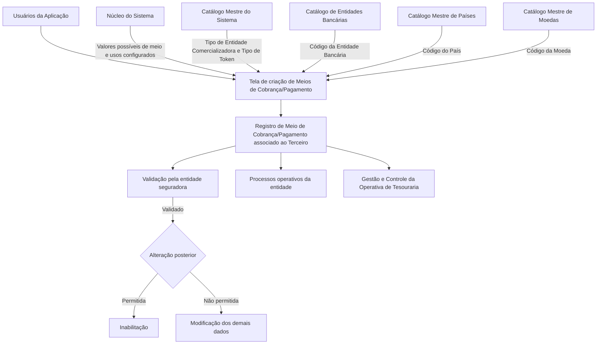

# Gestão de Meios de Cobrança e Pagamento Associados a Terceiros

## 1. Metadados do Documento
- **Arquivo de Origem:** Não identificado — conteúdo bruto fornecido na solicitação.
- **Tipo de Documento:** Especificação Funcional.
- **Domínio / Sistema:** Gestão de Meios de Cobrança e Pagamento de Terceiros; operação de Tesouraria; entidade seguradora.
- **Público-Alvo:** Analistas funcionais, desenvolvedores, arquitetos, operação e equipes de negócio da entidade seguradora.
- **Data/Versão Identificada:** Não identificada.

---

## 2. Resumo Executivo & Contexto de Negócio

O documento descreve a funcionalidade de criação e registro de Meios de Cobrança e Pagamento associados a um Terceiro. A tela permite que usuários da aplicação identifiquem e registrem informações relativas a contas, cartões e outros meios disponibilizados pelo núcleo do sistema.

A especificação define a sequência lógica de captura de atributos para um Meio de Cobrança/Pagamento. Os atributos abrangem classificação do meio, entidade comercializadora, instituição bancária, país, titularidade, tokenização, valores reais, valores mascarados e criptografados, movimento, uso operacional, moeda, validade e status de validação.

O documento também estabelece controles operacionais relevantes para a entidade seguradora. Um Meio de Cobrança/Pagamento validado somente deveria poder ser inabilitado, sem possibilidade de alteração de seus demais dados. Além disso, cada Terceiro pode ter apenas um meio marcado como padrão, enquanto a marcação prioritária é única por Tipo de Meio de Cobrança/Pagamento.

A gestão da vigência é tratada por meio da propriedade de inabilitação e da Data de Validade. A inabilitação impede que um meio não mais vigente seja considerado nas operações da entidade seguradora, enquanto a data de validade permite que o sistema mantenha histórico das alterações efetuadas nas informações do meio.

---

## 3. Arquitetura, Componentes & Tecnologias Envolvidas

O conteúdo descreve uma tela funcional integrada ao núcleo do Sistema e a catálogos mestres. Não há detalhamento de arquitetura de software, APIs, métodos HTTP, contratos JSON, bancos de dados, tecnologias de implementação, ambientes ou integrações técnicas.

Os componentes e fontes de referência explicitamente citados são:

- **Usuários da Aplicação:** responsáveis por identificar e registrar os Meios de Cobrança/Pagamento.
- **Tela de criação de Meios de Cobrança e Pagamento:** interface funcional para a ação `CREAR`.
- **Núcleo do Sistema:** fornece valores possíveis de Meios de Cobrança/Pagamento e usos configurados.
- **Catálogo Mestre do Sistema:** origem de valores para Tipo de Entidade Comercializadora e Tipo de Token.
- **Catálogo de Entidades Bancárias:** origem dos códigos de entidades bancárias.
- **Catálogo Mestre de Países:** origem dos códigos do primeiro nível da estrutura geográfica.
- **Catálogo Mestre de Moedas:** origem dos códigos de moedas.
- **Entidade seguradora:** configura valores de Classe do Meio de Cobrança/Pagamento, valida dados e utiliza os meios em suas operações.
- **Gestão e Controle da Operativa de Tesouraria:** contexto de configuração do Tipo de Uso do Movimento.



> **Nota de Análise:** O documento não detalha serviços, microsserviços, APIs, persistência de dados, autenticação, mecanismos criptográficos, regras de mascaramento ou contratos de integração.

---

## 4. Regras de Negócio, Especificações Funcionais & Processos

### 4.1 Finalidade da tela

A tela fornece funcionalidade para que usuários da aplicação identifiquem e registrem no Sistema a informação dos Meios de Cobrança e Pagamento associados a um Terceiro. Os exemplos de meios citados incluem Contas e Cartões.

### 4.2 Ação disponível

A ação explicitamente indicada é:

- **CREAR:** criação de um Meio de Cobrança/Pagamento associado ao Terceiro.

### 4.3 Sequência lógica de captura

O documento estabelece que os atributos da tela devem ser capturados em sequência lógica, da esquerda para a direita e de cima para baixo. A ordem apresentada no conteúdo é:

1. Meio de Cobrança/Pagamento.
2. Classe do Meio de Cobrança/Pagamento.
3. Tipo de Entidade Comercializadora.
4. Entidade Bancária.
5. Chave do País.
6. Titular.
7. Valor Mascarado.
8. Tipo de Token.
9. Token do Meio de Cobrança/Pagamento.
10. Valor do Meio de Cobrança/Pagamento.
11. Valor Encriptado do Meio de Cobrança/Pagamento.
12. Tipo de Movimento.
13. Tipo de Uso do Movimento.
14. Moeda.
15. Sequência/Ordem.
16. Mês de Vencimento.
17. Ano de Vencimento.
18. Meio de Cobrança/Pagamento Validado.
19. Meio de Cobrança/Pagamento por Defeito.
20. Inabilitação.
21. Meio de Cobrança/Pagamento Prioritário.
22. Data de Validade.

### 4.4 Regras de catálogos e valores permitidos

- O **Meio de Cobrança/Pagamento** deve conter um dos valores possíveis fornecidos pelo núcleo do Sistema.
- A **Classe do Meio de Cobrança/Pagamento** deve corresponder à subdivisão do meio do Terceiro, conforme valores configurados pela entidade seguradora.
- O **Tipo de Entidade Comercializadora** deve utilizar um código existente no catálogo mestre do Sistema.
- A **Entidade Bancária** deve utilizar um código existente no catálogo de Entidades Bancárias do Sistema.
- A **Chave do País** deve utilizar um código existente no catálogo mestre de Países do Sistema, representando o primeiro nível da estrutura geográfica.
- O **Tipo de Token** deve utilizar um código existente no Catálogo Mestre.
- A **Moeda** deve utilizar um código existente no catálogo mestre de Moedas.
- O **Tipo de Uso do Movimento** deve conter um dos usos configurados e fornecidos pelo núcleo do Sistema para utilização sem restrição do meio.

### 4.5 Regras de valores, segurança e identificação

- O **Titular** identifica a pessoa titular do Meio de Cobrança/Pagamento.
- O **Valor Mascarado** apresenta o valor do meio conforme o tipo de mascaramento aplicável ao Meio de Cobrança/Pagamento.
- O **Token do Meio de Cobrança/Pagamento** contém o código do token associado, de acordo com o Tipo de Token.
- O **Valor do Meio de Cobrança/Pagamento** identifica o valor real do meio. Para uma Tarjeta, corresponde ao número do cartão; para uma Conta Corrente, corresponde ao número da conta.
- O **Valor Encriptado do Meio de Cobrança/Pagamento** identifica o valor criptografado do meio.

> **Nota de Análise:** O documento menciona mascaramento, tokenização e valor encriptado, mas não especifica algoritmos, formatos, chaves, padrões de mascaramento, políticas de retenção ou controles de acesso.

### 4.6 Regras de utilização operacional

- O **Tipo de Movimento** identifica se o Meio de Cobrança/Pagamento pode ser utilizado para realizar Cobranças ou Pagamentos.
- O **Tipo de Uso do Movimento** identifica um uso configurado para o qual o Meio de Cobrança/Pagamento pode ser utilizado sem restrição, no contexto da Gestão e Controle da Operativa de Tesouraria.
- A **Sequência/Ordem** corresponde ao número de sequência do Meio de Cobrança/Pagamento associado ao Terceiro e é atribuída automaticamente pelo Sistema.
- O **Mês de Vencimento** e o **Ano de Vencimento** representam o vencimento do Meio de Cobrança/Pagamento.

### 4.7 Regras de validação e imutabilidade

- O atributo **Meio de Cobrança/Pagamento Validado** informa se o meio foi validado pela entidade seguradora para fins de qualidade do dado.
- Após a comprovação e validação do Meio de Cobrança/Pagamento, o Sistema somente deveria permitir a sua **inabilitação**.
- Após a validação, a modificação dos dados do Meio de Cobrança/Pagamento não deveria ser permitida.

### 4.8 Regras de padrão, prioridade e vigência

- Um Terceiro com mais de um Meio de Cobrança/Pagamento associado pode possuir um meio identificado como **por Defeito**.
- O Meio de Cobrança/Pagamento por Defeito é aquele apresentado por padrão nos Processos Operativos da Entidade.
- Somente pode existir **um** Meio de Cobrança/Pagamento por Defeito entre todos os meios associados ao mesmo Terceiro.
- Um Terceiro com mais de um Meio de Cobrança/Pagamento associado pode possuir um meio identificado como **Prioritário**.
- O Meio de Cobrança/Pagamento Prioritário é aquele que deve ser considerado preferencialmente nos Processos Operativos da Entidade.
- Somente pode existir **um** Meio de Cobrança/Pagamento Prioritário por Tipo de Meio de Cobrança/Pagamento.
- A **Inabilitação** indica que o Meio de Cobrança/Pagamento deixou de estar vigente.
- Um meio inabilitado não deve ser considerado nas operações da entidade seguradora que utilizam Meios de Cobrança/Pagamento de Terceiros.
- A **Data de Validade** indica a data a partir da qual o Meio de Cobrança/Pagamento está plenamente operacional no Sistema.
- A Data de Validade permite manter histórico das alterações efetuadas nas informações do Meio de Cobrança/Pagamento.

---

## 5. Tabelas de Parâmetros, Ambientes e Estruturas de Dados

| Item / Parâmetro | Descrição / Função | Tipo / Valores / Formato | Ambiente / Observações |
| :--- | :--- | :--- | :--- |
| Ação `CREAR` | Cria um Meio de Cobrança/Pagamento associado ao Terceiro. | Ação funcional. | Única ação explicitamente apresentada. |
| Meio de Cobrança/Pagamento | Identifica um meio associado ao Terceiro. | Um dos valores fornecidos pelo núcleo do Sistema. | Exemplos citados: Contas e Cartões. |
| Classe do Meio de Cobrança/Pagamento | Identifica a subdivisão do Meio de Cobrança/Pagamento do Terceiro. | Valor configurado. | Conforme configuração da entidade seguradora. |
| Tipo de Entidade Comercializadora | Identifica o código do tipo de entidade comercializadora associado ao meio. | Código existente. | Catálogo mestre do Sistema. |
| Entidade Bancária | Identifica a entidade bancária à qual pertence o meio. | Código existente. | Catálogo de Entidades Bancárias do Sistema. |
| Chave do País | Identifica o país de localização da Entidade Bancária. | Código do primeiro nível da estrutura geográfica. | Catálogo mestre de Países do Sistema. |
| Titular | Identifica a pessoa titular do Meio de Cobrança/Pagamento. | Atributo de identificação. | Não há formato detalhado. |
| Valor Mascarado | Exibe o valor do meio de acordo com o mascaramento aplicável. | Valor mascarado. | O tipo de mascaramento não é detalhado. |
| Tipo de Token | Identifica o tipo de token associado ao meio. | Código existente. | Catálogo Mestre. |
| Token do Meio de Cobrança/Pagamento | Identifica o código do token do meio. | Código de token. | Associado ao respectivo Tipo de Token. |
| Valor do Meio de Cobrança/Pagamento | Identifica o valor real do meio. | Número de cartão, número de conta corrente ou outro valor real aplicável. | O formato depende do tipo de meio. |
| Valor Encriptado do Meio de Cobrança/Pagamento | Identifica o valor criptografado do meio. | Valor encriptado. | Método de criptografia não detalhado. |
| Tipo de Movimento | Define se o meio pode ser utilizado para Cobranças ou Pagamentos. | Cobros ou Pagos. | Não são definidos outros valores. |
| Tipo de Uso do Movimento | Define um uso operacional sem restrição para o meio. | Um dos usos configurados pelo núcleo do Sistema. | Contexto de Gestão e Controle da Operativa de Tesouraria. |
| Moeda | Identifica a moeda do Meio de Cobrança/Pagamento. | Código de moeda existente. | Catálogo mestre de Moedas do Sistema. |
| Sequência/Ordem | Identifica o número sequencial do meio associado ao Terceiro. | Número de sequência. | Atribuído automaticamente pelo Sistema. |
| Mês de Vencimento | Identifica o mês de vencimento do meio. | Mês. | Formato não detalhado. |
| Ano de Vencimento | Identifica o ano de vencimento do meio. | Ano. | Formato não detalhado. |
| Meio de Cobrança/Pagamento Validado | Indica se o meio foi validado para fins de qualidade do dado. | Indicador de validação. | Após validação, somente a inabilitação deveria ser permitida. |
| Meio de Cobrança/Pagamento por Defeito | Indica o meio apresentado por padrão nos processos operativos. | Indicador de padrão. | Somente um por Terceiro. |
| Inabilitação | Indica que o meio deixou de estar vigente. | Indicador de inabilitação. | Meio inabilitado não deve ser considerado nas operações da entidade seguradora. |
| Meio de Cobrança/Pagamento Prioritário | Indica o meio preferencial nos processos operativos. | Indicador de prioridade. | Somente um por Tipo de Meio de Cobrança/Pagamento. |
| Data de Validade | Define a data a partir da qual o meio está plenamente operacional. | Data. | Permite histórico de alterações. |

---

## 6. Bateria de Perguntas & Respostas para RAG (FAQ Sintético)

### P1: Qual é o objetivo da tela de criação de Meios de Cobrança e Pagamento?
**R:** A tela permite que usuários da aplicação identifiquem e registrem no Sistema as informações dos Meios de Cobrança e Pagamento associados a um Terceiro. O documento cita Contas e Cartões como exemplos de meios que podem ser registrados.

### P2: De onde vêm os valores possíveis do atributo Meio de Cobrança/Pagamento?
**R:** O atributo Meio de Cobrança/Pagamento deve conter um dos valores possíveis fornecidos pelo núcleo do Sistema.

### P3: Como é definida a Classe do Meio de Cobrança/Pagamento?
**R:** A Classe do Meio de Cobrança/Pagamento representa a subdivisão do meio associado ao Terceiro. Os valores possíveis são configurados pela entidade seguradora.

### P4: Qual é a diferença entre o Valor Mascarado, o Valor Real e o Valor Encriptado do Meio de Cobrança/Pagamento?
**R:** O Valor Mascarado exibe o valor do meio conforme o mascaramento aplicável. O Valor do Meio de Cobrança/Pagamento identifica o valor real, como o número de um cartão ou de uma conta corrente. O Valor Encriptado identifica o valor criptografado do meio. O documento não detalha formatos, algoritmos ou regras técnicas de mascaramento e criptografia.

### P5: Como o Sistema deve tratar um Meio de Cobrança/Pagamento validado?
**R:** O indicador Meio de Cobrança/Pagamento Validado informa se o meio foi validado pela entidade seguradora para fins de qualidade do dado. Depois da comprovação e validação, o Sistema somente deveria permitir a inabilitação do meio, não a modificação de seus dados.

### P6: Quantos Meios de Cobrança/Pagamento por Defeito um Terceiro pode possuir?
**R:** Um Terceiro pode possuir apenas um Meio de Cobrança/Pagamento identificado como por Defeito entre todos os meios associados. Esse é o meio que deve aparecer por padrão nos Processos Operativos da Entidade.

### P7: Quantos Meios de Cobrança/Pagamento Prioritários podem existir?
**R:** Pode existir somente um Meio de Cobrança/Pagamento Prioritário por Tipo de Meio de Cobrança/Pagamento. O meio prioritário deve ser considerado preferencialmente nos Processos Operativos da Entidade.

### P8: O que significa a Inabilitação de um Meio de Cobrança/Pagamento?
**R:** A Inabilitação indica que o Meio de Cobrança/Pagamento associado ao Terceiro deixou de estar vigente. Um meio inabilitado não deve ser considerado nas operações da entidade seguradora que utilizam Meios de Cobrança/Pagamento de Terceiros.

### P9: Qual é a finalidade da Data de Validade?
**R:** A Data de Validade informa a data a partir da qual o Meio de Cobrança/Pagamento está plenamente operacional no Sistema. O uso correto desse atributo permite manter histórico das alterações efetuadas nas informações do meio.

### P10: Como é definido o Tipo de Movimento de um Meio de Cobrança/Pagamento?
**R:** O Tipo de Movimento identifica se o Meio de Cobrança/Pagamento pode ser utilizado para realizar Cobranças ou Pagamentos.

### P11: De onde é obtido o código da Entidade Bancária?
**R:** O código da Entidade Bancária deve corresponder a um dos valores existentes no catálogo de Entidades Bancárias do Sistema.

### P12: Quem atribui a Sequência/Ordem do Meio de Cobrança/Pagamento?
**R:** A Sequência/Ordem é o número de sequência do Meio de Cobrança/Pagamento associado ao Terceiro e é atribuída automaticamente pelo Sistema.

### P13: O que representa a Chave do País?
**R:** A Chave do País contém o código do primeiro nível da estrutura geográfica, ou seja, o país onde é identificada a localização da Entidade Bancária do Meio de Cobrança/Pagamento. O código deve existir no catálogo mestre de Países do Sistema.

### P14: Para que serve o Tipo de Uso do Movimento?
**R:** O Tipo de Uso do Movimento identifica um dos usos configurados e fornecidos pelo núcleo do Sistema no qual o Meio de Cobrança/Pagamento pode ser empregado sem restrição. O atributo é definido de acordo com a Gestão e Controle da Operativa de Tesouraria da Entidade.

---

## 7. Glossário de Termos, Siglas & Conceitos-Chave

- **Meio de Cobrança/Pagamento:** Meio associado a um Terceiro para realização de Cobranças ou Pagamentos; o documento cita Contas e Cartões como exemplos.
- **Terceiro:** Entidade à qual um ou mais Meios de Cobrança/Pagamento são associados.
- **Núcleo do Sistema:** Fonte dos valores possíveis de Meios de Cobrança/Pagamento e dos usos configurados para o Tipo de Uso do Movimento.
- **Catálogo Mestre:** Fonte de possíveis valores para determinados atributos, como Tipo de Entidade Comercializadora e Tipo de Token.
- **Entidade Comercializadora:** Tipo de entidade associado ao Meio de Cobrança/Pagamento, identificado por código no catálogo mestre do Sistema.
- **Entidade Bancária:** Instituição bancária à qual pertence o Meio de Cobrança/Pagamento.
- **Token:** Código associado ao Meio de Cobrança/Pagamento conforme o Tipo de Token.
- **Valor Mascarado:** Visualização do valor do meio conforme o tipo de mascaramento aplicável.
- **Valor Encriptado:** Valor criptografado do Meio de Cobrança/Pagamento.
- **Tipo de Movimento:** Atributo que define se o meio é utilizado para Cobranças ou Pagamentos.
- **Tipo de Uso do Movimento:** Uso operacional configurado em que o meio pode ser empregado sem restrição.
- **Meio por Defeito:** Meio apresentado por padrão nos Processos Operativos da Entidade.
- **Meio Prioritário:** Meio considerado preferencialmente nos Processos Operativos da Entidade.
- **Inabilitação:** Propriedade que indica que o meio deixou de estar vigente e não deve participar das operações da entidade seguradora.
- **Data de Validade:** Data a partir da qual o meio está plenamente operacional no Sistema.
- **Gestão e Controle da Operativa de Tesouraria:** Contexto operacional que configura os usos permitidos sem restrição para um Meio de Cobrança/Pagamento.

---

## 8. Notas Críticas, Riscos & Limitações

- O documento não identifica o nome do arquivo original, autor, data, versão ou responsável pela especificação.
- Não há descrição de APIs, métodos HTTP, contratos JSON, mensagens assíncronas, integrações, bancos de dados, tecnologias, URLs, servidores ou ambientes.
- O documento não especifica formatos, obrigatoriedade, tamanho, validações sintáticas ou regras de preenchimento para os atributos.
- O documento menciona valor mascarado, valor encriptado e token, mas não especifica mecanismos criptográficos, padrões de mascaramento, tipos de token ou procedimentos de segurança.
- A regra para meios validados usa a formulação “o sistema somente deveria permitir sua inabilitação”, devendo ser confirmada como comportamento obrigatório para implementação.
- A regra de unicidade de Meio por Defeito é aplicada a todos os Meios de Cobrança/Pagamento do Terceiro.
- A regra de unicidade de Meio Prioritário é aplicada por Tipo de Meio de Cobrança/Pagamento.
- O documento não define como tratar conflitos entre um meio marcado simultaneamente como por Defeito e Prioritário.
- O documento não informa como o Sistema deve validar a existência de valores nos catálogos, nem o comportamento em caso de indisponibilidade ou inconsistência de catálogo.
- O documento não detalha a regra de histórico habilitada pela Data de Validade, incluindo versionamento, auditoria, vigência final ou tratamento de sobreposição de períodos.

---

## 9. Conteúdo Bruto Estruturado (Referência Fiel)

```text
--- [PÁGINA 1 DE 4] ---

CREAR Medios de Cobro y Pago del Tercero
Objetivo
Esta pantalla proporciona la funcionalidad para que los Usuarios de la Aplicación puedan Identificar
y registrar en el Sistema la información de los Medios de Cobro y Pago (Cuentas, Tarjetas, ...)
asociados al Tercero.
Posibles Acciones
 CREAR ( )
Medios de Cobro y Pago
De izquierda a derecha y de arriba hacia abajo, los siguientes atributos marcan la secuencia de
captura lógica de la información.
 / 
 RS
Inicio Soluciones APIs Documentación Zeus
ES


--- [PÁGINA 2 DE 4] ---

Medio Cobro/Pago (  )
Este dato contendrá uno de los posibles valores de los Medios de Cobro/Pago proporcionados por el
núcleo del Sistema.
Clase del Medio de Cobro/Pago (  )
Este Campo contiene el valor de la Subdivisión de los Medios de Cobro/Pago del Tercero, de
acuerdo con la relación de posibles valores configurados por la entidad aseguradora.
Tipo de Entidad Comercializadora (  )
Este Campo contiene el código del Tipo de Entidad Comercializadora del Medio de Cobro/Pago
asociado al Medio de Cobro/Pago del Tercero, de acuerdo con la relación de posibles valores
existentes en el catálogo maestro del Sistema.
Entidad Bancaria (  )
Este Campo contiene el código de la Entidad Bancaria a la que pertenece el Medio de Cobro/Pago
del Tercero, de acuerdo con la relación de posibles valores existentes en el catálogo de Entidades
Bancarias del Sistema.
Clave del País (  )
Este Campo contiene el código del primer nivel de la estructura Geográfica (países) en el que se
estará identificando la ubicación de la Entidad Bancaria del Medio de Cobro y Pago asociado al
Tercero, de acuerdo con la relación de posibles valores existentes en el catálogo maestro de Países
existente en el Sistema.
Titular ( )
Este Atributo identifica la persona Titular del Medio de Cobro/Pago.
Valor Enmascarado
Este Atributo visualiza el Valor del Medio de Cobro/Pago de acuerdo con el tipo de enmascaramiento
contemplado para el Medio de Cobro/Pago.
Tipo de Token (  )
Este Campo contiene el código del tipo de token del Medio de Cobro y Pago asociado al Tercero, de
acuerdo con la relación de posibles valores existentes en el Catálogo Maestro.
Token Medio Cobro Cobro/Pago ( )


--- [PÁGINA 3 DE 4] ---

Este Campo contiene el código del Token del Medio de Cobro y Pago asociado al Tercero de acuerdo
con su tipo de Token asociado.
Valor del Medio Cobro/Pago ( )
Este Atributo identifica el Valor 'Real' del Medio de Cobro/Pago, es decir, si el Medio de Cobro/Pago
es una Tarjeta el número de la tarjeta, si es una Cuenta Corriente el número de la cuenta, etcétera.
Valor Encriptado del Medio Cobro/Pago
Este Atributo identifica el Valor encriptado del Medio de Cobro/Pago.
Tipo de Movimiento (  )
Este Atributo identifica si el Medio de Cobro/Pago se puede utilizar para realizar Cobros o Pagos.
Tipo Uso del Movimiento (  )
De acuerdo con la Gestión y Control en la Operativa de Tesorería de la Entidad, este dato contendrá
el valor de uno de los usos configurados y proporcionados por el núcleo del Sistema en el que el
Medio de Cobro/Pago podrá ser empleado sin restricción.
Moneda (  )
Este Campo contendrá el código de la Moneda del Medio de Cobro/Pago de acuerdo con la relación
de posibles valores existentes en el catálogo maestro de Monedas existente en el Sistema.
Secuencia/Orden
Este dato contiene el Número de Secuencia del Medio de Cobro/Pago asociado al Tercero. Es un
valor que se asigna automáticamente por parte del Sistema.
Mes Vencimiento ( )
Este Atributo contiene el Mes de Vencimiento del Medio de Cobro/Pago del Tercero.
Año Vencimiento ( )
Este Atributo contiene el Año de Vencimiento del Medio de Cobro/Pago del Tercero.
Medio Cobro/Pago Validado ( )
Este Dato indica si el Medio de Cobro/Pago ha sido o no validado, a efectos de calidad del dato, por
la entidad aseguradora. Una vez se haya efectuado la comprobación y validación del Medio de
Cobro/Pago, el sistema solamente debería permitir su inhabilitación no así la modificación de sus
datos.


--- [PÁGINA 4 DE 4] ---

Medio Cobro/Pago por Defecto ( )
Este Campo, en aquellos Terceros que tienen más de un medio de Cobro/Pago asociado, indicará
cual de ellos es el que aparecerá por defecto en los Procesos Operativos de la Entidad.
Solamente puede haber uno identificado y marcado como tal entre todos los Medios de
Cobro/Pago del Tercero.
Inhabilitación ( )
Esta propiedad establece si el Medio de Cobro/Pago asociado al Tercero ha dejado de estar en vigor
y por tanto no debiera ser considerado en ninguno de las operativas de la entidad aseguradora que
utilicen los medios de Cobro/Pago de los Terceros.
Medio Cobro/Pago Prioritario ( )
Este Campo, en aquellos Terceros que tienen más de un medio de Cobro/Pago asociado, indicará
cual de ellos es el que se ha de considerar preferentemente en los Procesos Operativos de la
Entidad.
Solamente puede haber uno identificado y marcado como tal por cada Tipo de Medio de
Cobro/Pago.
Fecha de Validez ( )
Esta propiedad le indica al sistema la fecha a partir de la cual el Medio de Cobro/Pago estará
plenamente operativo en el sistema por lo que su correcto uso permite tener un histórico de los
cambios efectuados en su información.
```
