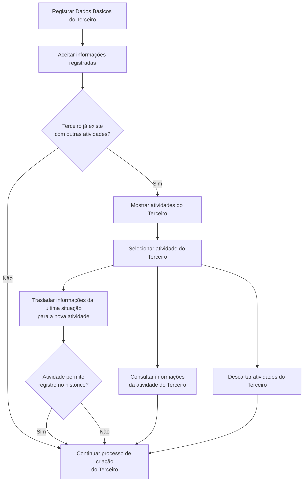

# Criação de Dados Básicos do Terceiro no Reef.core

## 1. Metadados do Documento
- **Arquivo de Origem:** Não identificado
- **Tipo de Documento:** Procedimento
- **Domínio / Sistema:** Reef.core — cadastro de Terceiros
- **Público-Alvo:** Analistas funcionais, usuários operacionais e equipes de negócio
- **Data/Versão Identificada:** Não identificada

---

## 2. Resumo Executivo & Contexto de Negócio

O documento descreve a ação de criação dos **Dados Básicos do Terceiro** no sistema Reef.core. O objetivo explícito dessa ação é realizar a identificação inequívoca de uma pessoa física ou jurídica no sistema.

O processo organiza a captura de informações em uma sequência de atributos apresentada da esquerda para a direita e de cima para baixo. Os principais dados incluem tipo e chave do documento identificador, código de atividade, código interno do Terceiro e referência a um documento identificador principal.

O documento também define um comportamento específico para a criação de um Terceiro que já existe no sistema associado a outras atividades. Nessa situação, o usuário pode consultar informações de uma atividade existente, trasladar dados da última situação para uma nova atividade — quando permitido pelo histórico — ou descartar as atividades existentes e iniciar a criação da nova atividade do zero.

A criação dos Dados Básicos do Terceiro depende de catálogos mestres previamente configurados no Reef.core, especialmente para os tipos de documento identificador e para os códigos de atividade.

---

## 3. Arquitetura, Componentes & Tecnologias Envolvidas

O documento menciona o sistema **Reef.core** como fonte dos catálogos mestres utilizados no cadastro. Não descreve arquitetura técnica, APIs, métodos HTTP, banco de dados, microsserviços, URLs, ambientes ou tecnologias de infraestrutura.

### Componentes e elementos identificados

| Componente / Elemento | Função descrita |
| :--- | :--- |
| Reef.core | Sistema que possui os catálogos mestres de tipos de documentos e atividades. |
| Catálogo mestre de Reef.core | Fonte pré-configurada dos tipos de documentos identificadores e das atividades disponíveis. |
| Dados Básicos do Terceiro | Conjunto de atributos usado para identificar inequivocamente uma pessoa física ou jurídica. |
| Terceiro | Pessoa física ou jurídica identificada e registrada no sistema. |
| Atividade do Terceiro | Classificação associada ao Terceiro; pode haver múltiplas atividades para o mesmo Terceiro. |
| Histórico | Registro cuja utilização é condicionada à permissão da atividade para traslado de dados. |



> **Nota de Análise:** O documento apresenta um fluxo funcional de criação e tratamento de Terceiros existentes, mas não detalha componentes técnicos, persistência de dados, contratos de integração ou regras de autorização.

---

## 4. Regras de Negócio, Especificações Funcionais & Processos

### Objetivo da criação de Dados Básicos

A ação de criação dos Dados Básicos do Terceiro tem como propósito a **identificação inequívoca do Terceiro no sistema**.

O Terceiro pode ser uma pessoa física ou jurídica, identificada por um tipo de documento e uma chave de documento.

### Sequência de captura

Os atributos devem seguir a sequência de captura indicada na tela:

1. Da esquerda para a direita.
2. De cima para baixo.

### Regras dos atributos cadastrais

1. O **Tipo de Documento Identificador** deve corresponder a um tipo de documento previamente configurado no catálogo mestre do Reef.core.
2. A **Chave do Documento Identificador** deve conter a chave do Terceiro.
3. O **Código de Atividade do Terceiro** deve corresponder a uma atividade existente no catálogo mestre do Reef.core.
4. O **Código do Terceiro** é o código interno do sistema associado ao Terceiro.
5. O Código do Terceiro pode ser atribuído automática ou manualmente.
6. A atribuição de código ao Terceiro depende de a atividade do Terceiro determinar a obrigatoriedade dessa atribuição.
7. O **Tipo de Documento Identificador Principal** permite relacionar o tipo e a chave de documento do Terceiro a um documento principal.
8. A associação ao documento principal permite relacionar vários documentos a um documento básico.
9. A **Chave do Documento Identificador Principal**, combinada ao tipo de documento identificador principal, identifica a chave do documento principal relacionado ao Terceiro.
10. A relação com o documento principal permite conectar diversos documentos a um documento principal.

### Processo para Terceiro existente com outras atividades

Após aceitar os dados registrados, o sistema deve avaliar se o Terceiro já existe com outras atividades.

Se o Terceiro existir com outras atividades, estão previstas as seguintes alternativas:

1. Mostrar as atividades já existentes do Terceiro.
2. Selecionar uma atividade do Terceiro.
3. Consultar as informações da atividade selecionada.
4. Trasladar os dados da última situação para a nova atividade do Terceiro.
5. O traslado somente pode ocorrer quando a atividade permitir o registro no histórico.
6. Descartar as atividades existentes do Terceiro.
7. Continuar o processo de criação da nova atividade do Terceiro partindo do zero.

Se o Terceiro não existir com outras atividades, o processo segue com a criação do Terceiro.

---

## 5. Tabelas de Parâmetros, Ambientes e Estruturas de Dados

| Item / Parâmetro | Descrição / Função | Tipo / Valores / Formato | Ambiente / Observações |
| :--- | :--- | :--- | :--- |
| Tipo Documento Identificador | Define o tipo de documento usado para identificar pessoa física ou jurídica. | Tipo de documento configurado. | Deve existir previamente no catálogo mestre de Reef.core. |
| Chave do Documento Identificador | Contém a chave do Terceiro. | Chave do documento. | O documento não especifica formato, tamanho ou validação. |
| Código de Atividade do Terceiro | Indica a atividade associada ao Terceiro. | Código de atividade. | Deve corresponder às atividades existentes no catálogo mestre de Reef.core. |
| Código do Terceiro | Código interno do sistema para o Terceiro. | Código interno. | Pode ser atribuído automática ou manualmente, conforme obrigatoriedade determinada pela atividade. |
| Tipo Documento Identificador Principal | Define o tipo de documento principal relacionado ao Terceiro. | Tipo de documento principal. | Possibilita relacionar múltiplos documentos a um documento básico. |
| Chave do Documento Identificador Principal | Define a chave do documento principal relacionado ao Terceiro. | Chave de documento principal. | Deve ser utilizada em conjunto com o tipo de documento identificador principal. |
| Atividade do Terceiro | Atividade atribuída ou existente para o Terceiro. | Atividade do catálogo mestre. | Um Terceiro pode existir no sistema com outras atividades. |
| Última situação | Dados que podem ser trasladados para uma nova atividade. | Informação histórica. | O traslado está condicionado à permissão de registro no histórico pela atividade. |
| Catálogo mestre de Reef.core | Fonte de dados configurados para documentos e atividades. | Catálogo de referência. | Deve estar configurado previamente. |
| Histórico | Registro que pode viabilizar o traslado de dados da última situação. | Registro histórico. | Aplicável somente quando a atividade permitir seu registro. |

> **Nota de Análise:** O documento não informa ambientes técnicos, servidores, URLs, variáveis de configuração, rotas de log, modelos de dados físicos ou formatos de integração.

---

## 6. Bateria de Perguntas & Respostas para RAG (FAQ Sintético)

### P1: Qual é o objetivo da criação dos Dados Básicos do Terceiro?
**R:** O objetivo da ação de criação dos Dados Básicos do Terceiro é realizar a identificação inequívoca do Terceiro no sistema.

### P2: Quais entidades podem ser identificadas como Terceiro?
**R:** O documento informa que o tipo de documento identificador é usado para identificar uma pessoa física ou jurídica.

### P3: De onde vêm os tipos de documento identificador disponíveis para cadastro?
**R:** Os tipos de documento identificador devem estar previamente configurados no catálogo mestre do Reef.core.

### P4: Qual informação deve ser registrada na Chave do Documento Identificador?
**R:** A Chave do Documento Identificador deve conter a chave do Terceiro.

### P5: Como é definido o Código de Atividade do Terceiro?
**R:** O Código de Atividade do Terceiro deve indicar uma atividade existente na relação de atividades do catálogo mestre de Reef.core.

### P6: O Código do Terceiro é sempre preenchido manualmente?
**R:** Não. O Código do Terceiro é um código interno do sistema e pode ser atribuído automática ou manualmente. Essa atribuição ocorre quando a atividade do Terceiro determina a obrigatoriedade de atribuir um código.

### P7: Para que servem o Tipo e a Chave do Documento Identificador Principal?
**R:** O Tipo de Documento Identificador Principal e a Chave do Documento Identificador Principal identificam o documento principal ao qual o Terceiro será relacionado. Essa relação permite conectar diversos documentos a um documento principal ou básico.

### P8: O que acontece após aceitar os dados de um Terceiro que já possui outras atividades no sistema?
**R:** Se o Terceiro já existir com outras atividades, é possível mostrar e selecionar uma atividade existente, consultar suas informações, trasladar dados da última situação para a nova atividade quando a atividade permitir histórico, ou descartar as atividades e continuar a criação da nova atividade do zero.

### P9: Em que condição os dados da última situação podem ser trasladados para uma nova atividade?
**R:** O traslado dos dados da última situação para a nova atividade do Terceiro somente é previsto quando a atividade permitir seu registro no histórico.

### P10: O que significa descartar as atividades do Terceiro durante o processo?
**R:** Conforme o fluxo apresentado, descartar as atividades do Terceiro é uma alternativa ao tratamento das atividades existentes antes de continuar o processo de criação do Terceiro.

### P11: O documento define APIs ou contratos JSON para o cadastro de Terceiros?
**R:** Não. O documento descreve atributos e fluxo funcional de cadastro, mas não detalha APIs, métodos HTTP, contratos JSON, endpoints ou integrações técnicas.

### P12: Qual é a sequência indicada para captura das informações de Dados Básicos?
**R:** Os atributos devem ser capturados da esquerda para a direita e de cima para baixo.

---

## 7. Glossário de Termos, Siglas & Conceitos-Chave

- **Reef.core:** Sistema mencionado como fonte dos catálogos mestres de tipos de documentos e atividades.
- **Terceiro:** Pessoa física ou jurídica que deve ser identificada inequivocamente no sistema.
- **Dados Básicos:** Conjunto de atributos utilizados para identificar e cadastrar o Terceiro.
- **Catálogo mestre:** Cadastro previamente configurado que fornece tipos de documentos identificadores e atividades.
- **Tipo Documento Identificador:** Tipo de documento usado para identificar uma pessoa física ou jurídica.
- **Chave do Documento Identificador:** Chave que contém a identificação do Terceiro.
- **Código de Atividade do Terceiro:** Código que indica a atividade do Terceiro conforme o catálogo mestre.
- **Código do Terceiro:** Código interno atribuído pelo sistema ao Terceiro, automática ou manualmente em determinadas condições.
- **Documento Identificador Principal:** Documento principal ao qual tipo e chave de documento do Terceiro podem ser relacionados.
- **Histórico:** Registro associado à atividade que pode permitir o traslado de dados da última situação.

---

## 8. Notas Críticas, Riscos & Limitações

- O documento não apresenta nome de arquivo, data, versão, autoria ou classificação formal.
- Não há detalhamento técnico sobre arquitetura de software, APIs, integrações, autenticação, banco de dados, logs ou ambientes.
- Não são informados formatos, obrigatoriedade, tamanhos, máscaras ou validações para os campos de documento e códigos.
- O traslado de informações está condicionado à permissão da atividade para registro no histórico, mas o documento não especifica como essa permissão é configurada ou validada.
- O significado operacional exato de “descartar atividades do Terceiro” não é detalhado; o fluxo apenas apresenta essa opção antes da continuação da criação.
- O documento menciona exemplos, mas não fornece conteúdo textual adicional para esses exemplos.
- A regra para atribuição automática ou manual do Código do Terceiro é citada, porém os critérios específicos da atividade não são descritos.

---

## 9. Conteúdo Bruto Estruturado (Referência Fiel)

```text
--- [PÁGINA 1 DE 3] ---

CREAR Datos Básicos del Tercero
Objetivo
El propósito de la acción de creación de los Datos Básicos del Tercero es la Identificación
inequívoca del Tercero en el sistema.
Posibles Acciones
 CREAR ( )
Datos Básicos
De izquierda a derecha y de arriba hacia abajo, los siguientes atributos marcan la secuencia de
captura de la Información.
Tipo Documento Identificador (  )
Este Atributo del colapsador contiene el tipo de documento con el que se va a identificar a la persona
física o jurídica de acuerdo con la relación de tipos de documentos que hayan sido configurados
previamente en el catálogo maestro de Reef.core.
 / 
 RS
Inicio Soluciones APIs Documentación Zeus
ES


--- [PÁGINA 2 DE 3] ---

Clave del Documento Identificador (  )
Este Atributo de la pantalla contendrá la clave del Tercero.
Código de Actividad del Tercero (  )
Esta propiedad indicará el código de la Actividad del Tercero de acuerdo con la relación de
actividades existentes en el catálogo maestro de Reef.core.
Código del Tercero ( )
Este dato será el código interno del sistema que se asignará al Tercero automática o manualmente
en el caso que la actividad del Tercero determine la obligatoriedad de asignar un código al Tercero.
Tipo Documento Identificador Principal (  )
Este atributo del panel de datos básicos contiene el tipo de documento principal con el que se va a
relacionar el tipo y la clave del documento del Tercero pudiendo de esta manera relacionar varios
documentos con uno básico.
Clave del Documento Identificador Principal ( )
Conjuntamente con el tipo de documento identificador principal, este otro campo del bloque de datos
básicos identificará la clave del documento principal con el que se va a relacionar el Tercero
pudiendo de esta manera conectar diversos documentos con un documento principal.
Proceso
Una vez se acepten los datos que hayan sido registrados y en el caso específico en el que el Tercero
ya exista en el Sistema con otras actividades podremos, o bien Seleccionar una de ellas para
Consultar su información y/o Trasladar los datos de su última situación (siempre y cuando la
actividad permita su registro en el histórico) para la nueva actividad del Tercero, o bien Cancelar y
continuar el con el Proceso de Creación del Tercero para la nueva actividad partiendo de cero.
Ejemplo:
Ejemplo:


--- [PÁGINA 3 DE 3] ---

SI
NO
ACEPTAR
INFORMACIÓN
¿TERCERO EXISTENTE con
otras ACTIVIDADES?
MOSTRAR ACTIVIDADES
del TERCERO
SELECCIONAR ACTIVIDAD
TERCERO
CONSULTAR Inf.
Actividad del TERCERO
TRASLADAR Inf.
Actividad del TERCERO
DESCARTAR
Actividades del TERCERO
CONTINUAR Proceso de
Creación del Tercero
```
