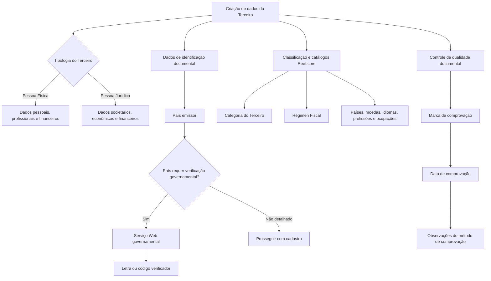

# Criação de Dados de Pessoa Física/Jurídica de Terceiro no Reef.core

## 1. Metadados do Documento
- **Arquivo de Origem:** Não identificado
- **Tipo de Documento:** Manual Operacional / Especificação Funcional
- **Domínio / Sistema:** Reef.core; cadastro de Terceiros; Grupo MAPFRE
- **Público-Alvo:** Analistas funcionais, desenvolvedores, operação e negócio
- **Data/Versão Identificada:** Não identificada

---

## 2. Resumo Executivo & Contexto de Negócio

O documento descreve a funcionalidade de criação e complemento de dados cadastrais de um **Terceiro** no sistema Reef.core. O cadastro suporta duas tipologias: **Pessoa Física** e **Pessoa Jurídica**, e concentra atributos de identificação, documento, classificação, dados econômicos, dados pessoais e informações fiscais.

A funcionalidade permite determinar se o Terceiro é Pessoa Física ou Pessoa Jurídica, identificar se é uma Pessoa Politicamente Exposta, complementar informações do documento identificador e classificar o Terceiro por meio de catálogos do sistema. Parte dos atributos é comum às duas tipologias; outros só devem ser utilizados quando a tipologia do Terceiro atender à condição indicada.

O cadastro incorpora controles de qualidade e validação documental, incluindo marca de comprovação, data de comprovação, observações e, para determinados países, integração com um Serviço Web governamental para obtenção de letra ou código verificador do documento identificador.

Também são contemplados atributos para processos econômicos e corporativos, como atividade econômica, consolidação no Grupo MAPFRE, perfis financeiros, regime fiscal, código societário e obrigações fiscais em outros países. O documento não detalha interfaces, métodos HTTP, contratos JSON, persistência de dados, permissões ou fluxos técnicos de integração além da referência ao Serviço Web governamental.

---

## 3. Arquitetura, Componentes & Tecnologias Envolvidas

### Componentes e conceitos identificados

| Componente / Conceito | Papel descrito |
| :--- | :--- |
| **Reef.core** | Sistema que mantém catálogos mestres, código interno do Terceiro e informações cadastrais. |
| **Cadastro de Terceiro** | Funcionalidade para criação e complemento de dados de Pessoas Físicas e Jurídicas. |
| **Catálogo de Países** | Fonte de valores para país emissor e país de nascimento/constituição. |
| **Catálogo de Estados** | Fonte de valores para estado de nascimento/constituição. |
| **Catálogo de Províncias** | Fonte de valores para província de nascimento/constituição. |
| **Catálogo de Localidades** | Fonte de valores para localidade de nascimento/constituição. |
| **Catálogo de Moedas** | Fonte de valores para moeda dos ingressos mensais estimados. |
| **Catálogo Mestre de Idiomas** | Fonte de valores para idioma de comunicação com o Terceiro. |
| **Catálogo Mestre de Profissões** | Fonte de valores para profissão da Pessoa Física. |
| **Catálogo Mestre de Ocupações** | Fonte de valores para ocupação da Pessoa Física. |
| **Catálogo Mestre de Atividades Econômicas** | Fonte de valores para tipo de atividade econômica. |
| **Catálogo Mestre do Sistema** | Fonte de perfis financeiros e tipo societário. |
| **Serviço Web governamental** | Serviço utilizado em determinados países para retornar letra ou código verificador de documento. |
| **Grupo MAPFRE - GL** | Contexto de consolidação societária para Terceiros Jurídicos. |



> **Nota de Análise:** O documento menciona um Serviço Web provido pelo governo para alguns países, mas não detalha nome do serviço, endpoint, protocolo, autenticação, métodos, contratos ou tratamento de erros.

---

## 4. Regras de Negócio, Especificações Funcionais & Processos

### 4.1 Regras de tipologia do Terceiro

1. O Terceiro pode ser classificado como **Pessoa Física** ou **Pessoa Jurídica**.
2. A marca de Pessoa Física ou Pessoa Jurídica é aplicável aos tipos de documentos configurados para poderem estar associados tanto a pessoas físicas quanto a entidades jurídicas.
3. Quando um campo não especificar expressamente uma tipologia, o campo pode ser empregado indistintamente no registro de Pessoas Físicas e Pessoas Jurídicas.
4. Campos explicitamente condicionados a Pessoa Física ou Pessoa Jurídica devem ser utilizados apenas para a tipologia indicada.

### 4.2 Regras de identificação e rastreabilidade

1. O **ID único do Terceiro** somente é utilizado quando a configuração dos parâmetros da companhia exigir identificação unívoca dos Terceiros em todas as aplicações que gerenciam suas informações.
2. O identificador único é atribuído automaticamente ao Terceiro por uma lógica de negócio local.
3. O identificador único suporta rastreabilidade, integração e cruzamento de dados entre sistemas.
4. O identificador único **não substitui** o atributo que identifica o código interno do Terceiro no Reef.core.
5. O país emissor do documento deve ser selecionado conforme os valores existentes no catálogo de Países do sistema.
6. Em países que exigem verificação do documento perante serviço governamental, a letra ou o código verificador retornado deve ser considerado em operações posteriores com o Terceiro.

### 4.3 Regras de validação documental

1. A **Marca de Comprovação** indica se o documento do Terceiro foi revisado e verificado, em relação à qualidade dos dados mantidos no sistema.
2. Quando a Marca de Comprovação indicar que o documento foi revisado e comprovado, a **Fecha de Comprobación** deve registrar a data de realização da ação.
3. Quando o documento tiver sido revisado e validado, **Observaciones** permite registrar texto esclarecedor ou observações sobre o método empregado na comprovação.
4. A **Fecha de Emisión** identifica a data de emissão do documento do Terceiro.
5. A **Fecha de Caducidad** identifica a data de vencimento do documento do Terceiro.

### 4.4 Regras de classificação, fiscais e econômicas

1. A **Categoría del Tercero** deve utilizar código existente no catálogo do sistema.
2. O **Régimen Fiscal** deve utilizar código existente no catálogo mestre do Reef.core.
3. O campo **Por Cuenta Propia** identifica Pessoa Física que realiza atividade econômica de forma independente e direta, sem contrato de trabalho, inclusive quando utiliza serviço remunerado de outras pessoas como empregador.
4. O campo **Sociedad para Consolidación en Grupo MAPFRE - GL** armazena o código societário do Terceiro Jurídico para consolidação nos processos do Grupo MAPFRE.
5. A **Actividad Económica** representa a classificação de atividades econômicas dos Terceiros Jurídicos configurada pela entidade seguradora.
6. O **Tipo de Actividad Económica** deve utilizar código do catálogo mestre de Atividades Econômicas.
7. Os campos de perfil financeiro principal e secundário aplicam-se exclusivamente a Pessoas Jurídicas e devem usar códigos do catálogo mestre do sistema.
8. O **Código Tipo Sociedad** aplica-se exclusivamente a Pessoas Jurídicas e deve usar valores existentes no catálogo mestre do sistema.
9. A marca **Obligaciones Fiscales en otros Países** habilita o comportamento do sistema para inserção de dados dos países nos quais o Terceiro possui obrigações fiscais.

### 4.5 Regras de dados pessoais e societários

1. Para Pessoa Física, **Nombre** representa o nome do Terceiro; para Pessoa Jurídica, representa a razão social.
2. Segundo nome, sobrenomes, estado civil, dados do cônjuge, nascimento, falecimento, residência, nacionalidade, gênero, deficiência, profissão, ocupação, empresa, emprego, rendimentos, estudos, titulação e número de filhos são condicionados à Pessoa Física conforme indicado no documento.
3. O país, estado, província e localidade de nascimento aplicam-se à Pessoa Física; para Pessoa Jurídica, representam o local de constituição.
4. A **Fecha de Constitución** identifica a data do ato jurídico de constituição da sociedade.
5. O **Folio Registral** representa o número individual que identifica e diferencia documentos de um Terceiro Jurídico.
6. O **Alias del Tercero** pode ser informado tanto para Pessoa Física quanto para Pessoa Jurídica.
7. O tratamento é uma forma de respeito anterior ao nome do Terceiro.
8. O posposto complementa o nome do Terceiro e pode representar condição como Junior ou Senior para Pessoas Físicas, ou formas societárias como U.T.E., S.A., Ltd. e G.M.B.H para Pessoas Jurídicas.

---

## 5. Tabelas de Parâmetros, Ambientes e Estruturas de Dados

### 5.1 Identificação, documento e classificação

| Item / Parâmetro | Descrição / Função | Tipo / Valores / Formato | Ambiente / Observações |
| :--- | :--- | :--- | :--- |
| Pessoa Física ou Pessoa Jurídica | Define a tipologia do Terceiro. | Marca de verificação. | Aplicável a tipos documentais que podem ser associados a ambas as tipologias. |
| ID único do Terceiro | Código de identificador único atribuído automaticamente. | Código gerado por lógica local. | Depende da configuração dos parâmetros da companhia; não substitui o código interno do Terceiro no Reef.core. |
| Persona Políticamente Expuesta | Habilita dados específicos de pessoa politicamente exposta. | Marca de verificação. | Modula o comportamento do sistema. |
| Fecha de Emisión | Registra a data de emissão do documento do Terceiro. | Data. | — |
| Fecha de Caducidad | Registra a data de vencimento do documento do Terceiro. | Data. | — |
| País Emisor | Identifica o país emissor do documento identificador. | Código de país. | Valores do catálogo de Países do sistema. |
| Verificador del Documento Identificador | Armazena letra ou código verificador do documento. | Letra ou código. | Obtido por Serviço Web governamental em países onde aplicável. |
| Marca de Comprobación | Indica se o documento foi revisado e verificado. | Marca de verificação. | Relacionada à qualidade dos dados do Terceiro. |
| Fecha de Comprobación | Registra a data de revisão e comprovação documental. | Data. | Preenchida quando a Marca de Comprovação indicar documento revisado e comprovado. |
| Observaciones | Registra esclarecimentos ou método empregado na comprovação documental. | Texto. | Aplicável quando o documento foi revisado e validado. |
| Categoría del Tercero | Classifica o Terceiro. | Código de categoria. | Valores do catálogo do sistema. |
| Régimen Fiscal | Identifica o regime fiscal do Terceiro. | Código de regime fiscal. | Valores do catálogo mestre do Reef.core. |
| Por Cuenta Propia | Identifica trabalhador por conta própria. | Marca de verificação. | Aplicável a Pessoa Física com atividade econômica independente e direta. |

### 5.2 Dados econômicos, jurídicos e societários

| Item / Parâmetro | Descrição / Função | Tipo / Valores / Formato | Ambiente / Observações |
| :--- | :--- | :--- | :--- |
| Alias del Tercero | Registra apelido ou sobrenome do Terceiro. | Texto. | Aplicável a Pessoa Física e Pessoa Jurídica. |
| Sociedad para Consolidación en Grupo MAPFRE - GL | Registra código societário para consolidação no Grupo MAPFRE. | Código societário. | Aplicável a Pessoas Físicas e Jurídicas segundo o documento. |
| Actividad Económica | Classifica as atividades econômicas do Terceiro Jurídico. | Classificação configurada pela entidade seguradora. | Aplicável a Pessoa Jurídica. |
| Tipo de Actividad Económica | Identifica o tipo da atividade econômica. | Código. | Valores do catálogo mestre de Atividades Econômicas. |
| Folio Registral | Identifica individualmente documentos similares do Terceiro Jurídico. | Número registral. | Aplicável a Pessoa Jurídica. |
| Fecha de Constitución | Identifica a data de constituição societária. | Data. | Aplicável a Pessoa Jurídica. |
| Perfil Financiero Act. Principal | Identifica o perfil financeiro da atividade econômica principal. | Código de perfil financeiro. | Aplicável a Pessoa Jurídica; valores do catálogo mestre do sistema. |
| Perfil Financiero Act. Secundarias | Identifica o perfil financeiro das atividades econômicas secundárias. | Código de perfil financeiro. | Aplicável a Pessoa Jurídica; valores do catálogo mestre do sistema. |
| Código Tipo Sociedad | Identifica o tipo de código societário. | Código. | Aplicável a Pessoa Jurídica; valores do catálogo mestre do sistema. |
| Obligaciones Fiscales en otros Países | Habilita o registro de países onde há obrigações fiscais. | Marca de verificação. | Adapta o comportamento do sistema. |

### 5.3 Dados de pessoa e filiação

| Item / Parâmetro | Descrição / Função | Tipo / Valores / Formato | Ambiente / Observações |
| :--- | :--- | :--- | :--- |
| Tratamiento | Tratamento de respeito anterior ao nome. | Código de tratamento. | Exemplos: 001 Don; 002 Doña; 003 Señor; 004 Señora; 005 Ilmo.; 006 Excmo. |
| Pospuesto | Código posposto ao nome para indicar condição do Terceiro. | Código de posposto. | Pessoa Física: 001 Junior, 002 Senior. Pessoa Jurídica: 003 U.T.E., 004 S.A., 005 Ltd., 006 G.M.B.H. |
| Nombre | Nome da Pessoa Física ou razão social da Pessoa Jurídica. | Texto. | Dependente da tipologia do Terceiro. |
| Segundo Nombre | Segundo e sucessivos nomes. | Texto. | Aplicável a Pessoa Física. |
| Primer Apellido | Primeiro sobrenome. | Texto. | Aplicável a Pessoa Física. |
| Segundo Apellido | Segundo sobrenome. | Texto. | Aplicável a Pessoa Física. |
| Apellido de Casado/a | Sobrenome de casado(a). | Texto. | Aplicável a Pessoa Física em países onde o uso seja comum. |
| Estado Civil | Estado civil do Terceiro. | Código. | Aplicável a Pessoa Física. |
| Nombre y Apellidos del Cónyuge | Nome e sobrenomes do cônjuge. | Texto. | Aplicável a Pessoa Física quando o estado civil for coerente com o campo. |
| Fecha de Nacimiento | Data de nascimento. | Data. | Aplicável a Pessoa Física. |
| Fecha de Fallecimiento | Data de falecimento. | Data. | Aplicável a Pessoa Física. |
| Fecha de Inicio de Residencia | Data de início de residência. | Data. | Aplicável a Pessoa Física. |
| Nacionalidad | Nacionalidade do Terceiro. | Código ou valor de nacionalidade. | Aplicável a Pessoa Física. |
| Tipo de Nacionalidad | Tipo de nacionalidade. | Código. | Codificação local da entidade seguradora para uso interno. |
| País de Nacimiento/Constitución | País de nascimento ou constituição. | Código de país. | Catálogo de Países do sistema. |
| Estado de Nacimiento/Constitución | Estado de nascimento ou constituição. | Código de estado. | Catálogo de Estados do sistema. |
| Provincia de Nacimiento/Constitución | Província de nascimento ou constituição. | Código de província. | Catálogo de Províncias do sistema. |
| Localidad de Nacimiento/Constitución | Localidade de nascimento ou constituição. | Código de localidade. | Catálogo de Localidades do sistema. |
| Idioma | Preferência de idioma para comunicações da entidade seguradora. | Código de idioma. | Catálogo mestre de Idiomas do sistema. |
| Género | Gênero do Terceiro. | Valor de gênero. | Aplicável a Pessoa Física. |
| Porcentaje Discapacidad | Percentual de deficiência. | Percentual. | Aplicável a Pessoa Física; conforme tabelas de baremos e graus de deficiência do país. |
| Profesión | Profissão associada ao Terceiro. | Código de profissão. | Aplicável a Pessoa Física; catálogo mestre de Profissões do Reef.core. |
| Ocupación | Ocupação associada ao Terceiro. | Código de ocupação. | Aplicável a Pessoa Física; catálogo mestre de Ocupações do Reef.core. |
| Nombre de la Empresa | Nome da empresa onde o Terceiro trabalha. | Texto. | Aplicável a Pessoa Física. |
| Tipo de Empresa | Tipo da empresa onde o Terceiro trabalha. | Código ou tipologia. | Aplicável a Pessoa Física; conforme tipologias definidas. |
| Tipo de Empleo | Identifica o tipo de emprego, distinguindo assalariado e autônomo. | Código ou tipologia. | Aplicável a Pessoa Física. |
| Ingresos Mensuales Estimados | Valor estimado dos ingressos mensais do Terceiro. | Valor monetário. | Aplicável a Pessoa Física. |
| Moneda | Moeda dos ingressos mensais estimados. | Código de moeda. | Aplicável a Pessoa Física; valores do catálogo de moedas do sistema. |
| Nivel de Estudios | Nível de estudos. | Código. | Aplicável a Pessoa Física. |
| Titulación | Titulação do Terceiro. | Código. | Aplicável a Pessoa Física. |
| Número de Hijos | Número de filhos. | Número. | Aplicável a Pessoa Física. |

---

## 6. Bateria de Perguntas & Respostas para RAG (FAQ Sintético)

### P1: Qual é a finalidade da funcionalidade de criação de dados de Terceiro no Reef.core?
**R:** A funcionalidade permite identificar o Terceiro como Pessoa Física ou Pessoa Jurídica, identificar se o Terceiro é Pessoa Politicamente Exposta, complementar dados do documento identificador e classificar o Terceiro. O cadastro também abrange dados econômicos, fiscais, pessoais, societários e de qualidade documental.

### P2: O ID único do Terceiro substitui o código interno do Terceiro no Reef.core?
**R:** Não. O documento afirma expressamente que o ID único do Terceiro não substitui o atributo que identifica o código do Terceiro para uso interno no Reef.core. O ID único é gerado automaticamente por lógica de negócio local quando a companhia exige identificação unívoca em suas aplicações.

### P3: Quando a data de comprovação do documento deve ser registrada?
**R:** A Fecha de Comprobación deve registrar a data em que a revisão e comprovação foram realizadas quando o estado da Marca de Comprovação indicar que o documento do Terceiro foi revisado e comprovado.

### P4: Como funciona o verificador do documento identificador?
**R:** Em determinados países, o documento do Terceiro requer chamada a um Serviço Web provido pelo governo. O Serviço Web retorna uma letra ou código verificador, que deve ser considerado e utilizado posteriormente nas operações com o Terceiro. O documento não detalha o contrato técnico dessa integração.

### P5: Quais campos são exclusivos de Pessoa Jurídica?
**R:** Entre os campos explicitamente condicionados a Pessoa Jurídica estão Actividad Económica, Folio Registral, Fecha de Constitución, Perfil Financiero Act. Principal, Perfil Financiero Act. Secundarias e Código Tipo Sociedad. Além disso, para Pessoa Jurídica, Nombre representa a razão social.

### P6: Quais campos de localização servem tanto para nascimento quanto para constituição?
**R:** País de Nacimiento/Constitución, Estado de Nacimiento/Constitución, Provincia de Nacimiento/Constitución e Localidad de Nacimiento/Constitución registram, para Pessoas Físicas, o local de nascimento e, para Pessoas Jurídicas, o local de constituição. Os valores são obtidos dos respectivos catálogos do sistema.

### P7: O que significa Por Cuenta Propia no cadastro de Terceiro?
**R:** Por Cuenta Propia identifica um Terceiro Pessoa Física que exerce atividade econômica de forma independente e direta, sem estar sujeito a contrato de trabalho. A regra inclui situações em que o Terceiro utiliza serviços remunerados de outras pessoas para desenvolver sua atividade, atuando como empregador.

### P8: Como são informados os dados de renda de uma Pessoa Física?
**R:** Ingresos Mensuales Estimados registra o valor dos ingressos mensais do Terceiro Pessoa Física. Moneda deve informar o código da moeda na qual esses ingressos foram expressos, usando os valores disponíveis no catálogo de moedas do sistema.

### P9: Qual é a finalidade do campo Sociedad para Consolidación en Grupo MAPFRE - GL?
**R:** O campo captura o código societário do Terceiro Jurídico para sua consolidação nos processos do Grupo MAPFRE. O documento indica que o campo pode ser capturado para Pessoas Físicas e Jurídicas.

### P10: Como o sistema trata obrigações fiscais em outros países?
**R:** A ativação da marca Obligaciones Fiscales en otros Países adapta o comportamento do sistema para permitir o ingresso dos dados dos países nos quais o Terceiro possui obrigações fiscais.

### P11: Quais exemplos de valores são apresentados para Tratamiento e Pospuesto?
**R:** Para Tratamiento, o documento apresenta os exemplos 001 Don, 002 Doña, 003 Señor, 004 Señora, 005 Ilmo. e 006 Excmo. Para Pospuesto em Pessoa Física, são apresentados 001 Junior e 002 Senior; em Pessoa Jurídica, 003 U.T.E., 004 S.A., 005 Ltd. e 006 G.M.B.H.

### P12: Como a Pessoa Politicamente Exposta é tratada?
**R:** A ativação da marca Persona Políticamente Expuesta modula o comportamento do sistema e permite inserir os dados específicos da pessoa no painel de informação correspondente. O documento não detalha quais são esses dados específicos.

---

## 7. Glossário de Termos, Siglas & Conceitos-Chave

- **Reef.core:** Sistema mencionado como fonte de catálogos mestres e do código interno do Terceiro.
- **Terceiro:** Entidade cadastrada no sistema, classificada como Pessoa Física ou Pessoa Jurídica.
- **Pessoa Física:** Terceiro individual, para o qual se aplicam dados pessoais, profissionais, financeiros e familiares.
- **Pessoa Jurídica:** Entidade constituída por ato jurídico, para a qual se aplicam dados societários, econômicos e financeiros.
- **Pessoa Politicamente Exposta:** Condição marcada no cadastro que habilita a inserção de dados específicos em painel correspondente.
- **ID único do Terceiro:** Identificador atribuído automaticamente por lógica de negócio local, quando configurado pela companhia.
- **Marca de Comprovação:** Indicador de revisão e verificação do documento do Terceiro.
- **Folio Registral:** Número que identifica e diferencia documentos similares de um Terceiro Jurídico.
- **Régimen Fiscal:** Código do regime fiscal do Terceiro, conforme catálogo mestre do Reef.core.
- **Por Cuenta Propia:** Condição de Pessoa Física que exerce atividade econômica independente e direta.
- **Grupo MAPFRE - GL:** Contexto corporativo referido para consolidação societária.
- **U.T.E.:** Sigla apresentada como exemplo de posposto para Pessoa Jurídica; o documento não expande seu significado.
- **S.A.:** Sigla apresentada como exemplo de posposto para Pessoa Jurídica; o documento não expande seu significado.
- **G.M.B.H:** Sigla apresentada como exemplo de posposto para Pessoa Jurídica; o documento não expande seu significado.
- **Perfil Financiero:** Código que representa o perfil financeiro de atividade econômica principal ou secundária de Pessoa Jurídica.

---

## 8. Notas Críticas, Riscos & Limitações

- O documento não identifica arquivo de origem, autor, data, versão, ambiente ou responsável funcional/técnico.
- Não há detalhamento de modelo de dados, obrigatoriedade de campos, cardinalidades, validações de formato, mensagens de erro ou regras de consistência entre campos.
- A referência ao Serviço Web governamental não inclui endpoint, método, protocolo, autenticação, payload, resposta, disponibilidade ou estratégia de falha.
- O documento menciona painéis de informação, mas não apresenta telas, wireframes, navegação, perfis de acesso ou permissões.
- Não são fornecidos valores completos dos catálogos mestres; apenas alguns exemplos para Tratamiento e Pospuesto.
- O campo Persona Políticamente Expuesta habilita dados específicos, mas os dados adicionais não são descritos.
- O campo Sociedad para Consolidación en Grupo MAPFRE - GL é descrito como aplicável a pessoas físicas e jurídicas, embora sua finalidade mencione código societário do Terceiro Jurídico. O documento não esclarece essa aparente ambiguidade.
- Não há especificação de métodos HTTP, APIs, contratos JSON, microsserviços, rotas de log, URLs de ambientes ou pipeline de implantação.

---

## 9. Conteúdo Bruto Estruturado (Referência Fiel)

```text
--- [PÁGINA 1 DE 10] ---

CREAR Datos Persona Física/Jurídica del
Tercero
Objetivo
La función de los campos que aparecen en este panel de información permite:
Identificar al Tercero como Persona Física o Jurídica.
Identificar o no al Tercero como Persona Políticamente Expuesta.
Complementar la información del Documento identificador del Tercero.
Clasificar al Tercero.
Posibles Acciones
 CREAR ( )
Datos Persona Persona Física/Jurídica
 / 
 RS
Inicio Soluciones APIs Documentación Zeus
ES

--- [PÁGINA 2 DE 10] ---

De izquierda a derecha y de arriba hacia abajo, los siguientes atributos marcan la secuencia de
captura de la información.
Si no se especifica o indica expresamente los Campos se emplearán indistintamente tanto en el
registro de información de las Personas Físicas como para las Personas Jurídicas.
Persona Física o Persona Jurídica ( )
Esta marca de verificación, en aquellos tipos de documentos para los que se haya determinado la
posibilidad de estar asociado tanto para personas físicas como para entidades jurídicas, permitirá
indicar cual será la tipología del Tercero.
ID único del Tercero ( )
Siempre y cuando se haya definido en la configuración de los parámetros de la compañía la
necesidad de identificar unívocamente a los Terceros en todas las aplicaciones que gestionen su
información, este atributo contendrá el código del Identificador único que se asignará
automáticamente al Tercero mediante la ejecución de una lógica de negocio local, permitiendo de
esta manera la trazabilidad, integración y cruce de datos entre los sistemas.
Este atributo NO SUSTITUYE en ningún caso la funcionalidad soportada por el atributo que
identifica el código del tercero que es de uso interno en Reef.core.
Persona Políticamente Expuesta ( )
La activación de esta marca de verificación modula el comportamiento del sistema permitiendo
ingresar los datos específicos de la persona en el panel de información correspondiente.
Fecha de Emisión ( )
Esta propiedad sirve para indicar la Fecha de Emisión del Documento del Tercero.
Fecha de Caducidad ( )
Esta propiedad indicará en cambio la Fecha de Caducidad del Documento del Tercero.
País Emisor (  )
Este Campo contiene el código del país emisor documento identificador del Tercero de acuerdo con
la relación de posibles valores existentes en el catálogo de Países existente en el Sistema.
Verificador del Documento Identificador ( )
Existen países en los que con el documento del Tercero han de realizar una llamada a un Servicio
provisto por el gobierno, Servicio Web que devolverá una letra o un código verificador, código que

--- [PÁGINA 3 DE 10] ---

tendrá que ser considerado y utilizado posteriormente en las operaciones con el Tercero.
Marca de Comprobación ( )
Este dato permite considerar en los procesos de la entidad si el documento del Tercero ha sido o no
revisado y verificado, todo ello en relación con la calidad de los datos del Tercero en el sistema.
Fecha de Comprobación ( )
En el supuesto que el estado de la marca de comprobación implicara que el documento del Tercero
hubiera sido revisado y comprobado, este campo contendrá la fecha en la que esta acción se realizó.
Observaciones ( )
En el supuesto que el documento del Tercero hubiera sido revisado y validado este campo permite
ingresar un texto aclaratorio u observaciones sobre el método empleado para su comprobación.
Categoría del Tercero (  )
Este Campo contiene el código de la categoría asignada al Tercero de acuerdo con la relación de
posibles valores existentes en el catálogo del Sistema.
Régimen Fiscal (  )
Este Campo contiene el código del régimen fiscal del Tercero de acuerdo con la relación de posibles
valores existentes en el catálogo maestro de Reef.core.
Por Cuenta Propia ( )
Este dato permite identificar al Tercero como Trabajador por cuenta propia siempre y cuando el
Tercero sea persona física y realice una actividad económica de forma independiente y directa sin
estar sujeto a un contrato de trabajo, aunque éste utilice el servicio remunerado de otras personas
para llevar a cabo su actividad (empleador).
Persona Legal
El propósito de los datos que aparecen en este panel de información no es otro que ingresar en el
sistema determinadas características de ámbito económico del Tercero.
Alias del Tercero ( )

--- [PÁGINA 4 DE 10] ---

Este Campo permite capturar el apodo o sobrenombre del Tercero independientemente si este es
persona física o jurídica.
Sociedad para Consolidación en Grupo MAPFRE - GL ( )
Este Dato permite capturar, tanto para personas físicas como jurídicas, el Código Societario del
Tercero Jurídico para su consolidación en los procesos del Grupo MAPFRE.
Actividad Económica (  )
Este atributo contiene la clasificación de las actividades económicas de los Terceros Jurídicos que se
haya configurado por parte de la entidad aseguradora.
Tipo de Actividad Económica (  )
Este Campo contiene el código del tipo de la actividad económica del Tercero de acuerdo con los
posibles valores configurados en el catálogo maestro de Actividades Económicas.
Folio Registral ( )
Cada Tercero como persona Jurídica debe tener un número que lo identifica y diferencia de los
documentos similares (esta numeración individual recibe el nombre de Folio o Folio Registral).
Fecha de Constitución ( )
Puesto que las personas jurídicas nacen como consecuencia de un acto jurídico (acto de
constitución) este dato sirve para identificar la fecha en la que el Tercero Jurídico se ha constituido
como sociedad.
Persona
El propósito de los datos que aparecen en este Bloque de información es Identificar los datos de
filiación del Asegurado de acuerdo con la tipología del Tercero: Persona Física o bien Persona
Jurídica.

--- [PÁGINA 5 DE 10] ---

Tratamiento ( )
Este Atributo contiene el Tratamiento de respeto que se antepone al nombre del Tercero y que por
cortesía o por respeto está reservado a determinadas personas de elevado rango social.
A modo de ejemplo se podrían considerar:
Código TRATAMIENTO Descripción
001 Don
002 Doña
003 Señor
004 Señora
005 Ilmo.
006 Excmo.
... ...
Pospuesto ( )
Este Dato contiene el código del pospuesto al Nombre Propio del Tercero para indicar alguna
condición de este, como por ejemplo para indicar que se es más joven o mayor que otra Persona
emparentada con ella, generalmente su padre, y del mismo nombre.
A modo de ejemplo para las Personas Físicas se podrían usar los siguientes valores
Código POSPUESTO Descripción
001 Junior
002 Senior
... ...
Mientras que en el caso de Personas Jurídicas

--- [PÁGINA 6 DE 10] ---

Código POSPUESTO. Descripción
003 U.T.E.
004 S.A.
005 Ltd.
006 G.M.B.H
... ...
Nombre ( )
Este Atributo contiene el nombre del Tercero en caso que el Tercero sea una Persona Física o la
Razón Social en el supuesto que sea una Persona Jurídica.
Segundo Nombre ( )
Siempre y cuando el Tercero sea una Persona Física, este dato contendrá el segundo y sucesivos
nombres del Tercero.
Primer Apellido ( )
Siempre y cuando el Tercero sea una Persona Física, este dato contendrá el primer Apellido del
Tercero.
Segundo Apellido ( )
Siempre y cuando el Tercero sea una Persona Física, este dato contendrá el segundo Apellido del
Tercero.
Apellido de Casado/a ( )
Siempre y cuando el Tercero sea una Persona Física, este dato contendrá el Apellido de casado/a
del Tercero (en aquellos países en los que esta costumbre relacionada con los nombres de soltero en
el matrimonio sea de uso extendido).
Estado Civil (  )
Siempre y cuando el Tercero sea una Persona Física, este dato contendrá el código del estado civil
del Tercero.

--- [PÁGINA 7 DE 10] ---

Nombre y Apellidos del Cónyuge ( )
Siempre y cuando el Tercero sea una Persona Física y su estado civil esté en coherencia con el
posible valor de este campo, este dato contendrá el Nombre y los Apellidos del cónyuge del Tercero.
Fecha de Nacimiento ( )
Siempre y cuando el Tercero sea una Persona Física, este dato indicará la Fecha de nacimiento del
Tercero.
Fecha de Fallecimiento ( )
Siempre y cuando el Tercero sea una Persona Física este campo indicará la Fecha de fallecimiento
del Tercero.
Fecha de Inicio de Residencia ( )
Siempre y cuando el Tercero sea una Persona Física este dato indicará la Fecha de inicio de
Residencia del Tercero.
Nacionalidad (  )
Siempre y cuando el Tercero sea una Persona Física, este dato indicará la nacionalidad del Tercero.
Tipo de Nacionalidad (  )
Siempre y cuando el Tercero sea una Persona Física este campo contendrá el código de tipo de
nacionalidad del Tercero de acuerdo con la codificación efectuada localmente por parte de la entidad
aseguradora para su posterior uso en los procesos internos de la entidad.
País de Nacimiento/Constitución (  )
Este Campo contiene el código del país en el que haya nacido la Persona o se haya constituido el
Tercero Jurídico, de acuerdo con la relación de posibles valores del catálogo de países existente en
el Sistema.
Estado de Nacimiento/Constitución (  )
Este Campo contiene el código del estado en el que haya nacido la Persona o se haya constituido el
Tercero Jurídico, de acuerdo con la relación de posibles valores del catálogo de estados existente en
el Sistema.
Provincia de Nacimiento/Constitución (  )
Este Campo contiene el código de la provincia en la que haya nacido la Persona o se haya
constituido el Tercero Jurídico, de acuerdo con la relación de posibles valores del catálogo de

--- [PÁGINA 8 DE 10] ---

provincias existente en el Sistema.
Localidad de Nacimiento/Constitución (  )
Este Campo contiene el código de la localidad en la que haya nacido la Persona o se haya
constituido el Tercero Jurídico, de acuerdo con la relación de posibles valores del catálogo de
localidades existente en el Sistema.
Idioma (  )
Este Campo contiene la preferencia del idioma en las comunicaciones de la entidad aseguradora con
el Tercero, de acuerdo con la relación de posibles valores existentes en el catálogo maestro de
Idiomas del Sistema.
Género ( )
Siempre y cuando el Tercero sea una Persona Física este campo indicará el género del Tercero.
Porcentaje Discapacidad ( )
Siempre y cuando el Tercero sea una Persona Física este dato debería indicar el porcentaje de
Discapacidad del Tercero de acuerdo con las tablas de baremos y grados de minusvalías del país.
Profesión (  )
Siempre y cuando el Tercero sea una Persona Física este Campo contiene el código de la profesión
asociada al Tercero de acuerdo con la relación de posibles valores existentes en el catálogo maestro
de Profesiones de Reef.core.
Ocupación (  )
Siempre y cuando el Tercero sea una Persona Física este Campo contiene el código de la
ocupación asociada al Tercero de acuerdo con la relación de posibles valores existentes en el
catálogo maestro de Ocupaciones de Reef.core.
Nombre de la Empresa ( )
Siempre y cuando el Tercero que se esté registrando sea una Persona Física este dato permite
indicar el nombre de la Empresa en la que el Tercero está ocupado.
Tipo de Empresa (  )
Siempre y cuando el Tercero que estemos registrando sea una Persona Física este dato permite
indicar el tipo de empresa en la que el Tercero está ocupado de acuerdo con una de las tipologías
definidas.

--- [PÁGINA 9 DE 10] ---

Tipo de Empleo (  )
Siempre y cuando el Tercero sea Persona Física este dato permite indicar el tipo de empleo del
Tercero y distinguir si es un Asalariado o un Autónomo (Personas físicas que realizan de forma
habitual, personal, directa, por cuenta propia y fuera del ámbito de dirección y organización de otra
persona, una actividad económica o profesional a título lucrativo, den o no ocupación a trabajadores
por cuenta ajena)
Ingresos Mensuales Estimados ( )
Siempre y cuando el Tercero sea una Persona Física este Campo contendrá el importe de los
Ingresos Mensuales del Tercero.
Moneda (  )
Siempre y cuando el Tercero sea una Persona Física este dato ha de contener el código de la
Moneda en la que se han expresado los Ingresos Mensuales Estimados del Tercero de acuerdo con
la relación de posibles valores existentes en el catálogo de monedas del Sistema.
Nivel de Estudios (  )
Siempre y cuando el Tercero sea una Persona Física este Campo contendrá el código del nivel de
estudios del Tercero.
Titulación (  )
Siempre y cuando el Tercero sea una Persona Física este Campo contendrá el código de la
titulación del Tercero.
Perfil Financiero Act. Principal (  )
Siempre y cuando el Tercero sea una Persona Jurídica este dato contendrá el código del perfil
financiero del Tercero de su actividad económica principal de acuerdo con la relación de posibles
valores existentes en el catálogo maestro del Sistema.
Perfil Financiero Act. Secundarias (  )
Siempre y cuando el Tercero sea una Persona Jurídica este dato contendrá el código del perfil
financiero del Tercero para sus actividades económicas secundarias de acuerdo con la relación de
posibles valores existentes en el catálogo maestro del Sistema.
Código Tipo Sociedad (  )
Siempre y cuando el Tercero sea una Persona Jurídica este Dato contendrá el tipo de código
societario del Tercero de acuerdo con la relación de posibles valores existentes en el catálogo
maestro existente en el Sistema.

--- [PÁGINA 10 DE 10] ---

Obligaciones Fiscales en otros Países ( )
La activación de esta marca de verificación adapta el comportamiento del sistema permitiendo
ingresar los datos de aquellos países en los que el Tercero tiene Obligaciones Fiscales.
Número de Hijos ( )
Siempre y cuando el Tercero sea una Persona Física este atributo contendrá el número de vástagos
del Tercero.
```
