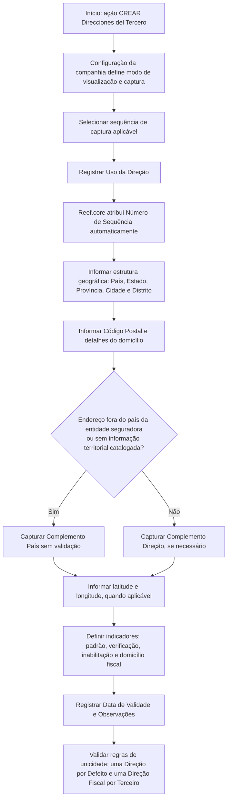

# Registro e Classificação de Direções de Terceiros no Reef.core

## 1. Metadados do Documento
- **Arquivo de Origem:** `Não identificado — texto bruto fornecido na solicitação`
- **Tipo de Documento:** Manual Operacional / Especificação Funcional
- **Domínio / Sistema:** Reef.core — cadastro de Direções do Terceiro
- **Público-Alvo:** Analistas funcionais, operadores de cadastro, desenvolvedores e equipes de qualidade de dados
- **Data/Versão Identificada:** Não identificada

---

## 2. Resumo Executivo & Contexto de Negócio

O documento descreve a ação **CREAR Direcciones del Tercero**, cujo objetivo é registrar e classificar os endereços associados a um Terceiro no sistema Reef.core. O cadastro de endereço contempla identificação de uso, estrutura geográfica, detalhes do domicílio, coordenadas geográficas, validação e condições de vigência operacional.

A captura dos dados pode seguir uma entre duas sequências, determinadas por uma configuração de parâmetro nas companhias. Essa configuração define o modo de visualização e de captura da informação. O conteúdo fornecido detalha a primeira sequência, organizada da esquerda para a direita e de cima para baixo.

Os atributos de endereço podem ser empregados tanto para **Pessoas Físicas** quanto para **Pessoas Jurídicas**, quando os campos não forem especificados ou explicitamente restringidos. A estrutura geográfica é hierárquica e utiliza cinco níveis: País, Estado, Província, Cidade e Distrito, cada qual associado aos catálogos existentes no sistema.

O processo também suporta informações de endereço não disponíveis nos catálogos territoriais, por meio do campo **Complemento País**. Esse mecanismo é relevante para endereços localizados fora do país da entidade seguradora, permitindo registrar dados sem validação territorial. Entretanto, o uso de Complemento País é mutuamente exclusivo com a captura de Complemento Direção.

O documento estabelece regras de unicidade para endereço padrão e domicílio fiscal: para um Terceiro com múltiplos endereços, somente uma Direção por Defeito e somente uma Direção Fiscal podem ser identificadas. Também são fornecidos campos para qualidade de dados, inabilitação, validade, coordenadas geográficas e observações.

---

## 3. Arquitetura, Componentes & Tecnologias Envolvidas

### Componentes e conceitos identificados

| Componente / Conceito | Função no contexto |
| :--- | :--- |
| **Reef.core** | Sistema que registra dados de Direções do Terceiro e atribui automaticamente o Número de Sequência. |
| **Terceiro** | Entidade à qual uma ou mais Direções são associadas. O documento menciona Pessoas Físicas e Pessoas Jurídicas. |
| **Configuração de companhias** | Configuração de parâmetro que determina o modo de visualização e captura da informação de endereço. |
| **Catálogo de países** | Fonte de valores possíveis para o primeiro nível da estrutura geográfica: País. |
| **Catálogo de estados** | Fonte de valores possíveis para o segundo nível geográfico: Estado. |
| **Catálogo de províncias** | Fonte de valores possíveis para o terceiro nível geográfico: Província. |
| **Catálogo de localidades** | Fonte de valores possíveis para o quarto nível geográfico: Cidade. |
| **Catálogo de distritos** | Fonte de valores possíveis para o quinto nível geográfico: Distrito. |
| **Classificação corporativa de tipos** | Referência para classificar o Tipo de Domicílio ou Tipo de Via. |
| **Entidade seguradora** | Entidade que efetua codificação local para Uso da Direção e possui país de referência para o comportamento de Complemento País. |

### Fluxo funcional de cadastro



> **Nota de Análise:** O documento menciona duas sequências possíveis de captura, mas detalha apenas a primeira sequência. Não há detalhamento adicional da segunda sequência, nem especificação de interfaces, métodos HTTP, contratos JSON, persistência física ou integrações externas.

---

## 4. Regras de Negócio, Especificações Funcionais & Processos

### 4.1 Objetivo da ação

A ação **CREAR Direcciones del Tercero** possui como propósito registrar e classificar as Direções do Terceiro.

### 4.2 Sequência de captura

1. A captura de dados pode seguir uma entre duas sequências.
2. A configuração de parâmetro nas companhias informa ao sistema o modo de visualização e captura das informações.
3. A primeira sequência é descrita como uma ordenação da esquerda para a direita e de cima para baixo.
4. Quando os campos não forem especificados ou indicados expressamente, podem ser utilizados tanto no cadastro de Pessoas Físicas quanto no de Pessoas Jurídicas.

### 4.3 Estrutura geográfica

A Direção do Terceiro pode ser posicionada em uma estrutura geográfica de cinco níveis:

1. **País:** primeiro nível geográfico, com código proveniente do catálogo de países.
2. **Estado:** segundo nível geográfico, com código proveniente do catálogo de estados.
3. **Província:** terceiro nível geográfico, com código proveniente do catálogo de províncias.
4. **Cidade:** quarto nível geográfico, com código proveniente do catálogo de localidades.
5. **Distrito:** quinto nível geográfico, com código proveniente do catálogo de distritos.

O **Código Postal** identifica o código postal associado aos cinco níveis da estrutura geográfica em que a Direção do Terceiro está localizada.

### 4.4 Classificação e detalhamento da Direção

- **Uso da Direção:** associa uma finalidade à Direção do Terceiro segundo codificação local da entidade seguradora, destinada ao uso em processos internos.
- **Tipo de Domicílio:** associa o Tipo de Via à Direção do Terceiro conforme classificação corporativa de tipos.
- **Direção:** armazena o detalhamento do endereço segundo o callejero e usos locais, incluindo, conforme necessário, Cerrada, Urbanização, Bloco, Escada e Apartamento.
- **Número:** armazena o número da Direção do Terceiro.
- **Complemento Direção:** permite registrar informações adicionais, como Urbanização, ponto quilométrico ou piso do edifício em uma Direção Comercial.

### 4.5 Tratamento de endereços fora dos catálogos territoriais

Quando a Direção estiver fora do país da entidade seguradora, a informação territorial correspondente pode não existir nos catálogos da estrutura territorial.

Nessa situação, o campo **Complemento País** permite registrar os dados de endereço **sem realizar qualquer validação**.

#### Regra de exclusividade

A captura no campo **Complemento Direção** é excludente da captura no campo **Complemento País**. Portanto, os dois campos não devem ser capturados simultaneamente para a mesma Direção do Terceiro.

### 4.6 Coordenadas geográficas

O documento define latitude e longitude como coordenadas geográficas angulares que permitem localizar um ponto na superfície da Terra.

- O Sistema de Coordenadas Geográficas possui como centro imaginário o centro da Terra.
- Os valores podem ser expressos em graus, minutos e segundos.
- A notação é acompanhada por uma indicação cardinal: Norte, Sul, Este ou Oeste.
- A latitude é apresentada antes da longitude.
- O documento cita como exemplo: `(66° 33’ 9’’ N; 11° 04’ 13’’ E)`.
- A letra `W` pode ser utilizada em vez de `O` para Oeste, pois `W` corresponde ao termo inglês *West*.
- A latitude é simbolizada pela letra grega `ϕ`.
- A longitude é simbolizada pela letra grega `λ`.

O atributo **Latitud** deve conter graus, minutos e segundos que identifiquem a latitude da Direção do Terceiro. No exemplo apresentado, o valor é `66° 33’ 9’’ N`.

O atributo **Longitud** deve conter graus, minutos e segundos que identifiquem a longitude da Direção do Terceiro. No exemplo apresentado, o valor é `11° 04’ 13’’ E`.

### 4.7 Regras de endereços múltiplos

#### Direção por Defeito

- Aplica-se a Terceiros com mais de uma Direção associada.
- Indica qual Direção é a Direção por Defeito do Terceiro.
- Somente uma Direção por Defeito pode ser identificada como tal para o mesmo Terceiro.

#### Domicílio Fiscal

- Aplica-se a Terceiros com mais de uma Direção associada.
- Indica qual Direção corresponde à Direção Fiscal do Terceiro.
- Somente uma única Direção Fiscal pode ser identificada como tal para o mesmo Terceiro.

### 4.8 Qualidade, disponibilidade e validade

- **Marca de Comprobación:** permite que os processos da entidade considerem se a Direção do Terceiro foi revisada e verificada, em relação à qualidade dos dados do sistema.
- **Inhabilitación:** informa ao sistema que a Direção associada ao Terceiro está inabilitada e, portanto, não deve ser utilizada, considerada ou empregada nos processos operacionais da entidade.
- **Fecha de Validez:** informa a data de validade da Direção do Terceiro.
- **Observaciones:** permite armazenar texto descritivo com informações complementares sobre a Direção do Terceiro.

---

## 5. Tabelas de Parâmetros, Ambientes e Estruturas de Dados

| Item / Parâmetro | Descrição / Função | Tipo / Valores / Formato | Ambiente / Observações |
| :--- | :--- | :--- | :--- |
| Ação `CREAR` | Registra e classifica Direções do Terceiro. | Ação funcional. | Associada ao cadastro de Direções. |
| Uso da Direção | Define o uso associado à Direção do Terceiro. | Codificação local da entidade seguradora. | Destinada aos processos internos da entidade. |
| Sequência / Ordem | Número de sequência na captura das Direções do Terceiro. | Valor atribuído automaticamente. | Atribuído pelo Reef.core. |
| País | Código do primeiro nível da estrutura geográfica. | Código do catálogo de países. | Localização da Direção do Terceiro. |
| Estado | Código do segundo nível da estrutura geográfica. | Código do catálogo de estados. | Localização da Direção do Terceiro. |
| Província | Código do terceiro nível da estrutura geográfica. | Código do catálogo de províncias. | Localização da Direção do Terceiro. |
| Cidade | Código do quarto nível da estrutura geográfica. | Código do catálogo de localidades. | Localização da Direção do Terceiro. |
| Distrito | Código do quinto nível da estrutura geográfica. | Código do catálogo de distritos. | Localização da Direção do Terceiro. |
| Código Postal | Identifica o código postal associado aos cinco níveis geográficos. | Chave de Código Postal. | Associado à estrutura geográfica da Direção. |
| Tipo de Domicílio | Define o Tipo de Via associado à Direção. | Classificação corporativa de tipos. | Também referido como classificação de tipos corporativa. |
| Direção | Armazena o detalhamento do endereço. | Texto de endereço conforme callejero e usos locais. | Pode incluir Cerrada, Urbanização, Bloco, Escada e Apartamento. |
| Número | Armazena o número da Direção do Terceiro. | Não especificado. | Não há formato detalhado no documento. |
| Complemento Direção | Armazena informação complementar da Direção. | Texto complementar. | Pode indicar Urbanização, ponto quilométrico ou piso em Direção Comercial. |
| Complemento País | Permite capturar endereço sem validação territorial. | Texto não validado. | Aplicável quando não há informação nos catálogos territoriais, especialmente fora do país da entidade seguradora. |
| Regra Complemento Direção / Complemento País | Impede uso simultâneo dos dois campos. | Regra de exclusividade. | A captura de Complemento Direção exclui a captura de Complemento País. |
| Latitude | Identifica a latitude da Direção do Terceiro. | Graus, minutos, segundos e indicação cardinal. | Exemplo: `66° 33’ 9’’ N`; latitude representada por `ϕ`. |
| Longitude | Identifica a longitude da Direção do Terceiro. | Graus, minutos, segundos e indicação cardinal. | Exemplo: `11° 04’ 13’’ E`; longitude representada por `λ`. |
| Direção por Defeito | Identifica o endereço padrão do Terceiro. | Indicador. | Somente uma Direção por Defeito por Terceiro. |
| Marca de Comprobación | Indica se a Direção foi revisada e verificada. | Indicador. | Relacionada à qualidade de dados nos processos da entidade. |
| Inhabilitación | Indica que a Direção está inabilitada. | Indicador. | A Direção não deve ser usada em processos operacionais. |
| Domicílio Fiscal | Identifica o endereço fiscal do Terceiro. | Indicador. | Somente uma Direção Fiscal por Terceiro. |
| Fecha de Validez | Indica a data de validade da Direção. | Data. | O formato de data não é especificado. |
| Observaciones | Armazena informação complementar sobre a Direção. | Texto descritivo. | Sem estrutura ou limite especificado. |
| Configuração de companhias | Define visualização e captura das informações. | Parâmetro de configuração. | O documento não detalha nome técnico, valores ou localização do parâmetro. |

---

## 6. Bateria de Perguntas & Respostas para RAG (FAQ Sintético)

### P1: Qual é o objetivo da ação CREAR Direcciones del Tercero no Reef.core?
**R:** A ação CREAR Direcciones del Tercero tem o objetivo de registrar e classificar as Direções associadas a um Terceiro no Reef.core. O cadastro contempla uso da Direção, estrutura geográfica, detalhes de domicílio, coordenadas, indicadores de qualidade, inabilitação, validade e observações.

### P2: Como é definido o modo de visualização e captura dos dados de endereço?
**R:** O modo de visualização e captura das informações é definido por uma configuração de parâmetro nas companhias. O documento informa que existem duas sequências possíveis de captura, mas detalha somente a primeira sequência, organizada da esquerda para a direita e de cima para baixo.

### P3: Os campos de Direção podem ser usados para Pessoas Físicas e Pessoas Jurídicas?
**R:** Sim. Quando não for especificado ou expressamente indicado o contrário, os campos podem ser utilizados tanto para o registro de informações de Pessoas Físicas quanto para o registro de informações de Pessoas Jurídicas.

### P4: Quais são os níveis geográficos utilizados no cadastro de Direção do Terceiro?
**R:** A estrutura geográfica possui cinco níveis: País, Estado, Província, Cidade e Distrito. Cada nível utiliza um código conforme os valores existentes nos respectivos catálogos do sistema: países, estados, províncias, localidades e distritos.

### P5: Como o sistema trata uma Direção localizada fora do país da entidade seguradora?
**R:** Quando a Direção não estiver no país da entidade seguradora e não houver informação correspondente nos catálogos da estrutura territorial, o campo Complemento País permite capturar os dados da Direção sem realizar validação alguma.

### P6: É permitido preencher Complemento Direção e Complemento País para a mesma Direção?
**R:** Não. A captura de informações no campo Complemento Direção é excludente da captura no campo Complemento País. Portanto, os dois campos não devem ser preenchidos simultaneamente para a mesma Direção do Terceiro.

### P7: Quem atribui o Número de Sequência da captura de Direções?
**R:** O Número de Sequência na captura de Direções do Terceiro é atribuído automaticamente pelo Reef.core.

### P8: Qual regra deve ser aplicada à Direção por Defeito de um Terceiro?
**R:** Para um Terceiro que possui mais de uma Direção associada, a Direção por Defeito identifica o endereço padrão. Somente uma Direção por Defeito pode ser identificada como tal para o mesmo Terceiro.

### P9: Quantas Direções Fiscais um Terceiro pode possuir?
**R:** Um Terceiro pode ter somente uma única Direção Fiscal identificada como tal, mesmo quando possui mais de uma Direção associada.

### P10: Qual é a finalidade da Marca de Comprobación?
**R:** A Marca de Comprobación permite que os processos da entidade considerem se a Direção do Terceiro foi revisada e verificada. Esse indicador está relacionado à qualidade dos dados mantidos no sistema.

### P11: O que significa a Inhabilitación de uma Direção?
**R:** A Inhabilitación informa ao sistema que a Direção associada ao Terceiro está inabilitada. Como consequência, a Direção não deve ser empregada, considerada ou utilizada nos processos operacionais da entidade.

### P12: Em que formato latitude e longitude devem ser armazenadas?
**R:** Latitude e longitude devem conter a informação de graus, minutos e segundos, acompanhada da indicação cardinal aplicável. O documento apresenta como exemplo a latitude `66° 33’ 9’’ N` e a longitude `11° 04’ 13’’ E`.

---

## 7. Glossário de Termos, Siglas & Conceitos-Chave

- **Reef.core:** Sistema mencionado como responsável por atribuir automaticamente o Número de Sequência da captura de Direções do Terceiro.
- **Terceiro:** Entidade à qual as Direções são associadas; o documento contempla Pessoas Físicas e Pessoas Jurídicas.
- **Direção por Defeito:** Direção padrão do Terceiro quando há mais de uma Direção associada.
- **Domicílio Fiscal:** Direção identificada como endereço fiscal do Terceiro.
- **Uso da Direção:** Finalidade associada à Direção conforme codificação local da entidade seguradora.
- **Tipo de Domicílio:** Tipo de Via associado à Direção de acordo com classificação corporativa.
- **Callejero:** Referência utilizada para detalhar a Direção segundo ruas e usos locais.
- **Complemento Direção:** Informação adicional de endereço, como Urbanização, ponto quilométrico ou piso.
- **Complemento País:** Campo para captura de endereço sem validação territorial quando dados não existem nos catálogos.
- **Marca de Comprobación:** Indicador de que a Direção foi revisada e verificada.
- **Inhabilitación:** Indicador de que a Direção não deve ser utilizada nos processos operacionais.
- **Latitude (`ϕ`):** Ângulo que determina a distância entre um ponto e o Equador.
- **Longitude (`λ`):** Ângulo que determina a distância entre um ponto e o Meridiano de Greenwich.
- **Meridiano de Greenwich:** Meridiano 0 que divide as regiões ocidental e oriental e serve de referência para longitude.
- **W:** Letra que pode ser usada para Oeste, derivada do termo inglês *West*.

---

## 8. Notas Críticas, Riscos & Limitações

- O texto informa que existem duas sequências de captura, mas somente a primeira é descrita. A segunda sequência não possui detalhamento no conteúdo fornecido.
- Não são informados os nomes técnicos dos parâmetros de configuração das companhias, seus valores possíveis, sua localização no sistema ou critérios de seleção de cada sequência.
- Não há especificação de tipos técnicos, tamanhos máximos, obrigatoriedade, máscaras de entrada, mensagens de erro ou validações de formato para os atributos.
- O documento não define o comportamento do sistema para conflitos entre Direção por Defeito, Domicílio Fiscal, Inhabilitación e Fecha de Validez.
- Complemento País permite captura sem validação, o que pode ampliar risco de inconsistência e baixa padronização de dados territoriais.
- A exclusividade entre Complemento Direção e Complemento País é uma regra crítica de validação que deve ser preservada por interfaces, processos e integrações.
- Os campos Latitude e Longitude são descritos conceitualmente, mas o documento não apresenta regras de validação, convenção de persistência ou tratamento de coordenadas inválidas.
- Não são detalhados serviços, APIs, métodos HTTP, contratos de integração, mecanismos de autenticação, trilhas de auditoria ou processos de aprovação.

---

## 9. Conteúdo Bruto Estruturado (Referência Fiel)

```text
--- [PÁGINA 1 DE 6] ---

CREAR Direcciones del Tercero
Objetivo
El propósito de esta acción no es otro que Registrar y Clasificar las Direcciones del Tercero.
Posibles Acciones
 CREAR ( )
Direcciones
La captura de los Datos puede seguir una de las dos siguientes secuencias ...
 / 
 RS
Inicio Soluciones APIs Documentación Zeus
ES


--- [PÁGINA 2 DE 6] ---

... De acuerdo con la configuración del parámetro en la configuración de las compañías que le indica
al Sistema el modo de visualización y captura de la información.
Atendiendo a la primera de las dos secuencias, de izquierda a derecha y de arriba hacia abajo, los
siguientes atributos marcan la secuencia de captura de la información.
Si no se especifica o indica expresamente los campos se emplearán indistintamente tanto en el
registro de información de las Personas Físicas como para las Personas Jurídicas.
Uso de la Dirección (  )
Este dato contendrá el uso que se va a asociar a la Dirección del Tercero de acuerdo con la
codificación efectuada localmente por parte de la entidad aseguradora para su posterior uso en los
procesos internos de la entidad.
Secuencia/Orden
Este dato contiene el Número de Secuencia en la Captura de las Direcciones del Tercero. Es un valor
que se asigna en Reef.core automáticamente.
País (  )
Este Campo contiene el código del primer nivel de la estructura Geográfica en la que se encuentra
ubicada la Dirección del Tercero de acuerdo con la relación de posibles valores existentes en el
Ejemplo:


--- [PÁGINA 3 DE 6] ---

catálogo de países existente en el Sistema.
Estado (  )
Este Campo contiene el código del segundo nivel de la estructura Geográfica en la que se encuentra
ubicada la Dirección del Tercero de acuerdo con la relación de posibles valores existentes en el
catálogo de estados existente en el Sistema.
Provincia (  )
Este Campo contiene el código del tercer nivel de la estructura Geográfica en la que se encuentra
ubicada la Dirección del Tercero de acuerdo con la relación de posibles valores existentes en el
catálogo de provincias existente en el Sistema.
Ciudad (  )
Este Campo contiene el código del cuarto nivel de la estructura Geográfica en la que se encuentra
ubicada la Dirección del Tercero de acuerdo con la relación de posibles valores existentes en el
catálogo de localidades existente en el Sistema.
Distrito (  )
Este Campo contiene el código del quinto nivel de la estructura Geográfica en la que se encuentra
ubicada la Dirección del Tercero de acuerdo con la relación de posibles valores existentes en el
catálogo de distritos existente en el Sistema.
Código Postal (  )
Esta Propiedad contiene la clave que identifica el Código Postal asociado a los cinco niveles de la
estructura geográfica en la que está ubicada la Dirección del Tercero.
Tipo de Domicilio (  )
Este dato contendrá el Tipo de Vía que se va a asociar a la Dirección del Tercero de acuerdo con la
clasificación de tipos corporativa.
Dirección ( )
Este Campo contiene la Dirección detallada de acuerdo con el Callejero y los usos locales (Indicación
o no de la Cerrada, Urbanización, Bloque, Escalera, Apartamento,...)
Número ( )
Ejemplo:


--- [PÁGINA 4 DE 6] ---

Este Atributo contiene el número de la Dirección del Tercero.
Complemento Dirección ( )
Este Campo permite capturar información complementaria de la Dirección del Tercero como por
ejemplo:
1. Para indicar la Urbanización del Domicilio.
2. Para indicar algún punto kilométrico que facilite la ubicación del Domicilio.
3. Para indicar la Planta del Edificio en la que se encuentra la ubicación del Tercero en una
Dirección tipificada como Dirección Comercial,
Complemento País ( )
Si la dirección que se está capturando en el sistema no es del país de la entidad aseguradora es
posible que no se tenga en los catálogos de la estructura territorial la información correspondiente,
por lo cual este campo permite capturar 'sin realizar validación alguna' los datos de la dirección.
La captura de información en el Campo Complemento Dirección es excluyente de la captura de
información del Campo Complemento País
Latitud ( )
CONTEXTO.
La latitud y la longitud son los dos tipos de coordenadas geográficas angulares que conforman el
sistema de referencia planetario y que permiten ubicar un punto cualquiera en la superficie del
planeta Tierra.
El sistema de coordenadas que componen la latitud y longitud, conocido como Sistema de
Coordenadas Geográficas, tiene como centro imaginario el centro de la Tierra y expresa sus valores
en grados, minutos y segundos, acompañados de una letra que indica la orientación cardinal dentro
del globo: Norte, Sur, Este u Oeste. Esta información suele anotarse entre paréntesis y se escriben
primero los datos de la latitud y luego los de la longitud.
Por ejemplo: Coordenadas del punto X: (66° 33’ 9’’ N; 11° 04’ 13’’ E)
Es decir, el punto X está a 66 grados, 33 minutos, 9 segundos latitud norte, 11 grados, 4 minutos, 13
segundos longitud este. Es posible encontrar en algunos casos la letra W en vez de O para oeste, ya
que se trata del término en inglés (West).
Latitud. Es el ángulo imaginario que determina la distancia entre un punto cualquiera y el ecuador (la
línea imaginaria horizontal que divide al mundo en dos hemisferios: Norte y Sur). En otras palabras,
se trata de qué tan lejos o tan cerca está un punto de la referencia del ecuador y de los trópicos que


--- [PÁGINA 5 DE 6] ---

le son paralelos: el trópico de Cáncer y el de Capricornio. La latitud se simboliza con la letra griega
phi, ϕ.
Longitud. Es el ángulo imaginario que determina la distancia entre un punto y el meridiano de
Greenwich o meridiano 0, que atraviesa la localidad del mismo nombre en Inglaterra. Dicho
meridiano es vertical y divide al mundo en dos regiones, la occidental (Oeste) y la oriental (Este), y
sirve para trazar los demás meridianos que cruzan imaginariamente el globo de manera paralela al
meridiano de Greenwich. La longitud se simboliza con la letra griega lambda, λ.
Este Atributo de la dirección del Tercero tiene que contener la información correspondiente a los
grados, minutos y segundos que identifiquen su latitud, ... en nuestro ejemplo 66° 33’ 9’’ N
Longitud ( )
Este Atributo de la Dirección del Tercero debe contener la información correspondiente a los grados,
minutos y segundos que identifican su longitud, ... con los datos del ejemplo anterior 11° 04’ 13’’ E
Dirección por Defecto ( )
Este Campo, en aquellos Terceros que tienen más de una dirección asociada, indicará cual de ellas
es la Dirección por Defecto del Tercero. Solamente puede haber una Dirección por Defecto
identificada como tal.
Marca de Comprobación ( )
Esta propiedad permite considerar en los procesos de la entidad si la Dirección del Tercero ha sido o
no revisada y verificada, todo ello en relación con la calidad de los datos en el sistema.
Inhabilitación ( )
Esta propiedad le indica al Sistema que la Dirección asociada al Tercero está inhabilitada, por lo que
no debería ser empleada, contemplada o utilizada en los procesos operativos de la entidad.
Domicilio Fiscal ( )
Este Campo, en aquellos Terceros que tienen más de una dirección asociada, indicará cual de ellas
es la Dirección Fiscal del Tercero.
Solamente puede haber una única Dirección Fiscal identificada como tal.
Fecha de Validez ( )
Esta propiedad indicará la Fecha de Validez de la Dirección del Tercero.
Observaciones ( )


--- [PÁGINA 6 DE 6] ---

Este Campo permite capturar un texto descriptivo con información complementaria sobre la Dirección
del Tercero.
```
