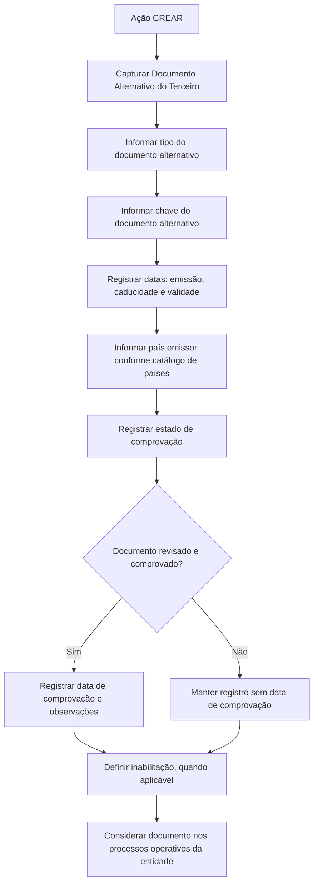

# Procedimento de Criação de Documentos Alternativos do Terceiro

## 1. Metadados do Documento
- **Arquivo de Origem:** Não identificado no conteúdo fornecido
- **Tipo de Documento:** Procedimento / Especificação Funcional
- **Domínio / Sistema:** Gestão de Terceiros — Documentos Alternativos
- **Público-Alvo:** Analistas funcionais, operação, negócio e desenvolvedores
- **Data/Versão Identificada:** Não identificada

---

## 2. Resumo Executivo & Contexto de Negócio

O documento descreve a ação **CREAR** para captura de **Documentos Alternativos do Terceiro**. O objetivo funcional declarado é facilitar a identificação de um Terceiro usando documentos alternativos ao documento considerado principal.

A especificação apresenta uma sequência de atributos para registrar informações do documento alternativo. O conteúdo indica que, salvo indicação expressa em contrário, os campos podem ser empregados tanto para **Pessoas Físicas** quanto para **Pessoas Jurídicas**.

Os dados de identificação incluem tipo, chave, datas de emissão, caducidade e validade, além do país emissor. O documento também inclui atributos voltados à qualidade e ao controle da informação, como marca de comprovação, data de comprovação e observações.

O processo contempla ainda a possibilidade de inabilitar um documento alternativo. Quando o campo de inabilitação é marcado, o Sistema deve considerar que o documento alternativo do Terceiro está inabilitado nos processos operativos da entidade.

> **Nota de Análise:** O conteúdo fornecido não detalha telas, métodos HTTP, contratos de integração, persistência de dados, permissões, obrigatoriedade de campos ou regras de validação de formato.

---

## 3. Arquitetura, Componentes & Tecnologias Envolvidas

O conteúdo não descreve arquitetura técnica, microsserviços, tecnologias, APIs, banco de dados, ambientes ou integrações. A estrutura funcional identificada é composta pelos elementos abaixo:

- **Ação CREAR:** ação para criação/captura de documentos alternativos.
- **Terceiro:** entidade que será identificada por documento alternativo.
- **Documento Principal:** documento de referência em relação ao qual o documento alternativo é utilizado.
- **Documento Alternativo:** documento usado para identificação alternativa do Terceiro.
- **Catálogo de Países do Sistema:** relação de valores utilizada pelo campo País Emissor.
- **Processos Operativos da Entidade:** processos que devem considerar a inabilitação do documento alternativo.
- **Pessoas Físicas e Pessoas Jurídicas:** categorias para as quais os campos são aplicáveis, exceto quando houver indicação expressa diferente.



> **Nota de Análise:** O diagrama representa exclusivamente o fluxo funcional inferível a partir dos atributos descritos. O documento não define componentes técnicos responsáveis por cada etapa.

---

## 4. Regras de Negócio, Especificações Funcionais & Processos

### 4.1 Objetivo da ação de captura

A ação de captura de Documentos Alternativos do Terceiro possui o propósito de facilitar a identificação do Terceiro mediante documentos alternativos ao documento principal.

### 4.2 Ação disponível

A ação indicada no documento é:

- **CREAR:** criação de Documentos Alternativos.

### 4.3 Aplicabilidade para tipos de Terceiro

Quando os campos não forem especificados ou expressamente indicados de forma diferente, os campos devem ser utilizados indistintamente no registro de informações de:

- Pessoas Físicas.
- Pessoas Jurídicas.

### 4.4 Sequência de captura de informações

O documento informa que os atributos apresentados, da esquerda para a direita e de cima para baixo, representam a sequência de captura das informações. Os atributos identificados são:

1. Tipo Documento Alternativo.
2. Clave del Documento Alternativo.
3. Fecha de Emisión.
4. Fecha de Caducidad.
5. País Emisor.
6. Marca de Comprobación.
7. Fecha de Comprobación.
8. Observaciones.
9. Fecha de Validez.
10. Inhabilitación.

### 4.5 Regras por atributo

#### Tipo Documento Alternativo

O atributo contém o documento alternativo pelo qual o Terceiro será identificado alternativamente, de acordo com os tipos de documentos existentes.

#### Chave do Documento Alternativo

O campo contém a chave do documento alternativo do Terceiro.

#### Data de Emissão

A propriedade indica a data de emissão do Documento Alternativo do Terceiro.

#### Data de Caducidade

O dado indica a data de caducidade do Documento Alternativo do Terceiro.

#### País Emissor

O campo contém o código do país emissor do documento alternativo do Terceiro. Os valores devem obedecer à relação de valores existente no catálogo de países do Sistema.

#### Marca de Comprovação

A propriedade permite que os processos da entidade considerem se o documento alternativo foi ou não revisado e verificado. Essa informação está relacionada à qualidade dos dados existentes no Sistema.

#### Data de Comprovação

Quando o estado da Marca de Comprovação implicar que o documento alternativo foi revisado e comprovado, o campo contém a data em que essa ação foi realizada.

#### Observações

Quando o documento alternativo tiver sido revisado e validado, o dado permite inserir texto aclaratório ou observações sobre o fato da comprovação.

#### Data de Validade

A propriedade informa ao Sistema a data a partir da qual o Documento Alternativo do Terceiro estará plenamente operativo no Sistema. O uso correto do atributo permite manter um histórico das alterações efetuadas nas informações do documento.

#### Inabilitação

A marcação desse campo informa ao Sistema que o documento alternativo do Terceiro está inabilitado. Essa condição deve ser empregada, considerada ou utilizada nos processos operativos da entidade.

---

## 5. Tabelas de Parâmetros, Ambientes e Estruturas de Dados

| Item / Parâmetro | Descrição / Função | Tipo / Valores / Formato | Ambiente / Observações |
| :--- | :--- | :--- | :--- |
| Ação | Permite criar Documentos Alternativos do Terceiro. | `CREAR` | Única ação explicitamente apresentada. |
| Terceiro | Entidade identificada mediante documento alternativo. | Pessoa Física ou Pessoa Jurídica | Os campos se aplicam indistintamente, salvo indicação expressa. |
| Documento Principal | Documento usado como referência para a identificação principal do Terceiro. | Não detalhado | O documento alternativo é complementar ou alternativo ao documento principal. |
| Tipo Documento Alternativo | Define o documento pelo qual o Terceiro será identificado alternativamente. | Tipos de documentos existentes | Não há catálogo, códigos ou valores enumerados no conteúdo. |
| Chave do Documento Alternativo | Registra a chave do documento alternativo do Terceiro. | Não detalhado | O documento não informa formato, tamanho ou obrigatoriedade. |
| Data de Emissão | Indica a data de emissão do Documento Alternativo do Terceiro. | Data | Formato não detalhado. |
| Data de Caducidade | Indica a data de caducidade do Documento Alternativo do Terceiro. | Data | Formato não detalhado. |
| País Emissor | Registra o código do país emissor do documento alternativo. | Código pertencente ao catálogo de países do Sistema | O catálogo de países é mencionado, mas seus valores não são fornecidos. |
| Marca de Comprovação | Indica se o documento alternativo foi revisado e verificado. | Estado de comprovação; valores não detalhados | Relacionada à qualidade dos dados no Sistema. |
| Data de Comprovação | Registra a data da revisão e comprovação do documento alternativo. | Data | Aplicável quando a Marca de Comprovação indicar que o documento foi revisado e comprovado. |
| Observações | Permite registrar texto aclaratório ou observações sobre a comprovação. | Texto | Aplicável quando o documento tiver sido revisado e validado. |
| Data de Validade | Define a data a partir da qual o documento alternativo estará plenamente operativo no Sistema. | Data | Apoia a manutenção de histórico de alterações. |
| Inabilitação | Indica que o documento alternativo do Terceiro está inabilitado. | Campo de marcação; valores não detalhados | Deve ser considerado nos processos operativos da entidade. |
| Catálogo de Países | Fonte de valores para País Emissor. | Relação de possíveis valores existente no Sistema | Não são fornecidos nomes, códigos ou versão do catálogo. |
| Processos Operativos da Entidade | Processos que devem considerar a condição de inabilitação do documento alternativo. | Não detalhado | Nenhum processo específico é identificado. |

---

## 6. Bateria de Perguntas & Respostas para RAG (FAQ Sintético)

### P1: Qual é o objetivo da ação de criação de Documentos Alternativos do Terceiro?
**R:** O objetivo da ação de captura de Documentos Alternativos do Terceiro é facilitar a identificação do Terceiro por meio de documentos alternativos ao documento principal.

### P2: A funcionalidade de Documentos Alternativos pode ser usada para Pessoas Físicas e Pessoas Jurídicas?
**R:** Sim. Quando os campos não forem especificados ou indicados expressamente de forma diferente, eles podem ser empregados indistintamente no registro de informações de Pessoas Físicas e Pessoas Jurídicas.

### P3: Qual ação é apresentada para o gerenciamento de Documentos Alternativos?
**R:** O documento apresenta a ação **CREAR**, destinada à criação de Documentos Alternativos do Terceiro.

### P4: O que deve ser informado no campo Tipo Documento Alternativo?
**R:** O campo Tipo Documento Alternativo contém o documento pelo qual o Terceiro será identificado alternativamente, considerando os tipos de documentos existentes.

### P5: Para que serve a Chave do Documento Alternativo?
**R:** A Chave do Documento Alternativo é o campo que contém a chave associada ao documento alternativo do Terceiro. O documento não especifica o formato, tamanho ou regra de unicidade dessa chave.

### P6: Como deve ser preenchido o País Emissor de um documento alternativo?
**R:** O País Emissor deve conter o código do país emissor do documento alternativo do Terceiro, utilizando a relação de valores disponível no catálogo de países existente no Sistema.

### P7: Quando a Data de Comprovação deve ser utilizada?
**R:** A Data de Comprovação deve conter a data em que a revisão e a comprovação ocorreram quando o estado da Marca de Comprovação indicar que o documento alternativo foi revisado e comprovado.

### P8: Qual é a finalidade da Marca de Comprovação?
**R:** A Marca de Comprovação permite que os processos da entidade considerem se o documento alternativo foi revisado e verificado, em relação à qualidade dos dados registrados no Sistema.

### P9: Quando o campo Observações pode receber conteúdo?
**R:** O campo Observações pode receber texto aclaratório ou observações sobre a comprovação quando o documento alternativo tiver sido revisado e validado.

### P10: Qual é a função da Data de Validade no Documento Alternativo do Terceiro?
**R:** A Data de Validade informa ao Sistema a data a partir da qual o Documento Alternativo do Terceiro estará plenamente operativo. Seu uso correto permite manter um histórico das alterações efetuadas nas informações do documento.

### P11: O que significa marcar um Documento Alternativo como inabilitado?
**R:** Marcar a Inabilitação informa ao Sistema que o documento alternativo do Terceiro está inabilitado. Essa condição deve ser utilizada e considerada nos processos operativos da entidade.

### P12: O documento define APIs, métodos HTTP ou contratos JSON para a criação de Documentos Alternativos?
**R:** Não. O conteúdo fornecido descreve somente atributos e regras funcionais de captura. Não há detalhamento de APIs, métodos HTTP, contratos JSON, integrações, tecnologias ou mecanismos de persistência.

---

## 7. Glossário de Termos, Siglas & Conceitos-Chave

- **CREAR:** Ação apresentada para criação de Documentos Alternativos.
- **Terceiro:** Entidade que pode ser identificada por um Documento Alternativo.
- **Documento Principal:** Documento usado como referência principal para identificação do Terceiro.
- **Documento Alternativo:** Documento utilizado para identificar alternativamente o Terceiro.
- **Pessoa Física:** Categoria de Terceiro para a qual os campos podem ser utilizados, salvo indicação contrária.
- **Pessoa Jurídica:** Categoria de Terceiro para a qual os campos podem ser utilizados, salvo indicação contrária.
- **Marca de Comprovação:** Propriedade que indica se o documento alternativo foi revisado e verificado.
- **Data de Comprovação:** Data em que ocorreu a revisão e comprovação do documento alternativo.
- **Data de Validade:** Data a partir da qual o Documento Alternativo do Terceiro estará plenamente operativo no Sistema.
- **Inabilitação:** Condição que informa ao Sistema que um documento alternativo está inabilitado.
- **Catálogo de Países:** Relação de possíveis valores usada para registrar o código do país emissor.

---

## 8. Notas Críticas, Riscos & Limitações

- O arquivo de origem, a data, a versão e a autoria do documento não foram identificados no conteúdo fornecido.
- O conteúdo não especifica obrigatoriedade, formato, tamanho, domínio de valores ou regras de validação dos campos.
- O conteúdo não define quais valores podem ser assumidos pela Marca de Comprovação ou pela Inabilitação.
- O documento menciona um catálogo de países, mas não fornece os códigos, a fonte, a versão ou o mecanismo de manutenção desse catálogo.
- Não são descritos APIs, integrações, componentes técnicos, bancos de dados, autenticação, permissões, trilha de auditoria ou mecanismos de persistência.
- Não são identificados os processos operativos específicos que devem reagir à inabilitação de um Documento Alternativo.
- A regra de Data de Comprovação depende do estado da Marca de Comprovação, porém o documento não define o comportamento do Sistema se a data for preenchida sem que a marca indique revisão e comprovação.
- A regra de Observações está vinculada à revisão e validação do documento, mas não define se o campo é obrigatório nessa situação.

---

## 9. Conteúdo Bruto Estruturado (Referência Fiel)

```text
--- [PÁGINA 1 DE 3] ---

CREAR Documentos Alternativos del Tercero
Objetivo
El propósito de la acción de captura de los Documentos Alternativos del Tercero es facilitar la
identificación del Tercero con documentos 'alternativos' al documento 'principal'.
Posibles Acciones
 CREAR ( )
Documentos Alternativos
De izquierda a derecha y de arriba hacia abajo, los siguientes atributos marcan la secuencia de
captura de la información.
Si no se especifica o indica expresamente los Campos se emplearán indistintamente tanto en el
registro de información de las Personas Físicas como para las Personas Jurídicas.
Tipo Documento Alternativo (  )
 / 
 RS
Inicio Soluciones APIs Documentación Zeus
ES


--- [PÁGINA 2 DE 3] ---

Este Atributo del colapsador contiene el documento alternativo con el que se va a identificar
alternativamente al Tercero de acuerdo con los tipos de documentos existentes.
Clave del Documento Alternativo ( )
Este Campo del panel de información contiene la clave del documento alternativo del Tercero.
Fecha de Emisión ( )
Esta propiedad indicará la Fecha de Emisión del Documento Alternativo del Tercero.
Fecha de Caducidad ( )
Este Dato indicará la Fecha de Caducidad del Documento Alternativo del Tercero.
País Emisor (  )
Este Campo contiene el código del país emisor del documento alternativo del Tercero de acuerdo con
la relación de posibles valores existentes en el catálogo de países existente en el Sistema.
Marca de Comprobación ( )
Esta propiedad permite considerar en los procesos de la entidad si el documento alternativo ha sido o
no revisado y verificado, todo ello en relación con la calidad de los datos en el sistema.
Fecha de Comprobación ( )
En el supuesto que el estado de la marca de comprobación implique que el documento alternativo sí
ha sido revisado y comprobado, este campo contiene la fecha en la que esta acción se habrá
realizado.
Observaciones ( )
Caso que el documento alternativo haya sido revisado y validado, este Dato permite ingresar un texto
aclaratorio u observaciones al hecho de la comprobación.
Fecha de Validez ( )
Esta propiedad le indica al sistema la fecha a partir de la cual el Documento Alternativo del Tercero
estará plenamente operativo en el sistema por lo que su correcto uso permite tener un histórico de
los cambios efectuados en su información.
Inhabilitación ( )
El cotejo de este campo le indica al Sistema que el documento alternativo del Tercero está
inhabilitado, por lo que este supuesto debería ser empleado, considerado o utilizado en los


--- [PÁGINA 3 DE 3] ---

procesos operativos de la entidad.
```
