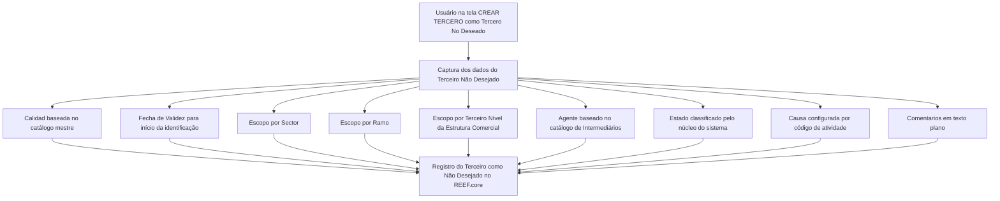

# Cadastro de Terceiro Não Desejado no REEF.core

## 1. Metadados do Documento
- **Arquivo de Origem:** Não identificado no conteúdo fornecido
- **Tipo de Documento:** Especificação Funcional
- **Domínio / Sistema:** REEF.core — gestão de Terceiro Não Desejado
- **Público-Alvo:** Analistas funcionais, operação e desenvolvedores
- **Data/Versão Identificada:** Não identificada

---

## 2. Resumo Executivo & Contexto de Negócio

O documento descreve a tela **“CREAR TERCERO como Tercero No Deseado”** do sistema REEF.core. A funcionalidade permite registrar um terceiro como não desejado, considerando o código de atividade e os valores dos atributos que identificam esse terceiro.

A ação habilitada explicitamente no documento é **CREAR**. O registro é composto por atributos que definem a classificação, a vigência e o escopo organizacional ou comercial no qual o terceiro deve ser considerado não desejado.

O modelo permite aplicar a classificação de forma abrangente ou segmentada. Para **Sector**, **Ramo** e **Tercer Nivel de la Estructura Comercial**, existem códigos genéricos que estendem a condição de terceiro não desejado a todos os valores existentes no respectivo nível.

A **Fecha de Validez** suporta o histórico de alterações da informação do terceiro, definindo a data a partir da qual o terceiro será identificado como não desejado. Os campos **Estado**, **Causa** e **Comentarios** complementam a justificativa e a classificação da inabilitação.

> **Nota de Análise:** O documento não especifica métodos HTTP, contratos JSON, persistência de dados, perfis de acesso, mensagens de erro, obrigatoriedade dos campos ou o significado detalhado dos valores de **Estado**.

---

## 3. Arquitetura, Componentes & Tecnologias Envolvidas

### Componentes e conceitos identificados

| Componente / Conceito | Papel descrito no documento |
| :--- | :--- |
| REEF.core | Sistema que disponibiliza a funcionalidade de registrar um terceiro como Terceiro Não Desejado. |
| Tela “CREAR TERCERO como Tercero No Deseado” | Interface funcional para criação do registro de Terceiro Não Desejado. |
| Ação CREAR | Ação habilitada para criar o registro. |
| Catálogo mestre do sistema | Fonte dos valores previamente codificados para o campo Calidad. |
| Estrutura de produtos | Fonte da codificação de Sector e Ramo técnico. |
| Estrutura Comercial | Fonte da relação de valores do Terceiro Nível da Estrutura Comercial. |
| Catálogo de Intermediários | Fonte dos possíveis valores para o campo Agente. |
| Núcleo do sistema | Origem da classificação de condições e situações do atributo Estado. |
| Códigos de causas de inabilitação | Fonte da causa ou motivo de inabilitação, configurada por código de atividade. |



---

## 4. Regras de Negócio, Especificações Funcionais & Processos

### Objetivo funcional
1. A tela permite registrar um terceiro como **Tercero No Deseado** no REEF.core.
2. O registro considera o **código de atividade** e os valores dos atributos que identificam o terceiro.
3. A ação habilitada na tela é **CREAR**.

### Sequência de captura
O documento estabelece que os atributos são apresentados na sequência de captura da informação, da esquerda para a direita e de cima para baixo.

### Regras por atributo

1. **Calidad**
   - Permite capturar o código de qualidade associado ao terceiro.
   - O código deve corresponder a valores previamente codificados no catálogo mestre do sistema.
   - A associação ocorre no momento do registro do terceiro como Terceiro Não Desejado.

2. **Fecha de Validez**
   - Define a data a partir da qual o terceiro será identificado como Terceiro Não Desejado.
   - O uso correto da data permite manter histórico das alterações realizadas nas informações do terceiro.

3. **Sector**
   - Deve conter o código do setor conforme a estrutura de produtos configurada no sistema.
   - O código genérico **9999** marca o terceiro como não desejado para todos os setores existentes.
   - Um código de setor específico marca o terceiro como não desejado apenas para as operações daquele setor.
   - O sistema suporta o registro de terceiro não desejado para um único setor entre os setores existentes.

4. **Ramo**
   - Deve conter o código do ramo técnico conforme a estrutura de produtos definida no sistema.
   - O código genérico **999** marca o terceiro como não desejado para todos os ramos existentes.
   - Um código de ramo técnico específico marca o terceiro como não desejado somente para aquele ramo.

5. **Tercer Nivel de la Estructura Comercial**
   - Deve conter o código do terceiro nível da Estrutura Comercial, conforme a relação de valores configurada no sistema.
   - O código genérico **9999** marca o terceiro como não desejado para todas as oficinas existentes.
   - Um código de oficina específico marca o terceiro como não desejado apenas para aquela oficina.

6. **Agente**
   - Registra o código do agente para o qual o terceiro será considerado não desejado.
   - Os possíveis valores são configurados no catálogo de Intermediários do sistema.

7. **Estado**
   - Contém a classificação fornecida pelo núcleo do sistema.
   - A classificação representa possíveis condições e situações que identificam o terceiro como Terceiro Não Desejado.

8. **Causa**
   - Contém a causa ou motivo pelo qual o terceiro está sendo inabilitado.
   - Os códigos de causa ou motivo de inabilitação são configurados no sistema por código de atividade.

9. **Comentarios**
   - Permite inserir texto plano para ampliar ou detalhar o motivo pelo qual o terceiro é considerado uma pessoa física ou jurídica indesejável.

---

## 5. Tabelas de Parâmetros, Ambientes e Estruturas de Dados

| Item / Parâmetro | Descrição / Função | Tipo / Valores / Formato | Ambiente / Observações |
| :--- | :--- | :--- | :--- |
| CREAR | Ação habilitada para registrar o terceiro como não desejado. | Ação funcional | REEF.core |
| Calidad | Código de qualidade associado ao terceiro. | Código previamente codificado | Valores provenientes do catálogo mestre do sistema. |
| Fecha de Validez | Data a partir da qual o terceiro será identificado como não desejado. | Data | Permite histórico das alterações da informação do terceiro. |
| Sector | Código do setor conforme a estrutura de produtos. | Código de setor; código genérico `9999` | `9999` aplica a marcação a todos os setores; código específico restringe a marcação às operações do setor informado. |
| Ramo | Código do ramo técnico conforme a estrutura de produtos. | Código de ramo técnico; código genérico `999` | `999` aplica a marcação a todos os ramos; código específico restringe a marcação ao ramo informado. |
| Tercer Nivel de la Estructura Comercial | Código do terceiro nível da Estrutura Comercial. | Código de escritório; código genérico `9999` | `9999` aplica a marcação a todas as oficinas; código específico restringe a marcação à oficina informada. |
| Agente | Código do agente para o qual o terceiro é considerado não desejado. | Código de agente | Valores configurados no catálogo de Intermediários. |
| Estado | Classificação das condições e situações do terceiro não desejado. | Classificação fornecida pelo núcleo do sistema | O documento não detalha os valores possíveis. |
| Causa | Motivo da inabilitação do terceiro. | Código de causa ou motivo | Configurado por código de atividade no sistema. |
| Comentarios | Detalhamento complementar do motivo da classificação. | Texto plano | Pode explicar por que pessoa física ou jurídica é considerada indesejável. |

---

## 6. Bateria de Perguntas & Respostas para RAG (FAQ Sintético)

### P1: Qual é o objetivo da tela “CREAR TERCERO como Tercero No Deseado” no REEF.core?
**R:** A tela permite registrar um terceiro como Terceiro Não Desejado no REEF.core. O registro considera o código de atividade e os valores dos atributos que identificam o terceiro.

### P2: Qual ação está habilitada na funcionalidade de Terceiro Não Desejado?
**R:** O documento informa que a ação habilitada é **CREAR**, utilizada para criar o registro de Terceiro Não Desejado.

### P3: Como o campo Calidad deve ser preenchido?
**R:** O campo Calidad captura o código de qualidade associado ao terceiro. O código deve estar previamente codificado no catálogo mestre do sistema e é associado no momento do registro como Terceiro Não Desejado.

### P4: Para que serve a Fecha de Validez no cadastro de Terceiro Não Desejado?
**R:** A Fecha de Validez indica a data a partir da qual o terceiro será identificado como Terceiro Não Desejado. O uso dessa data também permite manter um histórico das alterações feitas nas informações do terceiro.

### P5: O que ocorre quando o código 9999 é informado no campo Sector?
**R:** O código genérico `9999` permite marcar o terceiro como não desejado para todos os setores existentes. Quando é informado um código de setor específico, a classificação é aplicável somente às operações daquele setor.

### P6: Qual é o código genérico para aplicar a condição de Terceiro Não Desejado a todos os ramos?
**R:** O código genérico do campo Ramo é `999`. Esse valor marca o terceiro como não desejado para todos os ramos existentes; um código de ramo técnico específico limita a classificação ao ramo informado.

### P7: Como restringir a classificação de Terceiro Não Desejado a uma única oficina?
**R:** Deve-se informar o código específico da oficina no campo Tercer Nivel de la Estructura Comercial. O código genérico `9999`, nesse campo, aplica a marcação a todas as oficinas existentes.

### P8: De onde vêm os valores permitidos para o campo Agente?
**R:** O campo Agente registra o código do agente para o qual o terceiro será considerado não desejado. Os valores possíveis são configurados no catálogo de Intermediários do sistema.

### P9: Como o atributo Estado é definido?
**R:** O atributo Estado contém uma classificação fornecida pelo núcleo do sistema, referente às possíveis condições e situações que identificam o terceiro como Terceiro Não Desejado. O documento não detalha os valores dessa classificação.

### P10: Como a causa da inabilitação do terceiro é determinada?
**R:** O campo Causa contém o motivo pelo qual o terceiro está sendo inabilitado. Os códigos de causas ou motivos são configurados no sistema de acordo com o código de atividade.

### P11: Qual é a finalidade do campo Comentarios?
**R:** Comentarios permite registrar texto plano para ampliar ou detalhar o motivo pelo qual o terceiro é considerado uma pessoa física ou jurídica indesejável.

---

## 7. Glossário de Termos, Siglas & Conceitos-Chave

- **REEF.core:** Sistema no qual a funcionalidade de registro de Terceiro Não Desejado é disponibilizada.
- **Tercero No Deseado:** Classificação atribuída a um terceiro considerado não desejado, conforme código de atividade e atributos de identificação.
- **Calidad:** Código de qualidade associado ao terceiro, proveniente do catálogo mestre do sistema.
- **Fecha de Validez:** Data a partir da qual o terceiro passa a ser identificado como não desejado.
- **Sector:** Nível da estrutura de produtos utilizado para definir o escopo da classificação.
- **Ramo:** Ramo técnico da estrutura de produtos utilizado para definir o escopo da classificação.
- **Tercer Nivel de la Estructura Comercial:** Nível da Estrutura Comercial relacionado às oficinas.
- **Agente:** Código de agente configurado no catálogo de Intermediários.
- **Estado:** Classificação de condições e situações do terceiro, fornecida pelo núcleo do sistema.
- **Causa:** Código do motivo de inabilitação, configurado por código de atividade.
- **Comentarios:** Campo de texto plano para detalhar a justificativa da classificação.
- **Oficina:** Entidade referenciada pelo Terceiro Nível da Estrutura Comercial.
- **Catálogo de Intermediários:** Catálogo que contém possíveis valores para o campo Agente.

---

## 8. Notas Críticas, Riscos & Limitações

- O documento não informa o nome do arquivo de origem, data, versão ou autor.
- O documento não detalha quais campos são obrigatórios, nem regras de validação de formato, tamanho, nulidade ou mensagens de erro.
- O documento cita o código de atividade como parte do registro, mas não apresenta um campo específico, catálogo ou regra de preenchimento para esse código.
- O documento não descreve permissões, perfis de usuário, trilha de auditoria, aprovação ou desativação de registros.
- O documento não define os valores possíveis do atributo Estado.
- O documento não especifica contratos de integração, APIs, métodos HTTP, banco de dados, tabelas físicas, eventos ou mecanismos de persistência.
- Os trechos “Consejo:” aparecem sem conteúdo complementar no texto fornecido.

---

## 9. Conteúdo Bruto Estruturado (Referência Fiel)

```text
--- [PÁGINA 1 DE 3] ---

CREAR TERCERO como Tercero No Deseado
Objetivo
El propósito de esta pantalla proporciona la funcionalidad en Reef.core para registrar al Tercero como
un Tercero No Deseado, de acuerdo con su código de actividad y de los valores de los atributos que
identifican al Tercero.
Acciones habilitadas
 CREAR ( )
Datos Terceros No Deseados
De Izquierda a Derecha y de Arriba hacia Abajo, los siguientes atributos marcan la secuencia de
captura de la Información en el sistema.
Calidad (  )
 / 
 RS
Inicio Soluciones APIs Documentación Zeus
ES


--- [PÁGINA 2 DE 3] ---

Este Campo va a permitir capturar el código de calidad que se va a asociar al Tercero de acuerdo
con los valores previamente codificados en el catálogo maestro del Sistema, en el momento de
registrarlo como Tercero No Deseado.
Fecha de Validez ( )
Esta propiedad le indica al sistema la fecha a partir de la cual el Tercero va a ser identificado como
Tercero No Deseado por lo que su correcto uso permite tener un histórico de los cambios efectuados
en la Información del Tercero.
Sector (  )
Este Campo contiene el código del sector de acuerdo con la estructura de productos configurada en
el Sistema.
Utilizando el valor genérico en este atributo (código 9999) el sistema permite marcar al Tercero
como Tercero no Deseado para todos los Sectores existentes o bien al utilizar el código de un
Sector en concreto, identificar al Tercero como Tercero no Deseado únicamente para las
Operaciones de este Sector.
De esta manera el sistema contempla la posibilidad de marcaje de un Tercero como Tercero No
Deseado para un único Sector de los n existentes.
Ramo (  )
Este Campo deber contener el código del ramo técnico de acuerdo con la estructura de productos
definida en el Sistema.
Utilizando el valor genérico en este atributo (código 999) el sistema permite marcar al Tercero
como Tercero no Deseado para todos los Ramos existentes o bien al utilizar el código de un
Ramo Técnico de los n existentes, identificar al Tercero como Tercero no Deseado únicamente
para ese Ramo.
Tercer Nivel de la Estructura Comercial (  )
Este Campo ha de contener el código del tercer nivel de la Estructura Comercial, de acuerdo con la
relación de valores configurada en el Sistema.
Consejo:
Consejo:


--- [PÁGINA 3 DE 3] ---

Utilizando el valor genérico en este atributo (código 9999), el sistema permite marcar al Tercero
como Tercero no Deseado para todas las Oficinas existentes o bien al utilizar el código de una
Oficina en Particular, identificar al Tercero como Tercero no Deseado únicamente para esa
Oficina.
Agente (  )
Este Campo registra el código del agente, de acuerdo con la relación de posibles valores configurada
en el catálogo de Intermediarios en el Sistema, para el que se considera el Tercero como No
deseado.
Estado (  )
Este atributo contiene una clasificación proporcionada por el núcleo del Sistema, de las posibles
condiciones y situaciones que identifican al Tercero como Tercero No Deseado.
Causa (  )
Este Campo contiene la causa o motivo por el cual se está inhabilitando al tercero, de acuerdo con
los códigos de causas o motivos de inhabilitación que se hayan configurado por código de actividad
en el Sistema.
Comentarios ( )
Este Atributo permite capturar texto plano para ampliar o detallar el motivo por el que se está
considerando al Tercero como una Persona Física o Jurídica indeseable.
Consejo:
```
