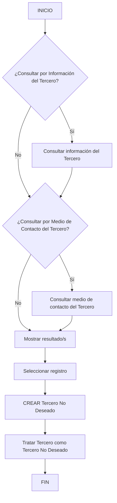

# Operação “CREAR Tercero No Deseado” — Consulta, Seleção e Registro de Terceiro

## 1. Metadados do Documento
- **Arquivo de Origem:** Não identificado
- **Tipo de Documento:** Procedimento
- **Domínio / Sistema:** Zeus / Soluciones APIs
- **Público-Alvo:** Operação, Negócio
- **Data/Versão Identificada:** Não identificada

---

## 2. Resumo Executivo & Contexto de Negócio

O documento descreve a operação **“CREAR Tercero No Deseado”**, destinada a registrar um **Tercero** como **Tercero No Deseado**. O enquadramento do terceiro é realizado de acordo com o seu **código de atividade** e com os valores dos **atributos que conformam sua asignación**.

O processo apresentado começa com a consulta de informações do terceiro. O fluxo inclui uma decisão sobre consultar informação do terceiro e outra decisão sobre consultar o meio de contato do terceiro.

Após a consulta, o processo prevê mostrar resultados, selecionar um registro e executar a ação **“CREAR Tercero No Deseado”**. O fluxo termina após o tratamento do terceiro como terceiro não desejado.

O documento não detalha campos de entrada, critérios de validação, contratos de integração, persistência, perfis de acesso ou mensagens de erro da operação.

---

## 3. Arquitetura, Componentes & Tecnologias Envolvidas

Componentes e termos citados:

- **Zeus**
- **Soluciones APIs**
- **Documentación**
- **Tercero**
- **Tercero No Deseado**
- **Información del Tercero**
- **Medio de Contacto del Tercero**
- **Código de actividad**
- **Atributos que conforman su asignación**
- **RS**



> **Nota de Análise:** O documento menciona Zeus, Soluciones APIs, Documentación e RS, mas não descreve responsabilidades técnicas, interfaces, protocolos, métodos HTTP ou contratos de dados desses elementos.

---

## 4. Regras de Negócio, Especificações Funcionais & Processos

1. A operação permite registrar um **Tercero** como **Tercero No Deseado**.
2. O registro como **Tercero No Deseado** deve ocorrer de acordo com:
   - o **código de actividad** do terceiro;
   - os valores dos **atributos que conforman su asignación**.
3. O processo inicia pela possibilidade de consultar a **Información del Tercero**.
4. O processo também prevê a possibilidade de consultar o **Medio de Contacto del Tercero**.
5. Os resultados de consulta devem ser apresentados ao operador como **Resultado/s**.
6. Um registro deve ser selecionado antes da execução da ação **“CREAR Tercero No Deseado”**.
7. Após a criação, o terceiro é tratado como **Tercero No Deseado**.
8. Os critérios de busca explicitamente listados são:
   - consulta por **Datos del Tercero**;
   - consulta por **Medio de Contacto del Tercero**.

> **Nota de Análise:** O documento não especifica se as consultas por dados do terceiro e por meio de contato podem ser combinadas, se são obrigatórias ou quais atributos formam os critérios de pesquisa.

---

## 5. Tabelas de Parâmetros, Ambientes e Estruturas de Dados

| Item / Parâmetro | Descrição / Função | Tipo / Valores / Formato | Ambiente / Observações |
| :--- | :--- | :--- | :--- |
| Operação | Registrar um terceiro como não desejado | `CREAR Tercero No Deseado` | Não detalhado |
| Tercero | Entidade submetida ao processo de consulta e tratamento | Não detalhado | Pode ser tratado como `Tercero No Deseado` |
| Tercero No Deseado | Classificação ou condição atribuída ao terceiro | Não detalhado | Resultado da operação |
| Código de actividad | Elemento considerado para registrar o terceiro como não desejado | Não detalhado | Não há catálogo ou valores apresentados |
| Atributos de asignación | Valores considerados no registro do terceiro como não desejado | Não detalhado | Não há lista de atributos apresentada |
| Datos del Tercero | Critério de busca | Opção de consulta | Não há campos detalhados |
| Medio de Contacto del Tercero | Critério de busca e possível etapa de consulta | Opção de consulta | Não há tipos de contato detalhados |
| Resultado/s | Resultado apresentado após a consulta | Lista ou conjunto de resultados, não detalhado | Exige seleção de registro |
| Registro | Item selecionado nos resultados | Não detalhado | Selecionado antes da criação |
| Zeus | Termo de navegação ou sistema citado | Não detalhado | Relação técnica não detalhada |
| Soluciones APIs | Termo citado no documento | Não detalhado | Relação com a operação não detalhada |
| RS | Sigla ou rótulo presente no fluxo | Não detalhado | Significado não informado |

---

## 6. Bateria de Perguntas & Respostas para RAG (FAQ Sintético)

### P1: Qual é o objetivo da operação “CREAR Tercero No Deseado”?
**R:** A operação permite registrar um Tercero como Tercero No Deseado, considerando o código de actividad do terceiro e os valores dos atributos que conformam sua asignación.

### P2: Quais critérios podem ser utilizados para buscar um Tercero antes do registro?
**R:** O documento lista dois critérios de busca: consulta por Datos del Tercero e consulta por Medio de Contacto del Tercero.

### P3: É possível consultar informações do terceiro no fluxo da operação?
**R:** Sim. O fluxo inicia com uma decisão sobre consultar por Información del Tercero.

### P4: O fluxo permite consultar o meio de contato do terceiro?
**R:** Sim. O processo contém uma decisão específica para consultar por Medio de Contacto del Tercero.

### P5: O que ocorre depois das consultas do Tercero?
**R:** O fluxo indica que o sistema deve mostrar os Resultado/s, permitindo que um registro seja selecionado antes da execução da ação “CREAR Tercero No Deseado”.

### P6: É necessário selecionar um registro para criar um Tercero No Deseado?
**R:** Sim. O fluxo apresenta a sequência “Mostrar Resultado/s”, “Seleccionar Registro” e “CREAR Tercero No Deseado”.

### P7: Quais informações definem o registro de um terceiro como não desejado?
**R:** O documento informa que o registro deve ser realizado de acordo com o código de actividad do Tercero e os valores dos atributos que conformam sua asignación.

### P8: O documento especifica quais atributos compõem a asignación do Tercero?
**R:** Não. O documento menciona os atributos que conformam a asignación, mas não apresenta nomes, formatos, valores permitidos ou regras de validação desses atributos.

### P9: O documento define APIs, métodos HTTP ou contratos JSON para a operação?
**R:** Não. Embora “Soluciones APIs” seja citado, o conteúdo não detalha métodos HTTP, endpoints, contratos JSON, autenticação ou respostas de integração.

### P10: Qual é o resultado final do processo?
**R:** Após a ação “CREAR Tercero No Deseado”, o fluxo indica “Tratar Tercero como Tercero No Deseado” e então é finalizado.

---

## 7. Glossário de Termos, Siglas & Conceitos-Chave

- **Tercero:** Entidade submetida à consulta, seleção e possível classificação no processo.
- **Tercero No Deseado:** Condição ou classificação aplicada ao Tercero pela operação descrita.
- **CREAR Tercero No Deseado:** Operação de criação ou registro de um Tercero como Tercero No Deseado.
- **Código de actividad:** Informação do Tercero utilizada como critério para o registro como não desejado.
- **Asignación:** Conjunto de atributos cujos valores são considerados no registro do Tercero como Tercero No Deseado.
- **Información del Tercero:** Informação consultável sobre o Tercero no fluxo.
- **Medio de Contacto:** Informação de contato do Tercero que pode ser usada em consulta.
- **Resultado/s:** Resultado ou resultados mostrados após uma consulta.
- **RS:** Sigla exibida no documento sem definição explícita.
- **Zeus:** Termo citado na navegação do documento sem descrição funcional ou técnica.
- **Soluciones APIs:** Termo citado no documento sem detalhamento de integração.

---

## 8. Notas Críticas, Riscos & Limitações

- O documento não identifica arquivo de origem, data, versão, autor ou responsável.
- Não há detalhamento dos valores permitidos para código de actividad ou atributos de asignación.
- Não são apresentados campos, formatos, obrigatoriedade ou validações dos critérios de busca.
- Não há definição do significado de **RS**.
- O documento não descreve permissões, autenticação, auditoria, tratamento de erros ou reversão da classificação de Tercero No Deseado.
- Não há especificação de APIs, endpoints, contratos de entrada e saída, persistência ou integrações.
- Não é possível determinar, com base no conteúdo fornecido, se as consultas por dados e meio de contato são alternativas, cumulativas ou obrigatórias.

---

## 9. Conteúdo Bruto Estruturado (Referência Fiel)

```text
--- [PÁGINA 1 DE 2] ---

OPERACIÓN CREAR Tercero como Tercero no
Deseado
¿En que consiste?
Esta operación permite registrar al Tercero como un Tercero No Deseado, de acuerdo con su código
de actividad y de los valores de los atributos que conforman su asignación.
Proceso
SI
NO
SI
NO
INICIO ¿Consultar por **Información**
del Tercero?
Consultar por **Medio
de Contacto** del Tercero?
Mostrar Resultado/s Seleccionar
Registro **CREAR** Tercero No Deseado
FIN
Criterios de Búsqueda
 ¿Consultar por Datos del Tercero? ( )
 ¿Consultar por Medio de Contacto del Tercero?( )
Tratar Tercero como Tercero No Deseado
 /
 RS
Inicio Soluciones APIs Documentación Zeus
ES


--- [PÁGINA 2 DE 2] ---

CREAR Tercero No Deseado ( )
```
