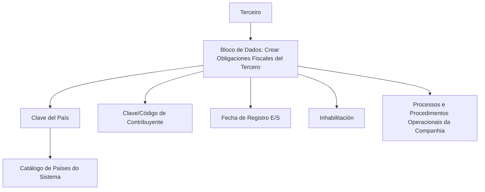

# Gestão de Obrigações Fiscais do Terceiro por País

## 1. Metadados do Documento
- **Arquivo de Origem:** `Não identificado no conteúdo fornecido`
- **Tipo de Documento:** Manual Operacional / Especificação Funcional
- **Domínio / Sistema:** Cadastro de Terceiros — Obrigações Fiscais ou Tributárias
- **Público-Alvo:** Operação, Analistas Funcionais e Desenvolvedores
- **Data/Versão Identificada:** Não identificada

---

## 2. Resumo Executivo & Contexto de Negócio

O documento descreve o bloco de dados **“Crear Obligaciones Fiscales del Tercero”**, destinado ao registro de obrigações fiscais ou tributárias de um Terceiro em países específicos. O registro permite identificar os países nos quais o Terceiro é reconhecido como contribuinte ou possui obrigação tributária.

A finalidade operacional é permitir que a Companhia considere ou exclua o Terceiro de processos e procedimentos operacionais nos quais a existência de obrigação fiscal ou tributária seja relevante. O documento não detalha quais processos corporativos utilizam essa informação, nem os critérios específicos de inclusão ou exclusão.

A ação funcional explicitamente apresentada é **CRIAR obrigações fiscais**. A captura dos dados segue uma sequência visual definida: da esquerda para a direita e de cima para baixo.

O bloco contempla identificação do país, código local do contribuinte, data de entrada ou saída da condição tributária e indicação de inabilitação. O documento declara que um país pode ser registrado simultaneamente como possuindo obrigações fiscais e como inabilitado.

---

## 3. Arquitetura, Componentes & Tecnologias Envolvidas

O conteúdo não descreve arquitetura técnica, integrações, APIs, bancos de dados, microsserviços, ambientes, protocolos, URLs ou tecnologias de implementação.

Os componentes funcionais identificados são:

- **Sistema:** Mantém um catálogo de países e armazena informações de obrigações fiscais do Terceiro.
- **Terceiro:** Entidade cadastrada cuja condição tributária é registrada por país.
- **Bloco de Dados “Crear Obligaciones Fiscales del Tercero”:** Área funcional para criação e captura de dados de obrigação tributária.
- **Catálogo de Países:** Fonte de valores possíveis para a chave do país.
- **Processos e Procedimentos Operacionais da Companhia:** Consumidores potenciais da informação de obrigação fiscal, sem detalhamento adicional.



> *Nota de Análise: O documento apresenta um fluxo funcional de captura de dados, mas não detalha componentes técnicos, persistência, contratos de integração, métodos HTTP, autenticação ou regras de processamento sistêmico.*

---

## 4. Regras de Negócio, Especificações Funcionais & Processos

### 4.1 Objetivo funcional

O bloco de dados deve identificar os países nos quais o Terceiro possui obrigações fiscais ou tributárias. Essa identificação fornece à Companhia uma base para considerar ou excluir o Terceiro de processos e procedimentos operacionais pertinentes.

### 4.2 Ação apresentada

- A ação possível indicada no documento é **CRIAR Obrigações Fiscais**.
- O documento não apresenta ações de alteração, consulta, exclusão, aprovação ou cancelamento.

### 4.3 Ordem de captura

A sequência de preenchimento dos atributos é definida como:

1. Da esquerda para a direita.
2. De cima para baixo.

### 4.4 Identificação do país

- O campo **Clave del País** armazena o código do primeiro nível da estrutura geográfica: países.
- O país deve corresponder a um valor existente no catálogo de países disponível no Sistema.
- O país identifica a localidade em que o Terceiro está identificado como obrigado tributário.

### 4.5 Identificação local do contribuinte

- O campo **Clave/Código de Contribuyente** identifica a chave ou o código do Terceiro como contribuinte local.
- A identificação é aplicável ao país em que o Terceiro está registrado como obrigado tributário.

### 4.6 Registro de entrada ou saída

- O campo **Fecha de Registro E/S** contém a data de entrada ou a data de saída do Terceiro na condição de obrigação tributária.
- O documento não define formato de data, regras de obrigatoriedade, validações cronológicas ou critérios para distinguir entrada de saída.

### 4.7 Inabilitação da obrigação tributária

- O campo **Inhabilitación** indica se o Terceiro deixou de ser obrigado tributário no país em questão.
- É permitido registrar um país no qual o Terceiro possui obrigações fiscais e marcá-lo como inabilitado no mesmo processo.
- O documento não detalha o impacto da inabilitação sobre a participação do Terceiro nos processos operacionais da Companhia.

---

## 5. Tabelas de Parâmetros, Ambientes e Estruturas de Dados

| Item / Parâmetro | Descrição / Função | Tipo / Valores / Formato | Ambiente / Observações |
| :--- | :--- | :--- | :--- |
| Criar Obrigações Fiscais | Ação funcional para registrar obrigações fiscais do Terceiro. | Ação apresentada como `CREAR`. | Não há detalhamento de permissões ou etapas de confirmação. |
| Clave del País | Código do primeiro nível da estrutura geográfica, correspondente a países, onde o Terceiro é identificado como obrigado tributário. | Código de país; valores provenientes do catálogo de países. | O catálogo existe no Sistema; o documento não informa códigos aceitos. |
| Clave/Código de Contribuyente | Chave ou código que identifica o Terceiro como contribuinte local. | Código ou chave de contribuinte local. | Aplicável ao país em que o Terceiro figura como obrigado tributário. |
| Fecha de Registro E/S | Data de entrada ou saída do Terceiro na condição de obrigação tributária. | Data de entrada ou data de saída. | Formato, validações e obrigatoriedade não especificados. |
| Inhabilitación | Indica que o Terceiro deixou de ser obrigado tributário no país registrado. | Indicador de inabilitação. | Pode ser marcado no mesmo processo de registro da obrigação fiscal. |
| Catálogo de Países | Relação de valores possíveis para seleção da chave do país. | Catálogo mantido pelo Sistema. | Estrutura e mecanismo de consulta não detalhados. |
| Processos e Procedimentos Operacionais | Processos corporativos que podem considerar ou excluir o Terceiro com base na obrigação tributária. | Não especificado. | Os processos consumidores não são identificados no documento. |

---

## 6. Bateria de Perguntas & Respostas para RAG (FAQ Sintético)

### P1: Qual é o objetivo do bloco de dados “Crear Obligaciones Fiscales del Tercero”?
**R:** O bloco de dados identifica os países nos quais o Terceiro possui obrigações fiscais ou tributárias. Essa informação permite à Companhia considerar ou excluir o Terceiro de processos e procedimentos operacionais em que a situação tributária seja relevante.

### P2: Qual ação funcional está explicitamente disponível no documento?
**R:** O documento apresenta a ação **CRIAR Obrigações Fiscais**. Não são descritas ações de alteração, exclusão, consulta ou aprovação.

### P3: Como deve ser preenchida a Clave del País?
**R:** A Clave del País deve conter o código de país correspondente ao primeiro nível da estrutura geográfica. O código precisa estar entre os valores disponíveis no catálogo de países existente no Sistema.

### P4: O que representa o campo Clave/Código de Contribuyente?
**R:** A Clave/Código de Contribuyente identifica a chave ou o código do Terceiro como contribuinte local no país em que o Terceiro aparece como obrigado tributário.

### P5: Para que serve a Fecha de Registro E/S?
**R:** A Fecha de Registro E/S contém a data de entrada ou a data de saída do Terceiro na condição de obrigação tributária. O documento não especifica o formato da data nem regras de validação.

### P6: O que significa Inhabilitación no cadastro de obrigações fiscais?
**R:** Inhabilitación indica que o Terceiro deixou de ser obrigado tributário no país em questão. O documento não detalha quais consequências operacionais ou sistêmicas decorrem dessa condição.

### P7: É possível registrar uma obrigação fiscal e inabilitá-la no mesmo processo?
**R:** Sim. O documento informa expressamente que é possível registrar um país no qual o Terceiro possui obrigações fiscais e, simultaneamente, marcá-lo como inabilitado no mesmo processo.

### P8: Quais processos corporativos utilizam a informação de obrigação fiscal do Terceiro?
**R:** O documento informa apenas que a informação permite considerar ou excluir o Terceiro de determinados processos e procedimentos operacionais da Companhia. Os processos específicos não são identificados.

### P9: Qual é a sequência de captura dos atributos no bloco de dados?
**R:** A sequência de captura deve seguir a ordem visual da esquerda para a direita e de cima para baixo.

### P10: O documento especifica APIs, integrações ou métodos técnicos para criação das obrigações fiscais?
**R:** Não. O documento não detalha APIs, métodos HTTP, contratos JSON, bancos de dados, integrações, tecnologias ou ambientes técnicos.

---

## 7. Glossário de Termos, Siglas & Conceitos-Chave

- **Terceiro:** Entidade cadastrada cuja situação de obrigação fiscal ou tributária é identificada por país.
- **Obrigação Fiscal / Tributária:** Condição pela qual o Terceiro é identificado como obrigado tributário em determinado país.
- **Clave del País:** Código de país pertencente ao primeiro nível da estrutura geográfica.
- **Clave/Código de Contribuyente:** Chave ou código do Terceiro como contribuinte local em um país.
- **Fecha de Registro E/S:** Data de entrada ou saída da condição de obrigação tributária.
- **E/S:** Abreviação apresentada no campo “Fecha de Registro E/S”; pelo contexto, corresponde a entrada/saída.
- **Inhabilitación:** Indicador de que o Terceiro deixou de ser obrigado tributário no país em questão.
- **Catálogo de Países:** Relação de valores de países disponível no Sistema.

---

## 8. Notas Críticas, Riscos & Limitações

- O nome do arquivo de origem, autor, versão e data não estão presentes no conteúdo fornecido.
- O documento não especifica o nome do Sistema, embora mencione a existência de um catálogo de países no Sistema.
- Não há definição de formatos, tamanhos, obrigatoriedade, unicidade ou validações para os campos apresentados.
- Não são descritos os processos operacionais que consomem a informação de obrigação fiscal.
- O documento não esclarece o comportamento sistêmico quando uma obrigação fiscal é criada e marcada como inabilitada no mesmo processo.
- Não há informações sobre permissões de acesso, auditoria, trilha de alterações, tratamento de erros ou aprovação.
- Não há detalhamento técnico sobre APIs, integrações, modelo de dados, bancos de dados, ambientes ou tecnologias.

---

## 9. Conteúdo Bruto Estruturado (Referência Fiel)

```text
--- [PÁGINA 1 DE 2] ---

CREAR Obligaciones Fiscales del Tercero
Objetivo
El propósito de este Bloque de Datos es identificar los Países en los que el Tercero tiene
Obligaciones Fiscales o Tributarias, lo que permite a la Compañía contemplar o excluir al Tercero
de aquellos procesos y procedimientos operativos en los que dicha situación deba ser considerada.
Posibles Acciones
 CREAR ( )
Obligaciones Fiscales.
De izquierda a derecha y de arriba hacia abajo, los siguientes atributos marcan la secuencia de
captura de la información.
Clave del País (  )
Este Campo contiene el código del primer nivel de la estructura Geográfica (países) en el que el
Tercero está identificado como obligado tributario, de acuerdo con la relación de posibles valores
existentes en el catálogo de países existente en el Sistema.
 / 
 RS
Inicio Soluciones APIs Documentación Zeus
ES


--- [PÁGINA 2 DE 2] ---

Clave/Código de Contribuyente ( )
Este Dato permite identificar la clave o el código del Tercero como Contribuyente local en el País en
el que aparece como obligado tributario.
Fecha de Registro E/S ( )
Este Campo contiene la Fecha de Entrada o de Salida del Tercero con el status de Obligación
Tributaria.
Inhabilitación ( )
Este campo establece si el Tercero ha dejado de ser Obligado Tributario en el País en cuestión.
Es posible Registrar un país en el que el Tercero tenga Obligaciones Fiscales y su vez marcarlo
como Inhabilitada en el mismo proceso.
```
