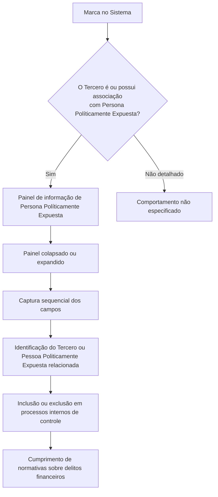

# Criação de Pessoa Politicamente Exposta — Bloco de Informação de Terceiros

## 1. Metadados do Documento
- **Arquivo de Origem:** Não identificado no conteúdo fornecido
- **Tipo de Documento:** Especificação Funcional
- **Domínio / Sistema:** Gestão de Terceiros; processos de conformidade relacionados a delitos financeiros
- **Público-Alvo:** Analistas funcionais, operação, compliance e desenvolvedores
- **Data/Versão Identificada:** Não identificada

---

## 2. Resumo Executivo & Contexto de Negócio

O documento descreve o bloco de informação utilizado para identificar um **Tercero** como **Persona Políticamente Expuesta** ou para relacionar o Tercero a um Familiar ou Colaborador com essa condição. A identificação permite que a entidade inclua ou exclua o Tercero de processos e procedimentos vinculados ao cumprimento das normas vigentes sobre delitos financeiros.

A ação explicitamente apresentada é **CREAR**, destinada ao cadastro da informação de Pessoa Politicamente Exposta. O painel de informação correspondente somente é exibido quando a marca do sistema identifica que o Tercero é uma Pessoa Politicamente Exposta ou possui uma Pessoa Politicamente Exposta associada.

O painel pode ser exibido de forma colapsada ou expandida. A captura dos dados deve seguir a sequência indicada no documento: da esquerda para a direita e de cima para baixo.

O documento detalha campos de datas de alta e baixa, vínculo de Familiar ou Colaborador, cargo ou relação, tipo e chave do documento identificador da Pessoa Politicamente Exposta relacionada e indicador de inabilitação. Não são fornecidos detalhes sobre contratos de API, persistência, validações de formato, permissões, métodos HTTP ou integrações técnicas.

---

## 3. Arquitetura, Componentes & Tecnologias Envolvidas

Os componentes funcionais explicitamente identificados são:

- **Sistema:** contém a marca que identifica se o Tercero é ou possui associação com uma Pessoa Politicamente Exposta.
- **Tercero:** entidade principal submetida à identificação ou relacionada a uma Pessoa Politicamente Exposta.
- **Persona Políticamente Expuesta:** condição atribuída ao Tercero ou à pessoa relacionada.
- **Familiar / Colaborador:** possível tipo de relação de uma Pessoa Politicamente Exposta associada ao Tercero.
- **Painel de informação:** interface exibida de forma colapsada ou expandida para captura dos dados.
- **Catálogo de Cargos:** catálogo existente no Sistema usado para os possíveis valores de cargo ou relação.



> **Nota de Análise:** O conteúdo não informa a tecnologia do Sistema, banco de dados, APIs, endpoints, protocolos de integração, mecanismos de autenticação ou arquitetura de implantação.

---

## 4. Regras de Negócio, Especificações Funcionais & Processos

1. O bloco de informação tem como objetivo identificar um Tercero como Persona Políticamente Expuesta.
2. O bloco também permite relacionar o Tercero a um Familiar ou estrecho Colaborador que tenha a condição de Persona Políticamente Expuesta.
3. A identificação é utilizada pela companhia para incluir ou excluir o Tercero de processos e procedimentos da entidade relacionados ao cumprimento de normativas vigentes em matéria de delitos financeiros.
4. A ação apresentada no documento é **CREAR**.
5. O painel de informação de Persona Políticamente Expuesta somente aparece quando a marca do Sistema identifica uma das seguintes condições:
   - O Tercero é uma Persona Políticamente Expuesta.
   - O Tercero possui associação com uma Persona Políticamente Expuesta.
6. O painel de informação pode aparecer de forma:
   - Colapsada.
   - Expandida.
7. A sequência de captura de informações deve seguir a ordem apresentada visualmente: da esquerda para a direita e de cima para baixo.
8. A **Fecha de Alta como Persona Políticamente Expuesta** contém a data de alta do Tercero como Pessoa Politicamente Exposta ou a data de alta do Familiar ou Colaborador relacionado ao Tercero como Pessoa Politicamente Exposta.
9. A **Fecha de Baja como Persona Políticamente Expuesta** contém a data em que o Tercero ou a Pessoa Politicamente Exposta relacionada deixa de ser considerada Pessoa Politicamente Exposta.
10. O atributo **Familiar / Colaborador** identifica se a Pessoa Politicamente Exposta relacionada é Familiar ou Colaborador do Tercero.
11. O campo **Cargo o Relación con la Persona Políticamente Expuesta** identifica a relação ou o cargo do Tercero ou da Pessoa Politicamente Exposta relacionada, conforme os valores possíveis do catálogo de Cargos existente no Sistema.
12. O campo **Tipo Documento Identificador de la Persona Políticamente Expuesta Relacionada** contém o tipo de documento do Familiar ou Colaborador relacionado ao Tercero.
13. O campo **Clave del Documento Identificador de la Persona Políticamente Relacionada** contém a chave do documento identificador do Familiar ou Colaborador relacionado ao Tercero.
14. A propriedade **Inhabilitación** indica ao Sistema que o Tercero ou a Pessoa Politicamente Exposta relacionada está desativada e, consequentemente, não deve ser considerada nos processos de controle internos da entidade.

---

## 5. Tabelas de Parâmetros, Ambientes e Estruturas de Dados

| Item / Parâmetro | Descrição / Função | Tipo / Valores / Formato | Ambiente / Observações |
| :--- | :--- | :--- | :--- |
| Acción | Ação disponível no bloco de informação. | `CREAR` | O documento apresenta somente a ação CREAR. |
| Marca de identificação | Define se o Sistema reconhece que o Tercero é ou possui associação com uma Persona Políticamente Expuesta. | Não especificado | Condição para apresentação do painel de informação. |
| Painel de informação | Área de interface para os dados de Pessoa Politicamente Exposta. | Colapsado ou expandido | Não há detalhamento de comportamento adicional. |
| Fecha de Alta como Persona Políticamente Expuesta | Registra a data de alta do Tercero ou do Familiar/Colaborador relacionado como Pessoa Politicamente Exposta. | Data; formato não especificado | Aplicável ao Tercero ou à Pessoa Politicamente Exposta relacionada. |
| Fecha de Baja como Persona Políticamente Expuesta | Registra a data em que o Tercero ou a Pessoa Politicamente Exposta relacionada deixa essa condição. | Data; formato não especificado | O documento não descreve regras de obrigatoriedade ou validação. |
| Familiar / Colaborador | Identifica o tipo de vínculo da Pessoa Politicamente Exposta relacionada com o Tercero. | Familiar ou Colaborador | O documento não apresenta valores técnicos codificados. |
| Cargo o Relación con la Persona Políticamente Expuesta | Identifica cargo ou relação do Tercero ou da Pessoa Politicamente Exposta relacionada. | Valores do catálogo de Cargos existente no Sistema | O catálogo e seus valores não foram fornecidos. |
| Tipo Documento Identificador de la Persona Políticamente Expuesta Relacionada | Informa o tipo de documento do Familiar ou Colaborador relacionado. | Tipo de documento; valores não especificados | Descrito como dado do colapsador. |
| Clave del Documento Identificador de la Persona Políticamente Relacionada | Informa a chave do documento identificador do Familiar ou Colaborador relacionado. | Chave de documento; formato não especificado | Não há regra de unicidade ou formato descrita. |
| Inhabilitación | Indica desativação do Tercero ou da Pessoa Politicamente Exposta relacionada. | Indicador; tipo não especificado | Quando aplicável, a pessoa não deve ser considerada nos processos internos de controle. |
| Catálogo de Cargos | Fonte de possíveis valores para cargo ou relação. | Catálogo existente no Sistema | Conteúdo do catálogo não fornecido. |
| Processos de controle internos | Processos que não devem considerar entidades inabilitadas. | Não especificado | Relacionados ao controle interno da entidade. |
| Normativas sobre delitos financeiros | Contexto normativo que motiva a identificação da condição de Pessoa Politicamente Exposta. | Não especificado | Normativas específicas não identificadas. |

---

## 6. Bateria de Perguntas & Respostas para RAG (FAQ Sintético)

### P1: Qual é o objetivo do bloco de informação de Persona Políticamente Expuesta?
**R:** O bloco de informação identifica um Tercero como Persona Políticamente Expuesta ou o relaciona a um Familiar ou estrecho Colaborador com essa condição. Essa identificação permite incluir ou excluir o Tercero de processos e procedimentos relacionados ao cumprimento das normativas vigentes sobre delitos financeiros.

### P2: Qual ação está disponível no bloco de informação apresentado?
**R:** O documento apresenta a ação **CREAR**. Não há descrição de ações de consulta, alteração, exclusão ou aprovação.

### P3: Em qual condição o painel de Persona Políticamente Expuesta é exibido?
**R:** O painel é exibido quando a marca do Sistema identifica que o Tercero é uma Persona Políticamente Expuesta ou que o Tercero possui uma Pessoa Politicamente Exposta associada.

### P4: Quais modos de visualização do painel são mencionados?
**R:** O painel de informação pode ser mostrado de forma colapsada ou de forma expandida. O documento não detalha as regras de transição entre essas duas visualizações.

### P5: O que representa a Fecha de Alta como Persona Políticamente Expuesta?
**R:** A Fecha de Alta contém a data em que o Tercero se torna uma Persona Políticamente Expuesta ou a data em que o Familiar ou Colaborador relacionado ao Tercero se torna uma Pessoa Politicamente Exposta.

### P6: Qual é a finalidade da Fecha de Baja como Persona Políticamente Expuesta?
**R:** A Fecha de Baja contém a data em que o Tercero ou a Pessoa Politicamente Exposta relacionada deixa de ser considerada Pessoa Politicamente Exposta.

### P7: Como o Sistema diferencia um Familiar de um Colaborador relacionado?
**R:** O atributo **Familiar / Colaborador** permite identificar se a Pessoa Politicamente Exposta relacionada com o Tercero é um Familiar ou um Colaborador.

### P8: De onde vêm os possíveis valores do campo Cargo o Relación con la Persona Políticamente Expuesta?
**R:** Os valores possíveis são obtidos do catálogo de Cargos existente no Sistema. O documento não inclui a lista de cargos nem suas codificações.

### P9: Quais informações documentais são capturadas para uma Pessoa Politicamente Exposta relacionada?
**R:** São capturados o tipo de documento identificador e a chave do documento identificador do Familiar ou Colaborador relacionado ao Tercero.

### P10: Qual é o efeito da propriedade Inhabilitación?
**R:** A propriedade Inhabilitación informa ao Sistema que o Tercero ou a Pessoa Politicamente Exposta relacionada está desativada. Quando isso ocorre, a entidade não deve ser considerada nos processos de controle internos existentes na entidade.

### P11: Como deve ser seguida a sequência de captura dos campos?
**R:** O documento determina que a sequência de captura deve ser seguida da esquerda para a direita e de cima para baixo.

### P12: O documento especifica APIs, métodos HTTP ou contratos JSON para o bloco de Pessoa Politicamente Exposta?
**R:** Não. O documento descreve o objetivo funcional, o painel de informação e os campos de captura, mas não detalha métodos HTTP, endpoints, contratos JSON, tecnologias ou integrações de API.

---

## 7. Glossário de Termos, Siglas & Conceitos-Chave

- **Tercero:** Entidade principal que pode ser identificada como Persona Políticamente Expuesta ou associada a uma Pessoa Politicamente Exposta.
- **Persona Políticamente Expuesta:** Condição atribuída ao Tercero ou a uma pessoa relacionada ao Tercero.
- **Familiar:** Tipo de relação possível entre o Tercero e uma Pessoa Politicamente Exposta relacionada.
- **Colaborador:** Tipo de relação possível entre o Tercero e uma Pessoa Politicamente Exposta relacionada.
- **Estrecho Colaborador:** Colaborador próximo que pode ter a condição de Persona Políticamente Expuesta e estar relacionado ao Tercero.
- **Fecha de Alta:** Data em que o Tercero, Familiar ou Colaborador adquire a condição de Pessoa Politicamente Exposta.
- **Fecha de Baja:** Data em que o Tercero ou Pessoa Politicamente Exposta relacionada deixa essa condição.
- **Inhabilitación:** Propriedade que sinaliza que o Tercero ou a Pessoa Politicamente Exposta relacionada está desativada e não deve ser considerada nos processos internos de controle.
- **Catálogo de Cargos:** Catálogo existente no Sistema que fornece valores para o campo de cargo ou relação.
- **Colapsador:** Elemento mencionado como contendo o tipo de documento do Familiar ou Colaborador relacionado ao Tercero.

---

## 8. Notas Críticas, Riscos & Limitações

- O documento não identifica o nome, versão ou fornecedor do Sistema.
- Não há especificação de formatos de data, tipos de dados, tamanhos máximos, regras de obrigatoriedade ou mensagens de validação dos campos.
- O documento não apresenta o catálogo de Cargos, seus valores possíveis ou códigos correspondentes.
- Não há definição de fluxos de aprovação, permissões de acesso, auditoria, histórico de alterações ou responsáveis pelo cadastro.
- Não são descritos endpoints, APIs, contratos JSON, banco de dados, eventos, integrações ou protocolos técnicos.
- A semântica exata da marca de identificação no Sistema é funcionalmente descrita, mas sua implementação técnica não é apresentada.
- O efeito de Inhabilitación é claro para os processos internos de controle, porém o documento não especifica quais processos são afetados nem como a exclusão é operacionalizada.
- Não há detalhamento adicional sobre o comportamento dos painéis colapsado e expandido.

---

## 9. Conteúdo Bruto Estruturado (Referência Fiel)

```text
--- [PÁGINA 1 DE 2] ---

CREAR Persona Políticamente Expuesta
Objetivo
El propósito de este Bloque de Información es identificar al Tercero como Persona Políticamente
Expuesta o relacionarlo con algún Familiar o estrecho Colaborador que tenga dicha condición, lo
que permite a la compañía incluir o excluir al Tercero de aquellos procesos y procedimientos de la
entidad relacionados con el cumplimiento de las normativas vigentes en materia de delitos
financieros.
Posibles Acciones
 CREAR ( )
Datos Persona Políticamente Expuesta
Siempre y cuando se haya activado la marca que identifica en el sistema que el Tercero es o tiene
asociada una persona políticamente expuesta aparecerá el panel de información correspondiente de
manera colapsada...
... o de manera extendida
 / 
 RS
Inicio Soluciones APIs Documentación Zeus
ES


--- [PÁGINA 2 DE 2] ---

De izquierda a derecha y de arriba hacia abajo, los siguientes campos marcan la secuencia de
captura de la Información.
Fecha de Alta como Persona Políticamente Expuesta ( )
Este Dato contendrá la fecha de Alta del Tercero como Persona Políticamente Expuesta o del
Familiar o Colaborador como Persona Políticamente Expuesta relacionada con el Tercero.
Fecha de Baja como Persona Políticamente Expuesta ( )
Este Dato contendrá la fecha en la que el Tercero o la Persona Políticamente Expuesta Relacionada
causan baja como Personas Políticamente Expuestas.
Familiar / Colaborador ( )
Este Atributo permite identificar si la Persona Políticamente Expuesta Relacionada es un Familiar o
un Colaborador del Tercero.
Cargo o Relación con la Persona Políticamente Expuesta (  )
Este Campo identifica la relación o el Cargo del Tercero o de la Persona Políticamente Expuesta
relacionada, de acuerdo con los posibles valores del catálogo de Cargos existente en el Sistema.
Tipo Documento Identificador de la Persona Políticamente Expuesta
Relacionada (  )
Este Dato del colapsador contiene el tipo de documento del Familiar o Colaborador Relacionado con
el Tercero.
Clave del Documento Identificador de la Persona Políticamente Relacionada ( )
Este Campo contiene la clave del documento Identificador del Familiar o Colaborador Relacionado
con el Tercero.
Inhabilitación ( )
Esta propiedad le indica al Sistema que o bien el Tercero o la Personas Políticamente Expuesta
Relacionada con el Tercero está desactivada y por ende no debiera considerarse en los procesos de
control internos existentes en la entidad.
```
