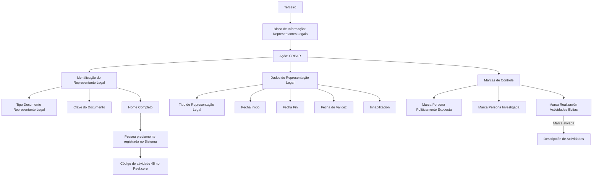

# Criação de Representantes Legais do Terceiro — Bloco de Informação Reef.core

## 1. Metadados do Documento
- **Arquivo de Origem:** Não identificado no conteúdo fornecido
- **Tipo de Documento:** Especificação Técnica
- **Domínio / Sistema:** Reef.core — cadastro de Terceiros e Representantes Legais
- **Público-Alvo:** Negócio, Analistas Funcionais, Desenvolvedores e Operação
- **Data/Versão Identificada:** Não identificada

---

## 2. Resumo Executivo & Contexto de Negócio

O documento descreve o bloco de informação destinado à criação de Representantes Legais de um Terceiro. A representação legal é definida como a faculdade atribuída por lei a uma pessoa para agir em nome de outra, sendo que os efeitos desses atos recaem sobre a pessoa representada. O exercício dessa representação pode ser obrigatório para o representante.

O objetivo funcional do bloco é identificar um ou mais Representantes Legais associados a um Terceiro. A funcionalidade indicada é a ação **CREAR**, isto é, criar o registro da relação de representação legal.

A especificação relaciona atributos de identificação, vigência, tipo de representação e marcas de controle. Entre os controles estão indicadores para Pessoa Politicamente Exposta, Pessoa Investigada e realização de atividades ilícitas, permitindo que a entidade seguradora realize controles e gestão em seus processos internos.

O nome completo do Representante Legal deve corresponder a uma pessoa previamente registrada no sistema e identificada com o código de atividade **45**, código que identifica no Reef.core os Terceiros como Representantes Legais. O documento não detalha telas, APIs, contratos JSON, persistência, validações obrigatórias, valores permitidos ou regras de cálculo para os atributos listados.

---

## 3. Arquitetura, Componentes & Tecnologias Envolvidas

O conteúdo fornecido cita o sistema **Reef.core** e o conceito de **Terceiro**. Não são informadas tecnologias de implementação, bancos de dados, APIs, microsserviços, integrações, ambientes, URLs, protocolos ou mecanismos de autenticação.

A relação funcional extraída é a criação de um vínculo entre um Terceiro e uma pessoa previamente cadastrada como Representante Legal no Reef.core, identificada pelo código de atividade 45.



> **Nota de Análise:** O documento não detalha componentes técnicos além do Reef.core, nem informa como os dados do bloco de informação são persistidos, integrados ou validados.

---

## 4. Regras de Negócio, Especificações Funcionais & Processos

### Objetivo do bloco de informação
- Identificar um ou mais Representantes Legais do Terceiro.
- Permitir a ação **CREAR** para registro de Representantes Legais.
- A sequência de captura das informações é apresentada da esquerda para a direita e de cima para baixo.
- Quando os campos não forem expressamente especificados, devem ser utilizados indistintamente tanto no registro de informações de Pessoas Físicas quanto de Pessoas Jurídicas.

### Regras de identificação do Representante Legal
1. O **Tipo Documento Representante Legal** identifica o tipo de documento utilizado para identificar o Representante Legal, conforme os tipos de documentos existentes no sistema.
2. A **Clave del Documento** contém a chave do documento do Representante Legal do Terceiro.
3. O **Nombre Completo** apresenta o nome completo do Representante Legal do Terceiro.
4. O Representante Legal deve estar previamente registrado no sistema.
5. O Representante Legal deve estar identificado com o código de atividade **45**.
6. No Reef.core, o código de atividade 45 identifica os Terceiros como Representantes Legais.

### Regras de representação legal e vigência
1. O **Tipo de Representación Legal** contém a classe ou tipologia de representação legal associada à pessoa.
2. Os valores para Tipo de Representação Legal devem estar de acordo com valores definidos corporativamente.
3. A **Fecha Inicio** determina a data de início do Terceiro como Representante Legal.
4. A **Fecha Fin** indica a data em que a pessoa deixa de atuar como Representante Legal do Terceiro.
5. A **Fecha de Validez** indica a data a partir da qual a pessoa passa a vigorar como Representante Legal.
6. A propriedade **Inhabilitación** informa se o status do Representante Legal continua vigente ou se o Representante Legal está inabilitado para exercer essa função.

### Regras de controle e classificação
1. A **Marca Persona Políticamente Expuesta** permite identificar o Representante Legal como Pessoa Politicamente Exposta.
2. A marca de Pessoa Politicamente Exposta permite à entidade seguradora gerir e controlar internamente essa circunstância.
3. A **Marca Persona Investigada** permite identificar o Representante Legal como Pessoa Investigada.
4. A marca de Pessoa Investigada permite à entidade seguradora gerir e controlar internamente essa circunstância.
5. A **Marca Realización Actividades Ilícitas** permite identificar o Representante Legal como pessoa que realizou atividades ilícitas.
6. A marca de realização de atividades ilícitas permite à entidade seguradora controlar e gerir internamente essa circunstância.
7. A **Descripción de Actividades** só pode ser registrada quando a marca de realização de atividades ilícitas estiver ativada.
8. A Descrição de Atividades permite registrar um texto esclarecedor sobre as atividades ilícitas.

---

## 5. Tabelas de Parâmetros, Ambientes e Estruturas de Dados

| Item / Parâmetro | Descrição / Função | Tipo / Valores / Formato | Ambiente / Observações |
| :--- | :--- | :--- | :--- |
| Ação | Operação disponível para o bloco de informação. | `CREAR` | O documento apresenta apenas a ação CREAR. |
| Tipo Documento Representante Legal | Contém o tipo de documento usado para identificar o Representante Legal. | Tipos de documentos existentes no sistema; valores não detalhados. | Aplicável ao Representante Legal do Terceiro. |
| Clave del Documento | Contém a chave do documento do Representante Legal do Terceiro. | Formato não detalhado. | Não são informadas regras de unicidade ou validação. |
| Nombre Completo | Mostra o nome completo do Representante Legal do Terceiro. | Nome completo; formato não detalhado. | O Representante Legal deve estar previamente registrado no sistema. |
| Código de atividade | Identifica os Terceiros como Representantes Legais no Reef.core. | `45` | Condição mencionada para o Representante Legal. |
| Tipo de Representación Legal | Contém a classe ou tipologia de representação legal associada à pessoa. | Valores corporativamente definidos; valores não detalhados. | Não são informadas regras de seleção ou catálogo. |
| Fecha Inicio | Determina a data de início do Terceiro como Representante Legal. | Data; formato não detalhado. | Relacionada ao início da atuação como Representante Legal. |
| Fecha Fin | Indica a data em que a pessoa deixa de exercer a função de Representante Legal. | Data; formato não detalhado. | Relacionada ao fim da atuação como Representante Legal. |
| Fecha de Validez | Indica a data a partir da qual a representação legal entra em vigor. | Data; formato não detalhado. | Não é detalhada a relação entre Fecha Inicio e Fecha de Validez. |
| Marca Persona Políticamente Expuesta | Identifica o Representante Legal como Pessoa Politicamente Exposta. | Marca; valores não detalhados. | Permite controle e gestão pela entidade seguradora. |
| Inhabilitación | Determina se o status do Representante Legal permanece vigente ou se está inabilitado para atuar. | Status/marca; valores não detalhados. | Não são definidos motivos ou critérios de inabilitação. |
| Marca Persona Investigada | Identifica o Representante Legal como Pessoa Investigada. | Marca; valores não detalhados. | Permite controle e gestão pela entidade seguradora. |
| Marca Realización Actividades Ilícitas | Identifica o Representante Legal como pessoa que realizou atividades ilícitas. | Marca; valores não detalhados. | Permite controle e gestão pela entidade seguradora. |
| Descripción de Actividades | Registra texto explicativo sobre atividades ilícitas. | Texto; formato e tamanho não detalhados. | Aplicável exclusivamente quando a marca de realização de atividades ilícitas estiver ativada. |
| Pessoa Física | Categoria de pessoa para a qual os campos podem ser utilizados quando não houver indicação contrária. | Não aplicável. | O documento indica uso indistinto quando os campos não forem explicitamente especificados. |
| Pessoa Jurídica | Categoria de pessoa para a qual os campos podem ser utilizados quando não houver indicação contrária. | Não aplicável. | O documento indica uso indistinto quando os campos não forem explicitamente especificados. |
| Reef.core | Sistema citado para identificação de Terceiros como Representantes Legais pelo código de atividade 45. | Sistema. | Tecnologias, arquitetura e integrações não detalhadas. |

---

## 6. Bateria de Perguntas & Respostas para RAG (FAQ Sintético)

### P1: Qual é o objetivo do bloco de informação de Representantes Legais?
**R:** O bloco de informação tem como propósito identificar um ou mais Representantes Legais associados a um Terceiro. O documento apresenta a ação CREAR como operação para criar esses registros.

### P2: O que caracteriza a representação legal no contexto do documento?
**R:** A representação legal é a faculdade concedida por lei a uma pessoa para atuar em nome de outra. Os efeitos dos atos praticados recaem sobre a pessoa representada, e o exercício da representação pode ser obrigatório para o representante.

### P3: Qual condição o Representante Legal deve cumprir antes de ser informado no campo Nombre Completo?
**R:** O Representante Legal deve estar previamente registrado no sistema e identificado pelo código de atividade 45, código que identifica no Reef.core os Terceiros como Representantes Legais.

### P4: Para que serve o campo Tipo Documento Representante Legal?
**R:** O campo Tipo Documento Representante Legal contém o tipo de documento usado para identificar o Representante Legal, de acordo com os tipos de documentos existentes no sistema. O documento não informa os valores disponíveis.

### P5: Qual é a finalidade do Tipo de Representación Legal?
**R:** O Tipo de Representación Legal registra a classe ou tipologia de representação legal que será associada à pessoa. Os valores devem obedecer às definições corporativas, mas o documento não apresenta o catálogo desses valores.

### P6: Qual a diferença entre Fecha Inicio, Fecha Fin e Fecha de Validez?
**R:** Fecha Inicio determina a data de início do Terceiro como Representante Legal. Fecha Fin indica a data em que a pessoa deixa de exercer a função. Fecha de Validez indica a data a partir da qual a pessoa entra em vigor como Representante Legal.

### P7: O que a propriedade Inhabilitación informa?
**R:** Inhabilitación estabelece se o status do Representante Legal continua vigente ou se a pessoa está inabilitada para exercer a função de Representante Legal. O documento não define critérios, motivos ou valores possíveis para a inabilitação.

### P8: Por que existe a Marca Persona Políticamente Expuesta?
**R:** A Marca Persona Políticamente Expuesta identifica o Representante Legal como Pessoa Politicamente Exposta. Essa identificação permite que a entidade seguradora controle e administre essa circunstância em seus processos internos.

### P9: Como a entidade seguradora usa a Marca Persona Investigada?
**R:** A Marca Persona Investigada identifica o Representante Legal como Pessoa Investigada. A finalidade indicada é permitir à entidade seguradora gerir e controlar internamente essa circunstância.

### P10: Quando a Descripción de Actividades pode ser preenchida?
**R:** Descripción de Actividades pode ser preenchida somente quando a Marca Realización Actividades Ilícitas estiver ativada. O atributo permite registrar um texto esclarecedor sobre as atividades ilícitas.

### P11: Os atributos do bloco são exclusivos para Pessoas Físicas ou Pessoas Jurídicas?
**R:** Quando o documento não especificar ou indicar expressamente os campos, os atributos devem ser empregados indistintamente tanto no registro de informações de Pessoas Físicas quanto de Pessoas Jurídicas.

### P12: O documento detalha APIs, métodos HTTP ou contratos de integração para Representantes Legais?
**R:** Não. O documento descreve o objetivo do bloco, a ação CREAR e os atributos funcionais, mas não detalha APIs, métodos HTTP, contratos JSON, integrações, persistência ou tecnologias de implementação.

---

## 7. Glossário de Termos, Siglas & Conceitos-Chave

- **Reef.core:** Sistema citado no documento no qual o código de atividade 45 identifica os Terceiros como Representantes Legais.
- **Terceiro:** Entidade para a qual um ou mais Representantes Legais são identificados no bloco de informação.
- **Representante Legal:** Pessoa com faculdade outorgada por lei para atuar em nome de outra pessoa; os efeitos dos atos recaem sobre a pessoa representada.
- **CREAR:** Ação apresentada no documento para criação de Representantes Legais.
- **Código de atividade 45:** Código que, no Reef.core, identifica os Terceiros como Representantes Legais.
- **Tipo Documento Representante Legal:** Tipo de documento empregado para identificar o Representante Legal.
- **Clave del Documento:** Chave do documento do Representante Legal do Terceiro.
- **Tipo de Representación Legal:** Classe ou tipologia de representação legal associada à pessoa.
- **Fecha Inicio:** Data de início do Terceiro como Representante Legal.
- **Fecha Fin:** Data em que a pessoa deixa de atuar como Representante Legal do Terceiro.
- **Fecha de Validez:** Data a partir da qual a pessoa entra em vigor como Representante Legal.
- **Persona Políticamente Expuesta:** Classificação usada para identificar o Representante Legal e permitir controle interno pela entidade seguradora.
- **Persona Investigada:** Classificação usada para identificar o Representante Legal e permitir controle interno pela entidade seguradora.
- **Realización Actividades Ilícitas:** Marca que identifica o Representante Legal como pessoa que realizou atividades ilícitas.
- **Inhabilitación:** Propriedade que indica se o status do Representante Legal está vigente ou se a pessoa está inabilitada para exercer a função.

---

## 8. Notas Críticas, Riscos & Limitações

- O arquivo de origem, a data, a versão e a autoria do documento não foram identificados no conteúdo fornecido.
- O documento não apresenta valores permitidos para tipos de documentos, tipos de representação legal, marcas ou status de inabilitação.
- Não há detalhamento sobre obrigatoriedade dos campos, formatos de datas, tamanho de campos textuais, validações de consistência ou mensagens de erro.
- A relação entre **Fecha Inicio** e **Fecha de Validez** não é especificada.
- Não são informadas regras para impedir ou tratar sobreposição de períodos entre Representantes Legais.
- O documento não define os critérios de classificação para Pessoa Politicamente Exposta, Pessoa Investigada, realização de atividades ilícitas ou inabilitação.
- Não há detalhes sobre trilha de auditoria, permissões, fluxos de aprovação, integração com fontes externas ou tratamento de dados sensíveis.
- O documento cita o Reef.core e o código de atividade 45, mas não detalha métodos HTTP, contratos JSON, banco de dados, microsserviços ou ambientes técnicos.

---

## 9. Conteúdo Bruto Estruturado (Referência Fiel)

```text
--- [PÁGINA 1 DE 3] ---

CREAR Representantes Legales del Tercero
Objetivo
La representación legal es la facultad otorgada por la Ley a una persona para obrar en nombre de
otra, recayendo en esta los efectos de tales actos. El ejercicio de esa representación puede ser
obligatorio para el representante.
El propósito de este Bloque de Información es identificar al/los Representantes Legales del Tercero.
Posibles Acciones
 CREAR ( )
Representantes Legales
De izquierda a derecha y de arriba hacia abajo, los siguientes atributos marcan la secuencia de
captura de la información.
Si no se especifica o indica expresamente los Campos se emplearán indistintamente tanto en el
registro de información de las Personas Físicas como para las Personas Jurídicas.
 /
 RS
Inicio Soluciones APIs Documentación Zeus
ES


--- [PÁGINA 2 DE 3] ---

Tipo Documento Representante Legal (  )
Este Atributo del colapsador contiene el Tipo de Documento con el que se va a identificar al
Representante Legal de acuerdo con los tipos de documentos existentes en el sistema.
Clave del Documento (  )
Este Atributo contiene la clave del documento del Representante Legal del Tercero.
Nombre Completo
Este Campo mostrará el nombre completo del Representante Legal del Tercero que tendrá que estar
previamente registrado en el Sistema e identificado con el código de actividad 45, actividad que
identifica en Reef.core a los Terceros como representantes Legales.
Tipo de Representación Legal (  )
Este dato contendrá la clase o tipología de representación legal que se va a asociar a la persona, de
acuerdo con los valores definidos corporativamente para este dato.
Fecha Inicio ( )
Este Campo determinará la Fecha de inicio del Tercero como Representante Legal.
Fecha Fin ( )
Este Atributo indicará la Fecha en la que la persona deja de fungir como Representante Legal del
Tercero.
Fecha de Validez ( )
Esta propiedad indicará la Fecha a partir de la cual entra en vigor como Representante Legal del
Tercero.
Marca Persona Políticamente Expuesta ( )
Este Atributo permite identificar al Representante Legal como Persona Políticamente Expuesta,
marca que permitiría a la entidad aseguradora gestionar y controlar en sus procesos internos esta
circunstancia.
Inhabilitación ( )
Esta propiedad establece si el status del Representante Legal sigue en vigor o bien está inhabilitado
para ejercer como tal.
Marca Persona Investigada ( )


--- [PÁGINA 3 DE 3] ---

Este Campo permite identificar al Representante Legal como Persona Investigada, marca que
permitiría a la entidad aseguradora gestionar y controlar en sus procesos internos esta circunstancia.
Marca Realización Actividades Ilícitas ( )
Este Atributo permite identificar al Representante Legal como Persona que ha efectuado cualquier
tipo de actividades ilícitas y por tanto la entidad Aseguradora estaría capacitada para controlar y
gestionar en sus procesos internos esta circunstancia.
Descripción de Actividades ( )
Únicamente en el caso que la marca de realización de actividades ilícitas haya sido activada, este
atributo permitirá registrar un texto aclaratorio sobre dichas actividades.
```
