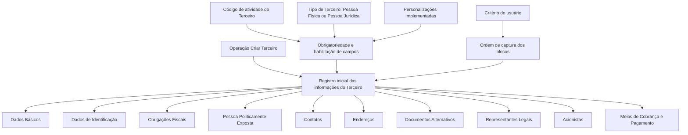

# Operação Criar Terceiro — Registro Inicial de Informações do Terceiro

## 1. Metadados do Documento
- **Arquivo de Origem:** `Não identificado — conteúdo bruto fornecido no prompt`
- **Tipo de Documento:** `Procedimento`
- **Domínio / Sistema:** `Operación Crear Tercero / Cadastro de Terceiros`
- **Público-Alvo:** `Usuários do Sistema, Analistas Funcionais e Operação`
- **Data/Versão Identificada:** `Não identificada`

---

## 2. Resumo Executivo & Contexto de Negócio

O documento descreve a operação **“Crear Tercero”**, destinada ao registro inicial das informações de um Terceiro nas diferentes estruturas ou blocos de dados disponíveis no sistema. O processo abrange informações cadastrais, identificação, obrigações fiscais, contatos, endereços, documentos, representantes legais, acionistas e meios de cobrança e pagamento.

A obrigatoriedade e a habilitação dos campos não são fixas para todos os registros. Esses comportamentos podem variar conforme o código de atividade associado ao Terceiro e conforme o tipo de Terceiro, que pode ser **Pessoa Física** ou **Pessoa Jurídica**.

O documento também informa que personalizações implementadas podem alterar o comportamento da aplicação quanto à obrigatoriedade do registro dos dados do Terceiro. Portanto, regras observadas na operação podem depender de customizações existentes no ambiente.

A sequência de preenchimento dos blocos de informação pode variar de acordo com o critério do usuário no sistema. Além disso, determinadas atividades de Terceiros não permitem o registro em todos os blocos exibidos no processo; os blocos afetados devem indicar e detalhar essa restrição expressamente.

---

## 3. Arquitetura, Componentes & Tecnologias Envolvidas

O conteúdo fornecido não apresenta arquitetura de software, integrações, tecnologias, microsserviços, URLs operacionais, contratos HTTP, bancos de dados ou ambientes técnicos. O documento descreve exclusivamente um fluxo funcional de registro de informações de Terceiros.

Os componentes funcionais identificados são os blocos de informação do processo de criação do Terceiro:

- Dados Básicos
- Dados de Identificação do Terceiro
- Obrigações Fiscais
- Pessoa Politicamente Exposta
- Contatos
- Endereços
- Documentos Alternativos
- Representantes Legais
- Acionistas
- Meios de Cobrança e Pagamento



> **Nota de Análise:** O documento não especifica quais campos pertencem a cada bloco, quais atividades restringem quais estruturas, nem quais personalizações podem ser aplicadas.

---

## 4. Regras de Negócio, Especificações Funcionais & Processos

### 4.1 Objetivo da operação

A operação **Criar Terceiro** consiste em registrar, pela primeira vez, as informações do Terceiro nas diferentes estruturas de dados que armazenam essas informações.

### 4.2 Variação por código de atividade

A obrigatoriedade e/ou a habilitação dos campos no registro de dados de cada bloco ou estrutura de informação podem variar de acordo com o código de atividade do Terceiro.

Essa regra significa que o código de atividade pode influenciar:

- Se determinado campo é obrigatório.
- Se determinado campo está habilitado para preenchimento.
- Quais blocos ou estruturas de informação permitem registro.

### 4.3 Variação por tipo de Terceiro

A obrigatoriedade e/ou a habilitação dos campos também podem variar conforme o tipo de Terceiro:

- Pessoa Física.
- Pessoa Jurídica.

O documento não especifica os campos obrigatórios, facultativos ou desabilitados para cada tipo de Terceiro.

### 4.4 Impacto de personalizações

Personalizações implementadas podem afetar o comportamento da aplicação relacionado à obrigatoriedade do registro dos dados do Terceiro.

> **Nota de Análise:** O documento reconhece a existência de personalizações, mas não identifica configurações, regras, responsáveis ou impactos específicos de cada personalização.

### 4.5 Ordem de captura de dados

A ordem de preenchimento dos dados nos diferentes blocos de informação pode variar conforme o critério adotado pelo usuário no sistema.

O documento não determina uma sequência obrigatória e fixa para o preenchimento dos blocos.

### 4.6 Restrições por atividade

Nem todas as atividades dos Terceiros permitem registrar informações em todas as estruturas exibidas no fluxo do processo. Quando houver restrição, os blocos de dados afetados devem indicar e detalhar expressamente essa condição.

---

## 5. Tabelas de Parâmetros, Ambientes e Estruturas de Dados

| Item / Parâmetro | Descrição / Função | Tipo / Valores / Formato | Ambiente / Observações |
| :--- | :--- | :--- | :--- |
| Operação Criar Terceiro | Registra pela primeira vez as informações do Terceiro nas estruturas de dados disponíveis. | Operação funcional de cadastro. | Não são informados sistema, URL ou ambiente. |
| Código de atividade do Terceiro | Pode determinar a obrigatoriedade e/ou habilitação dos campos de cada bloco. | Código de atividade; valores não especificados. | Pode restringir a disponibilidade de estruturas de informação. |
| Tipo de Terceiro | Pode determinar a obrigatoriedade e/ou habilitação de campos. | Pessoa Física ou Pessoa Jurídica. | Regras específicas por tipo não são detalhadas. |
| Personalizações implementadas | Podem alterar o comportamento da aplicação em relação à obrigatoriedade dos dados. | Personalizações não detalhadas. | Dependência de configurações ou implementações existentes. |
| Ordem de captura | Define a sequência adotada para registrar dados nos blocos de informação. | Critério do usuário no sistema. | O documento não exige ordem fixa. |
| Dados Básicos | Bloco de informação do processo. | Estrutura de dados; campos não informados. | Disponibilidade pode depender da atividade do Terceiro. |
| Dados de Identificação do Terceiro | Bloco de informação de identificação. | Estrutura de dados; campos não informados. | Disponibilidade pode depender da atividade e do tipo de Terceiro. |
| Obrigações Fiscais | Bloco apresentado no processo. | Estrutura de dados; campos não informados. | Sem detalhamento adicional. |
| Pessoa Politicamente Exposta | Bloco apresentado no processo. | Estrutura de dados; campos não informados. | Sem detalhamento adicional. |
| Contatos | Bloco apresentado no processo. | Estrutura de dados; campos não informados. | Sem detalhamento adicional. |
| Endereços | Bloco apresentado no processo. | Estrutura de dados; campos não informados. | Sem detalhamento adicional. |
| Documentos Alternativos | Bloco apresentado no processo. | Estrutura de dados; campos não informados. | Sem detalhamento adicional. |
| Representantes Legais | Bloco apresentado no processo. | Estrutura de dados; campos não informados. | Sem detalhamento adicional. |
| Acionistas | Bloco apresentado no processo. | Estrutura de dados; campos não informados. | Sem detalhamento adicional. |
| Meios de Cobrança e Pagamento | Bloco apresentado no processo. | Estrutura de dados; campos não informados. | Sem detalhamento adicional. |

---

## 6. Bateria de Perguntas & Respostas para RAG (FAQ Sintético)

### P1: Em que consiste a operação Criar Terceiro?
**R:** A operação Criar Terceiro consiste em registrar pela primeira vez as informações do Terceiro nos diferentes blocos ou estruturas de dados que contêm essas informações.

### P2: A obrigatoriedade dos campos é igual para todos os Terceiros?
**R:** Não. A obrigatoriedade e a habilitação dos campos podem variar de acordo com o código de atividade do Terceiro, o tipo de Terceiro e as personalizações implementadas na aplicação.

### P3: Quais tipos de Terceiro são citados no processo de criação?
**R:** O documento cita dois tipos de Terceiro: Pessoa Física e Pessoa Jurídica. A obrigatoriedade e a habilitação dos campos podem variar entre esses tipos.

### P4: O código de atividade do Terceiro influencia o cadastro?
**R:** Sim. O código de atividade do Terceiro pode influenciar a obrigatoriedade e/ou a habilitação dos campos nos blocos ou estruturas de informação.

### P5: As personalizações podem afetar a operação Criar Terceiro?
**R:** Sim. Personalizações implementadas podem alterar o comportamento da aplicação em relação à obrigatoriedade do registro dos dados do Terceiro.

### P6: Existe uma ordem obrigatória para preencher os blocos de informação?
**R:** Não. A ordem de captura dos dados nos diferentes blocos de informação pode variar conforme o critério seguido pelo usuário no sistema.

### P7: Quais blocos de informação são apresentados no processo Criar Terceiro?
**R:** O processo apresenta os blocos Dados Básicos, Dados de Identificação do Terceiro, Obrigações Fiscais, Pessoa Politicamente Exposta, Contatos, Endereços, Documentos Alternativos, Representantes Legais, Acionistas e Meios de Cobrança e Pagamento.

### P8: Todas as atividades de Terceiros permitem preencher todos os blocos de informação?
**R:** Não. O documento informa que nem todas as atividades de Terceiros permitem registrar informações em todas as estruturas apresentadas no processo.

### P9: Como devem ser comunicadas as restrições de registro em blocos de informação?
**R:** Quando uma atividade de Terceiro não permitir o registro em determinada estrutura de informação, essa condição deve ser indicada e detalhada expressamente nos blocos de dados afetados.

### P10: O documento detalha os campos de cada bloco de informação?
**R:** Não. O documento identifica os blocos de informação, mas não especifica os campos, formatos, validações ou critérios particulares de preenchimento de cada bloco.

---

## 7. Glossário de Termos, Siglas & Conceitos-Chave

- **Terceiro:** Entidade cujas informações são registradas pela operação Criar Terceiro.
- **Pessoa Física:** Tipo de Terceiro citado no documento; pode possuir regras específicas de obrigatoriedade e habilitação de campos.
- **Pessoa Jurídica:** Tipo de Terceiro citado no documento; pode possuir regras específicas de obrigatoriedade e habilitação de campos.
- **Código de atividade:** Identificador associado ao Terceiro que pode influenciar a obrigatoriedade, a habilitação de campos e a disponibilidade de estruturas de informação.
- **Bloco de Informação:** Estrutura funcional destinada ao registro de uma categoria de dados do Terceiro.
- **Obrigatoriedade:** Condição que determina a necessidade de registrar determinado campo ou dado.
- **Habilitação:** Condição que determina se um campo está disponível para preenchimento.
- **Pessoa Politicamente Exposta:** Bloco de informação listado no processo. O documento não apresenta definição adicional.
- **Personalizações:** Implementações que podem alterar o comportamento da aplicação em relação à obrigatoriedade de dados.

---

## 8. Notas Críticas, Riscos & Limitações

- O documento não identifica o sistema, a aplicação, o ambiente, a versão, a data ou os responsáveis pelo processo.
- Não há especificação de campos, tipos de dados, formatos, validações, mensagens de erro ou critérios de aceite.
- O documento não detalha quais códigos de atividade habilitam, desabilitam ou tornam obrigatórios os blocos e campos.
- Não são apresentadas regras específicas para Pessoa Física e Pessoa Jurídica.
- As personalizações são citadas como fator de impacto, mas não são descritas.
- Não há detalhamento dos critérios para classificar ou registrar Pessoa Politicamente Exposta.
- O documento não fornece um fluxo obrigatório de preenchimento; a sequência pode depender do critério do usuário.
- Não são apresentados endpoints, URLs, integrações, logs, permissões, contratos de dados ou tecnologias de implementação.

---

## 9. Conteúdo Bruto Estruturado (Referência Fiel)

```text
--- [PÁGINA 1 DE 2] ---

OPERACIÓN CREAR Tercero
¿En que consiste?
Esta operación consiste en registrar por primera vez la Información del Tercero en los distintos
bloques o estructuras de datos que la contienen.
Premisas
La obligatoriedad y/o la habilitación de los campos en el registro de los datos de cada uno de
los bloques o estructuras de información puede variar de acuerdo con el código de actividad
del Tercero.
La obligatoriedad y/o la habilitación de los campos en el registro de los datos de cada uno de
los bloques o estructuras de información también pueden variar si el Tipo de Tercero es una
Persona Física o una Persona Jurídica.
Las personalizaciones que se hubieran podido implementar a su vez pueden afectar el
comportamiento de la aplicación en relación con la obligatoriedad en el registro de los Datos del
Tercero.
Por último, el orden de captura de los datos en los distintos bloques de Información puede
variar de acuerdo con el criterio seguido por el Usuario en el Sistema.
Ejemplo:
 /
 CF
Home Solutions APIs Documentation Zeus
EN

--- [PÁGINA 2 DE 2] ---

Proceso
Datos
Básicos
Datos
Identificación
Obligaciones
Fiscales
Persona
Políticamente
Expuesta
Contactos Direcciones Documentos
Alternativos
Representantes
Legales Accionistas Medios de Cobro y Pago
No todas las Actividades de los Terceros permiten registrar la información en todas y cada
una de las estructuras de Información que se muestran en el Proceso dibujado, lo que indicará y
detallará expresamente en los Bloques de Datos afectados.
BLOQUES de Información
 Datos Básicos ( )
 Datos Identificación del Tercero ( )
 Persona Políticamente Expuesta ( )  Contactos ( )  Direcciones ( )  Documentos
Alternativos ( )  Representantes Legales ( )  Accionistas ( )  Medios de Cobro y Pago (
)
```
