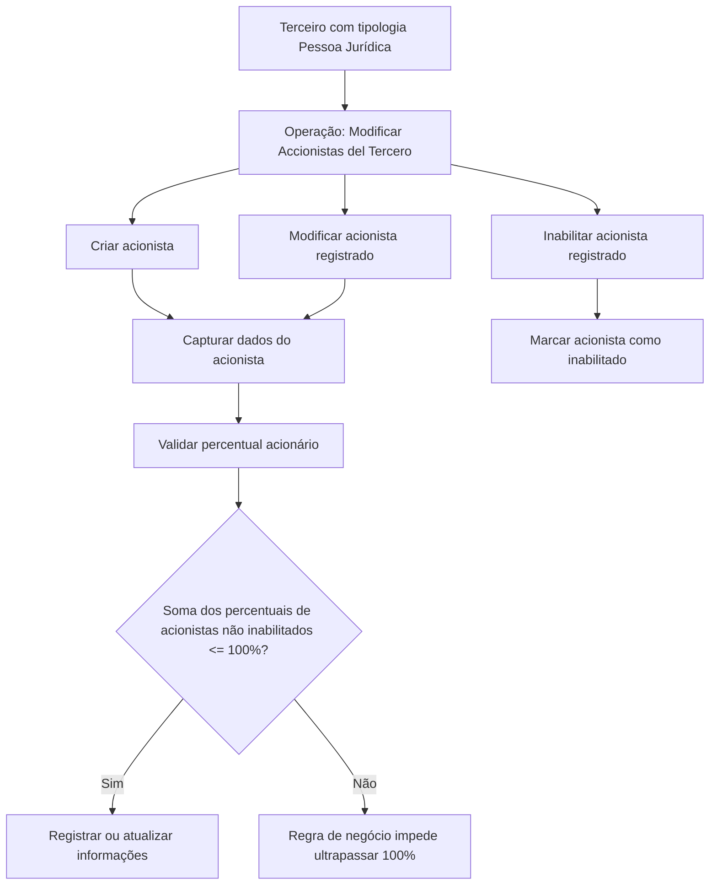

# Operação “Modificar Accionistas del Tercero” — Gestão de Acionistas de Pessoa Jurídica

## 1. Metadados do Documento
- **Arquivo de Origem:** `Não identificado`
- **Tipo de Documento:** `Especificação Técnica / Funcional`
- **Domínio / Sistema:** `Gestão de Terceiros e Acionistas`
- **Público-Alvo:** `Negócio, Operação, Desenvolvedores e Arquitetos`
- **Data/Versão Identificada:** `Não identificada`

---

## 2. Resumo Executivo & Contexto de Negócio

O documento descreve a operação **“Modificar Accionistas del Tercero”**, destinada a registrar, modificar ou inabilitar informações de acionistas previamente associados a um Terceiro. A operação também permite o registro de novos acionistas para o Terceiro.

A funcionalidade é aplicável quando a tipologia do Terceiro corresponde a uma **Pessoa Jurídica**. Nesse contexto, a identificação dos acionistas permite que a entidade seguradora gerencie e controle, em seus processos internos, requisitos relacionados à prevenção de lavagem de ativos monetários.

O documento define os atributos utilizados para identificação, cadastro e manutenção dos acionistas, incluindo documento, nacionalidade, nome, sobrenomes ou razão social, datas de alta e baixa, percentual acionário, cargo, validade, condição de Pessoa Politicamente Exposta e inabilitação.

Existe uma regra de validação explícita para os percentuais acionários: a soma dos percentuais dos acionistas que **não estejam inabilitados** não pode ultrapassar 100%. O documento também destaca a data de validade como mecanismo para manter histórico das alterações efetuadas nas informações dos acionistas.

---

## 3. Arquitetura, Componentes & Tecnologias Envolvidas

O conteúdo não descreve arquitetura de software, microsserviços, integrações, contratos de API, bancos de dados, ambientes, URLs ou tecnologias implementadas. O documento apresenta exclusivamente uma operação funcional do sistema relacionada ao cadastro e à manutenção de acionistas de um Terceiro.

Componentes funcionais identificados:

| Componente | Função descrita |
| :--- | :--- |
| Operação “Modificar Accionistas del Tercero” | Permite criar, modificar ou inabilitar acionistas associados a um Terceiro. |
| Terceiro | Entidade à qual os acionistas estão associados; a operação se aplica quando o Terceiro é Pessoa Jurídica. |
| Acionista | Pessoa física ou jurídica identificada como detentora de direitos acionários relacionados ao Terceiro. |
| Catálogo de Cargos | Catálogo existente no sistema que define os valores possíveis para o cargo acionário. |
| Tipos de documentos configurados | Configuração prévia do sistema que determina os tipos documentais disponíveis para identificação do acionista. |



> **Nota de Análise:** O diagrama representa o fluxo funcional explicitamente descrito. O documento não detalha telas, serviços, métodos HTTP, contratos JSON, persistência de dados ou comportamento técnico de validações.

---

## 4. Regras de Negócio, Especificações Funcionais & Processos

### 4.1 Escopo da operação

A operação permite atuar sobre os acionistas registrados em um Terceiro por meio das seguintes ações:

- **Criar:** registrar um novo acionista do Terceiro.
- **Modificar:** alterar informações de um acionista previamente registrado no Terceiro.
- **Inabilitar:** estabelecer que um acionista está inabilitado no sistema.

### 4.2 Condição de aplicabilidade

A identificação dos acionistas do Terceiro é aplicável desde que a tipologia do Terceiro corresponda a uma **Pessoa Jurídica**.

### 4.3 Finalidade de controle

A identificação de acionistas permite à entidade seguradora cumprir requisitos de prevenção de lavagem de ativos monetários, por meio da gestão e do controle desse cenário nos processos internos.

### 4.4 Sequência de captura ou modificação

O documento determina que os campos devem ser considerados da esquerda para a direita e de cima para baixo como sequência de captura ou modificação do Terceiro no sistema:

1. Tipo Documento Accionista.
2. Clave del Documento Accionista.
3. Nacionalidad del Accionista.
4. Nombre.
5. Apellidos.
6. Fecha de Alta.
7. Fecha de Baja.
8. Porcentaje Accionarial.
9. Cargo.
10. Fecha de Validez.
11. Marca Persona Políticamente Expuesta.
12. Inhabilitación.

### 4.5 Regra de percentual acionário

A soma dos percentuais acionários dos acionistas que não estejam inabilitados não pode superar 100%.

Formalmente, considerando apenas acionistas ativos:

```text
Soma dos Porcentajes Accionariales dos acionistas não inabilitados <= 100%
```

### 4.6 Regras sobre datas

- **Fecha de Alta:** identifica a data em que o acionista passa a ter direitos acionários do Terceiro.
- **Fecha de Baja:** identifica a data em que o acionista deixa de possuir direitos acionários em relação ao Terceiro ao qual está associado.
- **Fecha de Validez:** indica ao sistema a data a partir da qual o acionista do Terceiro estará plenamente operativo no sistema.
- O uso correto da **Fecha de Validez** permite manter histórico das alterações efetuadas nas informações do acionista.

### 4.7 Identificação de Pessoa Politicamente Exposta

A marca de **Persona Políticamente Expuesta** permite identificar o acionista como Pessoa Politicamente Exposta. Essa marca possibilita à entidade seguradora gerir e controlar internamente essa condição.

### 4.8 Inabilitação

A propriedade **Inhabilitación** estabelece que o acionista está inabilitado no sistema. Acionistas inabilitados não devem ser considerados na soma dos percentuais acionários para a validação do limite máximo de 100%.

---

## 5. Tabelas de Parâmetros, Ambientes e Estruturas de Dados

| Item / Parâmetro | Descrição / Função | Tipo / Valores / Formato | Ambiente / Observações |
| :--- | :--- | :--- | :--- |
| Tipo Documento Accionista | Mostra ou registra o tipo de documento utilizado para identificar a pessoa física ou jurídica acionista. | Tipos de documentos previamente configurados no sistema. | Aplicável à identificação do acionista. |
| Clave del Documento Accionista | Mostra a chave do documento do acionista. | Não detalhado. | O documento não especifica formato, tamanho ou validações. |
| Nacionalidad del Accionista | Mostra o país de nacionalidade do acionista. | País de nacionalidade. | O documento não detalha catálogo ou formato do país. |
| Nombre | Contém o nome do acionista. | Não detalhado. | Aplicável ao acionista. |
| Apellidos | Permite mostrar e modificar os sobrenomes ou a razão social do acionista. | Sobrenomes ou razão social. | Pode representar pessoa física ou pessoa jurídica. |
| Fecha de Alta | Identifica a data em que o acionista possui direitos acionários do Terceiro. | Data. | Relacionada aos direitos acionários. |
| Fecha de Baja | Identifica a data em que o acionista deixa de ter direitos acionários no Terceiro associado. | Data. | Relacionada ao encerramento dos direitos acionários. |
| Porcentaje Accionarial | Identifica o percentual acionário do acionista em relação ao número de ações emitidas pelo Terceiro. | Percentual. | A soma dos percentuais de acionistas não inabilitados não pode superar 100%. |
| Cargo | Identifica o cargo acionário mantido pelo acionista. | Valores definidos no catálogo de Cargos existente no sistema. | Dependência do catálogo de Cargos. |
| Fecha de Validez | Indica a data a partir da qual o acionista estará plenamente operativo no sistema. | Data. | Permite manter histórico das alterações da informação do acionista. |
| Marca Persona Políticamente Expuesta | Identifica o acionista como Pessoa Politicamente Exposta. | Marca. | Permite gestão e controle interno dessa condição pela entidade seguradora. |
| Inhabilitación | Estabelece que o acionista está inabilitado no sistema. | Propriedade ou marca de inabilitação. | Acionistas inabilitados não entram na soma do percentual acionário para o limite de 100%. |
| Ação: CREAR | Registra um novo acionista do Terceiro. | Ação operacional. | O documento não detalha critérios adicionais para criação. |
| Ação: MODIFICAR | Altera informações de acionistas previamente registrados no Terceiro. | Ação operacional. | O documento não detalha permissões ou trilha de auditoria. |
| Ação: INHABILITAR | Inabilita um acionista registrado no Terceiro. | Ação operacional. | A inabilitação altera a consideração do acionista no cálculo de percentual acionário. |

> **Nota de Análise:** O documento não apresenta servidores, URLs, portas, variáveis de configuração, rotas de logs, ambientes de implantação, esquemas de banco de dados ou contratos técnicos de integração.

---

## 6. Bateria de Perguntas & Respostas para RAG (FAQ Sintético)

### P1: Qual é o objetivo da operação “Modificar Accionistas del Tercero”?
**R:** A operação permite registrar novos acionistas, modificar informações de acionistas já registrados e inabilitar acionistas associados a um Terceiro.

### P2: Em que situação a identificação de acionistas deve ser utilizada?
**R:** A identificação de acionistas deve ser utilizada quando a tipologia do Terceiro corresponde a uma Pessoa Jurídica.

### P3: Qual é a finalidade corporativa de identificar os acionistas de um Terceiro?
**R:** A identificação permite que a entidade seguradora gerencie e controle, em seus processos internos, requisitos relacionados à prevenção de lavagem de ativos monetários.

### P4: Quais ações estão disponíveis para a gestão de acionistas do Terceiro?
**R:** As ações disponíveis são CREAR, MODIFICAR e INHABILITAR. Elas correspondem, respectivamente, ao registro de um novo acionista, à alteração de dados de um acionista registrado e à sua inabilitação no sistema.

### P5: Qual é a regra para validar a soma dos percentuais acionários?
**R:** A soma dos percentuais acionários dos acionistas que não estejam inabilitados não pode superar 100%.

### P6: Acionistas inabilitados devem ser incluídos na validação do percentual acionário total?
**R:** Não. A regra informa que somente os percentuais dos acionistas que não estejam inabilitados devem ser considerados para garantir que a soma não ultrapasse 100%.

### P7: O que representa a Fecha de Alta de um acionista?
**R:** A Fecha de Alta identifica a data em que o acionista passa a ter direitos acionários do Terceiro.

### P8: O que representa a Fecha de Baja de um acionista?
**R:** A Fecha de Baja identifica a data em que o acionista deixa de possuir direitos acionários em relação ao Terceiro ao qual está associado.

### P9: Para que serve a Fecha de Validez?
**R:** A Fecha de Validez indica a data a partir da qual o acionista do Terceiro estará plenamente operativo no sistema. O uso correto dessa propriedade permite manter histórico dos cambios efetuados nas informações do acionista.

### P10: Como o sistema identifica o tipo de documento de um acionista?
**R:** O atributo Tipo Documento Accionista mostra ou registra o tipo de documento utilizado para identificar a pessoa física ou jurídica acionista, de acordo com os tipos documentais previamente configurados no sistema.

### P11: Como é definido o cargo acionário de um acionista?
**R:** O campo Cargo identifica o cargo acionário sustentado pelo acionista conforme os valores possíveis definidos no catálogo de Cargos existente no sistema.

### P12: Qual é a finalidade da marca Persona Políticamente Expuesta?
**R:** A marca permite identificar o acionista como Pessoa Politicamente Exposta, possibilitando que a entidade seguradora gerencie e controle internamente essa condição.

---

## 7. Glossário de Termos, Siglas & Conceitos-Chave

- **Accionista / Acionista:** Pessoa física ou jurídica associada ao Terceiro e identificada como detentora de direitos acionários.
- **Apellidos:** Sobrenomes do acionista ou razão social, conforme o tipo de pessoa.
- **Cargo:** Cargo acionário sustentado pelo acionista, definido conforme o catálogo de Cargos existente no sistema.
- **Clave del Documento Accionista:** Chave do documento do acionista.
- **Fecha de Alta:** Data em que o acionista possui direitos acionários do Terceiro.
- **Fecha de Baja:** Data em que o acionista deixa de possuir direitos acionários em relação ao Terceiro.
- **Fecha de Validez:** Data a partir da qual o acionista estará plenamente operativo no sistema; permite histórico das alterações de informações.
- **Inhabilitación:** Propriedade que estabelece que o acionista está inabilitado no sistema.
- **Marca Persona Políticamente Expuesta:** Marca para identificação de acionista como Pessoa Politicamente Exposta.
- **Persona Jurídica / Pessoa Jurídica:** Tipologia de Terceiro para a qual a identificação de acionistas é aplicável.
- **Porcentaje Accionarial:** Percentual acionário do acionista em relação ao número de ações emitidas pelo Terceiro.
- **Tercero / Terceiro:** Entidade à qual os acionistas estão associados.
- **Tipos de documentos configurados:** Tipos documentais previamente configurados no sistema e disponíveis para identificação do acionista.

---

## 8. Notas Críticas, Riscos & Limitações

- A soma dos percentuais acionários de acionistas não inabilitados não pode ultrapassar 100%; qualquer operação de criação ou modificação deve respeitar essa regra.
- O cargo acionário depende dos valores definidos no catálogo de Cargos existente no sistema.
- O tipo de documento do acionista depende de tipos de documentos previamente configurados no sistema.
- A operação é explicitamente contextualizada para Terceiros cuja tipologia seja Pessoa Jurídica.
- A Fecha de Validez é relevante para preservar histórico das alterações efetuadas nas informações do acionista.
- O documento não especifica formato de datas, escala ou precisão do percentual acionário, obrigatoriedade de campos, permissões, mensagens de erro, critérios de inabilitação ou comportamento de auditoria.
- O documento não detalha APIs, métodos HTTP, contratos JSON, integrações, tecnologias, ambientes, URLs, servidores ou mecanismos técnicos de persistência.

---

## 9. Conteúdo Bruto Estruturado (Referência Fiel)

```text
--- [PÁGINA 1 DE 3] ---

MODIFICAR Accionistas del Tercero
Objetivo
Una acción  en el mercado financiero es un título emitido por una Sociedad Anónima o Sociedad
comanditaria por acciones que representa el valor de una de las fracciones iguales en que se divide
su capital social.
La identificación de los Accionistas del Tercero, siempre y cuando la tipología del Tercero
corresponda a una Persona Jurídica, permite a la entidad aseguradora cumplir con la normativa de
prevención de lavado de activos monetarios gestionando y controlando en sus procesos internos
dicho supuesto.
Esta Operación permite Registrar, Modificar ó Inhabilitar la información de los accionistas que se
encontraran registrados previamente en el Tercero además de Registrar nuevos Accionistas del
Tercero.
Posibles Acciones
 CREAR ( )
 MODIFICAR ( )
 INHABILITAR ( )
Accionistas
 / 
 RS
Inicio Soluciones APIs Documentación Zeus
ES


--- [PÁGINA 2 DE 3] ---

De Izquierda a Derecha y de Arriba hacia Abajo, los siguientes campos marcan la secuencia de
captura o modificación del Tercero en el sistema.
Tipo Documento Accionista (  )
Este Atributo del colapsador muestra o registrará el tipo de documento con el que se va a identificar a
la persona física o jurídica accionista de acuerdo con los tipos de documentos que hayan sido
configurados en el sistema previamente.
Clave del Documento Accionista (  )
Este Atributo del panel muestra la clave del documento del Accionista.
Nacionalidad del Accionista (   )
Este Atributo del panel mostrará el país de nacionalidad del Accionista.
Nombre (  )
Este Atributo del colapsador contendrá el nombre del Accionista.
Apellidos (  )
Estos dos Atributos del colapsador permiten mostrar y modificar los Apellidos o la Razón Social del
accionista.
Fecha de Alta (  )
Este Campo identifica la fecha en la que el Accionista tiene los derechos accionariales del Tercero.
Fecha de Baja (  )
Este Campo identifica la fecha en la que el Accionista causa baja en relación con los derechos
accionariales del Tercero al que está asociado.
Porcentaje Accionarial (  )
Este Campo identifica el Porcentaje accionarial del Accionista en relación al número de acciones
emitidas por el Tercero.


--- [PÁGINA 3 DE 3] ---

La Suma de los porcentajes accionariales de los Accionistas que no estén inhabilitados no puede
superar el 100%.
Cargo (  )
Este Campo identifica el Cargo Accionarial que sustenta el Accionista de acuerdo con los posibles
valores en los cargos definidos en el catálogo de Cargos existente en el Sistema.
Fecha de Validez ( )
Esta propiedad le indica al sistema la fecha a partir de la cual el Accionista del Tercero estará
plenamente operativo en el sistema por lo que su correcto uso permite tener un histórico de los
cambios efectuados con su información.
Marca Persona Políticamente Expuesta (  )
Este Atributo permite identificar al Accionista como Persona Políticamente Expuesta, marca que
permitiría a la entidad aseguradora gestionar y controlar en sus procesos internos este hecho.
Inhabilitación (  )
Esta propiedad establece que el Accionista está inhabilitado en el sistema.
```
