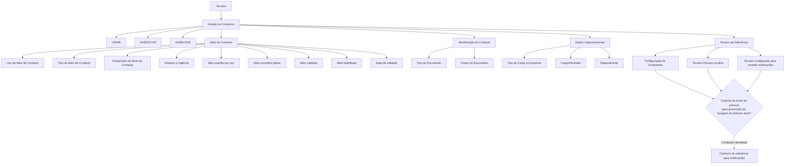

# Gestão de Contactos de Terceiros — Especificação Funcional de Cadastro, Validação e Priorização

## 1. Metadados do Documento
- **Arquivo de Origem:** Não identificado — conteúdo bruto fornecido pelo usuário, composto por 4 páginas.
- **Tipo de Documento:** Especificação Técnica / Manual Funcional.
- **Domínio / Sistema:** Gestão de Terceiros e Meios de Contacto em entidade seguradora.
- **Público-Alvo:** Analistas funcionais, desenvolvedores, equipas de operação e negócio.
- **Data/Versão Identificada:** Não identificada.

---

## 2. Resumo Executivo & Contexto de Negócio

O documento descreve a funcionalidade de gestão de contactos associados a um **Tercero** (terceiro), permitindo registar novos contactos e complementar, modificar ou inabilitar dados de contactos preexistentes. A funcionalidade é aplicável a terceiros que podem ser pessoas físicas ou pessoas jurídicas, sendo que os dados requeridos variam conforme essa classificação.

O cadastro de cada contacto inclui a classificação do uso e do tipo de meio de contacto, o valor efetivo do meio — como endereço de correio eletrónico ou telefone —, identificação documental, dados organizacionais e localização geográfica. Parte dos atributos depende de classificações, catálogos ou configurações previamente existentes no sistema.

O documento também define regras de qualidade, vigência e preferência para meios de contacto. Um meio pode ser validado pela entidade seguradora, marcado como inabilitado quando deixa de vigorar e possuir uma data a partir da qual se torna plenamente operacional. Esses elementos suportam o histórico das alterações de informação do meio de contacto.

Há duas regras de exclusividade relevantes. Para cada uso de meio de contacto atribuído ao terceiro, pode existir apenas um meio marcado como padrão. Independentemente do uso associado, pode existir apenas um meio de contacto prioritário para o conjunto total de meios de contacto do terceiro.

A funcionalidade prevê ainda a indicação de um contacto como pessoa de referência para notificações. Essa indicação é condicionada à ativação, na configuração da companhia, do controlo no limite de prémios para prevenção de lavagem de dinheiro, além de exigir que o terceiro seja uma pessoa jurídica e esteja configurado para receber notificações.

---

## 3. Arquitetura, Componentes & Tecnologias Envolvidas

O conteúdo fornecido não descreve arquitetura de software, microsserviços, APIs, protocolos, bases de dados, tecnologias, ambientes ou integrações técnicas. A especificação concentra-se no comportamento funcional da tela de gestão de contactos de terceiros.

Os componentes funcionais identificados são:

- **Tela de Contactos:** interface para criar, modificar ou inabilitar contactos de um terceiro.
- **Terceiro:** entidade à qual os contactos e meios de contacto são associados.
- **Pessoa Física / Pessoa Jurídica:** classificação do terceiro que influencia os dados solicitados.
- **Meio de Contacto:** registo com uso, tipo, valor, estado de validação, vigência e prioridades.
- **Classificações e Catálogos do Sistema:** fontes de valores para uso de contacto, tipo de meio, tipo de documento, cargos, departamentos e países.
- **Configuração da Companhia:** origem da condição relativa ao controlo no limite de prémios para prevenção de lavagem de dinheiro.
- **Processos Operativos:** consumidores dos meios de contacto padrão e prioritário.
- **Notificações:** comunicações destinadas ao contacto de referência quando as condições aplicáveis forem atendidas.



> **Nota de Análise:** O documento não detalha métodos HTTP, contratos JSON, persistência de dados, regras de autenticação, permissões, URLs, servidores ou tecnologias de implementação.

---

## 4. Regras de Negócio, Especificações Funcionais & Processos

### 4.1 Objetivo funcional

A tela de contactos deve permitir que o sistema:

1. Registe novos contactos de um terceiro.
2. Complemente a informação de contactos preexistentes.
3. Modifique a informação de contactos preexistentes.
4. Inabilite a informação de contactos preexistentes.

### 4.2 Ações possíveis

As ações explicitamente listadas para a funcionalidade são:

- **CRIAR**
- **MODIFICAR**
- **INABILITAR**

### 4.3 Variação conforme natureza do terceiro

Os dados solicitados para registar possíveis contactos de uma pessoa física variam em relação aos dados solicitados para uma pessoa jurídica. O documento não apresenta uma matriz detalhada com os campos exclusivos ou obrigatórios para cada natureza de terceiro.

### 4.4 Sequência de captura e modificação

O documento estabelece que os campos devem ser considerados na sequência apresentada, da esquerda para a direita e de cima para baixo. A ordem indicada corresponde à sequência de captura ou modificação do terceiro no sistema.

### 4.5 Classificação do uso e tipo de meio de contacto

- O atributo **Uso do Meio de Contacto** contém um valor pertencente à classificação de usos de contactos de terceiros.
- A classificação de usos deve ser revista pela entidade seguradora para assegurar o seu correto emprego e exploração nos processos internos.
- O atributo **Tipo do Meio de Contacto** contém um dos valores da classificação de tipos de meios de contacto de terceiros.
- A classificação de tipos de meios de contacto deve ser revista pela entidade seguradora para a sua consideração e utilização posteriores nos processos internos.

### 4.6 Sequência automática do meio de contacto

O campo **Sequência do Meio de Contacto** representa o número de sequência na captura dos meios de contacto do terceiro. Esse valor é atribuído automaticamente pelo sistema.

### 4.7 Formato do valor do meio de contacto

A **Chave/valor do Meio de Contacto** deve conter o valor real correspondente ao tipo de meio de contacto selecionado.

- Se o tipo associado for **Correio eletrónico**, o valor deve possuir formato e conteúdo de e-mail, como `xxxxxx@zzzzzz.zzz`.
- Se o tipo associado for **Telefone**, o valor deve possuir formato e conteúdo próprios de telefone, como `< +99 99 9999 9999 >`.
- Para números de telefone, o formato deve observar as regras dos Planos Nacionais de Numeração Telefónica dos países.

### 4.8 Dados pessoais e documentais do contacto

- **Nome do Meio de Contacto:** contém o nome ou os nomes da pessoa que atua como meio de contacto.
- **Primeiro e Segundo Apelido do Contacto:** contém o apelido ou os apelidos da pessoa que atua como meio de contacto.
- **Tipo Documento:** identifica o tipo de documento usado para identificar a pessoa física ou jurídica que atua como contacto, conforme os tipos configurados previamente no sistema.
- **Chave do Documento:** contém a chave documental que identifica a pessoa do contacto.

### 4.9 Dados organizacionais do contacto

- **Tipo de Cargo na Empresa:** contém um valor da classificação de cargos de pessoas em empresas, associado ao contacto.
- **Cargo/Atividade do Contacto:** contém o código do posto que identifica o contacto, de acordo com o catálogo de cargos existente no sistema.
- **Departamento do Contacto:** contém o código do departamento ou secção que identifica o contacto, de acordo com o catálogo de departamentos de empresa existente no sistema.
- **Relação:** campo de texto livre destinado a detalhar ou ampliar a informação sobre o departamento do contacto ou a relação entre o contacto e o terceiro.

### 4.10 Localização geográfica

A **Chave do País** contém o código do primeiro nível da estrutura geográfica, correspondente a países, no qual o meio de contacto do terceiro é identificado. O valor deve pertencer ao catálogo de países existente no sistema.

### 4.11 Regras para terceiro de referência

O campo **Tercero de Referência** indica que o contacto é a pessoa de referência à qual devem ser enviadas as notificações correspondentes.

A condição é aplicável quando todos os seguintes critérios são atendidos:

1. O controlo no limite de prémios para prevenção de lavagem de dinheiro está ativo na configuração da companhia.
2. O terceiro em captura é uma pessoa jurídica.
3. Na informação do terceiro, foi indicado que devem ser enviadas notificações ao terceiro.

### 4.12 Regra de meio de contacto padrão

O campo **Meio de Contacto por Defeito** aplica-se a terceiros que possuem mais de um meio de contacto associado.

- O campo identifica qual meio deve ser considerado como padrão nos processos e procedimentos operativos que necessitem dessa distinção.
- Só pode existir **um** meio de contacto identificado e marcado como padrão para **cada uso** de meio de contacto atribuído ao terceiro.

### 4.13 Regra de meio de contacto prioritário

O campo **Meio de Contacto Prioritário** aplica-se a terceiros que possuem mais de um meio de contacto associado.

- O campo identifica qual meio deve ser considerado preferencialmente nos processos operativos que necessitem utilizá-lo.
- Só pode existir **um** meio de contacto prioritário para o **total dos meios de contacto** do terceiro, independentemente do uso associado.

### 4.14 Validação, inabilitação e vigência

- **Meio de Contacto Validado:** indica se o meio de contacto foi efetivamente validado pela entidade seguradora para efeitos de qualidade do dado.
- **Inabilitação:** estabelece se o meio de contacto associado ao terceiro deixou de estar em vigor; um meio inabilitado não deve ser considerado em nenhum processo da entidade.
- **Data de Validade:** indica ao sistema a data a partir da qual o meio de contacto se torna plenamente operativo. O uso correto desse campo permite manter um histórico das alterações efetuadas na informação do meio de contacto do terceiro.
- **Observações:** permite capturar texto simples para ampliar ou detalhar a informação do meio de contacto do terceiro.

---

## 5. Tabelas de Parâmetros, Ambientes e Estruturas de Dados

| Item / Parâmetro | Descrição / Função | Tipo / Valores / Formato | Ambiente / Observações |
| :--- | :--- | :--- | :--- |
| Ação | Operação disponível na gestão de contactos. | CRIAR, MODIFICAR, INABILITAR. | O documento lista estas três ações. |
| Uso do Meio de Contacto | Classifica o uso atribuído ao contacto do terceiro. | Valor de classificação de usos. | A classificação deve ser revista pela entidade seguradora. |
| Sequência do Meio de Contacto | Identifica a sequência de captura dos meios de contacto de um terceiro. | Número de sequência. | Atribuído automaticamente pelo sistema. |
| Tipo do Meio de Contacto | Classifica o tipo de meio de contacto do terceiro. | Valor de classificação de tipos. | A classificação deve ser revista pela entidade seguradora. |
| Chave/valor do Meio de Contacto | Armazena o valor real do meio de contacto conforme o tipo selecionado. | E-mail: `xxxxxx@zzzzzz.zzz`; telefone: `< +99 99 9999 9999 >`. | Telefones devem seguir os Planos Nacionais de Numeração Telefónica dos países. |
| Nome do Meio de Contacto | Regista o nome ou nomes da pessoa que atua como contacto. | Texto. | Não são definidos limites, obrigatoriedade ou validações adicionais. |
| Primeiro e Segundo Apelido do Contacto | Regista o apelido ou apelidos da pessoa que atua como contacto. | Texto. | Não são definidos limites, obrigatoriedade ou validações adicionais. |
| Tipo Documento | Define o tipo de documento de identificação da pessoa física ou jurídica que é contacto. | Tipo de documento previamente configurado. | Os tipos devem estar configurados previamente no sistema. |
| Chave do Documento | Identifica documentalmente a pessoa do contacto. | Chave documental. | O formato não é detalhado. |
| Tipo de Cargo na Empresa | Classifica o cargo da pessoa na empresa, associado ao contacto. | Valor de classificação de cargos. | A classificação específica não é apresentada. |
| Cargo/Atividade do Contacto | Identifica o contacto por código de posto. | Código existente no catálogo de cargos. | Depende do catálogo de cargos do sistema. |
| Departamento do Contacto | Identifica o contacto por departamento ou secção. | Código existente no catálogo de departamentos de empresa. | Depende do catálogo de departamentos de empresa. |
| Chave do País | Identifica o país relacionado ao meio de contacto. | Código de país. | Primeiro nível da estrutura geográfica; depende do catálogo de países. |
| Relação | Detalha o departamento ou a relação entre contacto e terceiro. | Texto livre. | Campo destinado a complementação de informação. |
| Tercero de Referência | Indica o contacto que deve receber notificações correspondentes. | Indicador. | Exige controlo de limite de prémios para prevenção de lavagem de dinheiro ativo, terceiro pessoa jurídica e envio de notificações indicado. |
| Meio de Contacto por Defeito | Define o meio padrão para processos ou procedimentos operativos. | Indicador. | Máximo de um meio padrão para cada uso de meio de contacto do terceiro. |
| Meio de Contacto Prioritário | Define o meio preferencial para processos operativos. | Indicador. | Máximo de um meio prioritário para o conjunto total de meios de contacto do terceiro. |
| Meio de Contacto Validado | Regista se a entidade seguradora validou o meio para qualidade do dado. | Indicador. | A forma de validação não é detalhada. |
| Inabilitação | Indica que o meio de contacto deixou de estar em vigor. | Indicador. | Um meio inabilitado não deve ser considerado em nenhum processo da entidade. |
| Data de Validade | Define a data a partir da qual o meio de contacto é plenamente operativo. | Data. | Permite manter histórico das alterações do meio de contacto. |
| Observações | Amplia ou detalha a informação do meio de contacto. | Texto simples. | Não são definidos limites ou formato. |

> **Nota de Análise:** O documento não fornece informações sobre ambientes técnicos, servidores, URLs, rotas de log, variáveis de configuração, APIs, portas ou estruturas físicas de dados.

---

## 6. Bateria de Perguntas & Respostas para RAG (FAQ Sintético)

### P1: Quais ações a tela de contactos de terceiros permite executar?
**R:** A tela permite criar novos contactos, modificar contactos preexistentes e inabilitar contactos ou meios de contacto associados ao terceiro. O objetivo funcional também inclui complementar a informação de contactos preexistentes.

### P2: Como o sistema define a sequência de um meio de contacto de um terceiro?
**R:** O campo **Sequência do Meio de Contacto** contém o número de sequência utilizado na captura dos meios de contacto do terceiro. Esse valor é atribuído automaticamente pelo sistema.

### P3: Como deve ser preenchida a chave ou valor de um meio de contacto?
**R:** A **Chave/valor do Meio de Contacto** deve conter o valor real compatível com o tipo de meio selecionado. Para correio eletrónico, deve apresentar formato de e-mail, como `xxxxxx@zzzzzz.zzz`. Para telefone, deve apresentar formato telefónico, como `< +99 99 9999 9999 >`, em conformidade com os Planos Nacionais de Numeração Telefónica dos países.

### P4: Quem mantém as classificações de uso e tipo de meio de contacto?
**R:** O documento informa que as classificações de usos de contactos e de tipos de meios de contacto devem ser revistas pela entidade seguradora, para garantir o seu correto emprego e exploração nos processos internos.

### P5: Quantos meios de contacto padrão um terceiro pode ter?
**R:** Um terceiro pode ter apenas um meio de contacto marcado como padrão para cada uso de meio de contacto que lhe tenha sido atribuído. A regra é por uso, não para o total geral de meios de contacto.

### P6: Quantos meios de contacto prioritários podem existir para um terceiro?
**R:** Pode existir apenas um meio de contacto prioritário para o conjunto total de meios de contacto do terceiro, independentemente do uso associado a cada meio.

### P7: Quando um contacto pode ser indicado como terceiro de referência para notificações?
**R:** Um contacto pode ser indicado como pessoa de referência para notificações quando o controlo no limite de prémios para prevenção de lavagem de dinheiro estiver ativo na configuração da companhia, o terceiro em captura for uma pessoa jurídica e a informação do terceiro indicar que lhe devem ser enviadas notificações.

### P8: O que significa marcar um meio de contacto como validado?
**R:** A marcação de **Meio de Contacto Validado** indica que o meio foi efetivamente validado pela entidade seguradora para fins de qualidade do dado. O documento não detalha o processo ou os critérios utilizados para essa validação.

### P9: Qual é o efeito funcional da inabilitação de um meio de contacto?
**R:** A inabilitação estabelece que o meio de contacto associado ao terceiro deixou de estar em vigor. Como consequência, esse meio não deve ser considerado em nenhum processo da entidade.

### P10: Qual é a finalidade da data de validade de um meio de contacto?
**R:** A **Data de Validade** informa a data a partir da qual o meio de contacto passa a ser plenamente operativo. O preenchimento correto desse dado permite ao sistema manter um histórico das alterações efetuadas nas informações do meio de contacto do terceiro.

### P11: De onde vêm os valores para cargo, departamento e país?
**R:** O código de cargo ou atividade deve ser selecionado de acordo com o catálogo de cargos existente no sistema. O departamento deve seguir o catálogo de departamentos de empresa existente no sistema. A chave do país deve seguir o catálogo de países existente no sistema e representa o primeiro nível da estrutura geográfica.

### P12: O documento define campos diferentes para contactos de pessoas físicas e pessoas jurídicas?
**R:** O documento afirma que os dados solicitados para contactos de uma pessoa física variam em relação aos solicitados para uma pessoa jurídica. Contudo, não apresenta a lista detalhada de campos, obrigatoriedades ou regras específicas que diferenciem os dois casos.

---

## 7. Glossário de Termos, Siglas & Conceitos-Chave

- **Tercero:** terceiro associado aos contactos e meios de contacto geridos pela funcionalidade.
- **Pessoa Física:** classificação de terceiro correspondente a uma pessoa individual; o documento informa que os seus dados de contacto podem diferir dos dados de uma pessoa jurídica.
- **Pessoa Jurídica:** classificação de terceiro relevante para a regra de contacto de referência destinado a notificações.
- **Meio de Contacto:** canal ou dado utilizado para contactar um terceiro, como correio eletrónico ou telefone.
- **Uso do Meio de Contacto:** classificação que define a utilização atribuída a um meio de contacto de terceiro.
- **Tipo do Meio de Contacto:** classificação que define a natureza do meio de contacto, como correio eletrónico ou telefone.
- **Chave/valor do Meio de Contacto:** valor concreto do meio de contacto, compatível com o tipo selecionado.
- **Meio de Contacto por Defeito:** meio padrão utilizado em processos e procedimentos operativos quando é necessária uma distinção por uso.
- **Meio de Contacto Prioritário:** meio que deve ser utilizado preferencialmente em processos operativos.
- **Tercero de Referência:** contacto indicado como pessoa de referência para receber notificações correspondentes, quando as condições definidas são atendidas.
- **Inabilitação:** estado que indica que um meio de contacto deixou de vigorar e não deve participar nos processos da entidade.
- **Data de Validade:** data a partir da qual um meio de contacto se torna plenamente operativo.
- **Plano Nacional de Numeração Telefónica:** conjunto de regras nacionais aplicáveis ao formato e conteúdo de números telefónicos.
- **Prevenção de Lavagem de Dinheiro:** contexto de controlo mencionado na configuração da companhia para a regra de contacto de referência.

---

## 8. Notas Críticas, Riscos & Limitações

- O documento não identifica o nome do sistema, versão, data, autor, ambiente técnico ou proprietário funcional.
- Não são descritos APIs, métodos HTTP, contratos de integração, modelo de dados, regras de persistência ou mecanismos de auditoria.
- Não são definidos os valores possíveis para classificações de uso, tipo de meio de contacto, tipo de documento, tipo de cargo ou os catálogos de cargos, departamentos e países.
- A especificação informa que os requisitos variam entre pessoa física e pessoa jurídica, mas não detalha essa variação por campo, obrigatoriedade ou validação.
- O documento não especifica como o sistema deve impedir tecnicamente a existência de mais de um meio padrão por uso ou mais de um meio prioritário global.
- O processo de validação do meio de contacto pela entidade seguradora não é detalhado.
- Não são fornecidas regras para alterações retroativas, conflitos entre data de validade e inabilitação, reativação de meios inabilitados ou critérios de obrigatoriedade dos campos.
- A regra de contacto de referência depende de configuração da companhia e de informações do terceiro que não são detalhadas no conteúdo fornecido.

---

## 9. Conteúdo Bruto Estruturado (Referência Fiel)

```text
--- [PÁGINA 1 DE 4] ---

MODIFICAR Contactos del Tercero
Objetivo
El propósito de esta pantalla es proporcionar la funcionalidad para que el Sistema pueda Registrar
Nuevos Contactos del Tercero además de Complementar, Modificar ó Inhabilitar la información de
alguno de sus Contactos Preexistentes.
Los datos que se solicitan para registrar los posibles Contactos de una Persona Física varían
respecto de la información solicitada para una Persona Jurídica.
Posibles Acciones
 CREAR ( )
 MODIFICAR ( )
 INHABILITAR ( )
Contactos
Consejo:
 / 
 RS
Inicio Soluciones APIs Documentación Zeus
ES


--- [PÁGINA 2 DE 4] ---

De Izquierda a Derecha y de Arriba hacia Abajo, los siguientes campos marcan la secuencia de
captura o modificación del Tercero en el sistema.
Uso del Medio de Contacto (   )
Este atributo contiene el valor de uno de los Usos en los que se clasifican los Contactos de los
Terceros, clasificación de valores que ha de ser revisada por parte de la entidad aseguradora para su
correcto empleo y explotación en los procesos internos de la entidad.
Secuencia del Medio de Contacto
Este dato contiene el Número de Secuencia en la Captura de los Medios de Contacto del Tercero
siendo un valor que el Sistema asigna automáticamente
Tipo del Medio de Contacto (   )
Este atributo contiene uno de los posibles valores de la clasificación de Tipos de los Medios de
Contacto del Tercero, clasificación que ha de ser revisada por parte de la entidad aseguradora para
su posterior consideración y empleo en los procesos internos de la entidad.
Clave/valor del Medio de Contacto (  )
Este Atributo contiene el valor real del Tipo del Medio de Contacto. Así pues, si se ha asociado en el
contacto del Tercero el tipo 'Correo electrónico' el valor de este Dato tiene que tener el formato y
contenido de un correo electrónico: xxxxxx@zzzzzz.zzz, en cambio, si se ha asociado al Tercero un
tipo como 'Teléfono' el valor de este Dato tiene que tener el formato y contenido que correspondan a
un Teléfono: < +99 99 9999 9999> (de acuerdo con las reglas de los Planes Nacionales de
Numeración Telefónica de los Países).
Nombre del Medio de Contacto (  )
Este Atributo contiene el Nombre o los Nombres de la Persona que actúa como Medio de Contacto.
Primer y Segundo Apellido del Contacto (  )
Este Atributo contiene el Apellido o los Apellidos de la Persona que actúa como Medio de Contacto.


--- [PÁGINA 3 DE 4] ---

Tipo Documento (   )
Este Atributo del colapsador contiene el tipo de documento con el que se va a identificar a la persona
física o jurídica como Contacto de acuerdo con los tipos de documentos que hayan sido configurados
en el sistema previamente.
Clave del Documento (  )
Este Atributo del panel contiene la clave del documento que identifica a la Persona del Contacto.
Tipo de Cargo en la Empresa (   )
Este atributo contiene el valor de la clasificación de los cargos de las Personas en las Empresas,
asociado al Contacto.
Cargo/Actividad del Contacto (   )
Este Campo contiene el código del Puesto con el que se estará identificando el Contacto del Tercero,
de acuerdo con la relación de posibles valores existentes en el catálogo de Cargos existente en el
Sistema.
Departamento del Contacto (   )
Este Campo contiene el código del departamento o sección con el que se estará identificando el
Contacto del Tercero, de acuerdo con la relación de posibles valores existentes en el catálogo de
Departamentos de Empresa existente en el Sistema.
Clave del País (   )
Este Campo contiene el código del primer nivel de la estructura Geográfica (países) en el que se
estará identificando el Medio de Contacto del Tercero, de acuerdo con la relación de posibles valores
existentes en el catálogo de Países existente en el Sistema.
Relación (  )
Esta cualidad se utiliza como texto libre para detallar o ampliar la información relativa al
Departamento del Contacto o la relación del Contacto con el Tercero.
Tercero de Referencia (  )
Este Dato indica que el Contacto es la Persona de Referencia (a la que se deben las notificaciones
correspondientes) en el caso que se cumplan:
El Control en el Límite de Primas para la Prevención del Lavado de Dinero esté activado en la
Configuración de la Compañía.


--- [PÁGINA 4 DE 4] ---

El Tercero que se esté capturando sea una Persona Jurídica y además se haya indicado en la
Información del Tercero que se le han de enviar notificaciones.
Medio de Contacto por Defecto (  )
Este Campo, en aquellos Terceros que tienen más de un medio de contacto asociado, indicará cual
de ellos es el que se debe considerar por defecto en aquellos Procesos y/o Procedimientos
Operativos en los que sea necesario esta distinción.
Solamente puede haber uno identificado y marcado como tal por cada Uso de los Medios de
Contacto que tenga el Tercero asignados.
Medio de Contacto Prioritario (  )
Este Campo, en aquellos Terceros que tienen más de un medio de contacto asociado, va a indicar
cual de ellos es el que se ha de considerar preferentemente en aquellos Procesos Operativos en los
que sea necesario su empleo.
Solamente puede haber uno identificado como tal para el total de Medios de Contacto del Tercero
independientemente del uso que tengan asociado.
Medio de Contacto Validado (  )
Este Dato indica si el Medio de Contacto ha sido efectivamente validado, a efectos de calidad del
dato, por la entidad aseguradora.
Inhabilitación (  )
Esta propiedad establece si el Medio de Contacto asociado al Tercero ha dejado de estar en vigor por
lo que no debería ser considerado en ninguno de los procesos de la entidad.
Fecha de Validez ( )
Esta propiedad le indica al sistema la fecha a partir de la cual el Medio de Contacto va a ser
plenamente operativo por lo que su correcto uso permite tener un histórico de los cambios
efectuados en la Información del Medio de Contacto del Tercero
Observaciones (  )
Este Atributo permite capturar texto plano para ampliar o detallar la información del Medio de
Contacto del Tercero.
```
