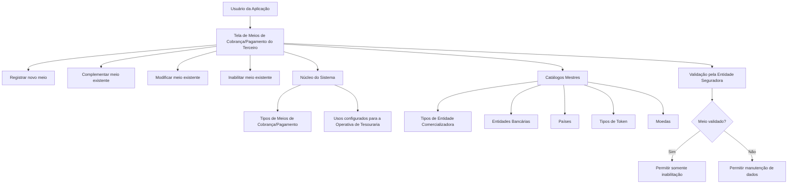

# Gestão de Meios de Cobrança e Pagamento de Terceiros

## 1. Metadados do Documento
- **Arquivo de Origem:** Não identificado no conteúdo fornecido
- **Tipo de Documento:** Especificação Funcional
- **Domínio / Sistema:** Gestão de Terceiros, Tesouraria e Meios de Cobrança/Pagamento
- **Público-Alvo:** Desenvolvedores, Analistas Funcionais, Operação e Negócio
- **Data/Versão Identificada:** Não identificada

---

## 2. Resumo Executivo & Contexto de Negócio

O documento descreve uma tela funcional destinada à manutenção dos Meios de Cobrança/Pagamento associados a um Terceiro. A funcionalidade permite que usuários da aplicação registrem novos meios, como contas e cartões, e complementem, modifiquem ou inabilitem informações de meios preexistentes.

O processo é organizado como uma sequência de captura ou alteração de dados do Terceiro. Os atributos abrangem a classificação do meio, informações de entidade comercializadora e bancária, país, titularidade, tokenização, valor real, valor encriptado, moeda, finalidade operacional e datas de vencimento ou validade.

A especificação estabelece regras relevantes de controle operacional. Um Meio de Cobrança/Pagamento validado pela entidade seguradora não deve mais permitir alteração de dados; após a validação, o sistema deve permitir somente a inabilitação. Além disso, existem regras de unicidade para meios identificados como padrão e prioritário.

O documento também relaciona o Meio de Cobrança/Pagamento à operação de tesouraria. O atributo de tipo de movimento identifica se o meio pode ser utilizado para cobranças ou pagamentos, enquanto o tipo de uso do movimento determina usos configurados pelo núcleo do sistema nos quais o meio pode ser empregado sem restrição.

---

## 3. Arquitetura, Componentes & Tecnologias Envolvidas

O conteúdo fornecido não detalha arquitetura técnica, microsserviços, APIs, tecnologias, protocolos, URLs, ambientes, bancos de dados ou contratos de integração.

Os componentes funcionais explicitamente identificados são:

- Aplicação utilizada por usuários para manter Meios de Cobrança/Pagamento de Terceiros.
- Núcleo do Sistema, responsável por fornecer tipos de meios e usos configurados.
- Catálogos mestres do Sistema:
  - Tipos de Entidade Comercializadora.
  - Entidades Bancárias.
  - Países.
  - Tipos de Token.
  - Moedas.
- Entidade seguradora, responsável pela validação do Meio de Cobrança/Pagamento para fins de qualidade de dados.
- Operativa de Tesouraria da Entidade, associada ao tipo de uso do movimento.



> **Nota de Análise:** O documento não detalha métodos HTTP, contratos JSON, persistência de dados, regras de autenticação, integração entre sistemas ou implementação técnica da tela.

---

## 4. Regras de Negócio, Especificações Funcionais & Processos

### Ações disponíveis

A tela fornece as seguintes ações para os Meios de Cobrança/Pagamento de um Terceiro:

1. **Criar:** registrar novos Meios de Cobrança/Pagamento, incluindo contas e cartões.
2. **Modificar:** alterar dados de Meios de Cobrança/Pagamento preexistentes, respeitando a restrição de validação.
3. **Inabilitar:** marcar um Meio de Cobrança/Pagamento como não vigente, impedindo que seja considerado nos processos da entidade.
4. **Complementar:** acrescentar informações a um Meio de Cobrança/Pagamento preexistente.

### Sequência de captura ou modificação

O documento determina que, da esquerda para a direita e de cima para baixo, os campos apresentados constituem a sequência de captura ou modificação das informações do Terceiro no sistema.

### Regras de validação e restrições

- O **Meio de Cobrança/Pagamento Validado** indica se a entidade seguradora validou o meio para fins de qualidade de dados.
- Após a comprovação e validação do Meio de Cobrança/Pagamento, o sistema deve permitir somente a sua **inabilitação**.
- Após a validação, o sistema não deve permitir a modificação dos dados do Meio de Cobrança/Pagamento.
- Um Terceiro com mais de um Meio de Cobrança/Pagamento associado pode ter um meio identificado como **Meio de Cobrança/Pagamento por Defeito**.
- Somente um Meio de Cobrança/Pagamento pode estar identificado como padrão entre todos os Meios de Cobrança/Pagamento de um mesmo Terceiro.
- Um Terceiro com mais de um Meio de Cobrança/Pagamento associado pode ter um meio identificado como **Meio de Cobrança/Pagamento Prioritário**.
- Somente um Meio de Cobrança/Pagamento pode estar identificado como prioritário para cada Tipo de Meio de Cobrança/Pagamento associado ao Terceiro.
- A **Sequência/Ordem** é atribuída automaticamente pelo sistema no registro inicial do Meio de Cobrança/Pagamento.
- A **Inabilitação** indica que o Meio de Cobrança/Pagamento deixou de estar vigente e, portanto, não deve ser considerado em nenhum processo da entidade.
- A **Data de Validade** indica a data a partir da qual o Meio de Cobrança/Pagamento está plenamente operacional no sistema.
- O uso correto da Data de Validade permite manter histórico de alterações efetuadas nas informações do Meio de Cobrança/Pagamento.
- O **Tipo de Movimento** define se o meio pode ser usado para realizar cobranças ou pagamentos.
- O **Tipo de Uso do Movimento** deve conter um dos usos configurados e fornecidos pelo núcleo do sistema para a gestão e controle da Operativa de Tesouraria, permitindo o uso do meio sem restrição nesse contexto.

---

## 5. Tabelas de Parâmetros, Ambientes e Estruturas de Dados

| Item / Parâmetro | Descrição / Função | Tipo / Valores / Formato | Ambiente / Observações |
| :--- | :--- | :--- | :--- |
| Meio Cobro/Pago | Contém o valor de um dos tipos de Meios de Cobrança/Pagamento fornecidos pelo núcleo do Sistema. | Tipo de Meio de Cobrança/Pagamento. | Valores fornecidos pelo núcleo do Sistema. |
| Classe do Meio de Cobro/Pago | Contém a subdivisão dos Meios de Cobrança/Pagamento do Terceiro. | Classe ou subdivisão do meio. | Valores configurados pela entidade seguradora. |
| Tipo de Entidade Comercializadora | Contém o código do Tipo de Entidade Comercializadora associado ao Meio de Cobrança/Pagamento. | Código. | Valores existentes no catálogo mestre do Sistema. |
| Entidade Bancária | Contém o código da Entidade Bancária à qual pertence o Meio de Cobrança/Pagamento do Terceiro. | Código. | Valores existentes no catálogo de Entidades Bancárias do Sistema. |
| Clave do País | Contém o código do primeiro nível da estrutura geográfica, correspondente a países, para identificar a localização da Entidade Bancária. | Código de país. | Valores existentes no catálogo mestre de Países do Sistema. |
| Titular | Identifica a pessoa titular do Meio de Cobrança/Pagamento. | Pessoa titular. | Não há detalhamento adicional sobre formato ou validação. |
| Valor Enmascarado | Visualiza o valor do Meio de Cobrança/Pagamento conforme o tipo de mascaramento aplicável ao meio. | Valor mascarado. | O documento não detalha algoritmos ou padrões de mascaramento. |
| Tipo de Token | Contém o código do tipo de token do Meio de Cobrança/Pagamento associado ao Terceiro. | Código de tipo de token. | Valores existentes no Catálogo Mestre. |
| Token Meio Cobro Cobro/Pago | Contém o código do token do Meio de Cobrança/Pagamento conforme o tipo de token associado. | Código de token. | A denominação aparece como “Token Medio Cobro Cobro/Pago” no texto original. |
| Valor do Meio Cobro/Pago | Identifica o valor real do Meio de Cobrança/Pagamento. Para cartão, corresponde ao número do cartão; para conta corrente, corresponde ao número da conta. | Valor real do meio. | O documento não especifica formato, comprimento ou regras de criptografia. |
| Valor Encriptado do Meio Cobro/Pago | Identifica o valor encriptado do Meio de Cobrança/Pagamento. | Valor encriptado. | O documento não identifica algoritmo, chave ou mecanismo de encriptação. |
| Tipo de Movimento | Identifica se o Meio de Cobrança/Pagamento pode ser utilizado para cobranças ou pagamentos. | Cobros ou Pagos. | Relacionado à finalidade operacional do meio. |
| Tipo Uso do Movimento | Contém um dos usos configurados e fornecidos pelo núcleo do Sistema para utilização sem restrição na Operativa de Tesouraria. | Uso configurado. | Relacionado à gestão e controle de tesouraria da entidade. |
| Moeda | Contém o código da moeda do Meio de Cobrança/Pagamento. | Código de moeda. | Valores existentes no catálogo mestre de Moedas do Sistema. |
| Sequência/Ordem | Contém o número de sequência do Meio de Cobrança/Pagamento associado ao Terceiro. | Número de sequência. | Atribuído automaticamente pelo Sistema no registro inicial. |
| Mês de Vencimento | Contém o mês de vencimento do Meio de Cobrança/Pagamento do Terceiro. | Mês. | Não há detalhamento sobre obrigatoriedade ou formato. |
| Ano de Vencimento | Contém o ano de vencimento do Meio de Cobrança/Pagamento do Terceiro. | Ano. | Não há detalhamento sobre obrigatoriedade ou formato. |
| Meio Cobro/Pago Validado | Indica se o Meio de Cobrança/Pagamento foi validado pela entidade seguradora para fins de qualidade de dados. | Indicador de validação. | Quando validado, somente a inabilitação deve ser permitida. |
| Meio Cobro/Pago por Defecto | Indica o Meio de Cobrança/Pagamento apresentado por padrão nos processos operativos da entidade. | Indicador de meio padrão. | Somente um meio pode ser marcado como padrão entre todos os meios do Terceiro. |
| Inhabilitación | Estabelece que o Meio de Cobrança/Pagamento deixou de estar vigente. | Indicador de inabilitação. | O meio inabilitado não deve ser considerado nos processos da entidade. |
| Meio Cobro/Pago Prioritario | Indica o Meio de Cobrança/Pagamento a ser considerado preferencialmente nos processos operativos da entidade. | Indicador de prioridade. | Somente um meio pode ser prioritário por Tipo de Meio de Cobrança/Pagamento associado ao Terceiro. |
| Fecha de Validez | Indica a data a partir da qual o Meio de Cobrança/Pagamento estará plenamente operacional no sistema. | Data. | Permite manter histórico de alterações da informação. |

---

## 6. Bateria de Perguntas & Respostas para RAG (FAQ Sintético)

### P1: Quais operações a tela de Meios de Cobrança/Pagamento do Terceiro permite executar?
**R:** A tela permite registrar novos Meios de Cobrança/Pagamento, complementar dados de meios preexistentes, modificar informações de meios existentes e inabilitar Meios de Cobrança/Pagamento. O documento cita contas e cartões como exemplos de meios que podem ser registrados.

### P2: O que acontece quando um Meio de Cobrança/Pagamento foi validado pela entidade seguradora?
**R:** Quando a entidade seguradora efetua a comprovação e validação do Meio de Cobrança/Pagamento para fins de qualidade de dados, o sistema deve permitir somente a inabilitação do meio. A modificação dos dados do Meio de Cobrança/Pagamento validado não deve ser permitida.

### P3: Qual é a diferença entre Meio de Cobrança/Pagamento por Defeito e Meio de Cobrança/Pagamento Prioritário?
**R:** O Meio de Cobrança/Pagamento por Defeito é aquele que aparece automaticamente nos processos operativos da entidade quando o Terceiro possui mais de um meio associado. O Meio de Cobrança/Pagamento Prioritário é o meio a ser considerado preferencialmente nos processos operativos da entidade. Pode haver somente um meio padrão entre todos os meios do Terceiro, enquanto pode haver somente um meio prioritário por Tipo de Meio de Cobrança/Pagamento.

### P4: Como a Sequência/Ordem de um Meio de Cobrança/Pagamento é definida?
**R:** A Sequência/Ordem contém o número de sequência do Meio de Cobrança/Pagamento associado ao Terceiro. Esse número é atribuído automaticamente pelo sistema quando o Meio de Cobrança/Pagamento é inicialmente registrado.

### P5: Para que serve o campo Tipo de Movimento?
**R:** O Tipo de Movimento identifica se o Meio de Cobrança/Pagamento pode ser utilizado para realizar cobranças ou pagamentos. O documento não especifica valores adicionais além dessas duas finalidades operacionais.

### P6: Como o Tipo de Uso do Movimento se relaciona com a Operativa de Tesouraria?
**R:** O Tipo de Uso do Movimento contém um dos usos configurados e fornecidos pelo núcleo do Sistema para a gestão e o controle da Operativa de Tesouraria da Entidade. Esse campo determina os contextos de uso nos quais o Meio de Cobrança/Pagamento poderá ser empregado sem restrição.

### P7: O que representa o Valor do Meio de Cobrança/Pagamento?
**R:** O Valor do Meio de Cobrança/Pagamento identifica o valor real do meio. Se o meio for uma tarjeta, o valor corresponde ao número da tarjeta; se o meio for uma conta corrente, o valor corresponde ao número da conta.

### P8: Qual é a finalidade do Valor Enmascarado e do Valor Encriptado?
**R:** O Valor Enmascarado visualiza o valor do Meio de Cobrança/Pagamento segundo o tipo de mascaramento aplicável ao meio. O Valor Encriptado identifica o valor encriptado do Meio de Cobrança/Pagamento. O documento não fornece detalhes sobre padrões de mascaramento, algoritmos de criptografia ou gestão de chaves.

### P9: Como o sistema identifica a localização da Entidade Bancária?
**R:** O campo Clave do País contém o código do primeiro nível da estrutura geográfica, correspondente a países, no qual é identificada a localização da Entidade Bancária associada ao Meio de Cobrança/Pagamento do Terceiro. Os valores provêm do catálogo mestre de Países do Sistema.

### P10: O que significa inabilitar um Meio de Cobrança/Pagamento?
**R:** A Inabilitação estabelece que o Meio de Cobrança/Pagamento associado ao Terceiro deixou de estar vigente. Um meio inabilitado não deve ser considerado em nenhum processo da entidade.

### P11: Como a Data de Validade é utilizada?
**R:** A Data de Validade informa ao sistema a data a partir da qual o Meio de Cobrança/Pagamento estará plenamente operacional. O uso correto dessa data permite manter um histórico das alterações efetuadas nas informações do meio.

### P12: De onde vêm os valores dos campos de moeda, país, entidade bancária e tipo de token?
**R:** Os valores de moeda vêm do catálogo mestre de Moedas; os valores de país vêm do catálogo mestre de Países; os valores de entidade bancária vêm do catálogo de Entidades Bancárias; e os valores de tipo de token vêm do Catálogo Mestre. O documento não detalha a tecnologia ou o mecanismo de consulta desses catálogos.

---

## 7. Glossário de Termos, Siglas & Conceitos-Chave

- **Meio de Cobrança/Pagamento:** Instrumento associado a um Terceiro para realizar cobranças ou pagamentos, como conta ou cartão.
- **Terceiro:** Entidade ou pessoa à qual estão associados os Meios de Cobrança/Pagamento tratados pela tela.
- **Entidade Seguradora:** Entidade responsável pela validação do Meio de Cobrança/Pagamento para efeitos de qualidade de dados.
- **Entidade Comercializadora:** Tipo de entidade associado ao Meio de Cobrança/Pagamento, identificado por código existente no catálogo mestre do Sistema.
- **Entidade Bancária:** Entidade bancária à qual pertence o Meio de Cobrança/Pagamento do Terceiro.
- **Catálogo Mestre:** Repositório de possíveis valores utilizado pelo Sistema para determinados campos, incluindo países, moedas, tipos de token e tipos de entidade comercializadora.
- **Token:** Código associado ao Meio de Cobrança/Pagamento conforme seu tipo de token.
- **Enmascaramento:** Forma de visualização do valor do Meio de Cobrança/Pagamento conforme o tipo de mascaramento contemplado.
- **Valor Encriptado:** Representação encriptada do valor do Meio de Cobrança/Pagamento.
- **Operativa de Tesouraria:** Contexto de gestão e controle da entidade no qual são configurados usos permitidos para Meios de Cobrança/Pagamento.
- **Meio por Defeito:** Meio que aparece automaticamente nos processos operativos da entidade.
- **Meio Prioritário:** Meio que deve ser considerado preferencialmente nos processos operativos da entidade.
- **Inabilitação:** Estado que indica que o Meio de Cobrança/Pagamento deixou de estar vigente e não deve ser usado nos processos da entidade.
- **Data de Validade:** Data a partir da qual o Meio de Cobrança/Pagamento está plenamente operacional no sistema.

---

## 8. Notas Críticas, Riscos & Limitações

- O documento não identifica o nome do arquivo de origem, versão, data de publicação, autor ou responsável funcional.
- O documento não descreve APIs, serviços, endpoints, métodos HTTP, contratos JSON, eventos, mecanismos de integração ou arquitetura de implantação.
- Não há especificação de formatos, tamanhos, obrigatoriedade, regras de preenchimento, valores permitidos ou validações sintáticas para campos como token, titular, valores de meio, mês, ano e data.
- O documento cita valores enmascarados e encriptados, mas não detalha algoritmos, padrões de mascaramento, chaves, armazenamento seguro ou controles de acesso.
- Não há detalhamento sobre como o sistema impede tecnicamente a modificação de um Meio de Cobrança/Pagamento validado.
- Não são descritos critérios de desempate ou comportamento esperado caso um usuário tente marcar mais de um meio como padrão ou mais de um meio prioritário para o mesmo tipo.
- Não há definição explícita sobre a relação entre inabilitação, validação, data de validade, vencimento e elegibilidade operacional.
- O documento menciona o núcleo do Sistema e catálogos mestres, mas não detalha responsáveis, disponibilidade, integração ou tratamento de falhas desses componentes.

---

## 9. Conteúdo Bruto Estruturado (Referência Fiel)

```text
--- [PÁGINA 1 DE 4] ---

MODIFICAR Medios de Cobro y Pago del
Tercero
Objetivo
Esta pantalla proporciona la funcionalidad para que los Usuarios de la Aplicación puedan Registrar
Nuevos Medios de Cobro/Pago (Cuentas, Tarjetas,...) del Tercero además de Complementar,
Modificar ó Inhabilitar la información de alguno de sus Medios de Cobro/Pago Preexistentes.
Posibles Acciones
 CREAR ( )
 MODIFICAR ( )
 INHABILITAR ( )
Medios de Cobro y Pago
 /
 RS
Inicio Soluciones APIs Documentación Zeus
ES


--- [PÁGINA 2 DE 4] ---

De Izquierda a Derecha y de Arriba hacia Abajo, los siguientes campos marcan la secuencia de
captura o modificación de la información del Tercero en el sistema.
Medio Cobro/Pago (   )
Este dato contendrá el valor de uno de los tipos de los Medios de Cobro/Pago proporcionados por el
núcleo del Sistema.
Clase del Medio de Cobro/Pago (   )
Este Campo contiene el valor de la Subdivisión de los Medios de Cobro/Pago del Tercero, de
acuerdo con la relación de posibles valores configurados por la entidad aseguradora.
Tipo de Entidad Comercializadora (   )
Este Campo contiene el código del Tipo de Entidad Comercializadora del Medio de Cobro/Pago
asociado al Medio de Cobro/Pago del Tercero, de acuerdo con la relación de posibles valores
existentes en el catálogo maestro del Sistema.
Entidad Bancaria (   )
Este Campo contiene el código de la Entidad Bancaria a la que pertenece el Medio de Cobro/Pago
del Tercero, de acuerdo con la relación de posibles valores existentes en el catálogo de Entidades
Bancarias del Sistema.
Clave del País (   )
Este Campo contiene el código del primer nivel de la estructura Geográfica (países) en el que se
estará identificando la ubicación de la Entidad Bancaria del Medio de Cobro y Pago asociado al
Tercero, de acuerdo con la relación de posibles valores existentes en el catálogo maestro de Países
existente en el Sistema.
Titular (  )
Este Atributo identifica la persona Titular del Medio de Cobro/Pago.
Valor Enmascarado
Este Atributo visualiza el Valor del Medio de Cobro/Pago de acuerdo con el tipo de enmascaramiento
contemplado para el Medio de Cobro/Pago.
Tipo de Token (   )
Este Campo contiene el código del tipo de token del Medio de Cobro y Pago asociado al Tercero, de
acuerdo con la relación de posibles valores existentes en el Catálogo Maestro.


--- [PÁGINA 3 DE 4] ---

Token Medio Cobro Cobro/Pago (  )
Este Campo contiene el código del Token del Medio de Cobro y Pago asociado al Tercero de acuerdo
con su tipo de Token asociado.
Valor del Medio Cobro/Pago (  )
Este Atributo identifica el Valor 'Real' del Medio de Cobro/Pago, es decir, si el Medio de Cobro/Pago
es una Tarjeta el número de la tarjeta, si es una Cuenta Corriente el número de la cuenta, etcétera.
Valor Encriptado del Medio Cobro/Pago
Este Atributo identifica el Valor encriptado del Medio de Cobro/Pago.
Tipo de Movimiento (   )
Este Atributo identifica si el Medio de Cobro/Pago se puede utilizar para realizar Cobros o Pagos.
Tipo Uso del Movimiento (   )
De acuerdo con la Gestión y Control en la Operativa de Tesorería de la Entidad, este dato contendrá
el valor de uno de los usos configurados y proporcionados por el núcleo del Sistema en el que el
Medio de Cobro/Pago podrá ser empleado sin restricción.
Moneda (   )
Este Campo contendrá el código de la Moneda del Medio de Cobro/Pago de acuerdo con la relación
de posibles valores existentes en el catálogo maestro de Monedas existente en el Sistema.
Secuencia/Orden
Este dato contiene el Número de Secuencia del Medio de Cobro/Pago asociado al Tercero. Es un
valor que se asigna automáticamente por parte del Sistema cuando el Medio de Cobro/Pago se
registra inicialmente.
Mes Vencimiento (  )
Este Atributo contiene el Mes de Vencimiento del Medio de Cobro/Pago del Tercero.
Año Vencimiento (  )
Este Atributo contiene el Año de Vencimiento del Medio de Cobro/Pago del Tercero.
Medio Cobro/Pago Validado (  )
Este Dato indica si el Medio de Cobro/Pago ha sido o no validado por la entidad aseguradora a
efectos de calidad del dato. Una vez se haya efectuado la comprobación y validación del Medio de


--- [PÁGINA 4 DE 4] ---

Cobro/Pago, el sistema solamente debería permitir su inhabilitación no así la modificación de sus
datos.
Medio Cobro/Pago por Defecto (  )
Este Campo, en aquellos Terceros que tienen más de un medio de Cobro/Pago asociado, indicará
cual de ellos es el que aparecerá por defecto en los Procesos Operativos de la Entidad.
Solamente puede haber uno identificado y marcado como tal entre todos los Medios de
Cobro/Pago del Tercero
Inhabilitación (  )
Esta propiedad establece si el Medio de Cobro/Pago asociado al Tercero ha dejado de estar en vigor
por lo que no debería ser considerado en ninguno de los procesos de la entidad.
Medio Cobro/Pago Prioritario (  )
Este Campo, en aquellos Terceros que tienen más de un medio de Cobro/Pago asociado, indicará
cual de ellos es el que se ha de considerar preferentemente en los Procesos Operativos de la
Entidad.
Solamente puede haber uno identificado y marcado como tal por cada uno de los Tipos de Medio
de Cobro/Pago asociados al Tercero.
Fecha de Validez ( )
Esta propiedad le indica al sistema la fecha a partir de la cual el Medio de Cobro/Pago estará
plenamente operativo en el sistema por lo que su correcto uso permite tener un histórico de los
cambios efectuados en su información.
```
