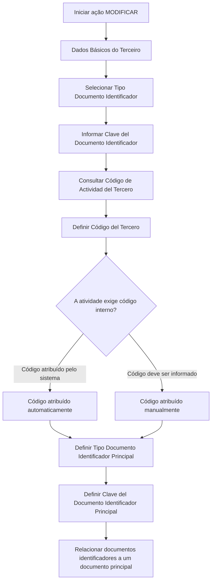

# Modificação de Dados Básicos do Terceiro Assegurado no Sistema

## 1. Metadados do Documento
- **Arquivo de Origem:** Não identificado; conteúdo bruto fornecido na solicitação.
- **Tipo de Documento:** Manual Operacional.
- **Domínio / Sistema:** Gestão de Terceiros Assegurados; dados básicos e identificação.
- **Público-Alvo:** Operação, analistas funcionais e administradores do sistema.
- **Data/Versão Identificada:** Não identificada.

---

## 2. Resumo Executivo & Contexto de Negócio

O documento descreve a ação **MODIFICAR**, destinada a complementar ou alterar os dados de identificação de um **Tercero Asegurado** no sistema. A sequência de alteração é apresentada sob a seção de dados básicos e abrange atributos relativos aos documentos identificadores, à atividade e ao código interno do terceiro.

A identificação do terceiro pode corresponder a uma pessoa física ou jurídica. O tipo de documento identificador disponível depende de configurações realizadas previamente no sistema. A chave do documento identificador representa o valor associado à identificação do terceiro.

O documento também descreve a atribuição do código interno do terceiro. Esse código pode ser atribuído automaticamente pelo sistema ou manualmente, conforme a configuração e a obrigatoriedade vinculadas à atividade do terceiro.

Por fim, o processo permite associar diversos documentos identificadores a um único documento principal. Essa associação evita que o sistema trate documentos distintos de uma mesma pessoa física como terceiros diferentes.

---

## 3. Arquitetura, Componentes & Tecnologias Envolvidas

Os componentes funcionais explicitamente citados são:

- Ação **MODIFICAR**.
- Estrutura de informações de **Dados Básicos**.
- Atributo do colapsador para **Tipo Documento Identificador**.
- Atributo do catálogo para **Clave del Documento Identificador**.
- Propriedade de **Código de Actividad del Tercero**.
- Campo de **Código del Tercero**.
- Atributos de documento identificador principal.
- Configurações prévias do sistema para tipos documentais e regras de código interno.

O documento não informa tecnologias, APIs, métodos HTTP, contratos JSON, banco de dados, ambientes, URLs ou integrações externas.



---

## 4. Regras de Negócio, Especificações Funcionais & Processos

1. A ação disponível é **MODIFICAR**.
2. A ação **MODIFICAR** permite complementar ou modificar os dados de identificação do terceiro assegurado no sistema.
3. Os campos de dados básicos seguem uma sequência de modificação descrita da esquerda para a direita e de cima para baixo.
4. O **Tipo Documento Identificador** identifica uma pessoa física ou jurídica.
5. Os tipos de documento disponíveis devem ter sido configurados previamente no sistema.
6. A **Clave del Documento Identificador** contém a chave do terceiro.
7. O **Código de Actividad del Tercero** representa o código da atividade pela qual o terceiro foi identificado.
8. O **Código del Tercero** é o código interno atribuído ao terceiro.
9. O código interno pode ser atribuído automaticamente quando:
   - a atividade do terceiro exige código interno; e
   - a configuração determina que o código seja atribuído pelo sistema.
10. O código do terceiro pode ser atribuído manualmente quando a atividade do terceiro exige um código de terceiro.
11. O **Tipo Documento Identificador Principal** permite alterar o tipo de documento principal ao qual serão relacionados o tipo e a chave de documento do terceiro.
12. A **Clave del Documento Identificador Principal** permite alterar a chave do documento principal ao qual serão relacionados o tipo e a chave de documento do terceiro.
13. Diversos documentos podem ser relacionados a um único documento principal.
14. No exemplo apresentado, uma pessoa física na Espanha pode ter o **NIF** como documento principal e relacionar a ele documentos como **PAS** e **DNI**.
15. A associação a um documento principal evita que documentos distintos da mesma pessoa sejam interpretados pelo sistema como três terceiros diferentes.

---

## 5. Tabelas de Parâmetros, Ambientes e Estruturas de Dados

| Item / Parâmetro | Descrição / Função | Tipo / Valores / Formato | Ambiente / Observações |
| :--- | :--- | :--- | :--- |
| Ação | Executa a alteração ou complementação dos dados de identificação do terceiro assegurado. | `MODIFICAR` | Única ação explicitamente apresentada. |
| Dados Básicos | Estrutura ou painel que contém a sequência de modificação dos dados do terceiro. | Estrutura de informação | A sequência é descrita da esquerda para a direita e de cima para baixo. |
| Tipo Documento Identificador | Exibe o tipo de documento utilizado para identificar pessoa física ou jurídica. | Tipos previamente configurados no sistema | Descrito como atributo do colapsador. |
| Clave del Documento Identificador | Contém a chave do terceiro associada ao documento identificador. | Valor de chave documental | Descrito como atributo do catálogo. |
| Código de Actividad del Tercero | Mostra o código da atividade com a qual o terceiro foi identificado. | Código de atividade | Não são fornecidos formatos ou valores permitidos. |
| Código del Tercero | Código interno atribuído ao terceiro. | Automático ou manual | Depende da configuração e da obrigatoriedade vinculada à atividade do terceiro. |
| Tipo Documento Identificador Principal | Permite alterar o tipo do documento principal para associação de diversos documentos. | Tipo documental | Descrito como atributo da estrutura de dados básicos. |
| Clave del Documento Identificador Principal | Permite alterar a chave do documento principal para associação de documentos. | Chave documental | Descrito como atributo do painel de dados básicos. |
| NIF | Tipo documental usado no exemplo para identificação fiscal. | Exemplo: `A-39000013` para Banco de Santander | Utilizado na Espanha para pessoa jurídica e, no exemplo funcional, como documento principal de pessoa física. |
| DNI | Documento Nacional de Identidad. | Exemplo: `50818772` para Juan Pérez Pérez | Pode ser relacionado ao NIF como documento principal. |
| PAS | Código de passaporte mencionado no exemplo. | Não detalhado | Pode ser relacionado ao NIF como documento principal. |

---

## 6. Bateria de Perguntas & Respostas para RAG (FAQ Sintético)

### P1: Qual é o objetivo da ação MODIFICAR no cadastro de terceiros?
**R:** A ação **MODIFICAR** permite complementar ou modificar os dados de identificação do terceiro assegurado no sistema.

### P2: Quais dados fazem parte da sequência de modificação dos dados básicos do terceiro?
**R:** A sequência apresentada inclui Tipo Documento Identificador, Clave del Documento Identificador, Código de Actividad del Tercero, Código del Tercero, Tipo Documento Identificador Principal e Clave del Documento Identificador Principal.

### P3: Como o sistema determina os tipos de documento identificador disponíveis?
**R:** O Tipo Documento Identificador mostra os tipos de documento configurados previamente no sistema para identificar pessoas físicas ou jurídicas.

### P4: O que representa a Clave del Documento Identificador?
**R:** A Clave del Documento Identificador é o atributo do catálogo que contém a chave associada ao terceiro.

### P5: Quando o Código del Tercero é atribuído automaticamente?
**R:** O código interno é atribuído automaticamente quando a atividade do terceiro exige código interno e a configuração determina que esse código seja atribuído pelo sistema.

### P6: Quando o Código del Tercero pode ser informado manualmente?
**R:** O Código del Tercero pode ser informado manualmente quando a atividade do terceiro exige que exista um código de terceiro.

### P7: Qual é a finalidade do Tipo Documento Identificador Principal?
**R:** O Tipo Documento Identificador Principal permite modificar o tipo de documento principal ao qual serão relacionados o tipo e a chave de documento do terceiro, possibilitando a associação de diversos documentos a um documento único.

### P8: Para que serve a Clave del Documento Identificador Principal?
**R:** A Clave del Documento Identificador Principal permite modificar a chave do documento principal usado para relacionar diferentes documentos identificadores do terceiro a um único documento principal.

### P9: Como a associação de documentos principais evita duplicidade de terceiros?
**R:** Ao relacionar documentos como passaporte, DNI e NIF a um documento principal, o sistema pode reconhecer que os documentos pertencem ao mesmo terceiro, evitando considerar a existência de terceiros distintos.

### P10: Qual é o exemplo de identificação de pessoa jurídica apresentado?
**R:** O documento informa que o Banco de Santander, como pessoa jurídica no Reino de Espanha, é identificado pelo tipo de documento NIF e pela chave documental `A-39000013`.

### P11: Qual é o exemplo de identificação de pessoa física apresentado?
**R:** O documento informa que Juan Pérez Pérez, como pessoa física, é identificado no sistema pelo tipo de documento DNI e pela chave `50818772`.

### P12: O documento informa APIs, métodos HTTP ou contratos técnicos para a alteração de terceiros?
**R:** Não. O documento descreve atributos e regras funcionais da ação MODIFICAR, mas não detalha APIs, métodos HTTP, contratos JSON, autenticação, URLs ou integrações técnicas.

---

## 7. Glossário de Termos, Siglas & Conceitos-Chave

- **Tercero:** Entidade identificada no sistema, podendo ser pessoa física ou jurídica.
- **Tercero Asegurado:** Terceiro segurado cujos dados de identificação podem ser complementados ou modificados.
- **Tipo Documento Identificador:** Tipo de documento usado para identificar uma pessoa física ou jurídica.
- **Clave del Documento Identificador:** Chave associada ao documento identificador do terceiro.
- **Código de Actividad del Tercero:** Código da atividade que identificou o terceiro.
- **Código del Tercero:** Código interno atribuído ao terceiro.
- **Documento Principal:** Documento utilizado como referência única para relacionar diversos documentos de identificação de um mesmo terceiro.
- **NIF:** Número de Identificação Fiscal, citado como tipo documental no contexto da Espanha.
- **DNI:** Documento Nacional de Identidad.
- **PAS:** Código de passaporte citado como documento que pode ser relacionado ao NIF.

---

## 8. Notas Críticas, Riscos & Limitações

- **Nota de Análise:** O documento não identifica o nome do sistema, sua versão, a data do material ou o arquivo de origem.
- **Nota de Análise:** Não são informados métodos HTTP, APIs, contratos JSON, procedimentos de persistência, perfis de acesso ou trilhas de auditoria.
- **Nota de Análise:** O termo “colapsador” é preservado conforme o texto original; o documento não detalha seu comportamento de interface.
- **Nota de Análise:** O termo “catálogo” é citado para a Clave del Documento Identificador, sem informar fonte de dados, regras de pesquisa ou validações.
- **Risco operacional:** A identificação incorreta do documento principal pode afetar a relação entre documentos de uma mesma pessoa física ou jurídica.
- **Dependência de configuração:** A disponibilidade de tipos documentais e a atribuição automática ou manual de código dependem de configurações prévias do sistema.
- **Limitação funcional:** Não há detalhamento sobre obrigatoriedade de campos, validação de formato, tratamento de erro ou critérios de unicidade documental.

---

## 9. Conteúdo Bruto Estruturado (Referência Fiel)

```text
--- [PÁGINA 1 DE 2] ---

MODIFICAR Datos Básicos del Tercero
Objetivo
Esta acción permite complementar ó modificar los datos de identificación del Tercero Asegurado
en el sistema.
Posibles Acciones
 MODIFICAR ( )
Datos Básicos
De Izquierda a Derecha y de Arriba hacia Abajo, los siguientes campos marcan la secuencia de
modificación del Tercero en el sistema.
Tipo Documento Identificador
Este Atributo del colapsador muestra el tipo de documento con el que se identifica a la persona física
o jurídica de acuerdo con los tipos de documentos que hayan sido configurados en el sistema
previamente.
 / 
 RS
Inicio Soluciones APIs Documentación Zeus
ES


--- [PÁGINA 2 DE 2] ---

Clave del Documento Identificador
Este Atributo del catálogo contiene la clave del Tercero.
A modo de ejemplos:
El Banco de Santander como persona jurídica se identifica en el Reino de España con el Tipo de
Documento NIF con clave de documento A-39000013
Juan Pérez Pérez como persona física se identificará en el sistema con el Tipo de Documento
DNI cuya clave es 50818772
Código de Actividad del Tercero
Esta propiedad muestra el código de la Actividad con la que se identificó al Tercero.
Código del Tercero
Este dato será el código interno del sistema que se asignará al Tercero automáticamente caso que
se haya configurado que la actividad del tercero obligue a tener un código interno y este sea
asignado por el Sistema, o manualmente caso que la actividad del Tercero obligue a tener un código
de Tercero.
Tipo Documento Identificador Principal (  )
Este Atributo de la estructura de información de datos básicos permite modificar el tipo de documento
principal con el que se va a relacionar el tipo y la clave del documento del Tercero pudiendo de esta
manera relacionar diversos documentos con uno único.
Clave del Documento Identificador Principal ( )
Por último, este Atributo del panel de datos básicos permite modificar la clave del documento
principal con el que se va a relacionar el tipo y la clave del documento del Tercero pudiendo de esta
manera conectar diversos documentos con un documento principal.
A modo de ejemplo: Puesto que en España todas las personas físicas tienen asignada un Número de
Identificación Fiscal cuyo tipo de documento es el NIF, es factible considerarlo como Tipo de
Documento Principal y relacionar así tanto el código del pasaporte (PAS) como el Documento
Nacional de Identidad (DNI) del Tercero con el NIF, evitando de esta manera considerar que el
Sistema contiene tres Terceros distintos frente a tener uno único.
```
