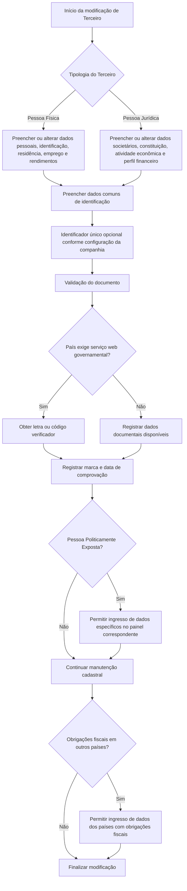

# Modificação de Dados de Pessoa Física/Jurídica de Terceiro no Reef.core

## 1. Metadados do Documento
- **Arquivo de Origem:** `Não identificado no conteúdo fornecido`
- **Tipo de Documento:** Manual Funcional
- **Domínio / Sistema:** Gestão de Terceiros — Reef.core / Grupo MAPFRE
- **Público-Alvo:** Analistas funcionais, desenvolvedores, operação e negócio
- **Data/Versão Identificada:** Não identificada

---

## 2. Resumo Executivo & Contexto de Negócio

O documento descreve a tela e os atributos utilizados para complementar ou modificar informações previamente registradas de um Terceiro, classificado como Pessoa Física ou Pessoa Jurídica. A funcionalidade tem como propósito manter os dados cadastrais, identificatórios, econômicos, fiscais e de filiação necessários para a gestão de Terceiros no sistema Reef.core.

A alteração de dados suporta processos de identificação inequívoca, rastreabilidade, integração e cruzamento de dados entre sistemas. O documento ressalta que o atributo de identificador único pode ser atribuído automaticamente por lógica de negócio local, mas não substitui o código interno de Terceiro utilizado pelo Reef.core.

A tela contempla controles voltados à qualidade e validação documental, incluindo país emissor, datas de emissão e validade, verificador de documento, estado de revisão, data de comprovação e observações sobre o método empregado na validação. Também contempla a identificação de Pessoa Politicamente Exposta e de obrigações fiscais em outros países.

Os campos são condicionados à tipologia do Terceiro. Dados como nome, sobrenomes, estado civil, nacionalidade, emprego, rendimentos, educação e número de filhos são aplicáveis a Pessoas Físicas. Dados como folio registral, data de constituição, atividade econômica, perfis financeiros e tipo societário são aplicáveis a Pessoas Jurídicas.

O documento estabelece que diversos atributos dependem de catálogos mestres ou catálogos configurados pela entidade seguradora, como países, estados, províncias, localidades, moedas, idiomas, profissões, ocupações, atividades econômicas e regimes fiscais. Não são detalhados contratos de API, métodos HTTP, persistência, regras de obrigatoriedade ou validações técnicas de interface.

---

## 3. Arquitetura, Componentes & Tecnologias Envolvidas

### Sistemas, componentes e conceitos citados

| Componente / Termo | Papel descrito no documento |
| :--- | :--- |
| Reef.core | Sistema que possui o código interno do Terceiro, catálogos mestres e processos de gestão de informação de Terceiros. |
| Tela de modificação de dados de Terceiro | Interface funcional para complementar ou modificar dados de Pessoa Física ou Jurídica previamente registrada. |
| Lógica de negócio local | Mecanismo que pode atribuir automaticamente o identificador único do Terceiro. |
| Serviço Web governamental | Serviço que, em determinados países, retorna letra ou código verificador para documentos de Terceiros. |
| Catálogo de Países | Fonte de valores para país emissor, país de nascimento ou constituição. |
| Catálogo de Estados | Fonte de valores para estado de nascimento ou constituição. |
| Catálogo de Províncias | Fonte de valores para província de nascimento ou constituição. |
| Catálogo de Localidades | Fonte de valores para localidade de nascimento ou constituição. |
| Catálogo mestre de Reef.core | Fonte de valores para regime fiscal, profissões, ocupações e outros códigos mestres. |
| Catálogo mestre de Idiomas | Fonte de valores para idioma preferencial de comunicação. |
| Catálogo de moedas | Fonte de valores para moeda dos rendimentos mensais estimados. |
| Grupo MAPFRE | Contexto de consolidação societária por meio do código societário do Terceiro. |

### Fluxo funcional de modificação de Terceiro



> **Nota de Análise:** O documento descreve comportamento funcional e campos de tela, mas não apresenta arquitetura física, bancos de dados, integrações técnicas detalhadas, endpoints, protocolos, URLs, ambientes, tecnologias de implementação ou contratos JSON.

---

## 4. Regras de Negócio, Especificações Funcionais & Processos

### 4.1 Escopo da funcionalidade

A tela permite complementar ou modificar informações de uma Pessoa Física ou Pessoa Jurídica previamente registrada como Terceiro. As finalidades explicitamente informadas são:

1. Identificar ou não o Terceiro como Pessoa Politicamente Exposta.
2. Complementar informações específicas do documento identificador do Terceiro.
3. Classificar o Terceiro.

Quando um atributo não especificar expressamente a aplicabilidade, o documento determina que o atributo deve ser empregado tanto para Pessoas Físicas quanto para Pessoas Jurídicas.

### 4.2 Tipologia do Terceiro

A marca de verificação de Pessoa Física ou Pessoa Jurídica indica a tipologia do Terceiro nas atividades configuradas para suportar ambas as categorias. Essa tipologia determina quais campos devem ser utilizados:

- **Pessoa Física:** identificação pessoal, nomes, sobrenomes, estado civil, cônjuge, nascimento, falecimento, residência, nacionalidade, gênero, deficiência, profissão, ocupação, emprego, rendimentos, estudos e filhos.
- **Pessoa Jurídica:** razão social, folio registral, data de constituição, atividade econômica, perfis financeiros e código de tipo societário.
- **Campos comuns:** identificador único, Pessoa Politicamente Exposta, dados de documento, categoria, regime fiscal, alias, consolidação MAPFRE, origem geográfica, idioma e obrigações fiscais em outros países.

### 4.3 Identificação e rastreabilidade

O identificador único do Terceiro é aplicável quando a configuração de parâmetros da companhia exigir identificação inequívoca de Terceiros nas aplicações que gerenciam suas informações.

O identificador único:

- Contém o código do identificador atribuído ao Terceiro.
- Pode ser atribuído automaticamente por uma lógica de negócio local.
- Permite rastreabilidade, integração e cruzamento de dados entre sistemas.
- Não substitui a funcionalidade do atributo que identifica o código interno do Terceiro no Reef.core.

### 4.4 Pessoa Politicamente Exposta e obrigações fiscais

A ativação da marca de Pessoa Politicamente Exposta altera o comportamento do sistema e permite o ingresso de dados específicos da pessoa no painel de informação correspondente.

A ativação da marca de obrigações fiscais em outros países altera o comportamento do sistema e permite o ingresso dos dados dos países nos quais o Terceiro possa ter obrigações fiscais.

### 4.5 Documento identificador e qualidade de dados

A informação documental inclui data de emissão, data de caducidade, país emissor e código verificador. Em países nos quais seja necessário, deve ser realizada uma chamada a um Serviço Web provido pelo governo para obter uma letra ou código verificador que deve ser utilizado posteriormente nas operações com o Terceiro.

A qualidade e a verificação do documento são registradas por:

1. **Marca de comprovação:** informa se o documento foi revisado e verificado.
2. **Data de comprovação:** registra a data da revisão e comprovação quando a marca indicar que o documento foi revisado.
3. **Observações:** permite registrar texto explicativo ou observações sobre o método utilizado para comprovação, quando o documento tiver sido revisado e validado.

### 4.6 Classificação, fiscalidade e atividade econômica

A categoria do Terceiro é atribuída conforme valores disponíveis no catálogo do sistema. O regime fiscal é informado conforme o catálogo mestre do Reef.core.

O atributo **Por Conta Própria** identifica um Terceiro como trabalhador autônomo quando:

- O Terceiro é Pessoa Física.
- Realiza atividade econômica de maneira independente e direta.
- Não está sujeito a contrato de trabalho.
- Pode utilizar o serviço remunerado de outras pessoas para realizar a atividade, atuando como empregador.

Para Pessoas Jurídicas, a atividade econômica é uma classificação configurada pela entidade seguradora. O tipo de atividade econômica utiliza códigos do catálogo mestre de Atividades Econômicas.

### 4.7 Dados jurídicos e consolidação MAPFRE

O alias permite registrar apelido ou sobrenome do Terceiro, independentemente de ser Pessoa Física ou Jurídica.

O campo de sociedade para consolidação no Grupo MAPFRE — GL captura o código societário do Terceiro Jurídico para consolidação em processos do Grupo MAPFRE, embora o texto também indique aplicabilidade para Pessoas Físicas ou Jurídicas.

O folio registral identifica e diferencia documentos semelhantes de cada Pessoa Jurídica. A data de constituição identifica a data em que a Pessoa Jurídica foi constituída como sociedade por meio de ato jurídico.

### 4.8 Dados de filiação e nomes

O bloco Pessoa identifica dados de filiação do segurado conforme a tipologia do Terceiro.

- O tratamento é uma forma de respeito anterior ao nome.
- O posposto é um código posterior ao nome próprio, utilizado para indicar condição do Terceiro, como Junior ou Senior.
- Para Pessoas Jurídicas, exemplos de posposto incluem U.T.E., S.A., Ltd. e G.M.B.H.
- O nome corresponde ao nome do Terceiro para Pessoa Física ou à razão social para Pessoa Jurídica.
- Segundo nome e sobrenomes são aplicáveis a Pessoa Física.
- O sobrenome de casado/a é aplicável em países onde essa prática seja utilizada.
- Nome e sobrenomes do cônjuge são aplicáveis quando o Terceiro é Pessoa Física e o estado civil é coerente com o uso do campo.

### 4.9 Dados pessoais, geográficos e socioeconômicos

Para Pessoa Física, o sistema pode registrar nascimento, falecimento, início de residência, nacionalidade, tipo de nacionalidade, gênero, percentual de deficiência, profissão, ocupação, empresa empregadora, tipo de empresa, tipo de emprego, rendimentos mensais estimados, moeda, nível de estudos, titulação e número de filhos.

País, estado, província e localidade de nascimento ou constituição são determinados conforme catálogos existentes no sistema. O mesmo conjunto de campos atende ao nascimento de Pessoas Físicas e à constituição de Pessoas Jurídicas.

O idioma representa a preferência para comunicações entre a entidade seguradora e o Terceiro.

O tipo de emprego permite distinguir assalariado de autônomo. O documento define autônomo como Pessoa Física que realiza, de forma habitual, pessoal, direta, por conta própria e fora do âmbito de direção e organização de outra pessoa, atividade econômica ou profissional lucrativa, com ou sem empregados por conta alheia.

### 4.10 Perfil financeiro e tipo societário

Para Pessoa Jurídica:

- O perfil financeiro de atividade principal contém o código do perfil financeiro relativo à atividade econômica principal.
- O perfil financeiro de atividades secundárias contém o código de perfil financeiro relativo a atividades econômicas secundárias.
- O código de tipo de sociedade contém o tipo de código societário do Terceiro.
- Os valores devem seguir os catálogos mestres existentes no sistema.

---

## 5. Tabelas de Parâmetros, Ambientes e Estruturas de Dados

> **Nota de Análise:** O documento não identifica URLs, servidores, ambientes, versões, portas, rotas de log, nomes de tabelas de banco de dados ou formatos técnicos de payload.

### 5.1 Tipologia, identificação e documentação

| Item / Parâmetro | Descrição / Função | Tipo / Valores / Formato | Ambiente / Observações |
| :--- | :--- | :--- | :--- |
| Pessoa Física ou Pessoa Jurídica | Indica a tipologia do Terceiro. | Marca de verificação. | Aplicável em atividades configuradas para ambas as tipologias. |
| ID único do Terceiro | Código de identificação inequívoca atribuído ao Terceiro. | Código; atribuição automática por lógica de negócio local. | Não substitui o código interno do Terceiro no Reef.core. |
| Pessoa Politicamente Exposta | Permite identificar o Terceiro como Pessoa Politicamente Exposta. | Marca de verificação. | Quando ativada, permite inserir dados específicos no painel correspondente. |
| Fecha de Emisión | Indica a data de emissão do documento do Terceiro. | Data. | Relacionada ao documento identificador. |
| Fecha de Caducidad | Indica a data de caducidade do documento do Terceiro. | Data. | Relacionada ao documento identificador. |
| País Emisor | Código do país emissor do documento identificador. | Código de país. | Valores do catálogo de Países do sistema. |
| Verificador del Documento Identificador | Letra ou código verificador do documento. | Letra ou código. | Pode ser retornado por Serviço Web governamental em determinados países. |
| Marca de Comprobación | Indica se o documento foi revisado e verificado. | Marca de verificação. | Associada à qualidade de dados do Terceiro. |
| Fecha de Comprobación | Data da revisão e comprovação do documento. | Data. | Aplicável quando a marca de comprovação indicar revisão e validação. |
| Observaciones | Texto sobre o método empregado na comprovação documental. | Texto livre. | Aplicável quando o documento foi revisado e validado. |

### 5.2 Classificação, fiscalidade e dados econômicos

| Item / Parâmetro | Descrição / Função | Tipo / Valores / Formato | Ambiente / Observações |
| :--- | :--- | :--- | :--- |
| Categoría del Tercero | Código da categoria atribuída ao Terceiro. | Código. | Valores do catálogo do sistema. |
| Régimen Fiscal | Código do regime fiscal do Terceiro. | Código. | Valores do catálogo mestre de Reef.core. |
| Por Cuenta Propia | Identifica Terceiro como trabalhador por conta própria. | Dado / marca. | Aplicável a Pessoa Física com atividade econômica independente e direta. |
| Alias del Tercero | Apelido ou sobrenome do Terceiro. | Texto. | Aplicável a Pessoa Física e Jurídica. |
| Sociedad para Consolidación en Grupo MAPFRE - GL | Código societário para consolidação em processos do Grupo MAPFRE. | Código societário. | O texto indica Terceiro Jurídico e também aplicabilidade para Pessoas Físicas ou Jurídicas. |
| Actividad Económica | Classificação das atividades econômicas de Terceiros Jurídicos. | Classificação. | Configurada pela entidade seguradora. |
| Tipo de Actividad Económica | Código do tipo de atividade econômica. | Código. | Valores do catálogo mestre de Atividades Econômicas. |
| Perfil Financiero Act. Principal | Perfil financeiro da atividade econômica principal. | Código. | Aplicável a Pessoa Jurídica; catálogo mestre do sistema. |
| Perfil Financiero Act. Secundarias | Perfil financeiro das atividades econômicas secundárias. | Código. | Aplicável a Pessoa Jurídica; catálogo mestre do sistema. |
| Código Tipo Sociedad | Tipo de código societário do Terceiro. | Código. | Aplicável a Pessoa Jurídica; catálogo mestre do sistema. |
| Obligaciones Fiscales en otros Países | Habilita o registro de países com obrigações fiscais do Terceiro. | Marca de verificação. | Adapta o comportamento do sistema quando ativada. |

### 5.3 Dados societários, nomes e filiação

| Item / Parâmetro | Descrição / Função | Tipo / Valores / Formato | Ambiente / Observações |
| :--- | :--- | :--- | :--- |
| Folio Registral | Número que identifica e diferencia documentos de Pessoa Jurídica. | Número / identificador. | Aplicável a Pessoa Jurídica. |
| Fecha de Constitución | Data de constituição da sociedade. | Data. | Aplicável a Pessoa Jurídica. |
| Tratamiento | Tratamento de respeito que antecede o nome do Terceiro. | Código. | Exemplos: `001 Don`, `002 Doña`, `003 Señor`, `004 Señora`, `005 Ilmo.`, `006 Excmo.` |
| Pospuesto | Código posterior ao nome que indica condição do Terceiro. | Código. | Pessoa Física: `001 Junior`, `002 Senior`. Pessoa Jurídica: `003 U.T.E.`, `004 S.A.`, `005 Ltd.`, `006 G.M.B.H`. |
| Nombre | Nome da Pessoa Física ou razão social da Pessoa Jurídica. | Texto. | Depende da tipologia do Terceiro. |
| Segundo Nombre | Segundo e demais nomes do Terceiro. | Texto. | Aplicável a Pessoa Física. |
| Primer Apellido | Primeiro sobrenome do Terceiro. | Texto. | Aplicável a Pessoa Física. |
| Segundo Apellido | Segundo sobrenome do Terceiro. | Texto. | Aplicável a Pessoa Física. |
| Apellido de Casado/a | Sobrenome de casado/a. | Texto. | Aplicável a Pessoa Física nos países onde a prática é utilizada. |
| Estado Civil | Código do estado civil do Terceiro. | Código. | Aplicável a Pessoa Física. |
| Nombre y Apellidos del Cónyuge | Nome e sobrenomes do cônjuge. | Texto. | Aplicável a Pessoa Física quando coerente com o estado civil. |

### 5.4 Dados pessoais, geográficos, laborais e educacionais

| Item / Parâmetro | Descrição / Função | Tipo / Valores / Formato | Ambiente / Observações |
| :--- | :--- | :--- | :--- |
| Fecha de Nacimiento | Data de nascimento. | Data. | Aplicável a Pessoa Física. |
| Fecha de Fallecimiento | Data de falecimento. | Data. | Aplicável a Pessoa Física. |
| Fecha de Inicio de Residencia | Data de início de residência. | Data. | Aplicável a Pessoa Física. |
| Nacionalidad | Nacionalidade do Terceiro. | Código ou dado de nacionalidade. | Aplicável a Pessoa Física. |
| Tipo de Nacionalidad | Código do tipo de nacionalidade. | Código. | Codificação local pela entidade seguradora para processos internos. |
| País de Nacimiento/Constitución | País de nascimento ou constituição. | Código de país. | Valores do catálogo de Países. |
| Estado de Nacimiento/Constitución | Estado de nascimento ou constituição. | Código de estado. | Valores do catálogo de Estados. |
| Provincia de Nacimiento/Constitución | Província de nascimento ou constituição. | Código de província. | Valores do catálogo de Províncias. |
| Localidad de Nacimiento/Constitución | Localidade de nascimento ou constituição. | Código de localidade. | Valores do catálogo de Localidades. |
| Idioma | Preferência de idioma nas comunicações da entidade seguradora. | Código. | Valores do catálogo mestre de Idiomas. |
| Género | Gênero do Terceiro. | Dado. | Aplicável a Pessoa Física. |
| Porcentaje Discapacidad | Percentual de deficiência do Terceiro. | Percentual. | Aplicável a Pessoa Física; conforme baremos e graus de deficiência do país. |
| Profesión | Profissão associada ao Terceiro. | Código. | Aplicável a Pessoa Física; catálogo mestre de Profissões de Reef.core. |
| Ocupación | Ocupação associada ao Terceiro. | Código. | Aplicável a Pessoa Física; catálogo mestre de Ocupações de Reef.core. |
| Nombre de la Empresa | Nome da empresa onde o Terceiro trabalha. | Texto. | Aplicável a Pessoa Física. |
| Tipo de Empresa | Tipo da empresa onde o Terceiro trabalha. | Código / tipologia. | Aplicável a Pessoa Física; conforme tipologias definidas. |
| Tipo de Empleo | Tipo de emprego do Terceiro. | Código ou classificação. | Aplicável a Pessoa Física; distingue assalariado e autônomo. |
| Ingresos Mensuales Estimados | Valor dos rendimentos mensais do Terceiro. | Valor monetário. | Aplicável a Pessoa Física. |
| Moneda | Moeda dos rendimentos mensais estimados. | Código de moeda. | Aplicável a Pessoa Física; valores do catálogo de moedas. |
| Nivel de Estudios | Nível de estudos do Terceiro. | Código. | Aplicável a Pessoa Física. |
| Titulación | Titulação do Terceiro. | Código. | Aplicável a Pessoa Física. |
| Número de Hijos | Número de filhos do Terceiro. | Número. | Aplicável a Pessoa Física. |

---

## 6. Bateria de Perguntas & Respostas para RAG (FAQ Sintético)

### P1: Qual é o objetivo da tela de modificação de dados de Pessoa Física/Jurídica?
**R:** A tela permite complementar ou modificar informações de um Terceiro previamente registrado como Pessoa Física ou Pessoa Jurídica. As finalidades descritas são identificar o Terceiro como Pessoa Politicamente Exposta, complementar dados do documento identificador e classificar o Terceiro.

### P2: O identificador único do Terceiro substitui o código interno do Reef.core?
**R:** Não. O identificador único pode ser atribuído automaticamente por lógica de negócio local e serve para identificação inequívoca, rastreabilidade, integração e cruzamento de dados entre sistemas. O documento afirma expressamente que esse atributo não substitui o código interno do Terceiro no Reef.core.

### P3: Quando o sistema permite inserir dados específicos de Pessoa Politicamente Exposta?
**R:** O sistema permite inserir dados específicos no painel de informação correspondente quando a marca de verificação de Pessoa Politicamente Exposta estiver ativada.

### P4: Como funciona o verificador do documento identificador do Terceiro?
**R:** Em países onde isso for exigido, deve ser realizada uma chamada a um Serviço Web provido pelo governo. O serviço retorna uma letra ou código verificador que deve ser considerado e utilizado posteriormente nas operações com o Terceiro.

### P5: Como é registrado que um documento do Terceiro foi revisado e validado?
**R:** A marca de comprovação indica se o documento foi revisado e verificado. Quando essa marca indicar revisão, a data de comprovação registra quando a ação ocorreu. Caso o documento tenha sido revisado e validado, o campo de observações permite registrar texto explicativo sobre o método utilizado na comprovação.

### P6: Quais dados são específicos de Pessoa Jurídica?
**R:** O documento associa à Pessoa Jurídica campos como razão social no atributo Nome, atividade econômica, tipo de atividade econômica, folio registral, data de constituição, perfil financeiro de atividade principal, perfil financeiro de atividades secundárias e código de tipo societário.

### P7: Quais condições caracterizam o campo Por Cuenta Propia?
**R:** O campo identifica um Terceiro como trabalhador por conta própria quando o Terceiro é Pessoa Física, exerce atividade econômica de forma independente e direta e não está sujeito a contrato de trabalho. O texto admite que o trabalhador utilize serviços remunerados de outras pessoas para realizar a atividade, atuando como empregador.

### P8: Como o tipo de emprego diferencia assalariado e autônomo?
**R:** O tipo de emprego permite distinguir se o Terceiro é assalariado ou autônomo. O documento caracteriza o autônomo como Pessoa Física que realiza habitualmente atividade econômica ou profissional lucrativa de modo pessoal, direto, por conta própria e fora da direção e organização de outra pessoa, podendo ou não ter trabalhadores por conta alheia.

### P9: Quais campos são utilizados para a localização de nascimento ou constituição?
**R:** O sistema utiliza país, estado, província e localidade de nascimento ou constituição. Esses campos referenciam, respectivamente, os catálogos de países, estados, províncias e localidades existentes no sistema. Para Pessoa Física, representam o local de nascimento; para Pessoa Jurídica, o local de constituição.

### P10: Como são informados os rendimentos mensais estimados de uma Pessoa Física?
**R:** Os rendimentos mensais estimados devem ser informados como valor monetário no campo Ingresos Mensuales Estimados. O campo Moneda deve conter o código da moeda em que esse valor foi expresso, conforme o catálogo de moedas do sistema.

### P11: Quando podem ser registrados países com obrigações fiscais do Terceiro?
**R:** Os dados de países com obrigações fiscais podem ser inseridos quando a marca de Obrigações Fiscais em outros Países estiver ativada. A ativação adapta o comportamento do sistema para permitir esse ingresso de dados.

### P12: Qual é a função do campo de consolidação no Grupo MAPFRE?
**R:** O campo Sociedad para Consolidación en Grupo MAPFRE - GL captura o código societário do Terceiro para consolidação nos processos do Grupo MAPFRE. O texto o apresenta para Terceiro Jurídico e indica aplicabilidade para Pessoas Físicas ou Jurídicas.

---

## 7. Glossário de Termos, Siglas & Conceitos-Chave

- **Reef.core:** Sistema citado como detentor do código interno do Terceiro e de catálogos mestres para informações como regime fiscal, profissões e ocupações.
- **Terceiro:** Pessoa Física ou Pessoa Jurídica previamente registrada no sistema e sujeita à manutenção de dados.
- **Pessoa Física:** Tipologia de Terceiro associada a dados pessoais, familiares, profissionais, econômicos e educacionais.
- **Pessoa Jurídica:** Tipologia de Terceiro associada a razão social, constituição, dados societários, atividade econômica e perfil financeiro.
- **Pessoa Politicamente Exposta:** Condição identificada por marca de verificação que habilita dados específicos no painel correspondente.
- **ID único do Terceiro:** Código para identificação inequívoca, rastreabilidade, integração e cruzamento de dados entre sistemas.
- **Lógica de negócio local:** Mecanismo local que pode atribuir automaticamente o identificador único ao Terceiro.
- **Verificador do documento identificador:** Letra ou código retornado, quando aplicável, por Serviço Web governamental para uso em operações com o Terceiro.
- **Marca de comprovação:** Indicador de que o documento do Terceiro foi revisado e verificado.
- **Régimen Fiscal:** Código de regime fiscal obtido no catálogo mestre do Reef.core.
- **Por Cuenta Propia:** Condição de trabalhador independente e direto, sem contrato de trabalho, aplicável a Pessoa Física.
- **Folio Registral:** Número individual que identifica e diferencia documentos de Pessoa Jurídica.
- **MAPFRE - GL:** Referência ao Grupo MAPFRE no contexto de consolidação por código societário.
- **U.T.E.:** Valor exemplificado como posposto para Pessoa Jurídica; o documento não expande a sigla.
- **S.A.:** Valor exemplificado como posposto para Pessoa Jurídica; o documento não expande a sigla.
- **Ltd.:** Valor exemplificado como posposto para Pessoa Jurídica; o documento não expande a sigla.
- **G.M.B.H:** Valor exemplificado como posposto para Pessoa Jurídica; o documento não expande a sigla.
- **Catálogo mestre:** Relação de valores controlados pelo sistema para codificações funcionais.
- **Entidade seguradora:** Organização que configura determinadas classificações e utiliza os dados do Terceiro em suas comunicações e processos internos.

---

## 8. Notas Críticas, Riscos & Limitações

- O documento não informa obrigatoriedade de preenchimento, validações de formato, regras de consistência, mensagens de erro ou comportamento de persistência para os campos.
- O documento cita uma chamada a Serviço Web governamental para obtenção de verificador documental, mas não informa países envolvidos, URLs, autenticação, protocolo, timeout, tratamento de indisponibilidade ou contrato de integração.
- O identificador único depende de configuração de parâmetros da companhia e de lógica de negócio local, porém a configuração e a lógica não são detalhadas.
- Diversos campos dependem de catálogos de sistema ou catálogos mestres; o documento não apresenta seus valores completos, responsáveis, governança ou processo de manutenção.
- O campo de consolidação do Grupo MAPFRE é descrito inicialmente para Terceiro Jurídico, mas a descrição também menciona uso para Pessoas Físicas ou Jurídicas. Essa ambiguidade deve ser validada funcionalmente.
- Os exemplos de códigos para tratamento e posposto são parciais, indicados por reticências, portanto não representam listas exaustivas.
- O documento não detalha métodos HTTP, contratos JSON, modelos de dados, tabelas, eventos, APIs ou mecanismos de auditoria.
- Não há informação sobre controles de acesso, matrizes de permissão, proteção de dados pessoais, retenção, mascaramento ou trilha de auditoria para dados sensíveis de Terceiros.

---

## 9. Conteúdo Bruto Estruturado (Referência Fiel)

```text
--- [PÁGINA 1 DE 10] ---

MODIFICAR Datos Persona Física/Jurídica del
Tercero
Objetivo
Esta pantalla permite Complementar o Modificar la información de la Persona Física o Jurídica que
se encontrara registrada previamente, para:
Identificar o no al Tercero como Persona Políticamente Expuesta.
Complementar la información específica del Documento identificador del Tercero.
Clasificar al Tercero.
Si no se especifica o indica expresamente, los Atributos se emplearán tanto en Personas Físicas
como en Personas Jurídicas
Posibles Acciones
 MODIFICAR ( )
Datos Persona Persona Física/Jurídica
 / 
 RS
Inicio Soluciones APIs Documentación Zeus
ES


--- [PÁGINA 2 DE 10] ---

De Izquierda a Derecha y de Arriba hacia Abajo, los siguientes campos marcan la secuencia de
modificación del Tercero en el sistema.
Persona Física o Persona Jurídica
Esta marca de verificación, en aquellas actividades en las que se haya configurado la posibilidad de
estar asociada tanto para personas físicas como para entidades jurídicas, indicará la tipología del
Tercero.
ID único del Tercero ( )
Siempre y cuando se haya definido en la configuración de los parámetros de la compañía la
necesidad de identificar inequívocamente a los Terceros en todas las aplicaciones que gestionen su
información, este atributo contendrá el código del Identificador único que se asignará
automáticamente al Tercero mediante la ejecución de una lógica de negocio local, permitiendo de
esta manera la trazabilidad, integración y cruce de datos entre los sistemas.
Este atributo NO SUSTITUYE en ningún caso la funcionalidad soportada por el atributo que
identifica el código del tercero que es de uso interno en Reef.core.
Persona Políticamente Expuesta ( )
La activación de esta marca de verificación modula el comportamiento del sistema permitiendo
ingresar los datos específicos de la persona en el panel de información correspondiente.
Fecha de Emisión ( )
Esta propiedad sirve para indicar la Fecha de Emisión del Documento del Tercero.
Fecha de Caducidad ( )
Esta propiedad indicará en cambio la Fecha de Caducidad del Documento del Tercero.
País Emisor (  )
Este Campo contiene el código del país emisor documento identificador del Tercero de acuerdo con
la relación de posibles valores existentes en el catálogo de Países existente en el Sistema.


--- [PÁGINA 3 DE 10] ---

Verificador del Documento Identificador ( )
Existen países en los que con el documento del Tercero han de realizar una llamada a un Servicio
provisto por el gobierno, Servicio Web que devolverá una letra o un código verificador, código que
tendrá que ser considerado y utilizado posteriormente en las operaciones con el Tercero.
Marca de Comprobación ( )
Este dato permite considerar en los procesos de la entidad si el documento del Tercero ha sido o no
revisado y verificado, todo ello en relación con la calidad de los datos del Tercero en el sistema.
Fecha de Comprobación ( )
En el supuesto que el estado de la marca de comprobación implicara que el documento del Tercero
hubiera sido revisado y comprobado, este campo contendrá la fecha en la que esta acción se realizó.
Observaciones ( )
En el supuesto que el documento del Tercero hubiera sido revisado y validado este campo permite
ingresar un texto aclaratorio u observaciones sobre el método empleado para su comprobación.
Categoría del Tercero (  )
Este Campo contiene el código de la categoría asignada al Tercero de acuerdo con la relación de
posibles valores existentes en el catálogo del Sistema.
Régimen Fiscal (  )
Este Campo contiene el código del régimen fiscal del Tercero de acuerdo con la relación de posibles
valores existentes en el catálogo maestro de Reef.core.
Por Cuenta Propia ( )
Este dato permite identificar al Tercero como Trabajador por cuenta propia siempre y cuando el
Tercero sea persona física y realice una actividad económica de forma independiente y directa sin
estar sujeto a un contrato de trabajo, aunque éste utilice el servicio remunerado de otras personas
para llevar a cabo su actividad (empleador).
Persona Legal
El propósito de los datos que aparecen en este panel de información no es otro que ingresar en el
sistema determinadas características de ámbito económico del Tercero.


--- [PÁGINA 4 DE 10] ---

Alias del Tercero ( )
Este Campo permite capturar el apodo o sobrenombre del Tercero independientemente si este es
persona física o jurídica.
Sociedad para Consolidación en Grupo MAPFRE - GL ( )
Este Dato permite capturar el Código Societario del Tercero Jurídico para su consolidación en los
procesos del Grupo MAPFRE tanto para personas físicas como jurídicas.
Actividad Económica (  )
Este atributo contiene una clasificación de las actividades económicas en los Terceros Jurídicos
configurada por la entidad aseguradora.
Tipo de Actividad Económica (  )
Este Campo contiene el código del tipo de la actividad económica del Tercero de acuerdo con los
posibles valores configurados en el catálogo maestro de Actividades Económicas.
Folio Registral ( )
Cada Tercero como persona Jurídica debe tener un número que lo identifica y diferencia de los
documentos similares (esta numeración individual recibe el nombre de Folio o Folio Registral).
Fecha de Constitución ( )
Puesto que las personas jurídicas nacen como consecuencia de un acto jurídico (acto de
constitución) este dato sirve para identificar la fecha en la que el Tercero Jurídico se ha constituido
como sociedad.
Persona
El propósito de los datos que aparecen en este Bloque de información es Identificar los datos de
filiación del Asegurado de acuerdo con la tipología del Tercero: Persona Física o bien Persona
Jurídica.


--- [PÁGINA 5 DE 10] ---

Tratamiento ( )
Este Atributo contiene el Tratamiento de respeto que se antepone al nombre del Tercero y que por
cortesía o por respeto está reservado a determinadas personas de elevado rango social.
A modo de ejemplo se podrían considerar:
Código TRATAMIENTO Descripción
001 Don
002 Doña
003 Señor
004 Señora
005 Ilmo.
006 Excmo.
... ...
Pospuesto ( )
Este Dato contiene el código del pospuesto al Nombre Propio del Tercero para indicar alguna
condición de este, como por ejemplo para indicar que se es más joven o mayor que otra Persona
emparentada con ella, generalmente su padre, y del mismo nombre.
A modo de ejemplo para las Personas Físicas se podrían usar los siguientes valores
Código POSPUESTO Descripción
001 Junior
002 Senior
... ...
Mientras que en el caso de Personas Jurídicas


--- [PÁGINA 6 DE 10] ---

Código POSPUESTO. Descripción
003 U.T.E.
004 S.A.
005 Ltd.
006 G.M.B.H
... ...
Nombre ( )
Este Atributo contiene el nombre del Tercero en caso que el Tercero sea una Persona Física o la
Razón Social en el supuesto que sea una Persona Jurídica.
Segundo Nombre ( )
Siempre y cuando el Tercero sea una Persona Física, este dato contendrá el segundo y sucesivos
nombres del Tercero.
Primer Apellido ( )
Siempre y cuando el Tercero sea una Persona Física, este dato contendrá el primer Apellido del
Tercero.
Segundo Apellido ( )
Siempre y cuando el Tercero sea una Persona Física, este dato contendrá el segundo Apellido del
Tercero.
Apellido de Casado/a ( )
Siempre y cuando el Tercero sea una Persona Física, este dato contendrá el Apellido de casado/a
del Tercero (en aquellos países en los que esta costumbre relacionada con los nombres de soltero en
el matrimonio sea de uso extendido).
Estado Civil (  )
Siempre y cuando el Tercero sea una Persona Física, este dato contendrá el código del estado civil
del Tercero.


--- [PÁGINA 7 DE 10] ---

Nombre y Apellidos del Cónyuge ( )
Siempre y cuando el Tercero sea una Persona Física y su estado civil esté en coherencia con el
posible valor de este campo, este dato contendrá el Nombre y los Apellidos del cónyuge del Tercero.
Fecha de Nacimiento ( )
Siempre y cuando el Tercero sea una Persona Física, este dato indicará la Fecha de nacimiento del
Tercero.
Fecha de Fallecimiento ( )
Siempre y cuando el Tercero sea una Persona Física este campo indicará la Fecha de fallecimiento
del Tercero.
Fecha de Inicio de Residencia ( )
Siempre y cuando el Tercero sea una Persona Física este dato indicará la Fecha de inicio de
Residencia del Tercero.
Nacionalidad (  )
Siempre y cuando el Tercero sea una Persona Física, este dato indicará la nacionalidad del Tercero.
Tipo de Nacionalidad (  )
Siempre y cuando el Tercero sea una Persona Física este campo contendrá el código de tipo de
nacionalidad del Tercero de acuerdo con la codificación efectuada localmente por parte de la entidad
aseguradora para su posterior uso en los procesos internos de la entidad.
País de Nacimiento/Constitución (  )
Este Campo contiene el código del país en el que haya nacido la Persona o se haya constituido el
Tercero Jurídico, de acuerdo con la relación de posibles valores del catálogo de países existente en
el Sistema.
Estado de Nacimiento/Constitución (  )
Este Campo contiene el código del estado en el que haya nacido la Persona o se haya constituido el
Tercero Jurídico, de acuerdo con la relación de posibles valores del catálogo de estados existente en
el Sistema.
Provincia de Nacimiento/Constitución (  )
Este Campo contiene el código de la provincia en la que haya nacido la Persona o se haya
constituido el Tercero Jurídico, de acuerdo con la relación de posibles valores del catálogo de


--- [PÁGINA 8 DE 10] ---

provincias existente en el Sistema.
Localidad de Nacimiento/Constitución (  )
Este Campo contiene el código de la localidad en la que haya nacido la Persona o se haya
constituido el Tercero Jurídico, de acuerdo con la relación de posibles valores del catálogo de
localidades existente en el Sistema.
Idioma (  )
Este Campo contiene la preferencia del idioma en las comunicaciones de la entidad aseguradora con
el Tercero, de acuerdo con la relación de posibles valores existentes en el catálogo maestro de
Idiomas del Sistema.
Género ( )
Siempre y cuando el Tercero sea una Persona Física este campo indicará el género del Tercero.
Porcentaje Discapacidad ( )
Siempre y cuando el Tercero sea una Persona Física este dato debería indicar el porcentaje de
Discapacidad del Tercero de acuerdo con las tablas de baremos y grados de minusvalías del país.
Profesión (  )
Siempre y cuando el Tercero sea una Persona Física este Campo contiene el código de la profesión
asociada al Tercero de acuerdo con la relación de posibles valores existentes en el catálogo maestro
de Profesiones de Reef.core.
Ocupación (  )
Siempre y cuando el Tercero sea una Persona Física este Campo contiene el código de la
ocupación asociada al Tercero de acuerdo con la relación de posibles valores existentes en el
catálogo maestro de Ocupaciones de Reef.core.
Nombre de la Empresa ( )
Siempre y cuando el Tercero que se esté registrando sea una Persona Física este dato permite
indicar el nombre de la Empresa en la que el Tercero está ocupado.
Tipo de Empresa (  )
Siempre y cuando el Tercero que estemos registrando sea una Persona Física este dato permite
indicar el tipo de empresa en la que el Tercero está ocupado de acuerdo con una de las tipologías
definidas.


--- [PÁGINA 9 DE 10] ---

Tipo de Empleo (  )
Siempre y cuando el Tercero sea Persona Física este dato permite indicar el tipo de empleo del
Tercero y distinguir si es un Asalariado o un Autónomo (Personas físicas que realizan de forma
habitual, personal, directa, por cuenta propia y fuera del ámbito de dirección y organización de otra
persona, una actividad económica o profesional a título lucrativo, den o no ocupación a trabajadores
por cuenta ajena)
Ingresos Mensuales Estimados ( )
Siempre y cuando el Tercero sea una Persona Física este Campo contendrá el importe de los
Ingresos Mensuales del Tercero.
Moneda (  )
Siempre y cuando el Tercero sea una Persona Física este dato ha de contener el código de la
Moneda en la que se han expresado los Ingresos Mensuales Estimados del Tercero de acuerdo con
la relación de posibles valores existentes en el catálogo de monedas del Sistema.
Nivel de Estudios ( )
Siempre y cuando el Tercero sea una Persona Física este Campo contendrá el código del nivel de
estudios del Tercero.
Titulación (  )
Siempre y cuando el Tercero sea una Persona Física este Campo contendrá el código de la
titulación del Tercero.
Perfil Financiero Act. Principal (  )
Siempre y cuando el Tercero sea una Persona Jurídica este dato contendrá el código del perfil
financiero del Tercero de su actividad económica principal de acuerdo con la relación de posibles
valores existentes en el catálogo maestro del Sistema.
Perfil Financiero Act. Secundarias (  )
Siempre y cuando el Tercero sea una Persona Jurídica este dato contendrá el código del perfil
financiero del Tercero para sus actividades económicas secundarias de acuerdo con la relación de
posibles valores existentes en el catálogo maestro del Sistema.
Código Tipo Sociedad (  )
Siempre y cuando el Tercero sea una Persona Jurídica este Dato contendrá el tipo de código
societario del Tercero de acuerdo con la relación de posibles valores existentes en el catálogo
maestro existente en el Sistema.


--- [PÁGINA 10 DE 10] ---

Obligaciones Fiscales en otros Países ( )
Si esta marca de verificación está activada, se adapta el comportamiento del sistema permitiendo
ingresar los datos de aquellos países en los que el Tercero pueda tener Obligaciones Fiscales.
Número de Hijos ( )
Siempre y cuando el Tercero sea una Persona Física este atributo contendrá el número de vástagos
del Tercero.
```
