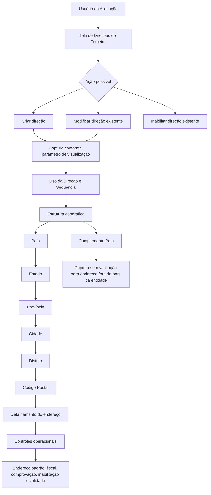

# Gestão de Endereços de Terceiros — Criação, Modificação, Complementação e Inabilitação

## 1. Metadados do Documento
- **Arquivo de Origem:** Não informado; conteúdo bruto fornecido com 6 páginas.
- **Tipo de Documento:** Manual Operacional.
- **Domínio / Sistema:** Gestão de Direções/Endereços de Terceiros em entidade seguradora.
- **Público-Alvo:** Usuários da aplicação.
- **Data/Versão Identificada:** Não identificada.

---

## 2. Resumo Executivo & Contexto de Negócio

O documento descreve uma tela destinada à gestão de endereços de um Terceiro em uma aplicação corporativa. A funcionalidade permite criar uma ou mais direções novas e também complementar, modificar ou inabilitar informações de uma direção preexistente associada ao Terceiro.

A captura e a modificação das informações dependem de uma configuração de parâmetro que determina o modo de visualização e captura da tela. A sequência operacional dos campos segue a orientação da esquerda para a direita e de cima para baixo.

A estrutura territorial do endereço é organizada em cinco níveis geográficos: País, Estado, Província, Cidade e Distrito. Cada nível utiliza códigos provenientes dos catálogos existentes no sistema, e o Código Postal está associado aos cinco níveis dessa estrutura geográfica.

O processo suporta endereços nacionais e endereços em países diferentes daquele onde está localizada a entidade seguradora. Para endereços internacionais sem cobertura nos catálogos territoriais, o campo Complemento País permite registrar informações de endereço sem realizar validação.

O documento também define controles funcionais relevantes para a qualidade e utilização operacional do endereço, incluindo definição de endereço padrão, endereço fiscal, marca de comprovação, inabilitação, data de validade e observações.

---

## 3. Arquitetura, Componentes & Tecnologias Envolvidas

O conteúdo não descreve arquitetura de software, microsserviços, protocolos, APIs, bancos de dados, URLs, ambientes ou tecnologias específicas. A descrição está limitada ao comportamento funcional da tela de endereços de Terceiros e aos campos utilizados para registrar a informação.

### Componentes funcionais identificados

| Componente | Função documentada |
| :--- | :--- |
| Tela de Direções | Permite criar, complementar, modificar ou inabilitar direções de um Terceiro. |
| Configuração de parâmetro | Define o modo de visualização e captura das informações. |
| Catálogo de Países | Disponibiliza valores possíveis para o primeiro nível da estrutura geográfica. |
| Catálogo de Estados | Disponibiliza valores possíveis para o segundo nível da estrutura geográfica. |
| Catálogo de Províncias | Disponibiliza valores possíveis para o terceiro nível da estrutura geográfica. |
| Catálogo de Localidades | Disponibiliza valores possíveis para o quarto nível da estrutura geográfica, denominado Cidade. |
| Catálogo de Distritos | Disponibiliza valores possíveis para o quinto nível da estrutura geográfica. |
| Classificação corporativa de tipos | Define o Tipo de Domicílio ou Tipo de Vía associado ao endereço. |
| Processos operativos da entidade | Utilizam ou deixam de utilizar um endereço conforme indicadores como Inabilitação, Marca de Comprovação e validade. |



> **Nota de Análise:** O documento não detalha a implementação técnica da tela, o nome do sistema, contratos de integração, persistência de dados, APIs, regras de obrigatoriedade de campos ou perfis de permissão.

---

## 4. Regras de Negócio, Especificações Funcionais & Processos

### 4.1 Objetivo funcional da tela

A tela permite aos usuários da aplicação:

1. Criar uma ou várias direções novas para um Terceiro.
2. Complementar informações de uma direção preexistente do Terceiro.
3. Modificar informações de uma direção preexistente do Terceiro.
4. Inabilitar uma direção preexistente do Terceiro.

### 4.2 Ações possíveis

| Ação | Regra funcional |
| :--- | :--- |
| Criar | Permite registrar uma nova direção para o Terceiro. |
| Modificar | Permite alterar informações de uma direção preexistente do Terceiro. |
| Inabilitar | Indica que uma direção associada ao Terceiro não deve ser utilizada nos processos operativos da entidade. |

### 4.3 Sequência de captura e modificação

A sequência de captura pode variar de acordo com a configuração de um parâmetro que informa ao sistema o modo de visualização e captura das informações.

Quando apresentada na tela, a sequência dos campos deve ser interpretada da esquerda para a direita e de cima para baixo.

### 4.4 Estrutura geográfica

A direção do Terceiro utiliza uma estrutura geográfica composta pelos seguintes níveis:

1. País — primeiro nível.
2. Estado — segundo nível.
3. Província — terceiro nível.
4. Cidade — quarto nível.
5. Distrito — quinto nível.

Cada nível apresenta códigos de acordo com as relações de valores possíveis existentes nos catálogos correspondentes do sistema.

### 4.5 Regras de detalhamento do endereço

- **Uso da Direção:** apresenta o uso atribuído a uma nova direção ou o uso previamente atribuído à direção do Terceiro. A codificação é realizada localmente pela entidade seguradora para uso posterior em processos internos.
- **Sequência/Ordem:** apresenta o número de sequência na captura das direções do Terceiro. Esse valor é atribuído automaticamente.
- **Código Postal:** identifica o Código Postal associado aos cinco níveis da estrutura geográfica.
- **Tipo de Domicílio:** contém o Tipo de Vía associado à direção, conforme classificação corporativa de tipos.
- **Direção:** apresenta o endereço detalhado conforme o Callejero e os usos locais, incluindo indicação ou não de Cerrada, Urbanização, Bloco, Escada e Apartamento.
- **Número:** apresenta ou contém o número da direção do Terceiro conforme o Tipo de Domicílio.
- **Complemento Direção:** permite registrar informações adicionais, como Urbanização, ponto quilométrico de referência ou andar de um edifício para uma Direção Comercial.

### 4.6 Regra de exclusão entre Complemento Direção e Complemento País

A captura de informações no campo **Complemento Direção** é excluinte da captura de informações no campo **Complemento País**.

O campo **Complemento País** deve ser utilizado quando a direção estiver fora do país onde se encontra a entidade seguradora e os catálogos de estrutura territorial não contiverem as informações correspondentes. Nesse caso, o campo permite capturar dados da direção sem realizar qualquer validação.

### 4.7 Coordenadas geográficas

O documento descreve Latitude e Longitude como coordenadas geográficas angulares que permitem localizar um ponto na superfície terrestre.

- Os valores são expressos em graus, minutos e segundos.
- As coordenadas podem ser acompanhadas por letras de orientação cardinal: Norte, Sul, Este e Oeste.
- A notação apresentada registra primeiro a latitude e depois a longitude.
- O documento fornece o exemplo: `(66° 33’ 9’’ N; 11° 04’ 13’’ E)`.
- A letra `W` pode aparecer no lugar de `O` para Oeste, por ser a abreviação inglesa de *West*.
- Latitude é simbolizada pela letra grega `ϕ`.
- Longitude é simbolizada pela letra grega `λ`.

### 4.8 Regras de endereços múltiplos

Quando um Terceiro possui mais de uma direção associada:

| Controle | Regra |
| :--- | :--- |
| Direção por Defeito | Indica qual é a direção padrão do Terceiro. Somente uma direção pode ser marcada como padrão. |
| Domicílio Fiscal | Indica qual é a direção fiscal do Terceiro. Somente uma direção pode ser marcada como fiscal. |

### 4.9 Qualidade, utilização e vigência

| Controle | Regra |
| :--- | :--- |
| Marca de Comprobación | Permite que os processos da entidade considerem se a direção foi revisada e verificada, em relação à qualidade dos dados no sistema. |
| Inhabilitación | Quando marcado, informa ao sistema que a direção está inabilitada e não deve ser empregada, considerada ou utilizada nos processos operativos da entidade. |
| Fecha de Validez | Indica a partir de qual data a direção do Terceiro encontra-se operativa. |
| Observaciones | Permite modificar informações complementares de uma direção preexistente e registrar informações complementares em uma nova direção. |

---

## 5. Tabelas de Parâmetros, Ambientes e Estruturas de Dados

| Item / Parâmetro | Descrição / Função | Tipo / Valores / Formato | Ambiente / Observações |
| :--- | :--- | :--- | :--- |
| Uso de la Dirección | Indica o uso de uma nova direção ou o uso previamente atribuído a uma direção do Terceiro. | Codificação local da entidade seguradora. | Utilizado posteriormente em processos internos da entidade. |
| Secuencia/Orden | Exibe o número de sequência da captura das direções do Terceiro. | Valor atribuído automaticamente. | Não há formato adicional informado. |
| País | Código do primeiro nível da estrutura geográfica. | Valores do catálogo de países. | Primeiro nível geográfico. |
| Estado | Código do segundo nível da estrutura geográfica. | Valores do catálogo de estados. | Segundo nível geográfico. |
| Provincia | Código do terceiro nível da estrutura geográfica. | Valores do catálogo de províncias. | Terceiro nível geográfico. |
| Ciudad | Código do quarto nível da estrutura geográfica. | Valores do catálogo de localidades. | Quarto nível geográfico. |
| Distrito | Código do quinto nível da estrutura geográfica. | Valores do catálogo de distritos. | Quinto nível geográfico. |
| Código Postal | Chave que identifica o Código Postal da direção. | Não informado. | Associado aos cinco níveis da estrutura geográfica. |
| Tipo de Domicilio | Tipo de Vía associado à direção. | Classificação corporativa de tipos. | Não há valores enumerados no documento. |
| Dirección | Endereço detalhado conforme Callejero e usos locais. | Texto; formato não detalhado. | Pode incluir Cerrada, Urbanização, Bloco, Escada e Apartamento. |
| Número | Número da direção do Terceiro. | Não informado. | Associado ao Tipo de Domicílio. |
| Complemento Dirección | Informações complementares da direção. | Texto; formato não detalhado. | Excludente com Complemento País. |
| Complemento País | Dados de direção não disponíveis nos catálogos territoriais. | Texto sem validação. | Aplicável a endereços fora do país da entidade seguradora. Excludente com Complemento Direção. |
| Latitud | Coordenada que determina a distância angular entre um ponto e o Equador. | Graus, minutos, segundos e orientação cardinal. | Exemplo: `66° 33’ 9’’ N`. |
| Longitud | Coordenada que determina a distância angular entre um ponto e o meridiano de Greenwich. | Graus, minutos, segundos e orientação cardinal. | Exemplo: `11° 04’ 13’’ E`. |
| Dirección por Defecto | Define a direção padrão do Terceiro. | Marca/indicador; formato não informado. | Somente uma direção pode ser marcada como padrão. |
| Marca de Comprobación | Indica se a direção foi revisada e verificada. | Marca/indicador; formato não informado. | Relacionada à qualidade dos dados. |
| Inhabilitación | Indica que uma direção não deve ser utilizada. | Marca/indicador; formato não informado. | Afeta o uso da direção em processos operativos. |
| Domicilio Fiscal | Define a direção fiscal do Terceiro. | Marca/indicador; formato não informado. | Somente uma direção pode ser marcada como fiscal. |
| Fecha de Validez | Define a data a partir da qual a direção está operativa. | Data; formato não informado. | Não há regra de data final informada. |
| Observaciones | Registra ou modifica informação complementar do endereço. | Texto; formato não informado. | Aplicável a direções novas e preexistentes. |

> **Nota de Análise:** O documento não informa ambientes, servidores, URLs, portas, variáveis de configuração, rotas de log, tecnologias de persistência ou formatos técnicos de campos.

---

## 6. Bateria de Perguntas & Respostas para RAG (FAQ Sintético)

### P1: Quais ações podem ser realizadas na tela de Direções do Terceiro?
**R:** A tela permite criar uma ou várias direções novas, complementar informações de uma direção preexistente, modificar informações de uma direção preexistente e inabilitar uma direção associada ao Terceiro.

### P2: Como é determinada a sequência de captura dos campos de endereço?
**R:** A sequência depende da configuração de um parâmetro que indica ao sistema o modo de visualização e captura das informações. A leitura dos campos ocorre da esquerda para a direita e de cima para baixo.

### P3: Quais são os níveis da estrutura geográfica utilizada para uma direção?
**R:** A estrutura geográfica possui cinco níveis: País, Estado, Província, Cidade e Distrito. Cada nível utiliza códigos de valores existentes nos respectivos catálogos do sistema.

### P4: Como o Código Postal é relacionado à direção do Terceiro?
**R:** O Código Postal é uma chave associada aos cinco níveis da estrutura geográfica em que a direção do Terceiro está localizada: País, Estado, Província, Cidade e Distrito.

### P5: Quando deve ser utilizado o campo Complemento País?
**R:** O campo Complemento País deve ser utilizado quando uma direção está fora do país da entidade seguradora e os catálogos de definição da estrutura territorial não possuem as informações correspondentes. Nesse cenário, o campo permite capturar os dados da direção sem realizar validação.

### P6: É possível preencher Complemento Direção e Complemento País simultaneamente?
**R:** Não. A captura de informações em Complemento Direção é excluinte da captura no campo Complemento País.

### P7: O que pode ser registrado no campo Complemento Direção?
**R:** O campo Complemento Direção pode registrar informações complementares como a Urbanização do domicílio, um ponto quilométrico que facilite a localização do domicílio ou o andar de um edifício onde o Terceiro está localizado em uma direção tipificada como Direção Comercial.

### P8: Como devem ser informadas Latitude e Longitude?
**R:** Latitude e Longitude devem conter graus, minutos e segundos que identifiquem as coordenadas geográficas. O exemplo fornecido é latitude `66° 33’ 9’’ N` e longitude `11° 04’ 13’’ E`.

### P9: Quantas direções padrão um Terceiro pode possuir?
**R:** Um Terceiro com mais de uma direção associada pode possuir somente uma direção marcada como Direção por Defeito, isto é, a direção padrão.

### P10: Quantas direções fiscais um Terceiro pode possuir?
**R:** Um Terceiro com mais de uma direção associada pode possuir somente uma direção marcada como Domicílio Fiscal.

### P11: Qual é o efeito da Inhabilitación de uma direção?
**R:** A marcação de Inhabilitación informa ao sistema que a direção associada ao Terceiro está inabilitada. Portanto, ela não deve ser empregada, contemplada ou utilizada nos processos operativos da entidade.

### P12: Para que serve a Marca de Comprobación?
**R:** A Marca de Comprobación permite que os processos da entidade considerem se a direção do Terceiro foi revisada e verificada, em relação à qualidade dos dados registrados no sistema.

### P13: O que representa a Fecha de Validez de uma direção?
**R:** A Fecha de Validez indica a data a partir da qual a direção do Terceiro encontra-se operativa.

### P14: O que é atribuído automaticamente durante a captura de direções?
**R:** O campo Secuencia/Orden apresenta o número de sequência da captura das direções do Terceiro, e esse valor é atribuído automaticamente.

---

## 7. Glossário de Termos, Siglas & Conceitos-Chave

- **Terceiro:** Entidade para a qual uma ou mais direções podem ser associadas na aplicação.
- **Dirección:** Endereço detalhado do Terceiro, conforme Callejero e usos locais.
- **Uso de la Dirección:** Uso atribuído à direção, codificado localmente pela entidade seguradora para processos internos.
- **Secuencia/Orden:** Número de sequência na captura das direções do Terceiro, atribuído automaticamente.
- **Callejero:** Referência utilizada para descrever o endereço detalhado conforme os usos locais.
- **Tipo de Domicilio / Tipo de Vía:** Classificação corporativa do tipo de via associada ao endereço.
- **Complemento Dirección:** Informação adicional sobre a direção, como Urbanização, ponto quilométrico ou andar.
- **Complemento País:** Campo para registrar sem validação uma direção localizada fora do país da entidade seguradora quando não houver informação territorial nos catálogos.
- **Latitud:** Ângulo que determina a distância entre um ponto e o Equador; simbolizada por `ϕ`.
- **Longitud:** Ângulo que determina a distância entre um ponto e o meridiano de Greenwich; simbolizada por `λ`.
- **Dirección por Defecto:** Direção padrão do Terceiro.
- **Marca de Comprobación:** Indicador de que a direção foi revisada e verificada.
- **Inhabilitación:** Indicador de que a direção não deve ser utilizada nos processos operativos.
- **Domicilio Fiscal:** Direção fiscal do Terceiro.
- **Fecha de Validez:** Data a partir da qual a direção encontra-se operativa.

---

## 8. Notas Críticas, Riscos & Limitações

- O documento não identifica o nome da aplicação, versão, data, responsáveis, ambientes ou tecnologias envolvidas.
- Não há detalhamento de campos obrigatórios, formatos técnicos, tamanhos máximos, máscaras, validações de domínio ou mensagens de erro.
- Não são informadas regras de dependência entre País, Estado, Província, Cidade, Distrito e Código Postal além da associação aos catálogos e aos cinco níveis geográficos.
- A regra de exclusão entre Complemento Direção e Complemento País é explícita, mas o documento não descreve como a interface deve impedir ou sinalizar o preenchimento simultâneo.
- Direção por Defeito e Domicílio Fiscal possuem restrição explícita de unicidade, mas não há descrição do comportamento do sistema quando um usuário tenta marcar uma segunda direção.
- O documento menciona a inabilitação de direções, mas não especifica se uma direção inabilitada pode ser reabilitada.
- Não há informação sobre regras de autorização, auditoria, histórico de alterações, integração com outros sistemas ou persistência de dados.
- A página 6 não contém conteúdo textual funcional adicional.

---

## 9. Conteúdo Bruto Estruturado (Referência Fiel)

```text
--- [PÁGINA 1 DE 6] ---

MODIFICAR Direcciones del Tercero
Objetivo
Esta Pantalla permite a los Usuarios de la Aplicación Crear una o varias Direcciones nuevas del
Tercero además de Complementar, Modificar ó Inhabilitar la información de una Dirección
Preexistente del Tercero.
Posibles Acciones
 CREAR ( )
 MODIFICAR ( )
 INHABILITAR ( )
Direcciones
La secuencia de captura puede ser..
 /
 RS
Inicio Soluciones APIs Documentación Zeus
ES

--- [PÁGINA 2 DE 6] ---

... De acuerdo con la configuración del parámetro que le indica al Sistema el modo de visualización y
captura de la información.
De Izquierda a Derecha y de Arriba hacia Abajo, los siguientes campos marcan la secuencia de
captura o modificación del Tercero en el sistema.
Uso de la Dirección (   )
Este dato mostrará el uso que va a tener la Dirección en una nueva dirección o el que previamente
se le asignó a la Dirección del Tercero de acuerdo con la codificación efectuada localmente por parte
de la entidad aseguradora para su posterior uso en los procesos internos de la entidad.
Secuencia/Orden
Este dato muestra el Número de Secuencia en la Captura de las Direcciones del Tercero. Es un valor
que se asigna automáticamente.
País (   )
Este Campo contiene el código del primer nivel de la estructura Geográfica en la que se encuentra
ubicada la Dirección del Tercero de acuerdo con la relación de posibles valores existentes en el
catálogo de países existente en el Sistema.
Ejemplo:

--- [PÁGINA 3 DE 6] ---

Estado (   )
Este Campo contiene el código del segundo nivel de la estructura Geográfica en la que se encuentra
ubicada la Dirección del Tercero de acuerdo con la relación de posibles valores existentes en el
catálogo de estados existente en el Sistema.
Provincia (   )
Este Campo contiene el código del tercer nivel de la estructura Geográfica en la que se encuentra
ubicada la Dirección del Tercero de acuerdo con la relación de posibles valores existentes en el
catálogo de provincias existente en el Sistema.
Ciudad (   )
Este Campo contiene el código del cuarto nivel de la estructura Geográfica en la que se encuentra
ubicada la Dirección del Tercero de acuerdo con la relación de posibles valores existentes en el
catálogo de localidades existente en el Sistema.
Distrito (   )
Este Campo contiene el código del quinto nivel de la estructura Geográfica en la que se encuentra
ubicada la Dirección del Tercero de acuerdo con la relación de posibles valores existentes en el
catálogo de distritos existente en el Sistema.
Código Postal (   )
Esta Propiedad contiene la clave que identifica el Código Postal asociado a los cinco niveles de la
estructura geográfica en la que está ubicada la Dirección del Tercero.
Tipo de Domicilio (   )
Este dato contendrá el Tipo de Vía que se va a asociar a la Dirección del Tercero de acuerdo con la
clasificación de tipos corporativa.
Dirección (  )
Este Campo muestra la Dirección detallada de acuerdo con el Callejero y los usos locales (Indicación
o no de la Cerrada, Urbanización, Bloque, Escalera, Apartamento,...)
Número (  )
Este Atributo muestra o contendrá el número de la Dirección del Tercero de acuerdo con su tipo de
domicilio.
Ejemplo:

--- [PÁGINA 4 DE 6] ---

Complemento Dirección (  )
Este Campo permite capturar información complementaria de la Dirección del Tercero como por
ejemplo:
1. Para indicar la Urbanización del Domicilio.
2. Para indicar algún punto kilométrico que facilite la ubicación del Domicilio.
3. Para indicar la Planta del Edificio en la que se encuentra la ubicación del Tercero en una
Dirección tipificada como Dirección Comercial,
Complemento País (  )
Si la dirección que se está capturando en el sistema no es del país en el que se encuentra la entidad
aseguradora es posible que no se cuente en los catálogos de definición de la estructura territorial la
información correspondiente, por lo cual este campo permite capturar 'sin realizar validación alguna'
los datos de la dirección.
La captura de información en el Campo Complemento Dirección es excluyente de la captura de
información del Campo Complemento País
Latitud (  )
La latitud y la longitud son los dos tipos de coordenadas geográficas angulares que conforman el
sistema de referencia planetario y que permiten ubicar un punto cualquiera en la superficie del
planeta Tierra.
El sistema de coordenadas que componen la latitud y longitud, conocido como Sistema de
Coordenadas Geográficas, tiene como centro imaginario el centro de la Tierra y expresa sus valores
en grados, minutos y segundos, acompañados de una letra que indica la orientación cardinal dentro
del globo: Norte, Sur, Este u Oeste. Esta información suele anotarse entre paréntesis y se escriben
primero los datos de la latitud y luego los de la longitud.
Por ejemplo: Coordenadas del punto X: (66° 33’ 9’’ N; 11° 04’ 13’’ E)
Es decir, el punto X está a 66 grados, 33 minutos, 9 segundos latitud norte, 11 grados, 4 minutos, 13
segundos longitud este. Es posible encontrar en algunos casos la letra W en vez de O para oeste, ya
que se trata del término en inglés (West).
Latitud. Es el ángulo imaginario que determina la distancia entre un punto cualquiera y el ecuador (la
línea imaginaria horizontal que divide al mundo en dos hemisferios: Norte y Sur). En otras palabras,
se trata de qué tan lejos o tan cerca está un punto de la referencia del ecuador y de los trópicos que
le son paralelos: el trópico de Cáncer y el de Capricornio. La latitud se simboliza con la letra griega
phi, ϕ.

--- [PÁGINA 5 DE 6] ---

Longitud. Es el ángulo imaginario que determina la distancia entre un punto y el meridiano de
Greenwich o meridiano 0, que atraviesa la localidad del mismo nombre en Inglaterra. Dicho
meridiano es vertical y divide al mundo en dos regiones, la occidental (Oeste) y la oriental (Este), y
sirve para trazar los demás meridianos que cruzan imaginariamente el globo de manera paralela al
meridiano de Greenwich. La longitud se simboliza con la letra griega lambda, λ.
Este Atributo de la dirección del Tercero tiene que contener la información correspondiente a los
grados, minutos y segundos que identifiquen su latitud, ... en nuestro ejemplo 66° 33’ 9’’ N
Longitud (  )
Este Atributo de la Dirección del Tercero debe contener la información correspondiente a los grados,
minutos y segundos que identifican su longitud, ... con los datos del ejemplo anterior 11° 04’ 13’’ E
Dirección por Defecto (  )
Este Campo, en aquellos Terceros que cuentan con más de una dirección asociada, indicará
cual de ellas es la Dirección por Defecto del Tercero. Solamente puede haber una marcada como tal.
Marca de Comprobación (  )
Esta propiedad permite considerar en los procesos de la entidad si la Dirección del Tercero ha sido o
no revisada y verificada, todo ello en relación con la calidad de los datos en el sistema.
Inhabilitación (  )
El cotejo de este campo le indica al Sistema que la Dirección asociada al Tercero está inhabilitada,
por lo que no debería ser empleada, contemplada o utilizada en los procesos operativos de la
entidad.
Domicilio Fiscal (  )
Este Campo, en aquellos Terceros que tienen más de una dirección asociada, indicará cual de
ellas es la Dirección Fiscal del Tercero. Solamente puede haber una marcada como tal.
Fecha de Validez ( )
Esta propiedad indicará la Fecha de Validez de la Dirección del Tercero, es decir, a partir de qué
fecha se encuentra operativa.
Observaciones (  )
Este campo permitirá la modificación de la información complementaria de la Dirección para una
Dirección del Tercero preexistente además de permitir su registro para una nueva Dirección del
Tercero.

--- [PÁGINA 6 DE 6] ---

[Página em branco ou apenas elementos visuais/imagem]
```
