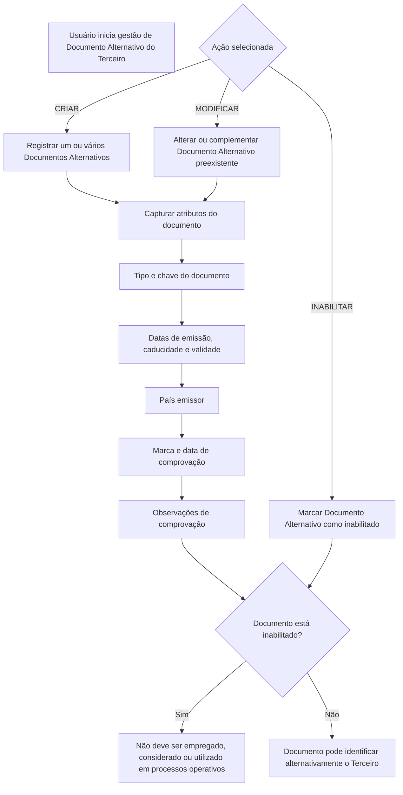

# Gestão de Documentos Alternativos do Terceiro — Criar, Modificar, Complementar e Inabilitar

## 1. Metadados do Documento
- **Arquivo de Origem:** `Não identificado`
- **Tipo de Documento:** `Especificação Técnica / Funcional`
- **Domínio / Sistema:** `Gestão de Terceiros — Documentos Alternativos`
- **Público-Alvo:** `Operação, analistas funcionais e usuários do sistema`
- **Data/Versão Identificada:** `Não identificada`

---

## 2. Resumo Executivo & Contexto de Negócio

O documento descreve a ação **“Modificar Documentos Alternativos del Tercero”**, destinada à gestão de documentos alternativos usados para identificar um Terceiro no sistema. A funcionalidade permite criar um ou vários documentos alternativos e também complementar, modificar ou inabilitar informações previamente existentes.

As ações disponíveis para o documento alternativo são **CRIAR**, **MODIFICAR** e **INABILITAR**. O texto não detalha permissões por perfil, métodos de acesso, serviços de backend, contratos de integração ou persistência dos dados.

O processo de captura ou alteração é apresentado como uma sequência de campos preenchidos ou modificados da esquerda para a direita e de cima para baixo. Os dados abrangem identificação do documento, datas relevantes, país emissor, verificação, observações, validade e estado de inabilitação.

A gestão adequada desses atributos contribui para a qualidade dos dados do Terceiro, especialmente por meio da marca de comprovação, data de comprovação, observações de validação, data de validade e inabilitação do documento em processos operacionais.

---

## 3. Arquitetura, Componentes & Tecnologias Envolvidas

O documento cita os seguintes elementos funcionais:

| Componente / Elemento | Papel descrito |
| :--- | :--- |
| Terceiro | Entidade identificada por documentos alternativos. |
| Documento Alternativo | Documento utilizado para identificar alternativamente o Terceiro. |
| Catálogo de países | Relação de valores utilizada para selecionar o país emissor do documento alternativo. |
| Sistema | Sistema que armazena, considera ou deixa de utilizar o documento alternativo nos processos operacionais da entidade. |
| Processos da entidade | Processos que podem considerar o documento como revisado, verificado, válido ou inabilitado. |
| Colapsador | Elemento que contém o tipo de documento alternativo. |
| Painel | Elemento que contém a chave do documento alternativo do Terceiro. |



> **Nota de Análise:** O documento não especifica tecnologias, microsserviços, APIs, URLs, bancos de dados, métodos HTTP, contratos JSON, ambientes ou mecanismos de autenticação.

---

## 4. Regras de Negócio, Especificações Funcionais & Processos

### 4.1 Objetivo da ação

A ação permite:

1. Criar um ou vários Documentos Alternativos do Terceiro.
2. Complementar as informações de um Documento Alternativo preexistente.
3. Modificar as informações de um Documento Alternativo preexistente.
4. Inabilitar um Documento Alternativo do Terceiro.

### 4.2 Ações possíveis

- **CRIAR:** criar documento alternativo para o Terceiro.
- **MODIFICAR:** alterar ou complementar as informações de um documento alternativo existente.
- **INABILITAR:** indicar que o documento alternativo está inabilitado.

### 4.3 Sequência de captura ou modificação

Os campos apresentados devem seguir a sequência de captura ou modificação indicada no documento: **da esquerda para a direita e de cima para baixo**.

### 4.4 Regras associadas aos atributos

1. O **Tipo Documento Alternativo** determina o documento pelo qual o Terceiro será identificado alternativamente, conforme os tipos de documentos existentes.
2. A **Clave do Documento Alternativo** contém a chave do documento alternativo do Terceiro.
3. A **Fecha de Emisión** contém ou apresenta a data de emissão do documento alternativo.
4. A **Fecha de Caducidad** indica a data de caducidade quando essa data for conhecida de forma confiável.
5. O **País Emisor** deve conter o código do país emissor segundo o catálogo de países existente no sistema.
6. A **Marca de Comprobación** indica se o documento alternativo foi revisado e verificado nos processos da entidade, em relação à qualidade dos dados.
7. A **Fecha de Comprobación** deve conter a data em que a revisão e comprovação foram realizadas quando o estado da marca de comprovação indicar que o documento foi revisado e comprovado.
8. As **Observaciones** permitem registrar texto explicativo ou observações sobre a comprovação quando o documento alternativo tiver sido revisado e validado.
9. A **Fecha de Validez** indica a partir de qual data o documento alternativo estará plenamente operativo no sistema. Seu uso correto permite manter histórico das alterações efetuadas nas informações do documento.
10. O estado de **Inhabilitación** informa que o documento alternativo está inabilitado e, portanto, não deve ser empregado, considerado ou utilizado nos processos operativos da entidade.

---

## 5. Tabelas de Parâmetros, Ambientes e Estruturas de Dados

| Item / Parâmetro | Descrição / Função | Tipo / Valores / Formato | Ambiente / Observações |
| :--- | :--- | :--- | :--- |
| Ação | Define a operação sobre o Documento Alternativo do Terceiro. | `CRIAR`, `MODIFICAR`, `INABILITAR` | O documento não detalha regras de transição entre ações. |
| Tipo Documento Alternativo | Identifica o tipo de documento usado alternativamente para identificar o Terceiro. | Tipos de documentos existentes | Contido no colapsador. |
| Clave do Documento Alternativo | Contém a chave do documento alternativo do Terceiro. | Não especificado | Contida no painel. |
| Fecha de Emisión | Contém ou apresenta a data de emissão do documento alternativo. | Data; formato não especificado | Não há regra adicional descrita. |
| Fecha de Caducidad | Indica a data de caducidade do documento alternativo. | Data; formato não especificado | Aplicável quando a data for conhecida de forma confiável. |
| País Emisor | Contém o código do país emissor do documento alternativo. | Código de país | Deve seguir os valores do catálogo de países existente no sistema. |
| Marca de Comprobación | Indica se o documento foi revisado e verificado. | Estado de comprovação; valores não especificados | Relacionada à qualidade dos dados no sistema. |
| Fecha de Comprobación | Registra a data em que ocorreu a revisão e comprovação. | Data; formato não especificado | Preenchida quando a marca de comprovação indicar documento revisado e comprovado. |
| Observaciones | Permite registrar texto aclaratório ou observações sobre a comprovação. | Texto; formato não especificado | Aplicável quando o documento foi revisado e validado. |
| Fecha de Validez | Determina a data a partir da qual o documento estará plenamente operativo no sistema. | Data; formato não especificado | Permite manter histórico de alterações das informações. |
| Inhabilitación | Indica que o documento alternativo está inabilitado. | Marca ou estado; valores não especificados | Documento inabilitado não deve ser utilizado em processos operativos. |

---

## 6. Bateria de Perguntas & Respostas para RAG (FAQ Sintético)

### P1: Qual é o objetivo da ação “Modificar Documentos Alternativos del Tercero”?
**R:** A ação permite criar um ou vários Documentos Alternativos do Terceiro, além de complementar, modificar ou inabilitar informações de um Documento Alternativo preexistente.

### P2: Quais ações podem ser realizadas sobre um Documento Alternativo do Terceiro?
**R:** O documento apresenta três ações possíveis: **CRIAR**, **MODIFICAR** e **INABILITAR**.

### P3: O que representa o Tipo Documento Alternativo?
**R:** O Tipo Documento Alternativo é o atributo que contém o tipo de documento pelo qual o Terceiro será identificado alternativamente, de acordo com os tipos de documentos existentes.

### P4: Qual campo armazena a chave do Documento Alternativo do Terceiro?
**R:** A **Clave do Documento Alternativo** é o atributo do painel que contém a chave do documento alternativo do Terceiro.

### P5: Quando a Fecha de Caducidad deve ser informada?
**R:** A Fecha de Caducidad indica a data de caducidade do Documento Alternativo do Terceiro quando essa data for conhecida de forma confiável.

### P6: Como deve ser informado o país emissor do documento alternativo?
**R:** O campo **País Emisor** deve conter o código do país emissor do documento alternativo, conforme a relação de valores existente no catálogo de países do sistema.

### P7: Para que serve a Marca de Comprobación?
**R:** A Marca de Comprobación permite considerar, nos processos da entidade, se o documento alternativo foi revisado e verificado, em relação à qualidade dos dados mantidos no sistema.

### P8: Em que situação a Fecha de Comprobación deve conter uma data?
**R:** A Fecha de Comprobación deve registrar a data da ação quando o estado da Marca de Comprobación indicar que o documento alternativo foi revisado e comprovado.

### P9: Quando devem ser registradas Observaciones?
**R:** Observaciones permitem inserir texto aclaratório ou observações sobre a comprovação quando o documento alternativo tiver sido revisado e validado.

### P10: Qual é a finalidade da Fecha de Validez?
**R:** A Fecha de Validez indica a partir de qual data o Documento Alternativo do Terceiro estará plenamente operativo no sistema. O uso correto desse campo permite manter histórico dos cambios efetuados nas informações.

### P11: O que acontece quando um Documento Alternativo está inabilitado?
**R:** Quando o campo de Inhabilitación estiver marcado, o sistema deve considerar que o documento alternativo está inabilitado. Esse documento não deve ser empregado, considerado ou utilizado nos processos operativos da entidade.

### P12: O documento define APIs, métodos HTTP ou contratos JSON para gestão de Documentos Alternativos?
**R:** Não. O documento descreve ações e campos funcionais da gestão de Documentos Alternativos do Terceiro, mas não detalha APIs, métodos HTTP, contratos JSON, serviços de backend ou integrações.

---

## 7. Glossário de Termos, Siglas & Conceitos-Chave

- **Terceiro:** Entidade identificada no sistema por meio de documentos, incluindo documentos alternativos.
- **Documento Alternativo:** Documento utilizado para identificar alternativamente o Terceiro.
- **CRIAR:** Ação para registrar um ou vários Documentos Alternativos do Terceiro.
- **MODIFICAR:** Ação para alterar ou complementar informações de um Documento Alternativo preexistente.
- **INABILITAR:** Ação ou condição que informa que o Documento Alternativo não deve ser utilizado nos processos operativos.
- **Clave do Documento Alternativo:** Chave associada ao Documento Alternativo do Terceiro.
- **Marca de Comprobación:** Indicador de que o Documento Alternativo foi revisado e verificado.
- **Fecha de Comprobación:** Data em que a revisão e comprovação do Documento Alternativo foram realizadas.
- **Fecha de Validez:** Data a partir da qual o Documento Alternativo estará plenamente operativo no sistema.
- **País Emisor:** País emissor do Documento Alternativo, representado por código oriundo do catálogo de países.
- **Colapsador:** Elemento que contém o atributo Tipo Documento Alternativo.
- **Painel:** Elemento que contém a chave do Documento Alternativo do Terceiro.

---

## 8. Notas Críticas, Riscos & Limitações

- O documento não identifica nome de arquivo, versão, data, sistema específico, ambiente ou responsável.
- Não são detalhadas regras de obrigatoriedade, formatos de data, tamanhos de campo, validações de chave ou valores possíveis para marcas e estados.
- Não são apresentadas permissões, perfis de acesso, matriz de responsabilidades ou trilha de auditoria.
- Não há especificação de APIs, integrações, banco de dados, microsserviços, contratos JSON ou mecanismos de tratamento de erros.
- A data de caducidade somente é aplicável quando conhecida de forma confiável.
- A data de comprovação depende de o estado da Marca de Comprobación indicar que o documento foi revisado e comprovado.
- Um Documento Alternativo inabilitado não deve ser empregado, considerado ou utilizado em processos operativos da entidade.

---

## 9. Conteúdo Bruto Estruturado (Referência Fiel)

```text
--- [PÁGINA 1 DE 3] ---

MODIFICAR Documentos Alternativos del
Tercero
Objetivo
Esta acción permite Crear uno o varios Documentos Alternativos del Tercero además de poder
Complementar, Modificar ó Inhabilitar la información de un Documento Alternativo preexistente del
Tercero.
Posibles Acciones
 CREAR ( )
 MODIFICAR ( )
 INHABILITAR ( )
Documentos Alternativos
De Izquierda a Derecha y de Arriba hacia Abajo, los siguientes campos marcan la secuencia de
captura o modificación del Tercero en el sistema.
Tipo Documento Alternativo (  )
 / 
 RS
Inicio Soluciones APIs Documentación Zeus
ES


--- [PÁGINA 2 DE 3] ---

Este Atributo del colapsador contiene el documento alternativo con el que se va a identificar
alternativamente al Tercero de acuerdo con los tipos de documentos existentes.
Clave del Documento Alternativo ( )
Este Atributo del panel contiene la clave del documento alternativo del Tercero.
Fecha de Emisión (  )
Esta propiedad mostrará o contendrá la Fecha de Emisión del Documento Alternativo del Tercero.
Fecha de Caducidad (  )
Esta propiedad indica la Fecha de Caducidad del Documento Alternativo del Tercero en el supuesto
que la misma se conozca fehacientemente.
País Emisor (   )
Este Campo contiene el código del país emisor del documento alternativo del Tercero de acuerdo con
la relación de posibles valores existentes en el catálogo de países existente en el Sistema.
Marca de Comprobación (  )
Esta propiedad permite considerar en los procesos de la entidad si el documento alternativo ha sido o
no revisado y verificado, todo ello en relación con la calidad de los datos en el sistema.
Fecha de Comprobación (  )
En el supuesto que el estado de la marca de comprobación implique que el documento alternativo ha
sido revisado y comprobado, este campo contemplará la fecha en la que esta acción se habrá
realizado.
Observaciones (  )
Caso que el documento alternativo haya sido revisado y validado, este Dato permite ingresar un texto
aclaratorio u observaciones al hecho de la comprobación.
Fecha de Validez ( )
Esta propiedad le indica al sistema la fecha a partir de la cual el Documento Alternativo del Tercero
estará plenamente operativo en el sistema por lo que su correcto uso permite tener un histórico de
los cambios efectuados en su información.
Inhabilitación (  )


--- [PÁGINA 3 DE 3] ---

El cotejo de este campo le indica al Sistema que el documento alternativo del Tercero está
inhabilitado, por lo que no debería ser empleado, considerado o utilizado en los procesos operativos
de la entidad.
```
