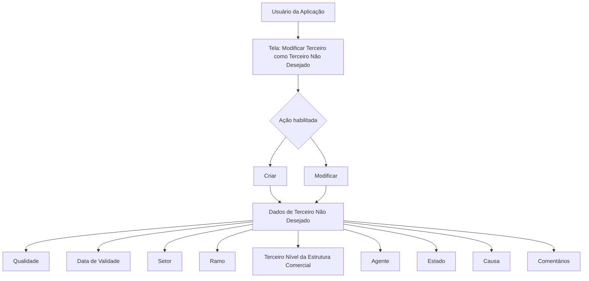

# Registro e Modificação de Terceiro como Terceiro Não Desejado

## 1. Metadados do Documento
- **Arquivo de Origem:** Não identificado
- **Tipo de Documento:** Especificação Técnica
- **Domínio / Sistema:** Cadastro de Terceiros / Terceiros Não Desejados
- **Público-Alvo:** Usuários da aplicação, Analistas Funcionais, Desenvolvedores e Operação
- **Data/Versão Identificada:** Não identificada

---

## 2. Resumo Executivo & Contexto de Negócio

O documento descreve a tela **“Modificar Tercero como Tercero No Deseado”**, destinada ao registro ou à modificação de informações que classificam um Terceiro como não desejado no sistema.

A finalidade declarada é permitir que usuários da aplicação identifiquem um Terceiro como não desejado conforme o seu código de atividade e valores que o identificam inequivocamente como Terceiro no sistema.

A tela possui as ações habilitadas **CRIAR** e **MODIFICAR**. O conteúdo documentado concentra-se nos atributos de captura e consulta associados à classificação de Terceiro Não Desejado.

A classificação considera informações como qualidade, data de validade, setor, ramo, terceiro nível da estrutura comercial, agente, estado, causa e comentários. A causa de inabilitação é associada a configurações existentes por código de atividade no sistema.

Não há detalhamento sobre persistência, validações obrigatórias, métodos HTTP, contratos JSON, perfis de acesso, mensagens de erro ou integrações externas.

---

## 3. Arquitetura, Componentes & Tecnologias Envolvidas

O texto apresenta uma funcionalidade de aplicação para manutenção de dados de **Terceiros Não Desejados**. São citados elementos de navegação ou interface denominados **Inicio**, **Soluciones**, **APIs**, **Documentación** e **Zeus**, sem descrição de integração, responsabilidade técnica ou arquitetura.



> **Nota de Análise:** O documento não descreve componentes de backend, banco de dados, APIs, tecnologias, ambientes, protocolos, URLs, logs ou contratos de integração.

---

## 4. Regras de Negócio, Especificações Funcionais & Processos

1. A tela permite **registrar** um Terceiro como Terceiro Não Desejado.
2. A tela permite **modificar** informações de um Terceiro já identificado como Terceiro Não Desejado.
3. A identificação do Terceiro como não desejado deve considerar:
   - o código de atividade;
   - valores que identifiquem inequivocamente o Terceiro no sistema.
4. A sequência de captura das informações é apresentada como sendo da esquerda para a direita e de cima para baixo.
5. O campo **Qualidade** identifica o código de qualidade associado ao Terceiro, conforme valores previamente codificados no catálogo mestre do sistema.
6. A associação da Qualidade ocorre no momento do registro do Terceiro como Terceiro Não Desejado.
7. A **Data de Validade** apresenta a data a partir da qual o Terceiro é identificado como Terceiro Não Desejado.
8. O campo **Setor** contém o código do setor no qual o Terceiro é considerado não desejado.
9. O campo **Ramo** apresenta o código do ramo técnico para o qual o Terceiro é considerado não desejado.
10. O **Terceiro Nível da Estrutura Comercial** determina o código do terceiro nível da estrutura comercial no qual o Terceiro é considerado não desejado.
11. O campo **Agente** contém o código do agente para o qual o Terceiro é considerado não desejado.
12. O atributo **Estado** determina a classificação das possíveis condições e situações que identificam o Terceiro como Terceiro Não Desejado.
13. O atributo **Causa** identifica o motivo pelo qual o Terceiro é inabilitado e considerado não desejado.
14. A Causa deve estar de acordo com causas ou motivos de inabilitação configurados por código de atividade no sistema.
15. O atributo **Comentários** permite capturar texto plano para ampliar ou detalhar o motivo pelo qual o Terceiro é considerado uma pessoa física ou jurídica indesejável.

---

## 5. Tabelas de Parâmetros, Ambientes e Estruturas de Dados

| Item / Parâmetro | Descrição / Função | Tipo / Valores / Formato | Ambiente / Observações |
| :--- | :--- | :--- | :--- |
| Ação: Criar | Permite registrar um Terceiro como Terceiro Não Desejado. | Ação habilitada. | O documento não detalha pré-requisitos, validações ou persistência. |
| Ação: Modificar | Permite modificar informações do Terceiro como Terceiro Não Desejado. | Ação habilitada. | O documento não detalha critérios de localização ou alteração do registro. |
| Código de atividade | Elemento considerado para identificar e classificar o Terceiro como não desejado. | Código; formato não informado. | Também é referência para causas ou motivos de inabilitação configurados no sistema. |
| Qualidade | Identifica o código de qualidade associado ao Terceiro. | Código proveniente do catálogo mestre do sistema. | Associado no momento do registro como Terceiro Não Desejado. |
| Data de Validade | Mostra a data a partir da qual o Terceiro está identificado como não desejado. | Data; formato não informado. | Não há detalhamento sobre data final, expiração ou regras de cálculo. |
| Setor | Contém o código do setor no qual o Terceiro é considerado não desejado. | Código; formato não informado. | Sem catálogo ou valores enumerados no documento. |
| Ramo | Mostra o código do ramo técnico para o qual o Terceiro é considerado não desejado. | Código; formato não informado. | Sem catálogo ou valores enumerados no documento. |
| Terceiro Nível da Estrutura Comercial | Determina o código do terceiro nível da estrutura comercial aplicável ao Terceiro. | Código; formato não informado. | O documento não define os demais níveis da estrutura comercial. |
| Agente | Contém o código do agente para o qual o Terceiro é considerado não desejado. | Código; formato não informado. | Sem catálogo ou valores enumerados no documento. |
| Estado | Determina a classificação das condições e situações que identificam o Terceiro como não desejado. | Classificação; valores não informados. | Não há máquina de estados nem transições documentadas. |
| Causa | Identifica o motivo de inabilitação e classificação como Terceiro Não Desejado. | Causa ou motivo configurado por código de atividade. | O documento não enumera as causas disponíveis. |
| Comentários | Permite detalhar o motivo da classificação do Terceiro como pessoa física ou jurídica indesejável. | Texto plano. | Não há limite de caracteres ou regras de preenchimento informados. |

---

## 6. Bateria de Perguntas & Respostas para RAG (FAQ Sintético)

### P1: Qual é o objetivo da tela “Modificar Terceiro como Terceiro No Deseado”?
**R:** A tela permite que usuários da aplicação registrem um Terceiro como Terceiro Não Desejado ou modifiquem as informações dessa classificação. A identificação deve considerar o código de atividade e valores que identifiquem inequivocamente o Terceiro no sistema.

### P2: Quais ações estão habilitadas na tela de Terceiros Não Desejados?
**R:** O documento identifica duas ações habilitadas: **CRIAR** e **MODIFICAR**. Não há detalhamento sobre permissões, etapas de confirmação, persistência ou validações de cada ação.

### P3: Como a Qualidade é definida para um Terceiro Não Desejado?
**R:** O campo Qualidade identifica o código de qualidade associado ao Terceiro, de acordo com valores previamente codificados no catálogo mestre do sistema. Essa associação é mencionada no contexto do registro do Terceiro como não desejado.

### P4: O que representa a Data de Validade do Terceiro Não Desejado?
**R:** A Data de Validade mostra a data a partir da qual o Terceiro está identificado como Terceiro Não Desejado. O documento não informa formato de data, prazo de vigência, data de término ou regras de cálculo.

### P5: Para que servem os campos Setor e Ramo?
**R:** O campo Setor contém o código do setor no qual o Terceiro é considerado não desejado. O campo Ramo mostra o código do ramo técnico para o qual o Terceiro possui essa classificação.

### P6: O que é o Terceiro Nível da Estrutura Comercial?
**R:** É o atributo que determina o código do terceiro nível da Estrutura Comercial no qual o Terceiro é considerado não desejado. O documento não descreve os demais níveis dessa estrutura nem os valores permitidos.

### P7: Qual informação é registrada no campo Agente?
**R:** O campo Agente contém o código do agente para o qual o Terceiro está considerado como não desejado. Não foram documentadas regras de seleção, validação ou catálogo de agentes.

### P8: Como o Estado contribui para a classificação de um Terceiro Não Desejado?
**R:** O atributo Estado determina a classificação das possíveis condições e situações que identificam o Terceiro como Terceiro Não Desejado. O documento não especifica estados possíveis, transições ou regras de mudança.

### P9: Como a Causa de inabilitação é determinada?
**R:** A Causa identifica o motivo pelo qual o Terceiro está sendo inabilitado e considerado não desejado. As causas ou motivos de inabilitação devem estar configurados no sistema de acordo com o código de atividade.

### P10: Qual é a finalidade do campo Comentários?
**R:** O campo Comentários permite capturar texto plano para ampliar ou detalhar o motivo pelo qual o Terceiro está sendo considerado uma pessoa física ou jurídica indesejável.

---

## 7. Glossário de Termos, Siglas & Conceitos-Chave

- **Terceiro:** Entidade identificada no sistema que pode ser classificada como Terceiro Não Desejado.
- **Terceiro Não Desejado:** Classificação atribuída a um Terceiro, associada a código de atividade, condições, estado, causa e demais atributos documentados.
- **Código de atividade:** Código utilizado como referência para a identificação do Terceiro e para a configuração de causas ou motivos de inabilitação.
- **Catálogo mestre:** Catálogo do sistema que contém valores previamente codificados, citado como fonte para o código de Qualidade.
- **Qualidade:** Código associado ao Terceiro conforme valores previamente codificados no catálogo mestre.
- **Setor:** Código do setor no qual o Terceiro é considerado não desejado.
- **Ramo técnico:** Código do ramo técnico para o qual o Terceiro é considerado não desejado.
- **Estrutura Comercial:** Estrutura organizacional ou comercial cujo terceiro nível possui um código associado à classificação do Terceiro.
- **Agente:** Código do agente para o qual o Terceiro é considerado não desejado.
- **Estado:** Classificação das condições e situações que identificam o Terceiro como não desejado.
- **Causa:** Motivo de inabilitação do Terceiro, configurado por código de atividade.
- **Pessoa Física ou Jurídica:** Categorias mencionadas para descrever o Terceiro considerado indesejável.

---

## 8. Notas Críticas, Riscos & Limitações

- O nome do arquivo de origem, a data e a versão do documento não foram fornecidos.
- A terceira página é indicada como página em branco ou composta apenas por elementos visuais/imagem; não há conteúdo textual adicional extraído.
- O documento não informa quais campos são obrigatórios, opcionais, editáveis ou somente leitura.
- Não foram documentados tipos técnicos, tamanhos, máscaras, valores permitidos, catálogos completos ou regras de validação dos campos.
- Não há detalhamento de APIs, métodos HTTP, contratos JSON, banco de dados, integrações, logs, URLs, servidores ou ambientes.
- Não há informações sobre perfis de acesso, autorização para as ações Criar e Modificar, auditoria ou rastreabilidade de alterações.
- Não há definição de estados disponíveis, transições de Estado ou relação formal entre Estado, Causa e Data de Validade.
- **Nota de Análise:** O documento descreve atributos funcionais da tela, mas não detalha o comportamento técnico necessário para implementar ou operar integrações associadas.

---

## 9. Conteúdo Bruto Estruturado (Referência Fiel)

```text
--- [PÁGINA 1 DE 3] ---

MODIFICAR TERCERO como Tercero No
Deseado
Objetivo
Esta Pantalla permite a los Usuarios de la Aplicación Registrar al Tercero como Tercero no deseado
o Modificar la información del Tercero como Tercero No Deseado de acuerdo con su código de
actividad y de los valores que lo identifican inequívocamente como Tercero en el Sistema.
Acciones habilitadas
 CREAR ( )
 MODIFICAR ( )
Datos Terceros No Deseados
De Izquierda a Derecha y de Arriba hacia Abajo, los siguientes atributos marcan la secuencia de
captura de la Información en el sistema.
 /
 RS
Inicio Soluciones APIs Documentación Zeus
ES


--- [PÁGINA 2 DE 3] ---

Calidad (   )
Este Campo identifica el código de calidad que tenga asociado al Tercero de acuerdo con los valores
previamente codificados en el catálogo maestro del Sistema, en el momento de registrarlo como
Tercero No Deseado.
Fecha de Validez ( )
Esta propiedad muestra la fecha a partir de la cual el Tercero está identificado como Tercero No
Deseado.
Sector (  )
Este campo contiene el código del sector en el que el Tercero está considerado como Tercero no
deseado.
Ramo (  )
Este Campo muestra el código del ramo técnico para el cual el Tercero está considerado como
Tercero no deseado.
Tercer Nivel de la Estructura Comercial (  )
Determina el código del tercer nivel de la Estructura Comercial en el que el Tercero está considerado
como Tercero no deseado.
Agente (  )
Este Campo contiene el código del agente para el que el Tercero está considerado como Tercero no
deseado.
Estado (   )
Este atributo determina la clasificación de las posibles condiciones y situaciones que identifican al
Tercero como Tercero No Deseado.
Causa (   )
Identifica el motivo por el cual se está "inhabilitando" y considerando al tercero como tercero no
deseado, de acuerdo con las causas o motivos de inhabilitación que se hayan configurado por código
de actividad en el Sistema.
Comentarios (  )
Este Atributo permite capturar texto plano para ampliar o detallar el motivo por el que se está
considerando al Tercero como una Persona Física o Jurídica indeseable.


--- [PÁGINA 3 DE 3] ---

[Página em branco ou apenas elementos visuais/imagem]
```
