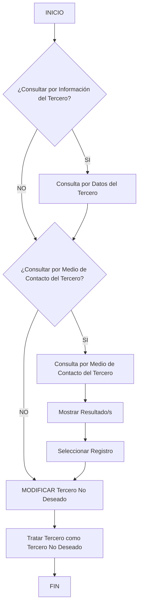

# Operação “Modificar Tercero como Tercero No Deseado” — Procedimento de Consulta, Seleção e Atualização

## 1. Metadados do Documento
- **Arquivo de Origem:** `Não identificado no conteúdo fornecido`
- **Tipo de Documento:** `Procedimento`
- **Domínio / Sistema:** `Gestão de Terceiros — Tercero No Deseado`
- **Público-Alvo:** `Operação, Negócio e usuários de backoffice`
- **Data/Versão Identificada:** `Não identificada`

---

## 2. Resumo Executivo & Contexto de Negócio

O documento descreve a operação **“Modificar Tercero como Tercero No Deseado”**, destinada ao tratamento de um terceiro classificado como não desejado. A operação permite registrar um terceiro nessa condição e, simultaneamente, complementar ou modificar informações preexistentes relacionadas a essa classificação.

O processo prevê consultas opcionais antes da alteração, com critérios de busca por **Dados do Tercero** e por **Meio de Contato do Tercero**. Quando aplicável, a consulta apresenta resultados para que um registro seja selecionado.

Após a seleção, o fluxo conduz à ação **“MODIFICAR Tercero No Deseado”**. O documento também menciona a ação funcional **“Tratar Tercero como Tercero No Deseado”**, sem detalhar campos, validações, persistência, integrações, permissões ou contratos técnicos.

A referência contém menções a “CF”, “Home Solutions”, “APIs Documentation”, “Zeus” e “EN”, porém não esclarece a relação dessas expressões com a operação, a arquitetura ou os ambientes envolvidos.

---

## 3. Arquitetura, Componentes & Tecnologias Envolvidas

O conteúdo fornecido não apresenta uma arquitetura técnica detalhada, microsserviços, bancos de dados, URLs, protocolos, métodos HTTP, contratos de API ou ambientes de implantação.

Os elementos funcionais explicitamente citados são:

- Operação **MODIFICAR Tercero No Deseado**.
- Consulta por **Información del Tercero**.
- Consulta por **Medio de Contacto del Tercero**.
- Exibição de resultado(s).
- Seleção de registro.
- Ação **Tratar Tercero como Tercero No Deseado**.
- Termos isolados: **CF**, **Home Solutions**, **APIs Documentation**, **Zeus** e **EN**.



> **Nota de Análise:** O diagrama representa os elementos e decisões explicitamente visíveis no fluxo. O documento não detalha a semântica dos ramos “SI” e “NO”, nem confirma se as consultas por dados do terceiro e por meio de contato podem ser combinadas, executadas em sequência ou usadas isoladamente.

---

## 4. Regras de Negócio, Especificações Funcionais & Processos

### Objetivo funcional da operação

A operação permite:

1. Registrar o terceiro como um **Tercero No Deseado**.
2. Complementar informações que já existam para o terceiro como **Tercero No Deseado**.
3. Modificar informações preexistentes que o terceiro possua como **Tercero No Deseado**.

### Critérios de busca disponíveis

O documento apresenta dois critérios de consulta:

1. **Consultar por Datos del Tercero**
2. **Consultar por Medio de Contacto del Tercero**

A representação no conteúdo bruto indica os critérios como opções:

- `¿Consultar por Datos del Tercero? ( )`
- `¿Consultar por Medio de Contacto del Tercero? ( )`

### Fluxo operacional identificado

1. Iniciar a operação.
2. Avaliar a consulta por **Información del Tercero**.
3. Avaliar a consulta por **Medio de Contacto del Tercero**.
4. Quando houver resultados, exibir **Resultado/s**.
5. Selecionar um registro.
6. Executar **MODIFICAR Tercero No Deseado**.
7. Tratar o terceiro como **Tercero No Deseado**.
8. Finalizar o processo.

### Restrições e lacunas documentais

O conteúdo não informa:

- Campos necessários para identificar o terceiro.
- Formato dos dados de terceiro ou dos meios de contato.
- Critérios de validação.
- Regras para inclusão, alteração ou remoção de informações.
- Motivos ou categorias para a condição de **Tercero No Deseado**.
- Perfis de acesso, autorização ou matriz de permissões.
- Comportamento quando nenhum resultado é encontrado.
- Mensagens de erro, auditoria, confirmação ou rollback.
- Métodos HTTP, contratos JSON, APIs, bancos de dados ou integrações.

> **Nota de Análise:** O documento lista a operação **“MODIFICAR Tercero No Deseado”**, porém não detalha os campos alteráveis, as regras de validação ou os contratos técnicos expostos.

---

## 5. Tabelas de Parâmetros, Ambientes e Estruturas de Dados

| Item / Parâmetro | Descrição / Função | Tipo / Valores / Formato | Ambiente / Observações |
| :--- | :--- | :--- | :--- |
| Operación MODIFICAR Tercero como Tercero no Deseado | Operação para registrar, complementar ou modificar a informação de um terceiro como não desejado. | Operação funcional. | Ambiente não identificado. |
| Información del Tercero | Critério ou etapa de consulta de informações do terceiro. | Pergunta de decisão no fluxo: `¿Consultar por Información del Tercero?` | Detalhamento de campos não informado. |
| Datos del Tercero | Critério de busca do terceiro. | Opção: `¿Consultar por Datos del Tercero? ( )` | Estrutura dos dados não especificada. |
| Medio de Contacto | Critério ou etapa de consulta por meio de contato do terceiro. | Pergunta de decisão e opção: `¿Consultar por Medio de Contacto del Tercero?` | Tipos de contato não especificados. |
| Resultado/s | Resultado apresentado após uma consulta. | Lista ou conjunto de registros, formato não informado. | Não há comportamento descrito para ausência de resultados. |
| Seleccionar Registro | Etapa de seleção de um registro exibido nos resultados. | Ação operacional. | Critérios de seleção não informados. |
| MODIFICAR Tercero No Deseado | Ação de modificação do registro de terceiro não desejado. | Ação funcional. | Campos modificáveis não identificados. |
| Tratar Tercero como Tercero No Deseado | Ação associada ao tratamento do terceiro nessa classificação. | Ação funcional. | Sem detalhamento adicional. |
| CF | Termo citado no conteúdo bruto. | Não definido. | Relação com o processo não informada. |
| Home Solutions | Termo citado no conteúdo bruto. | Não definido. | Relação com o processo não informada. |
| APIs Documentation | Termo citado no conteúdo bruto. | Não definido. | Não há URL, endpoint ou contrato de API. |
| Zeus | Termo citado no conteúdo bruto. | Não definido. | Relação com o processo não informada. |
| EN | Termo citado no conteúdo bruto. | Não definido. | Pode representar uma referência de idioma ou ambiente, mas o documento não confirma. |

---

## 6. Bateria de Perguntas & Respostas para RAG (FAQ Sintético)

### P1: Qual é o objetivo da operação “Modificar Tercero como Tercero No Deseado”?
**R:** A operação permite registrar um terceiro como **Tercero No Deseado** e também complementar ou modificar informações preexistentes que o terceiro já possua nessa condição.

### P2: Quais critérios de busca estão disponíveis para localizar um terceiro?
**R:** O documento apresenta consulta por **Datos del Tercero** e consulta por **Medio de Contacto del Tercero**. Não são informados os campos que compõem cada critério.

### P3: O processo permite consultar informações do terceiro antes da modificação?
**R:** Sim. O fluxo contém a decisão `¿Consultar por Información del Tercero?`, indicando que a consulta de informações do terceiro pode ocorrer antes da ação de modificação.

### P4: O que ocorre após uma consulta retornar resultados?
**R:** O fluxo apresenta as etapas **“Mostrar Resultado/s”** e **“Seleccionar Registro”**. Após selecionar um registro, o processo segue para **“MODIFICAR Tercero No Deseado”**.

### P5: Quais informações podem ser alteradas no registro de Tercero No Deseado?
**R:** O documento afirma que é possível complementar ou modificar informações preexistentes, mas não especifica quais campos podem ser alterados, quais formatos são aceitos ou quais validações são aplicadas.

### P6: O documento informa como classificar um terceiro como não desejado?
**R:** Não. O documento cita a ação **“Tratar Tercero como Tercero No Deseado”**, mas não define critérios, motivos, categorias ou regras de negócio para atribuir essa classificação.

### P7: Há detalhes de API, endpoint, método HTTP ou contrato JSON para essa operação?
**R:** Não. Embora o texto cite “APIs Documentation”, não fornece URL, endpoint, método HTTP, payload, resposta, autenticação ou contrato técnico.

### P8: O que acontece se a busca por dados do terceiro ou meio de contato não retornar resultados?
**R:** O comportamento não é detalhado. O documento mostra a etapa **“Mostrar Resultado/s”**, mas não descreve tratamento para resultado vazio, erro de consulta ou ausência de registros.

### P9: O fluxo permite pesquisar por dados do terceiro e por meio de contato?
**R:** O conteúdo apresenta ambos os critérios no fluxo e na seção **“Criterios de Búsqueda”**. Contudo, não esclarece se os critérios podem ser utilizados simultaneamente, em sequência ou de maneira mutuamente exclusiva.

### P10: Existem perfis de acesso ou permissões para modificar um Tercero No Deseado?
**R:** Não há matriz de permissões, papéis, grupos de usuários ou regras de autorização descritas no conteúdo fornecido.

### P11: O que significam CF, Home Solutions, Zeus e EN no documento?
**R:** O documento apenas apresenta esses termos no conteúdo bruto. Não define seus significados nem sua relação com a operação de modificação de Tercero No Deseado.

### P12: O processo possui auditoria, confirmação ou rollback da alteração?
**R:** Não há descrição de auditoria, registro de histórico, confirmação da alteração, mecanismo de reversão ou rollback.

---

## 7. Glossário de Termos, Siglas & Conceitos-Chave

- **Tercero:** Entidade tratada pelo processo. O documento não define se representa pessoa, empresa, parceiro, cliente ou outro tipo de cadastro.
- **Tercero No Deseado:** Classificação atribuída a um terceiro, cuja informação pode ser registrada, complementada ou modificada.
- **MODIFICAR Tercero No Deseado:** Operação funcional para alterar o registro de um terceiro classificado como não desejado.
- **Datos del Tercero:** Critério de busca baseado em dados do terceiro; os dados específicos não são definidos.
- **Medio de Contacto:** Critério de busca baseado em meio de contato; os tipos de contato não são definidos.
- **CF:** Termo não definido no documento.
- **Home Solutions:** Termo não definido no documento.
- **APIs Documentation:** Referência textual a documentação de APIs; não há detalhes técnicos associados.
- **Zeus:** Termo não definido no documento.
- **EN:** Termo não definido no documento.

---

## 8. Notas Críticas, Riscos & Limitações

- O conteúdo apresenta um fluxo funcional resumido, sem especificação técnica de implementação.
- Não há identificação do arquivo de origem, versão, data, autor, sistema proprietário ou ambiente.
- A classificação **Tercero No Deseado** não possui definição de negócio, critérios de elegibilidade ou motivos de classificação.
- Não são descritos campos de entrada, campos obrigatórios, formatos, regras de validação ou persistência.
- Não há informação sobre tratamento de erros, resultados vazios, duplicidade, concorrência, auditoria ou rollback.
- Não há contrato de integração, URL, API, endpoint, tecnologia, banco de dados ou segurança.
- Os termos **CF**, **Home Solutions**, **APIs Documentation**, **Zeus** e **EN** são citados sem contextualização.
- A interpretação do encadeamento exato entre as decisões “SI” e “NO” é limitada pela estrutura visual incompleta da extração textual.

---

## 9. Conteúdo Bruto Estruturado (Referência Fiel)

```text
--- [PÁGINA 1 DE 2] ---

OPERACIÓN MODIFICAR Tercero como
Tercero no Deseado
¿En que consiste?
Esta operación permite Registrar al Tercero como un Tercero No Deseado además de poder
Complementar o Modificar la información preexistente que tuviera el Tercero como Tercero no
deseado.
Proceso
SI
NO
SI
NO
INICIO ¿Consultar por **Información**
del Tercero?
¿Consultar por **Medio
de Contacto** del Tercero?
Mostrar Resultado/s Seleccionar
Registro **MODIFICAR** Tercero No Deseado
FIN
Criterios de Búsqueda
 ¿Consultar por Datos del Tercero? ( )
 ¿Consultar por Medio de Contacto del Tercero?( )
Tratar Tercero como Tercero No Deseado
 / 
 CF
Home Solutions APIs Documentation Zeus
EN


--- [PÁGINA 2 DE 2] ---

MODIFICAR Tercero No Deseado (  )
```
