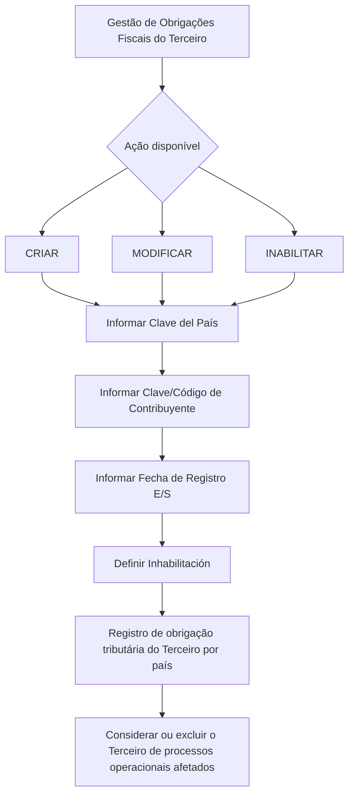

# Gestão de Obrigações Fiscais do Terceiro — Criar, Modificar e Inabilitar

## 1. Metadados do Documento
- **Arquivo de Origem:** Não identificado no conteúdo fornecido
- **Tipo de Documento:** Manual Operacional
- **Domínio / Sistema:** Gestão de Terceiros e Obrigações Fiscais/Tributárias
- **Público-Alvo:** Operação, Negócio e usuários do sistema
- **Data/Versão Identificada:** Não identificada

---

## 2. Resumo Executivo & Contexto de Negócio

O documento descreve a ação **“MODIFICAR Obligaciones Fiscales del Tercero”**, voltada à gestão dos países nos quais um Terceiro possui obrigações fiscais ou tributárias. A funcionalidade permite criar ou identificar esses países e administrar registros já identificados.

As ações disponíveis para Obrigações Fiscais são **CRIAR**, **MODIFICAR** e **INABILITAR**. A gestão dessa informação permite considerar ou excluir o Terceiro de processos e procedimentos operacionais da entidade que sejam afetados pela condição tributária do Terceiro em determinados países.

A captura ou alteração das informações segue uma sequência de campos apresentada da esquerda para a direita e de cima para baixo: **Clave del País**, **Clave/Código de Contribuyente**, **Fecha de Registro E/S** e **Inhabilitación**.

O documento define o significado dos campos, mas não detalha telas, permissões, regras de obrigatoriedade, validações, integrações, métodos HTTP, contratos de dados ou o comportamento específico de cada ação operacional.

---

## 3. Arquitetura, Componentes & Tecnologias Envolvidas

O conteúdo fornecido não apresenta arquitetura de software, microsserviços, integrações, bancos de dados, tecnologias, ambientes ou ferramentas técnicas.

O processo funcional identificado envolve o cadastro e a manutenção de obrigações tributárias de um Terceiro por país.



**Nota de Análise:** O documento descreve um fluxo de captura de dados, mas não informa persistência, comunicação entre sistemas, responsáveis pelo processamento ou mecanismos de validação.

---

## 4. Regras de Negócio, Especificações Funcionais & Processos

### Objetivo funcional

A ação permite criar ou identificar países nos quais o Terceiro possui obrigações fiscais ou tributárias. Também permite modificar ou inabilitar informações de países que tenham sido previamente identificados para o Terceiro.

A manutenção das obrigações tributárias por país possibilita contemplar ou excluir o Terceiro de processos e procedimentos operacionais da entidade afetados por essa situação tributária.

### Ações disponíveis

1. **CRIAR:** ação listada para Obrigações Fiscais.
2. **MODIFICAR:** ação listada para Obrigações Fiscais.
3. **INABILITAR:** ação listada para Obrigações Fiscais.

**Nota de Análise:** O documento não detalha diferenças operacionais, pré-requisitos, resultados esperados ou regras de validação para as ações CRIAR, MODIFICAR e INABILITAR.

### Sequência de captura ou modificação

O documento estabelece que os campos devem seguir a sequência visual de esquerda para a direita e de cima para baixo:

1. **Clave del País**
2. **Clave/Código de Contribuyente**
3. **Fecha de Registro E/S**
4. **Inhabilitación**

### Regras associadas aos campos

- **Clave del País:** contém o código do primeiro nível da estrutura geográfica, correspondente a países, no qual o Terceiro está identificado como obrigado tributário.
- **Clave del País:** os valores devem estar de acordo com a relação de valores existente no catálogo de países do sistema.
- **Clave/Código de Contribuyente:** identifica a chave ou o código do Terceiro como contribuinte local no país em que está identificado como obrigado tributário.
- **Fecha de Registro E/S:** contém a data de entrada ou saída do Terceiro no status de Obrigação Tributária.
- **Inhabilitación:** estabelece se o Terceiro deixou de ser obrigado tributário no país em questão.

---

## 5. Tabelas de Parâmetros, Ambientes e Estruturas de Dados

| Item / Parâmetro | Descrição / Função | Tipo / Valores / Formato | Ambiente / Observações |
| :--- | :--- | :--- | :--- |
| CRIAR | Ação disponível para Obrigações Fiscais. | Ação operacional. | O documento não detalha o comportamento da ação. |
| MODIFICAR | Ação disponível para Obrigações Fiscais. | Ação operacional. | O documento não detalha o comportamento da ação. |
| INABILITAR | Ação disponível para Obrigações Fiscais. | Ação operacional. | O documento não detalha o comportamento da ação. |
| Clave del País | Código do primeiro nível da estrutura geográfica, correspondente a países, em que o Terceiro está identificado como obrigado tributário. | Código de país; valores existentes no catálogo de países do sistema. | Não são informados códigos, formato ou catálogo específico. |
| Clave/Código de Contribuyente | Identifica a chave ou código do Terceiro como contribuinte local no país da obrigação tributária. | Chave ou código de contribuinte. | Não são informados formato, tamanho ou critérios de validação. |
| Fecha de Registro E/S | Data de entrada ou de saída do Terceiro no status de Obrigação Tributária. | Data de entrada/saída. | O formato de data não é informado. |
| Inhabilitación | Indica se o Terceiro deixou de ser obrigado tributário no país correspondente. | Propriedade de inabilitação. | O documento não informa valores permitidos ou formato. |
| Catálogo de países | Relação de possíveis valores para a Clave del País. | Catálogo existente no sistema. | O conteúdo do catálogo não foi fornecido. |

---

## 6. Bateria de Perguntas & Respostas para RAG (FAQ Sintético)

### P1: Qual é o objetivo da ação de gestão de Obrigações Fiscais do Terceiro?
**R:** A ação permite criar ou identificar os países nos quais um Terceiro possui obrigações fiscais ou tributárias. Também permite modificar ou inabilitar informações de países que já tenham sido identificados para o Terceiro.

### P2: Quais ações estão disponíveis para Obrigações Fiscais?
**R:** O documento lista três ações possíveis para Obrigações Fiscais: **CRIAR**, **MODIFICAR** e **INABILITAR**.

### P3: Qual é o impacto operacional de registrar uma obrigação tributária para um Terceiro?
**R:** O registro permite contemplar ou excluir o Terceiro de processos e procedimentos operacionais da entidade que sejam afetados pela situação de obrigação fiscal ou tributária do Terceiro.

### P4: O que representa o campo Clave del País?
**R:** Clave del País contém o código do primeiro nível da estrutura geográfica, correspondente a países, no qual o Terceiro está identificado como obrigado tributário.

### P5: De onde vêm os valores possíveis para Clave del País?
**R:** Os possíveis valores de Clave del País devem seguir a relação existente no catálogo de países do sistema. O documento não fornece os códigos ou a lista desse catálogo.

### P6: Para que serve o campo Clave/Código de Contribuyente?
**R:** Clave/Código de Contribuyente identifica a chave ou o código do Terceiro como contribuinte local no país em que o Terceiro aparece identificado como obrigado tributário.

### P7: O que é registrado em Fecha de Registro E/S?
**R:** Fecha de Registro E/S contém a data de entrada ou a data de saída do Terceiro no status de Obrigação Tributária.

### P8: O que indica a propriedade Inhabilitación?
**R:** Inhabilitación estabelece se o Terceiro deixou de ser obrigado tributário no país em questão.

### P9: Qual é a ordem de captura ou alteração dos campos?
**R:** A sequência indicada é da esquerda para a direita e de cima para baixo: Clave del País, Clave/Código de Contribuyente, Fecha de Registro E/S e Inhabilitación.

### P10: O documento define validações, obrigatoriedade ou formato dos campos?
**R:** Não. O conteúdo define a finalidade dos campos, mas não informa obrigatoriedade, formato de dados, regras de validação, valores permitidos para Inhabilitación ou comportamento detalhado das ações disponíveis.

---

## 7. Glossário de Termos, Siglas & Conceitos-Chave

- **Terceiro:** entidade ou pessoa identificada no sistema e sujeita à gestão de obrigações fiscais ou tributárias por país.
- **Obligaciones Fiscales / Obrigações Fiscais:** condição relacionada às obrigações fiscais ou tributárias do Terceiro.
- **Obrigação Tributária:** status associado ao Terceiro em determinado país.
- **Clave del País:** código de país correspondente ao primeiro nível da estrutura geográfica.
- **Clave/Código de Contribuyente:** chave ou código que identifica o Terceiro como contribuinte local no país correspondente.
- **Fecha de Registro E/S:** data de entrada ou saída do status de Obrigação Tributária.
- **Inhabilitación:** propriedade que indica que o Terceiro deixou de ser obrigado tributário no país em questão.
- **E/S:** expressão presente no campo “Fecha de Registro E/S”; o texto a descreve como data de entrada ou saída.

---

## 8. Notas Críticas, Riscos & Limitações

- O documento não informa o nome do sistema, versão, data, autor ou arquivo de origem.
- Não há detalhamento sobre permissões de acesso, perfis autorizados ou segregação de funções para criar, modificar ou inabilitar registros.
- Não são informadas regras de obrigatoriedade, formato, tamanho, unicidade ou validação dos campos.
- O documento não especifica o efeito técnico ou operacional de inabilitar um registro, além de indicar que o Terceiro deixou de ser obrigado tributário no país.
- Não são descritos serviços, APIs, integrações, bancos de dados, logs, URLs, ambientes ou mecanismos de auditoria.
- O catálogo de países é mencionado, mas sua estrutura e seus valores não foram disponibilizados.
- **Nota de Análise:** O conteúdo descreve funcionalidades e campos em nível operacional, sem detalhamento adicional sobre implementação técnica ou contratos de integração.

---

## 9. Conteúdo Bruto Estruturado (Referência Fiel)

```text
--- [PÁGINA 1 DE 2] ---

MODIFICAR Obligaciones Fiscales del Tercero
Objetivo
Esta acción permite Crear o Identificar los países en los que el Tercero tiene Obligaciones Fiscales
o Tributarias además de poder Modificar ó Inhabilitar la información de aquellos países que
hubieran sido previamente identificados para el Tercero, pudiendo de esta manera contemplar o
excluir al Tercero de aquellos procesos y procedimientos operativos de la entidad afectados por dicha
situación.
Posibles Acciones
 CREAR ( )
 MODIFICAR ( )
 INHABILITAR ( )
Obligaciones Fiscales.
De Izquierda a Derecha y de Arriba hacia Abajo, los siguientes campos marcan la secuencia de
captura o modificación del Tercero en el sistema.
Clave del País (   )
 / 
 RS
Inicio Soluciones APIs Documentación Zeus
ES


--- [PÁGINA 2 DE 2] ---

Este Campo contiene el código del primer nivel de la estructura Geográfica (países) en el que el
Tercero está identificado como obligado tributario, de acuerdo con la relación de posibles valores
existentes en el catálogo de países existente en el Sistema.
Clave/Código de Contribuyente (  )
Este Dato permite identificar la clave o el código del Tercero como Contribuyente local en el País en
el que aparece como obligado tributario.
Fecha de Registro E/S (  )
Este Campo contiene la Fecha de Entrada o de Salida del Tercero con el status de Obligación
Tributaria.
Inhabilitación (  )
Esta propiedad establece si el Tercero ha dejado de ser Obligado Tributario en el País en cuestión.
```
