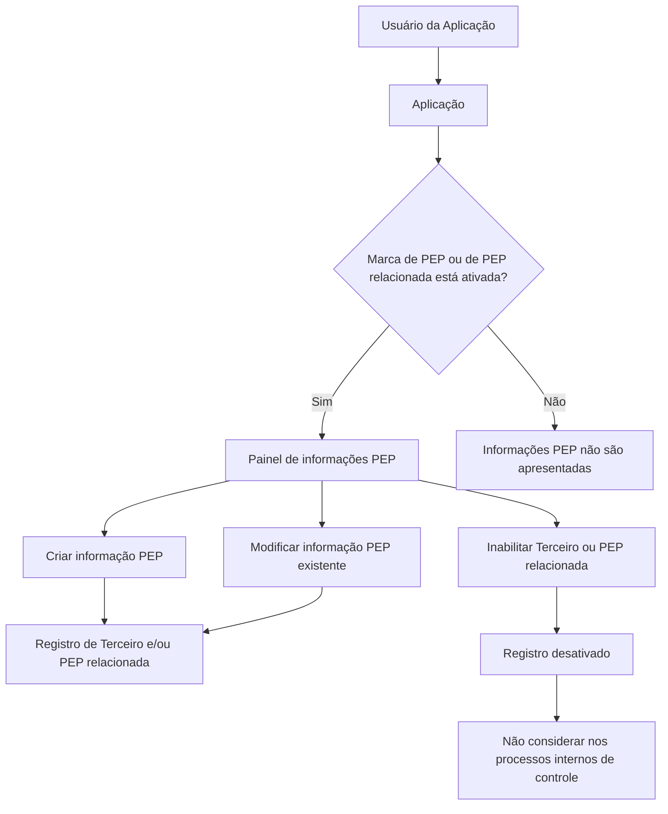

# Gestão de Pessoa Politicamente Exposta (PEP) para Terceiros Relacionados

## 1. Metadados do Documento
- **Arquivo de Origem:** Não identificado
- **Tipo de Documento:** Especificação Funcional
- **Domínio / Sistema:** Gestão de Terceiros e controles internos de Pessoa Politicamente Exposta
- **Público-Alvo:** Usuários da aplicação, analistas funcionais, operação e desenvolvimento
- **Data/Versão Identificada:** Não identificada

---

## 2. Resumo Executivo & Contexto de Negócio

O documento descreve uma tela funcional destinada à identificação e manutenção da condição de **Pessoa Politicamente Exposta (PEP)** associada a um Terceiro no sistema. A funcionalidade permite criar, modificar ou inabilitar informações relativas ao próprio Terceiro ou a uma Pessoa Politicamente Exposta relacionada.

A tela também permite registrar situações em que a Pessoa Politicamente Exposta possui relação familiar ou de colaboração estreita com o Terceiro. Para esse cenário, são registrados o vínculo, o cargo ou relação, datas de alta e baixa, além dos dados documentais da pessoa relacionada.

A apresentação das informações ocorre por meio de um painel expansível ou colapsado. O painel de informações somente é exibido quando estiver ativa a marcação sistêmica de que o Terceiro é uma Pessoa Politicamente Exposta ou possui uma Pessoa Politicamente Exposta associada.

A inabilitação possui impacto operacional relevante: ao ser ativada, indica que o Terceiro ou a Pessoa Politicamente Exposta relacionada está desativada e, consequentemente, não deve ser considerada pelos processos internos de controle da entidade.

---

## 3. Arquitetura, Componentes & Tecnologias Envolvidas

O documento não detalha arquitetura técnica, tecnologias, APIs, contratos HTTP, bancos de dados, integrações ou ambientes de implantação. O conteúdo apresenta exclusivamente o comportamento funcional da tela de manutenção de Pessoa Politicamente Exposta.

### Componentes funcionais identificados

| Componente | Descrição |
| :--- | :--- |
| Aplicação | Sistema no qual usuários identificam e mantêm a condição de Pessoa Politicamente Exposta. |
| Terceiro | Entidade cadastrada no sistema que pode ser Pessoa Politicamente Exposta ou possuir uma Pessoa Politicamente Exposta relacionada. |
| Painel de informações PEP | Área colapsável ou expandida exibida quando a marca de PEP ou de relacionamento com PEP está ativada. |
| Catálogo de Cargos | Catálogo existente no sistema utilizado para selecionar a relação ou o cargo associado à Pessoa Politicamente Exposta. |
| Processos de controle internos | Processos da entidade que deixam de considerar registros inabilitados. |



> **Nota de Análise:** O documento não especifica métodos HTTP, contratos JSON, persistência de dados, autenticação, integrações externas, tecnologias de frontend ou backend, nem rotas de serviços.

---

## 4. Regras de Negócio, Especificações Funcionais & Processos

### Objetivo funcional

A tela permite que usuários da aplicação:

1. Identifiquem um Terceiro como Pessoa Politicamente Exposta.
2. Criem o registro de condição de Pessoa Politicamente Exposta para o Terceiro.
3. Relacionem o Terceiro a um Familiar ou Colaborador estreito que possua condição de Pessoa Politicamente Exposta.
4. Complementem informações preexistentes do Terceiro.
5. Modifiquem informações de Pessoa Politicamente Exposta existentes.
6. Inabilitem a condição do Terceiro ou da Pessoa Politicamente Exposta relacionada.

### Ações possíveis

| Ação | Regra funcional descrita |
| :--- | :--- |
| Criar | Permite criar a identificação do Terceiro como Pessoa Politicamente Exposta ou criar a associação a uma Pessoa Politicamente Exposta relacionada. |
| Modificar | Permite alterar ou complementar informações preexistentes do Terceiro relacionadas à condição de Pessoa Politicamente Exposta. |
| Inabilitar | Permite desativar o Terceiro ou a Pessoa Politicamente Exposta relacionada, fazendo com que o registro não seja considerado nos processos internos de controle. |

### Regra de exibição do painel

O painel de informações de Pessoa Politicamente Exposta é apresentado de forma colapsada ou expandida somente quando estiver ativada a marcação que identifica uma das seguintes situações:

- O Terceiro é Pessoa Politicamente Exposta.
- O Terceiro possui uma Pessoa Politicamente Exposta associada.

### Sequência de captura ou modificação

O documento determina que os campos devem ser capturados ou modificados na sequência apresentada, da esquerda para a direita e de cima para baixo:

1. Data de Alta como Pessoa Politicamente Exposta.
2. Data de Baixa como Pessoa Politicamente Exposta.
3. Familiar / Colaborador.
4. Cargo ou Relação com a Pessoa Politicamente Exposta.
5. Tipo de Documento Identificador da Pessoa Politicamente Exposta Relacionada.
6. Chave do Documento Identificador da Pessoa Politicamente Relacionada.
7. Inabilitação.

### Regras específicas dos campos

- A **Data de Alta como Pessoa Politicamente Exposta** registra a data de alta do Terceiro como Pessoa Politicamente Exposta ou a data de alta da Pessoa Politicamente Exposta relacionada ao Terceiro.
- A **Data de Baixa como Pessoa Politicamente Exposta** registra a data em que o Terceiro ou a Pessoa Politicamente Exposta relacionada encerra sua relação com o Terceiro.
- O atributo **Familiar / Colaborador** identifica se a Pessoa Politicamente Exposta relacionada é Familiar ou Colaborador do Terceiro.
- O campo **Cargo ou Relação com a Pessoa Politicamente Exposta** identifica o cargo ou a relação do Terceiro ou da Pessoa Politicamente Exposta relacionada, conforme os valores possíveis do catálogo de cargos existente no sistema.
- O **Tipo de Documento Identificador da Pessoa Politicamente Exposta Relacionada** contém o tipo de documento da Pessoa Politicamente Exposta relacionada ao Segurado.
- A **Chave do Documento Identificador da Pessoa Politicamente Relacionada** contém a chave do documento identificador da Pessoa Politicamente Exposta relacionada ao Segurado.
- A propriedade **Inabilitação** informa ao sistema que o Terceiro ou a Pessoa Politicamente Exposta relacionada está desativada e não deve ser considerada nos processos de controle internos existentes na entidade.

---

## 5. Tabelas de Parâmetros, Ambientes e Estruturas de Dados

| Item / Parâmetro | Descrição / Função | Tipo / Valores / Formato | Ambiente / Observações |
| :--- | :--- | :--- | :--- |
| Data de Alta como Pessoa Politicamente Exposta | Armazena a data de alta do Terceiro como PEP ou da PEP relacionada ao Terceiro. | Data; formato não especificado. | Aplicável ao Terceiro ou à Pessoa Politicamente Exposta relacionada. |
| Data de Baixa como Pessoa Politicamente Exposta | Armazena a data em que o Terceiro ou a PEP relacionada causa baixa em sua relação com o Terceiro. | Data; formato não especificado. | Aplicável ao Terceiro ou à Pessoa Politicamente Exposta relacionada. |
| Familiar / Colaborador | Identifica a natureza do vínculo entre a PEP relacionada e o Terceiro. | Familiar ou Colaborador. | O documento não define valores adicionais, obrigatoriedade ou formato de armazenamento. |
| Cargo ou Relação com a Pessoa Politicamente Exposta | Identifica o cargo ou a relação do Terceiro ou da PEP relacionada. | Valores provenientes do catálogo de cargos existente no sistema. | O catálogo e seus valores não são detalhados. |
| Tipo de Documento Identificador da PEP Relacionada | Registra o tipo de documento da Pessoa Politicamente Exposta relacionada ao Segurado. | Tipo de documento; valores não especificados. | Descrito como atributo do colapsador. |
| Chave do Documento Identificador da Pessoa Politicamente Relacionada | Registra a chave do documento identificador da PEP relacionada ao Segurado. | Chave documental; formato não especificado. | Não há regra de validação apresentada. |
| Inabilitação | Indica que o Terceiro ou a PEP relacionada está desativada. | Propriedade de inabilitação; valores não especificados. | Registros inabilitados não devem ser considerados nos processos internos de controle. |
| Marca de identificação PEP | Controla a apresentação do painel de informações de PEP. | Marca ativa ou inativa; formato não especificado. | O painel aparece somente quando a marca identifica PEP no Terceiro ou PEP associada. |
| Painel de informações PEP | Exibe os dados de Pessoa Politicamente Exposta. | Estado colapsado ou expandido. | Exibido condicionalmente conforme a marca de identificação. |

> **Nota de Análise:** O documento não apresenta URLs, servidores, ambientes, caminhos de logs, variáveis de configuração, tipos técnicos de campos, tamanhos, máscaras, regras de obrigatoriedade ou mensagens de erro.

---

## 6. Bateria de Perguntas & Respostas para RAG (FAQ Sintético)

### P1: Qual é o objetivo da tela de gestão de Pessoa Politicamente Exposta?
**R:** A tela permite que usuários da aplicação identifiquem e criem um Terceiro como Pessoa Politicamente Exposta, relacionem o Terceiro a um Familiar ou Colaborador estreito que possua essa condição e complementem, modifiquem ou inabilitem as informações preexistentes.

### P2: Quais ações são permitidas na tela de Pessoa Politicamente Exposta?
**R:** O documento lista três ações possíveis: criar, modificar e inabilitar. Criar permite registrar a condição de Pessoa Politicamente Exposta; modificar permite alterar ou complementar informações existentes; e inabilitar desativa o Terceiro ou a Pessoa Politicamente Exposta relacionada.

### P3: Quando o painel de informações de Pessoa Politicamente Exposta é exibido?
**R:** O painel é apresentado quando estiver ativada a marca que identifica no sistema que o Terceiro é Pessoa Politicamente Exposta ou possui uma Pessoa Politicamente Exposta associada. O painel pode ser exibido de forma colapsada ou expandida.

### P4: O que registra o campo Data de Alta como Pessoa Politicamente Exposta?
**R:** O campo registra a data de alta do Terceiro como Pessoa Politicamente Exposta ou a data de alta da Pessoa Politicamente Exposta relacionada ao Terceiro.

### P5: O que significa a Data de Baixa como Pessoa Politicamente Exposta?
**R:** A Data de Baixa registra a data em que o Terceiro ou a Pessoa Politicamente Exposta relacionada causa baixa em sua relação com o Terceiro.

### P6: Como o sistema identifica se a Pessoa Politicamente Exposta relacionada é Familiar ou Colaborador?
**R:** O atributo Familiar / Colaborador permite identificar se a Pessoa Politicamente Exposta relacionada possui vínculo de Familiar ou de Colaborador com o Terceiro.

### P7: De onde são obtidos os valores para Cargo ou Relação com a Pessoa Politicamente Exposta?
**R:** O campo utiliza os possíveis valores do catálogo de cargos existente no sistema. O documento não detalha quais cargos ou relações estão disponíveis nesse catálogo.

### P8: Quais dados documentais são registrados para a Pessoa Politicamente Exposta relacionada?
**R:** São registrados o Tipo de Documento Identificador da Pessoa Politicamente Exposta Relacionada e a Chave do Documento Identificador da Pessoa Politicamente Relacionada. O primeiro identifica o tipo de documento, e o segundo contém a chave desse documento.

### P9: Qual é o efeito da propriedade Inabilitação?
**R:** A propriedade Inabilitação informa ao sistema que o Terceiro ou a Pessoa Politicamente Exposta relacionada está desativada. Como consequência, o registro não deve ser considerado nos processos de controle internos existentes na entidade.

### P10: Qual é a sequência de captura ou modificação dos dados na tela?
**R:** A sequência é definida da esquerda para a direita e de cima para baixo: Data de Alta, Data de Baixa, Familiar / Colaborador, Cargo ou Relação, Tipo de Documento Identificador, Chave do Documento Identificador e Inabilitação.

### P11: O documento define APIs ou contratos técnicos para a gestão de Pessoa Politicamente Exposta?
**R:** Não. O documento apresenta regras funcionais da tela, mas não detalha APIs, métodos HTTP, contratos JSON, persistência, bancos de dados, tecnologias, integrações ou autenticação.

---

## 7. Glossário de Termos, Siglas & Conceitos-Chave

- **PEP / Pessoa Politicamente Exposta:** Condição atribuída ao Terceiro ou a uma pessoa relacionada ao Terceiro, cuja informação pode ser criada, modificada ou inabilitada na aplicação.
- **Terceiro:** Entidade cadastrada no sistema que pode ser identificada como Pessoa Politicamente Exposta ou relacionada a uma Pessoa Politicamente Exposta.
- **Pessoa Politicamente Exposta Relacionada:** Pessoa associada ao Terceiro, identificada como Familiar ou Colaborador, cuja condição de PEP é registrada na aplicação.
- **Familiar / Colaborador:** Atributo que classifica a Pessoa Politicamente Exposta relacionada como Familiar ou Colaborador do Terceiro.
- **Colapsador:** Elemento funcional mencionado no documento que contém o Tipo de Documento Identificador da Pessoa Politicamente Exposta relacionada.
- **Catálogo de Cargos:** Catálogo existente no sistema com valores possíveis para o campo Cargo ou Relação com a Pessoa Politicamente Exposta.
- **Segurado:** Entidade mencionada como referência para os atributos documentais da Pessoa Politicamente Exposta relacionada.
- **Inabilitação:** Propriedade que sinaliza a desativação do Terceiro ou da Pessoa Politicamente Exposta relacionada para os processos de controle internos.

---

## 8. Notas Críticas, Riscos & Limitações

- O documento não identifica o nome do arquivo, a versão, a data de publicação, o sistema corporativo específico ou os responsáveis pelo conteúdo.
- Não são detalhados requisitos técnicos, arquitetura de software, integrações, APIs, banco de dados, tecnologias, controles de autenticação ou perfis de acesso.
- Não há especificação de obrigatoriedade dos campos, formatos de data, validações, regras para datas inconsistentes, mensagens de erro ou comportamento de persistência.
- O documento cita um catálogo de cargos, mas não apresenta seus valores, responsável funcional ou mecanismo de manutenção.
- A inabilitação impede a consideração do registro em processos internos de controle, porém os processos de controle afetados não são nomeados nem detalhados.
- A relação entre os termos **Terceiro** e **Segurado** não é explicitada. O documento utiliza ambos os termos nos campos de identificação documental sem explicar se representam a mesma entidade ou entidades distintas.
- Não são apresentados critérios para ativação ou desativação da marca que controla a exibição do painel de Pessoa Politicamente Exposta.

---

## 9. Conteúdo Bruto Estruturado (Referência Fiel)

```text
--- [PÁGINA 1 DE 3] ---

MODIFICAR Persona Políticamente Expuesta
Objetivo
Esta Pantalla permite a los Usuarios de la Aplicación Identificar y Crear al Tercero como Persona
Políticamente Expuesta o relacionarlo con algún Familiar o estrecho Colaborador que tenga dicha
condición, además de Complementar, Modificar ó Inhabilitar ambas situaciones con la información
Preexistente del Tercero.
Posibles Acciones
 CREAR ( )
 MODIFICAR ( )
 INHABILITAR ( )
Datos Persona Políticamente Expuesta
Siempre y cuando se haya activado la marca que identifica en el sistema que el Tercero es o tiene
asociada una persona políticamente expuesta aparecerá el panel de información correspondiente de
manera colapsada...
... o de manera extendida
 /
 RS
Inicio Soluciones APIs Documentación Zeus
ES


--- [PÁGINA 2 DE 3] ---

De Izquierda a Derecha y de Arriba hacia Abajo, los siguientes campos marcan la secuencia de
captura o modificación del Tercero en el sistema.
Fecha de Alta como Persona Políticamente Expuesta (  )
Este Dato contendrá la fecha de Alta del Tercero como Persona Políticamente Expuesta o de la
Persona Políticamente Expuesta relacionada con el Tercero.
Fecha de Baja como Persona Políticamente Expuesta (  )
Este Dato contendrá la fecha en la que el Tercero o la Persona Políticamente Expuesta relacionada
causa baja en su relación con el Tercero.
Familiar / Colaborador (  )
Este Atributo permite identificar si la Persona Políticamente Expuesta relacionada es un Familiar o un
Colaborador del Tercero.
Cargo o Relación con la Persona Políticamente Expuesta (   )
Este Campo identifica la relación o el Cargo del Tercero o de la Persona Políticamente Expuesta
relacionada, de acuerdo con los posibles valores del catálogo de Cargos existente en el Sistema.
Tipo Documento Identificador de la Persona Políticamente Expuesta
Relacionada (   )
Este Atributo del colapsador contiene el tipo de documento de la Persona Políticamente Expuesta
relacionada con el Asegurado.
Clave del Documento Identificador de la Persona Políticamente Relacionada (
)
Este Atributo contiene la clave del documento Identificador de la Persona Políticamente Expuesta
relacionada con el Asegurado.
Inhabilitación (  )
Esta propiedad le indica al Sistema que o bien el Tercero o la Personas Políticamente Expuesta
Relacionada con el Tercero está desactivada y por ende no debiera considerarse en los procesos de
control internos existentes en la entidad.


--- [PÁGINA 3 DE 3] ---

[Página em branco ou apenas elementos visuais/imagem]
```
