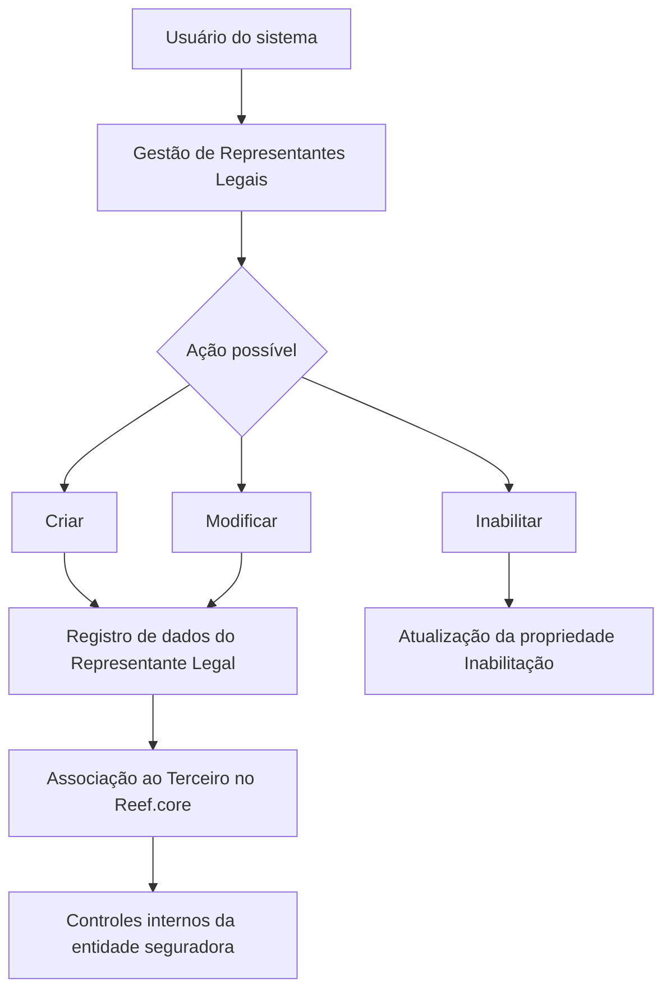
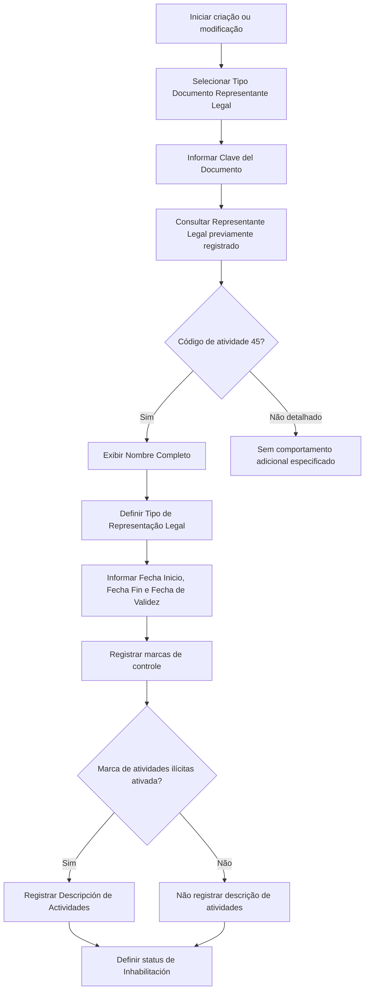

# Registro, Modificação e Inabilitação de Representantes Legais de Terceiros no Reef.core

## 1. Metadados do Documento
- **Arquivo de Origem:** `Não informado`
- **Tipo de Documento:** Procedimento
- **Domínio / Sistema:** Reef.core — gestão de Terceiros e Representantes Legais
- **Público-Alvo:** Operação, Negócio e usuários do sistema
- **Data/Versão Identificada:** Não identificada

---

## 2. Resumo Executivo & Contexto de Negócio

O documento descreve a funcionalidade para registrar informações de Representantes Legais associados a um Terceiro no sistema Reef.core. A representação legal é apresentada como uma faculdade conferida por lei para que uma pessoa atue em nome de outra, produzindo efeitos para a pessoa representada. O exercício dessa representação pode ser obrigatório para o representante.

A funcionalidade suporta três ações possíveis sobre Representantes Legais: criar, modificar e inabilitar. O objetivo operacional é manter dados de identificação, vigência, modalidade de representação e marcas de controle relacionadas ao Representante Legal do Terceiro.

O processo de captura ou modificação segue uma sequência de campos apresentada da esquerda para a direita e de cima para baixo. Para exibir o nome completo, o Representante Legal deve estar previamente cadastrado no sistema e identificado pelo código de atividade `45`, que identifica representantes legais no Reef.core.

O cadastro inclui atributos que permitem à entidade seguradora identificar circunstâncias relevantes para seus processos internos, como Pessoa Politicamente Exposta, Pessoa Investigada e realização de atividades ilícitas. Quando há indicação de atividades ilícitas, o sistema permite registrar uma descrição textual esclarecedora.

---

## 3. Arquitetura, Componentes & Tecnologias Envolvidas

O documento menciona o sistema **Reef.core** como o ambiente em que são administrados os dados de Terceiros e seus Representantes Legais. Não há detalhamento de arquitetura técnica, serviços, APIs, métodos HTTP, contratos JSON, bancos de dados ou integrações externas.

### Componentes e conceitos identificados

| Componente / Conceito | Papel identificado |
| :--- | :--- |
| Reef.core | Sistema no qual o Representante Legal deve estar previamente registrado e associado ao código de atividade 45. |
| Terceiro | Entidade à qual o Representante Legal está associado. |
| Representante Legal | Pessoa que atua em nome de outra pessoa, com informações registradas e controladas no sistema. |
| Código de atividade 45 | Código que identifica os Representantes Legais no Reef.core. |
| Entidade seguradora | Entidade que utiliza marcas de risco e controle em seus processos internos. |



> **Nota de Análise:** O documento não descreve serviços, endpoints, persistência de dados, autenticação, permissões, validações técnicas de formato ou integrações entre sistemas.

---

## 4. Regras de Negócio, Especificações Funcionais & Processos

### 4.1 Finalidade da funcionalidade

A funcionalidade registra informações relativas aos Representantes Legais de um Terceiro. A representação legal permite que uma pessoa atue em nome de outra, recaindo sobre a pessoa representada os efeitos desses atos.

### 4.2 Ações disponíveis

- **Criar:** registrar um Representante Legal para um Terceiro.
- **Modificar:** alterar informações previamente registradas para um Representante Legal.
- **Inabilitar:** indicar que o status do Representante Legal não continua em vigor para exercer a representação legal.

### 4.3 Sequência de captura ou modificação

O documento estabelece que a sequência de captura ou modificação é apresentada visualmente:

1. Da esquerda para a direita.
2. De cima para baixo.

### 4.4 Regras de identificação do Representante Legal

1. O atributo **Tipo Documento Representante Legal** determina o documento usado para identificar o Representante Legal, conforme os tipos de documentos existentes no sistema.
2. O atributo **Clave del Documento** armazena a chave do documento do Representante Legal do Terceiro.
3. O campo **Nombre Completo** exibe o nome completo do Representante Legal.
4. Para que o nome completo seja exibido, o Representante Legal deve:
   - Estar previamente registrado no sistema.
   - Estar identificado com o código de atividade `45`.
   - O código de atividade `45` identifica representantes legais no Reef.core.

### 4.5 Regras de representação legal e vigência

1. **Tipo de Representação Legal** contém a classe ou tipologia de representação legal associada à pessoa.
2. Os valores do Tipo de Representação Legal devem estar de acordo com os valores definidos corporativamente para esse dado.
3. **Fecha Inicio** determina a data de início do Terceiro como Representante Legal.
4. **Fecha Fin** indica a data de baixa na qual a pessoa deixa de exercer a função de Representante Legal do Terceiro.
5. **Fecha de Validez** indica a data a partir da qual a condição de Representante Legal entra em vigor.
6. **Inhabilitación** estabelece se o status do Representante Legal continua em vigor ou se está inabilitado para exercer como tal.

### 4.6 Marcas de controle e circunstâncias especiais

1. A **Marca Persona Políticamente Expuesta** identifica o Representante Legal como Pessoa Politicamente Exposta.
2. A marca de Pessoa Politicamente Exposta permite que a entidade seguradora gerencie e controle essa circunstância em seus processos internos.
3. A **Marca Persona Investigada** identifica o Representante Legal como Pessoa Investigada.
4. A marca de Pessoa Investigada permite que a entidade seguradora gerencie e controle essa circunstância em seus processos internos.
5. A **Marca Realización Actividades Ilícitas** identifica o Representante Legal como pessoa que realizou algum tipo de atividade ilícita.
6. A marca de realização de atividades ilícitas permite que a entidade seguradora gerencie e controle essa circunstância em seus processos internos.
7. **Descripción de Actividades** somente pode ser utilizada quando a marca de realização de atividades ilícitas estiver ativada.
8. A Descripción de Actividades permite registrar um texto esclarecedor sobre as atividades ilícitas.



> **Nota de Análise:** O documento não informa regras de obrigatoriedade dos campos, formatos de data, valores permitidos para marcas, critérios para inabilitação, nem o comportamento do sistema quando o cadastro prévio ou o código de atividade 45 não estiverem disponíveis.

---

## 5. Tabelas de Parâmetros, Ambientes e Estruturas de Dados

| Item / Parâmetro | Descrição / Função | Tipo / Valores / Formato | Ambiente / Observações |
| :--- | :--- | :--- | :--- |
| Tipo Documento Representante Legal | Contém o documento utilizado para identificar o Representante Legal. | Tipos de documentos existentes no sistema. | Apresentado como atributo de um colapsador. |
| Clave del Documento | Contém a chave do documento do Representante Legal do Terceiro. | Não especificado. | Associada ao documento de identificação. |
| Nombre Completo | Mostra o nome completo do Representante Legal do Terceiro. | Não especificado. | O Representante Legal deve estar previamente registrado no sistema e identificado pelo código de atividade 45. |
| Código de atividade 45 | Identifica representantes legais no Reef.core. | Código `45`. | Condição mencionada para o Representante Legal cujo nome completo será mostrado. |
| Tipo de Representação Legal | Contém a classe ou tipologia de representação legal associada à pessoa. | Valores definidos corporativamente. | O documento não apresenta a lista de valores corporativos. |
| Fecha Inicio | Determina a data de início do Terceiro como Representante Legal. | Data; formato não especificado. | Relacionada à vigência da representação legal. |
| Fecha Fin | Indica a data de baixa na qual a pessoa deixa de exercer como Representante Legal do Terceiro. | Data; formato não especificado. | Relacionada ao encerramento da representação. |
| Fecha de Validez | Indica a data a partir da qual a condição de Representante Legal entra em vigor. | Data; formato não especificado. | Relacionada à vigência da representação legal. |
| Marca Persona Políticamente Expuesta | Identifica o Representante Legal como Pessoa Politicamente Exposta. | Marca; valores não especificados. | Permite gestão e controle dessa circunstância pela entidade seguradora. |
| Inhabilitación | Estabelece se o status do Representante Legal continua em vigor ou se está inabilitado. | Marca ou status; valores não especificados. | Usada na ação de inabilitar. |
| Marca Persona Investigada | Identifica o Representante Legal como Pessoa Investigada. | Marca; valores não especificados. | Permite gestão e controle dessa circunstância pela entidade seguradora. |
| Marca Realización Actividades Ilícitas | Identifica o Representante Legal como pessoa que realizou atividades ilícitas. | Marca; valores não especificados. | Habilita o uso da Descripción de Actividades. |
| Descripción de Actividades | Registra texto esclarecedor sobre atividades ilícitas. | Texto; formato não especificado. | Aplicável somente quando a marca de realização de atividades ilícitas estiver ativada. |

### Ambientes, URLs, servidores e logs

| Item / Parâmetro | Descrição / Função | Tipo / Valores / Formato | Ambiente / Observações |
| :--- | :--- | :--- | :--- |
| Ambientes | Não detalhados. | Não identificado. | O documento não fornece URLs, servidores, portas ou ambientes. |
| Logs | Não detalhados. | Não identificado. | O documento não informa rotas, níveis ou parâmetros de log. |
| APIs | Não detalhadas. | Não identificado. | Apesar de haver a palavra “APIs” na navegação apresentada, não existem contratos ou métodos documentados. |

---

## 6. Bateria de Perguntas & Respostas para RAG (FAQ Sintético)

### P1: Qual é o objetivo da funcionalidade de Representantes Legais no Reef.core?
**R:** A funcionalidade tem como objetivo registrar informações relativas aos Representantes Legais de um Terceiro. Ela permite criar, modificar ou inabilitar o status de um Representante Legal associado ao Terceiro.

### P2: Quais ações podem ser executadas sobre um Representante Legal?
**R:** O documento lista três ações possíveis: criar, modificar e inabilitar. Criar permite registrar um Representante Legal; modificar permite alterar informações registradas; e inabilitar permite indicar que o status do Representante Legal não continua em vigor para exercer essa função.

### P3: Qual é o requisito para exibir o nome completo de um Representante Legal?
**R:** O Representante Legal precisa estar previamente registrado no sistema e identificado com o código de atividade `45`. O documento afirma que o código de atividade 45 identifica representantes legais no Reef.core.

### P4: Para que serve o campo Tipo Documento Representante Legal?
**R:** O campo Tipo Documento Representante Legal contém o documento pelo qual o Representante Legal será identificado, de acordo com os tipos de documentos existentes no sistema.

### P5: O que representa o campo Tipo de Representação Legal?
**R:** O campo Tipo de Representação Legal contém a classe ou tipologia de representação legal que será associada à pessoa. Os valores devem seguir os valores definidos corporativamente para esse dado, mas o documento não lista esses valores.

### P6: Qual é a diferença entre Fecha Inicio, Fecha Fin e Fecha de Validez?
**R:** Fecha Inicio determina a data de início do Terceiro como Representante Legal. Fecha Fin indica a data de baixa em que a pessoa deixa de exercer como Representante Legal do Terceiro. Fecha de Validez indica a data a partir da qual a condição de Representante Legal entra em vigor.

### P7: Como o sistema identifica um Representante Legal como Pessoa Politicamente Exposta?
**R:** O atributo Marca Persona Políticamente Expuesta permite identificar o Representante Legal como Pessoa Politicamente Exposta. Essa identificação permite que a entidade seguradora gerencie e controle essa circunstância nos processos internos.

### P8: Como a inabilitação afeta o status de um Representante Legal?
**R:** A propriedade Inhabilitación estabelece se o status do Representante Legal continua em vigor ou se o Representante Legal está inabilitado para exercer como tal. O documento não detalha regras adicionais, motivos ou efeitos técnicos da inabilitação.

### P9: Quando deve ser preenchida a Descripción de Actividades?
**R:** A Descripción de Actividades somente pode ser usada quando a Marca Realización Actividades Ilícitas estiver ativada. O campo permite registrar um texto esclarecedor sobre as atividades ilícitas.

### P10: Qual é a finalidade da Marca Persona Investigada?
**R:** A Marca Persona Investigada identifica o Representante Legal como Pessoa Investigada. A entidade seguradora pode usar essa marca para gerenciar e controlar essa circunstância em seus processos internos.

### P11: O documento descreve APIs ou contratos de integração para a gestão de Representantes Legais?
**R:** Não. O documento apresenta a funcionalidade e os campos de captura ou modificação, mas não detalha métodos HTTP, APIs, contratos JSON, endpoints, sistemas integrados ou mecanismos de persistência.

### P12: Em que ordem os campos devem ser capturados ou modificados?
**R:** O documento estabelece que os campos seguem uma sequência visual da esquerda para a direita e de cima para baixo. Não há uma especificação adicional de validações, dependências técnicas ou comportamento de navegação.

---

## 7. Glossário de Termos, Siglas & Conceitos-Chave

- **Reef.core:** Sistema mencionado como o ambiente no qual os Representantes Legais são identificados pelo código de atividade 45.
- **Terceiro:** Entidade à qual o Representante Legal está associado.
- **Representante Legal:** Pessoa que possui a faculdade conferida por lei para atuar em nome de outra pessoa, recaindo sobre a pessoa representada os efeitos desses atos.
- **Representação Legal:** Faculdade concedida por lei para que uma pessoa atue em nome de outra; seu exercício pode ser obrigatório para o representante.
- **Código de atividade 45:** Código que identifica representantes legais no Reef.core.
- **Pessoa Politicamente Exposta:** Classificação que pode ser marcada para o Representante Legal, permitindo gestão e controle interno pela entidade seguradora.
- **Pessoa Investigada:** Classificação que pode ser marcada para o Representante Legal, permitindo gestão e controle interno pela entidade seguradora.
- **Realização de Atividades Ilícitas:** Circunstância que pode ser marcada para identificar um Representante Legal que tenha realizado atividades ilícitas.
- **Inhabilitación:** Propriedade que indica se o status do Representante Legal está em vigor ou se está inabilitado para exercer a representação legal.
- **Fecha de BAJA:** Data na qual a pessoa deixa de exercer como Representante Legal do Terceiro.

---

## 8. Notas Críticas, Riscos & Limitações

- O documento não identifica o arquivo de origem, data, versão, autor ou responsável pelo procedimento.
- O documento não especifica campos obrigatórios, formatos de datas, tamanho de textos, valores permitidos ou regras de validação.
- O documento menciona valores corporativos para o Tipo de Representação Legal, mas não fornece a lista desses valores.
- O documento não explica o tratamento do sistema caso o Representante Legal não esteja previamente cadastrado ou não possua o código de atividade 45.
- O documento não define os efeitos operacionais, históricos, legais ou técnicos da inabilitação.
- O documento não detalha perfis de acesso, matriz de permissões, auditoria, trilha de alterações ou segregação de funções.
- O documento não fornece APIs, contratos de integração, URLs, servidores, portas, ambientes, bancos de dados ou parâmetros de log.
- As marcas de Pessoa Politicamente Exposta, Pessoa Investigada e realização de atividades ilícitas são apresentadas como mecanismos de gestão e controle interno da entidade seguradora, sem detalhamento de processos posteriores.

---

## 9. Conteúdo Bruto Estruturado (Referência Fiel)

```text
--- [PÁGINA 1 DE 3] ---

MODIFICAR Representantes Legales del
Tercero
Objetivo
La representación legal es la facultad otorgada por la Ley a una persona para obrar en nombre de
otra, recayendo en esta los efectos de tales actos. El ejercicio de esa representación puede ser
obligatorio para el representante.
El propósito de esta acción es el registro de la información relativa a los Representantes Legales del
Tercero.
Posibles Acciones
 CREAR ( )
 MODIFICAR ( )
 INHABILITAR ( )
Representantes Legales
 / 
 RS
Inicio Soluciones APIs Documentación Zeus
ES


--- [PÁGINA 2 DE 3] ---

De Izquierda a Derecha y de Arriba hacia Abajo, los siguientes campos marcan la secuencia de
captura o modificación del Tercero en el sistema.
Tipo Documento Representante Legal (  )
Este Atributo del colapsador contiene el Documento con el que se va a identificar al Representante
Legal de acuerdo con los tipos de documentos existentes en el sistema.
Clave del Documento (  )
Este Atributo contiene la clave del documento del Representante Legal del Tercero.
Nombre Completo
Este Campo mostrará el nombre completo del Representante Legal del Tercero que tendrá que estar
previamente registrado en el Sistema e identificado con el código de actividad 45, actividad que
identifica en Reef.core a los representantes Legales.
Tipo de Representación Legal (   )
Este dato contendrá la clase o tipología de representación legal que se va a asociar a la persona, de
acuerdo con los valores definidos corporativamente para este dato.
Fecha Inicio (  )
Este Campo determina la Fecha de inicio del Tercero como Representante Legal.
Fecha Fin (  )
Este Atributo indicará la Fecha de BAJA en la que la persona deja de fungir como Representante
Legal del Tercero.
Fecha de Validez ( )
Esta propiedad indicará la Fecha a partir de la cual entra en vigor como Representante Legal del
Tercero.
Marca Persona Políticamente Expuesta (  )
Este Atributo permite identificar al Representante Legal como Persona Políticamente Expuesta,
marca que permitiría a la entidad aseguradora gestionar y controlar en sus procesos internos esta
circunstancia.
Inhabilitación (  )


--- [PÁGINA 3 DE 3] ---

Esta propiedad establece si el status del Representante Legal sigue en vigor o bien está inhabilitado
para ejercer como tal.
Marca Persona Investigada (  )
Este Campo permite identificar al Representante Legal como Persona Investigada, marca que
permitiría a la entidad aseguradora gestionar y controlar en sus procesos internos esta circunstancia.
Marca Realización Actividades Ilícitas (  )
Este Atributo permite identificar al Representante Legal como Persona que ha efectuado cualquier
tipo de actividades ilícitas y por tanto la entidad Aseguradora estaría capacitada para gestionar y
controlar en sus procesos internos esta circunstancia.
Descripción de Actividades (  )
Únicamente en el caso que la marca de realización de actividades ilícitas haya sido activada, este
atributo permitirá registrar un texto aclaratorio sobre dichas actividades.
```
