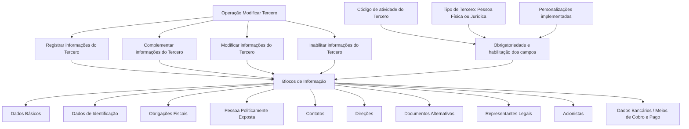

# Operação Modificar Tercero — Registro, Complementação, Modificação e Inabilitação de Dados

## 1. Metadados do Documento
- **Arquivo de Origem:** `Não identificado`
- **Tipo de Documento:** `Manual Operacional`
- **Domínio / Sistema:** `Operação Modificar Tercero`
- **Público-Alvo:** `Usuários do Sistema`
- **Data/Versão Identificada:** `Não identificada`

---

## 2. Resumo Executivo & Contexto de Negócio

O documento descreve a operação **Modificar Tercero**, destinada a registrar, complementar, modificar e/ou inabilitar informações de um Tercero no sistema. A operação abrange múltiplos blocos de informação relacionados à identificação, dados fiscais, contatos, dados bancários e informações societárias.

A obrigatoriedade e a habilitação dos campos não são fixas para todos os Terceiros. O comportamento varia conforme o código de atividade do Tercero e conforme o Tipo de Tercero, que pode ser Pessoa Física ou Pessoa Jurídica.

O documento também informa que personalizações previamente implementadas podem afetar o comportamento da aplicação, especialmente no que se refere à obrigatoriedade de preenchimento dos Dados do Tercero. Portanto, as regras efetivamente aplicáveis dependem da configuração e das personalizações do ambiente.

A captura dos dados ocorre em blocos de informação e sua ordem pode variar de acordo com o critério do Usuário no Sistema. Além disso, nem todas as atividades de Terceiros permitem registrar ou modificar informações em todos os blocos apresentados no processo.

---

## 3. Arquitetura, Componentes & Tecnologias Envolvidas

O conteúdo não descreve arquitetura de software, tecnologias, APIs, métodos HTTP, contratos JSON, ambientes ou componentes técnicos. O documento apresenta uma estrutura funcional de blocos de informação para a operação **Modificar Tercero**.



> **Nota de Análise:** O conteúdo menciona “Home Solutions APIs Documentation Zeus”, porém não explica sua relação com a operação, nem detalha APIs, serviços, endpoints ou integrações.

---

## 4. Regras de Negócio, Especificações Funcionais & Processos

### Operação Modificar Tercero

A operação Modificar Tercero permite executar uma ou mais das seguintes ações sobre as informações de um Tercero:

1. Registrar informações.
2. Complementar informações existentes.
3. Modificar informações existentes.
4. Inabilitar informações.

### Premissas de obrigatoriedade e habilitação

1. A obrigatoriedade dos campos pode variar conforme o **código de atividade do Tercero**.
2. A habilitação dos campos pode variar conforme o **código de atividade do Tercero**.
3. A obrigatoriedade dos campos pode variar conforme o Tipo de Tercero:
   - Pessoa Física.
   - Pessoa Jurídica.
4. A habilitação dos campos pode variar conforme o Tipo de Tercero:
   - Pessoa Física.
   - Pessoa Jurídica.
5. Personalizações implementadas podem afetar o comportamento da aplicação relativo à obrigatoriedade no registro dos Dados do Tercero.
6. A ordem de captura das informações nos diferentes blocos pode variar conforme o critério seguido pelo Usuário no Sistema.
7. Nem todas as atividades de Terceiros permitem registrar ou modificar informações em todos os blocos de informação do processo.
8. Quando uma atividade não permitir operação em determinado bloco, essa restrição deverá ser indicada e detalhada expressamente nos blocos de dados afetados.

### Blocos de informação do processo

O processo apresentado inclui os seguintes blocos:

- Dados Básicos.
- Dados de Identificação do Tercero.
- Obrigações Fiscais.
- Pessoa Politicamente Exposta.
- Contatos.
- Direções.
- Documentos Alternativos.
- Representantes Legais.
- Acionistas.
- Dados Bancários.
- Meios de Cobro e Pago.

> **Nota de Análise:** O documento lista os blocos de informação, mas não detalha campos individuais, regras de validação específicas, critérios de inabilitação, permissões de usuário ou sequência obrigatória de preenchimento.

---

## 5. Tabelas de Parâmetros, Ambientes e Estruturas de Dados

| Item / Parâmetro | Descrição / Função | Tipo / Valores / Formato | Ambiente / Observações |
| :--- | :--- | :--- | :--- |
| Operação Modificar Tercero | Operação para registrar, complementar, modificar e/ou inabilitar informações de um Tercero. | Operação funcional. | Não são informados ambiente, URL ou sistema técnico. |
| Código de atividade do Tercero | Critério que pode alterar a obrigatoriedade e/ou habilitação de campos nos blocos de informação. | Código de atividade. | Valores não detalhados. |
| Tipo de Tercero | Critério que pode alterar a obrigatoriedade e/ou habilitação de campos. | Pessoa Física ou Pessoa Jurídica. | Regras específicas por tipo não detalhadas. |
| Personalizações implementadas | Configurações ou customizações que podem afetar o comportamento da aplicação quanto à obrigatoriedade dos Dados do Tercero. | Personalizações. | Não são identificadas quais personalizações existem. |
| Ordem de captura | Sequência de preenchimento dos blocos de informação. | Variável conforme critério do Usuário no Sistema. | Não há ordem obrigatória documentada. |
| Dados Básicos | Bloco de informação exibido no processo. | Estrutura de dados. | Campos não detalhados. |
| Dados de Identificação do Tercero | Bloco de informação exibido no processo. | Estrutura de dados. | Campos não detalhados. |
| Obrigações Fiscais | Bloco de informação exibido no processo. | Estrutura de dados. | Campos não detalhados. |
| Pessoa Politicamente Exposta | Bloco de informação exibido no processo. | Estrutura de dados. | Critérios e campos não detalhados. |
| Contatos | Bloco de informação exibido no processo. | Estrutura de dados. | Campos não detalhados. |
| Direções | Bloco de informação exibido no processo. | Estrutura de dados. | Campos não detalhados. |
| Documentos Alternativos | Bloco de informação exibido no processo. | Estrutura de dados. | Campos não detalhados. |
| Representantes Legais | Bloco de informação exibido no processo. | Estrutura de dados. | Campos não detalhados. |
| Acionistas | Bloco de informação exibido no processo. | Estrutura de dados. | Campos não detalhados. |
| Dados Bancários | Bloco de informação exibido no processo. | Estrutura de dados. | Também aparece como “Meios de Cobro e Pago”. |
| Meios de Cobro e Pago | Bloco de informação listado entre os blocos de informação. | Estrutura de dados. | Relação exata com “Dados Bancários” não é detalhada. |

---

## 6. Bateria de Perguntas & Respostas para RAG (FAQ Sintético)

### P1: Em que consiste a operação Modificar Tercero?
**R:** A operação Modificar Tercero consiste em registrar, complementar, modificar e/ou inabilitar informações relacionadas a um Tercero no sistema.

### P2: Quais fatores podem alterar a obrigatoriedade dos campos do Tercero?
**R:** A obrigatoriedade dos campos pode variar de acordo com o código de atividade do Tercero, com o Tipo de Tercero — Pessoa Física ou Pessoa Jurídica — e com personalizações que tenham sido implementadas na aplicação.

### P3: A habilitação dos campos é igual para todos os Terceiros?
**R:** Não. A habilitação dos campos pode variar conforme o código de atividade do Tercero e conforme o Tipo de Tercero, que pode ser Pessoa Física ou Pessoa Jurídica.

### P4: As personalizações da aplicação podem afetar o cadastro do Tercero?
**R:** Sim. O documento informa que personalizações implementadas podem afetar o comportamento da aplicação em relação à obrigatoriedade de registro dos Dados do Tercero.

### P5: Existe uma ordem obrigatória para preencher os blocos de informação?
**R:** Não há uma ordem obrigatória descrita. O documento informa que a ordem de captura dos dados nos diferentes blocos de informação pode variar conforme o critério seguido pelo Usuário no Sistema.

### P6: Quais blocos de informação estão disponíveis na operação Modificar Tercero?
**R:** O processo apresenta Dados Básicos, Dados de Identificação do Tercero, Obrigações Fiscais, Pessoa Politicamente Exposta, Contatos, Direções, Documentos Alternativos, Representantes Legais, Acionistas, Dados Bancários e Meios de Cobro e Pago.

### P7: Todas as atividades de Terceiros permitem modificar todos os blocos de informação?
**R:** Não. O documento afirma que nem todas as atividades de Terceiros permitem registrar ou modificar informações em todas as estruturas de informação exibidas no processo.

### P8: Como uma restrição de atividade sobre um bloco de dados deve ser apresentada?
**R:** Quando uma atividade de Tercero não permitir registrar ou modificar informações em determinado bloco, essa condição deve ser indicada e detalhada expressamente no bloco de dados afetado.

### P9: O documento detalha os campos de Dados Básicos e Dados de Identificação do Tercero?
**R:** Não. O documento apenas lista Dados Básicos e Dados de Identificação do Tercero como blocos de informação do processo, sem especificar campos, formatos, obrigatoriedades individuais ou regras de validação.

### P10: O documento especifica APIs, métodos HTTP ou contratos JSON da operação Modificar Tercero?
**R:** Não. Embora o conteúdo inclua a expressão “Home Solutions APIs Documentation Zeus”, não há detalhamento de endpoints, métodos HTTP, contratos JSON, tecnologias ou integrações técnicas.

---

## 7. Glossário de Termos, Siglas & Conceitos-Chave

- **Tercero:** Entidade cujas informações podem ser registradas, complementadas, modificadas ou inabilitadas na operação descrita.
- **Pessoa Física:** Um dos tipos de Tercero mencionados no documento.
- **Pessoa Jurídica:** Um dos tipos de Tercero mencionados no documento.
- **Código de atividade do Tercero:** Critério que pode influenciar a obrigatoriedade e a habilitação de campos nos blocos de informação.
- **Blocos de Informação:** Estruturas funcionais que agrupam informações do Tercero durante a operação.
- **Pessoa Politicamente Exposta:** Bloco de informação apresentado no processo. O documento não define o conceito nem seus critérios de preenchimento.
- **Representantes Legais:** Bloco de informação apresentado no processo. O documento não detalha regras ou campos.
- **Acionistas:** Bloco de informação apresentado no processo. O documento não detalha regras ou campos.
- **Meios de Cobro e Pago:** Bloco de informação listado no documento. O significado operacional e sua relação com Dados Bancários não são detalhados.

---

## 8. Notas Críticas, Riscos & Limitações

- O documento não identifica arquivo de origem, data, versão, autor, sistema técnico ou ambiente.
- O documento não detalha campos, tipos de dados, máscaras, valores permitidos ou validações por bloco de informação.
- O documento não apresenta matriz de permissões, perfis de usuário ou regras de autorização para registrar, modificar ou inabilitar dados.
- O documento não especifica o significado operacional de inabilitar informações.
- O documento não detalha quais códigos de atividade permitem ou restringem cada bloco de informação.
- O documento não informa quais regras diferenciam Pessoa Física de Pessoa Jurídica.
- O conteúdo menciona personalizações, mas não identifica suas configurações, responsáveis ou impactos específicos.
- O conteúdo não descreve APIs, URLs, ambientes, logs, tecnologias, integrações, métodos HTTP ou contratos de dados.
- A expressão “Home Solutions APIs Documentation Zeus” aparece no conteúdo bruto sem contexto funcional ou técnico adicional.

---

## 9. Conteúdo Bruto Estruturado (Referência Fiel)

```text
--- [PÁGINA 1 DE 2] ---

OPERACIÓN MODIFICAR Tercero
¿En que consiste?
Esta operación consiste en Registrar, Complementar, Modificar y/o Inhabilitar la información del
Tercero.
Premisas
La obligatoriedad y/o la habilitación de los campos en el registro de los datos de cada uno de
los bloques o estructuras de información puede variar de acuerdo con el código de actividad
del Tercero.
La obligatoriedad y/o la habilitación de los campos en el registro de los datos de cada uno de
los bloques o estructuras de información también pueden variar si el Tipo de Tercero es una
Persona Física o una Persona Jurídica.
Las personalizaciones que se hubieran podido implementar a su vez pueden afectar el
comportamiento de la aplicación en relación con la obligatoriedad en el registro de los Datos del
Tercero.
Por último, el orden de captura de los datos en los distintos bloques de Información puede
variar de acuerdo con el criterio seguido por el Usuario en el Sistema.
Ejemplo de posibles acciones realizadas en la misma Operación de Modificación:
 /
 CF
Home Solutions APIs Documentation Zeus
EN


--- [PÁGINA 2 DE 2] ---

Proceso
Datos
Básicos
Datos
Identificación
Obligaciones
Fiscales
Persona
Políticamente
Expuesta
Contactos Direcciones Documentos
Alternativos
Representantes
Legales Accionistas Datos
Bancarios
No todas las Actividades de los Terceros permiten registrar o modificar la información en todas
las estructuras de Información que se muestran en el Proceso dibujado, lo cual se indicará y
detallará expresamente en los Bloques de Datos afectados.
BLOQUES de Información
 Datos Básicos ( )
 Datos Identificación Tercero ( )
 Persona Políticamente Expuesta(   )
 Contactos (   )
 Direcciones (   )
 Documentos Alternativos (   )
 Representantes Legales (   )
 Accionistas (   )
 Medios de Cobro y Pago (   )
```
