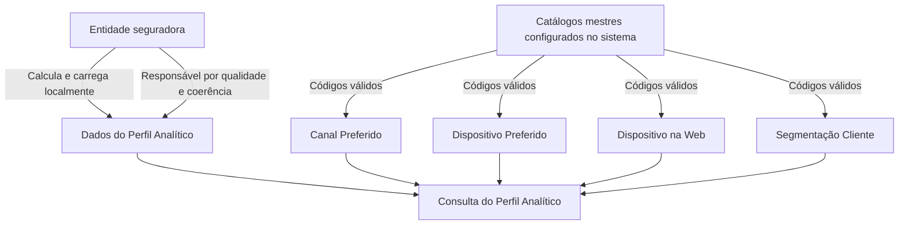

# Consulta do Perfil Analítico de Terceiros — Especificação Funcional de Atributos

## 1. Metadados do Documento
- **Arquivo de Origem:** Não identificado no conteúdo fornecido
- **Tipo de Documento:** Especificação Técnica
- **Domínio / Sistema:** Perfil Analítico de Terceiros / MAPFRE
- **Público-Alvo:** Desenvolvedores, Arquitetos, Operação e Negócio
- **Data/Versão Identificada:** Não identificada

---

## 2. Resumo Executivo & Contexto de Negócio

O documento descreve o bloco de informação **“Consultar Perfil Analítico”**, destinado à visualização dos dados analíticos de um terceiro/segurado. A informação é calculada e carregada localmente pela entidade seguradora, que é responsável pela qualidade e coerência dos dados apresentados.

O Perfil Analítico reúne indicadores de valor do cliente, risco de abandono, propensão comercial, interação digital, relacionamento, crédito, presença em redes sociais e segmentação. Os atributos permitem caracterizar o cliente e apoiar análises relacionadas a retenção, venda adicional, venda cruzada, canais de contato e comportamento de navegação.

Os campos **Canal Preferido**, **Dispositivo Preferido**, **Dispositivo na Web** e **Segmentação Cliente** devem conter códigos definidos nos respectivos catálogos mestres configurados no sistema. O documento não apresenta os valores desses catálogos.

A única ação explicitamente listada é **CONSULTAR**, associada ao Perfil Analítico. O conteúdo não detalha APIs, métodos HTTP, contratos JSON, persistência, autenticação, frequências de carga ou mecanismos de cálculo além das descrições funcionais dos atributos.

---

## 3. Arquitetura, Componentes & Tecnologias Envolvidas

Os elementos identificados no documento são:

| Componente / Elemento | Papel identificado |
| :--- | :--- |
| Perfil Analítico | Bloco de informação consultado para visualizar dados analíticos do terceiro/segurado. |
| Entidade seguradora | Realiza localmente o cálculo e a carga das informações; é responsável pela qualidade e coerência dos dados. |
| Catálogo mestre configurado no sistema | Fonte de códigos válidos para Canal Preferido, Dispositivo Preferido, Dispositivo na Web e Segmentação Cliente. |
| MAPFRE | Organização referenciada nos dados de interação, produtos, serviços, site, aplicações e contatos. |
| Ação CONSULTAR | Ação disponível para o Perfil Analítico. |



> **Nota de Análise:** O documento não detalha arquitetura de software, microsserviços, banco de dados, APIs, protocolos, ambientes, URLs, tecnologias de implementação ou contratos de integração.

---

## 4. Regras de Negócio, Especificações Funcionais & Processos

### Processo de consulta

1. O bloco de informação permite visualizar os dados do Perfil Analítico do Terceiro.
2. A entidade seguradora calcula e carrega localmente as informações.
3. A entidade seguradora é a responsável final pela qualidade e coerência dos dados.
4. A ação possível explicitada no documento é **CONSULTAR**.
5. Os atributos sujeitos a catálogo devem usar os códigos existentes no catálogo mestre configurado no sistema.

### Regras específicas dos atributos

- **C.L.T.V:** representa o *Customer Lifetime Value*, ou valor do tempo de vida do cliente; é uma previsão do montante de dinheiro que a empresa espera receber de um usuário durante todo o período em que ele permanecer cliente.
- **C.L.T.V — contingência de dados:** caso o C.L.T.V não esteja disponível, deve ser incluída a margem de contribuição. Caso a margem de contribuição também não esteja disponível, deve ser incluído o ratio combinado.
- **Probabilidade de Abandono:** contém o valor atribuído pela entidade ao segurado segundo seus modelos estatísticos, visando identificar consumidores com alta probabilidade de deixarem de ser clientes.
- **Probabilidade Up Selling MOTOR:** probabilidade de venda adicional relacionada ao ramo técnico de Automóveis.
- **Probabilidade Cross Selling MOTOR:** probabilidade de venda cruzada relacionada ao ramo técnico de Automóveis.
- **Probabilidade Up Selling Hogar:** aplica o mesmo conceito de Probabilidade Up Selling MOTOR ao produto de Hogar.
- **Probabilidade Cross Selling Hogar:** aplica o mesmo conceito de Probabilidade Cross Selling MOTOR ao produto de Hogar.
- **Probabilidade Up Selling Salud:** aplica o mesmo conceito de Probabilidade Up Selling MOTOR ao produto de Salud.
- **Probabilidade Cross Selling Salud:** aplica o mesmo conceito de Probabilidade Cross Selling MOTOR ao produto de Salud.
- **Indicador Saturación:** informa o número total de contatos recebidos pelo cliente da MAPFRE, considerando todos os produtos e serviços contratados.
- **Índice Relación:** informa o número de apólices contratadas pelo cliente, independentemente do ramo em que tenham sido emitidas.
- **Integralidad:** informa o número de produtos e apólices contratados pelo cliente em diferentes ramos.
- **Cantidad de Beneficiarios:** informa o número de beneficiários do cliente.
- **Canal Preferido:** identifica o canal de contato preferencial do cliente para interação com a MAPFRE; os valores possíveis são definidos em catálogo associado.
- **Dispositivo Preferido:** identifica o dispositivo preferencial do cliente para interação com a MAPFRE; os valores possíveis são definidos em catálogo associado.
- **Credit Score:** pontuação numérica baseada em análise dos arquivos de crédito de uma pessoa, usada para representar sua solvência; baseia-se principalmente em relatório de crédito geralmente obtido em escritórios de crédito.
- **Hora Día:** deve indicar a faixa horária do dia em que o segurado navega na Internet.
- **Recurrencia:** informa a faixa horária de maior recorrência em que o cliente navega na Internet.
- **Frecuencia Visita:** informa o número de vezes que o cliente visita a página web da MAPFRE.
- **Visitantes Multi Dispositivo:** indica se o segurado visitou a página web da MAPFRE usando mais de um dispositivo diferente.
- **Tiempo en la Web:** mede, em segundos, o tempo durante o qual o cliente navega na web da MAPFRE.
- **Sections Site:** informa a seção da página web em que o cliente contratou o produto ou serviço da MAPFRE.
- **Dispositivo en la Web:** registra o dispositivo usado pelo cliente para acessar serviços ou a página web da MAPFRE; os valores possíveis são definidos em catálogo associado.
- **Followers:** contém o número de seguidores do segurado, conforme os procedimentos de cálculo da entidade seguradora.
- **Suscriptores:** informa o número de inscritos que o cliente possui em seu canal do YouTube.
- **App Engagement:** mede o número de aplicações diferentes da MAPFRE utilizadas pelo cliente.
- **Segmentación Cliente:** identifica a segmentação atual do cliente; os valores possíveis são definidos em catálogo associado.

---

## 5. Tabelas de Parâmetros, Ambientes e Estruturas de Dados

| Item / Parâmetro | Descrição / Função | Tipo / Valores / Formato | Ambiente / Observações |
| :--- | :--- | :--- | :--- |
| Ação | Consulta do Perfil Analítico | `CONSULTAR` | Única ação explicitamente listada. |
| C.L.T.V | Previsão de receita esperada durante a vida do cliente | Não especificado | Se indisponível, usar margem de contribuição; se também indisponível, usar ratio combinado. |
| Margem de contribuição | Alternativa para C.L.T.V indisponível | Não especificado | Aplicável somente quando C.L.T.V não estiver disponível. |
| Ratio combinado | Segunda alternativa para C.L.T.V indisponível | Não especificado | Aplicável quando C.L.T.V e margem de contribuição não estiverem disponíveis. |
| Probabilidade de Abandono | Valor estatístico de probabilidade de o segurado deixar de ser cliente | Não especificado | Atribuído conforme modelos estatísticos da entidade. |
| Probabilidade Up Selling MOTOR | Propensão de venda adicional no ramo técnico de Automóveis | Não especificado | Produto/ramo MOTOR. |
| Probabilidade Cross Selling MOTOR | Propensão de venda cruzada no ramo técnico de Automóveis | Não especificado | Produto/ramo MOTOR. |
| Probabilidade Up Selling Hogar | Propensão de venda adicional para produto Hogar | Não especificado | Mesmo conceito de Up Selling MOTOR. |
| Probabilidade Cross Selling Hogar | Propensão de venda cruzada para produto Hogar | Não especificado | Mesmo conceito de Cross Selling MOTOR. |
| Probabilidade Up Selling Salud | Propensão de venda adicional para produto Salud | Não especificado | Mesmo conceito de Up Selling MOTOR. |
| Probabilidade Cross Selling Salud | Propensão de venda cruzada para produto Salud | Não especificado | Mesmo conceito de Cross Selling MOTOR. |
| Indicador Saturación | Número total de contatos recebidos da MAPFRE | Número | Considera todos os produtos e serviços contratados. |
| Índice Relación | Número de apólices contratadas | Número | Independe do ramo de emissão das apólices. |
| Integralidad | Número de produtos e apólices de ramos diferentes contratados | Número | Mede diversidade de relacionamento por ramos. |
| Cantidad de Beneficiarios | Número de beneficiários do cliente | Número | Não há regra adicional detalhada. |
| Canal Preferido | Canal de contato preferencial do cliente | Código de catálogo | Catálogo associado configurado no sistema. |
| Dispositivo Preferido | Dispositivo preferencial de interação | Código de catálogo | Catálogo associado configurado no sistema. |
| Credit Score | Indicador numérico de solvência | Pontuação numérica | Baseado em análise de arquivos/relatórios de crédito. |
| Hora Día | Faixa horária de navegação do segurado | Faixa horária | Documento não define formato nem intervalos. |
| Recurrencia | Faixa horária de maior recorrência de navegação | Faixa horária | Documento não define formato nem intervalos. |
| Frecuencia Visita | Quantidade de visitas à página web da MAPFRE | Número | Não há período de referência especificado. |
| Visitantes Multi Dispositivo | Uso de mais de um dispositivo no site MAPFRE | Indicador | Valores exatos não especificados. |
| Tiempo en la Web | Tempo de navegação na web da MAPFRE | Segundos | Unidade explicitamente informada. |
| Sections Site | Seção do site em que houve contratação | Não especificado | Relacionada a produto ou serviço MAPFRE contratado. |
| Dispositivo en la Web | Dispositivo utilizado para acessar serviços ou página web MAPFRE | Código de catálogo | Catálogo associado configurado no sistema. |
| Followers | Número de seguidores do segurado | Número | Calculado conforme procedimentos da entidade seguradora. |
| Suscriptores | Número de inscritos no canal de YouTube do cliente | Número | Referência explícita ao canal de YouTube. |
| App Engagement | Número de aplicações MAPFRE distintas utilizadas | Número | Não há período de apuração especificado. |
| Segmentación Cliente | Segmentação atual do cliente | Código de catálogo | Catálogo associado configurado no sistema. |

---

## 6. Bateria de Perguntas & Respostas para RAG (FAQ Sintético)

### P1: Qual é o objetivo do bloco “Consultar Perfil Analítico”?
**R:** O bloco permite visualizar os dados do Perfil Analítico do Terceiro. Esses dados são calculados e carregados localmente pela entidade seguradora, responsável final por sua qualidade e coerência.

### P2: Qual ação está disponível para o Perfil Analítico?
**R:** O documento lista exclusivamente a ação **CONSULTAR** para o Perfil Analítico. Não são detalhadas outras ações, como criação, atualização ou exclusão.

### P3: O que deve ser usado quando o valor C.L.T.V não estiver disponível?
**R:** Quando o C.L.T.V não estiver disponível, deve ser incluída a margem de contribuição. Caso a margem de contribuição também não esteja disponível, deve ser incluído o ratio combinado.

### P4: Como o documento define Probabilidade de Abandono?
**R:** Probabilidade de Abandono é um valor atribuído ao segurado pela entidade, de acordo com seus modelos estatísticos, para representar a probabilidade de o consumidor deixar de ser cliente.

### P5: Qual é a diferença entre Up Selling MOTOR e Cross Selling MOTOR?
**R:** Up Selling MOTOR refere-se à probabilidade de venda adicional, como produtos mais caros, atualizações ou complementos, no ramo técnico de Automóveis. Cross Selling MOTOR refere-se à probabilidade de venda cruzada de produtos complementares no mesmo ramo técnico de Automóveis.

### P6: Quais campos dependem de códigos de catálogo mestre?
**R:** Os campos Canal Preferido, Dispositivo Preferido, Dispositivo na Web e Segmentação Cliente devem conter códigos correspondentes aos valores existentes nos respectivos catálogos mestres configurados no sistema.

### P7: O que mede o Indicador Saturación?
**R:** O Indicador Saturación informa o número total de contatos que o cliente recebeu da MAPFRE, considerando todos os produtos e serviços contratados pelo cliente.

### P8: Como são diferenciados Índice Relación e Integralidad?
**R:** Índice Relación mostra a quantidade de apólices contratadas pelo cliente, sem considerar o ramo de emissão. Integralidad mostra a quantidade de produtos e apólices contratados em diferentes ramos.

### P9: Em qual unidade o campo Tiempo en la Web é medido?
**R:** Tiempo en la Web mede em segundos o tempo durante o qual o cliente está navegando na web da MAPFRE.

### P10: O que informa o atributo Visitantes Multi Dispositivo?
**R:** Visitantes Multi Dispositivo indica se o segurado visitou a página web da MAPFRE a partir de mais de um dispositivo diferente. O documento não especifica os valores técnicos possíveis para esse indicador.

### P11: O que representa App Engagement no Perfil Analítico?
**R:** App Engagement mede o número de aplicações diferentes da MAPFRE utilizadas pelo cliente. O documento não informa janela temporal, periodicidade ou critério de contagem.

### P12: O documento descreve APIs ou contratos de integração para consultar o Perfil Analítico?
**R:** Não. O documento descreve atributos funcionais e a ação CONSULTAR, mas não detalha APIs, métodos HTTP, endpoints, autenticação, payloads JSON ou contratos de integração.

---

## 7. Glossário de Termos, Siglas & Conceitos-Chave

- **C.L.T.V:** *Customer Lifetime Value*; previsão do valor monetário que a empresa espera receber de um cliente durante todo o tempo em que ele permanecer cliente.
- **Credit Score:** pontuação numérica usada para representar a solvência de uma pessoa, baseada em análise de arquivos ou relatórios de crédito.
- **Cross Selling:** venda cruzada de produtos complementares aos produtos que o cliente consome ou pretende consumir.
- **Hogar:** produto de casa/lar referido pelo documento.
- **MAPFRE:** organização mencionada como referência para produtos, serviços, contatos, website, aplicações e interação com clientes.
- **MOTOR:** ramo técnico de Automóveis.
- **Ratio combinado:** indicador usado como alternativa quando C.L.T.V e margem de contribuição não estão disponíveis; o documento não fornece definição adicional.
- **Salud:** produto de saúde referido pelo documento.
- **Up Selling:** venda adicional de itens mais caros, atualizações ou complementos para aumentar receitas.
- **Followers:** seguidores de uma pessoa, especialmente no contexto de redes sociais.
- **Suscriptores:** inscritos no canal de YouTube do cliente.

---

## 8. Notas Críticas, Riscos & Limitações

- A entidade seguradora executa localmente o cálculo e a carga dos dados e assume a responsabilidade final pela qualidade e coerência das informações.
- O documento exige códigos de catálogo para quatro atributos, mas não fornece os catálogos, seus códigos, descrições ou regras de versionamento.
- Não são fornecidos formatos de dados, domínios permitidos, obrigatoriedade, nulidade, periodicidade de carga ou critérios de atualização para os atributos.
- Não há detalhes sobre APIs, URLs, servidores, ambientes, autenticação, autorização, logs, persistência, integrações ou tratamento de erros.
- Não são definidos os modelos estatísticos, escalas, períodos de apuração ou métodos de cálculo para Probabilidade de Abandono, probabilidades de *up selling*, probabilidades de *cross selling*, Credit Score e demais métricas.
- **Nota de Análise:** O documento lista o Perfil Analítico e seus atributos, mas não detalha métodos HTTP, contratos JSON, interface de consulta ou implementação técnica.

---

## 9. Conteúdo Bruto Estruturado (Referência Fiel)

```text
--- [PÁGINA 1 DE 5] ---

CONSULTAR Perfil Analítico
Objetivo
El propósito de este Bloque de Información es poder visualizar los datos del Perfil Analítico del
Tercero de acuerdo con el proceso de cálculo y carga de la información efectuada localmente por
la Entidad aseguradora, responsable última de la calidad y coherencia de los Datos.
Los valores de los Datos: Canal y Dispositivo Preferido, Dispositivo en la Web y
Segmentación Cliente deben contener determinados códigos de acuerdo con la relación de los
valores existentes en el catálogo maestro configurado en el Sistema.
Posibles Acciones
 CONSULTAR ( )
Perfil Analítico
 / 
 RS
Inicio Soluciones APIs Documentación Zeus
ES


--- [PÁGINA 2 DE 5] ---

C.L.T.V
Contendrá el El customer lifetime value o valor del tiempo de vida del cliente que no es sino un
pronóstico sobre la cantidad de dinero que espera recibir la empresa por parte de un usuario, durante
todo el tiempo en que este siga siendo su cliente.
Si no se dispone de este dato deberá incluirse el margen de contribución y si tampoco se cuenta con
él, el ratio combinado.
Probabilidad de Abandono
La predicción de abandono es una técnica de marketing que busca identificar tempranamente a
aquellos consumidores que tienen una alta probabilidad de dejar de ser clientes de la empresa.
Este Campo contiene el valor que la entidad, de acuerdo con sus modelos estadísticos, asigna al
Asegurado.
Probabilidad Up Selling MOTOR
En Marketing, se denomina 'Venta Adicional' a la técnica de ventas en la que un vendedor invita al
cliente a comprar artículos más caros, actualizaciones u otros complementos para generar mayores
ingresos para la Entidad Aseguradora ... En este caso la probabilidad estaría referenciada al Ramo
Técnico de Automóviles.
Probabilidad Cross Selling MOTOR
En marketing, se llama 'Venta Cruzada' a la táctica mediante la cual un vendedor intenta vender
productos complementarios a los que consume o pretende consumir un cliente, en este caso la
probabilidad está referenciada al Ramo Técnico de Automóviles.
Probabilidad Up Selling Hogar
Similar a lo indicado previamente en el dato de Probabilidad de Up Selling MOTOR pero en esta
ocasión para el Producto de Hogar.
Probabilidad Cross Selling Hogar


--- [PÁGINA 3 DE 5] ---

Similar a lo indicado previamente en el Atributo de Probabilidad de Cross Selling MOTOR pero en
esta ocasión para el Producto de Hogar.
Probabilidad Up Selling Salud
Similar a lo indicado previamente en el dato de Probabilidad de Up Selling MOTOR pero en esta
ocasión para el Producto de Salud.
Probabilidad Cross Selling Salud
Similar a lo indicado previamente en el Atributo de Probabilidad de Cross Selling MOTOR pero en
esta ocasión para el Producto de Salud.
Indicador Saturación
Este Atributo indica el número de contactos totales recibidos por el Cliente por parte de MAPFRE
para todos sus productos y servicios contratados.
Índice Relación
Muestra el número de pólizas contratadas por el Cliente, independientemente del ramo en el que
estén emitidas.
Integralidad
Muestra el número de productos y pólizas de diferentes ramos contratadas por el Cliente.
Cantidad de Beneficiarios
Este Dato muestra el número de beneficiarios del Cliente.
Canal Preferido
Indica el canal preferido de contacto del Cliente para interaccionar con MAPFRE. Los valores
posibles de este atributo se enumeran en su catálogo asociado.
Dispositivo Preferido
Indica el dispositivo preferido utilizado por el Cliente para interaccionar con MAPFRE. Los valores
posibles de este atributo se enumeran en su catálogo asociado
Credit Score
Una puntuación de crédito es una expresión numérica basada en un análisis de nivel de los archivos
de crédito de una persona, para representar la solvencia de un individuo, solvencia basada
principalmente en un informe de crédito que generalmente se obtiene de las oficinas de crédito.


--- [PÁGINA 4 DE 5] ---

Hora Día
Este Campo deber indicar el tramo horario del día en las cuáles el Asegurado navega por Internet.
Recurrencia
Franja horaria de recurrencia más alta en la que el Cliente navega por Internet.
Frecuencia Visita
Muestra el número de veces en las que el Cliente visita la página web de MAPFRE.
Visitantes Multi Dispositivo
Indica si el Asegurado ha visitado la página web de MAPFRE desde más de un dispositivo diferente.
Tiempo en la Web
Mide el tiempo en segundos que el Cliente está navegando por la web de MAPFRE.
Sections Site
Muestra la sección de la página web en la que el Cliente contrató el producto o servicio de MAPFRE.
Dispositivo en la Web
Recoge el dispositivo que utiliza el Cliente para acceder a los servicios o la página web de MAPFRE.
Los valores posibles de este atributo se enumeran en su catálogo asociado.
Followers
Sabiendo que un Follower es una Persona interesada en algo o alguien y que siguen su evolución,
su trabajo o su trayectoria, especialmente en las redes sociales, este dato del Perfil Analítico de los
Asegurados contendrá el número de Followers del mismo (de acuerdo con los procedimientos de
cálculo de la entidad aseguradora)
Suscriptores
Indica el número de subscriptores que tiene el Cliente a su canal de YouTube.
App Engagement
Mide el número de aplicaciones diferentes de MAPFRE que utiliza el Cliente.
Segmentación Cliente


--- [PÁGINA 5 DE 5] ---

Identifica la segmentación actual del Cliente. Los valores posibles de este atributo se enumeran en
su catálogo asociado.
```
