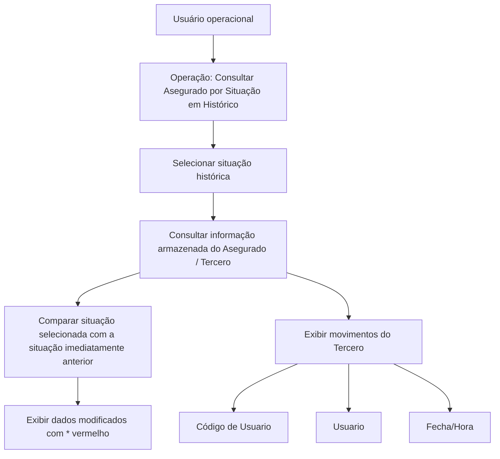

# Operação Consultar Assegurado por Situação em Histórico

## 1. Metadados do Documento
- **Arquivo de Origem:** Não identificado
- **Tipo de Documento:** Manual Operacional
- **Domínio / Sistema:** Consulta de Asegurado / Tercero em histórico
- **Público-Alvo:** Operação, usuários funcionais e suporte
- **Data/Versão Identificada:** Não identificada

---

## 2. Resumo Executivo & Contexto de Negócio

O documento descreve a operação **“Consultar Asegurado por Situación en Histórico”**, destinada a consultar informações históricas de um segurado (*Asegurado*), denominado também como terceiro (*Tercero*) no conteúdo apresentado.

A operação permite selecionar um momento temporal específico para consultar os dados do segurado. Os momentos disponíveis correspondem a uma relação de situações, ordenada pela respectiva data de modificação.

A consulta apresenta a informação armazenada do terceiro no momento histórico selecionado e destaca as alterações realizadas em comparação com a situação imediatamente anterior. Essa comparação permite identificar quais dados foram modificados em cada movimento histórico.

Os campos de auditoria exibidos incluem o código do usuário responsável pelo registro, o nome do usuário associado e a data/hora em que as alterações do segurado foram registradas no sistema.

---

## 3. Arquitetura, Componentes & Tecnologias Envolvidas

O conteúdo não descreve arquitetura de infraestrutura, microsserviços, APIs, bancos de dados, protocolos, contratos JSON, URLs de ambiente ou tecnologias de implementação.

Os elementos funcionais identificados são:

- **Operação Consultar Asegurado por Situação em Histórico:** funcionalidade de consulta histórica.
- **Asegurado:** entidade consultada.
- **Tercero:** termo utilizado pelo documento para a informação armazenada do segurado.
- **Situação histórica:** instante temporal disponível para seleção e consulta.
- **Movimento do Tercero:** registro associado às alterações do terceiro.
- **Código de Usuario:** identificador do usuário que registrou um movimento.
- **Usuario:** nome do usuário responsável pelo movimento.
- **Fecha/Hora:** momento em que as alterações foram registradas.
- **Indicador `*` vermelho:** identificação visual dos dados modificados na situação selecionada.



> *Nota de Análise: O documento não detalha os critérios de seleção de um segurado, as telas envolvidas, os campos completos da entidade Asegurado/Tercero, nem a persistência dos movimentos históricos.*

---

## 4. Regras de Negócio, Especificações Funcionais & Processos

### 4.1. Consulta temporal do segurado

1. A operação permite selecionar o momento temporal em que será realizada a consulta das informações do segurado.
2. Os momentos temporais disponíveis são apresentados como uma relação de situações.
3. A relação de situações é ordenada pela data de modificação.
4. A consulta utiliza a situação histórica selecionada pelo usuário.

### 4.2. Comparação entre situações históricas

1. A consulta visualiza a informação armazenada do terceiro para a situação selecionada.
2. As alterações são analisadas em relação à situação imediatamente anterior.
3. Os dados que foram modificados na situação selecionada devem ser identificados visualmente.
4. A identificação de alteração é feita por meio de um asterisco (`*`) de cor vermelha nas diferentes estruturas de informação do Asegurado.

### 4.3. Informações de auditoria de movimentos

Para cada movimento do terceiro, a operação apresenta informações de autoria e momento do registro:

1. **Código de Usuario:** mostra o ID do usuário que registrou o movimento no sistema.
2. **Usuario:** mostra o nome do usuário que realizou o movimento; esse dado está associado ao Código de Usuario.
3. **Fecha/Hora:** mostra a data e a hora em que as alterações do Asegurado foram registradas no sistema.
4. A hora é exibida com formato de hora, minutos e segundos.

---

## 5. Tabelas de Parâmetros, Ambientes e Estruturas de Dados

| Item / Parâmetro | Descrição / Função | Tipo / Valores / Formato | Ambiente / Observações |
| :--- | :--- | :--- | :--- |
| Operação Consultar Asegurado por Situação em Histórico | Permite consultar informações do segurado em um momento temporal selecionado. | Operação funcional | Não detalhado |
| Asegurado | Entidade cujas informações históricas são consultadas. | Entidade de negócio | Também referido como Tercero no documento |
| Tercero | Informação armazenada consultada para a situação histórica selecionada. | Entidade / termo funcional | O documento não define formalmente a relação entre Tercero e Asegurado |
| Situação histórica | Momento temporal disponível para consulta. | Relação de situações | Ordenada pela data de modificação |
| Situação imediatamente anterior | Referência usada para identificar mudanças na situação selecionada. | Registro histórico anterior | Utilizada na comparação de alterações |
| Dado modificado | Informação alterada na situação selecionada. | Campo de informação | Identificado por `*` vermelho |
| `*` vermelho | Indicador visual de modificação. | Marcador visual | Aparece nas diferentes estruturas de informação do Asegurado |
| Movimentos do Tercero | Registros relacionados às mudanças do terceiro. | Registros históricos | Exibem dados de auditoria |
| Código de Usuario | ID do usuário que registrou o movimento no sistema. | Identificador de usuário | Associado ao campo Usuario |
| Usuario | Nome do usuário que realizou o movimento. | Nome de usuário | Associado ao Código de Usuario |
| Fecha/Hora | Data e hora do registro das alterações do Asegurado. | Data/hora | Inclui hora, minutos e segundos |
| Sistema | Sistema no qual os movimentos e alterações do Asegurado são registrados. | Sistema não especificado | Nome e tecnologia não detalhados |

---

## 6. Bateria de Perguntas & Respostas para RAG (FAQ Sintético)

### P1: Qual é o objetivo da operação Consultar Asegurado por Situação em Histórico?
**R:** A operação permite selecionar um momento temporal para consultar as informações de um Asegurado. A consulta usa uma relação de situações históricas ordenadas por data de modificação.

### P2: Como são organizadas as situações disponíveis para consulta histórica do Asegurado?
**R:** As situações são apresentadas em uma relação ordenada pela data de modificação. O documento não informa se a ordenação é crescente ou decrescente.

### P3: O que a consulta mostra após a seleção de uma situação histórica?
**R:** A consulta visualiza a informação armazenada do Tercero, correspondente ao Asegurado, para a situação selecionada pelo usuário.

### P4: Contra qual referência são identificadas as alterações de uma situação histórica?
**R:** As alterações da situação selecionada são apresentadas em relação à situação imediatamente anterior.

### P5: Como o sistema indica que um dado foi modificado em uma situação selecionada?
**R:** Os dados modificados são identificados por um asterisco (`*`) de cor vermelha nas diferentes estruturas de informação do Asegurado.

### P6: O que representa o campo Código de Usuario nos movimentos do Tercero?
**R:** O campo Código de Usuario mostra o ID do usuário que registrou o movimento no sistema.

### P7: Qual é a finalidade do campo Usuario?
**R:** O campo Usuario mostra o nome do usuário que realizou o movimento. O documento informa que esse campo está associado ao Código de Usuario.

### P8: Que informação é exibida no campo Fecha/Hora?
**R:** O campo Fecha/Hora mostra a data e a hora em que as alterações do Asegurado foram registradas no sistema, incluindo hora, minutos e segundos.

### P9: O documento especifica APIs, métodos HTTP ou contratos de integração da operação?
**R:** Não. O conteúdo fornecido não detalha APIs, métodos HTTP, contratos JSON, URLs, protocolos ou tecnologias de integração.

### P10: O documento informa quais campos do Asegurado podem ser alterados?
**R:** Não. O documento apenas informa que os campos modificados são marcados com um asterisco vermelho, sem listar as estruturas ou os atributos específicos do Asegurado.

---

## 7. Glossário de Termos, Siglas & Conceitos-Chave

- **Asegurado:** segurado consultado pela operação histórica.
- **Tercero:** termo utilizado para a informação armazenada associada ao Asegurado.
- **Situación en Histórico:** situação histórica selecionável para consulta em um momento temporal.
- **Movimientos del Tercero:** movimentos ou registros relacionados às alterações do terceiro.
- **Código de Usuario:** ID do usuário que registrou um movimento no sistema.
- **Usuario:** nome do usuário que realizou um movimento.
- **Fecha/Hora:** data e hora em que as alterações foram registradas no sistema.
- **`*` vermelho:** indicador visual de que um dado foi modificado na situação selecionada.

---

## 8. Notas Críticas, Riscos & Limitações

- O documento não identifica o arquivo de origem, autor, data, versão ou sistema responsável pela operação.
- O conteúdo não detalha os atributos completos do Asegurado ou Tercero.
- Não há definição formal da diferença semântica entre os termos **Asegurado** e **Tercero**.
- O documento não informa critérios de acesso, perfis de permissão, retenção histórica, tratamento de erros ou regras para ausência de situação anterior.
- Não são descritos APIs, integrações, tecnologia de persistência, infraestrutura, ambientes, URLs ou rotas de logs.
- Não é informado se o asterisco vermelho é exibido para todos os tipos de campo ou apenas para determinadas estruturas de informação.

---

## 9. Conteúdo Bruto Estruturado (Referência Fiel)

```text
--- [PÁGINA 1 DE 2] ---

OPERACIÓN CONSULTAR Asegurado por
Situación en Histórico
¿En que consiste?
Esta operación permite seleccionar el momento temporal en el que se quiere realizar la consulta de
la información del asegurado (de acuerdo con la relación de situaciones que se muestran
ordenadamente por su fecha de modificación).
Es importante considerar que esta consulta visualiza la información almacenada del Tercero
mostrando los cambios de la situación seleccionada respecto de la situación inmediatamente
anterior.
Movimientos del Tercero
 /
 RS
Inicio Soluciones APIs Documentación Zeus
ES


--- [PÁGINA 2 DE 2] ---

Los datos que hayan sido modificados en la situación seleccionada se identifican con un "*" de
color rojo en las diferentes estructuras de información del Asegurado, tal y como por ejemplo se
aprecia en la siguiente imagen:
Código de Usuario
Este dato muestra el ID del usuario que registró el movimiento en el sistema.
Usuario
Este dato, asociado al código anterior, visualiza el nombre del usuario que realizó el movimiento.
Fecha/Hora
Este dato muestra la fecha y la hora (con formato de hora, minutos y segundos) en la que se
registraron los cambios del Asegurado en el Sistema.
```
