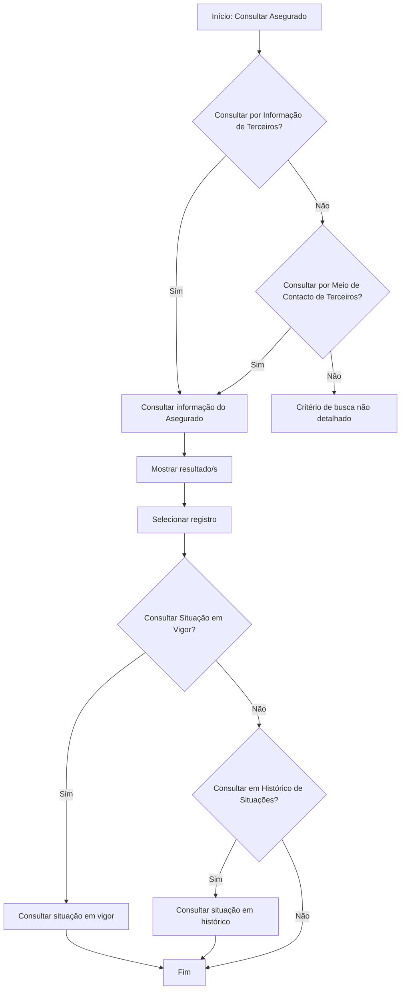

# Operação Consultar Asegurado — Consulta de Informações e Situações

## 1. Metadados do Documento
- **Arquivo de Origem:** Não identificado no conteúdo fornecido
- **Tipo de Documento:** Procedimento
- **Domínio / Sistema:** Operação de consulta de Asegurado / Terceiros
- **Público-Alvo:** Operação, Negócio, Desenvolvedores e Analistas Funcionais
- **Data/Versão Identificada:** Não identificada

---

## 2. Resumo Executivo & Contexto de Negócio

O documento descreve a operação **Consultar Asegurado**, destinada à consulta de informações de assegurados. A operação permite recuperar informações na última situação disponível, denominada **situação em vigor**, ou em uma situação temporal armazenada no **Histórico**.

A consulta ao histórico não está incondicionalmente disponível. A operação de consulta histórica somente estará habilitada quando a informação do assegurado tiver sido modificada após o seu registro inicial. O documento não especifica quais campos ou eventos caracterizam uma modificação para habilitação do histórico.

A consulta pode ser iniciada por dois grupos de critérios de busca: **Informação de Terceiros** e **Meio de Contacto de Terceiros**. Após a consulta, o processo prevê a apresentação de resultados e a seleção de um registro.

Os dados apresentados nos blocos ou estruturas de informação podem variar conforme o tipo de terceiro associado ao assegurado: **Pessoa Física** ou **Pessoa Jurídica**. O papel do usuário que executa a consulta não possui limitações para visualização das informações.

---

## 3. Arquitetura, Componentes & Tecnologias Envolvidas

O conteúdo fornecido não detalha arquitetura de software, tecnologias, integrações, contratos de API, bancos de dados, ambientes ou microsserviços. São citados elementos de navegação ou contexto identificados como **Inicio**, **Soluciones**, **APIs**, **Documentación** e **Zeus**, mas o documento não explica suas responsabilidades nem relações técnicas.

Os componentes funcionais identificados são:

- **Operação Consultar Asegurado:** funcionalidade principal de consulta.
- **Critérios de Busca:** seleção entre consulta por dados do terceiro ou por meio de contacto.
- **Resultado/s:** conjunto de resultados apresentados pela operação.
- **Registro:** item selecionado dentre os resultados.
- **Situação em Vigor:** última situação do assegurado.
- **Situação em Histórico:** situação temporal disponível no histórico, condicionada à modificação posterior ao registro inicial.
- **Pessoa Física / Pessoa Jurídica:** classificação do terceiro que pode alterar os dados exibidos.



> **Nota de Análise:** O diagrama reconstrói exclusivamente o fluxo funcional indicado no documento. O conteúdo não detalha validações técnicas, chamadas de API, persistência de dados, telas, métodos HTTP ou contratos de integração.

---

## 4. Regras de Negócio, Especificações Funcionais & Processos

### 4.1 Finalidade da operação

A operação **Consultar Asegurado** permite consultar a informação dos assegurados em duas perspectivas:

1. **Última situação:** consulta da situação em vigor.
2. **Situação temporal:** consulta de uma situação registrada no histórico.

### 4.2 Regra de habilitação do histórico

A consulta sobre o histórico estará habilitada somente quando a informação do assegurado tiver sido modificada desde o momento de seu registro inicial.

O documento não define:

- quais alterações habilitam a consulta histórica;
- quais dados formam o registro inicial;
- como a modificação é identificada;
- como o usuário seleciona uma data, versão ou situação histórica específica;
- qual mensagem deve ser apresentada quando não existir alteração posterior ao registro inicial.

### 4.3 Variação de informações por tipo de terceiro

Os dados visualizados em cada bloco ou estrutura de informação podem variar de acordo com o tipo de terceiro:

- **Pessoa Física**
- **Pessoa Jurídica**

O documento não relaciona os blocos de informação, campos exibidos ou diferenças específicas entre Pessoa Física e Pessoa Jurídica.

### 4.4 Regra de autorização de visualização

O papel do usuário que efetua a consulta não possui limitação para visualizar a informação. Portanto, conforme o texto fornecido, não há restrição de visualização baseada no papel do usuário para a operação Consultar Asegurado.

### 4.5 Critérios de busca identificados

A operação apresenta os seguintes critérios de busca:

1. Consultar assegurado por dados do terceiro.
2. Consultar assegurado por meio de contacto do terceiro.
3. Consultar em histórico de situações.
4. Consultar situação em vigor.

### 4.6 Fluxo operacional

1. O usuário inicia a operação **Consultar Asegurado**.
2. O usuário seleciona a consulta por **Informação de Terceiros** ou por **Meio de Contacto de Terceiros**.
3. A operação consulta as informações do assegurado.
4. A operação apresenta o(s) resultado(s) encontrado(s).
5. O usuário seleciona um registro.
6. O usuário consulta a situação em vigor ou solicita consulta no histórico de situações.
7. Quando a consulta histórica estiver habilitada, a operação permite consultar uma situação temporal.
8. O processo é encerrado.

> **Nota de Análise:** O documento apresenta decisões “Sim” e “Não” no fluxograma, mas não descreve o comportamento completo dos caminhos negativos para todos os critérios de busca.

---

## 5. Tabelas de Parâmetros, Ambientes e Estruturas de Dados

| Item / Parâmetro | Descrição / Função | Tipo / Valores / Formato | Ambiente / Observações |
| :--- | :--- | :--- | :--- |
| Operação Consultar Asegurado | Permite consultar informações de assegurados. | Operação funcional | Não são especificados sistema, tela, endpoint ou API. |
| Situação em vigor | Representa a última situação do assegurado. | Situação de consulta | Disponível como uma das opções de consulta. |
| Situação em histórico | Representa uma situação temporal do assegurado. | Situação de consulta | Habilitada somente se a informação do assegurado foi modificada após o registro inicial. |
| Informação de Terceiros | Critério para consultar o assegurado. | Critério de busca | O documento não especifica campos de pesquisa. |
| Meio de Contacto de Terceiros | Critério para consultar o assegurado. | Critério de busca | O documento não especifica tipos de contacto ou campos de pesquisa. |
| Resultado/s | Resultados retornados pela consulta. | Lista de registros | O conteúdo não define ordenação, paginação ou quantidade máxima. |
| Registro | Resultado selecionado pelo usuário. | Registro de assegurado | O documento não descreve a estrutura do registro. |
| Pessoa Física | Tipo de terceiro que pode alterar os dados exibidos nos blocos de informação. | Classificação de terceiro | Diferenças de campos não detalhadas. |
| Pessoa Jurídica | Tipo de terceiro que pode alterar os dados exibidos nos blocos de informação. | Classificação de terceiro | Diferenças de campos não detalhadas. |
| Papel do usuário | Perfil do usuário que executa a consulta. | Regra de acesso | Não possui limitação para visualizar a informação. |
| Inicio | Elemento citado no fluxo/conteúdo bruto. | Termo de navegação ou contexto | Função não detalhada. |
| Soluciones | Elemento citado no fluxo/conteúdo bruto. | Termo de navegação ou contexto | Função não detalhada. |
| APIs | Elemento citado no fluxo/conteúdo bruto. | Termo de navegação ou contexto | Não há APIs ou contratos especificados. |
| Documentación | Elemento citado no fluxo/conteúdo bruto. | Termo de navegação ou contexto | Função não detalhada. |
| Zeus | Elemento citado no fluxo/conteúdo bruto. | Termo de navegação ou contexto | Não há descrição funcional ou técnica. |

---

## 6. Bateria de Perguntas & Respostas para RAG (FAQ Sintético)

### P1: Qual é a finalidade da operação Consultar Asegurado?
**R:** A operação Consultar Asegurado permite consultar informações dos assegurados. A consulta pode recuperar a última situação, denominada situação em vigor, ou uma situação temporal disponível no histórico.

### P2: Quando a consulta ao histórico de situações do assegurado fica habilitada?
**R:** A consulta ao histórico fica habilitada somente quando a informação do assegurado foi modificada desde o momento do registro inicial. O documento não especifica quais alterações habilitam o histórico.

### P3: Quais critérios de busca estão disponíveis para consultar um assegurado?
**R:** O documento apresenta dois critérios de busca principais: consulta por dados ou informação do terceiro e consulta por meio de contacto do terceiro.

### P4: O usuário pode consultar a situação em vigor de um assegurado?
**R:** Sim. O fluxo da operação inclui a opção de consultar a situação em vigor, definida no documento como a última situação do assegurado.

### P5: Há alguma limitação de visualização baseada no papel do usuário?
**R:** Não. O documento afirma que o papel do usuário que efetua a consulta não possui qualquer limitação para visualizar as informações.

### P6: Os dados exibidos são iguais para Pessoa Física e Pessoa Jurídica?
**R:** Não necessariamente. O documento informa que os dados visualizados nos blocos ou estruturas de informação podem variar conforme o terceiro seja Pessoa Física ou Pessoa Jurídica. As diferenças específicas não são detalhadas.

### P7: O que ocorre após a execução da consulta de informações do assegurado?
**R:** Após a consulta, a operação apresenta o(s) resultado(s) encontrado(s). O fluxo indica que o usuário deve selecionar um registro antes de consultar a situação em vigor ou o histórico de situações.

### P8: O documento especifica campos de busca para dados do terceiro ou meio de contacto?
**R:** Não. O documento apenas identifica os critérios “Dados do Terceiro” e “Meio de Contacto do Terceiro”, sem listar campos, formatos, obrigatoriedade ou validações.

### P9: O documento informa endpoints, métodos HTTP ou contratos de API para Consultar Asegurado?
**R:** Não. Embora o conteúdo mencione “APIs”, não há detalhamento de endpoints, métodos HTTP, parâmetros de requisição, respostas JSON, autenticação ou contratos técnicos.

### P10: O documento descreve como escolher uma situação histórica específica?
**R:** Não. O documento informa que é possível consultar uma situação temporal no histórico quando houver modificação após o registro inicial, mas não detalha filtros por data, versão, vigência ou seleção de eventos históricos.

---

## 7. Glossário de Termos, Siglas & Conceitos-Chave

- **Asegurado:** entidade cujas informações são consultadas pela operação.
- **Terceiro:** classificação associada ao assegurado no contexto dos critérios de busca e do tipo de pessoa.
- **Pessoa Física:** tipo de terceiro cujos blocos ou estruturas de informação podem diferir dos apresentados para Pessoa Jurídica.
- **Pessoa Jurídica:** tipo de terceiro cujos blocos ou estruturas de informação podem diferir dos apresentados para Pessoa Física.
- **Situação em Vigor:** última situação do assegurado.
- **Histórico de Situações:** conjunto de situações temporais do assegurado, disponível para consulta quando houve modificação desde o registro inicial.
- **Meio de Contacto:** critério de busca de assegurado associado às informações de contacto do terceiro.
- **Registro Inicial:** momento inicial de registro da informação do assegurado.
- **Registro:** resultado selecionado após a apresentação dos resultados da consulta.
- **APIs:** termo citado no conteúdo original; o documento não fornece definição ou especificação técnica no contexto da operação.
- **Zeus:** termo citado no conteúdo original; o documento não descreve seu significado ou função.

---

## 8. Notas Críticas, Riscos & Limitações

- O documento não identifica o arquivo de origem, versão, data, autor ou sistema proprietário da operação.
- Não há especificação de arquitetura técnica, integrações, microsserviços, bancos de dados, tecnologias, ambientes, URLs, servidores ou logs.
- Não são definidos endpoints, métodos HTTP, contratos de requisição ou resposta, códigos de erro, autenticação ou autorização técnica.
- Os campos de busca por dados do terceiro e por meio de contacto não são detalhados.
- A condição “informação modificada desde o registro inicial” é apresentada como requisito para acesso ao histórico, mas não possui definição funcional ou técnica completa.
- Não há descrição dos comportamentos de erro, ausência de resultados, múltiplos resultados ou caminhos negativos do fluxograma.
- O documento não especifica as diferenças de dados exibidos entre Pessoa Física e Pessoa Jurídica.
- Os termos **Inicio**, **Soluciones**, **APIs**, **Documentación** e **Zeus** são apresentados sem explicação adicional.

---

## 9. Conteúdo Bruto Estruturado (Referência Fiel)

```text
--- [PÁGINA 1 DE 2] ---

OPERACIÓN CONSULTAR Asegurado
¿En que consiste?
Esta operación permite Consultar la información de los Asegurados, a su última situación
(situación en vigor) o a una situación temporal en el Histórico.
La operación de consulta sobre el histórico estará habilitada siempre y cuando se haya modificado
la información del asegurado desde el momento de su registro inicial.
Premisas
Los datos que se visualizan en cada uno de los bloques o estructuras de información pueden
variar si el tipo de tercero es una Persona Física o una Persona Jurídica.
El rol del usuario que efectúa la consulta No tiene limitación alguna para visualizar la
información.
Proceso
 / 
 RS
Inicio Soluciones APIs Documentación Zeus
ES


--- [PÁGINA 2 DE 2] ---

SI
NO
SI
NO
SI
NO SIINICIO ¿CONSULTAR por
**Información** de Terceros?
¿CONSULTAR por
**Medio de Contacto** de Terceros?
MOSTRAR Resultado/s SELECCIONAR
Registro
¿CONSULTAR por
Situación en
**VIGOR**?
CONSULTAR por
Situación en
**HISTÓRICO**
**CONSULTAR** Información
del Asegurado
FIN
Criterios de Búsqueda
 ¿Consultar Asegurado por Datos del Tercero? ( )
 ¿Consultar Asegurado por Medio de Contacto del Tercero?( )
Consultar Asegurado
 ¿Consultar en Histórico de Situaciones? ( )
 ¿Consultar Situación en Vigor? ( )
```
