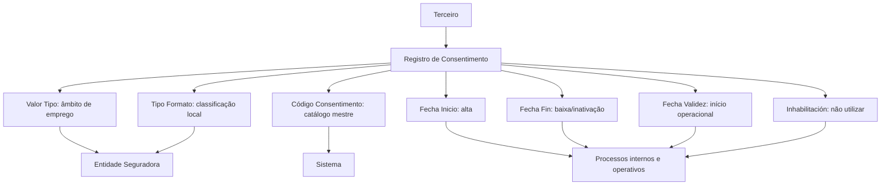

# Criação de Consentimentos de Terceiros — Especificação Funcional

## 1. Metadados do Documento
- **Arquivo de Origem:** Não identificado no conteúdo fornecido
- **Tipo de Documento:** Especificação Técnica / Funcional
- **Domínio / Sistema:** Gestão de Consentimentos de Terceiros; Proteção de Dados
- **Público-Alvo:** Desenvolvedores, Arquitetos, Operação e Negócio
- **Data/Versão Identificada:** Não identificada

---

## 2. Resumo Executivo & Contexto de Negócio

O documento descreve o bloco funcional **“CREAR Consentimientos del Tercero”**, destinado à identificação e ao registro de consentimentos associados a um Terceiro. O consentimento é definido como uma manifestação de vontade livre, inequívoca, específica e informada, expressa por declaração ou clara ação afirmativa, pela qual o interessado aceita o tratamento de dados pessoais.

A finalidade do bloco de informações é permitir que a entidade seguradora cumpra a vontade do Terceiro em seus processos. O registro do consentimento sustenta o uso operacional de informações pessoais em conformidade com a classificação e as regras definidas localmente pela própria seguradora.

A ação explicitamente habilitada é **CREAR**, isto é, criar registros de consentimento. O conteúdo especifica atributos para classificar o âmbito de aplicação do consentimento, identificar o consentimento conforme catálogo mestre, registrar o formato segundo a normativa local de proteção de dados e controlar datas de alta, baixa e validade.

O documento informa que, quando os campos não forem expressamente especificados, eles devem ser utilizados indistintamente tanto para o registro de informações de **Pessoas Físicas** quanto de **Pessoas Jurídicas**. Não há detalhamento de métodos HTTP, contratos JSON, persistência, interfaces, APIs ou integrações técnicas.

---

## 3. Arquitetura, Componentes & Tecnologias Envolvidas

Os elementos identificados no conteúdo são:

- **Bloco funcional:** CREAR Consentimientos del Tercero.
- **Entidade de negócio:** Terceiro.
- **Entidade responsável pelo uso operacional:** Companhia/entidade seguradora.
- **Catálogo mestre:** Catálogo mestre de Consentimentos configurado no Sistema.
- **Normativa aplicável:** Normativa local de Proteção de Dados.
- **Classificações locais:** Tipo de consentimento e formato de consentimento, ambos definidos localmente pela entidade seguradora.
- **Processos consumidores:** Processos internos e operativos da entidade seguradora.
- **Navegação exibida no conteúdo bruto:** Inicio, Soluciones, APIs, Documentación, Zeus, ES.



> **Nota de Análise:** O documento não descreve arquitetura de software, serviços, banco de dados, protocolos, tecnologias, URLs, ambientes ou contratos de integração.

---

## 4. Regras de Negócio, Especificações Funcionais & Processos

### Definição de consentimento

O consentimento é entendido como toda manifestação de vontade:

- Livre;
- Inequívoca;
- Específica;
- Informada;
- Realizada por declaração ou por clara ação afirmativa;
- Pela qual o interessado aceita o tratamento de dados pessoais que lhe dizem respeito.

### Finalidade do registro

O bloco de informação de consentimentos tem como propósito a identificação dos Consentimentos do Terceiro. Essa identificação habilita a entidade seguradora a cumprir a vontade do Terceiro em seus processos.

### Ação habilitada

- **CREAR:** criação de Consentimentos.

### Aplicabilidade para tipos de pessoa

Caso os campos não sejam especificados ou indicados expressamente, os campos devem ser utilizados indistintamente no registro de informações de:

- Pessoas Físicas;
- Pessoas Jurídicas.

### Valor Tipo

A propriedade **Valor Tipo** indica o âmbito do consentimento atribuído ao Terceiro.

A classificação estabelece o âmbito de emprego do consentimento na atividade da Companhia Seguradora. A classificação deve ser definida localmente pela entidade seguradora para uso posterior nos processos internos.

Exemplos apresentados:

- `001` — Publicidad;
- `002` — Cesión de Datos;
- `003` — Perfilado.

### Código Consentimento

O campo **Código Consentimento** contém o código do consentimento do Terceiro conforme a relação de valores possíveis existente no catálogo mestre de Consentimentos configurado no Sistema.

### Tipo Formato

O atributo **Tipo Formato** contém uma classificação dos Consentimentos do Terceiro segundo a Normativa de Proteção de Dados local.

A classificação deve ser definida pela entidade seguradora para uso posterior nos processos internos.

Exemplos apresentados:

- `001` — No Otorgado;
- `002` — Tácito;
- `003` — Expreso;
- `004` — Retirado.

### Datas do consentimento

- **Fecha Inicio:** indica a data de alta do Consentimento do Terceiro.
- **Fecha Fin:** indica a data de baixa a partir da qual o Consentimento do Terceiro deixa de estar ativo.
- **Fecha Validez:** indica a data a partir da qual o Consentimento do Terceiro estará plenamente operativo no sistema. O uso correto permite manter histórico das alterações realizadas nas informações do Terceiro.

### Inhabilitación

A propriedade **Inhabilitación** indica ao Sistema que o Consentimento associado ao Terceiro está inabilitado.

Um consentimento inabilitado:

- Não deve ser empregado;
- Não deve ser contemplado;
- Não deve ser utilizado nos processos operativos da entidade.

---

## 5. Tabelas de Parâmetros, Ambientes e Estruturas de Dados

| Item / Parâmetro | Descrição / Função | Tipo / Valores / Formato | Ambiente / Observações |
| :--- | :--- | :--- | :--- |
| Ação habilitada | Permite criar Consentimentos do Terceiro. | `CREAR` | Nenhum outro tipo de ação é detalhado. |
| Terceiro | Entidade associada ao consentimento registrado. | Pessoa Física ou Pessoa Jurídica | Os campos são empregados indistintamente para ambos quando não houver especificação expressa. |
| Valor Tipo | Indica o âmbito do consentimento atribuído ao Terceiro. | Exemplos: `001` Publicidad; `002` Cesión de Datos; `003` Perfilado | A classificação deve ser definida localmente pela entidade seguradora. |
| Código Consentimento | Identifica o consentimento do Terceiro. | Código conforme catálogo mestre de Consentimentos | O catálogo mestre deve estar configurado no Sistema. |
| Tipo Formato | Classifica o consentimento conforme a normativa local de proteção de dados. | Exemplos: `001` No Otorgado; `002` Tácito; `003` Expreso; `004` Retirado | A classificação deve ser definida pela entidade seguradora. |
| Fecha Inicio | Indica a data de alta do Consentimento do Terceiro. | Data; formato não especificado | Sem detalhamento adicional. |
| Fecha Fin | Indica a data de baixa em que o consentimento deixa de estar ativo. | Data; formato não especificado | Sem detalhamento adicional. |
| Fecha Validez | Indica a partir de quando o consentimento estará plenamente operativo no Sistema. | Data; formato não especificado | Permite manter histórico das mudanças efetuadas nas informações do Terceiro. |
| Inhabilitación | Indica que o consentimento associado ao Terceiro está inabilitado. | Valor/formato não especificado | O consentimento não deve ser empregado, contemplado ou utilizado em processos operativos. |
| Catálogo mestre de Consentimentos | Fonte de valores possíveis para o Código Consentimento. | Não especificado | Configurado no Sistema. |
| Normativa de Proteção de Dados local | Referência para a classificação de Tipo Formato. | Não especificado | Aplicável conforme definição da entidade seguradora. |

---

## 6. Bateria de Perguntas & Respostas para RAG (FAQ Sintético)

### P1: Qual é o objetivo do bloco “CREAR Consentimientos del Tercero”?
**R:** O objetivo é identificar e registrar os Consentimentos do Terceiro, habilitando a entidade seguradora a cumprir a vontade do Terceiro em seus processos.

### P2: Como o documento define consentimento?
**R:** O documento define consentimento como uma manifestação de vontade livre, inequívoca, específica e informada, realizada por declaração ou clara ação afirmativa, pela qual o interessado aceita o tratamento de dados pessoais que lhe dizem respeito.

### P3: Qual ação é explicitamente habilitada para consentimentos de Terceiros?
**R:** A ação explicitamente habilitada é `CREAR`, destinada à criação de registros de Consentimentos do Terceiro.

### P4: Os campos de consentimento podem ser usados para Pessoas Físicas e Pessoas Jurídicas?
**R:** Sim. Quando os campos não forem especificados ou indicados expressamente, devem ser utilizados indistintamente tanto no registro de Pessoas Físicas quanto no de Pessoas Jurídicas.

### P5: O que representa o campo Valor Tipo no consentimento do Terceiro?
**R:** Valor Tipo representa o âmbito do consentimento atribuído ao Terceiro e estabelece como o consentimento será empregado na atividade da Companhia Seguradora. Essa classificação deve ser definida localmente pela entidade seguradora.

### P6: Quais exemplos de valores são apresentados para Valor Tipo?
**R:** O documento apresenta como exemplos `001` para Publicidad, `002` para Cesión de Datos e `003` para Perfilado. Os exemplos não constituem uma lista completa, pois a classificação deve ser definida localmente pela entidade seguradora.

### P7: De onde vem o Código Consentimento?
**R:** O Código Consentimento vem da relação de valores possíveis existente no catálogo mestre de Consentimentos configurado no Sistema.

### P8: Quais formatos de consentimento são exemplificados no documento?
**R:** O documento exemplifica os formatos `001` No Otorgado, `002` Tácito, `003` Expreso e `004` Retirado. A classificação deve atender à Normativa de Proteção de Dados local e ser definida pela entidade seguradora.

### P9: Qual é a diferença entre Fecha Inicio, Fecha Fin e Fecha Validez?
**R:** Fecha Inicio indica a data de alta do consentimento. Fecha Fin indica a data de baixa em que o consentimento deixa de estar ativo. Fecha Validez indica a data a partir da qual o consentimento estará plenamente operativo no Sistema e permite manter histórico das alterações efetuadas nas informações do Terceiro.

### P10: O que ocorre quando um consentimento é marcado com Inhabilitación?
**R:** Quando o consentimento associado ao Terceiro está marcado como inabilitado, ele não deve ser empregado, contemplado ou utilizado nos processos operativos da entidade.

---

## 7. Glossário de Termos, Siglas & Conceitos-Chave

- **Consentimiento / Consentimento:** Manifestação de vontade pela qual o interessado aceita o tratamento de dados pessoais.
- **Terceiro:** Entidade associada ao consentimento; o documento menciona Pessoas Físicas e Pessoas Jurídicas.
- **CREAR:** Ação habilitada para criação de Consentimentos.
- **Valor Tipo:** Propriedade que indica o âmbito de emprego do consentimento na atividade da Companhia Seguradora.
- **Código Consentimento:** Código do consentimento conforme o catálogo mestre de Consentimentos configurado no Sistema.
- **Tipo Formato:** Classificação do consentimento segundo a Normativa de Proteção de Dados local.
- **Fecha Inicio:** Data de alta do Consentimento do Terceiro.
- **Fecha Fin:** Data de baixa a partir da qual o Consentimento do Terceiro deixa de estar ativo.
- **Fecha Validez:** Data a partir da qual o consentimento estará plenamente operativo no Sistema.
- **Inhabilitación:** Propriedade que indica que o consentimento não deve ser empregado nos processos operativos.
- **Catálogo mestre de Consentimentos:** Relação configurada no Sistema com os possíveis valores de Código Consentimento.
- **Normativa de Protección de Datos:** Norma local usada como referência para classificar os formatos de consentimento.

---

## 8. Notas Críticas, Riscos & Limitações

- O documento não identifica nome de arquivo, data, versão, autor, organização ou sistema específico.
- O documento não informa se os atributos são obrigatórios, opcionais, condicionais ou mutuamente exclusivos.
- Não há definição de formatos de data, regras de validação, fusos horários, tratamento de valores nulos ou precedência entre Fecha Fin, Fecha Validez e Inhabilitación.
- Não são detalhados os valores completos do catálogo mestre de Consentimentos.
- Os valores de Valor Tipo e Tipo Formato são exemplos e dependem de definição local pela entidade seguradora.
- Não há contratos de API, métodos HTTP, estruturas JSON, URLs, ambientes, tecnologia de persistência ou mecanismos de autenticação.
- Não são descritas regras para reativação, alteração, exclusão ou auditoria dos Consentimentos.
- **Nota de Análise:** O documento lista a navegação “Inicio Soluciones APIs Documentación Zeus ES”, mas não detalha a função técnica de “Zeus” nem estabelece relação explícita com o bloco funcional de consentimentos.

---

## 9. Conteúdo Bruto Estruturado (Referência Fiel)

```text
--- [PÁGINA 1 DE 3] ---

CREAR Consentimientos del Tercero
Contexto
Se entiende por consentimiento «toda manifestación de voluntad, libre, inequívoca, específica e
informada, mediante la que el interesado acepta, ya sea mediante una declaración o una clara acción
afirmativa, el tratamiento de datos personales que le conciernen.
¿En que consiste?
El propósito de este bloque de información es la Identificación de los Consentimientos del Tercero
lo cual habilita a la entidad Aseguradora para cumplir con la voluntad del Tercero en sus procesos.
Acciones habilitadas
 CREAR ( )
Consentimientos
De izquierda a derecha y de arriba hacia abajo, los siguientes atributos marcan la secuencia de
captura de la información.
 / 
 RS
Inicio Soluciones APIs Documentación Zeus
ES


--- [PÁGINA 2 DE 3] ---

Si no se especifica o indica expresamente los Campos se emplearán indistintamente tanto en el
registro de información de las Personas Físicas como para las Personas Jurídicas.
Valor Tipo (  )
Esta propiedad indicará el ámbito del Consentimiento que se está asignando al Tercero.
Este atributo establece el ámbito de empleo del consentimiento del Tercero en la actividad de la
Compañía Aseguradora, clasificación que ha de ser definida localmente por parte de la entidad
aseguradora para su posterior uso en los procesos internos de la entidad.
A modo de ejemplo sus valores podrían ser:
Código TIPO. Descripción
001 Publicidad
002 Cesión de Datos
003 Perfilado
... ...
Código Consentimiento (  )
Este Campo contiene el código del consentimiento del Tercero de acuerdo con la relación de posibles
valores existentes en el catálogo maestro de Consentimientos configurado en el Sistema.
Tipo Formato (  )
Este atributo contiene una clasificación de los Consentimientos del Tercero de acuerdo con la
Normativa de Protección de Datos local, clasificación que ha de ser definida por parte de la entidad
aseguradora para su posterior empleo en los procesos internos de la entidad.
A modo de ejemplo sus valores podrían ser:
FORMATO. Descripción
001 No Otorgado
002 Tácito


--- [PÁGINA 3 DE 3] ---

FORMATO. Descripción
003 Expreso
004 Retirado
... ...
Fecha Inicio ( )
Este Atributo indicará la Fecha de ALTA del Consentimiento del Tercero.
Fecha Fin ( )
Este Atributo indicará la Fecha de BAJA en la que el Consentimiento del Tercero deja de estar activa.
Fecha Validez ( )
Esta propiedad le indica al sistema la fecha a partir de la cual el Consentimiento del Tercero estará
plenamente operativo en el sistema por lo que su correcto uso permite tener un histórico de los
cambios efectuados con su información.
Inhabilitación ( )
Esta propiedad le indica al Sistema que el Consentimiento asociado al Tercero está inhabilitado, por
lo que no debería ser empleado, contemplado o utilizado en los procesos operativos de la entidad.
```
