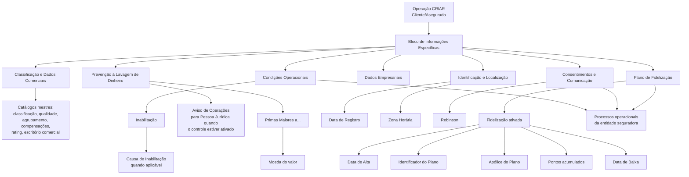

# Cadastro de Informações Específicas do Terceiro Asegurado/Cliente

## 1. Metadados do Documento
- **Arquivo de Origem:** Não identificado no conteúdo fornecido
- **Tipo de Documento:** Manual Operacional
- **Domínio / Sistema:** Cadastro de Terceiro — Cliente/Asegurado em sistema de entidade seguradora
- **Público-Alvo:** Operação, Cadastro, Negócio e Administração de Dados de entidades seguradoras
- **Data/Versão Identificada:** Não identificada

---

## 2. Resumo Executivo & Contexto de Negócio

O documento descreve o bloco de informações específicas utilizado na criação de um Terceiro como Cliente/Asegurado em um sistema de entidade seguradora. O cadastro possui dois propósitos explícitos: complementar os dados específicos do Terceiro na condição de Asegurado e classificar o Asegurado para que ele seja contemplado — ou não — nos processos da entidade seguradora.

A operação habilitada indicada é **CRIAR**, no contexto de “Dados Clientes/Asegurados”. Os atributos são apresentados na sequência de captura visual, da esquerda para a direita e de cima para baixo. Salvo indicação expressa em contrário, os atributos aplicam-se tanto a Pessoas Físicas quanto a Pessoas Jurídicas.

Os campos cobrem classificação comercial, retenções, formas de cobrança/pagamento, condições de inabilitação, prevenção à lavagem de dinheiro, porte empresarial, estrutura comercial, identificação de clientes, fuso horário, preferências de comunicação e fidelização. Parte dos valores deve ser selecionada a partir de catálogos mestres configurados no sistema.

O documento estabelece distinções operacionais importantes: a **Data de Registro** representa a data efetiva de entrega da documentação pelo Asegurado, não a data em que o registro foi capturado no sistema; a marca de **Inabilitação** exclui o Asegurado dos processos operacionais; e a marca **Robinson** controla a participação em processos que envolvem contato ou comunicação, de acordo com consentimentos concedidos.

O plano de fidelização possui comportamento condicional. Quando a marca de Fidelização é ativada, o sistema habilita campos para data de alta, identificador do plano e número da apólice. Na criação, o campo de pontos de fidelização permanece vazio ou contém zero pontos.

---

## 3. Arquitetura, Componentes & Tecnologias Envolvidas

O conteúdo não descreve uma arquitetura tecnológica detalhada, APIs, protocolos, bancos de dados, microsserviços, contratos HTTP, URLs, ambientes ou ferramentas de desenvolvimento. O documento apresenta uma arquitetura funcional de cadastro baseada em formulário, catálogos mestres configurados no sistema e regras que influenciam processos operacionais da entidade seguradora.

### Componentes funcionais identificados

| Componente / Conceito | Função descrita |
| :--- | :--- |
| Operação **CRIAR** | Permite criar informações específicas do Terceiro como Cliente/Asegurado. |
| Bloco de Informações | Agrupa os atributos específicos do Asegurado. |
| Sistema | Mantém catálogos mestres, configurações e dados cadastrais do Asegurado. |
| Catálogos mestres | Fornecem valores para classificação, qualidade, agrupamento comercial, compensações, moedas, rating, escritórios comerciais, causas de inabilitação e zonas horárias. |
| Entidade seguradora | Configura parâmetros locais, como tipos de retenção, e executa processos operacionais sobre Asegurados. |
| Processo de identificação de clientes | Pode exigir o registro da data real de entrega de documentação pelo Asegurado. |
| Controle de prevenção à lavagem de dinheiro | Pode estar ativo para Pessoas Jurídicas e influencia Aviso de Operações e Primas Maiores a.... |
| Plano de Fidelização | Permite associar o Asegurado a plano, pontos, datas, identificador e apólice. |
| Processos de contato/comunicação | Devem respeitar a indicação Robinson e os consentimentos do Asegurado. |



> **Nota de Análise:** O documento menciona o “Sistema”, catálogos mestres e configurações de companhia, mas não detalha componentes técnicos, interfaces de integração, modelo de dados físico, métodos HTTP, contratos JSON, rotas de logs ou ambientes.

---

## 4. Regras de Negócio, Especificações Funcionais & Processos

### 4.1 Ordem de captura dos atributos

Os atributos do bloco de informações específicas devem ser interpretados na sequência exibida na interface: **da esquerda para a direita e de cima para baixo**.

Caso não haja indicação expressa de aplicabilidade restrita, os atributos são utilizados tanto para **Pessoas Físicas** quanto para **Pessoas Jurídicas**.

### 4.2 Classificação e informações comerciais

1. **Classificação**
   - Classifica o Asegurado segundo a relação de valores existente no catálogo mestre do sistema.

2. **Qualidade do Asegurado**
   - Armazena a qualidade do Asegurado conforme o catálogo mestre de códigos de qualidade configurado no sistema.

3. **Agrupamento Comercial do Asegurado**
   - Armazena a agrupação comercial do Asegurado conforme o catálogo mestre de agrupamentos configurado no sistema.

4. **Tipo de Retenção**
   - Contém o código de um dos tipos de retenção configurados localmente pela entidade seguradora.

5. **Forma de Cobrança/Pagamento**
   - Indica o código da forma de cobrança/pagamento do Asegurado conforme as formas de compensação definidas no catálogo mestre de compensações.

6. **Dia Sugerido de Pagamento**
   - Na criação do Cliente, informa o dia sugerido pelo Cliente para que a entidade seguradora realize os débitos correspondentes ao pagamento dos prêmios dos seguros contratados.

7. **Oficina Comercial**
   - Contém o código do terceiro nível da estrutura comercial, segundo os valores existentes no catálogo mestre de escritórios comerciais.

### 4.3 Inabilitação do Asegurado

1. **Inabilitação**
   - Quando indicada, informa ao sistema que o Asegurado está inabilitado.
   - Um Asegurado inabilitado não deve ser empregado, contemplado ou considerado nos processos operacionais da entidade seguradora.

2. **Causa de Inabilitação**
   - Quando o Asegurado estiver inabilitado, armazena o código da causa de inabilitação.
   - A causa deve estar definida no catálogo mestre do sistema.

### 4.4 Observações e prevenção à lavagem de dinheiro

1. **Observações**
   - Permite registrar informações adicionais do Asegurado segundo orientações ou diretrizes da Direção de Clientes/Técnica da entidade seguradora.

2. **Aviso de Operações**
   - Aplica-se quando o Terceiro é uma Pessoa Jurídica e o controle de prevenção à lavagem de dinheiro está ativado.
   - Indica se um contato do Terceiro deverá receber aviso.
   - O contato avisado deve obrigatoriamente estar identificado como Terceiro de Referência.

3. **Primas Maiores a...**
   - Relaciona-se ao controle de prevenção à lavagem de dinheiro.
   - A entidade seguradora pode configurar esse controle nas companhias do sistema para limitar os valores dos prêmios dos Asegurados.

4. **Moeda**
   - Armazena o código da moeda na qual o valor de “Primas Maiores a...” foi expresso.
   - O código deve ser selecionado conforme o catálogo mestre de moedas configurado no sistema.

### 4.5 Informações empresariais e rating

1. **Número de Empregados**
   - Contém o número de empregados do Asegurado.

2. **Faturamento**
   - Contém o valor estimado do faturamento anual do Asegurado.

3. **Grupo Empresarial**
   - Contém o código do grupo empresarial ao qual o Asegurado pertence, conforme a relação de grupos empresariais identificados.

4. **Tipo de Rating**
   - Contém a qualificação atribuída ao Asegurado conforme o catálogo mestre de qualificações/rating configurado no sistema.

### 4.6 Processo de identificação e dados de localização

1. **Data de Registro**
   - Deve registrar a data real em que o Asegurado entregou a documentação solicitada pela entidade seguradora.
   - É aplicável às entidades nas quais a entrega documental faz parte do processo de identificação de clientes.
   - Não deve ser confundida com a data em que o Asegurado foi capturado/cadastrado no sistema.

2. **Zona Horária**
   - Contém o código da zona horária associada ao Asegurado.
   - O valor deve pertencer à relação de zonas horárias habilitadas no sistema.
   - O documento diferencia:
     - **Fuso horário:** faixa geográfica virtual orientada de norte a sul e limitada por meridianos igualmente espaçados.
     - **Zona horária:** região geográfica que compartilha uma mesma hora oficial; embora construída com base em fusos horários, pode não seguir exatamente sua delimitação geográfica.
   - Exemplos citados:
     - Espanha possui duas zonas horárias: Península Ibérica e Ilhas Canárias.
     - México possui quatro zonas horárias: Sudeste, Centro, Pacífico e Noroeste.

### 4.7 Fidelização, comunicação e tratamento preferencial

1. **Fidelização**
   - Permite indicar se o Asegurado possui plano de fidelização.
   - A marca é exibida desmarcada por padrão na operação de criação.
   - Ao marcar Fidelização, são habilitados os campos para informar:
     - Data de alta;
     - Identificador do plano;
     - Número da apólice.

2. **Asegurado V.I.P**
   - Permite identificar o Asegurado como Cliente Importante.

3. **Pontos do Plano de Fidelização**
   - Quando o Asegurado estiver incluído no plano de fidelização da entidade, apresenta o número de pontos acumulados.
   - Durante a operação de criação, o campo estará vazio ou conterá zero pontos.

4. **Data de Alta no Plano de Fidelização**
   - Quando o Asegurado estiver incluído no plano, registra sua data de adesão.

5. **Data de Baixa no Plano de Fidelização**
   - Quando o Asegurado tiver participado do plano, registra sua data de desligamento.

6. **Identificador no Plano de Fidelização**
   - Quando o Asegurado estiver incluído no plano, apresenta o número de associado, código ou chave identificadora do Asegurado no plano.

7. **Apólice do Plano de Fidelização**
   - Quando o Asegurado estiver incluído no plano, permite capturar — sem obrigatoriedade — o número de uma apólice vigente.
   - Nessa apólice, o Cliente/Asegurado deve corresponder à figura do Tomador.

8. **Robinson**
   - Indica se o Asegurado deve ser incluído ou excluído dos processos da entidade que impliquem contato ou comunicação.
   - A aplicação dessa indicação deve respeitar os consentimentos concedidos pelo Asegurado.

---

## 5. Tabelas de Parâmetros, Ambientes e Estruturas de Dados

| Item / Parâmetro | Descrição / Função | Tipo / Valores / Formato | Ambiente / Observações |
| :--- | :--- | :--- | :--- |
| Operação | Ação habilitada para o bloco de informações. | CRIAR | Contexto: Dados Clientes/Asegurados. |
| Classificação | Classifica o Asegurado. | Valor de catálogo mestre | Catálogo mestre existente no sistema. |
| Qualidade do Asegurado | Indica a qualidade do Asegurado. | Código de qualidade | Catálogo mestre de códigos de qualidade. |
| Agrupamento Comercial do Asegurado | Indica a agrupação comercial do Asegurado. | Valor de catálogo mestre | Catálogo mestre de agrupamentos. |
| Tipo de Retenção | Identifica um tipo de retenção aplicável ao Asegurado. | Código | Configurado localmente pela entidade seguradora. |
| Forma de Cobrança/Pagamento | Define a forma de cobrança ou pagamento do Asegurado. | Código de forma de compensação | Catálogo mestre de compensações. |
| Dia Sugerido de Pagamento | Dia sugerido pelo Cliente para débitos de prêmios. | Dia | Utilizado na criação do Cliente. |
| Inabilitação | Indica que o Asegurado não deve participar dos processos operacionais. | Marca / propriedade | A inabilitação impede emprego, consideração ou contemplação nos processos operacionais. |
| Causa de Inabilitação | Identifica a causa da inabilitação. | Código | Preenchida quando o Asegurado estiver inabilitado; origem em catálogo mestre. |
| Observações | Registra informação adicional do Asegurado. | Informação adicional | Conforme diretrizes da Direção de Clientes/Técnica. |
| Aviso de Operações | Indica se deve haver aviso para contato do Terceiro. | Indicação sim/não não detalhada | Aplicável a Pessoa Jurídica com prevenção à lavagem de dinheiro ativada; contato deve ser Terceiro de Referência. |
| Primas Maiores a... | Relaciona-se ao limite de valores de prêmios. | Valor não detalhado | Controle de prevenção à lavagem de dinheiro configurável nas companhias do sistema. |
| Moeda | Moeda usada para expressar “Primas Maiores a...”. | Código de moeda | Catálogo mestre de moedas. |
| Número de Empregados | Informa a quantidade de empregados do Asegurado. | Número | Sem formato adicional especificado. |
| Faturamento | Informa o faturamento anual estimado do Asegurado. | Importe / valor | Sem moeda ou formato explicitamente definido para o campo. |
| Grupo Empresarial | Identifica o grupo empresarial do Asegurado. | Código | Conforme relação de grupos empresariais identificados. |
| Tipo de Rating | Indica a qualificação/rating atribuído ao Asegurado. | Valor de catálogo mestre | Catálogo mestre de qualificações/rating. |
| Oficina Comercial | Identifica o terceiro nível da estrutura comercial. | Código | Catálogo mestre de escritórios comerciais. |
| Data de Registro | Data real de entrega de documentação pelo Asegurado. | Data | Não corresponde à data de captura do Asegurado no sistema. |
| Zona Horária | Define a zona horária associada ao Asegurado. | Código de zona horária | Relação de zonas horárias habilitadas no sistema. |
| Fidelização | Indica participação em plano de fidelização. | Marca | Desmarcada por padrão na criação; habilita campos condicionais quando marcada. |
| Robinson | Controla inclusão em processos de contato/comunicação. | Indicação sim/não não detalhada | Deve considerar os consentimentos do Asegurado. |
| Asegurado V.I.P | Identifica o Asegurado como Cliente Importante. | Marca | Sem condições adicionais especificadas. |
| Pontos do Plano de Fidelização | Exibe pontos acumulados pelo Asegurado no plano. | Número de pontos | Na criação: vazio ou zero pontos. |
| Data de Alta no Plano | Registra a entrada do Asegurado no plano. | Data | Aplicável quando o Asegurado estiver incluído no plano. |
| Data de Baixa no Plano | Registra a saída do Asegurado do plano. | Data | Aplicável quando o Asegurado tiver estado incluído no plano. |
| Identificador no Plano | Identifica o Asegurado no plano. | Número de associado, código ou chave | Aplicável quando o Asegurado estiver incluído no plano. |
| Apólice do Plano | Registra uma apólice vigente associada ao plano. | Número de apólice | Não obrigatória; Cliente/Asegurado deve ser o Tomador da apólice. |

> **Nota de Análise:** O documento não informa obrigatoriedade de preenchimento, tipos técnicos de dados, tamanhos, máscaras, validações de formato, valores permitidos ou nomenclaturas de campos de interface, exceto quando descreve regras condicionais específicas.

---

## 6. Bateria de Perguntas & Respostas para RAG (FAQ Sintético)

### P1: Qual é o objetivo do bloco de informações específicas do Terceiro Asegurado/Cliente?
**R:** O bloco possui dois objetivos: complementar a informação específica do Terceiro como Asegurado e classificar o Asegurado para incluí-lo ou não nos processos executados pela entidade seguradora.

### P2: Em qual ordem os atributos devem ser capturados no bloco de informações do Asegurado?
**R:** Os atributos seguem a sequência de captura visual da esquerda para a direita e de cima para baixo. Quando o documento não estabelece uma restrição expressa, os atributos devem ser utilizados tanto para Pessoas Físicas quanto para Pessoas Jurídicas.

### P3: O que acontece quando um Asegurado é marcado como inabilitado?
**R:** A marca de Inabilitação informa ao sistema que o Asegurado está inabilitado. Como consequência, o Asegurado não deve ser utilizado, contemplado ou considerado nos processos operacionais da entidade seguradora. Caso esteja inabilitado, a causa deve ser identificada por um código definido no catálogo mestre do sistema.

### P4: Qual é a diferença entre Data de Registro e data de captura do Asegurado no sistema?
**R:** A Data de Registro é a data real em que o Asegurado entrega a documentação solicitada pela entidade seguradora, quando essa entrega faz parte do processo de identificação de clientes. Ela não deve ser confundida com a data em que o Asegurado foi cadastrado ou capturado no sistema.

### P5: Quando o campo Aviso de Operações deve ser utilizado?
**R:** O campo Aviso de Operações é aplicável quando o Terceiro é uma Pessoa Jurídica e o controle de prevenção à lavagem de dinheiro está ativado. Ele indica se será necessário avisar um contato do Terceiro, que obrigatoriamente deve estar identificado como Terceiro de Referência.

### P6: Como o sistema trata o campo “Primas Maiores a...”?
**R:** O campo “Primas Maiores a...” está relacionado aos controles de prevenção à lavagem de dinheiro que a entidade seguradora pode configurar nas companhias do sistema para limitar os valores dos prêmios dos Asegurados. O valor informado deve possuir uma moeda associada, selecionada no catálogo mestre de moedas.

### P7: Quais campos são habilitados ao marcar Fidelização durante a criação do Asegurado?
**R:** Ao marcar Fidelização, o sistema habilita os campos para informar a data de alta, o identificador do plano e o número da apólice. A marca aparece desmarcada por padrão durante a operação de criação.

### P8: Qual valor o campo Pontos do Plano de Fidelização possui na criação do Asegurado?
**R:** Na operação de criação, o campo Pontos do Plano de Fidelização estará vazio ou conterá zero pontos. Quando o Asegurado estiver incluído no plano, o campo apresenta o número de pontos acumulados.

### P9: A apólice vinculada ao Plano de Fidelização é obrigatória?
**R:** Não. A captura do número da apólice do Plano de Fidelização não é obrigatória. Quando fornecida, deve corresponder a uma apólice em vigor na qual o Cliente/Asegurado figure como Tomador.

### P10: Para que serve o campo Robinson?
**R:** O campo Robinson indica se o Asegurado deve ser incluído ou não nos processos da entidade seguradora que envolvam qualquer tipo de contato ou comunicação. Essa decisão deve considerar os consentimentos concedidos pelo Asegurado.

### P11: De onde vêm os valores para Classificação, Qualidade, Agrupamento Comercial e Tipo de Rating?
**R:** Classificação, Qualidade do Asegurado, Agrupamento Comercial e Tipo de Rating dependem de relações de valores definidas em catálogos mestres configurados no sistema. Cada campo utiliza seu catálogo correspondente, como classificação, códigos de qualidade, agrupamentos ou qualificações/rating.

### P12: O que representa o campo Oficina Comercial?
**R:** Oficina Comercial contém o código do terceiro nível da estrutura comercial, obtido conforme a relação de valores existente no catálogo mestre de escritórios comerciais configurado no sistema.

---

## 7. Glossário de Termos, Siglas & Conceitos-Chave

- **Asegurado:** Pessoa registrada como segurado no contexto da entidade seguradora.
- **Cliente/Asegurado:** Cliente que possui a condição de Asegurado no sistema.
- **Catálogo Mestre:** Relação centralizada de valores configurados no sistema e utilizada para seleção de códigos ou classificações.
- **Compensações:** Formas de compensação usadas como referência para o código de Forma de Cobrança/Pagamento.
- **CRIAR:** Operação habilitada para criação de dados do Cliente/Asegurado.
- **Direção de Clientes/Técnica:** Área mencionada como possível origem de diretrizes para o registro de observações do Asegurado.
- **Entidade Seguradora:** Organização que administra seguros, processos operacionais, catálogos e configurações mencionadas no documento.
- **Fidelização:** Condição que indica participação do Asegurado em um plano de fidelização da entidade.
- **Fuso Horário:** Faixa geográfica virtual, orientada de norte a sul e delimitada por meridianos igualmente espaçados, onde geralmente vigora uma mesma hora oficial.
- **Grupo Empresarial:** Grupo de empresas ao qual o Asegurado pode pertencer.
- **Inabilitação:** Propriedade que impede que o Asegurado seja utilizado, contemplado ou considerado em processos operacionais.
- **Pessoa Física:** Categoria de Terceiro não detalhada adicionalmente no documento.
- **Pessoa Jurídica:** Categoria de Terceiro para a qual a regra de Aviso de Operações pode ser aplicável quando houver controle de prevenção à lavagem de dinheiro ativado.
- **Plano de Fidelização:** Plano da entidade seguradora que pode registrar pontos, datas, identificador e apólice associados ao Asegurado.
- **Prêmio:** Valor relacionado aos seguros contratados pelo Asegurado; o documento também menciona limites de importes de prêmios no contexto de prevenção à lavagem de dinheiro.
- **Rating:** Qualificação atribuída ao Asegurado, selecionada conforme catálogo mestre de qualificações/rating.
- **Robinson:** Indicação de inclusão ou exclusão do Asegurado em processos que envolvem contato ou comunicação, conforme consentimentos.
- **Terceiro:** Entidade cadastrada no sistema que pode assumir a condição de Cliente/Asegurado ou Terceiro de Referência.
- **Terceiro de Referência:** Identificação obrigatória para o contato que deve receber Aviso de Operações.
- **Tomador:** Figura que o Cliente/Asegurado deve representar em uma apólice vigente vinculada ao Plano de Fidelização.
- **V.I.P:** Marca usada para identificar o Asegurado como Cliente Importante.
- **Zona Horária:** Região geográfica que compartilha uma mesma hora oficial e que pode não coincidir estritamente com as divisões geográficas dos fusos horários.

---

## 8. Notas Críticas, Riscos & Limitações

- O conteúdo não especifica nome do sistema, versão, data, proprietário do documento ou arquivo de origem.
- Não há descrição de arquitetura técnica, integrações, APIs, métodos HTTP, contratos JSON, banco de dados, autenticação, logs, URLs ou ambientes.
- O documento menciona catálogos mestres, mas não apresenta os valores, estruturas, proprietários, ciclos de manutenção ou regras de governança desses catálogos.
- A maioria dos campos não possui indicação explícita de obrigatoriedade, formato técnico, tipo de dado, tamanho, máscara, valores padrão ou regras de validação.
- A marca de Inabilitação possui impacto operacional crítico, pois exclui o Asegurado dos processos operacionais da entidade seguradora.
- A marca Robinson possui impacto em processos de comunicação e deve respeitar os consentimentos fornecidos pelo Asegurado.
- Aviso de Operações e Primas Maiores a... estão associados a prevenção à lavagem de dinheiro; o documento não detalha critérios, limites, responsáveis, fluxos de aprovação ou efeitos posteriores à captura.
- O documento descreve a ativação dos campos de Fidelização, mas não define se a consistência entre datas, pontos, identificador e apólice é validada automaticamente pelo sistema.
- A apólice de fidelização deve estar em vigor e ter o Cliente/Asegurado como Tomador, mas o documento não detalha como essa condição é verificada.

---

## 9. Conteúdo Bruto Estruturado (Referência Fiel)

```text
--- [PÁGINA 1 DE 5] ---

CREAR Información específica del Tercero
Asegurado/Cliente
Objetivo
El registro de los Datos en este Bloque de Información obedece al doble propósito:
Complementar la información específica del Tercero como Asegurado.
Clasificar al Asegurado para contemplarlo o no en los procesos de la entidad Aseguradora.
Acciones habilitadas
 CREAR ( )
Datos Clientes/Asegurados
 / 
 RS
Inicio Soluciones APIs Documentación Zeus
ES


--- [PÁGINA 2 DE 5] ---

De Izquierda a Derecha y de Arriba hacia Abajo, los siguientes atributos marcan la secuencia de
captura de los Campos en este Bloque de Información.
(Si no se especifica o indica expresamente, los Atributos se emplearán tanto en Personas Físicas
como en Personas Jurídicas).
Clasificación (  )
Este Campo contendrá la clasificación del Asegurado de acuerdo con la relación de valores
existentes en el catálogo maestro existente en el Sistema.
Calidad del Asegurado (  )
Este Campo contendrá la calidad del Asegurado de acuerdo con la relación de valores existentes en
el catálogo maestro de códigos de calidad configurado en el Sistema.
Agrupamiento Comercial del Asegurado (  )
Este Campo contendrá la Agrupación Comercial del Asegurado de acuerdo con la relación de valores
definidos en el catálogo maestro de agrupaciones configurado en el Sistema.
Tipo de Retención (  )
Este Dato contiene el código de uno de los Tipos de Retención configurados localmente por la
Entidad Aseguradora.
Forma de Cobro/Pago (  )
Este Dato indicará el Código de la Forma de Cobro/Pago del Asegurado de acuerdo con las posibles
Formas de Compensación definidas en el catálogo maestro de compensaciones.
Día Sugerido de Pago ( )
Este Campo en la Creación del Cliente indica el día que éste sugiere para que la entidad
aseguradora realice los cargos correspondientes para realizar el pago de las primas de los Seguros
que tenga contratados.
Inhabilitación ( )
Esta propiedad le indica al Sistema que el Asegurado está inhabilitado en el Sistema por lo que no
debería ser empleado, contemplado o considerado en los procesos operativos de la entidad.
Causa de Inhabilitación (  )
En el supuesto que el Asegurado estuviera Inhabilitado, este Atributo contendrá el código de una
causa de inhabilitación definida en el catálogo maestro del Sistema.


--- [PÁGINA 3 DE 5] ---

Observaciones ( )
El propósito de este campo permite capturar información adicional del Asegurado de acuerdo con los
Planteamientos o directrices que pudieran efectuar la Dirección de Clientes/Técnica de la entidad
aseguradora.
Aviso de Operaciones (  )
En en el caso que el Tercero sea una Persona Jurídica y el control en la prevención del lavado de
dinero esté activado, este campo indica si se va o no a tener que avisar a algún contacto del
Tercero que tendrá obligatoriamente que estar identificado como Tercero de Referencia.
Primas Mayores a ...
Esta Dato en la Creación del Asegurado está relacionado con el control en la prevención del lavado
de dinero que la Entidad Aseguradora puede establecer en la configuración de las Compañías en el
Sistema, para limitar los importes de las Primas de los Asegurados.
Moneda
Este Campo contendrá el código de la Moneda en la que se ha expresado el valor del campo Primas
Mayores a... del Asegurado de acuerdo con la relación de valores existentes en el catálogo maestro
de Monedas configurado en el Sistema.
Número de Empleados ( )
Este Contiene el número de empleados del Asegurado.
Facturación ( )
Este Atributo contendrá el importe de la Facturación Anual estimada del Asegurado.
Grupo Empresarial (  )
Este Campo contendrá el código del Grupo Empresarial al que pertenece el Asegurado de acuerdo a
la posible relación de grupos empresariales identificados.
Tipo de Rating (  )
Este Campo contendrá la Calificación asignada al Asegurado de acuerdo con la relación de valores
existentes en el catálogo maestro de calificaciones/rating configurado en el Sistema.
Oficina Comercial (  )
Este Dato contiene el código del Tercer Nivel de la Estructura Comercial de acuerdo con la relación
de valores existentes en el catálogo maestro de oficinas comerciales configurado en el Sistema.


--- [PÁGINA 4 DE 5] ---

Fecha Registro ( )
Este Dato se debe utilizar para registrar la fecha real en la que el Asegurado entrega la
documentación solicitada por la entidad aseguradora en aquellas entidades que tienen esta tarea
como parte del Proceso de Identificación de sus Clientes.
No confundir con la Fecha en la que se captura el Asegurado en el Sistema.
Zona Horaria (  )
Un huso horario es cada una de las franjas geográficas virtuales, orientadas de norte a sur,
limitadas por meridianos igualmente espaciados, en las que se divide un planeta y en las que suele
regir una misma hora oficial.
Una zona horaria en cambio, es una región geográfica que comparte una misma hora oficial. Las
zonas horarias se han construido a partir de los husos horarios aunque no siguen fielmente sus
trazos, pues cada país ajusta su hora oficial libremente y con frecuencia no coinciden estrictamente
con la convención geográfica.
Este Campo contendrá el código de la Zona Horaria asociada del Asegurado de acuerdo a la posible
relación de zonas horarias habilitadas en el Sistema.
Por ejemplo,
España tiene dos zonas horarias para distinguir la zona horaria de la Península Ibérica de la
zona horaria de las Islas Canarias.
México tiene cuatro zonas horarias diferentes para distinguir la Zona Sureste, la Zona Centro, la
Zona del Pacífico y la Zona Noroeste.
Fidelización ( )
Este Campo permite contemplar o no en los procesos de la entidad si el Asegurado cuenta con un
Plan de Fidelización.
Al hacer click sobre la marca (en esta operación se muestra desmarcada por Defecto) se habilitan los
campos correspondientes para poder ingresar la fecha de alta, el identificador del Plan y el número
de la póliza.
Robinson ( )
Este Dato permite conocer si el Asegurado se debe incluir o no en los procesos de la entidad que
impliquen cualquier tipo de contacto/comunicación con él (de acuerdo con los consentimientos
otorgados por el Asegurado).
Consejo:


--- [PÁGINA 5 DE 5] ---

Asegurado V.I.P ( )
Esta marca permite identificar al Asegurado como un Cliente Importante.
Puntos Plan de Fidelización
En el supuesto que el Asegurado esté incluido en el Plan de Fidelización de la Entidad, este campo
muestra el número de puntos acumulados que tiene el Asegurado (en la Operación de Creación este
dato estará vacío o contendrá 0 puntos)
Fecha de ALTA en el Plan de Fidelización ( )
En el supuesto que el Asegurado esté incluido en el Plan de Fidelización de la Entidad, este dato
contiene la Fecha de Alta en el mismo.
Fecha de BAJA en el Plan de Fidelización ( )
En el supuesto que el Asegurado estuviera incluido en el Plan de Fidelización de la Entidad, este
dato contendría la Fecha de Baja del Asegurado en el Plan de Fidelización.
Identificador en el Plan de Fidelización ( )
En el supuesto que el Asegurado esté incluido en el Plan de Fidelización de la Entidad, este dato
muestra el Número de Socio, código o clave identificadora del Asegurado en el Plan.
Póliza del Plan de Fidelización (  )
Por último y en el supuesto que el Asegurado esté incluido en el Plan de Fidelización de la Entidad,
este Dato permitirá capturar (no es una acción obligatoria) el número de una de las pólizas en vigor
en las que el la figura del Cliente/Asegurado se corresponde con El Tomador de la misma.
```
