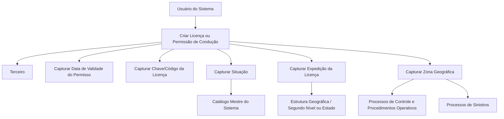

# Criação de Licença do Terceiro — Especificação Funcional de Dados de Licença de Condução

## 1. Metadados do Documento
- **Arquivo de Origem:** Não identificado no conteúdo fornecido
- **Tipo de Documento:** Especificação Técnica / Procedimento Funcional
- **Domínio / Sistema:** Cadastro de Terceiros, Licenças de Condução e processos de Sinistros
- **Público-Alvo:** Desenvolvedores, Analistas Funcionais, Operação e Negócio
- **Data/Versão Identificada:** Não identificada

---

## 2. Resumo Executivo & Contexto de Negócio

O documento descreve a funcionalidade de criação de uma licença ou permissão de condução vinculada a um Terceiro. O objetivo declarado é identificar e registrar informações específicas da licença ou permissão para permitir seu uso nos processos de controle e nos procedimentos operativos da entidade.

A ação funcional explicitamente habilitada é **CRIAR Licencia**. O fluxo de captura de dados deve seguir a sequência apresentada no documento, da esquerda para a direita e de cima para baixo na interface do sistema.

A licença de condução concentra atributos relacionados à validade, identificação, situação, local de expedição e abrangência geográfica de uso. Esses atributos permitem que a entidade identifique a licença do Terceiro, determine seu estado conforme um catálogo mestre e aplique controles nos processos de Sinistros.

O documento informa que a Zona Geográfica da licença do Asegurado habilita controles nos processos de Sinistros da entidade. Não são detalhados métodos HTTP, contratos JSON, regras de persistência, permissões de usuário, integrações externas ou mensagens de validação.

---

## 3. Arquitetura, Componentes & Tecnologias Envolvidas

Os componentes funcionais identificados são:

- **Terceiro:** entidade para a qual são registradas informações de licença ou permissão de condução.
- **Licença ou Permissão de Condução:** registro criado no sistema para identificar informações específicas da habilitação do Terceiro.
- **Catálogo Mestre do Sistema:** fonte dos valores possíveis para o atributo Situação.
- **Estrutura Geográfica:** estrutura utilizada para registrar o segundo nível geográfico ou estado de expedição da licença.
- **Zona Geográfica:** atributo que define o âmbito geográfico de aplicação ou uso da licença de condução.
- **Processos de Controle e Procedimentos Operativos:** processos consumidores das informações registradas na licença.
- **Processos de Sinistros:** processos que utilizam a Zona Geográfica da licença do Asegurado para controles.



> **Nota de Análise:** O documento não especifica arquitetura de software, tecnologias de implementação, banco de dados, APIs, ambientes ou interfaces de integração.

---

## 4. Regras de Negócio, Especificações Funcionais & Processos

### Objetivo funcional

A criação da licença ou permissão de condução tem como propósito identificar informações específicas da licença ou permissão do Terceiro. As informações registradas devem poder ser usadas em processos de controle e em procedimentos operativos da entidade.

### Ação habilitada

A ação habilitada no conteúdo fornecido é:

- **CRIAR Licencia**

Não há descrição de ações de consulta, alteração, exclusão, aprovação, cancelamento ou inativação da licença.

### Sequência de captura dos atributos

O documento determina que os atributos devem seguir a sequência de captura apresentada na interface:

1. A sequência deve ser lida **da esquerda para a direita**.
2. A sequência deve ser lida **de cima para baixo**.
3. A ordem apresentada contém os seguintes atributos:
   1. Fecha de Validez del Permiso.
   2. Clave/Código de la Licencia.
   3. Situación.
   4. Expedición de la Licencia.
   5. Zona Geográfica.

### Regras associadas aos atributos

1. **Fecha de Validez del Permiso**
   - Indica a data de validade da licença ou da permissão de condução do Terceiro.
   - O documento não informa formato de data, obrigatoriedade, validação de datas passadas ou regras de renovação.

2. **Clave/Código de la Licencia**
   - Identifica a chave ou o código da licença de condução.
   - O documento não informa tamanho, máscara, unicidade, algoritmo de validação ou entidade emissora do código.

3. **Situación**
   - Indica o estado da licença do Terceiro.
   - Os valores possíveis devem estar configurados no catálogo mestre do sistema.
   - O documento não enumera os valores disponíveis no catálogo mestre.

4. **Expedición de la Licencia**
   - Contém o segundo nível da estrutura geográfica, ou estado, em que a licença foi expedida.
   - O documento não identifica países, regiões, códigos geográficos ou regras de dependência entre local de expedição e Zona Geográfica.

5. **Zona Geográfica**
   - Contém o âmbito geográfico de aplicação ou de uso da licença de condução do Asegurado.
   - Esse atributo habilita controles nos processos de Sinistros da entidade.
   - O documento não detalha quais controles de Sinistros são aplicados nem quais valores de Zona Geográfica existem.

---

## 5. Tabelas de Parâmetros, Ambientes e Estruturas de Dados

| Item / Parâmetro | Descrição / Função | Tipo / Valores / Formato | Ambiente / Observações |
| :--- | :--- | :--- | :--- |
| Ação habilitada | Permite criar uma licença ou permissão de condução. | `CRIAR Licencia` | Não são informadas outras ações. |
| Terceiro | Entidade associada à licença ou permissão de condução. | Entidade de negócio | Utilizada nos processos de controle e procedimentos operativos. |
| Fecha de Validez del Permiso | Indica a data de validade da licença ou permissão de condução do Terceiro. | Data; formato não informado | Obrigatoriedade e regras de validação não detalhadas. |
| Clave/Código de la Licencia | Identifica a chave ou o código da licença de condução. | Código; formato não informado | Não há definição de unicidade, tamanho ou máscara. |
| Situación | Indica o estado da licença do Terceiro. | Valores configurados no catálogo mestre do sistema | Valores possíveis não foram listados. |
| Catálogo Mestre do Sistema | Fonte configurável dos valores possíveis para Situação. | Catálogo | Estrutura interna e manutenção não detalhadas. |
| Expedición de la Licencia | Informa o segundo nível da estrutura geográfica ou estado de expedição da licença. | Referência geográfica | País, códigos e níveis geográficos não detalhados. |
| Zona Geográfica | Define o âmbito geográfico de aplicação ou uso da licença de condução do Asegurado. | Atributo geográfico; valores não informados | Habilita controles nos processos de Sinistros. |
| Processos de Controle | Processos que utilizam os dados da licença ou permissão do Terceiro. | Processo corporativo | Regras específicas não detalhadas. |
| Procedimentos Operativos | Procedimentos que utilizam os dados da licença ou permissão do Terceiro. | Processo corporativo | Procedimentos específicos não detalhados. |
| Processos de Sinistros | Processos que utilizam a Zona Geográfica para controles. | Processo corporativo | Critérios e resultados dos controles não detalhados. |

---

## 6. Bateria de Perguntas & Respostas para RAG (FAQ Sintético)

### P1: Qual é o objetivo da criação de uma licença do Terceiro?
**R:** A criação da licença ou permissão de condução tem o propósito de identificar informações específicas da licença ou permissão do Terceiro. Essas informações podem ser usadas nos processos de controle e nos procedimentos operativos da entidade.

### P2: Qual ação está habilitada no documento para o cadastro de licença?
**R:** A ação explicitamente habilitada é **CRIAR Licencia**. O conteúdo fornecido não descreve ações para consultar, alterar, excluir ou cancelar uma licença.

### P3: Qual atributo registra a validade da licença ou permissão de condução?
**R:** O atributo **Fecha de Validez del Permiso** indica a data de validade da licença ou permissão de condução do Terceiro. O documento não informa o formato da data nem regras de validação.

### P4: Para que serve o campo Clave/Código de la Licencia?
**R:** O campo **Clave/Código de la Licencia** identifica a chave ou o código da licença de condução. O documento não especifica padrão, comprimento, máscara ou regra de unicidade para esse código.

### P5: Como é definido o estado da licença do Terceiro?
**R:** O atributo **Situación** indica o estado da licença do Terceiro conforme os possíveis valores configurados no catálogo mestre do sistema. O documento não lista quais estados estão disponíveis nesse catálogo.

### P6: O que representa o atributo Expedición de la Licencia?
**R:** **Expedición de la Licencia** contém o segundo nível da estrutura geográfica, ou estado, no qual a licença foi expedida. Não há detalhamento sobre códigos, países ou níveis geográficos adicionais.

### P7: Qual é a finalidade da Zona Geográfica da licença?
**R:** A **Zona Geográfica** contém o âmbito geográfico de aplicação ou de uso da licença de condução do Asegurado. Esse atributo habilita seu controle nos processos de Sinistros da entidade.

### P8: Em que ordem os atributos da licença devem ser capturados no sistema?
**R:** A sequência de captura deve seguir a ordem apresentada na interface, da esquerda para a direita e de cima para baixo: Fecha de Validez del Permiso, Clave/Código de la Licencia, Situación, Expedición de la Licencia e Zona Geográfica.

### P9: Quais processos corporativos utilizam as informações da licença ou permissão?
**R:** O documento afirma que as informações específicas da licença ou permissão de condução do Terceiro serão utilizadas em processos de controle e procedimentos operativos da entidade. A Zona Geográfica também habilita controles nos processos de Sinistros.

### P10: Quais valores podem ser selecionados no atributo Situación?
**R:** Os valores possíveis para **Situación** são configurados no catálogo mestre do sistema. O documento não fornece a lista desses valores, portanto não é possível determinar quais estados de licença são permitidos.

---

## 7. Glossário de Termos, Siglas & Conceitos-Chave

- **Terceiro:** entidade cujo registro de licença ou permissão de condução é criado no sistema.
- **Licença ou Permissão de Condução:** informação associada ao Terceiro para identificar dados de sua habilitação para conduzir.
- **Fecha de Validez del Permiso:** data de validade da licença ou permissão de condução do Terceiro.
- **Clave/Código de la Licencia:** chave ou código identificador da licença de condução.
- **Situación:** atributo que representa o estado da licença do Terceiro.
- **Catálogo Mestre do Sistema:** repositório configurado que define os valores possíveis para o atributo Situación.
- **Expedición de la Licencia:** segundo nível da estrutura geográfica, ou estado, no qual a licença foi expedida.
- **Zona Geográfica:** âmbito geográfico de aplicação ou uso da licença de condução do Asegurado.
- **Asegurado:** termo utilizado pelo documento para identificar o titular cuja licença de condução possui Zona Geográfica aplicável aos processos de Sinistros.
- **Sinistros:** processos da entidade que utilizam a Zona Geográfica da licença para realizar controles.

---

## 8. Notas Críticas, Riscos & Limitações

- O conteúdo fornecido não identifica o nome do sistema, arquivo de origem, versão, data, autor ou responsável pelo documento.
- O documento não especifica requisitos de obrigatoriedade, formato, tamanho ou regras de validação dos atributos capturados.
- Os valores do atributo **Situación** dependem de um catálogo mestre, mas o catálogo e seus valores não foram apresentados.
- A estrutura geográfica usada em **Expedición de la Licencia** e **Zona Geográfica** não foi detalhada.
- O documento menciona controles nos processos de Sinistros, mas não define regras, condições, resultados ou exceções desses controles.
- Não há detalhes sobre integrações, APIs, contratos de dados, persistência, perfis de acesso, trilhas de auditoria ou tratamento de erros.
- **Nota de Análise:** O conteúdo descreve atributos funcionais de licença, mas não detalha mecanismos técnicos de implementação ou comportamento de interface além da sequência visual de captura.

---

## 9. Conteúdo Bruto Estruturado (Referência Fiel)

```text
--- [PÁGINA 1 DE 2] ---

CREAR Licencia del Tercero
Objetivo
Su propósito es la identificación de la información específica de la licencia o permiso de conducción
del Tercero lo que permitirá su uso en los procesos de control y procedimientos operativos de la
entidad.
Acciones habilitadas
 CREAR ( )
Licencia.
De Izquierda a Derecha y de Arriba hacia Abajo, los siguientes atributos marcan la secuencia de
captura de la Información en el sistema.
Fecha de Validez del Permiso ( )
Esta propiedad indicará la Fecha de Validez de la Licencia o Permiso de Conducción del Tercero.
Clave/Código de la Licencia ( )
 / 
 RS
Inicio Soluciones APIs Documentación Zeus
ES


--- [PÁGINA 2 DE 2] ---

Este Dato identifica la clave o el código de la Licencia de Conducir.
Situación (  )
Este Atributo indica el estado de la licencia del Tercero de acuerdo con los posibles valores
configurados en el catálogo maestro del Sistema.
Expedición de la Licencia (  )
Este Dato contiene el segundo nivel de la estructura geográfica ó estado, en el que la licencia ha sido
expedida.
Zona Geográfica (  )
Por último, este atributo contiene el ámbito geográfico de aplicación o uso de la Licencia de conducir
del Asegurado, atributo que habilita su control en los procesos de Siniestros de la entidad.
```
