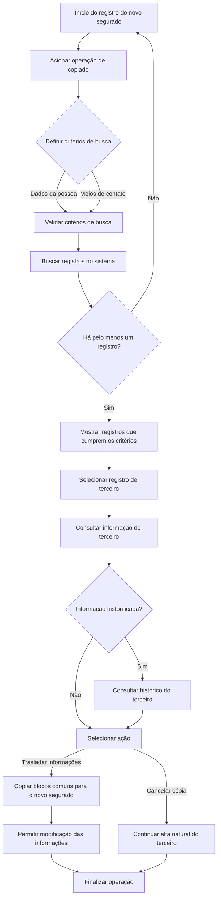

# Operação Criar Segurado a Partir das Informações de Outro Terceiro

## 1. Metadados do Documento
- **Arquivo de Origem:** `Não identificado no conteúdo fornecido`
- **Tipo de Documento:** `Especificação Funcional / Procedimento`
- **Domínio / Sistema:** `Registro de Terceiros e Segurados`
- **Público-Alvo:** `Operação, Negócio, Analistas Funcionais e Desenvolvedores`
- **Data/Versão Identificada:** `Não identificada`

---

## 2. Resumo Executivo & Contexto de Negócio

O documento descreve a operação de criação de um novo segurado a partir das informações de outro terceiro previamente cadastrado no sistema. O novo segurado pode ser uma pessoa física ou uma pessoa jurídica.

A origem das informações não está limitada a terceiros que já possuam a atividade “1 - Asegurado”. O terceiro de origem pode ter qualquer atividade associada, desde que existam blocos de informação comuns entre a atividade de origem e a atividade do novo segurado.

O processo de cópia é iniciado durante o registro do novo segurado mediante acionamento de um botão de operação de copiado. A operação permite pesquisar terceiros por dados de pessoa ou por meios de contato, selecionar um registro encontrado e consultar ou trasladar informações para o novo segurado.

O fluxo prevê alternativas operacionais após localizar um terceiro: consultar as informações atuais, consultar o histórico quando houver informação historificada, trasladar dados com possibilidade de alteração e cancelar a operação de cópia para continuar o cadastro natural do terceiro.

Uma restrição funcional explícita impede a transferência de informações para o bloco de meios de cobrança e pagamento a partir do terceiro de origem. O documento não detalha telas, contratos de API, estruturas de dados, regras de compatibilidade entre blocos nem mecanismos de validação além da aceitação e validação dos critérios de busca.

---

## 3. Arquitetura, Componentes & Tecnologias Envolvidas

Os componentes funcionais identificados são:

- Processo de registro de um novo segurado.
- Operação de copiado de informações.
- Critérios de busca por pessoa.
- Critérios de busca por meios de contato.
- Resultado de registros que atendem aos critérios.
- Seleção de um terceiro.
- Consulta da informação do terceiro.
- Consulta do histórico de informação do terceiro, quando historificada.
- Transferência de informações do terceiro para o novo segurado.
- Bloco de meios de cobrança e pagamento, explicitamente excluído da transferência.



> **Nota de Análise:** O documento não identifica tecnologias, microsserviços, bancos de dados, URLs, ambientes, APIs, métodos HTTP ou contratos JSON.

---

## 4. Regras de Negócio, Especificações Funcionais & Processos

1. A operação permite capturar informações de um novo segurado utilizando como base outro terceiro previamente registrado no sistema.
2. O novo segurado pode ser uma pessoa física ou uma pessoa jurídica.
3. O terceiro de origem pode possuir qualquer atividade associada.
4. A origem das informações não deve se limitar a terceiros associados à atividade “1 - Asegurado”.
5. Somente os dados presentes em blocos de informação comuns entre as atividades do terceiro de origem e do novo segurado podem ser trasladados.
6. Nenhuma informação pode ser trasladada para o bloco de meios de cobrança e pagamento a partir do terceiro de origem.
7. A operação de copiado pode ser iniciada em qualquer momento do processo de registro da informação do novo segurado.
8. O processo de busca aceita critérios capturados por dados da pessoa ou por dados de meios de contato.
9. Os critérios de busca devem ser aceitos e validados antes da apresentação dos resultados.
10. A seleção de um terceiro depende da existência de pelo menos um registro no sistema que atenda aos critérios de busca.
11. Após selecionar um terceiro, o operador pode consultar as informações do terceiro.
12. Quando a informação do terceiro estiver historificada, o operador pode consultar o histórico de informações.
13. O operador pode trasladar dados do terceiro para o novo segurado e modificar as informações trasladadas.
14. O operador pode cancelar a operação de copiado e continuar a alta do terceiro de forma natural.

---

## 5. Tabelas de Parâmetros, Ambientes e Estruturas de Dados

| Item / Parâmetro | Descrição / Função | Tipo / Valores / Formato | Ambiente / Observações |
| :--- | :--- | :--- | :--- |
| Novo Segurado | Entidade cuja informação será registrada a partir de outro terceiro. | Pessoa física ou pessoa jurídica. | O documento não detalha campos obrigatórios. |
| Terceiro de Origem | Registro previamente existente utilizado como fonte de dados. | Terceiro com qualquer atividade associada. | Não precisa possuir a atividade “1 - Asegurado”. |
| Atividade “1 - Asegurado” | Atividade mencionada como não exclusiva para a origem da cópia. | Atividade de terceiro. | A busca e cópia podem usar terceiros com outras atividades. |
| Blocos de informação comuns | Dados passíveis de transferência entre o terceiro de origem e o novo segurado. | Não detalhado. | A transferência está condicionada à existência de blocos comuns. |
| Meios de cobrança e pagamento | Bloco de informação excluído da transferência. | Não detalhado. | Nunca recebe informações copiadas do terceiro de origem. |
| Critérios de busca por pessoa | Critérios usados para localizar terceiros no sistema. | Dados de pessoa; campos não detalhados. | Devem ser aceitos e validados. |
| Critérios de busca por meios de contato | Critérios alternativos para localizar terceiros. | Dados de meios de contato; campos não detalhados. | Devem ser aceitos e validados. |
| Registros encontrados | Resultado da busca de terceiros. | Um ou mais registros que atendam aos critérios. | A seleção exige a existência de pelo menos um resultado. |
| Histórico do terceiro | Informação histórica disponível para consulta. | Informação historificada, quando existente. | O documento não define retenção, versões ou critérios de historificação. |
| Modificação pós-cópia | Alteração das informações trasladadas ao novo segurado. | Permitida. | Não são detalhadas regras de validação posteriores. |
| Cancelamento da cópia | Interrupção da operação de traslado. | Ação operacional. | Permite continuar a alta do terceiro de maneira natural. |

---

## 6. Bateria de Perguntas & Respostas para RAG (FAQ Sintético)

### P1: Qual é o objetivo da operação de criar segurado a partir de outro terceiro?
**R:** A operação permite registrar as informações de um novo segurado, pessoa física ou jurídica, usando como origem as informações de outro terceiro previamente cadastrado no sistema.

### P2: O terceiro de origem precisa possuir a atividade “1 - Asegurado”?
**R:** Não. O documento determina que a informação do novo segurado pode proceder de um terceiro com qualquer atividade associada; a origem não está limitada a terceiros com a atividade “1 - Asegurado”.

### P3: Quais informações podem ser copiadas para o novo segurado?
**R:** Podem ser trasladados dados dos blocos de informação que sejam comuns tanto à atividade do terceiro de origem quanto à atividade do novo segurado. O documento não especifica quais blocos ou campos compõem essa interseção.

### P4: As informações de meios de cobrança e pagamento podem ser copiadas do terceiro de origem?
**R:** Não. O documento estabelece que nunca será trasladada informação ao bloco de meios de cobrança e pagamento a partir do terceiro de origem.

### P5: Em que momento a operação de copiado pode ser iniciada?
**R:** A operação de copiado pode ser iniciada em qualquer momento do processo de registro das informações do novo segurado, mediante acionamento do botão correspondente.

### P6: Quais critérios podem ser utilizados para pesquisar o terceiro de origem?
**R:** A pesquisa pode utilizar indistintamente dados da pessoa ou dados de meios de contato. Os critérios capturados devem ser aceitos e validados antes da consulta ao sistema.

### P7: O que acontece quando a busca retorna pelo menos um registro?
**R:** O sistema permite apresentar os registros que atendem aos critérios, selecionar um terceiro e então consultar suas informações, consultar seu histórico quando houver informação historificada ou trasladar informações para o novo segurado.

### P8: É possível consultar o histórico das informações do terceiro?
**R:** Sim. Caso as informações do terceiro estejam historificadas, a operação permite consultar o histórico dessas informações.

### P9: As informações copiadas podem ser alteradas antes de concluir o cadastro?
**R:** Sim. O documento informa que os dados trasladados do terceiro podem ser modificados no novo segurado.

### P10: O que ocorre se o operador cancelar a operação de cópia?
**R:** O operador pode cancelar a operação de copiado e continuar a alta do terceiro de maneira natural, sem utilizar o traslado de informações do terceiro de origem.

---

## 7. Glossário de Termos, Siglas & Conceitos-Chave

- **Asegurado / Segurado:** Novo registro que será criado no sistema; pode corresponder a uma pessoa física ou jurídica.
- **Terceiro:** Registro previamente existente no sistema que pode fornecer informações para o novo segurado.
- **Alta do Terceiro:** Processo de criação ou registro natural de um terceiro no sistema.
- **Operação de Copiado:** Processo de pesquisar, selecionar e trasladar informações de um terceiro de origem para um novo segurado.
- **Meios de Contato:** Dados utilizados como critério de busca de terceiros; o documento não define quais meios são suportados.
- **Meios de Cobrança e Pagamento:** Bloco de informação que não pode receber dados trasladados do terceiro de origem.
- **Informação Historificada:** Informação do terceiro que possui histórico disponível para consulta.
- **Blocos de Informação Comuns:** Conjunto de dados compartilhados entre a atividade do terceiro de origem e a atividade do novo segurado, elegíveis para traslado.

---

## 8. Notas Críticas, Riscos & Limitações

- O documento não identifica o nome do sistema, versão, data, proprietário funcional ou equipe responsável.
- Não há detalhamento dos campos que compõem os critérios de busca por pessoa ou por meios de contato.
- Não são especificados os blocos de informação considerados comuns entre atividades.
- Não são documentadas validações de integridade, regras de precedência, tratamento de duplicidade ou mensagens de erro.
- Não há definição de permissões, perfis autorizados, trilha de auditoria ou controles de segurança para a operação de cópia.
- Não são informadas tecnologias, APIs, integrações, bancos de dados, ambientes ou URLs.
- A regra de não transferência para meios de cobrança e pagamento é explícita, mas o documento não descreve como essa exclusão é implementada ou validada.
- **Nota de Análise:** O documento apresenta um fluxo funcional de alto nível e não detalha contratos técnicos, telas, campos, métodos HTTP ou estruturas de dados.

---

## 9. Conteúdo Bruto Estruturado (Referência Fiel)

```text
--- [PÁGINA 1 DE 2] ---

OPERACIÓN Crear Asegurado Partiendo de la
Información de Otro Tercero
Esta operación permite capturar la Información de un Nuevo Asegurado (sea este una Persona
Física o Jurídica) partiendo de la información de Otro Tercero previamente registrado en el
Sistema.
La información para el Nuevo Asegurado puede proceder de un Tercero previamente registrado
que tenga asociada cualquier Actividad (en cuyo caso se trasladarán los datos de aquellos
bloques de información que son comunes a ambas actividades) y no proceder únicamente de un
Tercero que tenga asociada la la Actividad 1 - Asegurado.
En cualquier caso Nunca se trasladará Información al Bloque de Información de los Medios de
Cobro y Pago desde el Tercero Origen.
Para ello y en cualquier momento del Proceso de Registro de la Información para el Nuevo
Asegurado podremos iniciar con la Operación de Copiado pulsando sobre el Botón:
Proceso
INICIO CRITERIOS
de BÚSQUEDA, PERSONA?
CRITERIOS
de BÚSQUEDA, MEDIOS
de CONTACTO?
MOSTRAR REGISTROS
que CUMPLEN CRITERIOS
SELECCIONAR REGISTRO
TERCERO
CONSULTAR Información
TERCERO
SELECCIONAR & TRASLADAR Inf.
del TERCERO FIN
 / 
 RS
Inicio Soluciones APIs Documentación Zeus
ES


--- [PÁGINA 2 DE 2] ---

Una vez se acepten y validen los criterios de búsqueda que se hayan capturado (sean estos
indistintamente los datos de la persona o los datos de los Medios de Contacto) y en el supuesto que
se encuentre al menos un registro como resultado de la búsqueda de dichos criterios en el Sistema,
podremos seleccionarlo para:
Consultar su información.
Consultar en el Histórico su información (caso que la información del Tercero esté historificada)
Trasladar al Nuevo Asegurado los datos del Tercero con la posibilidad de modificar su
información.
Cancelar la Operación de copiado y continuar con el alta del Tercero de manera natural.
```
