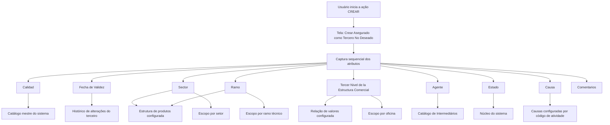

# Cadastro de Terceiro Não Desejado — Especificação Funcional de Atributos

## 1. Metadados do Documento
- **Arquivo de Origem:** Não informado; conteúdo bruto fornecido no enunciado.
- **Tipo de Documento:** Especificação Técnica / Manual Funcional.
- **Domínio / Sistema:** Cadastro de Terceiros Não Desejados; estrutura de produtos, estrutura comercial e catálogo de intermediários do sistema.
- **Público-Alvo:** Analistas funcionais, desenvolvedores, operação e usuários responsáveis pelo cadastro de terceiros.
- **Data/Versão Identificada:** Não identificada.

---

## 2. Resumo Executivo & Contexto de Negócio

O documento descreve a tela **“Crear Asegurado como Tercero No Deseado”**, cuja finalidade é permitir que o sistema registre um terceiro como **Terceiro Não Desejado**. A classificação é realizada de acordo com o código de atividade e com os valores informados nos atributos que compõem a atribuição do terceiro.

A funcionalidade habilitada na tela é **CRIAR**. O processo de cadastro exige o preenchimento sequencial dos atributos apresentados na seção “Datos Terceros No Deseados”, seguindo a ordem da esquerda para a direita e de cima para baixo.

A classificação de Terceiro Não Desejado pode ser abrangente ou restrita. Os campos **Sector**, **Ramo** e **Tercer Nivel de la Estructura Comercial** aceitam códigos genéricos que permitem aplicar a classificação a todos os setores, todos os ramos ou todas as oficinas, respectivamente. Alternativamente, códigos específicos restringem a identificação do terceiro às operações do setor, ramo técnico ou oficina selecionados.

O atributo **Fecha de Validez** registra a data a partir da qual o terceiro será identificado como não desejado, permitindo manter um histórico das alterações realizadas nas informações do terceiro. Os atributos **Estado**, **Causa** e **Comentarios** registram a situação fornecida pelo núcleo do sistema, o motivo de inabilitação configurado por código de atividade e a justificativa textual complementar.

---

## 3. Arquitetura, Componentes & Tecnologias Envolvidas

O conteúdo não descreve uma arquitetura técnica de software, integrações, APIs, microsserviços, bancos de dados, protocolos, URLs, ambientes ou tecnologias de implementação.

Os componentes funcionais e catálogos mencionados são:

- Tela **Crear Asegurado como Tercero No Deseado**.
- Funcionalidade habilitada: **CREAR**.
- Catálogo mestre do sistema, utilizado para valores de **Calidad**.
- Estrutura de produtos configurada no sistema, utilizada pelos campos **Sector** e **Ramo**.
- Relação de valores configurada no sistema para o **Tercer Nivel de la Estructura Comercial**.
- Catálogo de intermediários do sistema, utilizado pelo campo **Agente**.
- Núcleo do sistema, fornecedor da classificação do atributo **Estado**.
- Configuração de causas ou motivos de inabilitação por código de atividade, utilizada pelo campo **Causa**.



> **Nota de Análise:** O documento não especifica persistência de dados, validações obrigatórias, contratos de integração, métodos HTTP, perfis de acesso, mensagens de erro, estados possíveis ou comportamento após a ação **CREAR**.

---

## 4. Regras de Negócio, Especificações Funcionais & Processos

### 4.1 Objetivo funcional

A tela permite registrar um terceiro como **Terceiro Não Desejado** de acordo com:

1. O código de atividade do terceiro.
2. Os valores dos atributos que compõem a atribuição do Terceiro Não Desejado.

### 4.2 Ação habilitada

A ação habilitada é:

- **CREAR**

O documento não detalha o efeito técnico da ação **CREAR**, os critérios de sucesso, os campos obrigatórios ou as validações executadas no momento da criação.

### 4.3 Ordem de captura da informação

Os atributos de “Datos Terceros No Deseados” devem ser capturados na seguinte sequência, da esquerda para a direita e de cima para baixo:

1. Calidad
2. Fecha de Validez
3. Sector
4. Ramo
5. Tercer Nivel de la Estructura Comercial
6. Agente
7. Estado
8. Causa
9. Comentarios

### 4.4 Regras para Calidad

- O campo **Calidad** permite capturar o código de qualidade associado ao terceiro.
- O código de qualidade deve estar previamente codificado no catálogo mestre do sistema.
- O valor de **Calidad** é utilizado no momento de registrar o terceiro como Terceiro Não Desejado.

### 4.5 Regras para Fecha de Validez

- O campo **Fecha de Validez** informa a data a partir da qual o terceiro será identificado como Terceiro Não Desejado.
- O uso correto da data de validade permite manter histórico das alterações efetuadas nas informações do terceiro.

### 4.6 Regras para Sector

- O campo **Sector** contém o código do setor conforme a estrutura de produtos configurada no sistema.
- O código genérico **9999** permite marcar o terceiro como Terceiro Não Desejado para todos os setores existentes.
- Um código de setor específico permite identificar o terceiro como Terceiro Não Desejado apenas para operações daquele setor.
- O sistema contempla a marcação de um terceiro como Terceiro Não Desejado para um único setor entre os setores existentes.

### 4.7 Regras para Ramo

- O campo **Ramo** deve conter o código do ramo técnico conforme a estrutura de produtos definida no sistema.
- O código genérico **999** permite marcar o terceiro como Terceiro Não Desejado para todos os ramos existentes.
- Um código de ramo técnico específico permite identificar o terceiro como Terceiro Não Desejado apenas para aquele ramo.

### 4.8 Regras para Tercer Nivel de la Estructura Comercial

- O campo **Tercer Nivel de la Estructura Comercial** deve conter o código do terceiro nível da estrutura comercial.
- O código deve respeitar a relação de valores configurada no sistema.
- O código genérico **9999** permite marcar o terceiro como Terceiro Não Desejado para todas as oficinas existentes.
- Um código de oficina específico permite identificar o terceiro como Terceiro Não Desejado apenas para aquela oficina.

### 4.9 Regras para Agente

- O campo **Agente** deve registrar o código do agente.
- O código do agente deve seguir a relação de valores configurada no catálogo de intermediários do sistema.

### 4.10 Regras para Estado

- O atributo **Estado** contém uma classificação fornecida pelo núcleo do sistema.
- Essa classificação representa possíveis condições e situações que identificam o terceiro como Terceiro Não Desejado.
- O documento não apresenta a lista de estados disponíveis.

### 4.11 Regras para Causa

- O campo **Causa** contém o motivo pelo qual o terceiro está sendo inabilitado.
- As causas ou motivos de inabilitação são configurados no sistema por código de atividade.
- O documento não apresenta os códigos ou descrições das causas disponíveis.

### 4.12 Regras para Comentarios

- O atributo **Comentarios** permite registrar texto plano.
- O texto deve ampliar ou detalhar o motivo pelo qual o terceiro está sendo considerado uma pessoa física ou jurídica indesejável.

---

## 5. Tabelas de Parâmetros, Ambientes e Estruturas de Dados

| Item / Parâmetro | Descrição / Função | Tipo / Valores / Formato | Ambiente / Observações |
| :--- | :--- | :--- | :--- |
| CREAR | Ação habilitada na tela para registrar um Terceiro Não Desejado. | Ação funcional. | O documento não detalha o comportamento técnico após a execução. |
| Calidad | Registra o código de qualidade associado ao terceiro no momento de cadastrá-lo como Terceiro Não Desejado. | Código previamente codificado. | Valores provenientes do catálogo mestre do sistema. |
| Fecha de Validez | Determina a data a partir da qual o terceiro será identificado como Terceiro Não Desejado. | Data. | Permite histórico das alterações nas informações do terceiro. |
| Sector | Define o setor ao qual a classificação de Terceiro Não Desejado se aplica. | Código de setor; código genérico `9999`. | O código deve seguir a estrutura de produtos configurada no sistema. |
| Sector = 9999 | Aplica a condição de Terceiro Não Desejado a todos os setores existentes. | Código genérico. | Não há detalhamento de exceções ou precedência. |
| Sector específico | Aplica a condição de Terceiro Não Desejado somente às operações de um setor específico. | Código de setor configurado. | O documento menciona a possibilidade de marcação para um único setor entre os existentes. |
| Ramo | Define o ramo técnico ao qual a classificação de Terceiro Não Desejado se aplica. | Código de ramo técnico; código genérico `999`. | O código deve seguir a estrutura de produtos definida no sistema. |
| Ramo = 999 | Aplica a condição de Terceiro Não Desejado a todos os ramos existentes. | Código genérico. | Não há detalhamento de exceções ou precedência. |
| Ramo específico | Aplica a condição de Terceiro Não Desejado somente a um ramo técnico específico. | Código de ramo técnico configurado. | O documento não detalha a combinação com setor ou oficina. |
| Tercer Nivel de la Estructura Comercial | Define o terceiro nível da estrutura comercial associado à classificação. | Código configurado; código genérico `9999`. | O código deve seguir a relação de valores configurada no sistema. |
| Tercer Nivel = 9999 | Aplica a condição de Terceiro Não Desejado a todas as oficinas existentes. | Código genérico. | O documento utiliza “Oficinas” para explicar o terceiro nível da estrutura comercial. |
| Oficina específica | Aplica a condição de Terceiro Não Desejado somente a uma oficina determinada. | Código de oficina configurado. | O documento não detalha a lista de oficinas nem as regras de combinação com outros campos. |
| Agente | Registra o código do agente relacionado ao terceiro. | Código de agente. | Valores provenientes do catálogo de intermediários do sistema. |
| Estado | Classificação das condições e situações que identificam o terceiro como Terceiro Não Desejado. | Classificação fornecida pelo núcleo do sistema. | Valores não detalhados no documento. |
| Causa | Registra o motivo de inabilitação do terceiro. | Causa ou motivo configurado por código de atividade. | Códigos e descrições não detalhados no documento. |
| Comentarios | Complementa ou detalha o motivo pelo qual o terceiro é considerado indesejável. | Texto plano. | Aplicável a pessoa física ou jurídica. |
| Catálogo mestre do sistema | Fonte dos valores previamente codificados de Calidad. | Catálogo de referência. | Não detalhado. |
| Estrutura de produtos | Fonte da codificação de Sector e Ramo. | Estrutura configurada/definida no sistema. | Não detalhada. |
| Catálogo de Intermediários | Fonte dos possíveis valores para Agente. | Catálogo de referência. | Não detalhado. |
| Núcleo do sistema | Fornece a classificação usada pelo atributo Estado. | Componente funcional mencionado. | Sem detalhes técnicos ou de integração. |

---

## 6. Bateria de Perguntas & Respostas para RAG (FAQ Sintético)

### P1: Qual é o objetivo da tela “Crear Asegurado como Tercero No Deseado”?
**R:** A tela permite registrar um terceiro como Terceiro Não Desejado. O registro é realizado de acordo com o código de atividade e com os valores dos atributos que compõem a atribuição do terceiro.

### P2: Qual ação está habilitada para o cadastro de um Terceiro Não Desejado?
**R:** A ação habilitada no documento é **CREAR**. O documento não informa validações, mensagens de retorno ou o comportamento técnico executado após essa ação.

### P3: Para que serve o campo Calidad no cadastro de Terceiro Não Desejado?
**R:** O campo **Calidad** permite capturar o código de qualidade que será associado ao terceiro no momento de registrá-lo como Terceiro Não Desejado. Esse código deve estar previamente codificado no catálogo mestre do sistema.

### P4: Qual é a função da Fecha de Validez?
**R:** A **Fecha de Validez** indica a data a partir da qual o terceiro será identificado como Terceiro Não Desejado. O documento informa que o uso correto desse atributo permite manter um histórico das alterações efetuadas nas informações do terceiro.

### P5: O que acontece quando o campo Sector recebe o código 9999?
**R:** Quando o campo **Sector** recebe o código genérico **9999**, o sistema permite marcar o terceiro como Terceiro Não Desejado para todos os setores existentes.

### P6: É possível restringir a classificação de Terceiro Não Desejado a um setor específico?
**R:** Sim. Ao informar o código de um setor concreto no campo **Sector**, o terceiro é identificado como Terceiro Não Desejado apenas para as operações daquele setor. O documento afirma que o sistema contempla a marcação para um único setor entre os setores existentes.

### P7: Qual código permite aplicar a classificação a todos os ramos técnicos?
**R:** O código genérico **999**, informado no campo **Ramo**, permite marcar o terceiro como Terceiro Não Desejado para todos os ramos existentes.

### P8: Como restringir um Terceiro Não Desejado a um ramo técnico específico?
**R:** Deve-se informar no campo **Ramo** o código de um ramo técnico existente na estrutura de produtos definida no sistema. Nesse caso, o terceiro será identificado como Terceiro Não Desejado apenas para aquele ramo.

### P9: Como aplicar a marcação de Terceiro Não Desejado a todas as oficinas?
**R:** Deve-se utilizar o código genérico **9999** no campo **Tercer Nivel de la Estructura Comercial**. Segundo o documento, esse valor permite marcar o terceiro como Terceiro Não Desejado para todas as oficinas existentes.

### P10: De onde vem o valor informado no campo Agente?
**R:** O campo **Agente** deve registrar um código de agente conforme a relação de possíveis valores configurada no catálogo de intermediários do sistema.

### P11: Qual é a origem da classificação apresentada no campo Estado?
**R:** O campo **Estado** contém uma classificação fornecida pelo núcleo do sistema, relacionada às possíveis condições e situações que identificam o terceiro como Terceiro Não Desejado. O documento não lista os estados possíveis.

### P12: Como a causa de inabilitação é definida?
**R:** O campo **Causa** registra o motivo pelo qual o terceiro está sendo inabilitado. As causas ou motivos de inabilitação são configurados no sistema de acordo com o código de atividade.

### P13: Qual é o objetivo do campo Comentarios?
**R:** O campo **Comentarios** permite capturar texto plano para ampliar ou detalhar o motivo pelo qual o terceiro está sendo considerado uma pessoa física ou jurídica indesejável.

---

## 7. Glossário de Termos, Siglas & Conceitos-Chave

- **Terceiro Não Desejado:** Classificação atribuída a um terceiro conforme o código de atividade e os valores dos atributos de cadastro descritos no documento.
- **Asegurado:** Termo presente no título da tela “Crear Asegurado como Tercero No Deseado”. O documento não apresenta definição adicional.
- **Calidad:** Código de qualidade associado ao terceiro, obtido a partir de valores previamente codificados no catálogo mestre do sistema.
- **Fecha de Validez:** Data a partir da qual o terceiro será identificado como Terceiro Não Desejado.
- **Sector:** Código de setor associado à estrutura de produtos configurada no sistema.
- **Ramo:** Código do ramo técnico conforme a estrutura de produtos definida no sistema.
- **Tercer Nivel de la Estructura Comercial:** Código do terceiro nível da estrutura comercial, associado no documento à identificação de oficinas.
- **Oficina:** Unidade referenciada como escopo possível da classificação de Terceiro Não Desejado por meio do terceiro nível da estrutura comercial.
- **Agente:** Código de agente selecionado a partir do catálogo de intermediários do sistema.
- **Estado:** Classificação fornecida pelo núcleo do sistema sobre condições e situações que identificam o terceiro como não desejado.
- **Causa:** Motivo de inabilitação do terceiro, configurado no sistema por código de atividade.
- **Comentarios:** Campo de texto plano para detalhar o motivo da classificação do terceiro como pessoa física ou jurídica indesejável.
- **Código genérico 9999:** Valor utilizado para todos os setores ou todas as oficinas, conforme o atributo em que é aplicado.
- **Código genérico 999:** Valor utilizado para todos os ramos existentes.

---

## 8. Notas Críticas, Riscos & Limitações

- O documento não identifica o arquivo de origem, data, versão, autor, sistema corporativo específico ou ambiente de execução.
- O documento não especifica quais campos são obrigatórios, opcionais ou sujeitos a validação.
- Não há descrição de permissões, perfis de usuário, trilha de auditoria, aprovação, exclusão, alteração ou consulta de registros de Terceiro Não Desejado.
- Não são apresentados os valores permitidos para **Calidad**, **Estado**, **Causa**, **Sector**, **Ramo**, **Oficina** ou **Agente**.
- O documento não detalha como os escopos de **Sector**, **Ramo** e **Tercer Nivel de la Estructura Comercial** interagem quando preenchidos simultaneamente.
- Não há informação sobre prioridade, conflito ou precedência entre códigos genéricos e códigos específicos.
- Não são descritos serviços, APIs, integrações, banco de dados, formatos de mensagem, URLs, logs ou mecanismos de tratamento de erro.
- O documento contém ocorrências de “Consejo:” sem conteúdo complementar associado.

---

## 9. Conteúdo Bruto Estruturado (Referência Fiel)

```text
--- [PÁGINA 1 DE 3] ---

CREAR Asegurado como Tercero No Deseado
Objetivo
El propósito de esta pantalla es proporcionar la funcionalidad para que el Sistema pueda registrar al
Tercero como un Tercero No Deseado, de acuerdo con su código de actividad y de los valores de
los atributos que conforman su asignación.
Acciones habilitadas
 CREAR ( )
Datos Terceros No Deseados
De Izquierda a Derecha y de Arriba hacia Abajo, los siguientes atributos marcan la secuencia de
captura de la Información en el sistema.
Calidad (  )
 / 
 RS
Inicio Soluciones APIs Documentación Zeus
ES


--- [PÁGINA 2 DE 3] ---

Este Campo va a permitir capturar el código de calidad que se va a asociar al Tercero de acuerdo
con los valores previamente codificados en el catálogo maestro del Sistema, en el momento de
registrarlo como Tercero No Deseado.
Fecha de Validez ( )
Esta propiedad le indica al sistema la fecha a partir de la cual el Tercero va a ser identificado como
Tercero No Deseado por lo que su correcto uso permite tener un histórico de los cambios efectuados
en la Información del Tercero.
Sector (  )
Este Campo contiene el código del sector de acuerdo con la estructura de productos configurada en
el Sistema.
Utilizando el valor genérico en este atributo (código 9999) el sistema permite marcar al Tercero
como Tercero no Deseado para todos los Sectores existentes o bien al utilizar el código de un
Sector en concreto, identificar al Tercero como Tercero no Deseado únicamente para las
Operaciones de este Sector.
De esta manera el sistema contempla la posibilidad de marcaje de un Tercero como Tercero No
Deseado para un único Sector de los n existentes.
Ramo (  )
Este Campo deber contener el código del ramo técnico de acuerdo con la estructura de productos
definida en el Sistema.
Utilizando el valor genérico en este atributo (código 999) el sistema permite marcar al Tercero
como Tercero no Deseado para todos los Ramos existentes o bien al utilizar el código de un
Ramo Técnico de los n existentes, identificar al Tercero como Tercero no Deseado únicamente
para ese Ramo.
Tercer Nivel de la Estructura Comercial (  )
Este Campo ha de contener el código del tercer nivel de la Estructura Comercial, de acuerdo con la
relación de valores configurada en el Sistema.
Consejo:
Consejo:


--- [PÁGINA 3 DE 3] ---

Utilizando el valor genérico en este atributo (código 9999), el sistema permite marcar al Tercero
como Tercero no Deseado para todas las Oficinas existentes o bien al utilizar el código de una
Oficina en Particular, identificar al Tercero como Tercero no Deseado únicamente para esa
Oficina.
Agente (  )
Este Campo tiene que registrar el código del agente de acuerdo con la relación de posibles valores
configurada en el catálogo de Intermediarios en el Sistema.
Estado (  )
Este atributo contiene una clasificación proporcionada por el núcleo del Sistema, de las posibles
condiciones y situaciones que identifican al Tercero como Tercero No Deseado.
Causa (  )
Este Campo contiene el motivo por el cual se está Inhabilitando al Tercero, de acuerdo con las
causas o motivos de inhabilitación que se hayan configurado por código de actividad en el Sistema.
Comentarios ( )
Este Atributo permite capturar texto plano para ampliar o detallar el motivo por el que se está
considerando al Tercero como una Persona Física o Jurídica indeseable.
Consejo:
```
