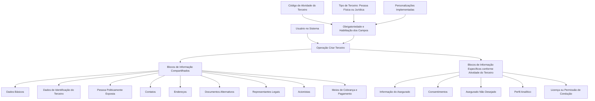

# Operação Criar Terceiro — Registro de Informações de Asegurado/Cliente

## 1. Metadados do Documento
- **Arquivo de Origem:** Não identificado
- **Tipo de Documento:** Procedimento
- **Domínio / Sistema:** Criação de Terceiro / Asegurado-Cliente
- **Público-Alvo:** Usuários do sistema, analistas funcionais e operação
- **Data/Versão Identificada:** Não identificada

---

## 2. Resumo Executivo & Contexto de Negócio

O documento descreve a operação **Criar Terceiro**, destinada ao registro das informações de **Asegurados/Clientes**. A operação organiza a captura de dados em blocos de informação compartilhados e blocos de informação específicos associados à atividade do Terceiro.

A obrigatoriedade de preenchimento e a habilitação dos campos não são fixas. O comportamento dos campos pode variar conforme o **código de atividade do Terceiro**, o tipo de Terceiro — **Pessoa Física** ou **Pessoa Jurídica** — e personalizações previamente implementadas na aplicação.

O processo também permite que a ordem de captura dos dados nos blocos de informação varie conforme o critério adotado pelo usuário no sistema. Portanto, o documento não estabelece uma sequência obrigatória e única para o preenchimento dos blocos apresentados.

Os blocos compartilhados incluem dados básicos, identificação, contatos, endereços, documentos alternativos, representantes legais, acionistas e meios de cobrança e pagamento. Os blocos específicos incluem informações do segurado, consentimentos, segurado não desejado, perfil analítico e licença ou permissão de condução.

---

## 3. Arquitetura, Componentes & Tecnologias Envolvidas

O conteúdo apresenta uma estrutura funcional de cadastro, sem detalhar arquitetura de software, integrações, protocolos, métodos HTTP, contratos JSON, bancos de dados, servidores ou tecnologias de implementação.

Os elementos funcionais identificados são:

- Operação **Criar Terceiro**.
- Registro de informações de **Asegurado/Cliente**.
- Blocos de informação compartilhados.
- Blocos de informação específicos conforme a atividade do Terceiro.
- Critérios de comportamento dos campos: código de atividade, tipo de Terceiro e personalizações.
- Referências de navegação presentes no conteúdo: **Inicio**, **Soluciones**, **APIs**, **Documentación** e **Zeus**.



> **Nota de Análise:** O documento descreve blocos funcionais de cadastro, mas não detalha a implementação técnica da operação Criar Terceiro, métodos HTTP, contratos de API, persistência de dados ou integrações externas.

---

## 4. Regras de Negócio, Especificações Funcionais & Processos

### Objetivo da operação

A operação **Criar Terceiro** permite registrar informações de Asegurados/Clientes.

### Premissas de preenchimento

1. A obrigatoriedade e/ou a habilitação dos campos no registro de dados de cada bloco ou estrutura de informação compartilhada podem variar conforme o **código de atividade do Terceiro**.
2. A obrigatoriedade e/ou a habilitação dos campos no registro dos blocos ou estruturas de informação podem variar quando o Terceiro é:
   - Pessoa Física.
   - Pessoa Jurídica.
3. Personalizações implementadas podem afetar o comportamento da aplicação em relação à obrigatoriedade do registro dos dados do Terceiro.
4. A ordem de captura dos dados nos diferentes blocos de informação pode variar de acordo com o critério seguido pelo usuário no sistema.
5. O processo inclui blocos de informação compartilhados para a criação do Terceiro.
6. O processo inclui blocos de informação específicos conforme a atividade do Terceiro.

### Processo funcional identificado

1. O usuário acessa a operação **Criar Terceiro**.
2. O usuário registra dados nos blocos de informação compartilhados aplicáveis ao Terceiro.
3. O sistema pode variar a obrigatoriedade e a habilitação dos campos conforme código de atividade, tipo de Terceiro e personalizações existentes.
4. O usuário registra, quando aplicável, dados nos blocos específicos conforme a atividade do Terceiro.
5. O documento não define uma ordem obrigatória para preenchimento dos blocos de informação.

### Blocos de informação compartilhados

- Dados Básicos.
- Dados de Identificação do Terceiro.
- Pessoa Politicamente Exposta.
- Contatos.
- Endereços.
- Documentos Alternativos.
- Representantes Legais.
- Acionistas.
- Meios de Cobrança e Pagamento.

### Blocos de informação específicos conforme atividade do Terceiro

- Informação do Asegurado.
- Consentimentos.
- Asegurado Não Desejado.
- Perfil Analítico.
- Licença / Permissão de Condução.

> **Nota de Análise:** O documento não fornece regras de validação por campo, valores permitidos, formatos de dados, critérios de aprovação/reprovação, nem condições explícitas para determinar quando cada bloco específico deve ser preenchido.

---

## 5. Tabelas de Parâmetros, Ambientes e Estruturas de Dados

| Item / Parâmetro | Descrição / Função | Tipo / Valores / Formato | Ambiente / Observações |
| :--- | :--- | :--- | :--- |
| Operação Criar Terceiro | Permite registrar informações de Asegurados/Clientes. | Operação funcional. | Não detalha sistema, URL ou ambiente. |
| Código de atividade do Terceiro | Pode influenciar a obrigatoriedade e/ou habilitação de campos em blocos compartilhados. | Código não especificado. | Critério de comportamento da aplicação. |
| Tipo de Terceiro | Pode influenciar a obrigatoriedade e/ou habilitação de campos. | Pessoa Física ou Pessoa Jurídica. | Não há detalhamento das regras por tipo. |
| Personalizações implementadas | Podem afetar o comportamento da aplicação quanto à obrigatoriedade de registro dos dados do Terceiro. | Não especificado. | Não são descritas as personalizações existentes. |
| Ordem de captura de dados | Pode variar conforme o critério seguido pelo usuário no sistema. | Sequência definida pelo usuário. | Não existe sequência obrigatória documentada. |
| Dados Básicos | Bloco de informação compartilhado na criação de Terceiro. | Estrutura não detalhada. | Campos não informados. |
| Dados de Identificação do Terceiro | Bloco de informação compartilhado na criação de Terceiro. | Estrutura não detalhada. | Campos não informados. |
| Pessoa Politicamente Exposta | Bloco de informação compartilhado na criação de Terceiro. | Estrutura não detalhada. | Critérios de classificação não informados. |
| Contatos | Bloco de informação compartilhado na criação de Terceiro. | Estrutura não detalhada. | Campos não informados. |
| Endereços | Bloco de informação compartilhado na criação de Terceiro. | Estrutura não detalhada. | Campos não informados. |
| Documentos Alternativos | Bloco de informação compartilhado na criação de Terceiro. | Estrutura não detalhada. | Tipos de documentos não informados. |
| Representantes Legais | Bloco de informação compartilhado na criação de Terceiro. | Estrutura não detalhada. | Critérios de aplicabilidade não informados. |
| Acionistas | Bloco de informação compartilhado na criação de Terceiro. | Estrutura não detalhada. | Critérios de aplicabilidade não informados. |
| Meios de Cobrança e Pagamento | Bloco de informação compartilhado na criação de Terceiro. | Estrutura não detalhada. | Métodos aceitos não informados. |
| Informação do Asegurado | Bloco específico conforme a atividade do Terceiro. | Estrutura não detalhada. | Campos não informados. |
| Consentimentos | Bloco específico conforme a atividade do Terceiro. | Estrutura não detalhada. | Tipos de consentimento não informados. |
| Asegurado Não Desejado | Bloco específico conforme a atividade do Terceiro. | Estrutura não detalhada. | Critérios não informados. |
| Perfil Analítico | Bloco específico conforme a atividade do Terceiro. | Estrutura não detalhada. | Critérios e indicadores não informados. |
| Licença / Permissão de Condução | Bloco específico conforme a atividade do Terceiro. | Estrutura não detalhada. | Regras de validade ou categoria não informadas. |
| Inicio / Soluciones / APIs / Documentación / Zeus | Termos apresentados no rodapé ou navegação do conteúdo extraído. | Referências textuais. | Não há explicação funcional ou técnica adicional. |

---

## 6. Bateria de Perguntas & Respostas para RAG (FAQ Sintético)

### P1: Qual é a finalidade da operação Criar Terceiro?
**R:** A operação Criar Terceiro permite registrar informações de Asegurados/Clientes. O registro é organizado em blocos de informação compartilhados e em blocos específicos conforme a atividade do Terceiro.

### P2: A obrigatoriedade dos campos da operação Criar Terceiro é sempre a mesma?
**R:** Não. A obrigatoriedade e/ou a habilitação dos campos pode variar conforme o código de atividade do Terceiro, o tipo de Terceiro — Pessoa Física ou Pessoa Jurídica — e personalizações implementadas na aplicação.

### P3: Quais tipos de Terceiro podem alterar o comportamento dos campos no cadastro?
**R:** O documento informa que a obrigatoriedade e/ou a habilitação dos campos pode variar quando o tipo de Terceiro é Pessoa Física ou Pessoa Jurídica.

### P4: O código de atividade do Terceiro influencia o cadastro?
**R:** Sim. O documento estabelece que a obrigatoriedade e/ou a habilitação dos campos no registro dos dados dos blocos ou estruturas de informação compartilhadas pode variar de acordo com o código de atividade do Terceiro.

### P5: As personalizações da aplicação podem impactar o preenchimento do cadastro?
**R:** Sim. Personalizações que tenham sido implementadas podem afetar o comportamento da aplicação em relação à obrigatoriedade do registro dos dados do Terceiro.

### P6: Existe uma ordem obrigatória para preencher os blocos de informação?
**R:** Não. O documento informa que a ordem de captura dos dados nos distintos blocos de informação pode variar conforme o critério seguido pelo usuário no sistema.

### P7: Quais blocos de informação compartilhados estão disponíveis na criação de Terceiro?
**R:** Os blocos compartilhados listados são: Dados Básicos, Dados de Identificação do Terceiro, Pessoa Politicamente Exposta, Contatos, Endereços, Documentos Alternativos, Representantes Legais, Acionistas e Meios de Cobrança e Pagamento.

### P8: Quais blocos específicos são apresentados conforme a atividade do Terceiro?
**R:** Os blocos específicos listados são: Informação do Asegurado, Consentimentos, Asegurado Não Desejado, Perfil Analítico e Licença ou Permissão de Condução.

### P9: O documento define os campos internos do bloco Dados Básicos?
**R:** Não. O documento somente identifica Dados Básicos como um bloco de informação compartilhado. Não há detalhamento dos campos, tipos, formatos ou validações desse bloco.

### P10: O documento descreve critérios para classificar um Asegurado Não Desejado?
**R:** Não. O documento lista Asegurado Não Desejado como um bloco de informação específico de acordo com a atividade do Terceiro, mas não apresenta critérios, regras ou fluxos de classificação.

### P11: Há especificação de APIs, métodos HTTP ou contratos JSON para Criar Terceiro?
**R:** Não. Embora o conteúdo extraído apresente o termo “APIs” em elementos de navegação, o documento não detalha endpoints, métodos HTTP, autenticação, payloads, respostas ou contratos JSON para a operação Criar Terceiro.

### P12: O documento informa quais ambientes, URLs ou servidores devem ser utilizados?
**R:** Não. Não foram identificados ambientes, URLs, portas, servidores ou rotas de log no conteúdo fornecido.

---

## 7. Glossário de Termos, Siglas & Conceitos-Chave

- **Asegurado:** Termo utilizado no documento para a entidade cujas informações podem ser registradas na operação Criar Terceiro.
- **Cliente:** Termo associado ao Asegurado na descrição da finalidade da operação.
- **Criar Terceiro:** Operação que permite registrar informações de Asegurados/Clientes.
- **Terceiro:** Entidade cadastrada na operação, podendo ser Pessoa Física ou Pessoa Jurídica.
- **Pessoa Física:** Tipo de Terceiro citado como fator que pode influenciar obrigatoriedade e habilitação de campos.
- **Pessoa Jurídica:** Tipo de Terceiro citado como fator que pode influenciar obrigatoriedade e habilitação de campos.
- **Código de Atividade do Terceiro:** Critério que pode alterar a obrigatoriedade e/ou habilitação de campos em blocos de informação compartilhados.
- **Pessoa Politicamente Exposta:** Bloco de informação compartilhado listado para a criação de Terceiro.
- **Consentimentos:** Bloco de informação específico de acordo com a atividade do Terceiro.
- **Asegurado Não Desejado:** Bloco de informação específico de acordo com a atividade do Terceiro.
- **Perfil Analítico:** Bloco de informação específico de acordo com a atividade do Terceiro.
- **Licença / Permissão de Condução:** Bloco de informação específico de acordo com a atividade do Terceiro.

---

## 8. Notas Críticas, Riscos & Limitações

- O documento não identifica o arquivo de origem, autor, versão, data ou sistema responsável pela operação.
- Não há detalhamento dos campos, formatos, regras de validação ou critérios de obrigatoriedade por bloco.
- Não são informados valores possíveis para o código de atividade do Terceiro.
- Não há mapeamento de quais blocos se aplicam a cada código de atividade.
- Não são detalhadas as personalizações que podem alterar a obrigatoriedade dos dados.
- Não há definição de critérios para aplicar os blocos Informação do Asegurado, Consentimentos, Asegurado Não Desejado, Perfil Analítico ou Licença / Permissão de Condução.
- O documento não informa integrações, APIs, contratos de dados, mecanismos de autenticação, persistência ou tratamento de erros.
- Não há URLs, servidores, ambientes, rotas de logs, versões de software ou tecnologias de implementação.
- A presença de “APIs”, “Documentación” e “Zeus” no conteúdo extraído não é suficiente para estabelecer relação técnica entre esses termos e a operação Criar Terceiro.

---

## 9. Conteúdo Bruto Estruturado (Referência Fiel)

```text
--- [PÁGINA 1 DE 2] ---

OPERACIÓN CREAR Asegurado/Cliente
¿En que consiste?
Esta operación permite registrar la Información de los Asegurados.
Premisas
La obligatoriedad y/o la habilitación de los campos en el registro de los datos de cada uno de
los bloques o estructuras de información compartidas puede variar de acuerdo con el código de
actividad del Tercero:
La obligatoriedad y/o la habilitación de los campos en el registro de los datos de cada uno de
los bloques o estructuras de información pueden variar si el tipo de Tercero es una Persona
Física o una Persona Jurídica:
Las personalizaciones que se hubieran podido implementar a su vez pueden afectar el
comportamiento de la aplicación en relación con la obligatoriedad en el registro de los Datos del
Tercero.
Por último, el orden de captura de los datos en los distintos bloques de Información puede
variar de acuerdo con el criterio seguido por el Usuario en el Sistema.
Ejemplo:
Ejemplo:
 / 
 RS
Inicio Soluciones APIs Documentación Zeus
ES


--- [PÁGINA 2 DE 2] ---

Proceso
CREAR
TERCERO
Información
Asegurado Consentimientos Asegurado
No Deseado
Perfil
Analítico
Licencia
de Conducir
Bloques de Información Compartidos (CREAR TERCERO)
 Datos Básicos ( )
 Datos Identificación del Tercero ( )
 Persona Políticamente Expuesta ( )
 Contactos ( )
 Direcciones ( )
 Documentos Alternativos ( )
 Representantes Legales ( )
 Accionistas ( )
 Medios de Cobro y Pago ( )
Bloques de Información Específicos de acuerdo con la
Actividad del Tercero.
 Información del Asegurado ( )
 Consentimientos ( )
 Asegurado No Deseado ( )
 Perfil Analítico ( )
 Licencia / Permiso de Conducir ( )
```
