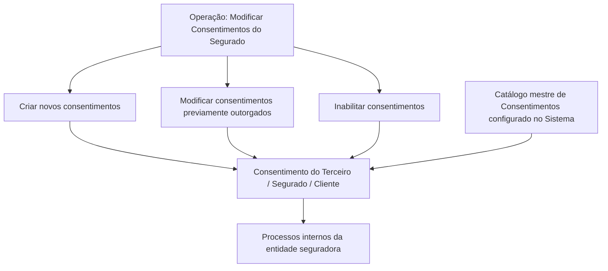

# Modificação de Consentimentos do Segurado — Especificação Funcional

## 1. Metadados do Documento
- **Arquivo de Origem:** Não identificado no conteúdo fornecido
- **Tipo de Documento:** Especificação Técnica / Funcional
- **Domínio / Sistema:** Consentimentos do Segurado/Cliente; proteção de dados em entidade seguradora
- **Público-Alvo:** Não identificado explicitamente no texto
- **Data/Versão Identificada:** Não identificada

---

## 2. Resumo Executivo & Contexto de Negócio

O documento descreve a operação **“MODIFICAR Consentimientos del Asegurado”**, destinada à gestão de consentimentos associados a um Segurado/Cliente ou Terceiro. O consentimento é definido como uma manifestação de vontade livre, inequívoca, específica e informada, por meio da qual o interessado aceita, mediante declaração ou clara ação afirmativa, o tratamento de dados pessoais que lhe dizem respeito.

A operação permite três ações sobre consentimentos: **criar novos consentimentos**, **modificar informações de consentimentos previamente outorgados** pelo Segurado/Cliente e **inabilitar consentimentos**. A especificação não descreve métodos HTTP, contratos JSON, telas, APIs ou integrações técnicas.

Os atributos apresentados definem o âmbito de uso do consentimento, sua classificação conforme a normativa local de proteção de dados, seu código no catálogo mestre, datas de início, fim e validade, além do indicador de inabilitação. Parte das classificações precisa ser definida localmente pela entidade seguradora para utilização posterior nos processos internos.

Quando campos não forem expressamente especificados, o documento determina que eles devem ser empregados indistintamente tanto para o registro de informações de **Pessoas Físicas** quanto de **Pessoas Jurídicas**. O uso correto da data de validade permite manter histórico das mudanças efetuadas sobre as informações de consentimento.

---

## 3. Arquitetura, Componentes & Tecnologias Envolvidas

O conteúdo não apresenta arquitetura de software, tecnologias, ambientes, servidores, URLs, microsserviços, APIs, bancos de dados ou ferramentas de infraestrutura. A estrutura funcional identificada contém os seguintes elementos:

- Operação de modificação de consentimentos do Segurado.
- Entidade associada: Segurado/Cliente ou Terceiro.
- Catálogo mestre de Consentimentos configurado no Sistema.
- Processos internos da entidade seguradora.
- Normativa local de proteção de dados.
- Registro aplicável a Pessoas Físicas e Pessoas Jurídicas, quando campos não forem expressamente especificados.



> **Nota de Análise:** O documento apresenta uma relação funcional entre a operação, o consentimento, o catálogo mestre e os processos internos, mas não detalha interfaces, mecanismos de persistência, integrações ou contratos técnicos.

---

## 4. Regras de Negócio, Especificações Funcionais & Processos

### Definição de consentimento

Um consentimento é definido como toda manifestação de vontade que seja:

- Livre;
- Inequívoca;
- Específica;
- Informada;
- Expressa mediante declaração ou clara ação afirmativa;
- Relacionada à aceitação do tratamento de dados pessoais do interessado.

### Ações permitidas

A operação de consentimentos prevê as seguintes ações:

1. **CRIAR:** criar novos consentimentos.
2. **MODIFICAR:** modificar informações de consentimentos previamente outorgados pelo Segurado/Cliente.
3. **INHABILITAR:** inabilitar consentimentos associados ao Segurado/Cliente ou Terceiro.

### Aplicabilidade a pessoas

Caso os campos não sejam especificados ou indicados expressamente, os campos devem ser utilizados indistintamente no registro de informações de:

- Pessoas Físicas;
- Pessoas Jurídicas.

### Âmbito do consentimento

O atributo **Valor Tipo** indica o âmbito do consentimento atribuído ao Terceiro. Esse atributo estabelece o âmbito de emprego do consentimento na atividade da Companhia Aseguradora.

A classificação do âmbito deve ser definida localmente pela entidade seguradora, para uso posterior nos processos internos. O documento fornece exemplos de valores possíveis: Publicidade, Cesión de Datos e Perfilado.

### Código do consentimento

O campo **Código Consentimiento** contém o código do consentimento do Terceiro, conforme a relação de valores existentes no catálogo mestre de Consentimentos configurado no Sistema.

### Classificação conforme proteção de dados

O atributo **Tipo Formato** classifica os consentimentos do Terceiro de acordo com a Normativa de Protección de Datos local. A classificação deve ser definida pela entidade seguradora para uso posterior nos processos internos.

O documento apresenta, como exemplos, os formatos:

- Não Outorgado;
- Tácito;
- Expresso;
- Retirado.

### Regras de datas

- **Fecha Inicio:** indica a data de alta do Consentimento do Terceiro.
- **Fecha Fin:** indica a data de baixa em que o Consentimento do Terceiro deixa de estar ativo.
- **Fecha Validez:** informa ao Sistema a data a partir da qual o Consentimento do Terceiro estará plenamente operativo no Sistema.
- O uso correto de **Fecha Validez** permite manter histórico das mudanças efetuadas nas informações do consentimento.

### Regra de inabilitação

A propriedade **Inhabilitación** informa ao Sistema que o consentimento associado ao Terceiro está inabilitado. Um consentimento inabilitado não deve ser empregado, contemplado nem utilizado nos processos operativos da entidade.

---

## 5. Tabelas de Parâmetros, Ambientes e Estruturas de Dados

| Item / Parâmetro | Descrição / Função | Tipo / Valores / Formato | Ambiente / Observações |
| :--- | :--- | :--- | :--- |
| Ação CRIAR | Permite criar novos consentimentos. | CRIAR | Associada à operação de consentimentos. |
| Ação MODIFICAR | Permite modificar informações de consentimentos previamente outorgados pelo Segurado/Cliente. | MODIFICAR | Associada à operação de consentimentos. |
| Ação INHABILITAR | Permite inabilitar consentimentos. | INHABILITAR | O consentimento inabilitado não deve ser usado nos processos operativos. |
| Valor Tipo | Indica o âmbito do consentimento atribuído ao Terceiro e seu âmbito de emprego na atividade da Companhia Aseguradora. | Classificação definida localmente. Exemplos: `001 Publicidad`, `002 Cesión de Datos`, `003 Perfilado`. | A entidade seguradora deve definir a classificação para uso posterior nos processos internos. |
| Código Consentimiento | Contém o código do consentimento do Terceiro. | Código conforme catálogo mestre de Consentimentos. | Os valores dependem do catálogo mestre configurado no Sistema. |
| Tipo Formato | Classifica os consentimentos do Terceiro conforme a Normativa de Protección de Datos local. | Classificação definida localmente. Exemplos: `001 No Otorgado`, `002 Tácito`, `003 Expreso`, `004 Retirado`. | A entidade seguradora deve definir a classificação para uso posterior nos processos internos. |
| Fecha Inicio | Indica a data de alta do Consentimento do Terceiro. | Data; formato não especificado. | Não há regra adicional de validação descrita. |
| Fecha Fin | Indica a data de baixa em que o Consentimento do Terceiro deixa de estar ativo. | Data; formato não especificado. | Relacionada ao encerramento da atividade do consentimento. |
| Fecha Validez | Indica a data a partir da qual o consentimento estará plenamente operativo no Sistema. | Data; formato não especificado. | Permite manter histórico das mudanças efetuadas nas informações. |
| Inhabilitación | Indica que o consentimento associado ao Terceiro está inabilitado. | Indicador; valores e formato não especificados. | O consentimento não deve ser empregado, contemplado ou utilizado nos processos operativos. |
| Aplicabilidade de campos não especificados | Determina o uso indistinto dos campos quando não houver indicação expressa. | Aplicável a Pessoas Físicas e Pessoas Jurídicas. | Regra de abrangência do registro de informações. |

---

## 6. Bateria de Perguntas & Respostas para RAG (FAQ Sintético)

### P1: Qual é o objetivo da operação “Modificar Consentimientos del Asegurado”?
**R:** A operação permite criar novos consentimentos, modificar informações de consentimentos previamente outorgados pelo Segurado/Cliente e inabilitar consentimentos associados ao Segurado/Cliente ou Terceiro.

### P2: Como o documento define consentimento?
**R:** O documento define consentimento como uma manifestação de vontade livre, inequívoca, específica e informada, pela qual o interessado aceita o tratamento de seus dados pessoais mediante declaração ou clara ação afirmativa.

### P3: Quais ações são possíveis na gestão de consentimentos do Segurado?
**R:** As ações possíveis são CRIAR, para criar novos consentimentos; MODIFICAR, para alterar informações de consentimentos previamente outorgados; e INHABILITAR, para tornar um consentimento inabilitado.

### P4: A operação de consentimentos se aplica somente a Pessoas Físicas?
**R:** Não. Caso os campos não sejam especificados ou indicados expressamente, eles devem ser utilizados indistintamente no registro de informações de Pessoas Físicas e Pessoas Jurídicas.

### P5: Para que serve o atributo “Valor Tipo”?
**R:** O atributo “Valor Tipo” indica o âmbito do consentimento atribuído ao Terceiro e estabelece o âmbito de emprego desse consentimento na atividade da Companhia Aseguradora. A classificação deve ser definida localmente pela entidade seguradora.

### P6: Quais são os exemplos de valores para “Valor Tipo”?
**R:** O documento apresenta como exemplos `001 Publicidad`, `002 Cesión de Datos` e `003 Perfilado`. Esses exemplos não constituem uma lista completa, pois a classificação deve ser definida localmente pela entidade seguradora.

### P7: De onde vem o valor de “Código Consentimiento”?
**R:** O campo “Código Consentimiento” contém o código do consentimento do Terceiro conforme a relação de valores existente no catálogo mestre de Consentimentos configurado no Sistema.

### P8: O que classifica o atributo “Tipo Formato”?
**R:** O atributo “Tipo Formato” classifica os consentimentos do Terceiro conforme a Normativa de Protección de Datos local. A classificação deve ser definida pela entidade seguradora para posterior utilização nos processos internos.

### P9: Quais formatos de consentimento são exemplificados no documento?
**R:** Os formatos exemplificados são `001 No Otorgado`, `002 Tácito`, `003 Expreso` e `004 Retirado`. O documento indica que podem existir outros valores, representados por reticências.

### P10: Qual é a diferença entre “Fecha Inicio”, “Fecha Fin” e “Fecha Validez”?
**R:** “Fecha Inicio” indica a data de alta do consentimento. “Fecha Fin” indica a data de baixa em que o consentimento deixa de estar ativo. “Fecha Validez” informa a data a partir da qual o consentimento estará plenamente operativo no Sistema e possibilita manter histórico das alterações.

### P11: Qual é o efeito de marcar um consentimento como inabilitado?
**R:** A propriedade “Inhabilitación” informa ao Sistema que o consentimento associado ao Terceiro está inabilitado. Consequentemente, esse consentimento não deve ser empregado, contemplado nem utilizado nos processos operativos da entidade.

### P12: O documento especifica APIs, métodos HTTP ou contratos JSON para a operação?
**R:** Não. O documento descreve a operação e seus atributos funcionais, mas não detalha métodos HTTP, contratos JSON, endpoints, autenticação, integrações, tecnologias ou mecanismos de persistência.

---

## 7. Glossário de Termos, Siglas & Conceitos-Chave

- **Consentimiento / Consentimento:** Manifestação de vontade livre, inequívoca, específica e informada pela qual o interessado aceita o tratamento de seus dados pessoais.
- **Segurado / Cliente:** Entidade para a qual a operação permite criar, modificar ou inabilitar consentimentos.
- **Tercero / Terceiro:** Entidade à qual são associados atributos como âmbito, código, formato, datas e inabilitação do consentimento.
- **Catálogo maestro de Consentimientos:** Catálogo mestre configurado no Sistema que contém a relação de valores possíveis para o código de consentimento.
- **Valor Tipo:** Atributo que indica o âmbito do consentimento do Terceiro na atividade da Companhia Aseguradora.
- **Código Consentimiento:** Código do consentimento do Terceiro conforme o catálogo mestre de Consentimentos.
- **Tipo Formato:** Classificação do consentimento conforme a normativa local de proteção de dados.
- **Fecha Inicio:** Data de alta do consentimento.
- **Fecha Fin:** Data de baixa em que o consentimento deixa de estar ativo.
- **Fecha Validez:** Data a partir da qual o consentimento estará plenamente operativo no Sistema.
- **Inhabilitación:** Propriedade que indica que o consentimento está inabilitado e não deve ser utilizado nos processos operativos.
- **No Otorgado:** Formato de consentimento exemplificado no documento.
- **Tácito:** Formato de consentimento exemplificado no documento.
- **Expreso:** Formato de consentimento exemplificado no documento.
- **Retirado:** Formato de consentimento exemplificado no documento.

---

## 8. Notas Críticas, Riscos & Limitações

- O documento não identifica nome do arquivo, versão, data, autor, sistema específico, ambiente ou responsável pela especificação.
- A classificação de **Valor Tipo** deve ser definida localmente pela entidade seguradora; os valores apresentados são somente exemplos.
- A classificação de **Tipo Formato** também deve ser definida localmente conforme a normativa de proteção de dados aplicável.
- O catálogo mestre de Consentimentos é citado, mas sua estrutura, governança, valores completos e mecanismo de configuração não são detalhados.
- Não há definição de formato para datas, obrigatoriedade de campos, regras de consistência entre datas ou validações de negócio adicionais.
- Não são descritos métodos HTTP, APIs, contratos JSON, integrações, interfaces de usuário, persistência de dados, mecanismos de auditoria ou controles de acesso.
- O consentimento inabilitado não deve ser utilizado nos processos operativos, mas o documento não define como o Sistema deve impedir tecnicamente esse uso.

---

## 9. Conteúdo Bruto Estruturado (Referência Fiel)

```text
--- [PÁGINA 1 DE 3] ---

MODIFICAR Consentimientos del Asegurado
Objetivo
Se entiende por consentimiento «toda manifestación de voluntad, libre, inequívoca, específica e
informada, mediante la que el interesado acepta, ya sea mediante una declaración o una clara acción
afirmativa, el tratamiento de datos personales que le conciernen.
Esta Operación permite Crear Nuevos Consentimientos, Modificar la información de los
Consentimientos otorgados previamente por el Asegurado/Cliente además de poder Inhabilitarlos.
Posibles Acciones
 CREAR ( )
 MODIFICAR ( )
 INHABILITAR ( )
Consentimientos
De izquierda a derecha y de arriba hacia abajo, los siguientes atributos marcan la secuencia de
captura de la información.
 /
 RS
Inicio Soluciones APIs Documentación Zeus
ES


--- [PÁGINA 2 DE 3] ---

Si no se especifica o indica expresamente los Campos se emplearán indistintamente tanto en el
registro de información de las Personas Físicas como para las Personas Jurídicas.
Valor Tipo ( )
Esta propiedad indicará el ámbito del Consentimiento que se esté asignando al Tercero.
Este atributo establece el ámbito de empleo del consentimiento del Tercero en la actividad de la
Compañía Aseguradora, clasificación que ha de ser definida localmente por parte de la entidad
aseguradora para su posterior uso en los procesos internos de la entidad.
A modo de ejemplo sus valores podrían ser:
Código TIPO. Descripción
001 Publicidad
002 Cesión de Datos
003 Perfilado
... ...
Código Consentimiento ( )
Este Campo contiene el código del consentimiento del Tercero de acuerdo con la relación de posibles
valores existentes en el catálogo maestro de Consentimientos configurado en el Sistema.
Tipo Formato ( )
Este atributo contiene una clasificación de los Consentimientos del Tercero de acuerdo con la
Normativa de Protección de Datos local, clasificación que ha de ser definida por parte de la entidad
aseguradora para su posterior empleo en los procesos internos de la entidad.
A modo de ejemplo sus valores podrían ser:
FORMATO. Descripción
001 No Otorgado
002 Tácito


--- [PÁGINA 3 DE 3] ---

FORMATO. Descripción
003 Expreso
004 Retirado
... ...
Fecha Inicio ( )
Este Atributo indicará la Fecha de ALTA del Consentimiento del Tercero.
Fecha Fin ( )
Este Atributo indicará la Fecha de BAJA en la que el Consentimiento del Tercero deja de estar activa.
Fecha Validez ( )
Esta propiedad le indica al sistema la fecha a partir de la cual el Consentimiento del Tercero estará
plenamente operativo en el sistema por lo que su correcto uso permite tener un histórico de los
cambios efectuados con su información.
Inhabilitación ( )
Esta propiedad le indica al Sistema que el Consentimiento asociado al Tercero está inhabilitado, por
lo que no debería ser empleado, contemplado o utilizado en los procesos operativos de la entidad.
```
