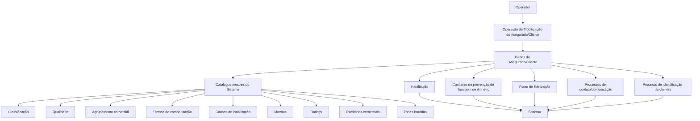

# Modificação e Complementação de Informações do Asegurado/Cliente

## 1. Metadados do Documento
- **Arquivo de Origem:** Não identificado — conteúdo bruto fornecido pelo solicitante
- **Tipo de Documento:** Manual Operacional / Especificação Funcional
- **Domínio / Sistema:** Cadastro de Clientes/Asegurados em sistema de entidade seguradora
- **Público-Alvo:** Operação, Analistas Funcionais, Desenvolvedores e Negócio
- **Data/Versão Identificada:** Não identificada

---

## 2. Resumo Executivo & Contexto de Negócio

O documento descreve uma operação de manutenção cadastral destinada a **modificar**, **complementar** ou **inabilitar** informações previamente registradas de um Asegurado/Cliente. A operação considera dados aplicáveis a pessoas físicas e pessoas jurídicas, salvo quando houver indicação expressa em contrário.

A manutenção cadastral é sustentada por catálogos mestres configurados no Sistema. Diversos atributos exigem códigos pertencentes a catálogos específicos, incluindo classificação, qualidade, agrupamento comercial, formas de compensação, causas de inabilitação, moedas, ratings, escritórios comerciais e zonas horárias.

O documento também reúne atributos ligados a controles operacionais e regulatórios. Entre eles estão a inabilitação do Asegurado, o controle relacionado à prevenção de lavagem de dinheiro, o aviso de operações para pessoas jurídicas e o limite de valores de prêmios configurado para as Companhias no Sistema.

Adicionalmente, a especificação contempla informações comerciais e de relacionamento, como grupo empresarial, faturamento anual estimado, número de empregados, escritório comercial, condição de Cliente Importante/V.I.P., preferências de comunicação por meio do indicador Robinson e participação em plano de fidelização.

Não há detalhamento de interfaces, métodos HTTP, contratos JSON, persistência, serviços, integrações técnicas, permissões de acesso ou fluxos de aprovação. O conteúdo é predominantemente funcional e descreve o significado dos campos cadastrais.

---

## 3. Arquitetura, Componentes & Tecnologias Envolvidas

Os componentes funcionais identificados são:

| Componente / Entidade | Papel descrito |
| :--- | :--- |
| Operação de Modificação de Asegurado/Cliente | Permite modificar, complementar ou inabilitar informações já registradas. |
| Sistema | Mantém os dados do Asegurado/Cliente, catálogos mestres e informações automáticas de captura. |
| Asegurado/Cliente | Entidade cadastrada cujas informações podem ser alteradas ou complementadas. |
| Entidade Seguradora | Organização que utiliza os dados em processos operacionais, cobranças, identificação de clientes e controles de prevenção de lavagem de dinheiro. |
| Catálogos mestres | Fontes de valores configurados para atributos como classificação, qualidade, agrupamentos, compensações, causas de inabilitação, moedas, ratings, escritórios comerciais e zonas horárias. |
| Processo de Identificação de Clientes | Processo no qual pode ser registrada a data real de entrega de documentação pelo Asegurado. |
| Configuração de Companhias | Configuração no Sistema que pode estabelecer controles para limitar importes de prêmios. |
| Plano de Fidelização | Mecanismo para registrar adesão, pontos, datas, identificador e uma apólice vigente associada ao Asegurado. |
| Processos de contato/comunicação | Processos que devem considerar os consentimentos do Asegurado por meio do atributo Robinson. |



> **Nota de Análise:** O documento menciona “Sistema”, “catálogos maestros”, “Compañías” e “entidad aseguradora”, mas não identifica produto, versão, tecnologia, banco de dados, microsserviços, APIs, URLs ou ambientes.

---

## 4. Regras de Negócio, Especificações Funcionais & Processos

### 4.1 Operações disponíveis

A operação disponibiliza duas ações possíveis:

1. **MODIFICAR:** utilizada para alterar ou complementar informações do Asegurado/Cliente previamente registradas.
2. **INHABILITAR:** utilizada para indicar que o Asegurado está inabilitado no Sistema.

### 4.2 Aplicabilidade dos atributos

- Quando o documento não especificar ou indicar expressamente uma restrição, os atributos devem ser utilizados tanto para **Pessoas Físicas** quanto para **Pessoas Jurídicas**.
- A sequência de captura dos campos segue uma estrutura apresentada como leitura da esquerda para a direita e de cima para baixo. A extração fornecida não contém a estrutura visual completa dessa tela ou formulário.

### 4.3 Regras de classificação e cobrança

- A **Classificação** do Asegurado deve corresponder a um valor existente no catálogo mestre do Sistema.
- A **Qualidade do Asegurado** deve corresponder a um código configurado no catálogo mestre de códigos de qualidade.
- O **Agrupamento Comercial do Asegurado** deve corresponder a uma agrupação configurada no catálogo mestre de agrupamentos.
- O **Tipo de Retenção** contém o código de um tipo de retenção configurado localmente pela Entidade Seguradora.
- A **Forma de Cobro/Pago** deve indicar o código da forma de cobrança/pagamento conforme as formas de compensação definidas no catálogo mestre.
- O **Dia Sugerido de Pagamento** registra o dia sugerido pelo Asegurado para que a entidade seguradora realize cobranças relacionadas ao pagamento dos prêmios dos seguros contratados.

### 4.4 Regras de inabilitação

- O atributo **Inhabilitación** informa ao Sistema que o Asegurado está inabilitado.
- Um Asegurado inabilitado não deve ser empregado, contemplado ou considerado nos processos operacionais da entidade.
- Caso o Asegurado esteja inabilitado, a **Causa de Inhabilitação** deve conter o código de uma causa definida no catálogo mestre do Sistema.

### 4.5 Prevenção de lavagem de dinheiro e identificação

- O campo **Aviso de Operaciones** aplica-se quando o Terceiro for uma Pessoa Jurídica e o controle de prevenção de lavagem de dinheiro estiver ativado.
- Nessa condição, o campo indica se será necessário avisar algum contato do Terceiro.
- O contato a ser avisado deve estar obrigatoriamente identificado como **Tercero de Referencia**.
- O campo **Primas Mayores a...** relaciona-se ao controle de prevenção de lavagem de dinheiro que a Entidade Seguradora pode estabelecer na configuração das Companhias no Sistema.
- Esse controle é utilizado para limitar os importes dos prêmios dos Asegurados.
- A **Moneda** deve conter o código da moeda na qual foi expresso o valor de **Primas Mayores a...**, conforme o catálogo mestre de moedas configurado.
- A **Fecha Registro** deve registrar a data real em que o Asegurado entrega a documentação solicitada pela entidade seguradora, quando a entrega documental fizer parte do Processo de Identificação de Clientes.
- A **Fecha Registro** não deve ser confundida com a data de captura do Asegurado no Sistema, pois a data de captura é registrada automaticamente nos catálogos de informação.

### 4.6 Dados comerciais e organizacionais

- **Número de Empleados** armazena o número de empregados do Asegurado.
- **Facturación** armazena o importe estimado da faturação anual do Asegurado.
- **Grupo Empresarial** deve conter o código do grupo empresarial ao qual o Asegurado pertence, conforme relação de grupos empresariais identificados.
- **Tipo de Rating** deve conter a qualificação atribuída ao Asegurado, conforme catálogo mestre de classificações/rating.
- **Oficina Comercial** contém o código do terceiro nível da estrutura comercial, de acordo com o catálogo mestre de escritórios comerciais.

### 4.7 Zona horária

- A **Zona Horaria** deve conter o código da zona horária associada ao Asegurado, conforme relação de zonas horárias habilitadas no Sistema.
- O documento distingue “huso horario” como faixas geográficas virtuais delimitadas por meridianos e “zona horaria” como região geográfica que compartilha a mesma hora oficial.
- O documento apresenta como exemplos:
  - Espanha: duas zonas horárias, distinguindo Península Ibérica e Ilhas Canárias.
  - México: quatro zonas horárias, distinguindo Zona Sudeste, Zona Centro, Zona do Pacífico e Zona Noroeste.

### 4.8 Fidelização e comunicação

- O campo **Fidelización** determina se o Asegurado deve ser considerado nos processos da entidade que envolvem um Plano de Fidelização.
- Por padrão, a marca de Fidelização é apresentada desmarcada nessa operação.
- Ao clicar na marca de Fidelização, são habilitados campos para inclusão de:
  - data de alta;
  - identificador do Plano;
  - número da apólice.
- O campo **Robinson** indica se o Asegurado deve ou não ser incluído em processos que impliquem algum tipo de contato ou comunicação, conforme os consentimentos concedidos pelo Asegurado.
- A marca **Asegurado V.I.P** identifica o Asegurado como Cliente Importante.
- Se o Asegurado estiver incluído no Plano de Fidelização:
  - **Puntos Plan de Fidelización** mostra o número de pontos acumulados;
  - **Fecha de ALTA en el Plan de Fidelización** contém a data de entrada no plano;
  - **Fecha de BAJA en el Plan de Fidelización** contém a data de saída do plano, quando aplicável;
  - **Identificador en el Plan de Fidelización** apresenta o número de sócio, código ou chave identificadora;
  - **Póliza del Plan de Fidelización** permite capturar, sem obrigatoriedade, o número de uma apólice vigente em que o Cliente/Asegurado figure como Tomador.

---

## 5. Tabelas de Parâmetros, Ambientes e Estruturas de Dados

| Item / Parâmetro | Descrição / Função | Tipo / Valores / Formato | Ambiente / Observações |
| :--- | :--- | :--- | :--- |
| Ação MODIFICAR | Modifica ou complementa informações previamente registradas do Asegurado/Cliente. | Ação operacional. | Disponível na operação descrita. |
| Ação INHABILITAR | Inabilita o Asegurado/Cliente no Sistema. | Ação operacional. | Implica tratamento operacional descrito para Inhabilitación. |
| Classificação | Classificação do Asegurado. | Valor de catálogo mestre. | Deve existir no catálogo mestre do Sistema. |
| Qualidade do Asegurado | Qualidade atribuída ao Asegurado. | Código de catálogo. | Catálogo mestre de códigos de qualidade configurado. |
| Agrupamento Comercial do Asegurado | Agrupação comercial do Asegurado. | Valor de catálogo. | Catálogo mestre de agrupamentos configurado. |
| Tipo de Retenção | Código de um tipo de retenção. | Código. | Configurado localmente pela Entidade Seguradora. |
| Forma de Cobro/Pago | Forma de cobrança ou pagamento do Asegurado. | Código. | Deve corresponder a uma forma de compensação do catálogo mestre. |
| Dia Sugerido de Pago | Dia sugerido pelo Asegurado para realização de cobranças de prêmios. | Dia. | Relacionado a seguros contratados pelo Asegurado. |
| Inhabilitación | Indica que o Asegurado está inabilitado. | Propriedade / marca. | Asegurado não deve ser empregado, contemplado ou considerado nos processos operacionais. |
| Causa de Inhabilitación | Motivo da inabilitação do Asegurado. | Código. | Utilizado quando o Asegurado estiver inabilitado; definido em catálogo mestre. |
| Observaciones | Captura informações adicionais sobre o Asegurado. | Texto não especificado. | Conforme diretrizes da Direção de Clientes/Técnica da entidade seguradora. |
| Aviso de Operaciones | Define se algum contato do Terceiro deve ser avisado. | Indicador não especificado. | Aplicável a Pessoa Jurídica com controle de prevenção de lavagem de dinheiro ativado. O contato deve ser Tercero de Referencia. |
| Primas Mayores a... | Valor relacionado à limitação de importes de prêmios. | Valor não especificado. | Relacionado à prevenção de lavagem de dinheiro e à configuração de Companhias no Sistema. |
| Moneda | Moeda usada para expressar Primas Mayores a.... | Código de moeda. | Deve existir no catálogo mestre de moedas configurado. |
| Número de Empleados | Quantidade de empregados do Asegurado. | Número. | Sem formato adicional especificado. |
| Facturación | Importe estimado da faturação anual do Asegurado. | Importe. | Sem moeda ou formato explícito além da descrição. |
| Grupo Empresarial | Grupo empresarial ao qual o Asegurado pertence. | Código. | Conforme relação de grupos empresariais identificados. |
| Tipo de Rating | Qualificação atribuída ao Asegurado. | Valor de catálogo. | Catálogo mestre de classificações/rating configurado. |
| Oficina Comercial | Código do terceiro nível da estrutura comercial. | Código. | Catálogo mestre de escritórios comerciais. |
| Fecha Registro | Data real da entrega de documentação pelo Asegurado. | Data. | Usada quando a entrega documental integra o Processo de Identificação de Clientes; não é a data automática de captura no Sistema. |
| Zona Horaria | Zona horária associada ao Asegurado. | Código de zona horária. | Deve existir entre as zonas horárias habilitadas no Sistema. |
| Fidelización | Indica participação do Asegurado em Plano de Fidelização. | Marca / indicador. | Exibida desmarcada por padrão; habilita campos adicionais ao ser marcada. |
| Robinson | Indica inclusão ou exclusão do Asegurado em processos de contato/comunicação. | Indicador não especificado. | Deve respeitar os consentimentos concedidos pelo Asegurado. |
| Asegurado V.I.P | Identifica o Asegurado como Cliente Importante. | Marca / indicador. | Sem condições adicionais descritas. |
| Puntos Plan de Fidelización | Pontos acumulados pelo Asegurado no plano. | Número de pontos. | Aplicável se o Asegurado estiver incluído no Plano de Fidelização. |
| Fecha de ALTA en el Plan de Fidelización | Data de adesão ao Plano de Fidelização. | Data. | Aplicável se o Asegurado estiver incluído no plano. |
| Fecha de BAJA en el Plan de Fidelización | Data de desligamento do Plano de Fidelização. | Data. | Aplicável quando o Asegurado esteve incluído no plano. |
| Identificador en el Plan de Fidelización | Número de sócio, código ou chave do Asegurado no plano. | Identificador. | Aplicável se o Asegurado estiver incluído no plano. |
| Póliza del Plan de Fidelización | Número de uma apólice vigente associada ao plano. | Número de apólice. | Captura não obrigatória; o Cliente/Asegurado deve figurar como Tomador da apólice. |

---

## 6. Bateria de Perguntas & Respostas para RAG (FAQ Sintético)

### P1: Quais ações estão disponíveis na operação de manutenção de Asegurado/Cliente?
**R:** A operação disponibiliza as ações **MODIFICAR** e **INHABILITAR**. MODIFICAR permite alterar ou complementar dados previamente registrados do Asegurado/Cliente. INHABILITAR permite indicar ao Sistema que o Asegurado está inabilitado.

### P2: O que acontece quando o campo Inhabilitación é marcado?
**R:** Quando o campo **Inhabilitación** indica que o Asegurado está inabilitado, o Sistema deve considerar que esse Asegurado não deve ser empregado, contemplado ou considerado nos processos operacionais da entidade. Nessa situação, a Causa de Inhabilitación deve conter um código definido no catálogo mestre do Sistema.

### P3: Como é definida a Forma de Cobro/Pago do Asegurado?
**R:** A **Forma de Cobro/Pago** deve informar o código da forma de cobrança ou pagamento do Asegurado conforme as possíveis formas de compensação definidas no catálogo mestre de compensações.

### P4: Para que serve o campo Aviso de Operaciones?
**R:** O campo **Aviso de Operaciones** é aplicável quando o Terceiro for uma Pessoa Jurídica e o controle de prevenção de lavagem de dinheiro estiver ativado. O campo indica se um contato do Terceiro deverá ser avisado. Esse contato deve estar obrigatoriamente identificado como Tercero de Referencia.

### P5: Qual é a finalidade de Primas Mayores a... e Moneda?
**R:** **Primas Mayores a...** está relacionado ao controle de prevenção de lavagem de dinheiro configurável pela Entidade Seguradora para limitar os importes dos prêmios dos Asegurados. **Moneda** contém o código da moeda em que o valor de Primas Mayores a... foi expresso, conforme o catálogo mestre de moedas configurado.

### P6: A Fecha Registro é a mesma data de criação do Asegurado no Sistema?
**R:** Não. A **Fecha Registro** representa a data real em que o Asegurado entrega a documentação solicitada pela entidade seguradora, quando essa entrega faz parte do Processo de Identificação de Clientes. O documento informa expressamente que essa data não deve ser confundida com a data de captura do Asegurado no Sistema, que é registrada automaticamente nos catálogos de informação.

### P7: Como a Zona Horaria deve ser preenchida?
**R:** A **Zona Horaria** deve conter o código da zona horária associada ao Asegurado, conforme a relação de zonas horárias habilitadas no Sistema. O documento cita como exemplos a Espanha, com duas zonas horárias, e o México, com quatro zonas horárias.

### P8: O que ocorre ao marcar Fidelización?
**R:** A marca **Fidelización** define se o Asegurado será considerado nos processos da entidade relacionados ao Plano de Fidelização. Nessa operação, a marca é apresentada desmarcada por padrão. Ao marcá-la, são habilitados os campos para informar data de alta, identificador do Plano e número da apólice.

### P9: Quais informações do Plano de Fidelização podem ser mantidas?
**R:** Para um Asegurado incluído no Plano de Fidelização, o documento prevê pontos acumulados, data de alta, data de baixa, identificador no plano e uma apólice do plano. A apólice é opcional e deve ser uma apólice vigente em que o Cliente/Asegurado figure como Tomador.

### P10: Para que serve o indicador Robinson?
**R:** O indicador **Robinson** informa se o Asegurado deve ou não ser incluído em processos da entidade que impliquem qualquer tipo de contato ou comunicação. Essa decisão deve respeitar os consentimentos concedidos pelo Asegurado.

### P11: Quais atributos dependem de catálogos mestres do Sistema?
**R:** O documento vincula a catálogos mestres ou relações configuradas os campos Classificação, Qualidade do Asegurado, Agrupamento Comercial do Asegurado, Forma de Cobro/Pago, Causa de Inhabilitación, Moneda, Tipo de Rating, Oficina Comercial e Zona Horaria. Grupo Empresarial também depende de uma relação de grupos empresariais identificados.

### P12: O que identifica um Asegurado como Cliente Importante?
**R:** A marca **Asegurado V.I.P** permite identificar o Asegurado como um Cliente Importante. O documento não detalha critérios de elegibilidade, permissões ou impactos adicionais dessa classificação.

---

## 7. Glossário de Termos, Siglas & Conceitos-Chave

- **Asegurado:** Cliente ou entidade cadastrada que possui seguros contratados ou informações geridas pela entidade seguradora.
- **Asegurado V.I.P:** Marca utilizada para identificar o Asegurado como Cliente Importante.
- **Catálogo mestre:** Relação de valores configurada no Sistema para suportar o preenchimento de atributos codificados.
- **Compensação:** Referência às possíveis formas de cobrança/pagamento definidas no catálogo mestre de compensações.
- **Entidad Aseguradora:** Organização seguradora responsável pela gestão de processos, cobranças, identificação e configurações mencionadas.
- **Facturación:** Importe estimado da faturação anual do Asegurado.
- **Fidelización:** Participação do Asegurado em processos relacionados a um Plano de Fidelização.
- **Inhabilitación:** Propriedade que indica que o Asegurado está inabilitado no Sistema.
- **Oficina Comercial:** Terceiro nível da estrutura comercial, representado por código configurado.
- **Plan de Fidelización:** Plano associado ao Asegurado que pode manter pontos, datas, identificador e apólice.
- **Primas:** Valores dos prêmios dos seguros contratados pelo Asegurado.
- **Rating:** Qualificação atribuída ao Asegurado conforme catálogo mestre de classificações/rating.
- **Robinson:** Dado que define se o Asegurado deve ser incluído em processos de contato/comunicação conforme consentimentos concedidos.
- **Tercero:** Entidade referida no contexto de Pessoa Jurídica e de contatos relacionados ao aviso de operações.
- **Tercero de Referencia:** Contato do Terceiro que deve estar obrigatoriamente identificado quando for necessário o aviso de operações.
- **Tomador:** Figura do Cliente/Asegurado em uma apólice vigente usada como referência opcional no Plano de Fidelização.
- **Zona Horaria:** Região geográfica que compartilha uma mesma hora oficial e cujo código pode ser associado ao Asegurado.

---

## 8. Notas Críticas, Riscos & Limitações

- O documento não informa o nome do Sistema, fabricante, arquitetura técnica, versão, URLs, ambientes, APIs, serviços, banco de dados ou contratos de integração.
- O conteúdo não especifica formatos técnicos, tamanhos máximos, obrigatoriedade, tipos de dados, máscaras, validações de tela ou mensagens de erro para a maior parte dos atributos.
- A sequência de captura é mencionada como da esquerda para a direita e de cima para baixo, mas a estrutura visual de campos não está presente na extração.
- O campo **Observaciones** é descrito de forma aberta e dependente de diretrizes da Direção de Clientes/Técnica; o documento não define estrutura, limite ou regras de preenchimento.
- O documento não detalha quais valores compõem os catálogos mestres, nem os responsáveis pela manutenção desses catálogos.
- Não são informados critérios para habilitar o controle de prevenção de lavagem de dinheiro, limites de prêmios, regras de notificação ou comportamento operacional do aviso de operações.
- Não são especificados critérios para conceder a condição de Asegurado V.I.P. ou para aderir, alterar e encerrar a participação no Plano de Fidelização.
- Não são detalhados os consentimentos associados ao indicador Robinson, nem os tipos de comunicação impactados além da referência genérica a contato/comunicação.

---

## 9. Conteúdo Bruto Estruturado (Referência Fiel)

```text
--- [PÁGINA 1 DE 5] ---

MODIFICAR Información específica del
Asegurado/Cliente
Objetivo
Esta Operación permite Modificar o Complementar la información del Asegurado/Cliente registrada
previamente además de poder Inhabilitarlo.
Posibles Acciones
 MODIFICAR ( )
 INHABILITAR ( )
Datos Clientes/Asegurados
De Izquierda a Derecha y de Arriba hacia Abajo, los siguientes atributos marcan la secuencia de
captura de los Campos en esta Estructura de Información.
 / 
 RS
Inicio Soluciones APIs Documentación Zeus
ES


--- [PÁGINA 2 DE 5] ---

(Si no se especifica o indica expresamente, los Atributos se emplearán tanto en Personas Físicas
como en Personas Jurídicas).
Clasificación (  )
Este Campo contendrá la clasificación del Asegurado de acuerdo con la relación de valores
existentes en el catálogo maestro existente en el Sistema.
Calidad del Asegurado (  )
Este Campo contendrá la calidad del Asegurado de acuerdo con la relación de valores existentes en
el catálogo maestro de códigos de calidad configurado en el Sistema.
Agrupamiento Comercial del Asegurado (  )
Este Campo contendrá la Agrupación Comercial del Asegurado de acuerdo con la relación de valores
definidos en el catálogo maestro de agrupaciones configurado en el Sistema.
Tipo de Retención (  )
Este Dato contiene el código de uno de los Tipos de Retención configurados localmente por la
Entidad Aseguradora.
Forma de Cobro/Pago (  )
Este Dato indicará el Código de la Forma de Cobro/Pago del Asegurado de acuerdo con las posibles
Formas de Compensación definidas en el catálogo maestro de compensaciones.
Día Sugerido de Pago ( )
Este Campo del Asegurado indica el día que éste sugiere para que la entidad aseguradora realice los
cargos correspondientes para realizar el pago de las primas de los Seguros que tenga contratados.
Inhabilitación ( )
Esta propiedad le indica al Sistema que el Asegurado está inhabilitado en el Sistema por lo que no
debería ser empleado, contemplado o considerado en los procesos operativos de la entidad.
Causa de Inhabilitación (   )
En el supuesto que el Asegurado estuviera Inhabilitado, este Atributo contendrá el código de una
causa de inhabilitación definida en el catálogo maestro del Sistema.
Observaciones ( )


--- [PÁGINA 3 DE 5] ---

El propósito de este campo permite capturar información adicional del Asegurado de acuerdo con los
Planteamientos o directrices que pudieran efectuar la Dirección de Clientes/Técnica de la entidad
aseguradora.
Aviso de Operaciones (  )
En en el caso que el Tercero sea una Persona Jurídica y el control en la prevención del lavado de
dinero esté activado, este campo indica si se va o no a tener que avisar a algún contacto del
Tercero que tendrá obligatoriamente que estar identificado como Tercero de Referencia.
Primas Mayores a ...
Esta Dato del Asegurado está relacionado con el control en la prevención del lavado de dinero que la
Entidad Aseguradora puede establecer en la configuración de las Compañías en el Sistema, para
limitar los importes de las Primas de los Asegurados.
Moneda
Este Campo contendrá el código de la Moneda en la que se ha expresado el valor del campo Primas
Mayores a... del Asegurado de acuerdo con la relación de valores existentes en el catálogo maestro
de Monedas configurado en el Sistema.
Número de Empleados ( )
Este Contiene el número de empleados del Asegurado.
Facturación ( )
Este Atributo contendrá el importe de la Facturación Anual estimada del Asegurado.
Grupo Empresarial (  )
Este Campo contendrá el código del Grupo Empresarial al que pertenece el Asegurado de acuerdo a
la posible relación de grupos empresariales identificados.
Tipo de Rating (  )
Este Campo contendrá la Calificación asignada al Asegurado de acuerdo con la relación de valores
existentes en el catálogo maestro de calificaciones/rating configurado en el Sistema.
Oficina Comercial (  )
Este Dato contiene el código del Tercer Nivel de la Estructura Comercial de acuerdo con la relación
de valores existentes en el catálogo maestro de oficinas comerciales configurado en el Sistema.
Fecha Registro ( )


--- [PÁGINA 4 DE 5] ---

Este Dato se debe utilizar para registrar la fecha real en la que el Asegurado entrega la
documentación solicitada por la entidad aseguradora en aquellas entidades que tienen esta tarea
como parte del Proceso de Identificación de sus Clientes.
No confundir con la Fecha en la que se captura el Asegurado en el Sistema y que
automáticamente se registra en los catálogos de información.
Zona Horaria (  )
Un huso horario es cada una de las franjas geográficas virtuales, orientadas de norte a sur,
limitadas por meridianos igualmente espaciados, en las que se divide un planeta y en las que suele
regir una misma hora oficial.
Una zona horaria en cambio, es una región geográfica que comparte una misma hora oficial. Las
zonas horarias se han construido a partir de los husos horarios aunque no siguen fielmente sus
trazos, pues cada país ajusta su hora oficial libremente y con frecuencia no coinciden estrictamente
con la convención geográfica.
Este Campo contendrá el código de la Zona Horaria asociada del Asegurado de acuerdo a la posible
relación de zonas horarias habilitadas en el Sistema.
Por ejemplo,
España tiene dos zonas horarias para distinguir la zona horaria de la Península Ibérica de la
zona horaria de las Islas Canarias.
México tiene cuatro zonas horarias diferentes para distinguir la Zona Sureste, la Zona Centro, la
Zona del Pacífico y la Zona Noroeste.
Fidelización ( )
Este Campo permite contemplar o no en los procesos de la entidad si el Asegurado cuenta con un
Plan de Fidelización.
Al hacer click sobre la marca (en esta operación se muestra desmarcada por Defecto) se habilitan los
campos correspondientes para poder ingresar la fecha de alta, el identificador del Plan y el número
de la póliza.
Robinson ( )
Este Dato permite conocer si el Asegurado se debe incluir o no en los procesos de la entidad que
impliquen cualquier tipo de contacto/comunicación con el , todo ello de acuerdo con los
consentimientos otorgados por el Asegurado.
Consejo:


--- [PÁGINA 5 DE 5] ---

Asegurado V.I.P ( )
Esta marca permite identificar al Asegurado como un Cliente Importante.
Puntos Plan de Fidelización
En el supuesto que el Asegurado esté incluido en el Plan de Fidelización de la Entidad, este campo
muestra el número de puntos acumulados que tiene el Asegurado.
Fecha de ALTA en el Plan de Fidelización ( )
En el supuesto que el Asegurado esté incluido en el Plan de Fidelización de la Entidad, este dato
contiene la Fecha de Alta en el mismo.
Fecha de BAJA en el Plan de Fidelización ( )
En el supuesto que el Asegurado estuviera incluido en el Plan de Fidelización de la Entidad, este
dato contendría la Fecha de Baja del Asegurado en el Plan de Fidelización.
Identificador en el Plan de Fidelización ( )
En el supuesto que el Asegurado esté incluido en el Plan de Fidelización de la Entidad, este dato
muestra el Número de Socio, código o clave identificadora del Asegurado en el Plan.
Póliza del Plan de Fidelización (  )
Por último y en el supuesto que el Asegurado esté incluido en el Plan de Fidelización de la Entidad,
este Dato permitirá capturar (no es una acción obligatoria) el número de una de las pólizas en vigor
en las que el la figura del Cliente/Asegurado se corresponde con El Tomador de la misma.
```
