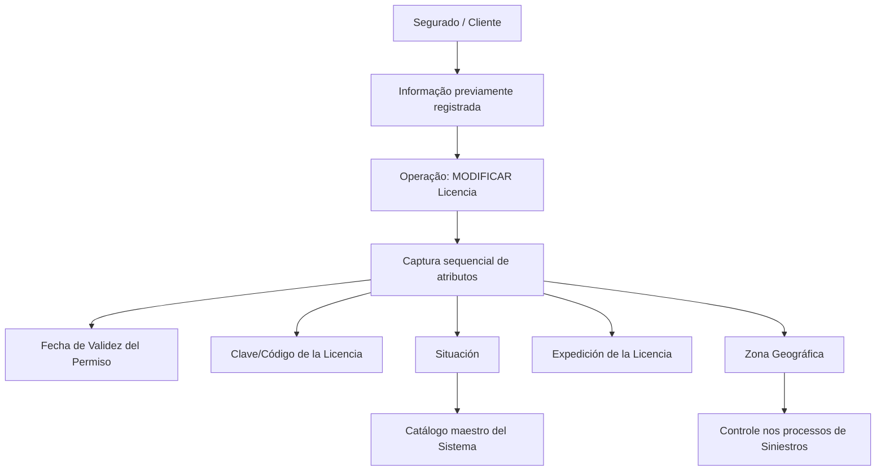

# Modificação de Licença de Conduzir do Segurado — Operação e Atributos de Captura

## 1. Metadados do Documento
- **Arquivo de Origem:** Não identificado
- **Tipo de Documento:** Especificação Técnica
- **Domínio / Sistema:** Soluções APIs / Documentação Zeus
- **Público-Alvo:** Desenvolvedores, Analistas Funcionais e Operação
- **Data/Versão Identificada:** Não identificada

---

## 2. Resumo Executivo & Contexto de Negócio

O documento descreve a operação **“MODIFICAR Licencia de Conducir del Asegurado”**, destinada a modificar ou complementar informações de licença de conduzir previamente registradas para um Segurado/Cliente.

A ação habilitada explicitamente é **MODIFICAR Licencia**. A captura de informações segue uma sequência de apresentação definida visualmente no sistema: da esquerda para a direita e de cima para baixo.

Os atributos documentados representam validade, identificação, situação, local de expedição e zona geográfica de aplicação da licença. O atributo de zona geográfica é relevante para habilitar controle da licença nos processos de **Siniestros** da entidade.

O conteúdo não apresenta métodos HTTP, contratos JSON, regras de persistência, endpoints, autenticação, mensagens de erro ou detalhamento dos valores de catálogo. A documentação disponível está restrita à operação e à semântica dos atributos exibidos.

---

## 3. Arquitetura, Componentes & Tecnologias Envolvidas

Componentes e referências identificados:

- **Soluções APIs**
- **Documentação Zeus**
- **Operação MODIFICAR Licencia**
- **Informação do Asegurado/Cliente**
- **Catálogo mestre do Sistema**
- **Processos de Siniestros**
- **Sistema**, sem nome técnico adicional informado



> **Nota de Análise:** O documento menciona “Soluções APIs” e “Documentação Zeus”, mas não detalha interfaces, serviços, protocolos, tecnologias, URLs ou contratos de integração.

---

## 4. Regras de Negócio, Especificações Funcionais & Processos

1. A operação permite **modificar ou complementar** informações previamente registradas para o **Asegurado/Cliente**.
2. A ação habilitada indicada pelo documento é **MODIFICAR Licencia**.
3. A sequência de captura dos atributos no sistema deve seguir a ordem visual:
   - Da esquerda para a direita.
   - De cima para baixo.
4. A **Fecha de Validez del Permiso** indica a data de validade da licença ou permissão de condução do Tercero.
5. A **Clave/Código de la Licencia** identifica a chave ou o código da licença de conduzir.
6. A **Situación** indica o estado da licença do Tercero, de acordo com os valores possíveis configurados no catálogo mestre do Sistema.
7. A **Expedición de la Licencia** contém o segundo nível da estrutura geográfica ou o estado no qual a licença foi emitida.
8. A **Zona Geográfica** contém o âmbito geográfico de aplicação ou utilização da licença de conduzir do Segurado.
9. A **Zona Geográfica** habilita o controle da licença nos processos de Siniestros da entidade.

---

## 5. Tabelas de Parâmetros, Ambientes e Estruturas de Dados

| Item / Parâmetro | Descrição / Função | Tipo / Valores / Formato | Ambiente / Observações |
| :--- | :--- | :--- | :--- |
| Operação | Modifica ou complementa informação previamente registrada do Asegurado/Cliente. | MODIFICAR Licencia | Nenhum ambiente informado. |
| Sequência de captura | Define a ordem de captura das informações na interface. | Da esquerda para a direita; de cima para baixo. | Aplicável aos atributos documentados. |
| Fecha de Validez del Permiso | Indica a data de validade da licença ou permissão de condução do Tercero. | Data; formato não informado. | Não há regra de validação detalhada. |
| Clave/Código de la Licencia | Identifica a chave ou código da licença de conduzir. | Código/chave; formato não informado. | Não há catálogo ou estrutura informada. |
| Situación | Indica o estado da licença do Tercero. | Valores configurados no catálogo mestre do Sistema. | Os valores possíveis não foram fornecidos. |
| Expedición de la Licencia | Contém o segundo nível da estrutura geográfica ou estado onde a licença foi emitida. | Referência geográfica/estado. | Estrutura geográfica completa não informada. |
| Zona Geográfica | Contém o âmbito geográfico de aplicação ou uso da licença de conduzir do Segurado. | Referência geográfica; formato não informado. | Habilita controle em processos de Siniestros. |
| Catálogo maestro del Sistema | Fonte dos possíveis valores para o atributo Situación. | Catálogo configurável; valores não informados. | Nenhum mecanismo de administração descrito. |
| Siniestros | Processos da entidade que utilizam o controle habilitado pela Zona Geográfica. | Processo corporativo. | Fluxo de integração não detalhado. |

---

## 6. Bateria de Perguntas & Respostas para RAG (FAQ Sintético)

### P1: Qual é o objetivo da operação MODIFICAR Licencia?
**R:** A operação MODIFICAR Licencia permite modificar ou complementar informações do Asegurado/Cliente que tenham sido registradas previamente no sistema.

### P2: Qual ação está habilitada no documento para a licença de conduzir?
**R:** A ação explicitamente habilitada é **MODIFICAR Licencia**.

### P3: Qual é a ordem de captura dos dados da licença no sistema?
**R:** Os atributos devem ser capturados na sequência visual da esquerda para a direita e de cima para baixo.

### P4: O que representa o atributo Fecha de Validez del Permiso?
**R:** Fecha de Validez del Permiso informa a data de validade da licença ou permissão de condução do Tercero. O documento não especifica o formato da data nem regras de validação.

### P5: Qual é a finalidade de Clave/Código de la Licencia?
**R:** Clave/Código de la Licencia identifica a chave ou o código da licença de conduzir. O documento não informa tamanho, máscara ou catálogo de códigos permitido.

### P6: De onde vêm os valores possíveis do atributo Situación?
**R:** Os valores possíveis de Situación são configurados no catálogo mestre do Sistema. O documento não lista os estados disponíveis nem suas regras de transição.

### P7: O que é informado em Expedición de la Licencia?
**R:** Expedición de la Licencia contém o segundo nível da estrutura geográfica, ou o estado, no qual a licença foi emitida.

### P8: Qual é a finalidade da Zona Geográfica da licença?
**R:** Zona Geográfica registra o âmbito geográfico de aplicação ou uso da licença de conduzir do Segurado e habilita seu controle nos processos de Siniestros da entidade.

### P9: O documento define APIs, métodos HTTP ou contratos JSON para MODIFICAR Licencia?
**R:** Não. O conteúdo menciona Soluções APIs e Documentação Zeus, porém não detalha endpoints, métodos HTTP, contratos JSON, autenticação, versões ou mensagens de erro.

### P10: O documento informa quais campos são obrigatórios para modificar uma licença?
**R:** Não. O documento descreve os atributos exibidos e sua sequência de captura, mas não classifica campos como obrigatórios, opcionais ou condicionais.

---

## 7. Glossário de Termos, Siglas & Conceitos-Chave

- **Asegurado:** Segurado; entidade para a qual a licença de conduzir é registrada ou atualizada.
- **Cliente:** Cliente associado à informação previamente registrada, conforme a descrição da operação.
- **Clave/Código de la Licencia:** Chave ou código que identifica a licença de conduzir.
- **Expedición de la Licencia:** Local de emissão da licença, representado pelo segundo nível da estrutura geográfica ou por um estado.
- **MODIFICAR Licencia:** Ação habilitada para modificar ou complementar a informação de licença.
- **Siniestros:** Processos da entidade nos quais a Zona Geográfica habilita controle da licença.
- **Situación:** Estado da licença do Tercero conforme valores configurados no catálogo mestre do Sistema.
- **Tercero:** Termo usado pelo documento para a pessoa cuja licença ou permissão de condução possui validade e situação registradas.
- **Zona Geográfica:** Âmbito geográfico de aplicação ou utilização da licença de conduzir do Segurado.

---

## 8. Notas Críticas, Riscos & Limitações

- O documento não identifica nome de arquivo, data, versão, autor ou responsável técnico.
- Não há definição de endpoint, método HTTP, contrato JSON, esquema de dados, autenticação ou tratamento de erros.
- Os valores possíveis para **Situación** não são enumerados; apenas é informado que são configurados no catálogo mestre do Sistema.
- Não são fornecidos formatos, tamanhos, obrigatoriedade ou critérios de validação para **Fecha de Validez del Permiso** e **Clave/Código de la Licencia**.
- A estrutura geográfica usada em **Expedición de la Licencia** e **Zona Geográfica** não é detalhada.
- A relação entre Zona Geográfica e os processos de Siniestros é mencionada, mas não há fluxo operacional, regras de bloqueio ou comportamento de integração descritos.

---

## 9. Conteúdo Bruto Estruturado (Referência Fiel)

```text
--- [PÁGINA 1 DE 2] ---

MODIFICAR Licencia de Conducir del
Asegurado
Esta Operación permite Modificar o Complementar la información del Asegurado/Cliente registrada
previamente.
Acciones habilitadas
 MODIFICAR ( )
Licencia.
De Izquierda a Derecha y de Arriba hacia Abajo, los siguientes atributos marcan la secuencia de
captura de la Información en el sistema.
Fecha de Validez del Permiso ( )
Esta propiedad indicará la Fecha de Validez de la Licencia o Permiso de Conducción del Tercero.
Clave/Código de la Licencia ( )
Este Dato identifica la clave o el código de la Licencia de Conducir.
 / 
 RS
Inicio Soluciones APIs Documentación Zeus
ES


--- [PÁGINA 2 DE 2] ---

Situación (  )
Este Atributo indica el estado de la licencia del Tercero de acuerdo con los posibles valores
configurados en el catálogo maestro del Sistema.
Expedición de la Licencia (  )
Este Dato contiene el segundo nivel de la estructura geográfica ó estado, en el que la licencia ha sido
expedida.
Zona Geográfica (  )
Por último, este atributo contiene el ámbito geográfico de aplicación o uso de la Licencia de conducir
del Asegurado, atributo que habilita su control en los procesos de Siniestros de la entidad.
```
